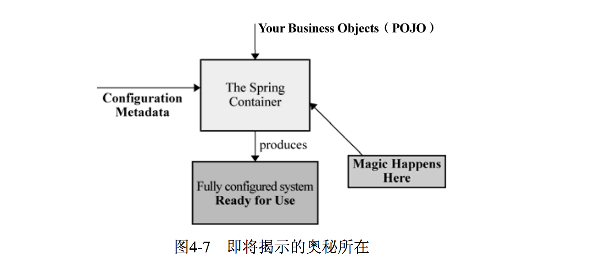
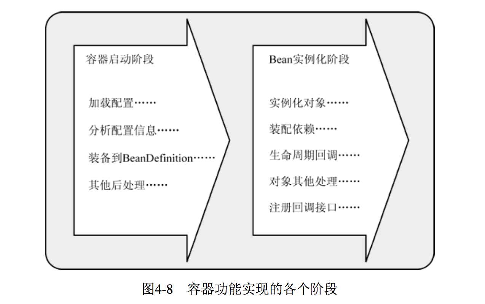
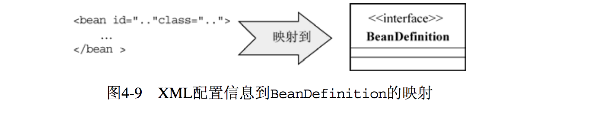
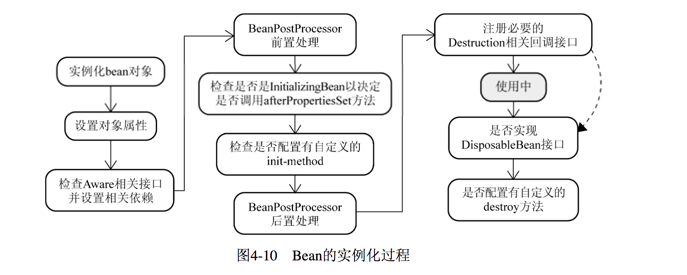

容器背后的秘密
====

好奇的你，想知道Spring的IoC容器内部到底是如何来实现这些的呢？虽然我们不太可能“重新发明轮子”，但是，如下图中的官方文档，只告诉你“Magic Happens Here”，你是否就能心满意足呢？

<div align="center">  </div><br>

## “战略性观望”
IoC容器的作用，就像图4-7所展示的那样，它会以某种方式加载Configuration Metadata（通常是XML格式的配置信息），然后**根据这些信息绑定整个系统的对象，最终组装成一个可用的基于轻量级容器的应用系统**。

IoC容器实现，可以按照类似的流程划分为两个阶段: **容器启动阶段**和 **Bean实例化阶段**，如图4-8所示。

IoC容器在实现的时候，充分运用了这两个阶段的不同特点，在每个阶段都加入了相应的**容器扩展点**，以便我们可以根据具体场景的需要加入自定义的扩展逻辑。

<div align="center">  </div><br>

### 1. 容器启动阶段

启动伊始，首先会**通过某种途径加载Configuration MetaData**。

> 除了代码方式比较直接，在大部分情况下，容器需要依赖某些**工具类**（BeanDefinitionReader）对加载的Configuration  MetaData 进行解析和分析，并将分析后的信息编组为相应的BeanDefinition，最后把这些保存了bean定义必要信息的BeanDefinition，注册到相应的BeanDefinitionRegistry，这样容器启动工作就完成了。
> 
> 图4-9演示了这个阶段的主要工作。

<div align="center">  </div><br>

总的来说，该阶段工作可以认为是**准备性的，重点更加侧重于对象管理信息的收集**。当然，一些验证性或者辅助性的工作也可以在这个阶段完成。

### 2. Bean实例化阶段

经过第一阶段，所有的bean定义信息都通过`BeanDefinition`的方式注册到了 `BeanDefinitionRegistry` 中。当某个**请求方通过容器的getBean方法明确地请求某个对象**，或者因**依赖关系容器需要隐式地调用getBean方法**时，就会触发第二阶段的活动。

该阶段，容器**首先检查所请求的对象之前是否已经初始化**。

> 如果没有，则会根据注册的BeanDefinition所提供的信息实例化被请求对象，并为其注入依赖。
> 
> 如果该对象实现了某些回调接口，也会根据回调接口的要求来装配它。
> 

**当该对象装配完毕之后，容器会立即将其返回请求方使用。**

> 如果说第一阶段只是根据图纸装配生产线的话，那么第二阶段就是使用装配好的生产线来生产具体的产品了。

## 插手“容器的启动”
Spring提供了一种叫做 BeanFactoryPostProcessor 的容器扩展机制。该机制允许我们**在容器实例化相应对象之前**，对注册到容器的**BeanDefinition所保存的信息做相应的修改**。

> 这就相当于在容器实现的第一阶段最后加入一道工序，让我们对最终的BeanDefinition做一些额外的操作，比如修改其中bean定义的某些属性，为bean定义增加其他信息等。

如果要自定义实现BeanFactoryPostProcessor，通常我们需要实现`org.springframework. beans.factory.config.BeanFactoryPostProcessor`接口。同时，因为一个容器可能拥有多个BeanFactoryPostProcessor，可能需要**实现类同时实现Spring的org.springframework.core. Ordered接口**，以保证各个BeanFactoryPostProcessor可以按照预先设定的顺序执行（如果顺序紧要的话）。

但是，Spring已经提供了几个现成的BeanFactoryPostProcessor实现类，我们很少自己去实现某个BeanFactoryPostProcessor。其中， `org.springframework.beans.factory.config.PropertyPlaceholderConfigurer` 和 `org.springframework.beans.factory. config.Property OverrideConfigurer` 是两个比较常用的`BeanFactoryPostProcessor` 。

另外，为了处理配置文件中的数据类型与真正的业务对象所定义的数据类型转换，Spring还允许我们通过`org.springframework.beans.factory.config.CustomEditorConfigurer` 来注册自定义的Pro- pertyEditor 以补助容器中默认的`PropertyEditor`。可以参考BeanFactoryPostProcessor的Javadoc来了解更多其实现子类的情况。

我们可以通过两种方式来应用BeanFactoryPostProcessor，分别针对基本的IoC容器BeanFactory和较为先进的容器ApplicationContext。

对于BeanFactory来说，我们需要用手动方式应用所有的BeanFactoryPostProcessor，代码清单4-41演示了具体的做法。

> 代码清单4-41手动装配BeanFactory使用的BeanFactoryPostProcessor

``` java
// 声明将被后处理的BeanFactory实例
ConfigurableListableBeanFactory beanFactory = new XmlBeanFactory(new ClassPathResource("..."));

// 声明要使用的BeanFactoryPostProcessor 
PropertyPlaceholderConfigurer propertyPostProcessor = new PropertyPlaceholderConfigurer(); 
propertyPostProcessor.setLocation(new ClassPathResource("...")); 

// 执行后处理操作 
propertyPostProcessor.postProcessBeanFactory(beanFactory); 
```

> 如果拥有多个BeanFactoryPostProcessor，我们可以添加更多类似的代码来应用所有的这些BeanFactoryPostProcessor。 

对于ApplicationContext来说，看起来要好得多。因为ApplicationContext会自动识别配置文件中的BeanFactoryPostProcessor并应用它，所以，相对于BeanFactory，在ApplicationContext中加载并应用BeanFactoryPostProcessor，仅需要在XML配置文件中将这些BeanFactoryPostProcessor简单配置一下即可。如代码清单4-42所示，将相应BeanFactoryPostProcessor实现类添加到配置文件，
ApplicationContext将自动识别并应用它。

> 代码清单4-42通过ApplicationContext使用BeanFactoryPostProcessor

``` xml
... 
<beans>
   <bean class="org.springframework.beans.factory.config.PropertyPlaceholderConfigurer">  
   		<property  name="locations">
   		    <list>     
   		       <value>conf/jdbc.properties</value>        
   		       <value>conf/mail.properties</value>  
			</list>      
		</property>    
	</bean>  
 ...  
</beans>
```

下面看一下Spring提供的这几个BeanFactoryPostProcessor实现都可以完成什么功能。

### 1. PropertyPlaceholderConfigurer
通常情况下，我们不想将类似于系统管理相关的信息 同业务对象相关的配置信息 混杂到XML配置文件中，以免部署或者维护期间**因为改动繁杂的XML配置文件而出现问题**。

我们会将一些数据库连接信息、邮件服务器等相关信息单独配置到一个properties文件中，这样，**如果因系统资源变动的话，只需要关注这些简单properties配置文件即可**。

PropertyPlaceholderConfigurer允许在XML配置文件中使用占位符（PlaceHolder），并将这些占位符所代表的资源单独配置到简单的properties文件中来加载。以数据源的配置为例，使用了PropertyPlaceholderConfigurer之后，可以在XML配置文件中按照4-43所示的方式配置数据源，而不用将连接地址、用户名和密码等都配置到XML中。

> 代码清单4-43  使用了占位符的数据源配置

``` xml
<bean id="dataSource" class="org.apache.commons.dbcp.BasicDataSource" destroy-method="close"> 
	<property  name="url">      
		<value>${jdbc.url}</value>   
	</property>    
	<property  name="driverClassName">      
		<value>${jdbc.driver}</value>   
	</property>   
	<property  name="username">      
		<value>${jdbc.username}</value>   
	</property>    
	<property  name="password">      
		<value>${jdbc.password}</value>   
	</property>    
</bean> 
```

所有这些占位符所代表的资源，都放到了`jdbc.properties`文件中，如下所示：

	jdbc.url=jdbc:mysql://server/MAIN?useUnicode=true&characterEncoding=ms932&failOverReadOnly=false&roundRobinLoadBalance=true 
	jdbc.driver=com.mysql.jdbc.Driver 
	jdbc.username=your username 
	jdbc.password=your password 

当BeanFactory在**第一阶段加载完成所有配置信息时，BeanFactory中保存的对象的属性信息还只是以占位符的形式存在**，如`${jdbc.url}`、`${jdbc.driver}`。

当PropertyPlaceholderConfigurer作为BeanFactoryPostProcessor被应用时，它会**使用properties配置文件中的配置信息来替换相应BeanDefinition中占位符所表示的属性值**。这样，当进入容器实现的第二阶段实例化bean时，bean定义中的属性值就是最终替换完成的了。

> PropertyPlaceholderConfigurer不单会从其配置的properties文件中加载配置项，同时还会检查Java的System类中的Properties，可以通过`setSystemPropertiesMode()或者setSystemProper- tiesModeName()`来控制是否加载或者覆盖System相应Properties的行为。
> 
> PropertyPlaceholderConfigurer提供了 `SYSTEM_PROPERTIES_MODE_FALLBACK`、`SYSTEM_PROPERTIES_MODE_NEVER`和`SYSTEM_ PROPERTIES_MODE_OVERRIDE`三种模式。默认采用的是SYSTEM_PROPERTIES_ MODE_FALLBACK，即如果properties文件中找不到相应配置项，则到System的Properties中查找，还可以选择不检查System的Properties或者覆盖它。
 
### 2. PropertyOverrideConfigurer
> PropertyPlaceholderConfigurer可以通过占位符，来明确表明bean定义中的property与properties文件中的各配置项之间的对应关系。如果说PropertyPlaceholderConfigurer做的这些是“明事”的话，那相对来说，PropertyOverrideConfigurer所做的可能就有点儿“神不知鬼不觉”了。

可以通过PropertyOverrideConfigurer对**容器中配置的任何想处理的bean定义的property信息进行覆盖替换**。

> 这听起来比较抽象，我们还是给个例子吧！比如之前的dataSource定义中，maxActive的值为100，如果我们觉得100不合适，那么可以通过PropertyOverrideConfigurer在其相应的properties文件中做如下所示配置，把100这个值给覆盖掉，如将其配置为200：

	dataSource.maxActive=200  

> 这样，当容器实例化对象的时候，该dataSource对象对应的maxActive值就是200，而不是原来XML配置中的100。

也就是说，PropertyOverrideConfigurer的properties文件中的配置项，覆盖掉了原来XML中的bean定义的property信息。但这样的活动，只看XML配置的话，你根本看不出哪个bean定义的哪个property会被覆盖替换掉，**只有查看PropertyOverrideConfigurer指定的properties配置文件才会了解**。基本上，这种覆盖替换对于bean定义来说是透明的。

如果要对容器中的某些bean定义的property信息进行覆盖，我们需要**按照如下规则提供一个PropertyOverrideConfigurer使用的配置文件**：

	beanName.propertyName=value 

也就是说，properties文件中的键是以XML中配置的bean定义的beanName为标志开始的（通常就是id指定的值），后面跟着相应被覆盖的property的名称，比如上面的maxActive。

下面是针对dataSource定义给出的PropertyOverrideConfigurer的propeties文件配置信息：

	# pool-adjustment.properties 
	dataSource.minEvictableIdleTimeMillis=1000 
	dataSource.maxActive=50 
	
这样，按照如下代码，将PropertyOverrideConfigurer加载到容器之后，dataSource原来定义的默认值就会被pool-adjustment.properties文件中的信息所覆盖：

``` xml
<bean class="org.springframework.beans.factory.config.PropertyOverrideConfigurer"> 
  <property name="location" value="pool-adjustment.properties"/> 
</bean> 
```

> pool-adjustment.properties中没有提供的配置项将继续使用原来XML配置中的默认值。
> 
> 当容器中配置的多个PropertyOverrideConfigurer对同一个bean定义的同一个property值进行处理的时候，最后一个将会生效。

配置在properties文件中的信息通常都以明文表示，PropertyOverrideConfigurer的父类PropertyResourceConfigurer提供了一个protected类型的方法convertPropertyValue，允许子类覆盖这个方法对相应的配置项进行转换，如对加密后的字符串解密之后再覆盖到相应的bean定义中。当然，既然PropertyPlaceholderConfigurer也同样继承了PropertyResourceConfigurer，我们也可以针对PropertyPlaceholderConfigurer应用类似的功能。

### 3. CustomEditorConfigurer

## 了解 bean 的一生
在可以借助于BeanFactoryPostProcessor来干预Magic实现的第一个阶段动之后，我们就可以开始探索下一个阶段，即**bean实例化阶段的实现逻辑**。

容器启动之后，并不会马上就实例化相应的bean定义。我们知道，容器现在仅仅拥有**所有对象的BeanDefinition来保存实例化阶段将要用的必要信息**。只有**当请求方通过BeanFactory的getBean()方法来请求某个对象实例的时候，才有可能触发Bean实例化阶段的活动**。

BeanFactory的getBe法可以被客户端对象显式调用，也可以在容器内部隐式地被调用。隐式调用有如下两种情况:

- 对于BeanFactory来说，对象实例化**默认采用延迟初始化**。

	> 通常情况下，当对象A被请求而需要第一次实例化的时候，如果它所依赖的对象B之前同样没有被实例化，那么容器会先实例化对象A所依赖的对象。这时容器内部就会首先实例化对象B，以及对象 A依赖的其他还没有实例化的对象。这种情况是容器内部调用getBean()，对于本次请求的请求方是隐式的。

- ApplicationContext启动之后**会实例化所有的bean定义【非延迟初始化】**。

	> 但它在实现的过程中依然遵循Spring容器实现流程的两个阶段，只不过它会在启动阶段的活动完成之后，紧接着调用注册到该容器的所有bean定义的实例化方法getBean()。这就是为什么当你得到ApplicationContext类型的容器引用时，容器内所有对象已经被全部实例化完成。不信你查一下类org.AbstractApplicationContext的refresh()方法。

之所以说getBean()方法是有可能触发Bean实例化阶段的活动，是因为只有当对应**某个bean定义第二次被调用则会直接返回容器缓存的第一次实例化完的对象实例（prototype/原型类型bean除外）**。当getBean()方法内部发现该bean定义之前还没有被实例化之后，会通过`createBean()`方法来进行具体的对象实例化，实例化过程如图4-10所示。

<div align="center">  </div><br>

**Spring容器将对其所管理的对象全部给予统一的生命周期管理**，这些被管理的对象完全摆脱了原来那种“new完后被使用，脱离作用域后即被回收”的命运。下面我们将详细看一看现在的每个bean在容器中是如何走过其一生的。

### 1. Bean的实例化与BeanWrapper
容器在内部实现的时候，采用“策略模式（Strategy Pattern）”来决定采用何种方式初始化bean实例。通常，可以通过反射或者CGLIB动态字节码生成来初始化相应的bean实例或者动态生成其子类。

<font color="red" size=4> 什么是 CGLIB动态字节码？ 具体的原理和实现是什么？</font>

org.springframework.beans.factory.support.InstantiationStrategy定义是实例化策略的抽象接口，其直接子类SimpleInstantiationStrategy实现了简单的对象实例化功能，可以通过反射来实例化对象实例，但不支持方法注入方式的对象实例化。

CglibSubclassingInstantiationStrategy继承了SimpleInstantiationStrategy的以反射方式实例化对象的功能，并且通过CGLIB的动态字节码生成功能，该策略实现类可以动态生成某个类的子类，进而满足了方法注入所需的对象实例化需求。默认情况下，容器内部采用的是CglibSubclassingInstantiationStrategy。

容器只要根据相应bean定义的BeanDefintion取得实例化信息，结合CglibSubclassingInstantiationStrategy以及不同的bean定义类型，就可以返回实例化完成的对象实例。但是，返回方式上有些“点缀”。不是直接返回构造完成的对象实例，而是**以BeanWrapper对构造完成的对象实例进行包裹，返回相应的BeanWrapper实例**。

至此，第一步结束。

BeanWrapper接口通常在Spring框架内部使用，它有一个实现类org.springframework.beans. BeanWrapperImpl。其作用是对某个bean进行“包裹”，然后对这个“包裹”的bean进行操作，比如设置或者获取bean的相应属性值。而在第一步结束后返回BeanWrapper实例而不是原先的对象实例，就是为了第二步“设置对象属性”。

BeanWrapper定义继承了org.springframework.beans.PropertyAccessor接口，可以以**统一的方式对对象属性进行访问**；BeanWrapper定义同时又直接或者间接继承了PropertyEditorRegistry和TypeConverter接口。不知你是否还记得CustomEditorConfigurer？当把各种PropertyEditor注册给容器时，知道后面谁用到这些PropertyEditor吗？对，就是BeanWrapper！在第一步构造完成对象之后，Spring会根据对象实例构造一个BeanWrapperImpl实例，然后将之前CustomEditorConfigurer注册的PropertyEditor复制一份给BeanWrapperImpl实例（这就是BeanWrapper同时又是PropertyEditorRegistry的原因）。这样，当BeanWrapper转换类型、设置对象属性值时，就不会无从下手了。

使用BeanWrapper对bean实例操作很方便，可以免去直接使用Java反射API（Java Reflection API）操作对象实例的烦琐。来看一段代码（见代码清单4-49），之后我们就会更加清楚Spring容器内部是如何设置对象属性的了！

> 代码清单4-49使用BeanWrapper操作对象

``` java
Object provider = Class.forName("package.name.FXNewsProvider").newInstance(); 
Object listener = Class.forName("package.name.DowJonesNewsListener").newInstance();
Object persister = Class.forName("package.name.DowJonesNewsPersister").newInstance(); 

BeanWrapper newsProvider = new BeanWrapperImpl(provider); n
ewsProvider.setPropertyValue("newsListener", listener); 
newsProvider.setPropertyValue("newPersistener", persister); 

assertTrue(newsProvider.getWrappedInstance() instanceof FXNewsProvider); 
assertSame(provider, newsProvider.getWrappedInstance()); 
assertSame(listener, newsProvider.getPropertyValue("newsListener")); 
assertSame(persister, newsProvider.getPropertyValue("newPersistener"));
```

有了BeanWrapper的帮助，你不会想直接使用Java反射API来做同样事情的。代码清单4-50演示了同样的功能，即直接使用Java反射API是如何实现的（忽略了异常处理相关代码）。

> 代码清单4-50直接使用Java反射API操作对象

``` java
Object provider = Class.forName("package.name.FXNewsProvider").newInstance(); 
Object listener = Class.forName("package.name.DowJonesNewsListener").newInstance(); 
Object persister = Class.forName("package.name.DowJonesNewsPersister").newInstance(); 

Class providerClazz = provider.getClass(); 
Field listenerField = providerClazz.getField("newsListener"); 
listenerField.set(provider, listener); 
Field persisterField = providerClazz.getField("newsListener"); 
persisterField.set(provider, persister); 

assertSame(listener, listenerField.get(provider));
assertSame(persister, persisterField.get(provider));
``` 

> 如果你觉得没有太大差别，那是因为没有看到紧随其后的那些异常（exception）还有待处理！

### 2. 各色的Aware接口
当对象实例化完成并且相关属性以及依赖设置完成之后，Spring容器会**检查当前对象实例是否实现了一系列的以Aware命名结尾的接口定义。如果是，则将这些Aware接口定义中规定的依赖注入给`当前对象实例`。**

这些Aware接口为如下几个:

- org.springframework.beans.factory.BeanNameAware。 如果Spring容器检测到当前对象实例实现了该接口，会将该**对象实例的bean定义对应的beanName设置到当前对象实例**。

- org.springframework.beans.factory.BeanClassLoaderAware。 如果容器检测到当前对象实例实现了该接口，会将**对应加载当前bean的Classloader注入当前对象实例**。默认会使用加载org.springframework.util.ClassUtils类的Classloader。

- org.springframework.beans.factory.BeanFactoryAware。 使用该接口以便每次获取prototype类型bean的不同实例。如果对象声明实现了BeanFactoryAware接口，**BeanFactory容器会将自身设置到当前对象实例**。 这样，当前对象实例就拥有了一个BeanFactory容器的引用，并且可以对这个容器内允许访问的对象按照需要进行访问。【比如容器里面有其他实例需要访问，就可以借助 BeanFactory容器引用来使用了】

以上几个Aware接口只是针对BeanFactory类型的容器而言，ApplicationContext类型的容器，也存在几个Aware相关接口。不过在检测这些接口并设置相关依赖的实现机理上，与以上几个接口处理方式有所不同，使用的是下面将要说到的BeanPostProcessor方式。

对于ApplicationContext类型容器，这一步还会检查以下几个Aware接口并根据接口定义设置相关依赖:

- org.springframework.context.ResourceLoaderAware。 ApplicationContext实现了Spring的ResourceLoader接口。当容器检测到当前对象实例实现了ResourceLoaderAware接口之后，**会将当前ApplicationContext自身设置到对象实例**，这样当前对象实例就拥有了其所在ApplicationContext容器的一个引用。

- org.springframework.context.ApplicationEventPublisherAware。 ApplicationContext容器如果检测到当前实例化的对象实例声明了ApplicationEventPublisherAware接口，则会**将自身注入当前对象**。

- org.springframework.context.MessageSourceAware。 ApplicationContext通过MessageSource接口**提供国际化的信息支持，即I18n（Internationalization）**。它自身实现了Message- Source接口，所以当检测到当前对象实例实现了MessageSourceAware接口，则会**将自身注入当前对象实例**。

- org.springframework.context.ApplicationContextAware。 容器检测到当前对象实现了ApplicationContextAware接口，则会**将自身注入当前对象实例**。

### 3. BeanPostProcessor
BeanPostProcessor 的概念容易与 BeanFactoryPostProcessor 的概念混淆。

但只要记住**BeanPostProcessor是存在于对象实例化阶段，而BeanFactoryPostProcessor则是存在于容器启动阶段**，这两个概念就比较容易区分了。

与BeanFactoryPostProcessor通常会处理容器内所有**符合条件的BeanDefinition**类似，BeanPostProcessor会处理容器内所有**符合条件的实例化后的对象实例**。该接口声明了两个方法，分别在两个不同的时机执行，见如下代码定义：

```
public interface BeanPostProcessor {   

Object postProcessBeforeInitialization(Object bean, String beanName) throws BeansException;    

Object postProcessAfterInitialization(Object bean, String beanName) throws BeansException;  

}
```

postProcessBeforeInitialization()方法是图4-10中BeanPostProcessor前置处理这一步将会执行的方法，postProcessAfterInitialization()则是对应图4-10中BeanPostProcessor后置处理那一步将会执行的方法。 BeanPostProcessor的两个方法中都**传入了原来的对象实例的引用**，这为我们扩展容器的对象实例化过程中的行为提供了极大的便利，我们几乎可以对传入的对象实例执行任何的操作。

通常比较常见的**使用BeanPostProcessor的场景，是处理标记接口实现类，或者为当前对象提供代理实现**。 在图4-10的第三步中，ApplicationContext对应的那些Aware接口实际上就是通过BeanPostProcessor的方式进行处理的。 当ApplicationContext中每个对象的实例化过程走到BeanPostProcessor前置处理这一步时，ApplicationContext容器会检测到之前注册到容器的ApplicationContextAwareProcessor这个BeanPostProcessor的实现类，然后就会调用其postProcessBeforeInitialization()方法，检查并设置Aware相关依赖。

ApplicationContextAwareProcessor的postProcessBeforeInitialization()代码很简单明了，见代码清单4-51。

> 代码清单4-51postProcessBeforeInitialization方法定义

```
public Object postProcessBeforeInitialization(Object bean, String beanName) throws BeansException { 
	if (bean instanceof ResourceLoaderAware) {     
		((ResourceLoaderAware)  bean).setResourceLoader(this.applicationContext);    
	}  
	if (bean instanceof ApplicationEventPublisherAware) {     
		((ApplicationEventPublisherAware)  bean).setApplicationEventPublisher(this.applicationContext);    
	}  
	if (bean instanceof MessageSourceAware) {     
		((MessageSourceAware)  bean).setMessageSource(this.applicationContext);    
	}  
	if (bean instanceof ApplicationContextAware) {     
	((ApplicationContextAware)  bean).setApplicationContext(this.applicationContext);    
	}    
	return  bean;
}
```

> 除了检查标记接口以便应用自定义逻辑，还可以通过BeanPostProcessor对当前对象实例做更多的处理。比如替换当前对象实例或者字节码增强当前对象实例等。Spring的AOP则更多地使用BeanPostProcessor来为对象生成相应的代理对象，如org.springframework.aop.framework. autoproxy.BeanNameAutoProxyCreator。

BeanPostProcessor是容器提供的对象实例化阶段的强有力的扩展点。为了进一步演示它的强大威力，我们有必要实现一个自定义的BeanPostProcessor。

- 自定义BeanPostProcessor

> 假设系统中的 IFXNewsListener实现类需要从某个位置取得相应的服务器连接密码，而且系统中保存的密码是加密的，那么在IFXNewsListener发送这个密码给新闻服务器进行连接验证的时候，首先需要对系统中取得的密码进行解密，然后才能发送。我们将采用BeanPostProcessor技术，对所有的IFXNewsListener的实现类进行统一的解密操作。

(1) 标注需要进行解密的实现类

> 为了识别需要对服务器连接密码进行解密的IFXNewsListener实现，我们声明了接口 PasswordDecodable，并要求相关IFXNewsListener实现类实现该接口。PasswordDecodable接口声明以及相关的IFXNewsListener实现类定义见代码清单4-52。
> 
> 代码清单4-52PasswordDecodable接口声明以及相关的IFXNewsListener实现类

```
public interface PasswordDecodable {
   String  getEncodedPassword();    
   void setDecodedPassword(String password); 
} 

public class DowJonesNewsListener implements IFXNewsListener,PasswordDecodable {   
	private String password;   
	
	public String[] getAvailableNewsIds() {     
	//  省略  
	}    
	
	public FXNewsBean getNewsByPK(String newsId) {     
	//  省略  
	}    
	
	public void postProcessIfNecessary(String newsId) {     
	//  省略  
	}   
	
	public String getEncodedPassword() {     
	return  this.password;    
	}    
	
	public void setDecodedPassword(String password) {     
	this.password = password;   
	}  
} 
```

(2) 实现相应的BeanPostProcessor对符合条件的Bean实例进行处理

> 通过PasswordDecodable接口声明来区分将要处理的对象实例①，当检查到当前对象实例实现了该接口之后，就会从当前对象实例取得加密后的密码，并对其解密。然后将解密后的密码设置回当前对象实例。
> 
> 之后，返回的对象实例所持有的就是解密后的密码，逻辑如代码清单4-53所示

代码清单4-53用于解密的自定义BeanPostProcessor实现类

```
public class PasswordDecodePostProcessor implements BeanPostProcessor {   
	
	public Object postProcessAfterInitialization(Object object, String beanName) throws  BeansException  {      
		return  object;    
	}    
	
	public Object postProcessBeforeInitialization(Object object, String beanName) throws  BeansException  {      
		if(object instanceof PasswordDecodable) {        
			String encodedPassword = ((PasswordDecodable)object).getEncodedPassword();       
			String decodedPassword = decodePassword(encodedPassword);       
			((PasswordDecodable)object).setDecodedPassword(decodedPassword);  
		}      
		return  object;   
	}    
	
	private String decodePassword(String encodedPassword) { 
		//  实现解码逻辑    
		return  encodedPassword;    
	}  
}
```

(3) 将自定义的BeanPostProcessor注册到容器

只有将自定义的BeanPostProcessor实现类告知容器，容器才会在合适的时机应用它。所以，我们需要将PasswordDecodePostProcessor注册到容器。

> 对于BeanFactory类型的容器来说，我们需要通过手工编码的方式将相应的BeanPostProcessor注册到容器，也就是调用ConfigurableBeanFactory的addBeanPostProcessor()方法，见如下代码：

```
ConfigurableBeanFactory beanFactory = new XmlBeanFactory(new ClassPathResource(...)); 
beanFactory.addBeanPostProcessor(new PasswordDecodePostProcessor()); 
... 
// getBean(); 
```

对于ApplicationContext容器来说，事情则方便得多，**直接将相应的BeanPostProcessor实现类通过通常的XML配置文件配置一下即可**。**ApplicationContext容器会自动识别并加载注册到容器的BeanPostProcessor**，如下配置内容将我们的PasswordDecodePostProcessor注册到容器：

```
<beans>    
	<bean id="passwordDecodePostProcessor" class="package.name.PasswordDecodePostProcessor">     
		<!--如果需要，注入必要的依赖--> 
	</bean>    
	...  
</beans> 
```

**合理利用BeanPostProcessor这种Spring的容器扩展机制，将可以构造强大而灵活的应用系统。**

### 4. InitializingBean和init-method
org.springframework.beans.factory.InitializingBean 是容器内部广泛使用的一个**对象生命周期标识接口**，其定义如下：

```
public interface InitializingBean { 
    void afterPropertiesSet() throws Exception; 
} 
```

该接口作用在于，在对象实例化过程调用过“BeanPostProcessor的前置处理”之后，会接着检测当前对象是否实现了InitializingBean接口，如果是，则会调用其afterPropertiesSet()方法进一步调整对象实例的状态。

> 比如，在有些情况下，某个业务对象实例化完成后，还不能处于可以使用状态。这个时候就可以让该业务对象实现该接口，并在方法afterPropertiesSet()中完成对该业务对象的后续处理。

虽然该接口在Spring容器内部广泛使用，但如果真的让我们的业务对象实现这个接口，则显得Spring容器**比较具有侵入性**。所以，Spring还提供了另一种方式来指定自定义的对象初始化操作，那就是在XML配置的时候，使用<bean>的init-method属性。

通过init-method，系统中业务对象的自定义初始化操作可以以任何方式命名，而不再受制于InitializingBean的afterPropertiesSet()。

一般，我们是在集成第三方库，或者其他特殊的情况下，才会需要使用该特性。**可以认为在InitializingBean和init-method中任选其一就可以帮你完成类似的初始化工作**。除非......，除非你真的那么“幸运”，居然需要在同一个业务对象上按照先后顺序执行两个初始化方法。这个时候，就只好在同一对象上既实现InitializingBean的afterPropertiesSet()，又提供自定义初始化方法啦！


### 5. DisposableBean与destroy-method
当所有的一切调用完成之后，容器将检查singleton类型的bean实例，看其是否实现了`org.springframework.beans.factory.DisposableBean`接口。或者其对应的bean定义是否通过<bean>的destroy-method属性指定了自定义的对象销毁方法。

> 如果是，就会为该实例注册一个用于对象销毁的回调（Callback），以便在这些**singleton类型**的对象实例销毁之前，执行销毁逻辑。

与InitializingBean和init-method用于对象的自定义初始化相对应，DisposableBean和destroy-method为对象提供了执行自定义销毁逻辑的机会。

> 最常见到的该功能的使用场景就是在Spring容器中注册数据库连接池，在系统退出后，连接池应该关闭，以释放相应资源。代码清单4-56演示了通常情况下使用destroy-method处理资源释放的数据源注册配置。

代码清单4-56使用了自定义销毁方法的数据源配置定义

```
<!—- 见 destroy-method="close"-—>
<bean id="dataSource" class="org.apache.commons.dbcp.BasicDataSource" destroy-method="close">   
	<property  name="url">      
		<value>${jdbc.url}</value>    
	</property>    
	<property  name="driverClassName">     
	 	<value>${jdbc.driver}</value>    
	</property>    
	<property  name="username">      
		<value>${jdbc.username}</value>    
	</property>    
	<property  name="password">      
		<value>${jdbc.password}</value>    
	</property>    
	...  
</bean> 
```

不过，这些自定义的对象销毁逻辑，在对象实例初始化完成并注册了相关的回调方法之后，并不会马上执行。 **回调方法注册后，返回的对象实例即处于使用状态，只有该对象实例不再被使用的时候，才会执行相关的自定义销毁逻辑**，此时通常也就是Spring容器关闭的时候。

但Spring容器在关闭之前，不会聪明到自动调用这些回调方法。所以，需要我们告知容器，在哪个时间点来执行对象的自定义销毁方法。

**对于BeanFactory容器来说。我们需要在独立应用程序的主程序退出之前，或者其他被认为是合适的情况下（依照应用场景而定）**，如代码清单4-57所示，调用ConfigurableBeanFactory提供的destroySingletons()方法销毁容器中管理的所有singleton类型的对象实例。

> 代码清单4-57使用ConfigurableBeanFactory的destroySingletons()方法触发销毁对象行为

```
public class ApplicationLauncher {   
	public static void main(String[] args) {   
	BasicConfigurator.configure();    B
	eanFactory container = new XmlBeanFactory(new ClassPathResource("..."));   
	BusinessObject bean = (BusinessObject)container.getBean("..."); 
	bean.doSth();  
	// 销毁触发
	((ConfigurableListableBeanFactory)container).destroySingletons();   
	//  应用程序退出，容器关闭  
	}  
}
```

同样的道理，在Spring 2.0引入了自定义scope之后，使用自定义scope的相关对象实例的销毁逻辑，也应该在合适的时机被调用执行。

不过，**所有这些规则不包含prototype类型的bean实例，因为prototype对象实例在容器实例化并返回给请求方之后，容器就不再管理这种类型对象实例的生命周期了**。

至此，bean走完了它在容器中“光荣”的一生。

## 小结  
本节我们一起探索了BeanFactory（当然，也是ApplicationContext）实现背后的各种奥秘。

BeanFactory是Spring提供的基础IoC容器，但并不是Spring提供的唯一IoC容器。ApplicationContext构建于BeanFactory之上，提供了许多BeanFactory之外的特性。
