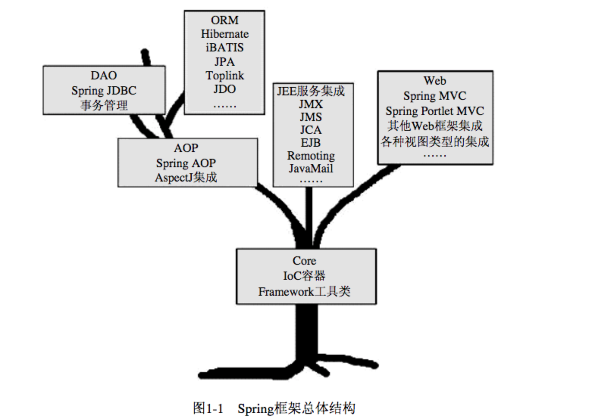
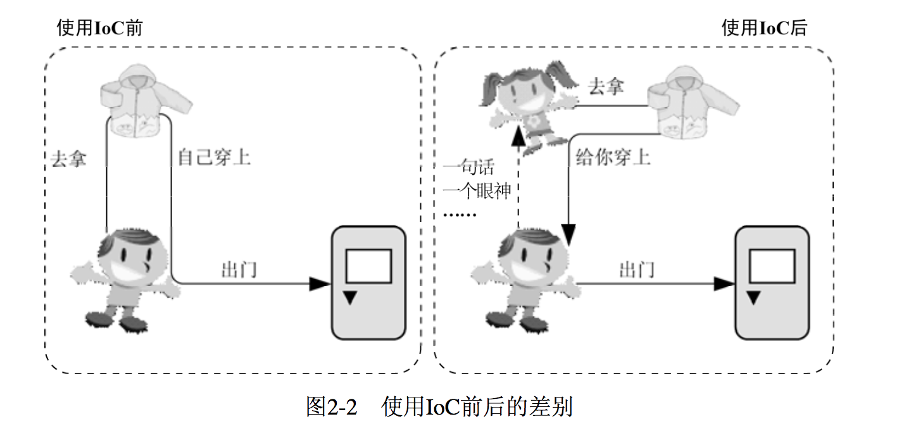
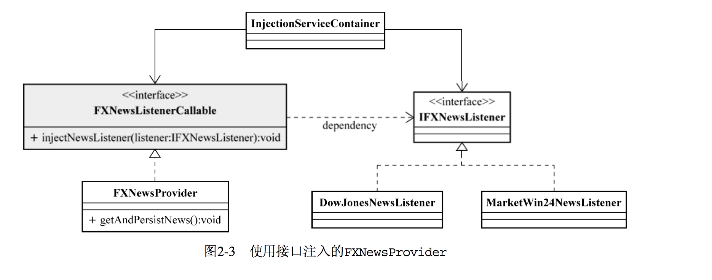

Spring 揭秘
=======

# 第 1 章 Spring 框架的由来

## 1.1 Spring 之崛起

**任何技术或者事物都有其适用的场景**，如果用在了不合适的场景下，我们就不得不为滥用而付出相应的代价。

EJB是使用J2EE平台各项服务的一种方式，但不是唯一的方式。对于分布式系统来说，使用EJB在某些方面确实可以带给我们很大的收益，但并不是所有的J2EE应用都要用于分布式环境。如果不分场景地滥用EJB，J2EE平台上的这支“重装骑兵”的局限性自然会暴露出来。

- 使用EJB，通常也就意味着需要引入拥有EJB Container的应用服务器（J2EE Application Server）的支持，比如BEA的WebLogic或者IBM的WebSphere，而这往往也就意味着高昂的授权费用。虽然开源的JBoss等应用服务器也提供对EJB  Container的支持，但对于商业软件来说，出于产品质量和售后服务等因素考虑，商业产品WebLogic或者WebSphere依然是最佳选择。这跟当年欧洲崇尚重装骑兵相似，都免不了要付出高昂的代价。
- 使用EJB使得应用程序的部署和测试都更加困难，复杂的类加载机制、复杂的部署描述符、过长的开发部署周期等，无疑都增加了开发EJB应用程序的难度。
- EJB在分布式的场景中，EJB才会带给我们最大的益处。但是，当大家在崇拜EJB的狂热氛围之下，不分场景地滥用它时，后果自然可想而知了。要么是开发过程缓慢，无法如期交付；要么就是程序交付后性能极差，很难满足客户需求。
 
> 注意
>   
> 没有任何一种解决方案是普遍适用的，只有**适用于特定场景的解决方案**，脱离具体场景来讨论任何解决方案都是脱离实际的表现。Spring并不是要替代EJB，而是给出EJB之外的另一种方案而已，甚至于二者可以是互补的。

## 1.2 Spring框架概述

从广义上讲，不管Spring框架自发布到现在经过了多少次的版本更迭（从1.x到2.0再到2.5），**其本质是始终不变的，都是为了提供各种服务，以帮助我们简化基于POJO的Java应用程序开发**。Spring框架为POJO提供的各种服务共同组成了Spring的生命之树，如图1-1所示。

<div align="center">  </div><br>

组成整个Spring框架的各种服务实现被划分到了多个相互独立却又相互依赖的模块当中。正如图1-1中Spring框架的核心骨架。抓住了这副骨架，也就抓住了Spring框架的学习主线。

整个Spring框架构建在**Core核心模块之上，它是整个框架的基础**。在该模块中，Spring为我们提供了一个IoC容器（IoC Container）实现，用于帮助我们以**依赖注入**的方式管理对象之间的依赖关系。对Spring的IoC容器的介绍将成为我们此次Spring之旅的第一站。除此之外，Core核心模块中还包括框架内部使用的各种工具类（如果愿意，我们也可以在框架之外使用），比如Spring的基础IO工具类等，这些基础工具类我们也会在合适的地方介绍。

沿着Spring的IoC 容器沿着Spring生命之树往上左序遍历，我们将来到AOP模块。该模块提供了一个轻便但功能强大的AOP框架，让我们可以**以AOP的形式增强各POJO的能力，进而补足OOP/OOSD之缺憾**。Spring的AOP框架符合AOP Alliance规范，**采用Proxy模式构建，与IoC容器相结合**，可以充分显示出Spring  AOP的强大威力。我们将在了解了Spring的IoC容器的基础上，详细讲述Spring AOP这一部分。

继续上行，Spring框架在Core核心模块和AOP模块的基础上，为我们提供了**完备的数据访问和事务管理的抽象和集成服务**。在数据访问支持方面，Spring对JDBC  API的最佳实践极大地简化了该API的使用。除此之外，Spring框架为各种当前业界流行的ORM产品，比如Hibernate、iBATIS、Toplink、JPA等提供了形式统一的集成支持。Spring框架中的**事务管理抽象层是Spring AOP的最佳实践**，它直接构建在Spring AOP的基础之上，为我们提供了编程式事务管理和声明式事务管理的完备支持。这些服务极大地简化了日常应用开发过程中的数据访问和事务管理工作。

为了简化各种Java EE服务（像JNDI、JMS以及JavaMail等）的使用，Spring框架为我们提供了针对这些**Java EE服务的集成服务**。在Spring的帮助下，这些Java EE服务现在都变得不再烦琐难用。因为相关的Java EE服务较多，我们将会选择合适的几种介绍Spring框架给予它们的支持。
使用Spring框架构建的基于POJO的应用程序如果也需要远程访问或者公开一些服务的话，Spring的Remoting框架将帮助它完成这一使命。Spring的Remoting框架和Spring对其他Java EE服务的集成将分别在不同的章节中介绍。

最后要提到的就是Web模块。在该模块中，Spring框架提供了一套自己的Web MVC框架，职责分明的角色划分让这套框架看起来十分地“醒目”。我们将为Spring的Web MVC框架单独开辟一块“领地”进行讲解。Spring Web MVC并不排斥现有的其他Web框架，像Struts、WebWork以及JSF等；Spring的Web框架都为它们提供了集成支持。除此之外，像Web开发中可能牵扯的各种视图（View）技术，Spring Web框架更是给予了足够的重视。

理论上来说，上层的模块需要依赖下层的模块才能正常工作，这就是为什么说这些模块是相互依赖的。不过，近乎处于同一水平线的各个模块之间却可以认为是相互独立的，彼此之间没什么瓜葛。从这个角度看，这些模块之间的相互独立一说也是成立的。

以上就是对整个Spring框架的总体介绍。在开始愉快的Spring旅程之前，我想带大家先逛一逛“Spring大观园”，这样，大家就会发现即将开始的Spring之旅更加值得期待。

> 注意 
> 
> 不要只将Spring看作是一个IoC容器，也不要只将Spring与AOP挂钩，Spring提供的远比这些东西要多得多。Spring不仅仅是一个简化Java EE开发的轻量级框架，它更应该是一个简化任何Java应用的开发框架。如果你愿意，甚至可以在Java的三个平台上（J2SE、J2EE、J2ME）应用Spring框架。即使当前的Spring框架还不支持相应平台或者相应场景的应用开发，但是只要你掌握了**Spring的理念和方法**，同样可以让新的“Spring”在相应的场景中发挥作用。

## 2.1 IOC 的理念是：让别人为你服务

如果我们依赖于某个类或服务，最简单而有效的方式就是直接在类的构造函数中新建相应的依赖类。

> 这就好比要装修新房，需要用家具，这个时候，根据通常解决对象依赖关系的做法，我们就会直接打造出需要的家具来。不过，通常都是分工明确的，所以，大多数情况下，我们可以去家具广场将家具买回来，然后根据需要装修布置即可。
> 
> 不管是直接打造家具（通过new构造对象），还是去家具广场买家具（或许是通过Service- Locator①解决直接的依赖耦合），有一个共同点需要我们关注，那就是，我们都是自己主动地去获取依赖的对象！
> 
> 可是回头想想，我们自己每次用到什么依赖对象都要主动地去获取，这是否真的必要？我们最终所要做的，其实就是直接调用依赖对象所提供的某项服务而已。只要用到这个依赖对象的时候，它能够准备就绪，我们完全可以不管这个对象是自己找来的还是别人送过来的。如果有人能够在我们需要时将某个依赖对象送过来，为什么还要大费周折地自己去折腾？

通常情况下，被注入对象会直接依赖于被依赖对象。但是，在IoC的场景中，二者之间通过IoC Service Provider来打交道，**所有的被注入对象和依赖对象现在由IoC Service Provider统一管理**。

被注入对象需要什么，直接跟IoC Service Provider招呼一声，后者就会把相应的被依赖对象注入到被注入对象中，从而达到IoC Service Provider为被注入对象服务的目的。IoC Service Provider在这里就是通常的IoC容器所充当的角色。

从被注入对象的角度看，与**之前直接寻求依赖对象相比，依赖对象的取得方式发生了反转，控制也从被注入对象转到了IoC Service Provider那里**①。其实IoC就这么简单！原来是需要什么东西自己去拿，现在是需要什么东西就让别人送过来。图2-2以两种场景，形象地说明了使用IoC模式前后的差别。

<div align="center">  </div><br>

## 2.2 手语，呼喊，还是心有灵犀
IoC模式最权威的总结和解释，应该是Martin Fowler的那篇文章“Inversion of Control Containers and the  Dependency  Injection  pattern”，其中提到了三种依赖注入的方式:

- 构造方法注入（constructor injection）
- setter方法注入（setter injection）
- 接口注入（interface injection）

### 2.2.1  构造方法注入
构造方法注入，就是被注入对象可以通过在其**构造方法中声明依赖对象的参数列表，让外部（通常是IoC容器）知道它需要哪些依赖对象**。

> 对于前面例子中的FXNewsProvider来说，只要声明如下构造方法（见代码清单2-3）即可支持构造方法注入

- 代码清单2-3FXNewsProvider构造方法定义

``` java
public FXNewsProvider(IFXNewsListener newsListner,IFXNewsPersister newsPersister) {   
	this.newsListener   = newsListner; 
	this.newPersistener = newsPersister;
	}
```

`IoC  Service  Provider` 会检查被注入对象(此处为 FXNewsProvider)的构造方法，取得它所需要的依赖对象列表，进而为其注入相应的对象。

同一个对象是不可能被构造两次的，因此，被注入对象的构造乃至其整个生命周期，应该是由IoC Service Provider来管理的。

构造方法注入方式比较直观，对象被构造完成后，即进入就绪状态，可以马上使用。

> 这就好比你刚进酒吧的门，服务生已经将你喜欢的啤酒摆上了桌面一样。坐下就可马上享受一份清凉与惬意。

### 2.2.2 setter方法注入
对于JavaBean对象来说，通常会通过setXXX()和getXXX()方法来访问对应属性。通过setter方法，可以更改相应的对象属性，通过getter方法，可以获得相应属性的状态。

===> 所以，当前对象只要为其依赖对象所对应的属性添加setter方法，就可以通过setter方法将相应的依赖对象设置到被注入对象中。

> 以FXNewsProvider为例，添加setter方法后如代码清单2-4所示。

- 代码清单2-4添加了setter方法声明的FXNewsProvider

``` java
public class FXNewsProvider {

    private IFXNewsListen newsListen;

    private IFXNewsPesister newsPesister;

    public IFXNewsListen getNewsListen() {
        return newsListen;
    }

    public void setNewsListen(IFXNewsListen newsListen) {
        this.newsListen = newsListen;
    }

    public IFXNewsPesister getNewsPesister() {
        return newsPesister;
    }

    public void setNewsPesister(IFXNewsPesister newsPesister) {
        this.newsPesister = newsPesister;
    }
}
```

这样，外界就可以通过调用setNewsListener和setNewPersistener方法为FXNewsProvider对象注入所依赖的对象了。setter方法注入虽不像构造方法注入那样，让对象构造完成后即可使用，但相对来说更宽松一些，可以在对象构造完成后再注入。

> 这就好比你可以到酒吧坐下后再决定要点什么啤酒，可以要百威，也可以要大雪，随意性比较强。如果你不急着喝，这种方式当然是最适合你的。

### 2.2.3  接口注入
相对于前两种注入方式来说，接口注入没有那么简单明了。被注入对象如果想要IoC  Service  Provider为其**注入依赖对象，就必须实现某个接口**。这个接口提供一个方法，用来为其注入依赖对象。

IoC Service Provider最终通过这些接口来了解应该为被注入对象注入什么依赖对象。

> 图2-3演示了如何使用接口注入为FXNewsProvider注入依赖对象。

FXNewsProvider为了让IoC Service Provider为其注入所依赖的IFXNewsListener，首先需要实现`IFXNewsListenerCallable`接口，这个接口会声明一个`injectNewsListner方法（方法名随意）`，该方法的参数，就是所依赖对象的类型。这样，`InjectionServiceContainer`对象，即对应的IoC Service Provider就可以通过这个接口方法将依赖对象注入到被注入对象FXNewsProvider当中。

<div align="center">  </div><br>

⚠️小心

> 在这种情况下，实现的接口和接口中声明的方法名称都不重要。重要的是接口中声明方法的**参数类型，必须是“被注入对象”所依赖对象的类型**。

接口注入比较死板和烦琐。如果需要注入依赖对象，被注入对象就必须声明和实现另外的接口。这就好像你同样在酒吧点啤酒，为了让服务生理解你的意思，你就必须戴上一顶啤酒杯式的帽子，看起来有点多此一举。

### 2.2.4  三种注入方式的比较

* 接口注入。从注入方式的使用上来说，接口注入是现在不甚提倡的一种方式，基本处于“退役状态”。因为它**强制被注入对象实现不必要的接口，带有侵入性**。而构造方法注入和setter方法注入则不需要如此。

* 构造方法注入。这种注入方式的优点就是，**对象在构造完成之后，即已进入就绪状态，可以马上使用**。缺点就是，当依赖对象比较多的时候，构造方法的参数列表会比较长。而通过反射构造对象的时候，对相同类型的参数的处理会比较困难，维护和使用上也比较麻烦。而且在Java中，构造方法无法被继承，无法设置默认值。对于非必须的依赖处理，可能需要引入多个构造方法，而参数数量的变动可能造成维护上的不便。

* setter方法注入。因为方法可以命名，所以setter方法注入在描述性上要比构造方法注入好一些。另外，setter方法可以被继承，允许设置默认值，而且有良好的IDE支持。缺点当然就是对象无法在构造完成后马上进入就绪状态。

综上所述，**构造方法注入和setter方法注入因为其侵入性较弱，且易于理解和使用，所以是现在使用最多的注入方式**；而接口注入因为侵入性较强，近年来已经不流行了。

## 2.3 IoC的附加值
从主动获取依赖关系的方式转向IoC方式，不只是一个方向上的改变，简单的转变背后实际上蕴藏着更多的玄机。要说IoC模式能带给我们什么好处，可能各种资料或书籍中已经罗列很多了。比如不会对业务对象构成很强的侵入性，使用IoC后，对象具有更好的可测试性、可重用性和可扩展性，等等。不过，泛泛而谈可能无法真正地让你深刻理解IoC模式带来的诸多好处，所以，还是让我们从具体的示例入手，来一探究竟吧。15 16 对于前面例子中的FXNewsProvider来说，在使用IoC重构之前，如果没有其他需求或变动，不光看起来，用起来也是没有问题的。但是，当系统中需要追加逻辑以处理另一家新闻社的新闻来源时，问题就来了。


