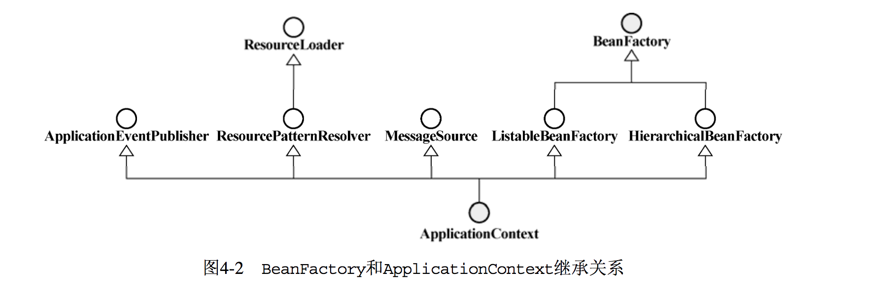

Spring 揭秘
=======

# 第 1 章 Spring 框架的由来

## 1.1 Spring 之崛起

**任何技术或者事物都有其适用的场景**，如果用在了不合适的场景下，我们就不得不为滥用而付出相应的代价。

EJB是使用J2EE平台各项服务的一种方式，但不是唯一的方式。对于分布式系统来说，使用EJB在某些方面确实可以带给我们很大的收益，但并不是所有的J2EE应用都要用于分布式环境。如果不分场景地滥用EJB，J2EE平台上的这支“重装骑兵”的局限性自然会暴露出来。

- 使用EJB，通常也就意味着需要引入拥有EJB Container的应用服务器（J2EE Application Server）的支持，比如BEA的WebLogic或者IBM的WebSphere，而这往往也就意味着高昂的授权费用。虽然开源的JBoss等应用服务器也提供对EJB  Container的支持，但对于商业软件来说，出于产品质量和售后服务等因素考虑，商业产品WebLogic或者WebSphere依然是最佳选择。这跟当年欧洲崇尚重装骑兵相似，都免不了要付出高昂的代价。
- 使用EJB使得应用程序的部署和测试都更加困难，复杂的类加载机制、复杂的部署描述符、过长的开发部署周期等，无疑都增加了开发EJB应用程序的难度。
- EJB在分布式的场景中，EJB才会带给我们最大的益处。但是，当大家在崇拜EJB的狂热氛围之下，不分场景地滥用它时，后果自然可想而知了。要么是开发过程缓慢，无法如期交付；要么就是程序交付后性能极差，很难满足客户需求。
 
> 注意
>   
> 没有任何一种解决方案是普遍适用的，只有**适用于特定场景的解决方案**，脱离具体场景来讨论任何解决方案都是脱离实际的表现。Spring并不是要替代EJB，而是给出EJB之外的另一种方案而已，甚至于二者可以是互补的。

## 1.2 Spring框架概述

从广义上讲，不管Spring框架自发布到现在经过了多少次的版本更迭（从1.x到2.0再到2.5），**其本质是始终不变的，都是为了提供各种服务，以帮助我们简化基于POJO的Java应用程序开发**。Spring框架为POJO提供的各种服务共同组成了Spring的生命之树，如图1-1所示。

<div align="center">  </div><br>

组成整个Spring框架的各种服务实现被划分到了多个相互独立却又相互依赖的模块当中。正如图1-1中Spring框架的核心骨架。抓住了这副骨架，也就抓住了Spring框架的学习主线。

整个Spring框架构建在**Core核心模块之上，它是整个框架的基础**。在该模块中，Spring为我们提供了一个IoC容器（IoC Container）实现，用于帮助我们以**依赖注入**的方式管理对象之间的依赖关系。对Spring的IoC容器的介绍将成为我们此次Spring之旅的第一站。除此之外，Core核心模块中还包括框架内部使用的各种工具类（如果愿意，我们也可以在框架之外使用），比如Spring的基础IO工具类等，这些基础工具类我们也会在合适的地方介绍。

沿着Spring的IoC 容器沿着Spring生命之树往上左序遍历，我们将来到AOP模块。该模块提供了一个轻便但功能强大的AOP框架，让我们可以**以AOP的形式增强各POJO的能力，进而补足OOP/OOSD之缺憾**。Spring的AOP框架符合AOP Alliance规范，**采用Proxy模式构建，与IoC容器相结合**，可以充分显示出Spring  AOP的强大威力。我们将在了解了Spring的IoC容器的基础上，详细讲述Spring AOP这一部分。

继续上行，Spring框架在Core核心模块和AOP模块的基础上，为我们提供了**完备的数据访问和事务管理的抽象和集成服务**。在数据访问支持方面，Spring对JDBC  API的最佳实践极大地简化了该API的使用。除此之外，Spring框架为各种当前业界流行的ORM产品，比如Hibernate、iBATIS、Toplink、JPA等提供了形式统一的集成支持。Spring框架中的**事务管理抽象层是Spring AOP的最佳实践**，它直接构建在Spring AOP的基础之上，为我们提供了编程式事务管理和声明式事务管理的完备支持。这些服务极大地简化了日常应用开发过程中的数据访问和事务管理工作。

为了简化各种Java EE服务（像JNDI、JMS以及JavaMail等）的使用，Spring框架为我们提供了针对这些**Java EE服务的集成服务**。在Spring的帮助下，这些Java EE服务现在都变得不再烦琐难用。因为相关的Java EE服务较多，我们将会选择合适的几种介绍Spring框架给予它们的支持。
使用Spring框架构建的基于POJO的应用程序如果也需要远程访问或者公开一些服务的话，Spring的Remoting框架将帮助它完成这一使命。Spring的Remoting框架和Spring对其他Java EE服务的集成将分别在不同的章节中介绍。

最后要提到的就是Web模块。在该模块中，Spring框架提供了一套自己的Web MVC框架，职责分明的角色划分让这套框架看起来十分地“醒目”。我们将为Spring的Web MVC框架单独开辟一块“领地”进行讲解。Spring Web MVC并不排斥现有的其他Web框架，像Struts、WebWork以及JSF等；Spring的Web框架都为它们提供了集成支持。除此之外，像Web开发中可能牵扯的各种视图（View）技术，Spring Web框架更是给予了足够的重视。

理论上来说，上层的模块需要依赖下层的模块才能正常工作，这就是为什么说这些模块是相互依赖的。不过，近乎处于同一水平线的各个模块之间却可以认为是相互独立的，彼此之间没什么瓜葛。从这个角度看，这些模块之间的相互独立一说也是成立的。

以上就是对整个Spring框架的总体介绍。在开始愉快的Spring旅程之前，我想带大家先逛一逛“Spring大观园”，这样，大家就会发现即将开始的Spring之旅更加值得期待。

> 注意 
> 
> 不要只将Spring看作是一个IoC容器，也不要只将Spring与AOP挂钩，Spring提供的远比这些东西要多得多。Spring不仅仅是一个简化Java EE开发的轻量级框架，它更应该是一个简化任何Java应用的开发框架。如果你愿意，甚至可以在Java的三个平台上（J2SE、J2EE、J2ME）应用Spring框架。即使当前的Spring框架还不支持相应平台或者相应场景的应用开发，但是只要你掌握了**Spring的理念和方法**，同样可以让新的“Spring”在相应的场景中发挥作用。

## 2.1 IOC 的理念是：让别人为你服务

如果我们依赖于某个类或服务，最简单而有效的方式就是直接在类的构造函数中新建相应的依赖类。

> 这就好比要装修新房，需要用家具，这个时候，根据通常解决对象依赖关系的做法，我们就会直接打造出需要的家具来。不过，通常都是分工明确的，所以，大多数情况下，我们可以去家具广场将家具买回来，然后根据需要装修布置即可。
> 
> 不管是直接打造家具（通过new构造对象），还是去家具广场买家具（或许是通过Service- Locator①解决直接的依赖耦合），有一个共同点需要我们关注，那就是，我们都是自己主动地去获取依赖的对象！
> 
> 可是回头想想，我们自己每次用到什么依赖对象都要主动地去获取，这是否真的必要？我们最终所要做的，其实就是直接调用依赖对象所提供的某项服务而已。只要用到这个依赖对象的时候，它能够准备就绪，我们完全可以不管这个对象是自己找来的还是别人送过来的。如果有人能够在我们需要时将某个依赖对象送过来，为什么还要大费周折地自己去折腾？

通常情况下，被注入对象会直接依赖于被依赖对象。但是，在IoC的场景中，二者之间通过IoC Service Provider来打交道，**所有的被注入对象和依赖对象现在由IoC Service Provider统一管理**。

被注入对象需要什么，直接跟IoC Service Provider招呼一声，后者就会把相应的被依赖对象注入到被注入对象中，从而达到IoC Service Provider为被注入对象服务的目的。IoC Service Provider在这里就是通常的IoC容器所充当的角色。

从被注入对象的角度看，与**之前直接寻求依赖对象相比，依赖对象的取得方式发生了反转，控制也从被注入对象转到了IoC Service Provider那里**①。其实IoC就这么简单！原来是需要什么东西自己去拿，现在是需要什么东西就让别人送过来。图2-2以两种场景，形象地说明了使用IoC模式前后的差别。

<div align="center">  </div><br>

## 2.2 手语，呼喊，还是心有灵犀
IoC模式最权威的总结和解释，应该是Martin Fowler的那篇文章“Inversion of Control Containers and the  Dependency  Injection  pattern”，其中提到了三种依赖注入的方式:

- 构造方法注入（constructor injection）
- setter方法注入（setter injection）
- 接口注入（interface injection）

### 2.2.1  构造方法注入
构造方法注入，就是被注入对象可以通过在其**构造方法中声明依赖对象的参数列表，让外部（通常是IoC容器）知道它需要哪些依赖对象**。

> 对于前面例子中的FXNewsProvider来说，只要声明如下构造方法（见代码清单2-3）即可支持构造方法注入

- 代码清单2-3FXNewsProvider构造方法定义

``` java
public FXNewsProvider(IFXNewsListener newsListner,IFXNewsPersister newsPersister) {   
	this.newsListener   = newsListner; 
	this.newPersistener = newsPersister;
	}
```

`IoC  Service  Provider` 会检查被注入对象(此处为 FXNewsProvider)的构造方法，取得它所需要的依赖对象列表，进而为其注入相应的对象。

同一个对象是不可能被构造两次的，因此，被注入对象的构造乃至其整个生命周期，应该是由IoC Service Provider来管理的。

构造方法注入方式比较直观，对象被构造完成后，即进入就绪状态，可以马上使用。

> 这就好比你刚进酒吧的门，服务生已经将你喜欢的啤酒摆上了桌面一样。坐下就可马上享受一份清凉与惬意。

### 2.2.2 setter方法注入
对于JavaBean对象来说，通常会通过setXXX()和getXXX()方法来访问对应属性。通过setter方法，可以更改相应的对象属性，通过getter方法，可以获得相应属性的状态。

===> 所以，当前对象只要为其依赖对象所对应的属性添加setter方法，就可以通过setter方法将相应的依赖对象设置到被注入对象中。

> 以FXNewsProvider为例，添加setter方法后如代码清单2-4所示。

- 代码清单2-4添加了setter方法声明的FXNewsProvider

``` java
public class FXNewsProvider {

    private IFXNewsListen newsListen;

    private IFXNewsPesister newsPesister;

    public IFXNewsListen getNewsListen() {
        return newsListen;
    }

    public void setNewsListen(IFXNewsListen newsListen) {
        this.newsListen = newsListen;
    }

    public IFXNewsPesister getNewsPesister() {
        return newsPesister;
    }

    public void setNewsPesister(IFXNewsPesister newsPesister) {
        this.newsPesister = newsPesister;
    }
}
```

这样，外界就可以通过调用setNewsListener和setNewPersistener方法为FXNewsProvider对象注入所依赖的对象了。setter方法注入虽不像构造方法注入那样，让对象构造完成后即可使用，但相对来说更宽松一些，可以在对象构造完成后再注入。

> 这就好比你可以到酒吧坐下后再决定要点什么啤酒，可以要百威，也可以要大雪，随意性比较强。如果你不急着喝，这种方式当然是最适合你的。

### 2.2.3  接口注入
相对于前两种注入方式来说，接口注入没有那么简单明了。被注入对象如果想要IoC  Service  Provider为其**注入依赖对象，就必须实现某个接口**。这个接口提供一个方法，用来为其注入依赖对象。

IoC Service Provider最终通过这些接口来了解应该为被注入对象注入什么依赖对象。

> 图2-3演示了如何使用接口注入为FXNewsProvider注入依赖对象。

FXNewsProvider为了让IoC Service Provider为其注入所依赖的IFXNewsListener，首先需要实现`IFXNewsListenerCallable`接口，这个接口会声明一个`injectNewsListner方法（方法名随意）`，该方法的参数，就是所依赖对象的类型。这样，`InjectionServiceContainer`对象，即对应的IoC Service Provider就可以通过这个接口方法将依赖对象注入到被注入对象FXNewsProvider当中。

<div align="center">  </div><br>

⚠️小心

> 在这种情况下，实现的接口和接口中声明的方法名称都不重要。重要的是接口中声明方法的**参数类型，必须是“被注入对象”所依赖对象的类型**。

接口注入比较死板和烦琐。如果需要注入依赖对象，被注入对象就必须声明和实现另外的接口。这就好像你同样在酒吧点啤酒，为了让服务生理解你的意思，你就必须戴上一顶啤酒杯式的帽子，看起来有点多此一举。

### 2.2.4  三种注入方式的比较

* 接口注入。从注入方式的使用上来说，接口注入是现在不甚提倡的一种方式，基本处于“退役状态”。因为它**强制被注入对象实现不必要的接口，带有侵入性**。而构造方法注入和setter方法注入则不需要如此。

* 构造方法注入。这种注入方式的优点就是，**对象在构造完成之后，即已进入就绪状态，可以马上使用**。缺点就是，当依赖对象比较多的时候，构造方法的参数列表会比较长。而通过反射构造对象的时候，对相同类型的参数的处理会比较困难，维护和使用上也比较麻烦。而且在Java中，构造方法无法被继承，无法设置默认值。对于非必须的依赖处理，可能需要引入多个构造方法，而参数数量的变动可能造成维护上的不便。

* setter方法注入。因为方法可以命名，所以setter方法注入在描述性上要比构造方法注入好一些。另外，setter方法可以被继承，允许设置默认值，而且有良好的IDE支持。缺点当然就是对象无法在构造完成后马上进入就绪状态。

综上所述，**构造方法注入和setter方法注入因为其侵入性较弱，且易于理解和使用，所以是现在使用最多的注入方式**；而接口注入因为侵入性较强，近年来已经不流行了。

## 2.3 IoC的附加值
要说IoC模式能带给我们什么好处，比如不会对业务对象构成很强的侵入性，使用IoC后，对象具有更好的可测试性、可重用性和可扩展性等等。不过，泛泛而谈可能无法真正地让你深刻理解IoC模式带来的诸多好处。

随着开源项目的成功，**TDD（Test Driven Developement ，测试驱动开发）**已经成为越来越受重视的一种开发方式。因为保证业务对象拥有良好的可测试性，可以为最终交付高质量的软件奠定良好的基础，同时也拉起了产品质量的第一道安全网。所以对于软件开发来说，设计开发可测试性良好的业务对象是至关重要的。而IoC模式可以让我们更容易达到这个目的。比如，使用IoC模式后，为了测试FXNewsProvider，我们可以根据测试的需求，提供一个MockNewsListener给FXNewsProvider。在此之前，我们无法将对DowJonesNewsListener的依赖排除在外，从而导致难以开展单元测试。

如果要用一句话来概括IoC可以带给我们什么:**IoC是一种可以帮助我们解耦各业务对象间依赖关系的对象绑定方式！**


## 2.4 小结
本章主要介绍了IoC或者说依赖注入的概念，讨论了几种基本的依赖注入方式。还与大家一起探索并验证了IoC所带给我们的部分“附加值”。所以，现在大家应该对IoC或者说依赖注入有了最基本认识。

下一章，我们将一起去更深入地了解IoC场景中的重要角色，即**IoC Service Provider**。

# 3.掌管大局的IoC Service Provider

IoC Service Provider是一个抽象出来的概念，它可以指代任何将IoC场景中的业务对象绑定到一起的实现方式。它可以是一段代码，也可以是一组相关的类，甚至可以是比较通用的IoC框架或者IoC容器实现。

> 比如，可以通过以下代码（见代码清单3-1）绑定与新闻相关的对象。

- 代码清单3-1 FXNewsProvider相关依赖绑定代码

``` java
    IFXNewsListen ifxNewsListen = new IFXNewsListen();
    IFXNewsPesister ifxNewsPesister = new IFXNewsPesister();
    FXNewsProvider1 fxNewsProvider1 = new FXNewsProvider1(ifxNewsListen,ifxNewsPesister);
```

> 这段代码就可以认为是这个场景中的IoC  Service  Provider，只不过比较简单。**要将系统中几十、几百甚至数以千计的业务对象绑定到一起，采用这种方式显然是不切实际的**。不过，好在现在许多开源产品通过各种方式为我们做了这部分工作。所以，目前来看，我们只需要使用这些产品提供的服务就可以了。

**Spring的IoC容器就是一个提供依赖注入服务的IoC Service Provider。**

## 3.1 IoC Service Provider的职责
IoC  Service  Provider的职责相对来说比较简单，主要有两个：业务对象的构建管理和业务对象间的依赖绑定

- 业务对象的**构建管理**

在IoC场景中，**业务对象无需关心所依赖的对象如何构建如何取得**，但这部分工作始终需要有人来做。所以，IoC Service Provider需要将对象的构建逻辑从 客户端对象① 那里剥离出来，以免这部分逻辑污染业务对象的实现。

> ①这里指代使用某个对象或者某种服务的对象。如果对象A需要引用对象B，那么A就是B的客户端对象，而不管A处于Service层还是数据访问层。

- 业务对象间的**依赖绑定**

对于IoC Service Provider来说，这个职责是是它的最终使命。如果不能完成这个职责，那么，无论业务对象如何的“呼喊”，也不会得到依赖对象的任何响应（最常见的倒是会收到一个NullPointerException）。

IoC Service Provider通过**结合之前构建和管理的所有业务对象，以及各个业务对象间可以识别的依赖关系，将这些对象所依赖的对象注入绑定**，保证每个业务对象在使用的时候，可以处于就绪状态。

## 3.2  运筹帷幄的秘密——IoC Service Provider如何管理对象间的依赖关系

对于为被注入对象提供依赖注入的IoC  Service  Provider来说，它也同样**需要知道自己所管理和掌握的被注入对象和依赖对象之间的对应关系**。

IoC  Service  Provider 需要寻求其他方式来记录诸多对象之间的对应关系。比如：

* 可以通过**最基本的文本文件** 来记录被注入对象和其依赖对象之间的对应关系
* 可以通过**XML文件格式**来记录对应信息
* 可以通过**编写代码的方式**来注册这些对应信息

我们可以归纳一下，当前流行的IoC  Service  Provider产品使用的注册对象管理信息的方式主要有以下几种。

### 3.2.1  直接编码方式

代码清单3-2直接编码方式管理对象间的依赖注入关系

``` java
IoContainer container = ...; 
container.register(FXNewsProvider.class,new FXNewsProvider()); 
container.register(IFXNewsListener.class,new DowJonesNewsListener());
 ... 
FXNewsProvider newsProvider = (FXNewsProvider)container.get(FXNewsProvider.class); 
newProvider.getAndPersistNews(); 
```

为相应的类**指定对应的具体实例，可以告知IoC容器**，当要这种类型的对象实例时，请将容器中注册的、对应的那个具体实例返回给我们。

通过`程序编码`让最终的 IoC Service Provider（也就是各个IoC框架或者容器实现）得以知晓服务的“奥义”，应该是**管理依赖绑定关系的最基本方式**。

### 3.2.2  配置文件方式
较为普遍的依赖注入关系管理方式。

> 像普通文本文件、properties文件、XML文件等，都可以成为管理依赖注入关系的载体。

最为常见的，还是通过**XML文件**来管理对象注册和对象间依赖关系。

代码清单3-4通过Spring的配置方式来管理FXNewsProvider的依赖注入关系

``` xml
<bean id="newsProvider" class="..FXNewsProvider">
   <property  name="newsListener"> 
        <ref  bean="djNewsListener"/>
   </property>
   <property  name="newPersistener">
         <ref  bean="djNewsPersister"/>   
   </property>  
</bean>

<bean id="djNewsListener"    class="..impl.DowJonesNewsListener">
</bean>

<bean id="djNewsPersister"    class="..impl.DowJonesNewsPersister">  
</bean>
```

就可以通过“newsProvider”这个名字，从容器中取得组装好的FXNewsProvider并直接使用。

代码清单3-5从读取配置文件完成对象组装的容器中获取FXNewsProvider并使用

``` java
... 
container.readConfigurationFiles(...); 
FXNewsProvider newsProvider = (FXNewsProvider)container.getBean("newsProvider");
newsProvider.getAndPersistNews();
```

### 3.2.3  元数据方式
> 这种方式目前已经不常用

代表实现是Google Guice，这是在Java 5的注解和Generic的基础上开发的一套IoC框架。可以在类中**使用元数据信息来标注各个对象之间的依赖关系**，然后由Guice框架根据这些注解所提供的信息将这些对象组装后，交给客户端对象使用。

注解最终也要通过代码处理来确定最终的注入关系，从这点儿来说，注解方式可以算作编码方式的一种特殊情况。

# 第 4 章 Spring的IoC容器之BeanFactory

<div align="center">  </div><br>

Spring提供了两种**容器类型**：BeanFactory和ApplicationContext。

- BeanFactory

	- 基础类型IoC容器，提供**完整的IoC服务支持**
	- 如果没有特殊指定，**默认采用延迟初始化策略（lazy-load）**

	> 相对来说，容器启动初期速度较快，所需要的资源有限

	- **对于资源有限，并且功能要求不是很严格的场景，BeanFactory是比较合适的IoC容器选择**

- ApplicationContext	
	- ApplicationContext 在 BeanFactory 的基础上构建，是相对比较高级的容器实现
	- 除了有BeanFactory的支持，额外**提供了其他高级特性**，比如事件发布、国际化信息支持等
	- **该类型容器启动之后，默认全部初始化管理的对象并绑定完成**。
	- ===> 相对于BeanFactory，要求更多的系统资源，同时，因为在启动时就完成所有初始化，容器启动时间较之BeanFactory也会长一些。在**系统资源充足，并且要求更多功能的场景中，ApplicationContext类型的容器是比较合适的选择**。

<div align="center">  </div><br>

### BeanFactory 就是生产Bean的工厂
- Spring框架提倡使用POJO，可以把每个业务对象看作一个**JavaBean**对象

- BeanFactory可以完成作为 IoC Service Provider的所有职责，包括业务**对象的注册和对象间依赖关系的绑定**

- 也就是说业务对象如何组装，你不用费心， BeanFactory 帮您搞定

代码清单4-1 BeanFactory的定义

```
public interface BeanFactory {
	
	String FACTORY_BEAN_PREFIX = "&";
	
	Object getBean(String name) throws BeansException;
	
	<T> T getBean(String name, Class<T> requiredType) throws BeansException;
	
	<T> T getBean(Class<T> requiredType) throws BeansException;
	
	. . . 
		
	boolean containsBean(String name);

	boolean isPrototype(String name) throws NoSuchBeanDefinitionException;

	boolean isTypeMatch(String name, ResolvableType typeToMatch) throws NoSuchBeanDefinitionException;

	boolean isTypeMatch(String name, Class<?> typeToMatch) throws NoSuchBeanDefinitionException;

	Class<?> getType(String name) throws NoSuchBeanDefinitionException;

	String[] getAliases(String name);

}
```

基本上都是查询相关的方法，例如，取得某个对象的方法（getBean）、查询某个对象是否存在于容器中的方法（containsBean），或者取得某个bean的状态或者类型的方法等。

因为通常情况下，**对于独立的应用程序，只有主入口类才会跟容器的API直接耦合**。

## 4.1 拥有BeanFactory之后的生活

对于应用程序的开发来说，不管是否引入 BeanFactory 之类的轻量级容器，应用的设计和开发流程实际上没有太大改变。还是会针对系统需求，分别设计相应的接口和实现类。

**前后唯一的不同，就是对象之间依赖关系的解决方式改变了**。

之前系统业务对象需要自己去“拉”（Pull）所依赖的业务对象，有了BeanFactory之类的IoC容器之后，需要依赖什么让**BeanFactory为我们推过来（Push）**就行。====> 简单点儿说，拥有BeanFactory之后，要使用IoC模式进行系统业务对象的开发。

代码清单4-2 FX新闻应用设计和实现框架代码

``` java
1-设计FXNewsProvider类用于普遍的新闻处理
public class FXNewsProvider {   ...  }       

2-设计IFXNewsListener接口抽象各个新闻社不同的新闻获取方式，并给出相应实现类
public interface IFXNewsListener {   ...  } 

以及
public class DowJonesNewsListener implements IFXNewsListener{   ...  } 

3-设计IFXNewsPersister接口抽象不同数据访问方式，并实现相应的实现类
public interface IFXNewsPersister {   ...   }    

以及
public class DowJonesNewsPersister implements IFXNewsPersister 4 {   ...  }

```

使用IoC模式开发的业务对象不用自己操心如何**解决相互之间的依赖关系**，这个工作就交给 BeanFactory 来做了。

代码清单4-3使用BeanFactory的XML配置方式实现业务对象间的依赖管理

``` xml
<beans>
  <bean id="djNewsProvider" class="..FXNewsProvider">
       <constructor-arg  index="0">
           <ref  bean="djNewsListener"/>  
       </constructor-arg>   
       <constructor-arg  index="1">        
       	<ref  bean="djNewsPersister"/>      
       </constructor-arg>
   </bean>   
   
    ...  
</beans>
```

#### BeanFactory出现之前

BeanFactory出现之前，我们通常会直接在应用程序的入口类的main方法中，`自己实例化相应的对象并调用之`，如以下代码所示：

	FXNewsProvider newsProvider = new FXNewsProvider(); 
	newsProvider.getAndPersistNews(); 

#### BeanFactory出现之后
通常只需将“生产线图纸”交给BeanFactory，让BeanFactory为我们生产一个FXNewsProvider，如以下代码所示：

``` java
BeanFactory container = new XmlBeanFactory(new ClassPathResource("配置文件路径")); 
FXNewsProvider newsProvider = (FXNewsProvider)container.getBean("djNewsProvider");
newsProvider.getAndPersistNews(); 
```

或者如以下代码所示：

``` java
ApplicationContext container = new ClassPathXmlApplicationContext("配置文件路径");
FXNewsProvider newsProvider = (FXNewsProvider)container.getBean("djNewsProvider"); 
newsProvider.getAndPersistNews(); 
```

亦或如以下代码所示(只是创建的方式不一样，下面是读文件)：

``` java
ApplicationContext container = new FileSystemXmlApplicationContext("配置文件路径"); 
FXNewsProvider newsProvider = (FXNewsProvider)container.getBean("djNewsProvider");
newsProvider.getAndPersistNews(); 
```

> 以上就是使用BeanFactory后开发流程的一个概览。

## 4.2 BeanFactory 的对象注册与依赖绑定方式
BeanFactory作为一个IoC Service Provider，为了明确管理各个业务对象以及业务对象之间的依赖绑定关系，同样需要某种途径来记录和管理这些信息。

### 4.2.1  直接编码方式【不推荐】
把编码方式单独提出来称作一种方式并不十分恰当。因为不管什么方式，最终都需要`编码`才能“落实”所有信息并付诸使用。

代码清单4-4通过编码方式使用BeanFactory实现FX新闻相关类的注册及绑定

```
public class BeanFactoryDemo {

    public static void main(String[] args) {
        DefaultListableBeanFactory beanRegistry = new DefaultListableBeanFactory();
        BeanFactory container = bindViaCode(beanRegistry);
        FXNewsProvider newsProvider = (FXNewsProvider) container.getBean("djNewsProvider");
        newsProvider.getAndPersistNews();
    }

    public static BeanFactory bindViaCode(BeanDefinitionRegistry registry) {
        AbstractBeanDefinition newsProvider = new RootBeanDefinition(FXNewsProvider.class, true);
        AbstractBeanDefinition newsListener = new RootBeanDefinition(DowJonesNewsListener.class, true);
        AbstractBeanDefinition newsPersister = new RootBeanDefinition(DowJonesNewsPersister.class, true);

        // 将bean定义注册到容器中
        registry.registerBeanDefinition("djNewsProvider", newsProvider);
        registry.registerBeanDefinition("djListener", newsListener);
        registry.registerBeanDefinition("djPersister", newsPersister);
        // 指定依赖关系
        // 方式1. 可以通过构造方法注入方式
        ConstructorArgumentValues argValues = new ConstructorArgumentValues();
        argValues.addIndexedArgumentValue(0, newsListener);
        argValues.addIndexedArgumentValue(1, newsPersister);
        newsProvider.setConstructorArgumentValues(argValues);
        // 方式2. 或者通过setter方法注入方式（将 newsListener 和 newsPersister 注入到 newsProvider）
//        MutablePropertyValues propertyValues = new MutablePropertyValues();
//        propertyValues.addPropertyValue(new PropertyValue("newsListener", newsListener));
//        propertyValues.addPropertyValue(new PropertyValue("newPersistener", newsPersister));
//        newsProvider.setPropertyValues(propertyValues);
        // 绑定完成
        return (BeanFactory) registry;
    }

}
```

BeanFactory只是一个接口，最终需要一个该接口的实现来进行实际的Bean的管理，DefaultListableBeanFactory就是这么一个比较通用的BeanFactory实现类。

DefaultListableBeanFactory除了间接地实现了BeanFactory接口，还实现了`BeanDefinitionRegistry`接口，**BeanDefinitionRegistry 接口才是在BeanFactory的实现中担当Bean注册管理的角色**。

BeanFactory接口只**定义如何访问**容器内管理的Bean的方法，各个BeanFactory的**具体实现类负责具体Bean的注册以及管理工作**。BeanDefinitionRegistry接口定义抽象了Bean的注册逻辑。

通常情况下，具体的BeanFactory实现类会实现这个接口来管理Bean的注册。它们之间的关系如图4-3所示。

<div align="center">  </div><br>

> BeanDefinitionRegistry就像图书馆的书架，所有的书是放在书架上的。虽然你还书或者借书都是跟图书馆（也就是BeanFactory）打交道，但书架才是图书馆存放各类图书的地方。所以，书架相对于图书馆来说，就是它的“BeanDefinitionRegistry”。

> 每一个受管的对象，在容器中都会有一个`BeanDefinition的实例（instance）`与之相对应，该实例保存对象的所有必要信息，包括其对应的对象的class类型、是否是抽象类、构造方法参数以及其他属性等。
> 
> 当客户端向BeanFactory请求相应对象的时候，BeanFactory会通过这些信息为客户端返回一个**完备可用的对象实例**。
> 
> RootBeanDefinition和ChildBeanDefinition是BeanDefinition的两个主要实现类。

现在，我们再来看上面这代码，就“柳暗花明”了。

   - 在main方法中，构造一个DefaultListableBeanFactory 作为BeanDefinitionRegistry ====》 然后将其交给bindViaCode方法进行具体的对象注册和相关依赖管理 ====》 然后通过bindViaCode返回的BeanFactory取得需要的对象 ====》 最后执行相应逻辑。
   - 在bindViaCode方法中，首先对业务对象构造与对应的BeanDefinition，使用了RootBeanDefinition作为BeanDefinition的实现类 ====》 构造完成后，将BeanDefinition注册到通过方法参数传进来的BeanDefinitionRegistry中。 ====》 之后，因为我们的FXNewsProvider是采用的构造方法注入，所以，需要通过ConstructorArgumentValues为其注入相关依赖（或者setter方法注入）。 ====》 最后，以BeanFactory的形式返回已经注册并绑定了所有相关业务对象的BeanDefinitionRegistry实例。

### 4.2.2  外部配置文件方式
Spring的IoC容器支持两种配置文件格式：**Properties文件格式和XML文件格式**。

采用外部配置文件时，IoC容器有统一的处理方式。

通常情况下，需要根据不同的外部配置文件格式，给出相应的`BeanDefinitionReader`实现类，由BeanDefinitionReader的相应实现类负责**将相应的配置文件内容读取并映射到BeanDefinition**， ====》 然后将映射后的BeanDefinition注册到一个BeanDefinitionRegistry ====》 之后，BeanDefinitionRegistry即完成Bean的注册和加载。

> 当然，大部分工作，包括解析文件格式、装配BeanDefinition之类的工作，都是由BeanDefinitionReader的相应实现类来做的，BeanDefinitionRegistry只不过负责保管而已。

整个过程类似于如下代码：

``` java
BeanDefinitionRegistry beanRegistry = <某个BeanDefinitionRegistry实现类，通常为 DefaultListableBeanFactory>; 
BeanDefinitionReader   beanDefinitionReader = new BeanDefinitionReaderImpl(beanRegistry); 
beanDefinitionReader.loadBeanDefinitions("配置文件路径"); 
// 现在我们就取得了一个可用的BeanDefinitionRegistry实例
```

- 1.Properties配置格式的加载

Spring提供了 org.springframework.beans.factory.support.PropertiesBeanDefinitionReader 类用于Properties格式配置文件的加载，只要根据该类的读取规则，提供相应的配置文件即可。

**所有的信息配置到Properties文件即可**，不用再通过冗长的代码来完成对象的注册和依赖绑定。这些工作就交给相应的` BeanDefinitionReader`(如 PropertiesBeanDefinitionReader)来做吧！

- 2.XML配置格式的加载

XML配置格式是Spring支持最完整，功能最强大的表达方式。一方面这得益于XML良好的语意表达能力；另一方面，Spring框架从开始就自始至终保持XML配置加载的统一性。

除了提供 XmlBeanDefinitionReader用于XML格式配置文件的加载，Spring还在DefaultListableBeanFactory的基础上构建了简化XML格式配置加载的XmlBeanFactory(已废弃)实现。

### 4.2.3  注解方式

12 可能你没有注意到，我在提到BeanFactory所支持的对象注册与依赖绑定方式的时候，说的是BeanFactory“几乎”支持IoC Service Provider可能使用的所有方式。之所以这么说，有两个原因。13 14 在Spring 2.5发布之前，Spring框架并没有正式支持基于注解方式的依赖注入；Spring 2.5发布的基于注解的依赖注入方式，如果不使用classpath-scanning功能的话，仍然部分依赖于“基于XML配置文件”的依赖注入方式。另外，注解是Java 5之后才引入的，所以，以下内容只适用于应用程序使用了Spring 2.5以及Java 5或者更高版本的情况之下。15 如果要通过注解标注的方式为FXNewsProvider注入所需要的依赖，现在可以使用@Autowired以及@Component对相关类进行标记。代码清单4-9演示了FXNews相关类使用指定注解标注后的情况。16 代码清单4-9使用指定注解标注后的FXNews相关类@Component public class FXNewsProvider  
30Spring的IoC 容器{   @Autowired    private IFXNewsListener  newsListener;   @Autowired    private IFXNewsPersister newPersistener;   public FXNewsProvider(IFXNewsListener newsListner,IFXNewsPersister newsPersister)   {      this.newsListener   = newsListner;     this.newPersistener = newsPersister;   }    ...  } @Component public class DowJonesNewsListener implements IFXNewsListener  {   ...  } @Component public class DowJonesNewsPersister implements IFXNewsPersister  {   ...  } @Autowired是这里的主角，它的存在将告知Spring容器需要为当前对象注入哪些依赖对象。而@Component则是配合Spring  2.5中新的classpath-scanning功能使用的。现在我们只要再向Spring的配置文件中增加一个“触发器”，使用@Autowired和@Component标注的类就能获得依赖对象的注入了。代码清单4-10给出的正是针对这部分功能的配置内容。代码清单4-10配置使用classpath-scanning功能<?xml version="1.0" encoding="UTF-8"?> <beans xmlns="http://www.springframework.org/schema/beans" ➥xmlns:xsi="http://www.w3.org/2001/XMLSchema-instance" ➥xmlns:context="http://www.springframework.org/schema/context" ➥xmlns:tx="http://www.springframework.org/schema/tx" ➥xsi:schemaLocation="http://www.springframework.org/schema/beans ➥http://www.springframework.org/schema/beans/spring-beans-2.5.xsd ➥http://www.springframework.org/schema/context ➥http://www.springframework.org/schema/context/spring-context-2.5.xsd ➥http://www.springframework.org/schema/tx ➥http://www.springframework.org/schema/tx/spring-tx-2.5.xsd"> <context:component-scan base-package="cn.spring21.project.base.package"/> </beans> <context:component-scan/>会到指定的包（package）下面扫描标注有@Component的类，如果找到，则将它们添加到容器进行管理，并根据它们所标注的@Autowired为这些类注入符合条件的依赖对象。在以上所有这些工作都完成之后，我们就可以像通常那样加载配置并执行当前应用程序了，如以下代码所示：public static void main(String[] args) {   ApplicationContext ctx = new ClassPathXmlApplicationContext("配置文件路径");   FXNewsProvider newsProvider = (FXNewsProvider)container.getBean("FXNewsProvider"); 
4.3TBeanFactoryT的XML之旅   31   newsProvider.getAndPersistNews();  } 本章最后将详细讲解Spring 2.5新引入的“基于注解的依赖注入”。当前的内容只是让我们先从总体上有一个大概的印象，所以，不必强求自己现在就完全理解它们。2 注意Google Guice是一个完全基于注解方式、提供依赖注入服务的轻量级依赖注入框架，可以从Google Guice的站点获取有关这个框架的更多信息。3 4 4.3BeanFactory的XML之旅


