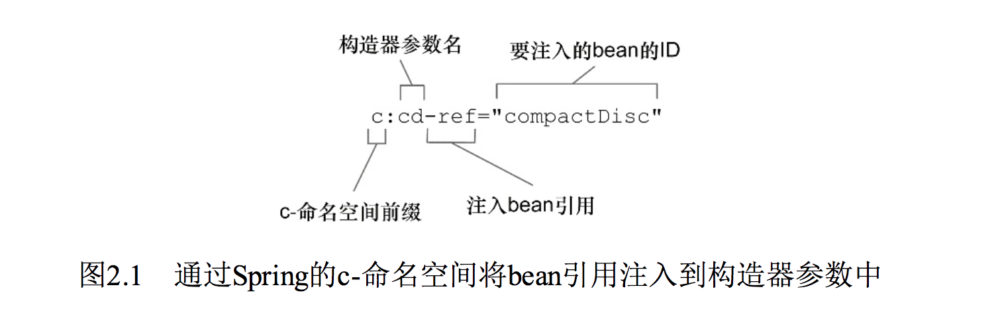
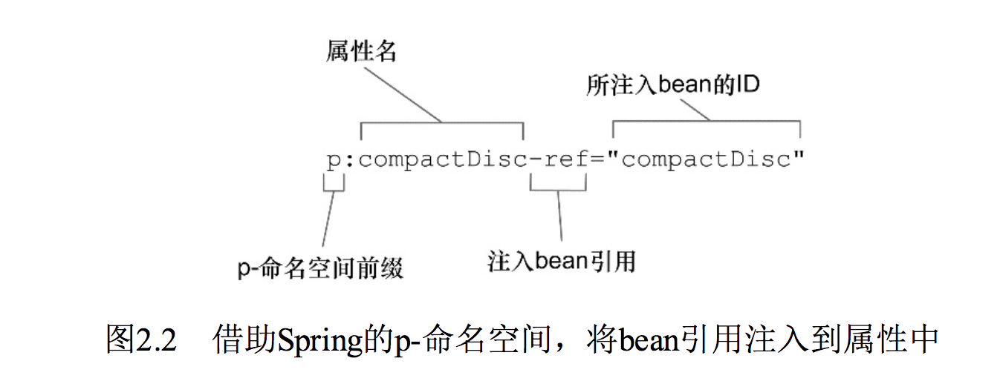
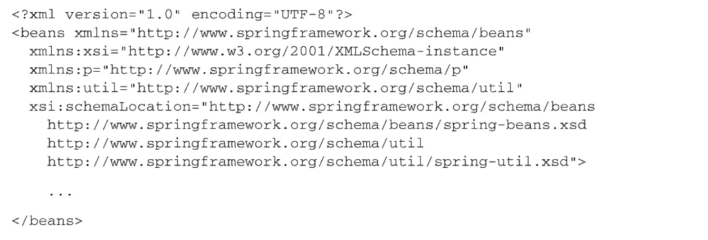
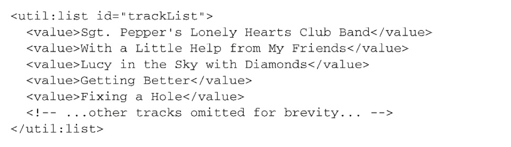
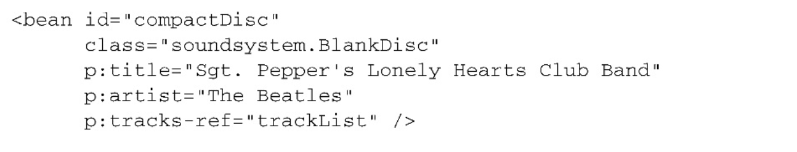
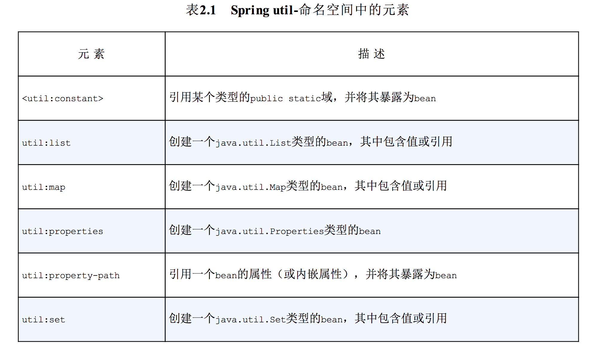

# 第2章 装配Bean
本章内容：

* 声明bean
* 构造器注入和Setter方法注入
* 装配bean控制
* bean的创建和销毁

在看电影的时候，你曾经在电影结束后留在位置上继续观看片尾字幕吗？一部电影需要由这么多人齐心协力才能制作出来，这真是有点令人难以置信！除了主要的参与人员——演员、编剧、导演和制片人，还有那些幕后人员——音乐师、特效制作人员和艺术指导，更不用说道具师、录音师、服装师、化妆师、特技演员、广告师、第一助理摄影师、第二助理摄影师、布景师、灯光师和伙食管理员（或许是最重要的人员）了。

现在想象一下，如果这些人彼此之间没有任何交流，你最喜爱的电影会变成什么样子？让我这么说吧，他们都出现在摄影棚中，开始各做各的事情，彼此之间互不合作。如果导演保持沉默不喊“开机”，摄影师就不会开始拍摄。或许这并没什么大不了的，因为女主角还呆在她的保姆车里，而且因为没有雇佣灯光师，一切处于黑暗之中。或许你曾经看过类似这样的电影。但是大多数电影（总之，都还是很优秀的）都是由成千上万的人一起协作来完成的，他们有着共同的目标：制作一部广受欢迎的佳作。

在这方面，一个优秀的软件与之相比并没有太大区别。

- **任何一个成功的应用都是由多个为了实现某一个业务目标而相互协作的组件构成的。这些组件必须彼此了解，并且相互协作来完成工作。**

例如，在一个在线购物系统中，订单管理组件需要和产品管理组件以及信用卡认证组件协作。这些组件或许还需要与数据访问组件协作，从数据库读取数据以及把数据写入数据库。

但是，正如我们在第1章中所看到的，创建应用对象之间关联关系的传统方法（通过构造器或者查找）通常会导致结构复杂的代码，这些代码很难被复用也很难进行单元测试。如果情况不严重的话，这些对象所做的事情只是超出了它应该做的范围；而最坏的情况则是，这些对象彼此之间高度耦合，难以复用和测试。

**在Spring中，对象无需自己查找或创建与其所关联的其他对象。相反，容器负责把需要相互协作的对象引用赋予各个对象。**例如，一个订单管理组件需要信用卡认证组件，但它不需要自己创建信用卡认证组件。订单管理组件只需要表明自己两手空空，容器就会主动赋予它一个信用卡认证组件。

- **创建应用对象之间协作关系的行为通常称为装配（wiring），这也是依赖注入（DI）的本质**。

在本章我们将介绍使用Spring装配 bean的基础知识。因为DI是Spring的最基本要素，所以在开发基于Spring的应用时，你随时都在使用这些技术。在Spring中装配bean有多种方式。作为本章的开始，我们先花一点时间来介绍一下配置Spring容器最常见的三种方法。

## 2.1 Spring配置的可选方案
如第1章中所述，Spring容器负责创建应用程序中的bean并通过DI来协调这些对象之间的关系。但是，作为开发人员，你需要告诉Spring要创建哪些bean并且如何将其装配在一起。当描述bean如何进行装配时，Spring具有非常大的灵活性，它提供了**三种主要的装配机制**：

* 在XML中进行显式配置。
* 在Java中进行显式配置。
* 隐式的bean发现机制和自动装配

乍看上去，提供三种可选的配置方案会使Spring变得复杂。每种配置技术所提供的功能会有一些重叠，所以在特定的场景中，确定哪种技术最为合适就会变得有些困难。但是，不必紧张——在很多场景下，选择哪种方案很大程度上就是个人喜好的问题，你尽可以选择自己最喜欢的方式。

- **根据个人喜好或团队要求使用**

Spring有多种可选方案来配置bean，这是非常棒的，但有时候你必须要在其中做出选择。这方面，并没有唯一的正确答案。你所做出的选择必须要适合你和你的项目。而且，谁说我们只能选择其中的一种方案呢？**Spring的配置风格是可以互相搭配的**，所以你可以选择使用XML装配一些bean，使用Spring基于Java的配置（JavaConfig）来装配另一些bean，而将剩余的bean让Spring去自动发现。

即便如此，**我的建议是尽可能地使用自动配置的机制。显式配置越少越好。**当你必须要显式配置bean的时候（比如，有些源码不是由你来维护的，而当你需要为这些代码配置bean的时候），我推荐使用类型安全并且比XML更加强大的JavaConfig。最后，只有当你想要使用便利的XML命名空间，并且在JavaConfig中没有同样的实现时，才应该使用XML。

> 推荐: 自动配置 > java 配置 > xml 配置

在本章中，我们会详细介绍这三种技术并且在整本书中都会用到它们。现在，我们会尝试一下每种方法，对它们是什么样子的有一个直观的印象。作为Spring配置的开始，我们先看一下Spring的自动化配置。

## 2.2 自动化装配bean
在本章稍后的内容中，你会看到如何借助Java和XML来进行Spring装配。尽管你会发现这些显式装配技术非常有用，但是在便利性方面，最强大的还是Spring的自动化配置。如果Spring能够进行自动化装配的话，那何苦还要显式地将这些bean装配在一起呢？

Spring从两个角度来实现自动化装配：

* **组件扫描（component scanning）**：Spring会自动发现应用上下文中所创建的bean。
* **自动装配（autowiring）**：Spring自动满足bean之间的依赖。

组件扫描和自动装配组合在一起就能发挥出强大的威力，它们能够将你的显式配置降低到最少。

为了阐述组件扫描和装配，我们需要创建几个bean，它们代表了一个音响系统中的组件。首先，要创建CompactDisc类，Spring会发现它并将其创建为一个bean。然后，会创建一个CDPlayer类，让Spring发现它，并将CompactDisc bean注入进来。

### 2.2.1 创建可被发现的bean
在这个MP3和流式媒体音乐的时代，CD（compact disc）显得有点典雅甚至陈旧。它不像卡带机、八轨磁带、塑胶唱片那么普遍，随着以物理载体进行音乐交付的方式越来越少，CD也变得越来越稀少了。

尽管如此，CD为我们阐述DI如何运行提供了一个很好的样例。如果你不将CD插入（注入）到CD播放器中，那么CD播放器其实是没有太大用处的。所以，可以这样说，CD播放器依赖于CD才能完成它的使命。

为了在Spring中阐述这个例子，让我们首先在Java中建立CD的概念。程序清单2.1展现了CompactDisc，它是定义CD的一个接口：

程序清单 2.1 CompactDisc接口在Java中定义了CD的概念

~~~
package com.alan.yx.springInAction.Chapter_02.stereo_autoconfig.src.main.java.soundsystem;

/**
 * 示例2.1
 * CD 接口
 */
public interface CompactDisc {
    void play();
}
~~~

CompactDisc的具体内容并不重要，重要的是你将其定义为一个接口。作为接口，它定义了CD播放器对一盘CD所能进行的操作。它将CD播放器的任意实现与CD本身的耦合降低到了最小的程度。

我们还需要一个CompactDisc的实现，实际上，我们可以有CompactDisc接口的多个实现。在本例中，我们首先会创建其中的一个实现，也就是程序清单2.2所示的SgtPeppers类。


程序清单2.2 带有@Component注解的CompactDisc实现类SgtPeppers

~~~
package com.alan.yx.springInAction.Chapter_02.stereo_autoconfig.src.main.java.soundsystem;

import org.springframework.stereotype.Component;

/**
 * 示例2.2
 * <p>
 * 带有@Component注解的CompactDisc实现类SgtPeppers
 */
@Component
public class SgtPeppers implements CompactDisc {

    private String title = "Sgt. Pepper's Lonely Hearts Club Band";
    
    private String artist = "The Beatles";

    @Override
    public void play() {
        System.out.println("Playing " + title + " by " + artist);
    }

}
~~~


和CompactDisc接口一样，SgtPeppers的具体内容并不重要。你需要注意的就是SgtPeppers类上使用了@Component注解。这个简单的注解表明该类会作为组件类，并告知Spring要为这个类创建bean。没有必要显式配置SgtPeppersbean，因为这个类使用了@Component注解，所以Spring会为你把事情处理妥当。

不过，**组件扫描默认是不启用的**。我们还需要显式配置一下Spring，从而命令它去寻找带有`@Component`注解的类，并为其创建bean。程序清单2.3的配置类展现了完成这项任务的最简洁配置。

程序清单2.3@ComponentScan注解启用了组件扫描类

~~~
package com.alan.yx.springInAction.Chapter_02.stereo_autoconfig.src.main.java.soundsystem;

import org.springframework.context.annotation.ComponentScan;
import org.springframework.context.annotation.Configuration;

/**
 * 示例2.3
 * <p>
 * 程序清单2.3@ComponentScan注解启用了组件扫描
 */
@Configuration
@ComponentScan
public class CDPlayerConfig {

}
~~~

CDPlayerConfig通过Java代码定义了Spring的装配规则。在2.3节中，我们还会更为详细地介绍基于Java的Spring配置。不过，现在我们只需观察一下CDPlayerConfig类并没有显式地声明任何bean，只不过它使用了@ComponentScan注解，这个注解能够在Spring中启用组件扫描。

- **@ComponentScan注解**：在Spring中启用组件扫描
- **Spring将会扫描这个包以及这个包下的所有子包，查找带有@Component注解的类**

如果没有其他配置的话，@ComponentScan默认会扫描与配置类相同的包。因为CDPlayerConfig类位于soundsystem包中，因此**Spring将会扫描这个包以及这个包下的所有子包，查找带有@Component注解的类**。这样的话，就能发现CompactDisc，并且会在Spring中自动为其创建一个bean。

如果你更倾向于使用XML来启用组件扫描的话，那么可以使用Spring context命名空间的**<context:component-scan>元素**。程序清单2.4展示了启用组件扫描的最简洁XML配置。

- **<context:component-scan>元素**：作用与 @ComponentScan 注解相同

程序清单2.4 通过XML启用组件扫描

~~~
<?xml version="1.0" encoding="UTF-8"?>
<beans xmlns="http://www.springframework.org/schema/beans"
       xmlns:xsi="http://www.w3.org/2001/XMLSchema-instance"
       xmlns:context="http://www.springframework.org/schema/context"
       xmlns:c="http://www.springframework.org/schema/c"
       xmlns:p="http://www.springframework.org/schema/p"
       xsi:schemaLocation="http://www.springframework.org/schema/beans http://www.springframework.org/schema/beans/spring-beans.xsd
		http://www.springframework.org/schema/context http://www.springframework.org/schema/context/spring-context.xsd">

    <context:component-scan
            base-package="com.alan.yx.springInAction.Chapter_02.stereo_autoconfig.src.main.java.soundsystem"/>

</beans>
~~~

尽管我们可以通过XML的方案来启用组件扫描，但是在后面的讨论中，我更多的还是会使用基于Java的配置。如果你更喜欢XML的话，<context:component-scan>元素会有与@ComponentScan注解相对应的属性和子元素。

可能有点让人难以置信，我们只创建了两个类，就能对功能进行一番尝试了。为了测试组件扫描的功能，我们创建一个简单的JUnit测试，它会创建Spring上下文，并判断CompactDisc是不是真的创建出来了。程序清单2.5中的CDPlayerTest就是用来完成这项任务的。

程序清单2.5 测试组件扫描能够发现CompactDisc

~~~
package com.alan.yx.springInAction.Chapter_02.stereo_autoconfig.src.test.java.soundsystem;

import com.alan.yx.springInAction.Chapter_02.stereo_autoconfig.src.main.java.soundsystem.CDPlayerConfig;
import com.alan.yx.springInAction.Chapter_02.stereo_autoconfig.src.main.java.soundsystem.CompactDisc;
import com.alan.yx.springInAction.Chapter_02.stereo_autoconfig.src.main.java.soundsystem.MediaPlayer;
import org.junit.Test;
import org.junit.runner.RunWith;
import org.springframework.beans.factory.annotation.Autowired;
import org.springframework.test.context.ContextConfiguration;
import org.springframework.test.context.junit4.SpringJUnit4ClassRunner;

import static org.junit.Assert.assertNotNull;

@RunWith(SpringJUnit4ClassRunner.class)
@ContextConfiguration(classes=CDPlayerConfig.class)
public class CDPlayerTest {

  @Autowired
  private MediaPlayer player;

  @Autowired
  private CompactDisc cd;

  @Test
  public void cdShouldNotBeNull() {
    assertNotNull(cd);
  }

}
~~~

CDPlayerTest使用了Spring的 **SpringJUnit4ClassRunner**，以便在测试开始的时候自动创建Spring的应用上下文。注解 @ContextConfiguration会告诉它需要在CDPlayerConfig中加载配置。因为CDPlayerConfig类中包含了@ComponentScan，因此最终的应用上下文中应该包含CompactDiscbean。

为了证明这一点，在测试代码中有一个CompactDisc类型的属性，并且这个属性带有@Autowired注解，以便于将CompactDisc bean注入到测试代码之中（稍后，我会讨论@Autowired）。最后，会有一个简单的测试方法断言cd属性不为null。如果它不为null的话，就意味着Spring能够发现CompactDisc类，自动在Spring上下文中将其创建为bean并将其注入到测试代码之中。

这个代码应该能够通过测试，并以测试成功的颜色显示（在你的测试运行器中，或许会希望出现绿色）。你第一个简单的组件扫描练习就成功了！尽管我们只用它创建了一个bean，但同样是这么少的配置能够用来发现和创建任意数量的bean。在soundsystem包及其子包中，所有带有@Component注解的类都会创建为bean。只添加一行@ComponentScan注解就能自动创建无数个bean，这种权衡还是很划算的。

现在，我们会更加深入地探讨@ComponentScan和@Component，看一下使用组件扫描还能做些什么。

### 2.2.2 为组件扫描的bean命名
Spring应用上下文中所有的bean都会给定一个ID。在前面的例子中，尽管我们没有明确地为SgtPeppersbean设置ID，但Spring会根据类名为其指定一个ID。具体来讲，这个bean所给定的ID为sgtPeppers，也就是将类名的第一个字母变为小写。

- spring 默认的 bean 的id:**将类名的第一个字母变为小写**

如果想为这个bean设置不同的ID，你所要做的就是将期望的ID作为值传递给@Component注解。比如说，如果想将这个bean标识为lonelyHeartsClub，那么你需要将SgtPeppers类的@Component注解配置为如下所示：

~~~
@Component("lonelyHeartsClub")
public class SgtPeppers implements CompactDisc {

	. . .

}
~~~

还有另外一种为bean命名的方式，这种方式不使用@Component注解，而是使用Java依赖注入规范（Java Dependency Injection）中所提供的@Named注解来为bean设置ID：

~~~
@Named("lonelyHeartsClub")
public class SgtPeppers implements CompactDisc {

	. . .

}
~~~

Spring支持将@Named作为@Component注解的替代方案。两者之间有一些细微的差异，但是在大多数场景中，它们是可以互相替换的。

话虽如此，我更加强烈地喜欢@Component注解，而对于@Named......怎么说呢，我感觉它的名字起得很不好。它并没有像@Component那样清楚地表明它是做什么的。因此在本书及其示例代码中，我不会再使用@Named。

### 2.2.3 设置组件扫描的基础包
到现在为止，我们没有为@ComponentScan设置任何属性。这意味着，按照默认规则，它会以配置类所在的包作为基础包（base package）来扫描组件。但是，如果你想扫描不同的
包，那该怎么办呢？或者，如果你想扫描多个基础包，那又该怎么办呢？

有一个原因会促使我们明确地设置基础包，那就是我们想要将配置类放在单独的包中，使其与其他的应用代码区分开来。如果是这样的话，那默认的基础包就不能满足要求了。

要满足这样的需求其实也完全没有问题！为了指定不同的基础包，你所需要做的就是在@ComponentScan的value属性中指明包的名称：

~~~
@Configuration
@ComponentScan("soundsystem")
public class CDPlayerConfig {
	. . .
}
~~~

如果你想更加清晰地表明你所设置的是基础包，那么你可以通过basePackages属性进行配置：

~~~
@Configuration
@ComponentScan(basePackages = "soundsystem")
public class CDPlayerConfig {

}
~~~

可能你已经注意到了basePackages属性使用的是复数形式。如果你揣测这是不是意味着可以设置多个基础包，那么恭喜你猜对了。如果想要这么做的话，只需要将basePackages属性设置为要扫描包的一个数组即可：

~~~
@Configuration
@ComponentScan(basePackages = {"soundsystem","video"})
public class CDPlayerConfig {

}
~~~

在上面的例子中，所设置的基础包是以String类型表示的。我认为这是可以的，但这种方法是类型不安全（not type-safe）的。如果你重构代码的话，那么所指定的基础包可能就会出现错误了。

除了将包设置为简单的String类型之外，@ComponentScan还提供了另外一种方法，那就是将其指定为包中所包含的类或接口：

~~~
@Configuration
@ComponentScan(basePackageClasses = {CDPlayer.class,CDPlayerConfig.class})
public class CDPlayerConfig {

}
~~~

可以看到，basePackages属性被替换成了basePackageClasses。同时，我们不是再使用String类型的名称来指定包，为basePackageClasses属性所设置的数组中包含了类。这些类所在的包将会作为组件扫描的基础包。

尽管在样例中，我为basePackageClasses设置的是组件类，但是你可以考虑在包中创建一个用来进行扫描的空标记接口（marker interface）。通过标记接口的方式，你依然能够保持对重构友好的接口引用，但是可以避免引用任何实际的应用程序代码（在稍后重构中，这些应用代码有可能会从想要扫描的包中移除掉）。

在你的应用程序中，如果所有的对象都是独立的，彼此之间没有任何依赖，就像SgtPeppersbean这样，那么你所需要的可能就是组件扫描而已。但是，很多对象会依赖其
他的对象才能完成任务。这样的话，我们就需要有一种方法**能够将组件扫描得到的bean和它们的依赖装配在一起**。要完成这项任务，我们需要了解一下Spring自动化配置的另外一方面内容，那就是自动装配。

- **自动装配**

### 2.2.4 通过为bean添加注解实现自动装配
简单来说，自动装配就是让Spring自动满足bean依赖的一种方法，在满足依赖的过程中，会在Spring应用上下文中寻找匹配某个bean需求的其他bean。为了声明要进行自动装配，我们可以借助Spring的@Autowired注解。

比方说，考虑程序清单2.6中的CDPlayer类。它的构造器上添加了@Autowired注解，这表明当Spring创建CDPlayerbean的时候，会通过这个构造器来进行实例化并且会传入一个可设置给CompactDisc类型的bean。

程序清单2.6 通过自动装配，将一个CompactDisc注入到CDPlayer之中

~~~
@Component
public class CDPlayer implements MediaPlayer {
    
    private CompactDisc cd;

    @Autowired
    public CDPlayer(CompactDisc cd) {
        this.cd = cd;
    }

    public void play() {
        cd.play();
    }

}
~~~

- **@Autowired注解不仅能够用在构造器上，还能用在方法上**
- required属性设置为false,注意 null 判断

比如说，如果CDPlayer有一个setCompactDisc()方法，那么可以采用如下的注解形式进行自动装配：

~~~
@Component
public class CDPlayer implements MediaPlayer {

    private CompactDisc cd;
    
    @Autowired
    public void setCd(CompactDisc cd) {
        this.cd = cd;
    }

}
~~~


在Spring初始化bean之后，它会尽可能得去满足bean的依赖，在本例中，依赖是通过带有@Autowired注解的方法进行声明的，也就是setCompactDisc()。

实际上，Setter方法并没有什么特殊之处。@Autowired注解可以用在类的任何方法上。假设CDPlayer类有一个insertDisc()方法，那么@Autowired能够像在setCompactDisc()上那样，发挥完全相同的作用：

~~~
@Component
public class CDPlayer implements MediaPlayer {

    private CompactDisc cd;
    
    @Autowired
    public void insertDisc(CompactDisc cd) {
        this.cd = cd;
    }

}
~~~

不管是构造器、Setter方法还是其他的方法，Spring都会尝试满足方法参数上所声明的依赖。假如有且只有一个bean匹配依赖需求的话，那么这个bean将会被装配进来。如果没有匹配的bean，那么在应用上下文创建的时候，Spring会抛出一个异常。为了避免异常的出现，你可以将@Autowired的required属性设置为false：

~~~
@Component
public class CDPlayer implements MediaPlayer {
    
    private CompactDisc cd;

    @Autowired(required=false)
    public CDPlayer(CompactDisc cd) {
        this.cd = cd;
    }

}
~~~

将required属性设置为false时，Spring会尝试执行自动装配，但是如果没有匹配的bean的话，Spring将会让这个bean处于未装配的状态。但是，把required属性设置为false时，你需要谨慎对待。如果在你的代码中没有进行null检查的话，这个处于未装配状态的属性有可能会出现NullPointerException。

如果有多个bean都能满足依赖关系的话，Spring将会抛出一个异常，表明没有明确指定要选择哪个bean进行自动装配。在第3章中，我们会进一步讨论自动装配中的歧义性。

@Autowired是Spring特有的注解。如果你不愿意在代码中到处使用Spring的特定注解来完成自动装配任务的话，那么你可以考虑将其替换为@Inject：

~~~
@Named
public class CDPlayer implements MediaPlayer {
    
    private CompactDisc cd;

    @Inject
    public CDPlayer(CompactDisc cd) {
        this.cd = cd;
    }

}
~~~

@Inject注解来源于Java依赖注入规范，该规范同时还为我们定义了@Named注解。在自动装配中，Spring同时支持@Inject和@Autowired。尽管@Inject和@Autowired之间有着一些细微的差别，但是在大多数场景下，它们都是可以互相替换的。

在@Inject和@Autowired中，我没有特别强烈的偏向性。实际上，在有的项目中，我会发现我同时使用了这两个注解。不过在本书的样例中，我会一直使用@Autowired，而你可以根据自己的情况，选择其中的任意一个。


### 2.2.5 验证自动装配
现在，我们已经在CDPlayer的构造器中添加了@Autowired注解，Spring将把一个可分配给CompactDisc类型的bean自动注入进来。为了验证这一点，让我们修改一下CDPlayerTest，使其能够借助CDPlayer bean播放CD：

~~~
package com.alan.yx.springInAction.Chapter_02.stereo_autoconfig.src.test.java.soundsystem;

import com.alan.yx.springInAction.Chapter_02.stereo_autoconfig.src.main.java.soundsystem.CDPlayerConfig;
import com.alan.yx.springInAction.Chapter_02.stereo_autoconfig.src.main.java.soundsystem.CompactDisc;
import com.alan.yx.springInAction.Chapter_02.stereo_autoconfig.src.main.java.soundsystem.MediaPlayer;
import org.junit.Test;
import org.junit.runner.RunWith;
import org.springframework.beans.factory.annotation.Autowired;
import org.springframework.test.context.ContextConfiguration;
import org.springframework.test.context.junit4.SpringJUnit4ClassRunner;

import static org.junit.Assert.assertNotNull;

/**
 * 程序清单2.6中的CDPlayer类
 */
@RunWith(SpringJUnit4ClassRunner.class)
@ContextConfiguration(classes=CDPlayerConfig.class)
public class CDPlayerTest {

  @Autowired
  private MediaPlayer player;

  @Autowired
  private CompactDisc cd;

  @Test
  public void cdShouldNotBeNull() {
    assertNotNull(cd);
  }

  @Test
  public void play() {
    player.play();
  }

}
~~~

现在，除了注入CompactDisc，我们还将CDPlayerbean注入到测试代码的player成员变量之中（它是更为通用的MediaPlayer类型）。在play()测试方法中，我们可以调用CDPlayer的play()方法，并断言它的行为与你的预期一致。

在测试代码中使用System.out.println()是稍微有点棘手的事情。因此，该样例中使用了StandardOutputStreamLog，这是来源于System Rules库（http://stefanbirkner.github.io/system-rules/index.html）的一个JUnit规则，该规则能够基于控制台的输出编写断言。在这里，我们断言SgtPeppers.play()方法的输出被发送到了控制台上。

现在，你已经了解了组件扫描和自动装配的基础知识，在第3章中，当我们介绍如何处理自动装配的歧义性时，还会继续研究组件扫描。但是现在，我们先将组件扫描和自动装配放在一边，看一下在Spring中如何显式地装配
bean，首先从通过Java代码编写配置开始。

## 2.3 通过Java代码装配bean
尽管在很多场景下通过组件扫描和自动装配实现Spring的自动化配置是更为推荐的方式，但有时候自动化配置的方案行不通，因此需要明确配置Spring。比如说，你想要将第三方库中的组件装配到你的应用中，在这种情况下，是没有办法在它的类上添加@Component和@Autowired注解的，不能使用自动化装配的方案了。

在这种情况下，你必须要采用显式装配的方式。在进行显式配置的时候，有两种可选方案：**Java和XML**。在这节中，我们将会学习如何使用Java配置，接下来的一节中将会继续学习Spring的XML配置。

就像我之前所说的，**在进行显式配置时，Java Config是更好的方案，因为它更为强大、类型安全并且对重构友好。**因为它就是Java代码，就像应用程序中的其他Java代码一样。

同时，JavaConfig与其他的Java代码又有所区别，在概念上，它与应用程序中的业务逻辑和领域代码是不同的。尽管它与其他的组件一样都使用相同的语言进行表述，但JavaConfig是配置代码。这意味着它不应该包含任何业务逻辑，JavaConfig也不应该侵入到业务逻辑代码之中。尽管不是必须的，但**【编程习惯】通常会将JavaConfig放到单独的包中，使它与其他的应用程序逻辑分离开来，这样对于它的意图就不会产生困惑了。**

接下来，让我们看一下如何通过JavaConfig显式配置Spring。

### 2.3.1 创建配置类
在本章前面的程序清单2.3中，我们第一次见识到JavaConfig。让我们重温一下那个样例中的CDPlayerConfig：

~~~
@Configuration
public class CDPlayerConfig {

}
~~~

- 创建JavaConfig类的关键在于为其添加**@Configuration注解**，**@Configuration注解表明这个类是一个配置类，该类应该包含在Spring应用上下文中如何创建bean的细节**。

到此为止，我们都是依赖组件扫描来发现Spring应该创建的bean。尽管我们可以同时使用组件扫描和显式配置，但是在本节中，我们更加关注于显式配置，因此我将CDPlayerConfig的@ComponentScan注解移除掉了。

移除了@ComponentScan注解，此时的CDPlayerConfig类就没有任何作用了。如果你现在运行CDPlayerTest的话，测试会失败，并且会出现BeanCreation- Exception异常。测试期望被注入CDPlayer和CompactDisc，但是这些bean根本就没有创建，因为组件扫描不会发现它们。

为了再次让测试通过，你可以将@ComponentScan注解添加回去，但是我们这一节关注显式配置，因此让我们看一下如何使用JavaConfig装配CDPlayer和CompactDisc。

### 2.3.2 声明简单的bean
要在JavaConfig中声明bean，我们需要编写一个方法，这个方法会创建所需类型的实例，然后给这个方法添加@Bean注解。比方说，下面的代码声明了CompactDisc bean：

~~~
  @Bean
  public CompactDisc compactDisc() {
    return new SgtPeppers();
  }
~~~

@Bean注解会告诉Spring这个方法将会返回一个对象，该对象要注册为Spring应用上下文中的bean。方法体中包含了最终产生bean实例的逻辑。

- **默认情况下，bean的ID与带有@Bean注解的方法名是一样的**。

在本例中，bean的名字将会是sgtPeppers。如果你想为其设置成一个不同的名字的话，那么可以重命名该方法，也可以通过name属性指定一个不同的名字：

~~~
  @Bean(name = "otherName")
  public CompactDisc compactDisc() {
    return new SgtPeppers();
  }
~~~

不管你采用什么方法来为bean命名，bean声明都是非常简单的。方法体返回了一个新的SgtPeppers实例。这里是使用Java来进行描述的，因此我们可以发挥Java提供的所有功能，只要最终生成一个CompactDisc实例即可。

请稍微发挥一下你的想象力，我们可能希望做一点稍微疯狂的事情，比如说，在一组CD中随机选择一个CompactDisc来播放：

~~~
    @Bean
    public CompactDisc randomCD() {
        int choice = (int) Math.floor(Math.random() * 4);
        if(choice==0){
            return new CompactDiscOne();
        }else if(choice==1){
            return new CompactDiscTwo();
        }else {
            return new SgtPeppers();
        }
    }
~~~

现在，你可以自己想象一下，借助@Bean注解方法的形式，我们该如何发挥出Java的全部威力来产生bean。当你想完之后，我们要回过头来看一下在JavaConfig中，如何将CompactDisc注入到CDPlayer之中。

### 2.3.3 借助JavaConfig实现注入
我们前面所声明的CompactDisc bean是非常简单的，它自身没有其他的依赖。但现在，我们需要声明CDPlayerbean，它依赖于CompactDisc。在JavaConfig中，要如何将它们装配在一起呢？

在JavaConfig中装配bean的最简单方式就是引用创建bean的方法。例如，下面就是一种声明CDPlayer的可行方案：

~~~
	 @Bean
    public CDPlayer cdPlayer() {
        return new CDPlayer(sgtPeppers());
    }
~~~


cdPlayer()方法像sgtPeppers()方法一样，同样使用了@Bean注解，这表明这个方法会创建一个bean实例并将其注册到Spring应用上下文中。所创建的bean ID为cdPlayer，与方法的名字相同。

cdPlayer()的方法体与sgtPeppers()稍微有些区别。在这里并没有使用默认的构造器构建实例，而是调用了需要传入CompactDisc对象的构造器来创建CDPlayer实例。

看起来，CompactDisc是通过调用sgtPeppers()得到的，但情况并非完全如此。因为sgtPeppers()方法上添加了@Bean注解，Spring将会拦截所有对它的调用，并确保直接返回该方法所创建的bean，而不是每次都对其进行实际的调用。

比如说，假设你引入了一个其他的CDPlayerbean，它和之前的那个bean完全一样：

~~~
 	@Bean
    public CDPlayer cdPlayer() {
        return new CDPlayer(sgtPeppers());
    }
    
     @Bean
    public CDPlayer anotherCdPlayer() {
        return new CDPlayer(sgtPeppers());
    }
~~~


假如对sgtPeppers()的调用就像其他的Java方法调用一样的话，那么每个CDPlayer实例都会有一个自己特有的SgtPeppers实例。如果我们讨论的是实际的CD播放器和CD光盘的话，这么做是有意义的。如果你有两台CD播放器，在物理上并没有办法将同一张CD光盘放到两个CD播放器中。

但是，在软件领域中，我们完全可以将同一个SgtPeppers实例注入到任意数量的其他bean之中。**默认情况下，Spring中的bean都是单例的**，我们并没有必要为第二个CDPlayer bean创建完全相同的SgtPeppers实例。所以，Spring会拦截对sgtPeppers()的调用并确保返回的是Spring所创建的bean，也就是Spring本身在调用sgtPeppers()时所创建的CompactDiscbean。因此，**两个CDPlayer bean会得到相同的SgtPeppers实例。**

可以看到，通过调用方法来引用bean的方式有点令人困惑。其实还有一种理解起来更为简单的方式：

~~~
@Bean
    public CDPlayer cdPlayer(CompactDisc compactDisc) {
        return new CDPlayer(compactDisc);
    }
~~~

在这里，cdPlayer()方法请求一个CompactDisc作为参数。当Spring调用cdPlayer()创建CDPlayerbean的时候，它会自动装配一个CompactDisc到配置方法之中。然后，方法体就可以按照合适的方式来使用它。借助这种技术，cdPlayer()方法也能够将CompactDisc注入到CDPlayer的构造器中，而且不用明确引用CompactDisc的@Bean方法。

**通过这种方式引用其他的bean通常是最佳的选择，**因为它不会要求将CompactDisc声明到同一个配置类之中。在这里甚至没有要求CompactDisc必须要在JavaConfig中声明，实际上它可以通过组件扫描功能自动发现或者通过XML来进行配置。你可以**将配置分散到多个配置类、XML文件以及自动扫描和装配bean之中，只要功能完整健全即可。**不管CompactDisc是采用什么方式创建出来的，Spring都会将其传入到配置方法中，并用来创建CDPlayerbean。

另外，需要提醒的是，我们在这里使用CDPlayer的构造器实现了DI功能，但是我们完全可以采用其他风格的DI配置。比如说，如果你想通过Setter方法注入CompactDisc的话，那么代码看起来应该是这样的：

~~~
@Bean
    public CDPlayer cdPlayer(CompactDisc compactDisc) {
    	  CDPlayer cdPlayer = new CDPlayer()；
    	  cdPlayer.setCompactDisc(compactDisc)
        return cdPlayer;
    }
~~~

再次强调一遍，带有@Bean注解的方法可以采用任何必要的Java功能来产生bean实例。构造器和Setter方法只是@Bean方法的两个简单样例。这里所存在的可能性仅仅受到Java语言的限制。

## 2.4 通过XML装配bean
到此为止，我们已经看到了如何让Spring自动发现和装配bean，还看到了如何进行手动干预，即通过JavaConfig显式地装配bean。但是，在装配bean的时候，还有一种可选方案，尽管这种方案可能不太合乎大家的心意，但是它在Spring中已经有很长的历史了。

在Spring刚刚出现的时候，XML是描述配置的主要方式。在Spring的名义下，我们创建了无数行XML代码。在一定程度上，Spring成为了XML配置的同义词。

尽管Spring长期以来确实与XML有着关联，但现在需要明确的是，XML不再是配置Spring的唯一可选方案。Spring现在有了强大的自动化配置和基于Java的配置，XML不应该再是你的第一选择了。

不过，鉴于已经存在那么多基于XML的Spring配置，所以理解如何在Spring中使用XML还是很重要的。但是，我希望本节的内容只是用来帮助你维护已有的XML配置，在完成新的Spring工作时，希望你会使用自动化配置和JavaConfig。

- **【推荐】除了维护已有的XML配置，在完成新的Spring工作时，希望你会使用自动化配置和JavaConfig**。

### 2.4.1 创建XML配置规范
在使用XML为Spring装配bean之前，你需要创建一个新的配置规范。在使用JavaConfig的时候，这意味着要创建一个带有@Configuration注解的类，而在XML配置中，这意味着要创建一个XML文件，并且要以<beans>元素为根。

最为简单的Spring XML配置如下所示：

~~~
<?xml version="1.0" encoding="UTF-8"?>
<beans xmlns="http://www.springframework.org/schema/beans"
       xmlns:xsi="http://www.w3.org/2001/XMLSchema-instance"
       xmlns:c="http://www.springframework.org/schema/c"
       xsi:schemaLocation="http://www.springframework.org/schema/beans http://www.springframework.org/schema/beans/spring-beans.xsd">

    <!--configuration details go here-->

</beans>
~~~

很容易就能看出来，这个基本的XML配置已经比同等功能的JavaConfig类复杂得多了。作为起步，在JavaConfig中所需要的只是@Configuration，但在使用XML时，需要在配置文件的顶部声明多个**XML模式（XSD）文件**，这些文件定义了配置Spring的XML元素。

借助`Spring Tool Suite`创建XML配置文件创建和管理Spring XML配置文件的一种简便方式是使用Spring Tool Suite（https://spring.io/tools/sts）。在Spring Tool Suite的菜单中，选择File>New>Spring Bean Configuration File，能够创建Spring XML配置文件，并且可以选择可用的配置命名空间。

- **`Spring Tool Suite`**:创建管理 XML 文件

用来装配bean的最基本的XML元素包含在spring-beans模式之中，在上面这个XML文件中，它被定义为根命名空间。**<beans>是该模式中的一个元素，它是所有Spring配置文件的根元素。**


在XML中配置Spring时，还有一些其他的模式。尽管在本书中，我更加关注自动化以及基于Java的配置，但是在本书讲解的过程中，当出现其他模式的时候，我至少会提醒你。

就这样，我们已经有了一个合法的Spring XML配置。不过，它也是一个没有任何用处的配置，因为它（还）没有声明任何bean。为了给予它生命力，让我们重新创建一下CD样例，只不过我们这次使用XML配置，而不是使用JavaConfig和自动化装配。

### 2.4.2 声明一个简单的<bean>
要在基于XML的Spring配置中声明一个bean，我们要使用spring-beans模式中的另外一个元素：**<bean>**。<bean>元素类似于JavaConfig中的@Bean注解。我们可以按照如下的方式声明CompactDisc bean：

~~~
<bean class="soundsystem.SgtPeppers"/>
~~~

这里声明了一个很简单的bean，创建这个bean的类通过class属性来指定的，并且要使用**全限定的类名**。

因为没有明确给定ID，所以这个bean将会根据全限定类名来进行命名。在本例中，bean的ID将会是“soundsystem.SgtPeppers#0”。其中，“#0”是一个计数的形式，用来区分相同类型的其他bean。如果你声明了另外一个SgtPeppers，并且没有明确进行标识，那么它自动得到的ID将会是“soundsystem.SgtPeppers#1”。

尽管自动化的bean命名方式非常方便，但如果你要稍后引用它的话，那自动产生的名字就没有多大的用处了。因此，通常来讲更好的办法是借助id属性，为每个bean设置一个你自己选择的名字：

~~~
<bean id="compactDisc" class="soundsystem.SgtPeppers"/>
~~~

稍后将这个bean装配到CDPlayer bean之中的时候，你会用到这个具体的名字。

> 减少繁琐为了减少XML中繁琐的配置，只对那些需要按名字引用的bean（比如，你需要将对它的引用注入到另外一个bean中）进行明确地命名。

在进一步学习之前，让我们花点时间看一下这个简单bean声明的一些特征。

第一件需要注意的事情就是你不再需要直接负责创建SgtPeppers的实例，在基于JavaConfig的配置中，我们是需要这样做的。当Spring发现这个<bean>元素时，它将会调用SgtPeppers的默认构造器来创建bean。在XML配置中，bean的创建显得更加被动，不过，它并没有**JavaConfig那样强大**，在JavaConfig配置方式中，你可以通过任何可以想象到的方法来创建bean实例。

另外一个需要注意到的事情就是，在这个简单的<bean>声明中，我们将bean的类型以字符串的形式设置在了class属性中。谁能保证设置给class属性的值是真正的类呢？**Spring的XML配置并不能从编译期的类型检查中受益。**即便它所引用的是实际的类型，如果你重命名了类，会发生什么呢？(容易出错)

> 借助IDE检查XML的合法性使用能够感知Spring功能的IDE，如Spring Tool Suite，能够在很大程度上帮助你确保Spring XML配置的合法性。

以上介绍的只是JavaConfig要优于XML配置的部分原因。我建议在为你的应用选择配置风格时，要记住XML配置的这些缺点。接下来，我们继续Spring XML配置的学习进程，了解如何将SgtPeppersbean注入到CDPlayer之中。

### 2.4.3 借助构造器注入初始化bean
在Spring XML配置中，只有一种声明bean的方式：使用<bean>元素并指定class属性。Spring会从这里获取必要的信息来创建bean。

但是，在XML中声明DI时，会有多种可选的配置方案和风格。具体到构造器注入，有两种基本的配置方案可供选择：

* <constructor-arg>元素
* 使用Spring 3.0所引入的c-命名空间

> 两者的区别在很大程度就是是否冗长烦琐。可以看到，<constructor-arg>元素比使用c-命名空间会更加冗长，从而导致XML更加难以读懂。另外，有些事情<constructor-arg>可以做到，但是使用c-命名空间却无法实现。

在介绍Spring XML的构造器注入时，我们将会分别介绍这两种可选方案。首先，看一下它们各自如何注入bean引用。

#### 构造器注入bean引用
按照现在的定义，CDPlayerbean有一个接受CompactDisc类型的构造器。这样，我们就有了一个很好的场景来学习如何注入bean的引用。

现在已经声明了SgtPeppers bean，并且SgtPeppers类实现了CompactDisc接口，所以实际上我们已经有了一个可以注入到CDPlayerbean中的bean。我们所需要做的就是在XML中声明CDPlayer并通过ID引用SgtPeppers：

~~~
<bean id="cdPlayer" class="soundsystem.CDPlayer">
	<constructor-arg ref="compactDisc">
</bean>
~~~

当Spring遇到这个<bean>元素时，它会创建一个CDPlayer实例。<constructor-arg>元素会告知Spring要将一个ID为compactDisc的bean引用传递到CDPlayer的构造器中。

作为替代的方案，你也可以使用Spring的c-命名空间。c-命名空间是在Spring 3.0中引入的，它是在XML中更为简洁地描述构造器参数的方式。要使用它的话，必须要在XML的顶部声明其模式，如下所示：

~~~
<beans xmlns="http://www.springframework.org/schema/beans"
       xmlns:xsi="http://www.w3.org/2001/XMLSchema-instance"
       xmlns:c="http://www.springframework.org/schema/c"
       xsi:schemaLocation="http://www.springframework.org/schema/beans http://www.springframework.org/schema/beans/spring-beans.xsd">
		
		. . . 
		
</beans>
~~~

在c-命名空间和模式声明之后，我们就可以使用它来声明构造器参数了，如下所示：

~~~
<bean id="cdPlayer" class="soundsystem.CDPlayer" c:cd-ref="compactDisc"/>
~~~

在这里，我们使用了c-命名空间来声明构造器参数，它作为<bean>元素的一个属性，不过这个属性的名字有点诡异。图2.1描述了这个属性名是如何组合而成的。

<div align="center">  </div><br>

属性名以“c:”开头，也就是命名空间的前缀。接下来就是要装配的构造器参数名，在此之后是“-ref”，这是一个命名的约定，它会告诉Spring，正在装配的是一个bean的引用，这个bean的名字是compactDisc，而不是字面量“compactDisc”。

很显然，使用c-命名空间属性要比使用<constructor-arg>元素简练得多。这是我很喜欢它的原因之一。除了更易读之外，当我在编写样例代码时，c-命名空间属性能够更加有助于使代码的长度保持在书的边框之内。

在编写前面的样例时，关于c-命名空间，有一件让我感到困扰的事情就是它直接引用了构造器参数的名称。引用参数的名称看起来有些怪异，因为这需要在编译代码的时候，将调试标志（debug symbol）保存在类代码中。如果你优化构建过程，将调试标志移除掉，那么这种方式可能就无法正常执行了。

替代的方案是我们使用参数在整个参数列表中的位置信息：

~~~
<bean id="cdPlayer" class="soundsystem.CDPlayer" c:_0-ref="compactDisc"/>
~~~

这个c-命名空间属性看起来似乎比上一种方法更加怪异。我将参数的名称替换成了“0”，也就是参数的索引。因为在XML中不允许数字作为属性的第一个字符，因此必须要添加一个下画线作为前缀。

**使用索引来识别构造器参数感觉比使用名字更好一些**。即便在构建的时候移除掉了调试标志，参数却会依然保持相同的顺序。如果有多个构造器参数的话，这当然是很有用处的。在这里因为只有一个构造器参数，所以我们还有另外一个方案——根本不用去标示参数：

~~~
<bean id="cdPlayer" class="soundsystem.CDPlayer" c:_-ref="compactDisc"/>
~~~

到目前为止，这是最为奇特的一个c-命名空间属性，这里没有参数索引或参数名。只有一个下画线，然后就是用“-ref”来表明正在装配的是一个引用。

我们已经将引用装配到了其他的bean之中，接下来看一下如何将字面量值（literal value）装配到构造器之中。

#### 将字面量注入到构造器中
迄今为止，我们所做的DI通常指的都是类型的装配——也就是将对象的引用装配到依赖于它们的其他对象之中——而有时候，我们需要做的只是用一个字面量值来配置对象。为了阐述这一点，假设你要创建CompactDisc的一个新实现，如下所示:

~~~
/**
 * 示例:将字面量注入到构造器中
 */
public class BlankDisc implements CompactDisc {

    private String title;
    private String artist;

    public BlankDisc(String title, String artist) {
        this.title = title;
        this.artist = artist;
    }

    public void play() {
        System.out.println("Playing " + title + " by " + artist);
    }

}
~~~

在SgtPeppers中，唱片名称和艺术家的名字都是硬编码的，但是这个CompactDisc实现与之不同，它更加灵活。像现实中的空磁盘一样，它可以设置成任意你想要的艺术家和唱片名。现在，我们可以将已有的SgtPeppers替换为这个类：

~~~
<bean id="compactDisc"
        class="com.alan.yx.springInAction.Chapter_02.stereo_mixedconfig.src.main.java.soundsystem.BlankDisc">
        <constructor-arg value="Sgt. Pepper's Lonely Hearts Club Band"></constructor-arg>
        <constructor-arg value="The Beatles"></constructor-arg>
</bean>
~~~

我们再次使用<constructor-arg>元素进行构造器参数的注入。但是这一次我们没有使用“ref”属性来引用其他的bean，而是使用了**value属性，通过该属性表明给定的值要以字面量的形式注入到构造器之中**。

如果要使用c-命名空间的话，这个例子又该是什么样子呢？第一种方案是引用构造器参数的名字：

~~~
<bean id="compactDisc"
        class="com.alan.yx.springInAction.Chapter_02.stereo_mixedconfig.src.main.java.soundsystem.BlankDisc">
        c:_title="Sgt. Pepper's Lonely Hearts Club Band"
        c:_artist="The Beatles"/>
~~~

可以看到，装配字面量与装配引用的区别在于属性名中去掉了“-ref”后缀。与之类似，我们也可以通过`参数索引`装配相同的字面量值，如下所示：


~~~
<bean id="compactDisc"
        class="com.alan.yx.springInAction.Chapter_02.stereo_mixedconfig.src.main.java.soundsystem.BlankDisc">
        c:_0="Sgt. Pepper's Lonely Hearts Club Band"
        c:_1="The Beatles"/>
~~~

XML不允许某个元素的多个属性具有相同的名字。因此，如果有两个或更多的构造器参数的话，我们不能简单地使用下画线进行标示。但是如果只有一个构造器参数的话，我们就可以这样做了。为了完整地展现该功能，假设BlankDisc只有一个构造器参数，这个参数接受唱片的名称。在这种情况下，我们可以在Spring中这样声明它：

~~~
<bean id="compactDisc"
        class="com.alan.yx.springInAction.Chapter_02.stereo_mixedconfig.src.main.java.soundsystem.BlankDisc">
        c:_="Sgt. Pepper's Lonely Hearts Club Band"/>
~~~

在装配bean引用和字面量值方面，<constructor-arg>和c-命名空间的功能是相同的。但是有一种情况是<constructor-arg>能够实现，c-命名空间却无法做到的。接下来，让我们看一下如何将集合装配到构造器参数中。

#### 装配集合
到现在为止，我们假设CompactDisc在定义时只包含了唱片名称和艺术家的名字。如果现实世界中的CD也是这样的话，那么在技术上就不会任何的进展。CD之所以值得购买是因为它上面所承载的音乐。大多数的CD都会包含十多个磁道，每个磁道上包含一首歌。

如果使用CompactDisc为真正的CD建模，那么它也应该有磁道列表的概念。请考虑下面这个新的BlankDisc：

~~~
package com.alan.yx.springInAction.Chapter_02.stereo_mixedconfig.src.main.java.soundsystem;

import java.util.List;

/**
 * 示例：装配集合
 */
public class BlankDisc implements CompactDisc {

    private String title;
    private String artist;
    /**
     * 磁道
     */
    private List<String> tracks;

    public BlankDisc(String title, String artist, List<String> tracks) {
        this.title = title;
        this.artist = artist;
        this.tracks = tracks;
    }

    @Override
    public void play() {
        System.out.println("Playing " + title + " by " + artist);
        for (String track : tracks) {
            System.out.println("-Track: " + track);
        }
    }

}
~~~

这个变更会对Spring如何配置bean产生影响，在声明bean的时候，我们必须要提供一个磁道列表。最简单的办法是将列表设置为null。因为它是一个构造器参数，所以必须要声明它，不过你可以采用如下的方式传递null给它：

~~~
<bean id="compactDisc"
        class="com.alan.yx.springInAction.Chapter_02.stereo_mixedconfig.src.main.java.soundsystem.BlankDisc">
        <constructor-arg value="Sgt. Pepper's Lonely Hearts Club Band"></constructor-arg>
        <constructor-arg value="The Beatles"></constructor-arg>
         <constructor-arg value="The Beatles"><null/></constructor-arg>
</bean>
~~~

<null/>元素所做的事情与你的期望是一样的：将null传递给构造器。这并不是解决问题的好办法，但在注入期它能正常执行。当调用play()方法时，你会遇到NullPointerException异常，因此这并不是理想的方案。更好的解决方法是提供一个磁道名称的列表。要达到这一点，我们可以有多个可选方案。首先，可以使用<list>元素将其声明为一个列表：

~~~
<?xml version="1.0" encoding="UTF-8"?>
<beans xmlns="http://www.springframework.org/schema/beans"
       xmlns:xsi="http://www.w3.org/2001/XMLSchema-instance"
       xmlns:c="http://www.springframework.org/schema/c"
       xsi:schemaLocation="http://www.springframework.org/schema/beans http://www.springframework.org/schema/beans/spring-beans.xsd">

    <bean id="compactDisc"
          class="com.alan.yx.springInAction.Chapter_02.stereo_mixedconfig.src.main.java.soundsystem.BlankDisc"
          c:_0="Sgt. Pepper's Lonely Hearts Club Band"
          c:_1="The Beatles">
        <constructor-arg>
            <list>
                <value>Sgt. Pepper's Lonely Hearts Club Band</value>
                <value>With a Little Help from My Friends</value>
                <value>Lucy in the Sky with Diamonds</value>
                <value>Getting Better</value>
                <value>Fixing a Hole</value>
                <!-- ...other tracks omitted for brevity... -->
            </list>
        </constructor-arg>
    </bean>

</beans>
~~~

其中，<list>元素是<constructor-arg>的子元素，这表明一个包含值的列表将会传递到构造器中。其中，<value>元素用来指定列表中的每个元素。

与之类似，我们也可以使用<ref>元素替代<value>，实现bean引用列表的装配。例如，假设你有一个Discography类，它的构造器如下所示：

~~~
public Discography(String artist, List<CompactDisc> cds) {. . .}
~~~

那么，你可以采取如下的方式配置Discography bean：

~~~
<?xml version="1.0" encoding="UTF-8"?>
<beans xmlns="http://www.springframework.org/schema/beans"
       xmlns:xsi="http://www.w3.org/2001/XMLSchema-instance"
       xmlns:c="http://www.springframework.org/schema/c"
       xsi:schemaLocation="http://www.springframework.org/schema/beans http://www.springframework.org/schema/beans/spring-beans.xsd">

    <bean id="compactDisc"
          class="com.alan.yx.springInAction.Chapter_02.stereo_mixedconfig.src.main.java.soundsystem. Discography"/>
        <constructor-arg>
            <list>
                <value>Sgt. Pepper's Lonely Hearts Club Band</value>
                <value>With a Little Help from My Friends</value>
                <value>Lucy in the Sky with Diamonds</value>
                <value>Getting Better</value>
                <value>Fixing a Hole</value>
                <!-- ...-->
            </list>
        </constructor-arg>
    </bean>

</beans>
~~~

当构造器参数的类型是java.util.List时，使用<list>元素是合情合理的。尽管如此，我们也可以按照同样的方式使用<set>元素：

~~~
<?xml version="1.0" encoding="UTF-8"?>
<beans xmlns="http://www.springframework.org/schema/beans"
       xmlns:xsi="http://www.w3.org/2001/XMLSchema-instance"
       xmlns:c="http://www.springframework.org/schema/c"
       xsi:schemaLocation="http://www.springframework.org/schema/beans http://www.springframework.org/schema/beans/spring-beans.xsd">

    <bean id="compactDisc"
          class="com.alan.yx.springInAction.Chapter_02.stereo_mixedconfig.src.main.java.soundsystem. Discography"/>
        <constructor-arg>
            <set>
                <ref bean="sgtPepers"/>
                <ref bean="sgtPepers2"/>
                <!-- ...-->
            </set>
        </constructor-arg>
    </bean>

</beans>
~~~

<set>和<list>元素的区别不大，其中最重要的不同在于当Spring创建要装配的集合时，所创建的是java.util.Set还是java.util.List。如果是Set的话，所有重复的值都会被忽略掉，存放顺序也不会得以保证。不过无论在哪种情况下，<set>或<list>都可以用来装配List、Set甚至数组。

在装配集合方面，<constructor-arg>比c-命名空间的属性更有优势。目前，使用c-命名空间的属性无法实现装配集合的功能。

使用<constructor-arg>和c-命名空间实现构造器注入时，它们之间还有一些细微的差别。但是到目前为止，我们所涵盖的内容已经足够了，尤其是像我之前所建议的那样，要首选基于Java的配置而不是XML。因此，与其不厌其烦地花费时间讲述如何使用XML进行构造器注入，还不如看一下如何使用XML来装配属性。

### 2.4.4 设置属性
到目前为止，CDPlayer和BlankDisc类完全是通过构造器注入的，没有使用属性的Setter方法。接下来，我们就看一下如何使用Spring XML实现属性注入。假设属性注入的CDPlayer如下所示：

~~~
import org.springframework.beans.factory.annotation.Autowired;

/**
 * 示例:属性注入的CDPlayer
 */
public class CDPlayer implements MediaPlayer {

    private CompactDisc cd;

    @Autowired
    public CDPlayer(CompactDisc cd) {
        this.cd = cd;
    }

    @Override
    public void play() {
        cd.play();
    }

}
~~~

该选择构造器注入还是属性注入呢？作为一个通用的规则，我倾向于**【推荐】对强依赖使用构造器注入，而对可选性的依赖使用属性注入。**按照这个规则，我们可以说对于BlankDisc来讲，唱片名称、艺术家以及磁道列表是强依赖，因此构造器注入是正确的方案。不过，对于CDPlayer来讲，它对CompactDisc是强依赖还是可选性依赖可能会有些争议。虽然我不太认同，但你可能会觉得即便没有将CompactDisc装入进去，CDPlayer依然还能具备一些有限的功能。

现在，CDPlayer没有任何的构造器（除了隐含的默认构造器），它也没有任何的强依赖。因此，你可以采用如下的方式将其声明为Spring bean：

~~~
<bean id="cdPlayer"
          class="soundsystem.CDPlayer">
~~~

Spring在创建bean的时候不会有任何的问题，但是CDPlayerTest会因为出现NullPointerException而导致测试失败，因为我们并没有注入CDPlayer的compactDisc属性。不过，按照如下的方式修改XML，就能解决该问题：

~~~
<bean id="cdPlayer"
          class="com.alan.yx.springInAction.Chapter_02.stereo_mixedconfig.src.main.java.soundsystem.CDPlayer">
        <property name="compactDisc" ref="compactDisc"> </property>>
    </bean>
~~~

<property>元素为属性的Setter方法所提供的功能与<constructor-arg>元素为构造器所提供的功能是一样的。在本例中，它引用了ID为compactDisc的bean（通过ref属性），并将其注入到compactDisc属性中（通过setCompactDisc()方法）。如果你现在运行测试的话，它应该就能通过了。

我们已经知道，Spring为<constructor-arg>元素提供了c-命名空间作为替代方案，与之类似，Spring提供了更加简洁的p-命名空间，作为<property>元素的替代方案。为了启用
p-命名空间，必须要在XML文件中与其他的命名空间一起对其进行声明：

~~~
<?xml version="1.0" encoding="UTF-8"?>
<beans xmlns="http://www.springframework.org/schema/beans"
       xmlns:xsi="http://www.w3.org/2001/XMLSchema-instance"
       xmlns:c="http://www.springframework.org/schema/c"
       xsi:schemaLocation="http://www.springframework.org/schema/beans http://www.springframework.org/schema/beans/spring-beans.xsd">
       
       。 。 。 

</beans>
~~~

我们可以使用p-命名空间，按照以下的方式装配compactDisc属性：

~~~
<bean id="cdPlayer"
          class="java.soundsystem.CDPlayer"
          p:compactDisc-ref="compactDisc"/>
~~~

p-命名空间中属性所遵循的命名约定与c-命名空间中的属性类似。图2.2阐述了p-命名空间属性是如何组成的。

<div align="center">  </div><br>

图2.2 借助Spring的p-命名空间，将bean引用注入到属性中首先，属性的名字使用了“p:”前缀，表明我们所设置的是一个属性。接下来就是要注入的属性名。最后，属性的名称以“-ref”结尾，这会提示Spring要进行装配的是引用，而不是字面量。

#### 将字面量注入到属性中
属性也可以注入字面量，这与构造器参数非常类似。作为示例，我们重新看一下BlankDisc bean。不过，BlankDisc这次完全通过属性注入进行配置，而不是构造器注入。新的BlankDisc类如下所示：

~~~
public class BlankDisc implements CompactDisc {

    private String title;
    private String artist;
    /**
     * 磁道
     */
    private List<String> tracks;

    public BlankDisc(String title, String artist, List<String> tracks) {
        this.title = title;
        this.artist = artist;
        this.tracks = tracks;
    }

    public void setTitle(String title) {
        this.title = title;
    }

    public void setArtist(String artist) {
        this.artist = artist;
    }

    public void setTracks(List<String> tracks) {
        this.tracks = tracks;
    }
}
~~~

现在，它不再强制要求我们装配任何的属性。你可以按照如下的方式创建一个BlankDiscbean，它的所有属性全都是空的：

~~~
<bean id="reallyBlankDisc"
          class="BlankDisc"/>
~~~

当然，如果在装配bean的时候不设置这些属性，那么在运行期CD播放器将不能正常播放内容。play()方法可能会遇到的输出内容是“Playing null by null”，随之会抛出NullPointerException异常，这是因为我们没有指定任何的磁道。所以，我们需要装配这些属性，可以借助<property>元素的value属性实现该功能：

```
 <bean id="compactDisc"
          class="com.alan.yx.springInAction.Chapter_02.stereo_mixedconfig.src.main.java.soundsystem.BlankDisc">
        <property name="title" value="Sgt. Pepper's Lonely Hearts Club Band"/>
        <property name="artist" value="the beatles"/>
        <property name="tracks>
            <list>
                <value>Sgt. Pepper's Lonely Hearts Club Band</value>
                <value>With a Little Help from My Friends</value>
                <value>Lucy in the Sky with Diamonds</value>
                <value>Getting Better</value>
                <value>Fixing a Hole</value>
                <!-- ...other tracks omitted for brevity... -->
            </list>
        </property>
    </bean>
```

在这里，除了使用<property>元素的value属性来设置title和artist，我们还使用了内嵌的<list>元素来设置tracks属性，这与之前通过<constructor-arg>装配tracks是完全一样的。

另外一种可选方案就是使用p-命名空间的属性来完成该功能：

```
 <bean id="compactDisc"
          class="com.alan.yx.springInAction.Chapter_02.stereo_mixedconfig.src.main.java.soundsystem.BlankDisc">
        p:title="Sgt. Pepper's Lonely Hearts Club Band"/>
        p:name="the beatles"/>
        <property name="tracks>
            <list>
                <value>Sgt. Pepper's Lonely Hearts Club Band</value>
                <value>With a Little Help from My Friends</value>
                <value>Lucy in the Sky with Diamonds</value>
                <value>Getting Better</value>
                <value>Fixing a Hole</value>
                <!-- ...other tracks omitted for brevity... -->
            </list>
        </property>
    </bean>
```

与c-命名空间一样，装配bean引用与装配字面量的唯一区别在于是否带有“-ref”后缀。如果没有“-ref”后缀的话，所装配的就是字面量。

但需要注意的是，我们不能使用p-命名空间来装配集合，没有便利的方式使用p-命名空间来指定一个值（或bean引用）的列表。但是，我们可以使用Spring util-命名空间中的一些功能来简化BlankDiscbean。

首先，需要在XML中声明util-命名空间及其模式：

<div align="center">  </div><br>

util-命名空间所提供的功能之一就是<util:list>元素，它会创建一个列表的bean。借助<util:list>，我们可以将磁道列表转移到BlankDisc bean之外，并将其声明到单独的bean之中，如下所示：

<div align="center">  </div><br>

现在，我们能够像使用其他的bean那样，将磁道列表bean注入到BlankDisc bean的tracks属性中：

<div align="center">  </div><br>

<util:list>只是util-命名空间中的多个元素之一。表2.1列出了util-命名空间提供的所有元素。
在需要的时候，你可能会用到util-命名空间中的部分成员。但现在，在结束本章前，我们看一下如何将自动化配置、JavaConfig以及XML配置混合并匹配在一起。

表2.1Spring util-命名空间中的元素

<div align="center">  </div><br>

元素描述<util:constant>引用某个类型的public static域，并将其暴露为beanutil:list创建一个java.util.List类型的bean，其中包含值或引用util:map创建一个java.util.Map类型的bean，其中包含值或引用util:properties创建一个java.util.Properties类型的beanutil:property-path引用一个bean的属性（或内嵌属性），并将其暴露为beanutil:set创建一个java.util.Set类型的bean，其中包含值或引用

## 2.5 导入和混合配置
在典型的Spring应用中，我们可能会同时使用自动化和显式配置。即便你更喜欢通过JavaConfig实现显式配置，但有的时候XML却是最佳的方案。

幸好在Spring中，这些配置方案都不是互斥的。你尽可以将JavaConfig的组件扫描和自动装配和/或XML配置混合在一起。实际上，就像在2.2.1小节中所看到的，我们至少需要有一点显式配置来启用组件扫描和自动装配。

关于混合配置，第一件需要了解的事情就是在自动装配时，它并不在意要装配的bean来自哪里。自动装配的时候会考虑到Spring容器中所有的bean，不管它是在JavaConfig或XML中声明的还是通过组件扫描获取到的。

你可能会想在显式配置时，比如在XML配置和Java配置中该如何引用bean呢。让我们先看一下如何在JavaConfig中引用XML配置的bean。

### 2.5.1 在JavaConfig中引用XML配置
现在，我们临时假设CDPlayerConfig已经变得有些笨重，我们想要将其进行拆分。当然，它目前只定义了两个bean，远远称不上复杂的Spring配置。不过，我们假设两个bean就已经太多了。

我们所能实现的一种方案就是将BlankDisc从CDPlayerConfig拆分出来，定义到它自己的CDConfig类中，如下所示：

```
package com.alan.yx.springInAction.Chapter_02.stereo_mixedconfig.src.main.java.soundsystem;

import org.springframework.context.annotation.Bean;
import org.springframework.context.annotation.Configuration;

@Configuration
public class CDConfig {
    @Bean
    public CompactDisc compactDisc() {
        return new SgtPeppers();
    }
}
```

compactDisc()方法已经从CDPlayerConfig中移除掉了，我们需要有一种方式将这两个类组合在一起。一种方法就是在CDPlayerConfig中使用@Import注解导入CDConfig：

```
import org.springframework.context.annotation.Bean;
import org.springframework.context.annotation.Configuration;
import org.springframework.context.annotation.Import;

@Configuration
@Import(CDConfig.class)
public class CDPlayerConfig {
  
  @Bean
  public CDPlayer cdPlayer(CompactDisc compactDisc) {
    return new CDPlayer(compactDisc);
  }

}
```

或者采用一个更好的办法，也就是不在CDPlayerConfig中使用@Import，而是创建一个更高级别的SoundSystemConfig，在这个类中使用@Import将两个配置类组合在一起：

```
@Configuration
@Import({CDPlayerConfig.class,CDConfig.class})
public class SoundSystemConfig {

}
```

不管采用哪种方式，我们都将CDPlayer的配置与BlankDisc的配置分开了。现在，我们假设（基于某些原因）希望通过XML来配置BlankDisc，如下所示：

```
  <bean id="compactDisc"
          class="com.alan.yx.springInAction.Chapter_02.stereo_mixedconfig.src.main.java.soundsystem.BlankDisc"
          c:_0="Sgt. Pepper's Lonely Hearts Club Band"
          c:_1="The Beatles">
        <constructor-arg>
            <list>
                <value>Sgt. Pepper's Lonely Hearts Club Band</value>
                <value>With a Little Help from My Friends</value>
                <value>Lucy in the Sky with Diamonds</value>
                <value>Getting Better</value>
                <value>Fixing a Hole</value>
                <!-- ...other tracks omitted for brevity... -->
            </list>
        </constructor-arg>
    </bean>
```

现在BlankDisc配置在了XML之中，我们该如何让Spring同时加载它和其他基于Java的配置呢？答案是@ImportResource注解，假设BlankDisc定义在名为cd-config.xml的文件中，该文件位于根类路径下，那么可以修改SoundSystemConfig，让它使用@ImportResource注解，如下所示：

```
package com.alan.yx.springInAction.Chapter_02.stereo_mixedconfig.src.main.java.soundsystem;
import org.springframework.context.annotation.Configuration;
import org.springframework.context.annotation.Import;
import org.springframework.context.annotation.ImportResource;

@Configuration
@Import({CDPlayerConfig.class})
@ImportResource("classpath:cd-config.xml")
//@Import({CDPlayerConfig.class,CDConfig.class})
public class SoundSystemConfig {

}
```

两个bean——配置在JavaConfig中的CDPlayer以及配置在XML中BlankDisc——都会被加载到Spring容器之中。因为CDPlayer中带有@Bean注解的方法接受一个CompactDisc作为参数，因此BlankDisc将会装配进来，此时与它是通过XML配置的没有任何关系。

让我们继续这个练习，但是这一次，我们需要在XML中引用JavaConfig声明的bean。

### 2.5.2 在XML配置中引用JavaConfig
假设你正在使用Spring基于XML的配置并且你已经意识到XML逐渐变得无法控制。像前面一样，我们正在处理的是两个bean，但事情实际上会变得更加糟糕。在被无数的尖括号淹没之前，我们决定将XML配置文件进行拆分。

在JavaConfig配置中，我们已经展现了如何使用@Import和@ImportResource来拆分JavaConfig类。在XML中，我们可以使用import元素来拆分XML配置。

比如，假设希望将BlankDisc bean拆分到自己的配置文件中，该文件名为cdplayer-config.xml，这与我们之前使用@ImportResource是一样的。我们可以在XML配置文件中使用<import>元素来引用该文件：

```
<?xml version="1.0" encoding="UTF-8"?>
<beans xmlns="http://www.springframework.org/schema/beans"
       xmlns:xsi="http://www.w3.org/2001/XMLSchema-instance"
       xmlns:c="http://www.springframework.org/schema/c"
       xsi:schemaLocation="http://www.springframework.org/schema/beans http://www.springframework.org/schema/beans/spring-beans.xsd">

    <bean class="soundsystem.CDConfig"/>

    <bean id="cdPlayer"
          class="soundsystem.CDPlayer"
          c:cd-ref="compactDisc"/>

</beans>
```

现在，我们假设不再将BlankDisc配置在XML之中，而是将其配置在JavaConfig中，CDPlayer则继续配置在XML中。基于XML的配置该如何引用一个JavaConfig类呢？

事实上，答案并不那么直观。<import>元素只能导入其他的XML配置文件，并没有XML元素能够导入JavaConfig类。

但是，有一个你已经熟知的元素能够用来将Java配置导入到XML配置中：<bean>元素。为了将JavaConfig类导入到XML配置中，我们可以这样声明bean：

```
<?xml version="1.0" encoding="UTF-8"?>
<beans xmlns="http://www.springframework.org/schema/beans"
       xmlns:xsi="http://www.w3.org/2001/XMLSchema-instance"
       xmlns:c="http://www.springframework.org/schema/c"
       xsi:schemaLocation="http://www.springframework.org/schema/beans http://www.springframework.org/schema/beans/spring-beans.xsd">

    <bean class="soundsystem.CDConfig"/>

    <bean id="cdPlayer"
          class="soundsystem.CDPlayer"
          c:cd-ref="compactDisc"/>

</beans>
```

采用这样的方式，两种配置——其中一个使用XML描述，另一个使用Java描述——被组合在了一起。类似地，你可能还希望创建一个更高层次的配置文件，这个文件不声明任何的bean，只是负责将两个或更多的配置组合起来。例如，你可以将CDConfig bean从之前的XML文件中移除掉，而是使用第三个配置文件将这两个组合在一起：

```
<bean class="com.alan.yx.springInAction.Chapter_02.stereo_mixedconfig.src.main.java.soundsystem.CDConfig"/>

     <bean class="soundsystem.CDConfig"/>
 
    <import resource="cd-config.xml"/>
</bean>
```

不管使用JavaConfig还是使用XML进行装配，我**通常都会创建一个根配置（root configuration）**，也就是这里展现的这样，这个配置会将两个或更多的装配类和/或XML文件组合起来。我也会在根配置中启用组件扫描（通过<context:component-scan>或@ComponentScan）。你会在本书的很多例子中看到这种技术。

## 2.6 小结
Spring框架的核心是Spring容器。容器负责管理应用中组件的生命周期，它会创建这些组件并保证它们的依赖能够得到满足，这样的话，组件才能完成预定的任务。

在本章中，我们看到了在Spring中装配bean的三种主要方式：自动化配置、基于Java的显式配置以及基于XML的显式配置。不管你采用什么方式，这些技术都描述了Spring应用中的组件以及这些组件之间的关系。

我同时**建议尽可能使用自动化配置，以避免显式配置所带来的维护成本**。但是，如果你确实需要显式配置Spring的话，应该优先选择基于Java的配置，它比基于XML的配置更加强大、类型安全并且易于重构。在本书中的例子中，当决定如何装配组件时，我都会遵循这样的指导意见。

因为依赖注入是Spring中非常重要的组成部分，所以本章中介绍的技术在本书中所有的地方都会用到。基于这些基础知识，下一章将会介绍一些更为高级的bean装配技术，这些技术能够让你更加充分地发挥Spring容器的威力。
