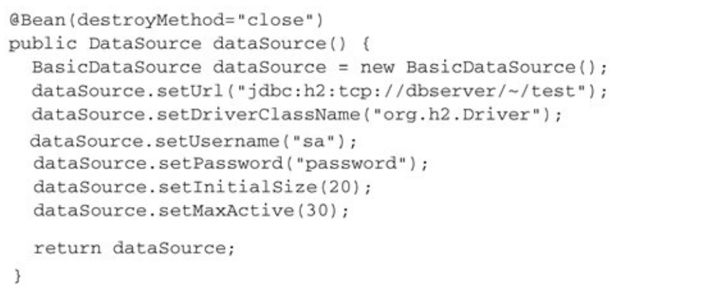
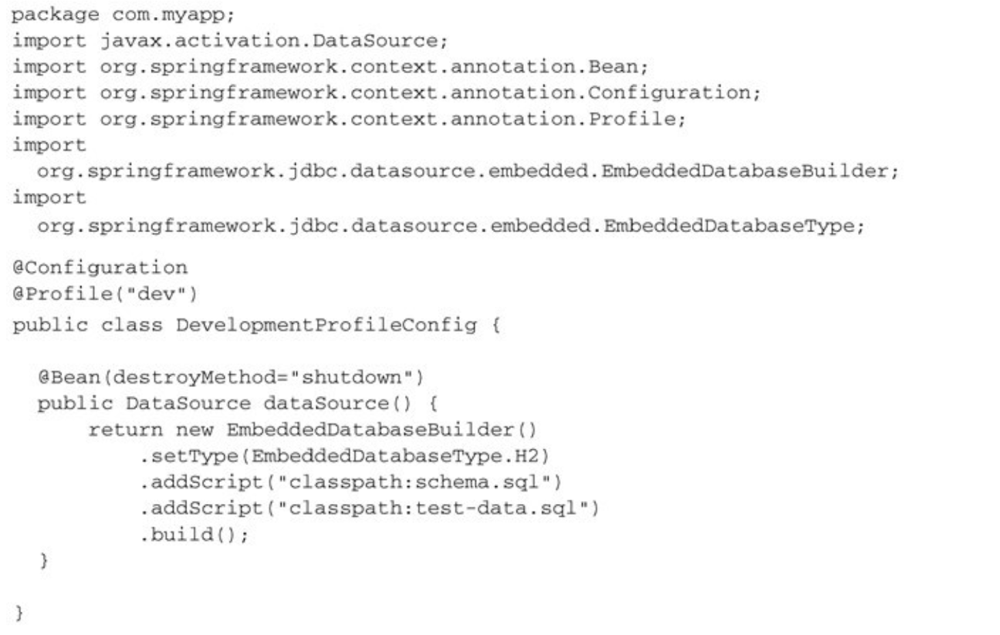
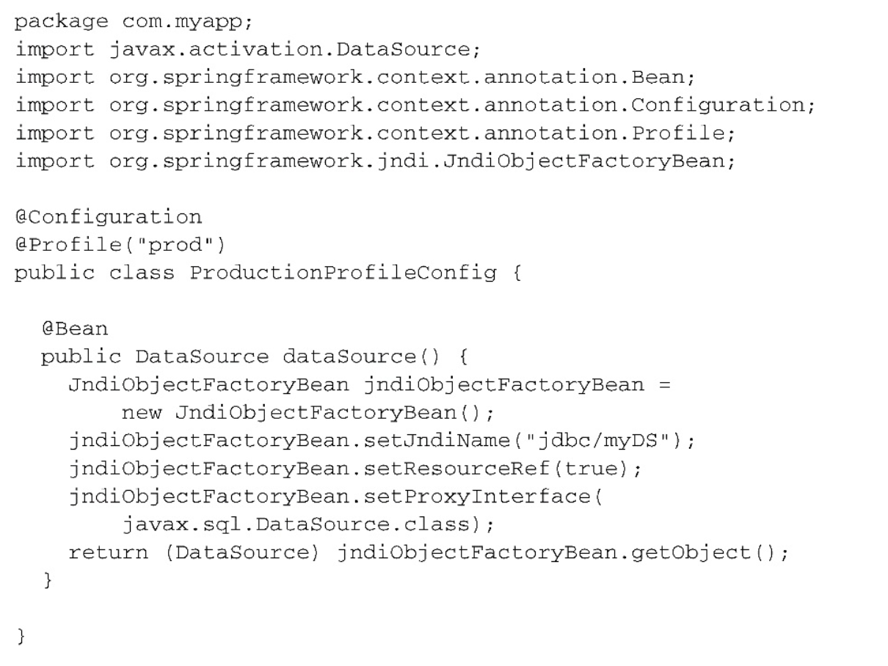
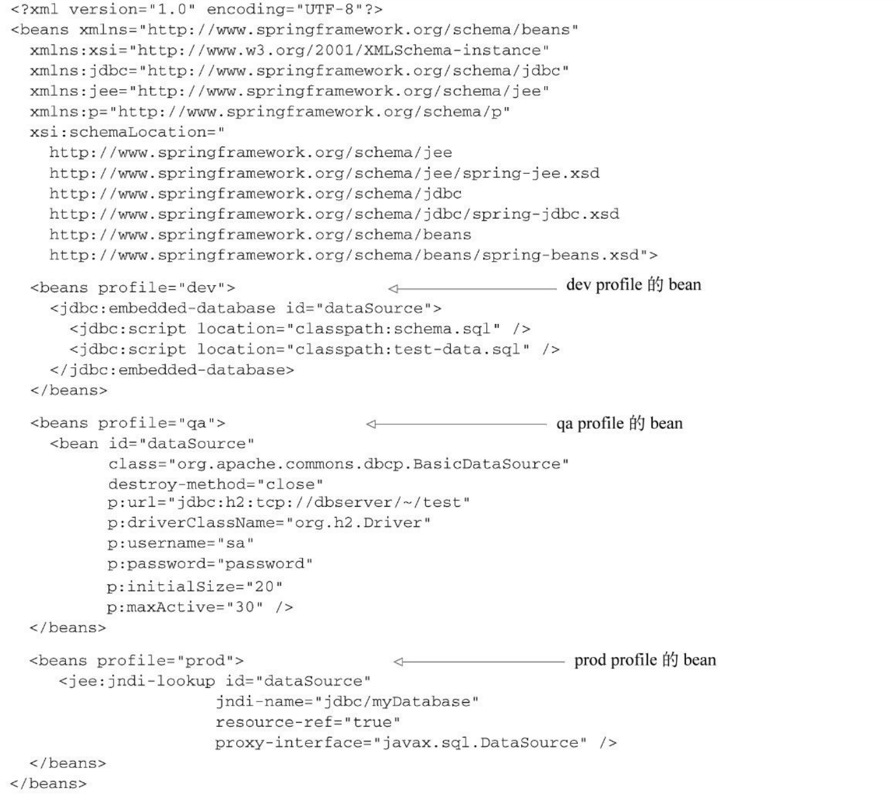
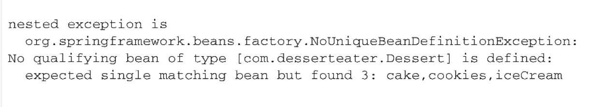
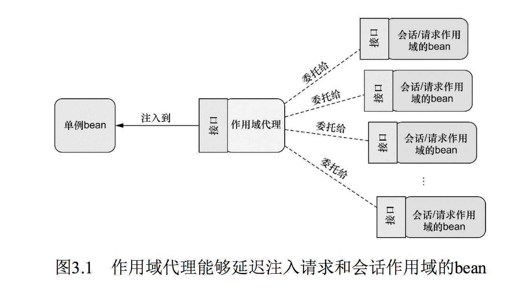
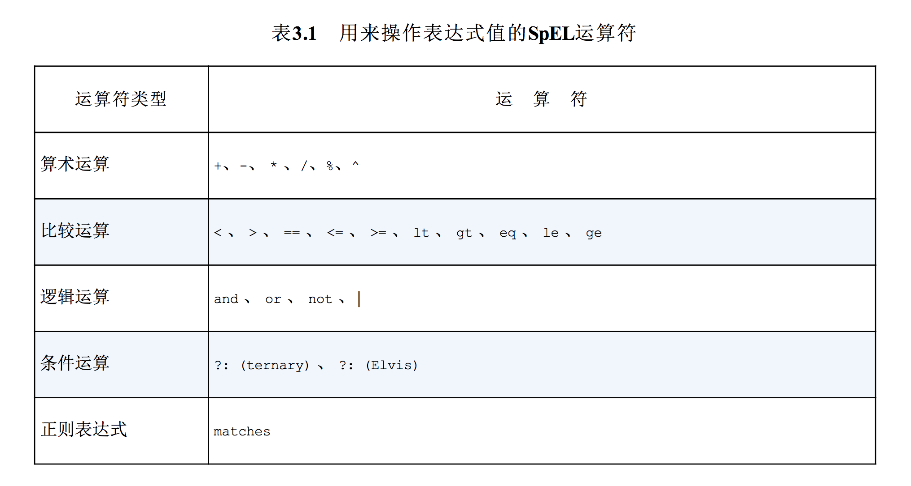

# 第3章 高级装配
本章内容：

* Spring profile
* 条件化的bean声明
* 自动装配与歧义性
* bean的作用域
* Spring表达式语言

> 在上一章中，我们看到了一些最为核心的bean装配技术。你可能会发现上一章学到的知识有很大的用处。但是，bean装配所涉及的领域并不仅仅局限于上一章 所学习到的内容。Spring提供了多种技巧，借助它们可以实现更为高级的bean装配功能。

在本章中，我们将会深入介绍一些这样的高级技术。本章中所介绍的技术也许你不会天天都用到，但这并不意味着它们的价值会因此而降低。

## 3.1 环境与profile
在开发软件的时候，有一个很大的挑战就是将应用程序从一个环境迁移到另外一个环境。开发阶段中，某些环境相关做法可能并不适合迁移到生产环境中，甚至即便迁移过去也无法正常工作。数据库配置、加密算法以及与外部系统的集成是跨环境部署时会发生变化的几个典型例子。

比如，考虑一下数据库配置。在开发环境中，我们可能会使用嵌入式数据库，并预先加载测试数据。例如，在Spring配置类中，我们可能会在一个带有@Bean注解的方法上使用EmbeddedDatabaseBuilder：

```
  @Bean(destroyMethod = "shutdown")
    public DataSource embeddedDataSource() {
        return new EmbeddedDatabaseBuilder()
                .setType(EmbeddedDatabaseType.H2)
                .addScript("classpath:schema.sql")
                .addScript("classpath:test-data.sql")
                .build();
    }
```

这会创建一个类型为javax.sql.DataSource的bean，这个bean是如何创建出来的才是最有意思的。使用EmbeddedDatabaseBuilder会搭建一个嵌入式的Hypersonic数据库，它的模式（schema）定义在schema.sql中，测试数据则是通过test-data.sql加载的。

当你在开发环境中运行集成测试或者启动应用进行手动测试的时候，这个DataSource是很有用的。每次启动它的时候，都能让数据库处于一个给定的状态。

尽管EmbeddedDatabaseBuilder创建的DataSource非常适于开发环境，但是对于生产环境来说，这会是一个糟糕的选择。在生产环境的配置中，你可能会希望使用JNDI从容器中获取一个DataSource。在这样场景中，如下的@Bean方法会更加合适：

```
	@Bean
    public DataSource jndiDataSource() {
        JndiObjectFactoryBean jndiObjectFactoryBean = new JndiObjectFactoryBean();
        jndiObjectFactoryBean.setJndiName("jdbc/myDS");
        jndiObjectFactoryBean.setResourceRef(true);
        jndiObjectFactoryBean.setProxyInterface(DataSource.class);
        return (DataSource) jndiObjectFactoryBean.getObject();
    }
```

通过JNDI获取DataSource能够让容器决定该如何创建这个DataSource，甚至包括切换为容器管理的连接池。即便如此，JNDI管理的DataSource更加适合于生产环境，对于简单的集成和开发测试环境来说，这会带来不必要的复杂性。

同时，在QA环境中，你可以选择完全不同的DataSource配置，可以配置为Commons DBCP连接池，如下所示：

<div align="center">  </div><br>

显然，这里展现的三个版本的dataSource()方法互不相同。虽然它们都会生成一个类型为javax.sql.DataSource的bean，但它们的相似点也仅限于此了。每个方法都使用了完全不同的策略来生成DataSource bean。

再次强调的是，这里的讨论并不是如何配置DataSource（我们将会在第10章更详细地讨论这个话题）。看起来很简单的DataSource实际上并不是那么简单。这是一个很好的例子，它表现了在不同的环境中某个bean会有所不同。我们必须要有一种方法来配置DataSource，使其在每种环境下都会选择最为合适的配置。

其中一种方式就是在单独的配置类（或XML文件）中配置每个bean，然后在构建阶段（可能会使用Maven的profiles）确定要将哪一个配置编译到可部署的应用中。这种方式的问题在于要为每种环境重新构建应用。当从开发阶段迁移到QA阶段时，重新构建也许算不上什么大问题。但是，从QA阶段迁移到生产阶段时，重新构建可能会引入bug并且会在QA团队的成员中带来不安的情绪。

值得庆幸的是，Spring所提供的解决方案并**不需要重新构建**。

### 3.1.1 配置profile bean
Spring为环境相关的bean所提供的解决方案其实与构建时的方案没有太大的差别。当然，在这个过程中需要根据环境决定该创建哪个bean和不创建哪个bean。不过**Spring并不是在构建的时候做出这样的决策，而是等到运行时再来确定**。这样的结果就是同一个部署单元（可能会是WAR文件）能够适用于所有的环境，没有必要进行重新构建。

- **Spring并不是在构建的时候决定创建哪个bean和不创建哪个bean，而是等到运行时根据应用的环境再来确定**。

在3.1版本中，Spring引入了bean profile的功能。要使用profile，你首先要将所有不同的bean定义整理到一个或多个profile之中，在将应用部署到每个环境时，要确保对应的profile处于**激活（active）**的状态。

在Java配置中，可以使用@Profile注解指定某个bean属于哪一个profile。例如，在配置类中，嵌入式数据库的DataSource可能会配置成如下所示：

<div align="center">  </div><br>

我希望你能够注意的是@Profile注解应用在了类级别上。它会告诉Spring这个配置类中的bean只有在dev profile激活时才会创建。如果dev profile没有激活的话，那么带有@Bean注解的方法都会被忽略掉。

- **@Profile注解**:告诉 Spring这个配置类中的bean只有在该环境下 profile激活时才会创建

同时，你可能还需要有一个适用于生产环境的配置，如下所示：

<div align="center">  </div><br>

在本例中，只有prod profile激活的时候，才会创建对应的bean。

在Spring 3.1中，只能在类级别上使用@Profile注解。不过，从Spring 3.2开始，你也可以在方法级别上使用@Profile注解，与@Bean注解一同使用。这样的话，就能将这两个bean的声明放到同一个配置类之中，如下所示：

程序清单3.1 @Profile注解基于激活的profile实现bean的装配

```
@Configuration
public class DataSourceConfig {

    /**
     * 开发环境
     * 为 dev profile 装配的 bean
     *
     * @return
     */
    @Bean(destroyMethod = "shutdown")
    @Profile("dev")
    public DataSource embeddedDataSource() {
        return new EmbeddedDatabaseBuilder()
                .setType(EmbeddedDatabaseType.H2)
                .addScript("classpath:schema.sql")
                .addScript("classpath:test-data.sql")
                .build();
    }

    /**
     * 生产环境
     * 为 prod profile 装配的 bean
     *
     * @return
     */
    @Bean
    @Profile("prod")
    public DataSource jndiDataSource() {
        JndiObjectFactoryBean jndiObjectFactoryBean = new JndiObjectFactoryBean();
        jndiObjectFactoryBean.setJndiName("jdbc/myDS");
        jndiObjectFactoryBean.setResourceRef(true);
        jndiObjectFactoryBean.setProxyInterface(DataSource.class);
        return (DataSource) jndiObjectFactoryBean.getObject();
    }
    
}
```

这里有个问题需要注意，尽管每个DataSource bean都被声明在一个profile中，并且只有当规定的profile激活时，相应的bean才会被创建，但是可能会有其他的bean并没有声明在一个给定的profile范围内。

- **注意⚠️**:没有指定profile的bean始终都会被创建，与激活哪个profile没有关系。

#### 在XML中配置profile
我们也可以通过<beans>元素的profile属性，在XML中配置profile bean。例如，为了在XML中定义适用于开发阶段的嵌入式数据库DataSource bean，我们可以创建如下所示的XML文件：

```
<!--为 dev profile 装配的 bean-->
  <beans profile="dev">
    <jdbc:embedded-database id="dataSource" type="H2">
      <jdbc:script location="classpath:com/alan/yx/springInAction/Chapter_03/profiles/src/main/resources/schema.sql" />
      <jdbc:script location="classpath:com/alan/yx/springInAction/Chapter_03/profiles/src/main/resources/test-data.sql" />
    </jdbc:embedded-database>
  </beans>
```

与之类似，我们也可以将profile设置为prod，创建适用于生产环境的从JNDI获取的DataSource bean。同样，可以创建基于连接池定义的DataSource bean，将其放在另外一个XML文件中，并标注为qaprofile。所有的配置文件都会放到部署单元之中（如WAR文件），但是只有profile属性与当前激活profile相匹配的配置文件才会被用到。

你还可以在根<beans>元素中嵌套定义<beans>元素，而不是为每个环境都创建一个profileXML文件。这能够将所有的profile bean定义放到同一个XML文件中，如下所示：

程序清单3.2 重复使用元素来指定多个profile


```
<?xml version="1.0" encoding="UTF-8"?>
<beans xmlns="http://www.springframework.org/schema/beans"
       xmlns:xsi="http://www.w3.org/2001/XMLSchema-instance" xmlns:jdbc="http://www.springframework.org/schema/jdbc"
       xmlns:jee="http://www.springframework.org/schema/jee" xmlns:p="http://www.springframework.org/schema/p"
       xsi:schemaLocation="
    http://www.springframework.org/schema/jee
    http://www.springframework.org/schema/jee/spring-jee.xsd
    http://www.springframework.org/schema/jdbc
    http://www.springframework.org/schema/jdbc/spring-jdbc.xsd
    http://www.springframework.org/schema/beans
    http://www.springframework.org/schema/beans/spring-beans.xsd">

    <!--为 dev profile 装配的 bean-->
    <beans profile="dev">
        <jdbc:embedded-database id="dataSource" type="H2">
            <jdbc:script
                    location="classpath:com/alan/yx/springInAction/Chapter_03/profiles/src/main/resources/schema.sql"/>
            <jdbc:script
                    location="classpath:com/alan/yx/springInAction/Chapter_03/profiles/src/main/resources/test-data.sql"/>
        </jdbc:embedded-database>
    </beans>

    <!--为 prod profile 装配的 bean-->
    <beans profile="prod">
        <jee:jndi-lookup id="dataSource"
                         lazy-init="true"
                         jndi-name="jdbc/myDatabase"
                         resource-ref="true"
                         proxy-interface="javax.sql.DataSource"/>
    </beans>
</beans>
```

<div align="center">  </div><br>

除了所有的bean定义到了同一个XML文件之中，这种配置方式与定义在单独的XML文件中的实际效果是一样的。这里有三个bean，类型都是javax.sql.DataSource，并且ID都是dataSource。但是在运行时，只会创建一个bean，这取决于处于激活状态的是哪个profile。那么问题来了：我们该怎样激活某个profile呢？

### 3.1.2 激活profile
Spring在确定哪个profile处于激活状态时，需要依赖两个独立的属性：`spring.profiles.active`和 `spring.profiles.default` 。如果设置了spring.profiles.active属性的话，那么它的值就会用来确定哪个profile是激活的。但如果没有设置spring.profiles.active属性的话，那Spring将会查找spring.profiles.default的值。如果spring.profiles.active和spring.profiles.default均没有设置的话，那就没有激活的profile，因此只会创建那些没有定义在profile中的bean。

有多种方式来设置这两个属性：

* 作为DispatcherServlet的初始化参数；
* 作为Web应用的上下文参数；
* 作为JNDI条目；
* 作为环境变量；
* 作为JVM的系统属性；
* 在集成测试类上，使用@ActiveProfiles注解设置。

你尽可以选择spring.profiles.active和spring.profiles.default的最佳组合方式以满足需求，我将这样的自主权留给读者。

我所喜欢的一种方式是使用DispatcherServlet的参数将spring.profiles.default设置为开发环境的profile，我会在Servlet上下文中进行设置（为了兼顾到ContextLoaderListener）。例如，在Web应用中，设置spring.profiles.default的web.xml文件会如下所示：

程序清单3.3 在Web应用的web.xml文件中设置默认的profile

<div align="center">  </div><br>

按照这种方式设置spring.profiles.default，所有的开发人员都能从版本控制软件中获得应用程序源码，并使用开发环境的设置（如嵌入式数据库）运行代码，而不需要任何额外的配置。

当应用程序部署到QA、生产或其他环境之中时，负责部署的人根据情况使用系统属性、环境变量或JNDI设置spring.profiles.active即可。当设置spring.profiles.active以后，至于spring.profiles.default置成什么值就已经无所谓了；

- **系统会优先使用spring.profiles.active中所设置的profile。**优先级：`spring.profiles.active` > `spring.profiles.default`

你可能已经注意到了，在spring.profiles.active和spring.profiles.default中，profile使用的都是复数形式。这意味着你可以同时激活多个profile，这可以通过列出多个profile名称，并以逗号分隔来实现。当然，同时启用dev和prod profile可能也没有太大的意义，不过你可以同时设置多个彼此不相关的profile。

#### 使用profile进行测试
当运行集成测试时，通常会希望采用与生产环境（或者是生产环境的部分子集）相同的配置进行测试。但是，如果配置中的bean定义在了profile中，那么在运行测试时，我们就需要有一种方式来启用合适的profile。

Spring提供了@ActiveProfiles注解，我们可以使用它来指定运行测试时要激活哪个profile。在集成测试时，通常想要激活的是开发环境的profile。例如，下面的测试类片段展现了使用 @ActiveProfiles 激活dev profile：

```
@RunWith(SpringJUnit4ClassRunner.class)
    @ContextConfiguration(classes = DataSourceConfig.class)
    @ActiveProfiles("dev")
    public static class DevDataSourceTest {
     	. . .
    }
```

在条件化创建bean方面，Spring的profile机制是一种很棒的方法，这里的条件要基于哪个profile处于激活状态来判断。Spring 4.0中提供了一种更为通用的机制来实现条件化的bean定义，在这种机制之中，条件完全由你来确定。让我们看一下如何使用Spring 4和@Conditional注解定义条件化的bean。

## 3.2 条件化的bean
假设你希望一个或多个bean只有在应用的类路径下包含特定的库时才创建。或者我们希望某个bean只有当另外某个特定的bean也声明了之后才会创建。我们还可能要求只有某个特定的环境变量设置之后，才会创建某个bean。

在Spring 4之前，很难实现这种级别的条件化配置，但是Spring 4引入了一个新的@Conditional注解，它可以用到带有@Bean注解的方法上。如果给定的条件计算结果为true，就会创建这个bean，否则的话，这个bean会被忽略。例如，假设有一个名为MagicBean的类，我们希望只有设置了magic环境属性的时候，Spring才会实例化这个类。如果环境中没有这个属性，那么MagicBean将会被忽略。

例如，假设有一个名为MagicBean的类，我们希望只有设置了magic环境属性的时候，Spring才会实例化这个类。如果环境中没有这个属性，那么MagicBean将会被忽略。在程序清单3.4所展现的配置中，使用@Conditional注解条件化地配置了MagicBean。

程序清单3.4 条件化地配置bean

```
 @Bean
    // 有条件的创建bean
    @Conditional(MagicExistsCondition.class)
    public MagicBean magicBean() {
        return new MagicBean();
    }
```

可以看到，@Conditional中给定了一个Class，它指明了条件——在本例中，也就是MagicExistsCondition。@Conditional将会通过Condition接口进行条件对比：

```
public interface Condition {

	/**
	 * Determine if the condition matches.
	 * @param context the condition context
	 * @param metadata metadata of the {@link org.springframework.core.type.AnnotationMetadata class}
	 * or {@link org.springframework.core.type.MethodMetadata method} being checked
	 * @return {@code true} if the condition matches and the component can be registered,
	 * or {@code false} to veto the annotated component's registration
	 */
	boolean matches(ConditionContext context, AnnotatedTypeMetadata metadata);

}
```

设置给@Conditional的类可以是任意实现了Condition接口的类型。可以看出来，这个接口实现起来很简单直接，只需提供matches()方法的实现即可。如果matches()方法返回true，那么就会创建带有@Conditional注解的bean。如果matches()方法返回false，将不会创建这些bean。

在本例中，我们需要创建Condition的实现并根据环境中是否存在magic属性来做出决策。程序清单3.5展现了 MagicExistsCondition，这是完成该功能的Condition实现类：

程序清单3.5 在Condition中检查是否存在magic属性

```
import org.springframework.context.annotation.Condition;
import org.springframework.context.annotation.ConditionContext;
import org.springframework.core.env.Environment;
import org.springframework.core.type.AnnotatedTypeMetadata;

public class MagicExistsCondition implements Condition {

  @Override
  public boolean matches(ConditionContext context, AnnotatedTypeMetadata metadata) {
    Environment env = context.getEnvironment();
    return env.containsProperty("magic");
  }
  
}
```

在上面的程序清单中，matches()方法很简单但功能强大。它通过给定的ConditionContext对象进而得到Environment对象，并使用这个对象检查环境中是否存在名为magic的环境属性。在本例中，属性的值是什么无所谓，只要属性存在即可满足要求。如果满足这个条件的话，matches()方法就会返回true。所带来的结果就是条件能够得到满足，所有@Conditional注解上引用MagicExistsCondition的bean都会被创建。

话说回来，如果这个属性不存在的话，就无法满足条件，matches()方法会返回false，这些bean都不会被创建。

MagicExistsCondition中只是使用了ConditionContext得到的Environment，但Condition实现的考量因素可能会比这更多。matches()方法会得到ConditionContext和AnnotatedTypeMetadata对象用来做出决策。

ConditionContext是一个接口，大致如下所示：

```
public interface ConditionContext {
    BeanDefinitionRegistry getRegistry();

    @Nullable
    ConfigurableListableBeanFactory getBeanFactory();

    Environment getEnvironment();

    ResourceLoader getResourceLoader();

    @Nullable
    ClassLoader getClassLoader();
}
```

通过ConditionContext，我们可以做到如下几点：

* 借助getRegistry()返回的BeanDefinitionRegistry检查bean定义；
* 借助getBeanFactory()返回的ConfigurableListableBeanFactory检查bean是否存在，甚至探查bean的属性；
* 借助getEnvironment()返回的Environment检查环境变量是否存在以及它的值是什么；
* 读取并探查getResourceLoader()返回的ResourceLoader所加载的资源；
* 借助getClassLoader()返回的ClassLoader加载并检查类是否存在。

AnnotatedTypeMetadata则能够让我们检查带有@Bean注解的方法上还有什么其他的注解。像ConditionContext一样，AnnotatedTypeMetadata也是一个接口。它如下所示：

```
public interface AnnotatedTypeMetadata {
    boolean isAnnotated(String var1);

    @Nullable
    Map<String, Object> getAnnotationAttributes(String var1);

    @Nullable
    Map<String, Object> getAnnotationAttributes(String var1, boolean var2);

    @Nullable
    MultiValueMap<String, Object> getAllAnnotationAttributes(String var1);

    @Nullable
    MultiValueMap<String, Object> getAllAnnotationAttributes(String var1, boolean var2);
}
```

借助isAnnotated()方法，我们能够判断带有@Bean注解的方法是不是还有其他特定的注解。借助其他的那些方法，我们能够检查@Bean注解的方法上其他注解的属性。

非常有意思的是，从Spring 4开始，@Profile注解进行了重构，使其基于@Conditional和Condition实现。作为如何使用@Conditional和Condition的例子，我们来看一下在 Spring 4中，@Profile是如何实现的。@Profile注解如下所示：

```
@Target({ElementType.TYPE, ElementType.METHOD})
@Retention(RetentionPolicy.RUNTIME)
@Documented
@Conditional(ProfileCondition.class)
public @interface Profile {

	/**
	 * The set of profiles for which the annotated component should be registered.
	 */
	String[] value();

}
```

> 注意: @Profile本身也使用了@Conditional注解，并且引用ProfileCondition作为Condition实现。如下所示，ProfileCondition实现了Condition接口，并且在做出决策的过程中，考虑到了ConditionContext和AnnotatedTypeMetadata中的多个因素。

程序清单3.6ProfileCondition检查某个bean profile是否可用

```
class ProfileCondition implements Condition {

	@Override
	public boolean matches(ConditionContext context, AnnotatedTypeMetadata metadata) {
		MultiValueMap<String, Object> attrs = metadata.getAllAnnotationAttributes(Profile.class.getName());
		if (attrs != null) {
			for (Object value : attrs.get("value")) {
				if (context.getEnvironment().acceptsProfiles(Profiles.of((String[]) value))) {
					return true;
				}
			}
			return false;
		}
		return true;
	}

}
```

我们可以看到，ProfileCondition通过AnnotatedTypeMetadata得到了用于@Profile注解的所有属性。借助该信息，它会明确地检查value属性，该属性包含了bean的profile名称。然后，它根据通过ConditionContext得到的Environment来检查［借助acceptsProfiles()方法］该profile是否处于激活状态。

## 3.3 处理自动装配的歧义性
在第2章中，我们已经看到如何使用自动装配让Spring完全负责将bean引用注入到构造参数和属性中。自动装配能够提供很大的帮助，因为它会减少装配应用程序组件时所需要的显式配置的数量。

不过，仅有一个bean匹配所需的结果时，自动装配才是有效的。如果不只有一个bean能够匹配结果的话，这种歧义性会阻碍Spring自动装配属性、构造器参数或方法参数。

为了阐述自动装配的歧义性，假设我们使用@Autowired注解标注了setDessert()方法：

```
@Autowired
public void setDessert(Dessert dessert){
	this.dessert = dessert
}
```

在本例中，Dessert是一个接口，并且有三个类实现了这个接口，分别为Cake、Cookies和IceCream：
```
@Componet
public class Cake implements Dessert{ . . . }

@Componet
public class Cookies implements Dessert{ . . . }

@Componet
public class IceCream implements Dessert{ . . . }

```

因为这三个实现均使用了@Component注解，在组件扫描的时候，能够发现它们并将其创建为Spring应用上下文里面的bean。然后，当Spring试图自动装配setDessert()中的Dessert参数时，它并没有唯一、无歧义的可选值。在从多种甜点中做出选择时，尽管大多数人并不会有什么困难，但是Spring却无法做出选择。Spring此时别无他法，只好宣告失败并抛出异常。更精确地讲，Spring会抛出NoUniqueBeanDefinitionException：


<div align="center">  </div><br>

当然，使用吃甜点的样例来阐述自动装配在遇到歧义性时所面临的问题多少有些牵强。在实际中，自动装配歧义性的问题其实比你想象中的更为罕见。就算这种歧义性确实是个问题，但更常见的情况是给定的类型只有一个实现类，因此自动装配能够很好地运行。

但是，当确实发生歧义性的时候，Spring提供了多种可选方案来解决这样的问题。你可以将可选bean中的某一个**设为首选（primary）的bean**，或者**使用限定符（qualifier）**来帮助Spring将可选的bean的范围缩小到只有一个bean。

- **设为首选（primary）的bean**
- **使用限定符（qualifier）**

### 3.3.1 标示首选的bean
如果你像我一样，喜欢所有类型的甜点，如蛋糕、饼干、冰激凌......它们都很美味。但如果只能在其中选择一种甜点的话，那你最喜欢的是哪一种呢？

在声明bean的时候，通过将其中一个可选的bean设置为首选（primary）bean能够避免自动装配时的歧义性。当遇到歧义性的时候，Spring将会使用首选的bean，而不是其他可选的bean。实际上，你所声明就是“最喜欢”的bean。

假设冰激凌就是你最喜欢的甜点。在Spring中，可以通过@Primary来表达最喜欢的方案。@Primary能够与@Component组合用在组件扫描的bean上，也可以与@Bean组合用在Java配置的bean声明中。比如，下面的代码展现了如何将@Component注解的IceCreambean声明为首选的bean：

```
@Componet
@Primary
public class IceCream implements Dessert{ . . . }
```

或者，如果你通过Java配置显式地声明IceCream，那么@Bean方法应该如下所示：

```
@Bean
@Primary
public class IceCream implements Dessert{ . . . }
```

如果你使用XML配置bean的话，同样可以实现这样的功能。<bean>元素有一个primary属性用来指定首选的bean：

```
<bean id="iceCream"
	class="com.dessert. IceCream"
	primary="true">
```

不管你采用什么方式来标示首选bean，效果都是一样的，都是告诉Spring在遇到歧义性的时候要选择首选的bean。

但是，如果你标示了两个或更多的首选bean，那么它就无法正常工作了。比如，假设Cake类如下所示：

```
@Bean
@Primary
public class Cake implements Dessert{ . . . }
```

现在，有两个首选的Dessert bean：Cake和IceCream。这带来了新的歧义性问题。就像Spring无法从多个可选的bean中做出选择一样，它也无法从多个首选的bean中做出选择。显然，如果不止一个bean被设置成了首选bean，那实际上也就是没有首选bean了。

就解决歧义性问题而言，限定符是一种更为强大的机制，下面就将对其进行介绍。

### 3.3.2 限定自动装配的bean
设置首选bean的局限性在于@Primary无法将可选方案的范围限定到唯一一个无歧义性的选项中。它只能标示一个优先的可选方案。当首选bean的数量超过一个时，我们并没有其他的方法进一步缩小可选范围。

与之相反，**Spring的限定符**能够在所有可选的bean上进行缩小范围的操作，最终能够达到只有一个bean满足所规定的限制条件。如果将所有的限定符都用上后依然存在歧义性，那么你可以继续使用更多的限定符来缩小选择范围。

- **@Qualifier注解是使用限定符的主要方式。**

@Qualifier可以与@Autowired和@Inject协同使用，在注入的时候指定想要注入进去的是哪个bean。例如，我们想要确保要将IceCream注入到setDessert()之中：

```
@Autowired
@Qualifier("iceCream")
public void setDessert(Dessert dessert){
	this.dessert = dessert
}
```

这是使用限定符的最简单的例子。为@Qualifier注解所设置的参数就是想要注入的bean的ID。所有使用@Component注解声明的类都会创建为bean，并且bean的ID为首字母变为小写的类名。因此，@Qualifier("iceCream")指向的是组件扫描时所创建的bean，并且这个bean是IceCream类的实例。

实际上，还有一点需要补充一下。更准确地讲，@Qualifier("iceCream")所引用的bean要具有String类型的“iceCream”作为限定符。**如果没有指定其他的限定符的话，所有的bean都会给定一个默认的限定符，这个限定符与bean的ID相同**。因此，框架会将具有“iceCream”限定符的bean注入到setDessert()方法中。这恰巧就是ID为iceCream的bean，它是IceCream类在组件扫描的时候创建的。

基于默认的bean ID作为限定符是非常简单的，但这有可能会引入一些问题。如果你重构了IceCream类，将其重命名为Gelato的话，那此时会发生什么情况呢？如果这样的话，bean的ID和默认的限定符会变为gelato，这就无法匹配setDessert()方法中的限定符。自动装配会失败。

这里的问题在于**setDessert()方法上所指定的限定符与要注入的bean的名称是紧耦合的。**对类名称的任意改动都会导致限定符失效。

- 使用默认的限定符，即bean 的id，会造成紧耦合

#### 创建自定义的限定符
我们可以为bean设置自己的限定符，而不是依赖于将bean ID作为限定符。在这里所需要做的就是**在bean声明上添加@Qualifier注解**。例如，它可以与@Component组合使用，如下所示：

```
@Componet
@Qualifier("cold")
public class IceCream implements Dessert{ . . . }
```

在这种情况下，cold限定符分配给了IceCreambean。因为它没有耦合类名，因此你可以随意重构IceCream的类名，而不必担心会破坏自动装配。在注入的地方，只要引用cold限定符就可以了：

```
@Autowired
@Qualifier("cold")
public void setDessert(Dessert dessert){
	this.dessert = dessert
}
```

值得一提的是，当通过Java配置显式定义bean的时候，@Qualifier也可以与@Bean注解一起使用：

```
@Bean
@Qualifier("cold")
public Dessert iceCream(){
	return new IceCream();
}
```

- **@Qualifier与@Component组合使用**
- **@Qualifier与@Bean组合使用**

当使用自定义的@Qualifier值时，**最佳实践是为bean选择特征性或描述性的术语，而不是使用随意的名字**。在本例中，我将IceCream bean描述为“cold”bean。在注入的时候，可以将这个需求理解为“给我一个凉的甜点”，这其实就是描述的IceCream。类似地，我可以将Cake描述为“soft”，将Cookie描述为“crispy”。

#### 使用自定义的限定符注解
面向特性的限定符要比基于bean ID的限定符更好一些。但是，如果多个bean都具备相同特性的话，这种做法也会出现问题。例如，如果引入了这个新的Dessert bean，会发生什么情况呢：

```
@Componet
@Qualifier("cold")
public class Popsicle implements Dessert{ . . . }
```

不会吧？！现在我们有了两个带有“cold”限定符的甜点。在自动装配Dessert bean的时候，我们再次遇到了歧义性的问题，需要使用更多的限定符来将可选范围限定到只有一个bean。可能想到的解决方案就是在注入点和bean定义的地方同时再添加另外一个@Qualifier注解。IceCream类大致就会如下所示：

```
@Componet
@Qualifier("cold")
@Qualifier("creamy")
public class IceCream implements Dessert{ . . . }
```

Popsicle类同样也可能再添加另外一个@Qualifier注解：

```
@Componet
@Qualifier("cold")
@Qualifier("fruity")
public class Popsicle implements Dessert{ . . . }
```

在注入点中，我们可能会使用这样的方式来将范围缩小到IceCream：

```
@Autowired
@Qualifier("cold")
@Qualifier("creamy")
public void setDessert(Dessert dessert){
	this.dessert = dessert
}
```

这里只有一个小问题：Java不允许在同一个条目上重复出现相同类型的多个注解。[1]如果你试图这样做的话，编译器会提示错误。在这里，使用@Qualifier注解并没有办法（至少没有直接的办法）将自动装配的可选bean缩小范围至仅有一个可选的bean。

但是，我们可以**创建自定义的限定符注解**，借助这样的注解来表达bean所希望限定的特性。这里所需要做的就是创建一个注解，它本身要使用@Qualifier注解来标注。这样我们将不再使用@Qualifier("cold")，而是使用自定义的@Cold注解，该注解的定义如下所示：

```
import javax.inject.Qualifier;
import java.lang.annotation.ElementType;
import java.lang.annotation.Retention;
import java.lang.annotation.RetentionPolicy;
import java.lang.annotation.Target;

@Target({ElementType.CONSTRUCTOR, ElementType.FIELD,
        ElementType.METHOD, ElementType.TYPE})
@Retention(RetentionPolicy.RUNTIME)
@Qualifier
public @interface Cold {
}
```

同样，你可以创建一个新的@Creamy注解来代替@Qualifier("creamy")：

```
import javax.inject.Qualifier;
import java.lang.annotation.ElementType;
import java.lang.annotation.Retention;
import java.lang.annotation.RetentionPolicy;
import java.lang.annotation.Target;

@Target({ElementType.CONSTRUCTOR, ElementType.FIELD,
        ElementType.METHOD, ElementType.TYPE})
@Retention(RetentionPolicy.RUNTIME)
@Qualifier
public @interface Creamy {
}
```

当你不想用@Qualifier注解的时候，可以类似地创建@Soft、@Crispy和@Fruity。通过在定义时添加@Qualifier注解，它们就具有了@Qualifier注解的特性。它们本身实际上就成为了限定符注解。

```
@Autowired
@Cold
@Creamy
public void setDessert(Dessert dessert){
	this.dessert = dessert
}
```

现在，我们可以重新看一下IceCream，并为其添加@Cold和@Creamy注解，如下所示：

```
@Componet
@Cold
@Fruity
public class Popsicle implements Dessert{ . . . }
```

类似地，Popsicle类可以添加@Cold和@Fruity注解：最终，在注入点，我们使用必要的限定符注解进行任意组合，从而将可选范围缩小到只有一个bean满足需求。为了得到IceCream bean，setDessert()方法可以这样使用注解：

```
@Autowired
@Cold
@Creamy
public void setDessert(Dessert dessert){
	this.dessert = dessert
}
```

通过声明自定义的限定符注解，我们可以同时使用多个限定符，不会再有Java编译器的限制或错误。与此同时，相对于使用原始的@Qualifier并借助String类型来指定限定符，自定义的注解也更为类型安全。

让我们近距离观察一下setDessert()方法以及它的注解，这里并没有在任何地方明确指定要将IceCream自动装配到该方法中。相反，我们使用所需bean的特性来进行指定，即@Cold和@Creamy。因此，setDessert()方法依然能够与特定的Dessert实现保持解耦。任意满足这些特征的bean都是可以的。在当前选择Dessert实现时，恰好如此，IceCream是唯一能够与之匹配的bean。

在本节和前面的节中，我们讨论了几种通过自定义注解扩展Spring的方式。为了创建自定义的条件化注解，我们创建一个新的注解并在这个注解上添加了@Conditional。为了创建自定义的限定符注解，我们创建一个新的注解并在这个注解上添加了@Qualifier。这种技术可以用到很多的Spring注解中，从而能够将它们组合在一起形成特定目标的自定义注解。

现在我们来看一下如何在不同的作用域中声明bean。

## 3.4 bean的作用域
在默认情况下，Spring应用上下文中所有bean都是作为以单例（singleton）的形式创建的。也就是说，不管给定的一个bean被注入到其他bean多少次，每次所注入的都是同一个实例。

在大多数情况下，单例bean是很理想的方案。初始化和垃圾回收对象实例所带来的成本只留给一些小规模任务，在这些任务中，让对象保持无状态并且在应用中反复重用这些对象可能并不合理。

#### 为什么要作用域？
有时候，可能会发现，你所**使用的类是易变的（mutable），它们会保持一些状态，因此重用是不安全的**。在这种情况下，将class声明为单例的bean就不是什么好主意了，**因为对象会被污染，稍后重用的时候会出现意想不到的问题**。

Spring定义了多种作用域，可以基于这些作用域创建bean，包括：

* 单例（Singleton）：在整个应用中，只创建bean的一个实例。
* 原型（Prototype）：每次注入或者通过Spring应用上下文获取的时候，都会创建一个新的bean实例。
* 会话（Session）：在Web应用中，为每个会话创建一个bean实例。
* 请求（Rquest）：在Web应用中，为每个请求创建一个bean实例。

单例是默认的作用域，但是正如之前所述，对于易变的类型，这并不合适。如果选择其他的作用域，要使用@Scope注解，它可以与@Component或@Bean一起使用。

例如，如果你使用组件扫描来发现和声明bean，那么你可以在bean的类上使用@Scope注解，将其声明为原型bean：

```
@Component
@Scope(ConfigurableBeanFactory.SCOPE_PROTOTYPE)
public class Notepad {
  // the details of this class are inconsequential to this example
}
```

这里，使用ConfigurableBeanFactory类的SCOPE_PROTOTYPE常量设置了原型作用域。你当然也可以使用@Scope("prototype")，但是使用SCOPE_PROTOTYPE常量更加安全并且不易出错。

如果你想在Java配置中将Notepad声明为原型bean，那么可以组合使用@Scope和@Bean来指定所需的作用域：

```
    @Bean
    @Scope(ConfigurableBeanFactory.SCOPE_PROTOTYPE)
    public Notepad notepad(){
        return new Notepad();
    }
```

同样，如果你使用XML来配置bean的话，可以使用<bean>元素的scope属性来设置作用域：

```
<bean class="com.myapp.Notepad"
          scope="prototype"/>
```

不管你使用哪种方式来声明原型作用域，每次注入或从Spring应用上下文中检索该bean的时候，都会创建新的实例。这样所导致的结果就是每次操作都能得到自己的Notepad实例。

### 3.4.1 使用会话和请求作用域
在Web应用中，如果能够实例化在会话和请求范围内共享的bean，那将是非常有价值的事情。例如，在典型的电子商务应用中，可能会有一个bean代表用户的购物车。如果购物车是单例的话，那么将会导致所有的用户都会向同一个购物车中添加商品。另一方面，如果购物车是原型作用域的，那么在应用中某一个地方往购物车中添加商品，在应用的另外一个地方可能就不可用了，因为在这里注入的是另外一个原型作用域的购物车。

就购物车bean来说，会话作用域是最为合适的，因为它与给定的用户关联性最大。要指定会话作用域，我们可以使用@Scope注解，它的使用方式与指定原型作用域是相同的：

```
@Componet
@Scope(value = WebApplicationContext.SCOPE_SESSION,
    proxyMode = ScopedProxyMode.INTERFACES)
public ShoppingCart cart(){. . . }
```

这里，我们将value设置成了WebApplicationContext中的SCOPE_SESSION常量（它的值是session）。这会告诉Spring为Web应用中的每个会话创建一个ShoppingCart。这会创建多个ShoppingCart bean的实例，但是对于给定的会话只会创建一个实例，在当前会话相关的操作中，这个bean实际上相当于单例的。

要注意的是，@Scope同时还有一个proxyMode属性，它被设置成了ScopedProxyMode.INTERFACES。这个属性解决了将会话或请求作用域的bean注入到单例bean中所遇到的问题。在描述proxyMode属性之前，我们先来看一下proxyMode所解决问题的场景。

假设我们要将ShoppingCart bean注入到单例StoreService bean的Setter方法中，如下所示：

```
@Component
public class StoreService {

    private ShoppingCart shoppingCart;

    @Autowired
    public void setShoppingCart(ShoppingCart shoppingCart) {
        this.shoppingCart = shoppingCart;
    }
}
```

因为StoreService是一个单例的bean，会在Spring应用上下文加载的时候创建。当它创建的时候，Spring会试图将ShoppingCart bean注入到setShoppingCart()方法中。但是ShoppingCart bean是会话作用域的，此时并不存在。直到某个用户进入系统，创建了会话之后，才会出现ShoppingCart实例。

另外，系统中将会有多个ShoppingCart实例：每个用户一个。我们并不想让Spring注入某个固定的ShoppingCart实例到StoreService中。我们希望的是当StoreService处理购物车功能时，**它所使用的ShoppingCart实例恰好是当前会话所对应的那一个。**

Spring并不会将实际的ShoppingCart bean注入到StoreService中，**Spring会注入一个到ShoppingCart bean的代理，如图3.1所示**。这个代理会暴露与ShoppingCart相同的方法，所以StoreService会认为它就是一个购物车。但是，当StoreService调用ShoppingCart的方法时，代理会对其进行懒解析并将调用委托给会话作用域内真正的ShoppingCart bean。

现在，我们带着对这个作用域的理解，讨论一下proxyMode属性。如配置所示，proxyMode属性被设置成了ScopedProxyMode.INTERFACES，这表明这个**代理要实现ShoppingCart接口，并将调用委托给实现bean**。

- **什么是 CGLib？** 

如果ShoppingCart是接口而不是类的话，这是可以的（也是最为理想的代理模式）。但**如果ShoppingCart是一个具体的类的话，Spring就没有办法创建基于接口的代理了。此时，它必须使用CGLib来生成基于类的代理**。所以，如果bean类型是具体类的话，我们必须要将proxyMode属性设置为ScopedProxyMode.TARGET_CLASS，以此来表明要以生成目标类扩展的方式创建代理。尽管我主要关注了会话作用域，但是请求作用域的bean会面临相同的装配问题。因此，请求作用域的bean应该也以作用域代理的方式进行注入。

<div align="center">  </div><br>

- **用域代理能够`延迟`注入请求和会话作用域的bean**

### 3.4.2 在XML中声明作用域代理
如果你需要使用XML来声明会话或请求作用域的bean，那么就不能使用@Scope注解及其proxyMode属性了。<bean>元素的scope属性能够设置bean的作用域，但是该怎样指定代理模式呢？

要设置代理模式，我们需要使用Spring aop命名空间的一个新元素：

```
<bean id="cart" class="com.alan.yx.springInAction.Chapter_03.scopedbeans.src.main.java.com.myapp.ShoppingCart"
          scope="session">
        <aop:scoped-proxy/>
    </bean>
```

<aop:scoped-proxy>是与@Scope注解的proxyMode属性功能相同的Spring XML配置元素。它会告诉Spring为bean创建一个作用域代理。默认情况下，它会使用CGLib创建目标类的代理。但是我们也可以将proxy-target-class属性设置为false，进而要求它生成基于接口的代理：

```
 <bean id="cart" class="com.myapp.ShoppingCart"
		          scope="session">
		        <aop:scoped-proxy proxy-target-class="false"/>
 </bean>
```

为了使用<aop:scoped-proxy>元素，我们必须在XML配置中声明Spring的aop命名空间：


```
<?xml version="1.0" encoding="UTF-8"?>
<beans xmlns="http://www.springframework.org/schema/beans"
       xmlns:xsi="http://www.w3.org/2001/XMLSchema-instance" xmlns:aop="http://www.springframework.org/schema/aop"
       xsi:schemaLocation="http://www.springframework.org/schema/beans http://www.springframework.org/schema/beans/spring-beans.xsd http://www.springframework.org/schema/aop http://www.springframework.org/schema/aop/spring-aop.xsd">

	. . .
</beans>
```

在第4章中，当我们使用Spring和面向切面编程的时候，会讨论Spring aop命名空间的更多知识。不过，在结束本章的内容之前，我们来看一下Spring高级配置的另外一个可选方案：Spring表达式语言（Spring Expression Language）。

## 3.5 运行时值注入
当讨论依赖注入的时候，我们通常所讨论的是将一个bean引用注入到另一个bean的属性或构造器参数中。它通常来讲指的是将一个对象与另一个对象进行关联。

但是bean装配的另外一个方面指的是将一个值注入到bean的属性或者构造器参数中。我们在第2章中已经进行了很多值装配，如将专辑的名字装配到BlankDisc bean的构造器或title属性中。例如，我们可能按照这样的方式来组装BlankDisc：

```
 @Bean
  public CompactDisc sgtPeppers(){
    return new BlankDisc(
            "Sgt. Pepper's Lonely Hearts Club Band",
            "The Beatles");
  }
```

尽管这实现了你的需求，也就是为BlankDisc bean设置title和artist，但它在实现的时候是将值硬编码在配置类中的。与之类似，如果使用XML的话，那么值也会是硬编码的：

```
<bean id="compactDisc"
          class="soundsystem.BlankDisc"
          c:_0="Sgt. Pepper's Lonely Hearts Club Band"
          c:_1="The Beatles">
```

有时候硬编码是可以的，但有的时候，我们可能会希望避免硬编码值，而是想让这些值在运行时再确定。为了实现这些功能，Spring提供了两种在运行时求值的方式：

- **属性占位符（Property placeholder）。**
- **Spring表达式语言（SpEL**）。

很快你就会发现这两种技术的用法是类似的，不过它们的目的和行为是有所差别的。让我们先看一下属性占位符，在这两者中它较为简单，然后再看一下更为强大的SpEL。

### 3.5.1 注入外部的值
在Spring中，处理外部值的最简单方式就是声明属性源并通过Spring的Environment来检索属性。例如，程序清单3.7展现了一个基本的Spring配置类，它使用外部的属性来装配BlankDisc bean。

程序清单3.7 使用@PropertySource注解和Environment

```
@Configuration
// 声明属性源
@PropertySource("classpath:/com/soundsystem/app.properties")
public class EnvironmentConfig {

  @Autowired
  Environment env;
  
  @Bean
  public BlankDisc blankDisc() {
    return new BlankDisc(
            // 检索属性值
        env.getProperty("disc.title"),
        env.getProperty("disc.artist"));
  }
  
}
```

在本例中，@PropertySource引用了类路径中一个名为app.properties的文件。它大致会如下所示：

```
disc.title=Sgt. Peppers Lonely Hearts Club Band
disc.artist=The Beatles
```

这个属性文件会加载到Spring的Environment中，稍后可以从这里检索属性。同时，在disc()方法中，会创建一个新的BlankDisc，它的构造器参数是从属性文件中获取的，而这是通过调用getProperty()实现的。

#### 深入学习Spring的Environment
当我们去了解Environment的时候会发现，程序清单3.7所示的getProperty()方法并不是获取属性值的唯一方法，getProperty()方法有四个重载的变种形式：

- String getProperty(String key);
- String getProperty(String key, String defaultValue);
- <T> T getProperty(String key, Class<T> targetType);
- <T> T getProperty(String key, Class<T> targetType, T defaultValue);

前两种形式的getProperty()方法都会返回String类型的值。我们已经在程序清单3.7中看到了如何使用第一种getProperty()方法。但是，你可以稍微对@Bean方法进行一下修改，这样在指定属性不存在的时候，会使用一个默认值：

```
@Bean
  public BlankDisc blankDisc() {
    return new BlankDisc(
            // 检索属性值
        env.getProperty("disc.title","Rattle and Hum"),
        env.getProperty("disc.artist","U2"));
  }
```


剩下的两种getProperty()方法与前面的两种非常类似，但是它们不会将所有的值都视为String类型。例如，假设你想要获取的值所代表的含义是连接池中所维持的连接数量。如果我们从属性文件中得到的是一个String类型的值，那么在使用之前还需要将其转换为Integer类型。但是，如果使用重载形式的getProperty()的话，就能非常便利地解决这个问题：

```
int connectionCount = env.getProperty("db.connection.count", Integer.Class, 30);
```

Environment还提供了几个与属性相关的方法，如果你在使用getProperty()方法的时候没有指定默认值，并且这个属性没有定义的话，获取到的值是null。如果你希望这个属性必须要定义，那么可以使用getRequiredProperty()方法，如下所示：

```
  @Bean
  public BlankDisc blankDisc() {
    return new BlankDisc(
            // 检索属性值
        env.getRequiredProperty()("disc.title"),
        env.getRequiredProperty()("disc.artist"));
  }
  
}
```

在这里，如果disc.title或disc.artist属性没有定义的话，将会抛出IllegalStateException异常。

如果想检查一下某个属性是否存在的话，那么可以调用Environment的containsProperty()方法：

```
boolean titleExists = env.containsProperty("disc.title");
```

最后，如果想将属性解析为类的话，可以使用getPropertyAsClass()方法：

```
Class<CompactDisc> compactDiscClass= env.getPropertyAsClass("disc.class", CompactDisc.class);
```

除了属性相关的功能以外，Environment还提供了一些方法来检查哪些profile处于激活状态：

- String[] getActiveProfiles()：返回激活profile名称的数组；
- String[] getDefaultProfiles()：返回默认profile名称的数组；
- boolean acceptsProfiles(String... profiles)：如果environment支持给定profile的话，就返回true。

在程序清单3.6中，我们已经看到了如何使用acceptsProfiles()。在那个例子中，Environment是从ConditionContext中获取到的，在bean创建之前，使用acceptsProfiles()方法来确保给定bean所需的profile处于激活状态。通常来讲，我们并不会频繁使用Environment相关的方法，但是知道有这些方法还是有好处的。

直接从Environment中检索属性是非常方便的，尤其是在Java配置中装配bean的时候。但是，Spring也提供了通过占位符装配属性的方法，这些占位符的值会来源于一个属性源。

#### 解析属性占位符
Spring一直支持将属性定义到外部的属性的文件中，并使用占位符值将其插入到Spring bean中。在Spring装配中，占位符的形式为使用`“${ … }”`包装的属性名称。作为样例，我们可以在XML中按照如下的方式解析BlankDisc构造器参数：

```
<bean id="sgtPeppers"
          class="soundsystem.BlankDisc"
          c:_0="${disc.title}"
          c:_1="${disc.artist}">
```

可以看到，title构造器参数所给定的值是从一个属性中解析得到的，这个属性的名称为disc.title。artist参数装配的是名为disc.artist的属性值。按照这种方式，XML配置没有使用任何硬编码的值，它的值是从**配置文件以外的一个源中解析得到的**。（我们稍后会讨论这些属性是如何解析的。）

如果我们依赖于组件扫描和自动装配来创建和初始化应用组件的话，那么就没有指定占位符的配置文件或类了。在这种情况下，我们可以使用@Value注解，它的使用方式与@Autowired注解非常相似。比如，在BlankDisc类中，构造器可以改成如下所示：

```
public BlankDisc(
	 @Value("${disc.title}") String title,
	 @Value("${disc.artist}") String artist) {
    this.title = title;
    this.artist = artist;
  }
```

为了使用占位符，我们必须要配置一个PropertyPlaceholderConfigurer bean或PropertySourcesPlaceholderConfigurer bean。从Spring 3.1开始，推荐使用**PropertySourcesPlaceholderConfigurer**，因为它能够基于Spring Environment及其属性源来解析占位符。

- **PropertySourcesPlaceholderConfigurer**:基于Spring Environment及其属性源来解析占位符

如下的@Bean方法在Java中配置了PropertySourcesPlaceholderConfigurer：

```
@Bean
  public PropertySourcesPlaceholderConfigurer placeholderConfigurer(){
    return new PropertySourcesPlaceholderConfigurer();
  }
```

如果你想使用XML配置的话，Spring context命名空间中的<context:propertyplaceholder>元素将会为你生成PropertySourcesPlaceholderConfigurer bean：

```
<?xml version="1.0" encoding="UTF-8"?>
<beans xmlns="http://www.springframework.org/schema/beans"
       xmlns:xsi="http://www.w3.org/2001/XMLSchema-instance"
       xmlns:c="http://www.springframework.org/schema/c"
       xmlns:context="http://www.springframework.org/schema/context"
       xsi:schemaLocation="http://www.springframework.org/schema/beans http://www.springframework.org/schema/beans/spring-beans.xsd
		http://www.springframework.org/schema/context http://www.springframework.org/schema/context/spring-context-4.0.xsd">

    <context:property-placeholder
            location="com/alan/yx/springInAction/Chapter_03/externals/src/main/resources/com/soundsystem/app.properties"/>

    <bean class="com.alan.yx.springInAction.Chapter_03.externals.src.main.java.com.soundsystem.BlankDisc"
          c:_0="${disc.title}"
          c:_1="${disc.artist}"/>

</beans>
```

解析外部属性能够将值的处理推迟到运行时，但是它的关注点在于根据名称解析来自于Spring Environment和属性源的属性。而Spring表达式语言提供了一种更通用的方式在运行时计算所要注入的值。

### 3.5.2 使用Spring表达式语言进行装配
Spring 3引入了**Spring表达式语言（Spring Expression Language，SpEL）**，它能够以一种强大和简洁的方式将值装配到bean属性和构造器参数中，在这个过程中所使用的表达式会在运行时计算得到值。使用SpEL，你可以实现超乎想象的装配效果，这是使用其他的装配技术难以做到的（甚至是不可能的）。

- **Spring表达式语言（Spring Expression Language，SpEL）**

SpEL拥有很多特性，包括：

- 使用bean的ID来引用bean；
- 调用方法和访问对象的属性；
- 对值进行算术、关系和逻辑运算；
- 正则表达式匹配；
- 集合操作。

在本书后面的内容中你可以看到，SpEL能够用在依赖注入以外的其他地方。例如，SpringSecurity支持使用SpEL表达式定义安全限制规则。另外，如果你在Spring MVC应用中使用Thymeleaf模板作为视图的话，那么这些模板可以使用SpEL表达式引用模型数据。

作为起步，我们看几个SpEL表达式的样例，以及如何将其注入到bean中。然后我们会深入学习一些SpEL的基础表达式，它们能够组合起来形成更为强大的表达式。

#### SpEL样例
SpEL是一种非常灵活的表达式语言，所以在本书中不可能面面俱到地介绍它的各种用法。但是我们可以展示几个基本的例子，这些例子会激发你的灵感，有助于你编写自己的表达式。需要了解的第一件事情就是SpEL表达式要放到`“#{ … }”`之中，这与属性占位符有些类似，属性占位符需要放到`“${ … }”`之中。下面所展现的可能是最简单的SpEL表达式了：

	#{1}

除去“#{ ... }”标记之后，剩下的就是SpEL表达式体了，也就是一个数字常量。这个表达式的计算结果就是数字1，这恐怕并不会让你感到丝毫惊讶。当然，在实际的应用程序中，我们可能并不会使用这么简单的表达式。我们可能会使用更加有意思的表达式，如：

	#{T(System).currentTimeMills}

它的最终结果是计算表达式的那一刻当前时间的毫秒数。**T()表达式会将java.lang.System视为Java中对应的类型**，因此可以调用其static修饰的currentTimeMillis()方法。

SpEL表达式也可以引用其他的bean或其他bean的属性。例如，如下的表达式会计算得到ID为sgtPeppers的bean的artist属性：

	#{sgtPeppers.artist}
	
我们还可以通过systemProperties对象引用系统属性：

	#{systemProperties['disc.title']}

这只是SpEL的几个基础样例。在本章结束之前，你还会看到很多这样的表达式。但是，在此之前，让我们看一下在bean装配的时候如何使用这些表达式。

如果通过组件扫描创建bean的话，在注入属性和构造器参数时，我们可以使用@Value注解，这与之前看到的属性占位符非常类似。不过，在这里我们所使用的不是占位符表达式，而是SpEL表达式。例如，下面的样例展现了BlankDisc，它会从系统属性中获取专辑名称和艺术家的名字：

```
public BlankDisc(
	 @Value("#{systemProperties['disc.title']}") String title,
	 @Value(("#{systemProperties['disc.artist']}") String artist) {
    this.title = title;
    this.artist = artist;
  }
```

在XML配置中，你可以将SpEL表达式传入<property>或<constructor-arg>的value属性中，或者将其作为p-命名空间或c-命名空间条目的值。例如，在如下BlankDisc bean的XML声明中，构造器参数就是通过SpEL表达式设置的：

```
 <bean class="com.soundsystem.BlankDisc"
          c:_0="#{systemProperties['disc.title']}"
          c:_1="#{systemProperties['disc.artist']}"/>
```


我们已经看过了几个简单的样例，也学习了如何将SpEL解析得到的值注入到bean中，那现在就来继续学习一下SpEL所支持的基础表达式吧。

### 表示字面值
我们在前面已经看到了一个使用SpEL来表示整数字面量的样例。它实际上还可以用来表示浮点数、String值以及Boolean值。

下面的SpEL表达式样例所表示的就是浮点值：

	#{3.1415926}

数值还可以使用科学记数法的方式进行表示。如下面的表达式计算得到的值就是98,700：

	#{9.87E4}

SpEL表达式也可以用来计算String类型的字面值，如：

	#{'Hello'}
	
最后，字面值true和false的计算结果就是它们对应的Boolean类型的值。例如：

	#{false}

在SpEL中使用字面值其实没有太大的意思，毕竟将整型属性设置为1，或者将Boolean属性设置为false时，我们并不需要使用SpEL。我承认在SpEL表达式中，只包含字面值情况并没有太大的用处。但需要记住的一点是，更有意思的SpEL表达式是由更简单的表达式组成的，因此了解在SpEL中如何使用字面量还是很有用处的。当组合更为复杂的表达式时，你迟早会用到它们。

#### 引用bean、属性和方法
SpEL所能做的另外一件基础的事情就是通过ID引用其他的bean。例如，你可以使用SpEL将一个bean装配到另外一个bean的属性中，此时要使用bean ID作为SpEL表达式（在本例中，也就是sgtPeppers）：

	#{sgtPeppers}

现在，假设我们想在一个表达式中引用sgtPeppers的artist属性：

	#{sgtPeppers.artist}

表达式主体的第一部分引用了一个ID为sgtPeppers的bean，分割符之后是对artist属性的引用。

除了引用bean的属性，我们还可以调用bean上的方法。例如，假设有另外一个bean，它的ID为artistSelector，我们可以在SpEL表达式中按照如下的方式来调用bean的selectArtist()方法：

	#{artistSelector.selectArtist()}

对于被调用方法的返回值来说，我们同样可以调用它的方法。例如，如果selectArtist()方法返回的是一个String，那么可以调用toUpperCase()将整个艺术家的名字改为大写字母形式：

	#{artistSelector.selectArtist().toUpperCase()}

如果selectArtist()的返回值不是null的话，这没有什么问题。为了避免出现NullPointerException，我们可以使用类型安全的运算符：

	#{artistSelector.selectArtist()?.toUpperCase()}

与之前只是使用点号（.）来访问toUpperCase()方法不同，现在我们使用了`“?.”`运算符。这个运算符能够在访问它右边的内容之前，确保它所对应的元素不是null。所以，如果selectArtist()的返回值是null的话，那么SpEL将不会调用toUpperCase()方法。表达式的返回值会是null。

#### 在表达式中使用类型
如果要在SpEL中访问类作用域的方法和常量的话，要依赖T()这个关键的运算符。例如，为了在SpEL中表达Java的Math类，需要按照如下的方式使用T()运算符：

	T(java.lang.Math)

这里所示的T()运算符的结果会是一个Class对象，代表了java.lang.Math。如果需要的话，我们甚至可以将其装配到一个Class类型的bean属性中。

- **T()运算符的真正价值在于它能够访问目标类型的静态方法和常量。**

例如，假如你需要将PI值装配到bean属性中。如下的SpEL就能完成该任务：

	T(java.lang.Math).PI

与之类似，我们可以调用T()运算符所得到类型的静态方法。我们已经看到了通过T()调用System.currentTimeMillis()。如下的这个样例会计算得到一个0到1之间的随机数：

	T(java.lang.Math).random()

#### SpEL运算符
SpEL提供了多个运算符，这些运算符可以用在SpEL表达式的值上。表3.1概述了这些运算符。

表3.1 用来操作表达式值的SpEL运算符

<div align="center">  </div><br>

作为使用上述运算符的一个简单样例，我们看一下下面这个SpEL表达式：

	#{ 2 * T(java.lang.Math).PI * circle.radius}

这不仅是使用SpEL中乘法运算符（*）的绝佳样例，它也为你展现了如何将简单的表达式组
合为更为复杂的表达式。在这里PI的值乘以2，然后再乘以radius属性的值，这个属性来源于ID为circle的bean。实际上，它计算了circle bean中所定义圆的周长。

类似地，你还可以在表达式中使用乘方运算符（^）来计算圆的面积：

	#{ 2 * T(java.lang.Math).PI * circle.radius ^ 2}

“^”是用于乘方计算的运算符。在本例中，我们使用它来计算圆半径的平方。

当使用String类型的值时，“+”运算符执行的是连接操作，与在Java中是一样的：

	#{disc.title + 'by' + disc.article}

SpEL同时还提供了比较运算符，用来在表达式中对值进行对比。注意在表3.1中，比较运算符有两种形式：**符号形式和文本形式**。在大多数情况下，符号运算符与对应的文本运算符作用是相同的，使用哪一种形式均可以。

例如，要比较两个数字是不是相等，可以使用双等号运算符（==）：

	#{count.total == 100}

或者，也可以使用文本型的eq运算符：

	#{count.total eq 100}

两种方式的结果都是一样的。表达式的计算结果是个Boolean值：如果counter.total等于100的话，为true，否则为false。

SpEL还提供了三元运算符（ternary），它与Java中的三元运算符非常类似。例如，如下的表达式会判断如果scoreboard.score>1000的话，计算结果为String类型的“Winner！”，否则的话，结果为Loser：

	#{scoreboard.score>1000 ？“Winner！”:"Loser"}

三元运算符的一个常见场景就是检查null值，并用一个默认值来替代null。例如，如下的表达式会判断disc.title的值是不是null，如果是null的话，那么表达式的计算结果就会是“Rattle and Hum”：

	#{disc.title ?:'Rattle and Hum'}

这种表达式通常称为Elvis运算符。这个奇怪名称的来历是，当使用符号来表示表情时，问号看起来很像是猫王（Elvis Presley）的头发。

#### 计算正则表达式
当处理文本时，有时检查文本是否匹配某种模式是非常有用的。SpEL通过matches运算符支持表达式中的模式匹配。matches运算符对String类型的文本（作为左边参数）应用正则表达式（作为右边参数）。matches的运算结果会返回一个Boolean类型的值：如果与正则表达式相匹配，则返回true；否则返回false。

为了进一步解释matches运算符，假设我们想判断一个字符串是否包含有效的邮件地址。在这个场景下，我们可以使用matches运算符，如下所示：

	#{admin.email matches '[a-zA-Z0-9._%+-]+@[a-zA-Z0-9._%+-]+\\.com'}

探寻正则表达式语法的秘密超出了本书的范围，同时我们也应该意识到这里的正则表达式还不足够健壮来涵盖所有的场景。但对于演示matches运算符的用法，这已经足够了。

#### 计算集合
SpEL中最令人惊奇的一些技巧是与集合和数组相关的。最简单的事情可能就是引用列表中的一个元素了：

	#{jukebox.song[4].title}

这个表达式会计算songs集合中第五个（基于零开始）元素的title属性，这个集合来源于ID为jukebox bean。

为了让这个表达式更丰富一些，假设我们要从jukebox中随机选择一首歌：

	#{jukebox.song[T(java.lang.Math).random()] * jukebox.song.size().title}	

“[]”运算符用来从集合或数组中按照索引获取元素，实际上，它还可以从String中获取一个字符。比如：

	#{‘This is a test’[3]}

这个表达式引用了String中的第四个（基于零开始）字符，也就是“s”。

SpEL还提供了查询运算符（.?[]），它会用来对集合进行过滤，得到集合的一个子集。作为阐述的样例，假设你希望得到jukebox中artist属性为Aerosmith的所有歌曲。如下的表达式就使用查询运算符得到了Aerosmith的所有歌曲：

	#{jukebox.song.?[artist eq 'Aerosmith']}

可以看到，选择运算符在它的方括号中接受另一个表达式。当SpEL迭代歌曲列表的时候，会对歌曲集合中的每一个条目计算这个表达式。如果表达式的计算结果为true的话，那么条目会放到新的集合中。否则的话，它就不会放到新集合中。在本例中，内部的表达式会检查歌曲的artist属性是不是等于Aerosmith。

SpEL还提供了另外两个查询运算符：“.^[]”和“`.$[]`”，它们分别用来在集合中查询第一个匹配项和最后一个匹配项。例如，考虑下面的表达式，它会查找列表中第一个artist属性为Aerosmith的歌曲：

	#{jukebox.song.^[artist eq 'Aerosmith']}

最后，SpEL还提供了投影运算符（.![]），它会从集合的每个成员中选择特定的属性放到另外一个集合中。作为样例，假设我们不想要歌曲对象的集合，而是所有歌曲名称的集合。如下的表达式会将title属性投影到一个新的String类型的集合中：

	#{jukebox.song.![title]}

实际上，投影操作可以与其他任意的SpEL运算符一起使用。比如，我们可以使用如下的表达式获得Aerosmith所有歌曲的名称列表：

	#{jukebox.song.?[artist eq 'Aerosmith'].![title]}

我们所介绍的只是SpEL功能的一个皮毛。在本书中还有更多的机会继续介绍SpEL，尤其是在定义安全规则的时候。

现在对SpEL的介绍要告一段落了，不过在此之前，我们有一个提示。在动态注入值到Springbean时，SpEL是一种很便利和强大的方式。我们有时会忍不住编写很复杂的表达式。但需要注意的是，不要让你的表达式太智能。你的表达式越智能，对它的测试就越重要。SpEL毕竟只是String类型的值，可能测试起来很困难。鉴于这一点，我**建议尽可能让表达式保持简洁，这样测试不会是什么大问题**。

## 3.6 小结
我们在本章介绍了许多背景知识，在第2章所介绍的基本bean装配基础之上，又学习了一些强大的高级装配技巧。

首先，我们学习了Spring profile，它解决了Spring bean要跨各种部署环境的通用问题。在运行时，通过将环境相关的bean与当前激活的profile进行匹配，Spring能够让相同的部署单元跨多种环境运行，而不需要进行重新构建。

Profile bean是在运行时条件化创建bean的一种方式，但是Spring 4提供了一种更为通用的方式，通过这种方式能够声明某些bean的创建与否要依赖于给定条件的输出结果。结合使用@Conditional注解和Spring Condition接口的实现，能够为开发人员提供一种强大和灵活的机制，实现条件化地创建bean。

我们还看了两种解决自动装配歧义性的方法：首选bean以及限定符。尽管将某个bean设置为首选bean是很简单的，但这种方式也有其局限性，所以我们讨论了如何将一组可选的自动装配bean，借助限定符将其范围缩小到只有一个符合条件的bean。除此之外，我们还看到了如何创建自定义的限定符注解，这些限定符描述了bean的特性。

尽管大多数的Spring bean都是以单例的方式创建的，但有的时候其他的创建策略更为合适。Spring能够让bean以单例、原型、请求作用域或会话作用域的方式来创建。在声明请求作用域或会话作用域的bean的时候，我们还学习了如何创建作用域代理，它分为基于类的代理和基于接口的代理的两种方式。最后，我们学习了Spring表达式语言，它能够在运行时计算要注入到bean属性中的值。

对于bean装配，我们已经掌握了扎实的基础知识，现在我们要将注意力转向面向切面编程（aspect-oriented programming ，AOP）了。依赖注入能够将组件及其协作的其他组件解耦，与之类似，AOP有助于将应用组件与跨多个组件的任务进行解耦。在下一章，我们将会深入学习在Spring中如何创建和使用切面。

> [1]Java 8允许出现重复的注解，只要这个注解本身在定义的时候带有@Repeatable注解就可以。不过，Spring的@Qualifier注解并没有在定义时添加@Repeatable注解。

> [2]不要责怪我，我不太认同这个名字。但是我必须承认，它看起来确实有点像猫王的头发。
