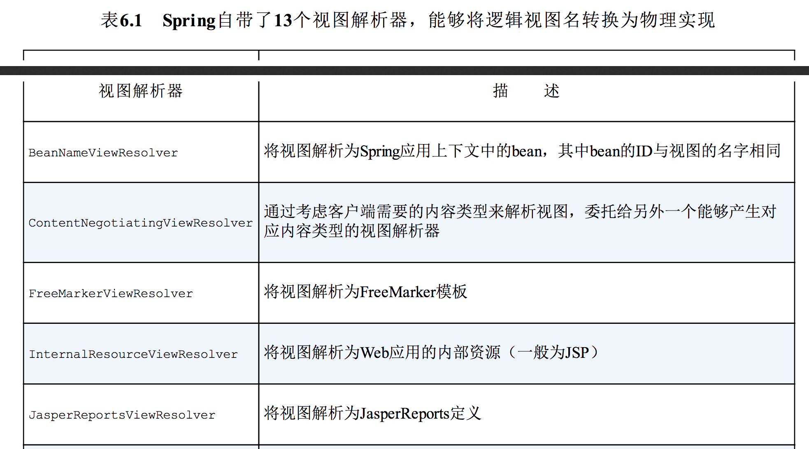
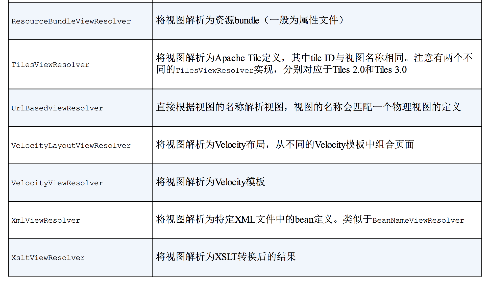
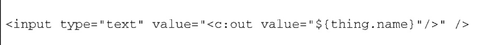
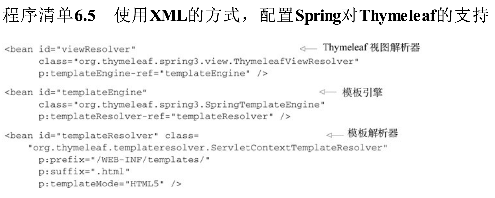
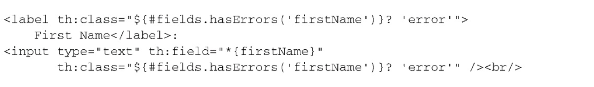
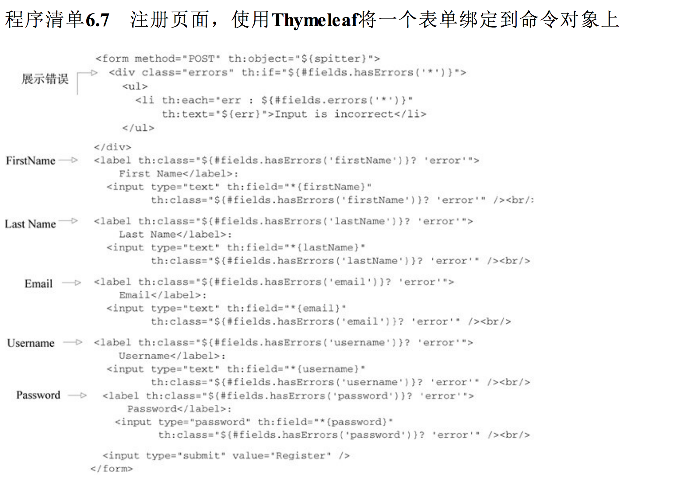

# 第6章 渲染Web视图
本章内容：

- 将模型数据渲染为HTML
- 使用JSP视图
- 通过tiles定义视图布局
- 使用Thymeleaf视图

上一章主要关注于如何编写处理Web请求的控制器。我们也创建了一些简单的视图，用来渲染控制器产生的模型数据，但我们并没有花太多时间讨论视图，也没有讨论控制器完成请求到结果渲染到用户的浏览器中的这段时间内到底发生了什么，而这正是本章的主要内容。

## 6.1 理解视图解析
在第5章中，我们所编写的控制器方法都没有直接产生浏览器中渲染所需的HTML。这些方法**只是将一些数据填充到模型中，然后将模型传递给一个用来渲染的视图**。这些方法会返回一个String类型的值，这个值是视图的**逻辑名称**，不会直接引用具体的视图实现。尽管我们也编写了几个简单的JavaServer Page（JSP）视图，但是控制器并不关心这些。

将控制器中请求处理的逻辑和视图中的渲染实现解耦是Spring MVC的一个重要特性。如果控制器中的方法直接负责产生HTML的话，就很难在不影响请求处理逻辑的前提下，维护和更新视图。**控制器方法和视图的实现会在模型内容上达成一致，这是两者的最大关联，**除此之外，两者应该保持足够的距离。

但是，如果控制器只通过逻辑视图名来了解视图的话，那Spring该如何确定使用哪一个视图实现来渲染模型呢？这就是Spring视图解析器的任务了。

在第5章中，我们使用名为InternalResourceViewResolver的视图解析器。在它的配置中，为了得到视图的名字，会使用“WEB-INFviews/”前缀和“.jsp”后缀，从而确定来渲染模型的JSP文件的物理位置。现在，我们回过头来看一下视图解析的基础知识以及Spring提供的其他视图解析器。

Spring MVC定义了一个名为ViewResolver的接口，它大致如下所示：

```
public interface ViewResolver {
    View resolveViewName(String var1, Locale var2) throws Exception;
}
```

当给resolveViewName()方法传入一个视图名和Locale对象时，它会返回一个View实例。View是另外一个接口，如下所示：

```
public interface View {
	default String getContentType() {
			return null;
		}
	void render(@Nullable Map<String, ?> model, HttpServletRequest request, HttpServletResponse response)
			throws Exception;

}

```

View接口的任务就是接受模型以及Servlet的request和response对象，并将输出结果渲染到response中。

这看起来非常简单。我们所需要做的就是编写ViewResolver和View的实现，将要渲染的内容放到response中，进而展现到用户的浏览器中。对吧？

实际上，我们并不需要这么麻烦。尽管我们可以编写ViewResolver和View的实现，在有些特定的场景下，这样做也是有必要的，但是一般来讲，我们并不需要关心这些接口。我在这里提及这些接口只是为了让你对视图解析内部如何工作有所了解。Spring提供了多个内置的实现，如表6.1所示，它们能够适应大多数的场景。

<div align="center">  </div><br>

<div align="center">  </div><br>

Spring 4和Spring 3.2支持表6.1中的所有视图解析器。Spring 3.1支持除Tiles 3TilesViewResolver之外的所有视图解析器。我们没有足够的篇幅介绍Spring所提供的13种视图解析器。

这其实也没什么，因为在大多数应用中，我们只会用到其中很少的一部分。

对于表6.1中的大部分视图解析器来讲，每一项都对应Java Web应用中特定的某种视图技术。InternalResourceViewResolver一般会用于JSP，TilesViewResolver用于Apache Tiles视图，而FreeMarkerViewResolver和VelocityViewResolver分别对应FreeMarker和Velocity模板视图。

在本章中，我们将会关注与大多数Java开发人员最息息相关的视图技术。因为大多数JavaWeb应用都会用到JSP，我们首先将会介绍InternalResourceViewResolver，这个视图解析器一般会用来解析JSP视图。接下来，我们将会介绍TilesViewResolver，控制JSP页面的布局。

在本章的最后，我们将会看一个没有列在表6.1中的视图解析器。Thymeleaf是一种用来替代JSP的新兴技术，Spring提供了与Thymeleaf的原生模板（natural template）协作的视图解析器，这种模板之所以得到这样的称呼是因为它更像是最终产生的HTML，而不是驱动它们的Java代码。Thymeleaf是一种非常令人兴奋的视图方案，所以你尽可以先往后翻几页，去6.4节看一下在Spring中是如何使用它的。

如果你依然停留在本页的话，那么你可能知道JSP曾经是，而且现在依然还是Java领域占主导地位的视图技术。在以前的项目中，也许你使用过JSP，将来有可能还会继续使用这项技术，所以接下来让我们看一下如何在Spring MVC中使用JSP视图。

## 6.2 创建JSP视图
todo 

## 6.3 使用Apache Tiles视图定义布局
todo 

## 6.4 使用Thymeleaf
尽管JSP已经存在了很长的时间，并且在Java Web服务器中无处不在，但是它却存在一些缺陷。JSP最明显的问题在于它看起来像HTML或XML，但它其实上并不是。大多数的JSP模板都是采用HTML的形式，但是又掺杂上了各种JSP标签库的标签，使其变得很混乱。这些标签库能够以很便利的方式为JSP带来动态渲染的强大功能，但是它也摧毁了我们想维持一个格式良好的文档的可能性。作为一个极端的样例，如下的JSP标签甚至作为HTML参数的值：

<div align="center">  </div><br>

标签库和JSP缺乏良好格式的一个副作用就是它**很少能够与其产生的HTML类似**。所以，在Web浏览器或HTML编辑器中查看未经渲染的JSP模板是非常令人困惑的，而且得到的结果看上去也非常丑陋。这个结果是不完整的——在视觉上这简直就是一场灾难！因为JSP并不是真正的HTML，很多浏览器和编辑器展现的效果都很难在审美上接近模板最终所渲染出来的效果。

同时，**JSP规范是与Servlet规范紧密耦合的**。这意味着它只能用在基于Servlet的Web应用之中。JSP模板不能作为通用的模板（如格式化Email），也不能用于非Servlet的Web应用。

多年来，在Java应用中，有多个项目试图挑战JSP在视图领域的统治性地位。最新的挑战者是Thymeleaf，它展现了一些切实的承诺，是一项很令人兴奋的可选方案。Thymeleaf模板是原生的，不依赖于标签库。它能在接受原始HTML的地方进行编辑和渲染。因为它没有与Servlet规范耦合，因此Thymeleaf模板能够进入JSP所无法涉足的领域。现在，我们看一下如何在Spring MVC中使用Thymeleaf。

### 6.4.1 配置Thymeleaf视图解析器
为了要在Spring中使用Thymeleaf，我们需要配置三个启用Thymeleaf与Spring集成的bean：

- ThymeleafViewResolver：将逻辑视图名称解析为Thymeleaf模板视图；
- SpringTemplateEngine：处理模板并渲染结果；
- TemplateResolver：加载Thymeleaf模板。

如下为声明这些bean的Java配置。

程序清单6.4 使用Java代码的方式，配置Spring对Thymeleaf的支持

```
  /**
     * Thymeleaf 视图解析器
     *
     * @param templateEngine
     * @return
     */
    @Bean
    public ViewResolver viewResolver(SpringTemplateEngine templateEngine) {
        ThymeleafViewResolver viewResolver = new ThymeleafViewResolver();
        viewResolver.setTemplateEngine(templateEngine);
        return viewResolver;
    }

    /**
     * 模版引擎
     *
     * @param templateResolver
     * @return
     */
    @Bean
    public SpringTemplateEngine templateEngine(TemplateResolver templateResolver) {
        SpringTemplateEngine templateEngine = new SpringTemplateEngine();
        templateEngine.setTemplateResolver(templateResolver);
        return templateEngine;
    }

    /**
     * 模版解析器
     *
     * @return
     */
    @Bean
    public TemplateResolver templateResolver() {
        TemplateResolver templateResolver = new ServletContextTemplateResolver();
        templateResolver.setPrefix("/WEB-INF/views/");
        templateResolver.setSuffix(".html");
        templateResolver.setTemplateMode("HTML5");
        return templateResolver;
    }
```

如果你更愿意使用XML来配置bean，那么如下的<bean>声明能够完成该任务。

程序清单6.5 使用XML的方式，配置Spring对Thymeleaf的支持

<div align="center">  </div><br>

不管使用哪种配置方式，Thymeleaf都已经准备就绪了，它可以将响应中的模板渲染到SpringMVC控制器所处理的请求中。

ThymeleafViewResolver是Spring MVC中ViewResolver的一个实现类。像其他的视图解析器一样，它会接受一个逻辑视图名称，并将其解析为视图。不过在该场景下，视图会是一个Thymeleaf模板。

需要注意的是ThymeleafViewResolver bean中注入了一个对SpringTemplateEngine bean的引用。SpringTemplateEngine会在Spring中启用Thymeleaf引擎，用来解析模板，并基于这些模板渲染结果。可以看到，我们为其注入了一个TemplateResolverbean的引用。

TemplateResolver会最终定位和查找模板。与之前配置InternalResourceViewResolver类似，它使用了prefix和suffix属性。前缀和后缀将会与逻辑视图名组合使用，进而定位Thymeleaf引擎。它的templateMode属性被设置成了HTML 5，这表明我们预期要解析的模板会渲染成HTML 5输出。

所有的Thymeleaf bean都已经配置完成了，那么接下来我们该创建几个视图了。

### 6.4.2 定义Thymeleaf模板
Thymeleaf在很大程度上就是HTML文件，与JSP不同，它没有什么特殊的标签或标签库。Thymeleaf之所以能够发挥作用，是因为它通过自定义的命名空间，为标准的HTML标签集合添加Thymeleaf属性。如下的程序清单展现了home.html，也就是使用Thymeleaf命名空间的首页模板。

程序清单6.6home.html：使用Thymeleaf命名空间的首页模板引擎

```
<html xmlns="http://www.w3.org/1999/xhtml"
      xmlns:th="http://www.thymeleaf.org">
<!--声明 thymeleaf 命名空间-->
<head>
    <title>Spitter</title>
    <!--到样式表到 th:href 链接-->
    <link rel="stylesheet"
          type="text/css"
          th:href="@{/resources/style.css}"></link>
</head>
<body>
<div id="header" th:include="page :: header"></div>

<div id="content">
    <h1>Welcome to Spitter</h1>

    <!--到页面的 th:href 链接-->
    <a th:href="@{/spittles}">Spittles</a> |
    <a th:href="@{/spitter/register}">Register</a>

    <br/>

    View: <span th:text="{view}">unknown</span>
</div>
<div id="footer" th:include="page :: copy"></div>
</body>
</html>
```

首页模板相对来讲很简单，只使用了th:href属性。这个属性与对应的原生HTML属性很类似，也就是href属性，并且可以按照相同的方式来使用。th:href属性的特殊之处在于它的值中可以包含Thymeleaf表达式，用来计算动态的值。它会渲染成一个标准的href属性，其中会包含在渲染时动态创建得到的值。这是Thymeleaf命名空间中很多属性的运行方式：它们对应标准的HTML属性，并且具有相同的名称，但是会渲染一些计算后得到的值。在本例中，使用th:href属性的三个地方都用到了“@{}”表达式，用来计算相对于URL的路径（就像在JSP页面中，我们可能会使用的JSTL <c:url>标签或Spring<s:url>标签类似）。

尽管home.html是一个相当简单的Thymeleaf模板，但是它依然很有价值，这在于它与纯HTML模板非常接近。唯一的区别之处在于th:href属性，否则的话，它就是基础且功能丰富的HTML文件。

这意味着Thymeleaf模板与JSP不同，它能够按照原始的方式进行编辑甚至渲染，而不必经过任何类型的处理器。当然，我们需要Thymeleaf来处理模板并渲染得到最终期望的输出。即便如此，如果没有任何特殊的处理，home.html也能够加载到Web浏览器中，并且看上去与完整渲染的效果很类似。为了更加清晰地阐述这一点，图6.6对比了home.jsp（上方）和home.html（下方）在Web浏览器中的显式效果。

可以看到，在Web浏览器中，JSP模板的渲染效果很糟糕。尽管我们可以看到一些熟悉的元素，但是JSP标签库的声明也显示了出来。在链接前出现了一些令人费解的未闭合标记，这是Web浏览器没有正常解析<s:url>标签的结果。

与之相反，Thymeleaf模板的渲染效果基本上没有任何错误。稍微有点问题的是链接部分，Web浏览器并不会像处理href属性那样处理th:href，所以链接并没有渲染为链接的样子。除了这些细微的问题，模板的渲染效果与我们的预期完全符合。

像home.jsp这样的模板作为Thymeleaf入门是很合适的。但是Spring的JSP标签所擅长的是表单绑定。如果我们抛弃JSP的话，那是不是也要抛弃表单绑定呢？不必担心。Thymeleaf提供了与之相匹敌的功能。

<div align="center">  </div><br>

#### 借助Thymeleaf实现表单绑定
表单绑定是Spring MVC的一项重要特性。它能够将表单提交的数据填充到命令对象中，并将其传递给控制器，而在展现表单的时候，表单中也会填充命令对象中的值。如果没有表单绑定功能的话，我们需要确保HTML表单域要映射后端命令对象中的属性，并且在校验失败后展现表单的时候，还要负责确保输入域中值要设置为命令对象的属性。

但是，如果有表单绑定的话，它就会负责这些事情了。为了复习一下表单绑定是如何运行的，下面展现了在registration.jsp中的First Name输入域：

<div align="center">  </div><br>

在这里，调用了Spring表单绑定标签库的<sf:input>标签，它会渲染出一个HTML<input>标签，并且其value属性设置为后端对象firstName属性的值。它还使用了Spring的<sf:label>标签及其cssErrorClass属性，如果出现校验错误的话，会将文本标记渲染为红色。

但是，我们本节讨论的并不是JSP，而是使用Thymeleaf替换JSP。因此，我们不能使用Spring的JSP标签实现表单绑定，而是使用Thymeleaf的Spring方言。作为阐述的样例，请参考如下的Thymeleaf模板片段，它会渲染First Name输入域：

<div align="center">  </div><br>

在这里，我们不再使用Spring JSP标签中的cssClassName属性，而是在标准的HTML标签
上使用th:class属性。th:class属性会渲染为一个class属性，它的值是根据给定的表达式计算得到的。在上面的这两个th:class属性中，它会直接检查firstName域有没有校验错误。如果有的话，class属性在渲染时的值为error。如果这个域没有错误的话，将不会渲染class属性。

<input>标签使用了th:field属性，用来引用后端对象的firstName域。这可能与你的预期有点差别。在Thymeleaf模板中，我们在很多情况下所使用的属性都对应于标准的HTML属性，因此貌似使用th:value属性来设置<input>标签的value属性才是合理的。

其实不然，因为我们是在将这个输入域绑定到后端对象的firstName属性上，因此使用th:field属性引用firstName域。通过使用th:field，我们将value属性设置为firstName的值，同时还会将name属性设置为firstName。为了阐述Thymeleaf是如何实际运行的，如下的程序清单展示了完整的注册表单模板。

程序清单6.7 注册页面，使用Thymeleaf将一个表单绑定到命令对象上

<div align="center">  </div><br>

程序清单6.7使用了相同的Thymeleaf属性和“{}”表达式，为所有的表单域绑定后端对象。这其实重复了我们在First Name域中所做的事情。

但是，需要注意我们在表单的顶部了也使用了Thymeleaf，它会用来渲染所有的错误。<div>元素使用th:if属性来检查是否有校验错误。如果有的话，会渲染<div>，否则的话，它将不会渲染。

在<div>中，会使用一个无顺序的列表来展现每项错误。<li>标签上的th:each属性将会通知Thymeleaf为每项错误都渲染一个<li>，在每次迭代中会将当前错误设置到一个名
为err的变量中。

<li>标签还有一个th:text属性。这个命令会通知Thymeleaf计算某一个表达式（在本例中，也就是err变量）并将它的值渲染为<li>标签的内容体。实际上的效果就是每项错误对应一个<li>元素，并展现错误的文本。

你可能会想知道 `“${}”`和`“*{}”`括起来的表达式到底有什么区别。“{}”表达式（如{spitter}）是变量表达式（variable expression）。一般来讲，它们会是**对象图导航语言（Object-Graph Navigation Language，OGNL）表达式**（http://commons.apache.org/proper/commons-ognl/）。但在使用Spring的时候，它们是SpEL表达式。在{spitter}这个例子中，它会解析为key为spitter的model属性。

而对于`“*{}”`表达式，它们是选择表达式（selection expression）。变量表达式是基于整个SpEL上下文计算的，而选择表达式是基于某一个选中对象计算的。在本例的表单中，选中对象就是<form>标签中th:object属性所设置的对象：模型中的Spitter对象。因此，“*{firstName}”表达式就会计算为Spitter对象的firstName属性。

- **对象图导航语言（Object-Graph Navigation Language，OGNL）表达式**

## 6.5 小结
处理请求只是Spring MVC功能的一部分。如果控制器所产生的结果想要让人看到，那么它们产生的模型数据就要渲染到视图中，并展现到用户的Web浏览器中。Spring的视图渲染是很灵活的，并提供了多个内置的可选方案，包括传统的JavaServer Pages以及流行的ApacheTiles布局引擎。

在本章中，我们首先快速了解了一下Spring所提供的视图和视图解析可选方案。我们还深入学习了如何在Spring MVC中使用JSP和Apache Tiles。

我们还看到了如何使用Thymeleaf作为Spring MVC应用的视图层，它被视为JSP的替代方案。Thymeleaf是一项很有吸引力的技术，因为它能创建原始的模板，这些模板是纯HTML，能像静态HTML那样以原始的方式编写和预览，并且能够在运行时渲染动态模型数据。除此之外，Thymeleaf是与Servlet没有耦合关系的，这样它就能够用在JSP所不能使用的领域中。

Spittr应用的视图定义完成之后，我们已经具有了一个虽然微小但是可部署且具有一定功能的Spring MVC Web应用。还有一些其他的特性需要更新进来，如数据持久化和安全性，我们会在合适的时候关注这些特性。但现在，这个应用开始变得有模有样了。

在深入学习应用的技术栈之前，在下一章我们将会继续讨论Spring MVC，学习这个框架中一些更为有用和高级的功能。