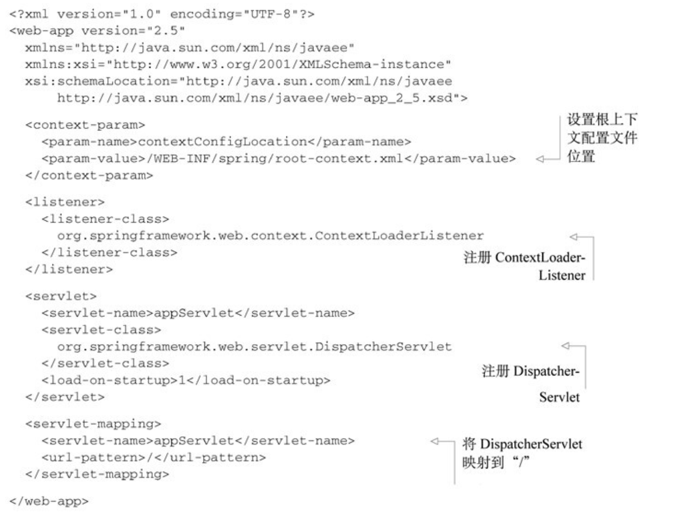
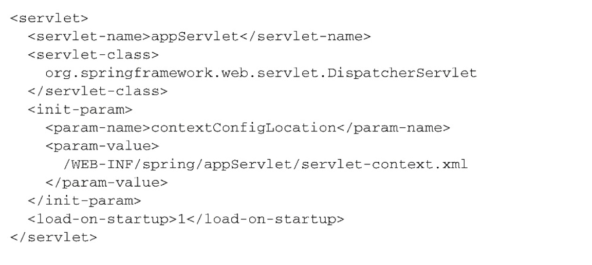
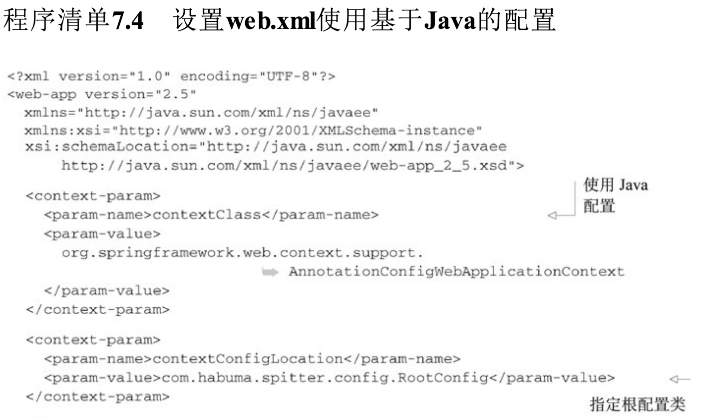
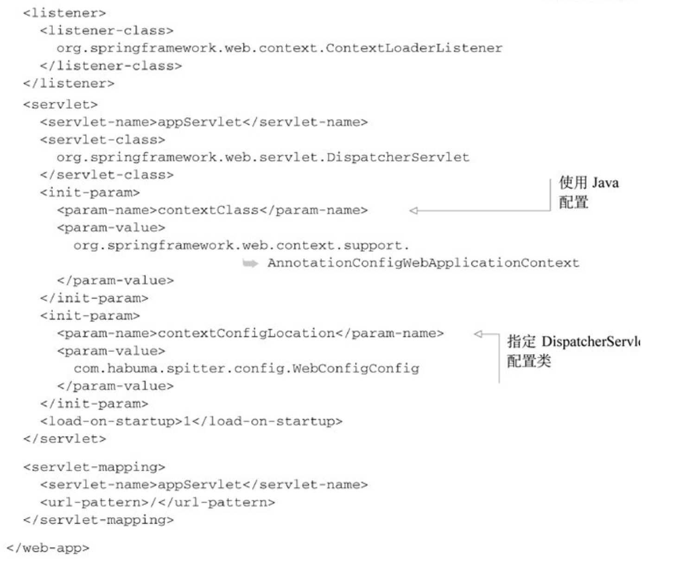
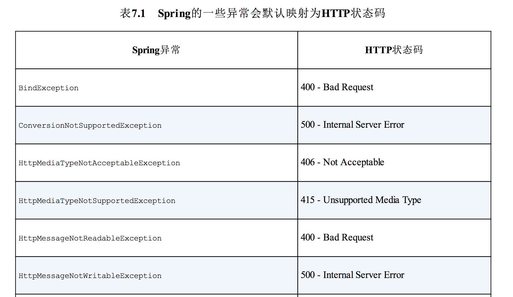
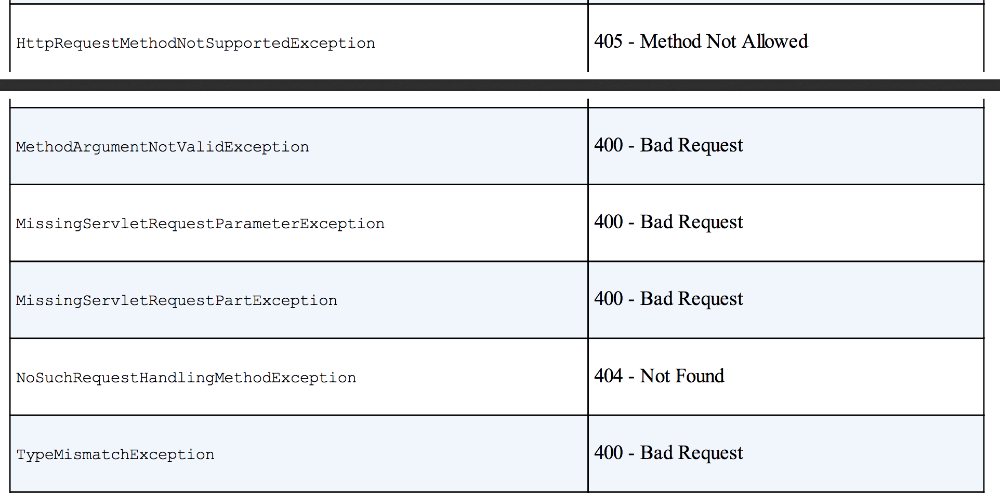
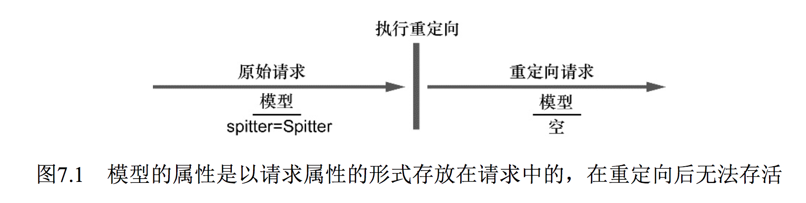
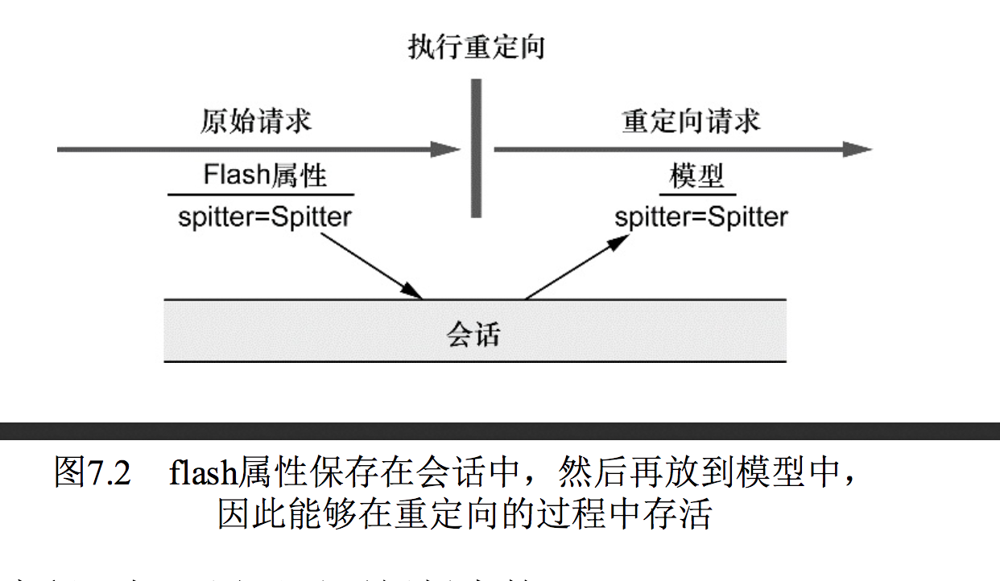

# 第7章 Spring MVC的高级技术
本章内容：

- Spring MVC配置的替代方案
- 处理文件上传
- 在控制器中处理异常
- 使用flash属性

在本章中，我们会继续Spring MVC的话题，本章所介绍的特性已经超出了第5章和第6章基础知识的范畴。我们将会看到如何编写控制器来处理文件上传、如何处理控制器所抛出的异常，以及如何在模型中传递数据，使其能够在重定向（redirect）之后依然存活。

但首先，我要兑现一个承诺。在第5章中，我快速展现了如何通过AbstractAnnotationConfigDispatcherServletInitializer搭建Spring MVC，当时我承诺会为读者展现其他的配置方案。所以，在介绍文件上传和异常处理之前，我们先花一点时间探讨一下如何用其他的方式来搭建DispatcherServlet和ContextLoaderListener。

## 7.1 Spring MVC配置的替代方案
在第5章中，我们通过扩展AbstractAnnotationConfigDispatcherServletInitializer快速搭建了SpringMVC环境。在这个便利的基础类中，假设我们需要基本的DispatcherServlet和ContextLoaderListener环境，并且Spring配置是使用Java的，而不是XML。

尽管对很多Spring应用来说，这是一种安全的假设，但是并不一定总能满足我们的要求。除了DispatcherServlet以外，我们可能还需要额外的Servlet和Filter；我们可能还需要对DispatcherServlet本身做一些额外的配置；或者，如果我们需要将应用部署到Servlet3.0之前的容器中，那么还需要将DispatcherServlet配置到传统的web.xml中。

### 7.1.1 自定义DispatcherServlet配置
虽然从程序清单7.1的外观上不一定能够看得出来，但是AbstractAnnotationConfigDispatcherServletInitializer所完成的事情其实比看上去要多。在SpittrWebAppInitializer中我们所编写的三个方法仅仅是必须要重载的abstract方法。但实际上还有更多的方法可以进行重载，从而实现额外的配置。

此类的方法之一就是customizeRegistration()。在AbstractAnnotationConfigDispatcherServletInitializer将DispatcherServlet注册到Servlet容器中之后，就会调用customizeRegistration()，并将Servlet注册后得到的Registration.Dynamic传递进来。通过重载customizeRegistration()方法，我们可以对DispatcherServlet进行额外的配置。

例如，在本章稍后的内容中（7.2节），我们将会看到如何在Spring MVC中处理multipart请求和文件上传。如果计划使用Servlet 3.0对multipart配置的支持，那么需要使用DispatcherServlet的registration来启用multipart请求。我们可以重载customizeRegistration()方法来设置MultipartConfigElement，如下所示：

```
@Override
    protected void customizeRegistration(Dynamic registration) {
        registration.setMultipartConfig(
                new MultipartConfigElement("/tmp/spittr/uploads", 2097152, 4194304, 0));
    }
```

借助customizeRegistration()方法中的ServletRegistration.Dynamic，我们能够完成多项任务，包括通过调用setLoadOnStartup()设置load-on-startup优先级，通过setInitParameter()设置初始化参数，通过调用setMultipartConfig()配置Servlet3.0对multipart的支持。在前面的样例中，我们设置了对multipart的支持，将上传文件的临时存储目录设置在“tmpspittr/uploads”中。

### 7.1.2 添加其他的Servlet和Filter
按照AbstractAnnotationConfigDispatcherServletInitializer的定义，它会创建DispatcherServlet和ContextLoaderListener。但是，如果你想注册其他的Servlet、Filter或Listener的话，那该怎么办呢？

基于Java的初始化器（initializer）的一个好处就在于我们可以定义任意数量的初始化器类。因此，如果我们想往Web容器中注册其他组件的话，只需创建一个新的初始化器就可以了。最简单的方式就是实现Spring的WebApplicationInitializer接口。

例如，如下的程序清单展现了如何创建WebApplicationInitializer实现并注册一个Servlet。

程序清单7.1 通过实现WebApplicationInitializer来注册Servlet

```
package com.alan.yx.springInAction.Chapter_07.Spittr.src.main.java.spittr.config;

import org.springframework.web.WebApplicationInitializer;

import javax.servlet.ServletContext;
import javax.servlet.ServletException;
import javax.servlet.ServletRegistration;

/**
 * 程序清单7.1 通过实现WebApplicationInitializer来注册Servlet
 *
 * @author yinxing
 * @date 2019/4/30
 */

public class MyServletInitializer implements WebApplicationInitializer {

    @Override
    public void onStartup(ServletContext servletContext) throws ServletException {
        // 注册 Servlet
        ServletRegistration.Dynamic myServlet = servletContext.addServlet("myServlet", MyServlet.class);
        // 映射 Servlet
        myServlet.addMapping("/custom/**");
    }
}
```

程序清单7.1是相当基础的Servlet注册初始化器类。它注册了一个Servlet并将其映射到一个路径上。我们也可以通过这种方式来手动注册DispatcherServlet。（但这并没有必要，因为AbstractAnnotationConfigDispatcherServletInitializer没用太多代码就将这项任务完成得很漂亮。）

类似地，我们还可以创建新的WebApplicationInitializer实现来注册Listener和Filter。例如，如下的程序清单展现了如何注册Filter。

程序清单7.2 注册Filter的WebApplicationInitializer

```
public class MyServletInitializer implements WebApplicationInitializer {

    @Override
    public void onStartup(ServletContext servletContext) throws ServletException {
        // 注册 Filter
        FilterRegistration.Dynamic myFilter = servletContext.addFilter("myFilter", MyFilter.class);
        // 添加 Filter 的映射路径
        myFilter.addMappingForUrlPatterns(null, false, "/custom/**");
    }
}
```

如果要将应用部署到支持Servlet 3.0的容器中，那么WebApplicationInitializer提供了一种通用的方式，实现在Java中注册Servlet、Filter和Listener。不过，如果你只是注册Filter，并且该Filter只会映射到DispatcherServlet上的话，那么在AbstractAnnotationConfigDispatcherServletInitializer中还有一种快捷方式。

为了注册Filter并将其映射到DispatcherServlet，所需要做的仅仅是重载AbstractAnnotationConfigDispatcherServletInitializer的getServletFilters()方法。例如，在如下的代码中，重载了AbstractAnnotationConfigDispatcherServletInitializer的getServletFilters()方法以注册Filter：

```
 /**
     * 注册Filter并将其映射到DispatcherServlet
     * @return
     */
    @Override
    protected Filter[] getServletFilters() {
        return new Filter[]{new MyFilter()};
    }
```

我们可以看到，这个方法返回的是一个javax.servlet.Filter的数组。在这里它只返回了一个Filter，但它实际上可以返回任意数量的Filter。在这里没有必要声明它的映射路径，getServletFilters()方法返回的所有Filter都会映射到DispatcherServlet上。

如果要将应用部署到Servlet 3.0容器中，那么Spring提供了多种方式来注册Servlet（包括DispatcherServlet）、Filter和Listener，而不必创建web.xml文件。但是，如果你不想采取以上所述方案的话，也是可以的。假设你需要将应用部署到不支持Servlet 3.0的容器中（或者你只是希望使用web.xml文件），那么我们完全可以按照传统的方式，通过web.xml配置Spring MVC。让我们看一下该怎么做。

### 7.1.3 在web.xml中声明DispatcherServlet
在典型的Spring MVC应用中，我们会需要DispatcherServlet和ContextLoaderListener。AbstractAnnotationConfigDispatcherServletInitializer会自动注册它们，但是如果需要在web.xml中注册的话，那就需要我们自己来完成这项任务了。

如下是一个基本的web.xml文件，它按照传统的方式搭建了DispatcherServlet和ContextLoaderListener。

程序清单7.3 在web.xml中搭建Spring MVC

<div align="center">  </div><br>

就像我在第5章曾经介绍过的，ContextLoaderListener和DispatcherServlet各自都会加载一个Spring应用上下文。上下文参数contextConfigLocation指定了一个XML文件的地址，这个文件定义了根应用上下文，它会被ContextLoaderListener加载。如程序清单7.3所示，根上下文会从“WEB-INFspring/root-context.xml”中加载bean定义。

DispatcherServlet会根据Servlet的名字找到一个文件，并基于该文件加载应用上下文。在程序清单7.3中，Servlet的名字是appServlet，因此DispatcherServlet会从“WEB-INFappServlet-context.xml”文件中加载其应用上下文。

如果你希望指定DispatcherServlet配置文件的位置的话，那么可以在Servlet上指定一个contextConfigLocation初始化参数。例如，如下的配置中，DispatcherServlet会从“WEB-INFspring/appServlet/servlet-context.xml”加载它的bean：

<div align="center">  </div><br>

当然，上面阐述的都是如何让DispatcherServlet和ContextLoaderListener从XML中加载各自的应用上下文。但是，在本书中的大部分内容中，我们都更倾向于使用Java配置而不是XML配置。因此，我们需要让Spring MVC在启动的时候，从带有@Configuration注解的类上加载配置。

要在Spring MVC中使用基于Java的配置，我们需要告诉DispatcherServlet和ContextLoaderListener使用AnnotationConfigWebApplicationContext，这是一个WebApplicationContext的实现类，它会加载Java配置类，而不是使用XML。要实现这种配置，我们可以设置contextClass上下文参数以及DispatcherServlet的初始化参数。如下的程序清单展现了一个新的web.xml，在这个文件中，它所搭建的Spring MVC使用基于Java的Spring配置：

程序清单7.4 设置web.xml使用基于Java的配置

<div align="center">  </div><br>
<div align="center">  </div><br>

现在我们已经看到了如何以多种不同的方式来搭建Spring MVC，那么接下来我们会看一下如何使用Spring MVC来处理文件上传。

## 7.2 处理multipart形式的数据
TODO

## 7.3 处理异常
到现在为止，在Spittr应用中，我们假设所有的功能都正常运行。但是如果某个地方出错的话，该怎么办呢？当处理请求的时候，抛出异常该怎么处理呢？如果发生了这样的情况，该给客户端什么响应呢？

不管发生什么事情，不管是好的还是坏的，Servlet请求的输出都是一个Servlet响应。如果在请求处理的时候，出现了异常，那它的输出依然会是Servlet响应。异常必须要以某种方式转换为响应。

Spring提供了多种方式将异常转换为响应：

- 特定的Spring异常将会自动映射为指定的HTTP状态码；
- 异常上可以添加@ResponseStatus注解，从而将其映射为某一个HTTP状态码；
- 在方法上可以添加@ExceptionHandler注解，使其用来处理异常。

处理异常的最简单方式就是将其映射到HTTP状态码上，进而放到响应之中。接下来，我们看一下如何将异常映射为某一个HTTP状态码。

### 7.3.1 将异常映射为HTTP状态码
在默认情况下，Spring会将自身的一些异常自动转换为合适的状态码。表7.1列出了这些映射关系。

表7.1 Spring的一些异常会默认映射为HTTP状态码

<div align="center">  </div><br>
<div align="center">  </div><br>

表7.1中的异常一般会由Spring自身抛出，作为DispatcherServlet处理过程中或执行校验时出现问题的结果。例如，如果DispatcherServlet无法找到适合处理请求的控制器方法，那么将会抛出NoSuchRequestHandlingMethodException异常，最终的结果就是产生404状态码的响应（Not Found）。

尽管这些内置的映射是很有用的，但是对于应用所抛出的异常它们就无能为力了。幸好，Spring提供了一种机制，能够通过@ResponseStatus注解将异常映射为HTTP状态码。

为了阐述这项功能，请参考SpittleController中如下的请求处理方法，它可能会产生HTTP 404状态（但目前还没有实现）：

```
@RequestMapping(value="/{spittleId}", method=RequestMethod.GET)
  public String spittle(
      @PathVariable("spittleId") long spittleId,
      Model model) {
    Spittle spittle = spittleRepository.findOne(spittleId);
    if (spittle == null) {
      // 可能会产生HTTP 404状态
      throw new SpittleNotFoundException();
    }
    model.addAttribute(spittle);
    return "spittle";
  }
```

在这里，会从SpittleRepository中，通过ID检索Spittle对象。如果findOne()方法能够返回Spittle对象的话，那么会将Spittle放到模型中，然后名为spittle的视图会负责将其渲染到响应之中。但是如果findOne()方法返回null的话，那么将会抛出SpittleNotFoundException异常。现在SpittleNotFoundException就是一个简单的非检查型异常，如下所示：

```
public class SpittleNotFoundException extends RuntimeException {

}
```

如果调用spittle()方法来处理请求，并且给定ID获取到的结果为空，那么SpittleNotFoundException（默认）将会产生500状态码（Internal Server Error）的响应。实际上，如果出现任何没有映射的异常，响应都会带有500状态码，但是，我们可以通过映射SpittleNotFoundException对这种默认行为进行变更。

当抛出SpittleNotFoundException异常时，这是一种请求资源没有找到的场景。如果资源没有找到的话，HTTP状态码404是最为精确的响应状态码。所以，我们要使用@ResponseStatus注解将SpittleNotFoundException映射为HTTP状态码404。

程序清单7.8@ResponseStatus注解：将异常映射为特定的状态码

```
@ResponseStatus(value = HttpStatus.NOT_FOUND, reason = "Spittle Not Found")
public class SpittleNotFoundException extends RuntimeException {

}
```

在引入@ResponseStatus注解之后，如果控制器方法抛出SpittleNotFoundException异常的话，响应将会具有404状态码，这是因为Spittle NotFound。

### 7.3.2 编写异常处理的方法
在很多的场景下，将异常映射为状态码是很简单的方案，并且就功能来说也足够了。但是如果我们想在响应中不仅要包括状态码，还要包含所产生的错误，那该怎么办呢？此时的话，我们就不能将异常视为HTTP错误了，而是要按照处理请求的方式来处理异常了。

作为样例，假设用户试图创建的Spittle与已创建的Spittle文本完全相同，那么SpittleRepository的save()方法将会抛出DuplicateSpittle Exception异常。这意味着SpittleController的saveSpittle()方法可能需要处理这个异常。如下面的程序清单所示，saveSpittle()方法可以直接处理这个异常。

程序清单7.9 在处理请求的方法中直接处理异常

```
 @RequestMapping(method = RequestMethod.POST)
    public String saveSpittle(SpittleForm form, Model model) {
        try {
            spittleRepository.save(new Spittle(null, form.getMessage(), new Date(),
                    form.getLongitude(), form.getLatitude()));
            return "redirect:/spittles";
        } catch (DuplicateSpittleException e) {
            // 捕获异常
            return "error/duplicate";
        }
    }
```

程序清单7.9中并没有特别之处，它只是在Java中处理异常的基本样例，除此之外，也就没什么了。

它运行起来没什么问题，但是这个方法有些复杂。该方法可以有两个路径，每个路径会有不同的输出。如果能让saveSpittle()方法只关注正确的路径，而让其他方法处理异常的话，那么它就能简单一些。

首先，让我们首先将saveSpittle()方法中的异常处理方法剥离掉：

```
 @RequestMapping(method = RequestMethod.POST)
    public String saveSpittle(SpittleForm form, Model model) {
        try {
            spittleRepository.save(new Spittle(null, form.getMessage(), new Date(),
                    form.getLongitude(), form.getLatitude()));
            return "redirect:/spittles";
    }
```

可以看到，saveSpittle()方法简单了许多。因为它只关注成功保存Spittle的情况，所以只有一个执行路径，很容易理解（和测试）。

现在，我们为SpittleController添加一个新的方法，它会处理抛出DuplicateSpittleException的情况：

```
@ExceptionHandler(DuplicateSpittleException.class)
    public String handleNotFound() {
        return "error/duplicate";
    }
```

handleDuplicateSpittle()方法上添加了@ExceptionHandler注解，当抛出DuplicateSpittleException异常的时候，将会委托该方法来处理。它返回的是一个String，这与处理请求的方法是一致的，指定了要渲染的逻辑视图名，它能够告诉用户他们正在试图创建一条重复的条目。

对于@ExceptionHandler注解标注的方法来说，比较有意思的一点在于它能处理同一个控制器中所有处理器方法所抛出的异常。所以，尽管我们从saveSpittle()中抽取代码创建了handleDuplicateSpittle()方法，但是它能够处理SpittleController中所有方法所抛出的DuplicateSpittleException异常。我们不用在每一个可能抛出DuplicateSpittleException的方法中添加异常处理代码，这一个方法就涵盖了所有的功能。

- **@ExceptionHandler注解标注的方法：它能处理同一个控制器中所有处理器方法所抛出的异常**

既然@ExceptionHandler注解所标注的方法能够处理同一个控制器类中所有处理器方法的异常，那么你可能会问有没有一种方法能够处理所有控制器中处理器方法所抛出的异常呢。从Spring 3.2开始，这肯定是能够实现的，我们只需将其定义到控制器通知类中即可。

什么是控制器通知方法？很高兴你会问这样的问题，因为这就是我们下面要讲的内容。

## 7.4 为控制器添加通知
如果控制器类的特定切面能够运用到整个应用程序的所有控制器中，那么这将会便利很多。举例来说，如果要在多个控制器中处理异常，那@ExceptionHandler注解所标注的方法是很有用的。不过，如果多个控制器类中都会抛出某个特定的异常，那么你可能会发现要在所有的控制器方法中重复相同的@ExceptionHandler方法。或者，**为了避免重复，我们会创建一个基础的控制器类，所有控制器类要扩展这个类，从而继承通用的@ExceptionHandler方法。**

Spring 3.2为这类问题引入了一个新的解决方案：控制器通知。控制器通知（controlleradvice）是任意带有@ControllerAdvice注解的类，这个类会包含一个或多个如下类型的方法：

- @ExceptionHandler注解标注的方法；
- @InitBinder注解标注的方法；
- @ModelAttribute注解标注的方法。

- **在带有@ControllerAdvice注解的类中，以上所述的这些方法会运用到`整个应用程序`所有控制器中带有`@RequestMapping`注解的方法上。**

@ControllerAdvice注解本身已经使用了@Component，因此@ControllerAdvice注解所标注的类将会自动被组件扫描获取到，就像带有@Component注解的类一样。@ControllerAdvice最为实用的一个场景就是将所有的@ExceptionHandler方法收集到一个类中，这样所有控制器的异常就能在一个地方进行一致的处理。例如，我们想将DuplicateSpittleException的处理方法用到整个应用程序的所有控制器上。如下的程序清单展现的AppWideExceptionHandler就能完成这一任务，这是一个带有@ControllerAdvice注解的类。

程序清单7.10 使用@ControllerAdvice，为所有的控制器处理异常

```
@ControllerAdvice
public class AppWideExceptionHandler {

    @ExceptionHandler(DuplicateSpittleException.class)
    public String handleNotFound() {
        return "error/duplicate";
    }

}
```

现在，如果任意的控制器方法抛出了DuplicateSpittleException，不管这个方法位于哪个控制器中，都会调用这个duplicateSpittleHandler()方法来处理异常。我们可以像编写@RequestMapping注解的方法那样来编写@ExceptionHandler注解的方法。如程序清单7.10所示，它返回“error/duplicate”作为逻辑视图名，因此将会为用户展现一个友好的出错页面。

## 7.5 跨重定向请求传递数据
在5.4.1小节中，在处理完POST请求后，通常来讲一个最佳实践就是执行一下重定向。除了其他的一些因素外，这样做能够防止用户点击浏览器的刷新按钮或后退箭头时，客户端重新执行危险的POST请求。

在第5章，在控制器方法返回的视图名称中，我们借助了“redirect:”前缀的力量。当控制器方法返回的String值以“redirect:”开头的话，那么这个String不是用来查找视图的，而是用来指导浏览器进行重定向的路径。我们可以回头看一下程序清单5.17，可以看到processRegistration()方法返回的“redirect:String”如下所示：

	return "redirect:/spitter" +spitter.getUsername();

“redirect:”前缀能够让重定向功能变得非常简单。你可能会想Spring很难再让重定向功能变得更简单了。但是，请稍等：Spring为重定向功能还提供了一些其他的辅助功能。

具体来讲，正在发起重定向功能的方法该如何发送数据给重定向的目标方法呢？一般来讲，当一个处理器方法完成之后，该方法所指定的模型数据将会复制到请求中，并作为请求中的属性，请求会转发（forward）到视图上进行渲染。因为控制器方法和视图所处理的是同一个请求，所以在转发的过程中，请求属性能够得以保存。

但是，如图7.1所示，当控制器的结果是重定向的话，原始的请求就结束了，并且会发起一个新的GET请求。原始请求中所带有的模型数据也就随着请求一起消亡了。在新的请求属性中，没有任何的模型数据，这个请求必须要自己计算数据。

<div align="center">  </div><br>

显然，对于重定向来说，模型并不能用来传递数据。但是我们也有一些其他方案，能够从发起重定向的方法传递数据给处理重定向方法中：

- 使用URL模板以路径变量和/或查询参数的形式传递数据
- 通过flash属性发送数据。

首先，我们看一下Spring如何帮助我们通过路径变量和/或查询参数的形式传递数据。

### 7.5.1 通过URL模板进行重定向
通过路径变量和查询参数传递数据看起来非常简单。例如，在程序清单5.19中，我们以路径变量的形式传递了新创建Spitter的username。但是按照现在的写法，username的值是直接连接到重定向String上的。这能够正常运行，但是还远远不能说没有问题。当构建URL或SQL查询语句的时候，使用String连接是很危险的。

	return "redirect:/spitter/{username};

除了连接String的方式来构建重定向URL，Spring还提供了使用模板的方式来定义重定向URL。例如，在程序清单5.19中，processRegistration()方法的最后一行可以改写为如下的形式：

```
    @RequestMapping(value = "/register", method = POST)
    public String processRegistration(Spitter spitter,Model model) {
        // 保存 Spitter
        spitterRepository.save(spitter);
        // 重定向的方式2：以占位符的方式更加的安全
        model.addAttribute("username",spitter.getUsername());
        return "redirect:/spitter/{username}";
    }
```

现在，username作为占位符填充到了URL模板中，而不是直接连接到重定向String中，所以username中所有的不安全字符都会进行转义。这样会更加安全，这里允许用户输入任何想要的内容作为username，并会将其附加到路径上。

除此之外，模型中所有其他的**原始类型值**都可以添加到URL中作为查询参数。作为样例，假设除了username以外，模型中还要包含新创建Spitter对象的id属性，那processRegistration()方法可以改写为如下的形式：

```
    @RequestMapping(value = "/register", method = POST)
    public String processRegistration(Spitter spitter,Model model) {
        // 保存 Spitter
        spitterRepository.save(spitter);
        // 重定向的方式2：以占位符的方式更加的安全
        model.addAttribute("username",spitter.getUsername());
		 model.addAttribute("spitterId",spitter.getId());
        return "redirect:/spitter/{username}";
    }
```

所返回的重定向String并没有太大的变化。但是，因为模型中的spitterId属性没有匹配重定向URL中的任何占位符，所以它会自动以查询参数的形式附加到重定向URL上。

如果username属性的值是habuma并且spitterId属性的值是42，那么结果得到的重定向URL路径将会是“spitterhabuma?spitterId=42”。

通过路径变量和查询参数的形式跨重定向传递数据是很简单直接的方式，但它也有一定的限制。它只能用来发送简单的值，如String和数字的值。在URL中，并没有办法发送更为复杂的值，但这正是flash属性能够提供帮助的领域。

### 7.5.2 使用flash属性
假设我们不想在重定向中发送username或ID了，而是要发送实际的Spitter对象。如果我们只发送ID的话，那么处理重定向的方法还需要从数据库中查找才能得到Spitter对象。但是，在重定向之前，我们其实已经得到了Spitter对象。为什么不将其发送给处理重定向的方法，并将其展现出来呢？

Spitter对象要比String和int更为复杂。因此，我们不能像路径变量或查询参数那么容易地发送Spitter对象。它只能设置为模型中的属性。

但是，正如我们前面所讨论的那样，模型数据最终是以请求参数的形式复制到请求中的，当重定向发生的时候，这些数据就会丢失。因此，我们需要将Spitter对象放到一个位置，使其能够在重定向的过程中存活下来。

有个方案是将Spitter放到会话中。**会话能够长期存在，并且能够跨多个请求**。所以我们可以在重定向发生之前将Spitter放到会话中，并在重定向后，从会话中将其取出。当然，我们还要负责在重定向后在会话中将其清理掉。实际上，Spring也认为将跨重定向存活的数据放到会话中是一个很不错的方式。但是，Spring认为我们并不需要管理这些数据，相反，Spring提供了将数据发送为flash属性（flash attribute）的功能。按照定义，**flash属性会一直携带这些数据直到下一次请求，然后才会消失。**

Spring提供了通过RedirectAttributes设置flash属性的方法，这是Spring 3.1引入的Model的一个子接口。RedirectAttributes提供了Model的所有功能，除此之外，还有几个方法是用来设置flash属性的。

具体来讲，RedirectAttributes提供了一组addFlashAttribute()方法来添加flash属性。重新看一下processRegistration()方法，我们可以使用addFlashAttribute()将Spitter对象添加到模型中：

```
    @RequestMapping(value = "/register", method = POST)
    public String processRegistration(Spitter spitter,Model model) {
        // 保存 Spitter
        spitterRepository.save(spitter);
        // 重定向的方式2：以占位符的方式更加的安全
        model.addAttribute("username",spitter.getUsername());
		 model.addFlashAttribute("spitter",spitter);
        return "redirect:/spitter/{username}";
    }
```

在这里，我们调用了addFlashAttribute()方法，并将spitter作为key，Spitter对象作为值。另外，我们还可以不设置key参数，让key根据值的类型自行推断得出：

model.addFlashAttribute(spitter);

因为我们传递了一个Spitter对象给addFlashAttribute()方法，所以推断得到的key将会是spitter。

在重定向执行之前，所有的flash属性都会复制到会话中。在重定向后，存在会话中的flash属性会被取出，并从会话转移到模型之中。处理重定向的方法就能从模型中访问Spitter对象了，就像获取其他的模型对象一样。图7.2阐述了它是如何运行的。

<div align="center">  </div><br>

为了完成flash属性的流程，如下展现了更新版本的showSpitterProfile()方法，在从数据库中查找之前，它会首先从模型中检查Spitter对象：

```
@RequestMapping(value = "/{username}", method = GET)
    public String showSpitterProfile(
            @PathVariable String username, Model model) {
        if (!model.containsAttribute("spitter")) {
            model.addAttribute(spitterRepository.findByUsername(username));
        }
        return "profile";
    }
```

可以看到，showSpitterProfile()方法所做的第一件事就是检查是否存有key为spitter的model属性。如果模型中包含spitter属性，那就什么都不用做了。这里面包含的Spitter对象将会传递到视图中进行渲染。但是如果模型中不包含spitter属性的话，那么showSpitterProfile()将会从Repository中查找Spitter，并将其存放到模型中。

## 7.6 小结
在Spring中，总是会有“还没有结束”的感觉：更多的特性、更多的选择以及实现开发目标的更多方式。Spring MVC有很多功能和技巧。

当然，Spring MVC的环境搭建是有多种可选方案的一个领域。在本章中，我们首先看了一下搭建Spring MVC中DispatcherServlet和ContextLoaderListener的多种方式。我们还看到了如何调整DispatcherServlet的注册功能以及如何注册自定义的Servlet和Filter。如果你需要将应用部署到更老的应用服务器上，我们还快速了解了如何使用web.xml声明DispatcherServlet和ContextLoaderListener。

然后，我们了解了如何处理Spring MVC控制器所抛出的异常。尽管带有@RequestMapping注解的方法可以在自身的代码中处理异常，但是如果我们将异常处理的代码抽取到单独的方法中，那么控制器的代码会整洁得多。

为了采用一致的方式处理通用的任务，包括在应用的所有控制器中处理异常，Spring 3.2引入了@ControllerAdvice，它所创建的类能够将控制器的通用行为抽取到同一个地方。

最后，我们看了一下如何跨重定向传递数据，包括Spring对flash属性的支持：类似于模型的属性，但是能在重定向后存活下来。这样的话，就能采用非常恰当的方式为POST请求执行一个重定向回应，而且能够将处理POST请求时的模型数据传递过来，然后在重定向后使用或展现这些模型数据。

如果你还有疑惑的话，那么可以告诉你，这就是我所说的“更多的功能”！其实，我们并没有讨论到Spring MVC的每个方面。我们将会在第16章中重新讨论Spring MVC，到时你会看到如何使用它来创建REST API。

但现在，我们将会暂时放下Spring MVC，看一下Spring Web Flow，这是一个构建在SpringMVC之上的流程框架，它能够引导用户执行一系列向导步骤。