## 第9章 保护Web应用

本章内容：

- Spring Security介绍
- 使用Servlet规范中的Filter保护Web应用
- 基于数据库和LDAP进行认证

现在，信息可能是我们最有价值的东西，一些不怀好意的人想尽办法试图偷偷进入不安全的应用程序来窃取我们的数据和身份信息。作为软件开发人员，我们必须采取措施来保护应用程序中的信息。无论你是通过用户名/密码来保护电子邮件账号，还是基于交易PIN来保护经济账户，安全性都是绝大多数应用系统中的一个重要切面（aspect）。

我有意选择了“切面”这个词来描述应用系统的安全性。安全性是超越应用程序功能的一个关注点。应用系统的绝大部分内容都不应该参与到与自己相关的安全性处理中。尽管我们可以直接在应用程序中编写安全性功能相关的代码（这种情况并不少见），但更好的方式还是将安全性相关的关注点与应用程序本身的关注点进行分离。

如果你觉得安全性听上去好像是使用面向切面技术实现的，那你猜对了。在本章中，我们将使用切面技术来探索保护应用程序的方式。不过我们不必自己开发这些切面——我们将介绍Spring Security，这是一种基于Spring AOP和Servlet规范中的Filter实现的安全框架。

## 9.1 Spring Security简介

Spring Security是为基于Spring的应用程序提供声明式安全保护的安全性框架。Spring Security提供了完整的安全性解决方案，它能够在Web请求级别和方法调用级别处理身份认证和授权。因为基于Spring框架，所以Spring Security充分利用了依赖注入（dependency injection，DI）和面向切面的技术。

最初，Spring Security被称为Acegi Security。Acegi是一个强大的安全框架，但是它存在一个严重的问题：那就是需要大量的XML配置。我不会向你介绍这种复杂配置的细节。总之一句话，典型的Acegi配置有几百行XML是很常见的。

到了2.0版本，Acegi Security更名为Spring Security。但是2.0发布版本所带来的不仅仅是表面上名字的变化。为了在Spring中配置安全性，Spring Security引入了一个全新的、与安全性相关的XML命名空间。这个新的命名空间连同注解和一些合理的默认设置，将典型的安全性配置从几百行XML减少到十几行。Spring Security 3.0融入了SpEL，这进一步简化了安全性的配置。

它的最新版本为3.2，Spring Security从两个角度来解决安全性问题。它使用Servlet规范中的Filter保护Web请求并限制URL级别的访问。Spring Security还能够使用Spring AOP保护方法调用——借助于对象代理和使用通知，能够确保只有具备适当权限的用户才能访问安全保护的方法。

- **Spring Security从两个角度来解决安全性问题**：
- a.使用**Servlet规范中的Filter**保护Web请求并**限制URL**级别的访问
- b.使用Spring AOP保护方法调用——**借助于对象代理和使用通知**，能够确保只有具备适当权限的用户才能**访问安全保护的方法**。

在本章中，我们将会关注如何将Spring Security用于Web层的安全性之中。在稍后的第14章中，我们会重新学习Spring Security，了解它如何保护方法的调用。

### 9.1.1 理解Spring Security的模块

不管你想使用Spring Security保护哪种类型的应用程序，第一件需要做的事就是将SpringSecurity模块添加到应用程序的类路径下。Spring Security 3.2分为11个模块，如表9.1所示。

表9.1 Spring Security被分成了11个模块

<div align="center">  </div><br>

<div align="center"> 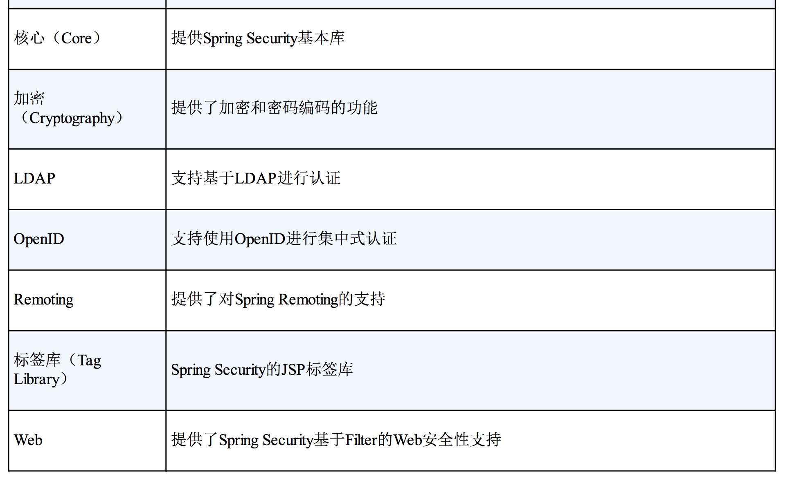 </div><br>

应用程序的类路径下至少要包含Core和Configuration这两个模块。Spring Security经常被用于保护Web应用，这显然也是Spittr应用的场景，所以我们还需要添加Web模块。同时我们还会用到Spring Security的JSP标签库，所以我们需要将这个模块也添加进来。

现在，我们已经为在Spring Security中进行安全性配置做好了准备。让我们看看如何使用Spring Security的XML命名空间。

### 9.1.2 过滤Web请求

Spring Security借助一系列Servlet Filter来提供各种安全性功能。你可能会想，这是否意味着我们需要在web.xml或WebApplicationInitializer中配置多个Filter呢？实际上，借助于Spring的小技巧，我们只需配置一个Filter就可以了。

DelegatingFilterProxy是一个特殊的Servlet Filter，它本身所做的工作并不多。只是将工作委托给一个javax.servlet.Filter实现类，这个实现类作为一个<bean>注册在Spring应用的上下文中，如图9.1所示。

<div align="center">  </div><br>

如果你喜欢在传统的web.xml中配置Servlet和Filter的话，可以使用<filter>元素，如下所示：

<div align="center">  </div><br>

在这里，最重要的是<filter-name>设置成了springSecurityFilterChain。这是因为我们马上就会将Spring Security配置在Web安全性之中，这里会有一个名为springSecurityFilterChain的Filter bean，DelegatingFilterProxy会将过滤逻辑委托给它。

如果你希望借助WebApplicationInitializer以Java的方式来配置DelegatingFilterProxy的话，那么我们所需要做的就是创建一个扩展的新类：

```
import org.springframework.security.web.context.AbstractSecurityWebApplicationInitializer;

public class SecurityWebInitializer extends AbstractSecurityWebApplicationInitializer {
}
```

AbstractSecurityWebApplicationInitializer实现了WebApplicationInitializer，因此Spring会发现它，并用它在Web容器中注册DelegatingFilterProxy。尽管我们可以重载它的appendFilters()或insertFilters()方法来注册自己选择的Filter，但是要注册DelegatingFilterProxy的话，我们并不需要重载任何方法。

不管我们通过web.xml还是通过AbstractSecurityWebApplicationInitializer的子类来配置DelegatingFilterProxy，它都会拦截发往应用中的请求，并将请求委托给ID为springSecurityFilterChain bean。

springSecurityFilterChain本身是另一个特殊的Filter，它也被称为**FilterChainProxy**。它可以链接任意一个或多个其他的Filter。Spring Security依赖一系列Servlet Filter来提供不同的安全特性。但是，你几乎不需要知道这些细节，因为你不需要显式声明springSecurityFilterChain以及它所链接在一起的其他Filter。当我们启用Web安全性的时候，会自动创建这些Filter。

- **FilterChainProxy**
- **FilterChain**

为了让Web安全性运行起来，我们创建一个最简单的安全性配置。

### 9.1.3 编写简单的安全性配置
在Spring Security的早期版本中（在其还被称为Acegi Security之时），为了在Web应用中启用简单的安全功能，我们需要编写上百行的XML配置。Spring Security 2.0提供了安全性相关的XML配置命名空间，让情况有了一些好转。

Spring 3.2引入了新的Java配置方案，完全不再需要通过XML来配置安全性功能了。如下的程序清单展现了Spring Security最简单的Java配置。

程序清单9.1 启用Web安全性功能的最简单配置

```
@Configuration
@EnableWebSecurity
public class SecurityConfig extends WebSecurityConfigurerAdapter {
}
```


顾名思义，@EnableWebSecurity注解将会启用Web安全功能。但它本身并没有什么用处，Spring Security必须配置在一个实现了WebSecurityConfigurer的bean中，或者（简单起见）扩展WebSecurityConfigurerAdapter。在Spring应用上下文中，任何实现了WebSecurityConfigurer的bean都可以用来配置Spring Security，但是最为简单的方式还是像程序清单9.1那样扩展WebSecurityConfigurer Adapter类。

@EnableWebSecurity可以启用任意Web应用的安全性功能，不过，如果你的应用碰巧是使用Spring MVC开发的，那么就应该考虑使用@EnableWebMvcSecurity替代它，如程序清单9.2所示。

程序清单9.2 为Spring MVC启用Web安全性功能的最简单配置

```
@Configuration
@EnableWebMvcSecurity
public class SecurityConfig extends WebSecurityConfigurerAdapter {
}
```

除了其他的内容以外，@EnableWebMvcSecurity注解还配置了一个Spring MVC参数解析解析器（argument resolver），这样的话处理器方法就能够通过带有@AuthenticationPrincipal注解的参数获得认证用户的principal（或username）。它同时还配置了一个bean，在使用Spring表单绑定标签库来定义表单时，这个bean会自动添加一个隐藏的跨站请求伪造（cross-site request forgery，CSRF）token输入域。

看起来似乎并没有做太多的事情，但程序清单9.1和9.2中的配置类会给应用产生很大的影响。其中任何一种配置都会将应用严格锁定，导致没有人能够进入该系统了！

尽管不是严格要求的，但我们可能希望指定Web安全的细节，这要通过重载WebSecurityConfigurerAdapter中的一个或多个方法来实现。我们可以通过重载WebSecurityConfigurerAdapter的三个configure()方法来配置Web安全性，这个过程中会使用传递进来的参数设置行为。表9.2描述了这三个方法。

<div align="center"> 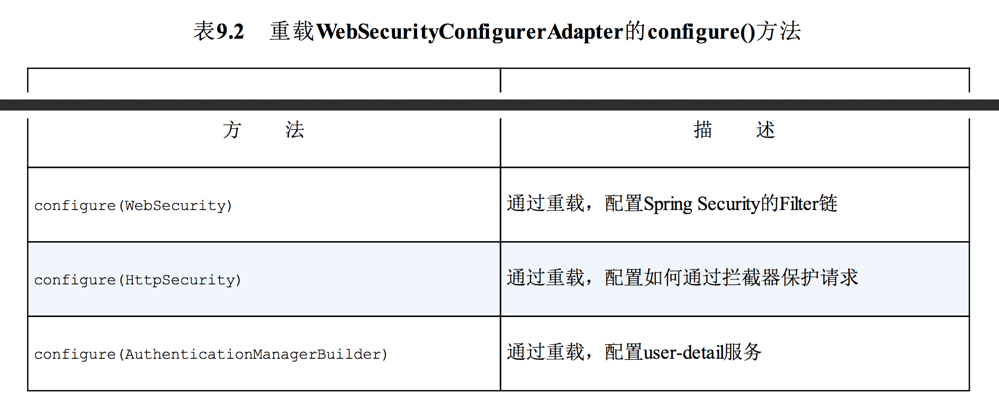 </div><br>

让我们重新看一下程序清单9.2，可以看到它没有重写上述三个configure()方法中的任何一个，这就说明了为什么应用现在是被锁定的。尽管对于我们的需求来讲默认的Filter链是不错的，但是默认的configure(HttpSecurity)实际上等同于如下所示：

```
protected void configure(HttpSecurity http) throws Exception {
        http
                .authorizeRequests()
                .anyRequest().authenticated()
                .and()
                .formLogin().and()
                .httpBasic();
    }
```

这个简单的默认配置指定了该如何保护HTTP请求，以及客户端认证用户的方案。通过调用authorizeRequests()和anyRequest().authenticated()就会要求所有进入应用的HTTP请求都要进行认证。它也配置Spring Security支持基于表单的登录以及HTTP Basic方式的认证。

同时，因为我们没有重载configure(AuthenticationManagerBuilder)方法，所以没有用户存储支撑认证过程。没有用户存储，实际上就等于没有用户。所以，在这里所有的请求都需要认证，但是没有人能够登录成功。

为了让Spring Security满足我们应用的需求，还需要再添加一点配置。具体来讲，我们需要：

- 配置用户存储；
- 指定哪些请求需要认证，哪些请求不需要认证，以及所需要的权限；
- 提供一个自定义的登录页面，替代原来简单的默认登录页。

除了Spring Security的这些功能，我们可能还希望基于安全限制，有选择性地在Web视图上显示特定的内容。

但首先，我们看一下如何在认证的过程中配置访问用户数据的服务。

## 9.2 选择查询用户详细信息的服务

假如你计划去一个独家经营的饭店享受一顿晚餐，当然，你会提前几周预订，保证到时候能有一个位置。当到达饭店的时候，你会告诉服务员你的名字。但令人遗憾的是，里面并没有你的预订记录。美好的夜晚眼看就要泡汤了。但是没有人会如此轻易地放弃，你会要求服务员再次确认预订名单。此时，事情变得有些怪异了。

服务员说没有预订名单。你的名字不在名单上——名单上没有任何人——因为根本就不存在这么个名单。这就解释了为什么位置是空的，但我们却进不去。几周后，我们也就明白这家饭店为何最终会关门大吉，被一家墨西哥美食店所代替。

这也是此时我们应用程序的现状。我们没有办法进入应用，即便用户认为他们应该能够登录进去，但实际上却没有允许他们访问应用的数据记录。因为缺少用户存储，现在的应用程序太封闭了，变得不可用。

我们所需要的是用户存储，也就是用户名、密码以及其他信息存储的地方，在进行认证决策的时候，会对其进行检索。

好消息是，Spring Security非常灵活，能够基于各种数据存储来认证用户。它内置了多种常见的用户存储场景，如内存、关系型数据库以及LDAP。但我们也可以编写并插入自定义的用户存储实现。

借助Spring Security的Java配置，我们能够很容易地配置一个或多个数据存储方案。那我们就从最简单的开始：在内存中维护用户存储。

### 9.2.1 使用基于内存的用户存储
因为我们的安全配置类扩展了WebSecurityConfigurerAdapter，因此配置用户存储的最简单方式就是重载configure()方法，并以AuthenticationManagerBuilder作为传入参数。AuthenticationManagerBuilder有多个方法可以用来配置Spring Security对认证的支持。通过inMemoryAuthentication()方法，我们可以启用、配置并任意填充基于内存的用户存储。

例如，在如程序清单9.3中，SecurityConfig重载了configure()方法，并使用两个用户来配置内存用户存储。

程序清单9.3 配置Spring Security使用内存用户存储

```
 @Override
    protected void configure(AuthenticationManagerBuilder auth) throws Exception {
        auth
                // 启用内存用户存储
                .inMemoryAuthentication()
                .withUser("user").password("password").roles("USER").and()
                .withUser("admin").password("password2").roles("USER", "ADMIN");
    }
```

我们可以看到，configure()方法中的AuthenticationManagerBuilder使用构造者风格的接口来构建认证配置。通过简单地调用inMemoryAuthentication()就能启用内存用户存储。但是我们还需要有一些用户，否则的话，这和没有用户并没有什么区别。

因此，我们需要调用withUser()方法为内存用户存储添加新的用户，这个方法的参数是username。withUser()方法返回的是UserDetailsManagerConfigurer.UserDetailsBuilder，这个对象提供了多个进一步配置用户的方法，包括设置用户密码的password()方法以及为给定用户授予一个或多个角色权限的roles()方法。

在程序清单9.3中，我们添加了两个用户，“user”和“admin”，密码均为“password”。“user”用户具有USER角色，而“admin”用户具有ADMIN和USER两个角色。我们可以看到，and()方法能够将多个用户的配置连接起来。除了password()、roles()和and()方法以外，还有其他的几个方法可以用来配置内存用户存储中的用户信息。表9.3描述了UserDetailsManagerConfigurer.UserDetailsBuilder对象所有可用的方法。

需要注意的是，roles()方法是authorities()方法的简写形式。roles()方法所给定的值都会添加一个“ROLE_”前缀，并将其作为权限授予给用户。实际上，如下的用户配置与程序清单9.3是等价的：

```
        auth
                // 启用内存用户存储
                .inMemoryAuthentication()
                .withUser("admin").password("password2").roles("USER", "ADMIN").and()
                .withUser("guest").password("password3").authorities("USER");
```


表9.3 配置用户详细信息的方法


<div align="center"> 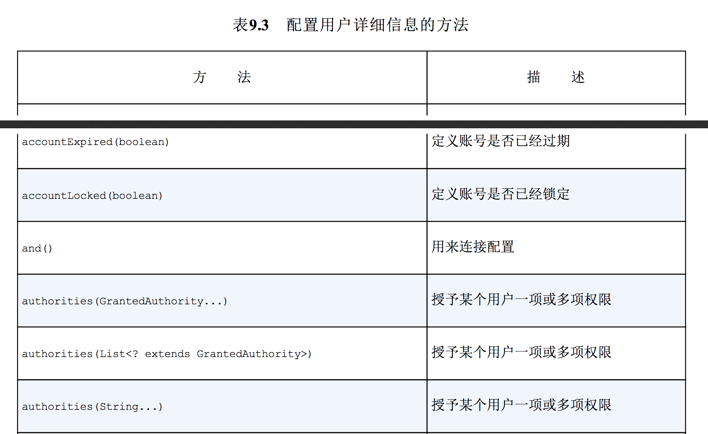 </div><br>
<div align="center">  </div><br>

对于调试和开发人员测试来讲，基于内存的用户存储是很有用的，但是对于生产级别的应用来讲，这就不是最理想的可选方案了。为了用于生产环境，通常最好将用户数据保存在某种类型的数据库之中。

### 9.2.2 基于数据库表进行认证
用户数据通常会存储在关系型数据库中，并通过JDBC进行访问。为了配置Spring Security使用以JDBC为支撑的用户存储，我们可以使用jdbcAuthentication()方法，所需的最少配置如下所示：

```
  @Autowired
    private DataSource dataSource;

    @Override
    protected void configure(AuthenticationManagerBuilder auth) throws Exception {
        auth
                .jdbcAuthentication()
                .dataSource(dataSource);
    }
```

我们必须要配置的只是一个DataSource，这样的话，就能访问关系型数据库了。在这里，DataSource是通过自动装配的技巧得到的。

#### 重写默认的用户查询功能
尽管默认的最少配置能够让一切运转起来，但是它对我们的数据库模式有一些要求。它预期存在某些存储用户数据的表。更具体来说，下面的代码片段来源于Spring Security内部，这块代码展现了当查找用户信息时所执行的SQL查询语句：

<div align="center"> 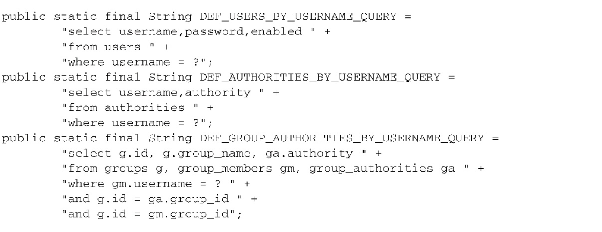 </div><br>

在第一个查询中，我们获取了用户的用户名、密码以及是否启用的信息，这些信息会用来进行用户认证。接下来的查询查找了用户所授予的权限，用来进行鉴权，最后一个查询中，查找了用户作为群组的成员所授予的权限。

如果你能够在数据库中定义和填充满足这些查询的表，那么基本上就不需要你再做什么额外的事情了。但是，也有可能你的数据库与上面所述并不一致，那么你就会希望在查询上有更多的控制权。如果是这样的话，我们可以按照如下的方式配置自己的查询：

```
 @Autowired
    private DataSource dataSource;

    @Override
    protected void configure(AuthenticationManagerBuilder auth) throws Exception {
        auth
                .jdbcAuthentication()
                .dataSource(dataSource)
                .usersByUsernameQuery("select username,password,true from Spitter where username=?")
                .authoritiesByUsernameQuery("select username,'ROLE_USER' from Spitter where username=?");
    }
```

在本例中，我们只重写了认证和基本权限的查询语句，但是通过调用group-AuthoritiesByUsername()方法，我们也能够将群组权限重写为自定义的查询语句。

将默认的SQL查询替换为自定义的设计时，很重要的一点就是要遵循查询的基本协议。所有查询都将用户名作为唯一的参数。认证查询会选取用户名、密码以及启用状态信息。权限查询会选取零行或多行包含该用户名及其权限信息的数据。群组权限查询会选取零行或多行数据，每行数据中都会包含群组ID、群组名称以及权限。

#### 使用转码后的密码
看一下上面的认证查询，它会预期用户密码存储在了数据库之中。这里唯一的问题在于如果密码明文存储的话，会很容易受到黑客的窃取。但是，如果数据库中的密码进行了转码的话，那么认证就会失败，因为它与用户提交的明文密码并不匹配。

为了解决这个问题，我们需要借助`passwordEncoder()`方法指定一个**密码转码器（encoder）**：

```
@Override
    protected void configure(AuthenticationManagerBuilder auth) throws Exception {
        auth
                .jdbcAuthentication()
                .dataSource(dataSource)
                .usersByUsernameQuery("select username,password,true from Spitter where username=?")
                .authoritiesByUsernameQuery("select username,'ROLE_USER' from Spitter where username=?")
                .passwordEncoder(new StandardPasswordEncoder("53cr3t"))
        ;
    }
```

- **密码转码器（encoder）**

passwordEncoder()方法可以接受Spring Security中PasswordEncoder接口的任意实现。Spring Security的加密模块包括了三个这样的实现：BCryptPasswordEncoder、NoOpPasswordEncoder和StandardPasswordEncoder。

上述的代码中使用了StandardPasswordEncoder，但是如果内置的实现无法满足需求时，你可以提供自定义的实现。PasswordEncoder接口非常简单：

```
public interface PasswordEncoder {

	String encode(CharSequence rawPassword);

	boolean matches(CharSequence rawPassword, String encodedPassword);
}

```

- 密码加密策略: **不管你使用哪一个密码转码器，都需要理解的一点是，数据库中的密码是永远不会解码的。所采取的策略与之相反，用户在登录时输入的密码会按照相同的算法进行转码，然后再与数据库中已经转码过的密码进行对比。这个对比是在PasswordEncoder的matches()方法中进行的。**

### 9.2.3 基于LDAP进行认证
> 轻型目录访问协议（英文：Lightweight Directory Access Protocol，缩写：LDAP，/ˈɛldæp/）是一个开放的，中立的，工业标准的应用协议，通过IP协议提供访问控制和维护分布式信息的目录信息

todo

### 9.2.4 配置自定义的用户服务
假设我们需要认证的用户存储在非关系型数据库中，如Mongo或Neo4j，在这种情况下，我们需要提供一个自定义的UserDetailsService接口实现。UserDetailsService接口非常简单：

```
public interface UserDetailsService {

	UserDetails loadUserByUsername(String username) throws UsernameNotFoundException;
}
```

我们所需要做的就是实现loadUserByUsername()方法，根据给定的用户名来查找用户。loadUserByUsername()方法会返回代表给定用户的UserDetails对象。如下的程序清单展现了一个UserDetailsService的实现，它会从给定的SpitterRepository实现中查找用户。

程序清单9.4 从SpitterRepository中查找UserDetails对象

```
@Service
public class SpitterUserService implements UserDetailsService {

    /**
     * 注入 SpitterRepository
     */
    @Autowired
    private SpitterRepository spitterRepository;

    @Override
    public UserDetails loadUserByUsername(String username) throws UsernameNotFoundException {
        // 查找 Spitter
        Spitter spitter = spitterRepository.findByUsername(username);
        if (spitter != null) {
            // 创建权限列表
            List<GrantedAuthority> authorities = new ArrayList<>();
            authorities.add(new SimpleGrantedAuthority("ROLE_SPITTER"));
            // 返回 User
            return new User(spitter.getUsername(), spitter.getPassword(), authorities);
        }

        throw new UsernameNotFoundException("User '" + username + " ' not found.");
    }
}
```

SpitterUserService有意思的地方在于它并不知道用户数据存储在什么地方。设置进来的SpitterRepository能够从关系型数据库、文档数据库或图数据中查找Spitter对象，甚至可以伪造一个。SpitterUserService不知道也不会关心底层所使用的数据存储。它只是获得Spitter对象，并使用它来创建User对象。（User是UserDetails的具体实现。）

为了使用SpitterUserService来认证用户，我们可以通过userDetailsService()方法将其设置到安全配置中：

```
@Autowired
    private SpitterRepository spitterRepository;

    @Override
    protected void configure(AuthenticationManagerBuilder auth) throws Exception {
        auth
            .userDetailsService(new SpitterUserService(spitterRepository))
                ;
    }
```

userDetailsService()方法（类似于jdbcAuthentication()、ldapAuthentication以及inMemoryAuthentication()）会配置一个用户存储。不过，这里所使用的不是Spring所提供的用户存储，而是使用UserDetailsService的实现。

另外一种值得考虑的方案就是修改Spitter，让其实现UserDetails。这样的话，loadUserByUsername()就能直接返回Spitter对象了，而不必再将它的值复制到User对象中。

## 9.3 拦截请求
在前面的9.1.3小节中，我们看到一个特别简单的Spring Security配置，在这个默认的配置中，会要求所有请求都要经过认证。有些人可能会说，过多的安全性总比安全性太少要好。但也有一种说法就是要适量地应用安全性。

在任何应用中，并不是所有的请求都需要同等程度地保护。有些请求需要认证，而另一些可能并不需要。有些请求可能只有具备特定权限的用户才能访问，没有这些权限的用户会无法访问。

例如，考虑Spittr应用的请求。首页当然是公开的，不需要进行保护。类似地，因为所有的Spittle都是公开的，所以展现Spittle的页面不需要安全性。但是，创建Spittle的请求只有认证用户才能执行。同样，尽管用户基本信息页面是公开的，不需要认证，但是，如果要处理“spittersme”请求，并展现当前用户的基本信息时，那么就需要进行认证，从而确定要展现谁的信息。

对每个请求进行细粒度安全性控制的关键在于重载configure(HttpSecurity)方法。如下的代码片段展现了重载的configure(HttpSecurity)方法，它为不同的URL路径有选择地应用安全性：

```
 @Override
    protected void configure(HttpSecurity http) throws Exception {
        http
                .authorizeRequests()
                .antMatchers("/").authenticated()
                .antMatchers("/spitter/me").authenticated()
                .antMatchers(HttpMethod.POST, "/spittles").authenticated()
                .anyRequest().permitAll();
    }
```

configure()方法中得到的HttpSecurity对象可以在多个方面配置HTTP的安全性。在这里，我们首先调用authorizeRequests()，然后调用该方法所返回的对象的方法来配置请求级别的安全性细节。其中，第一次调用antMatchers()指定了对“spittersme”路径的请求需要进行认证。第二次调用antMatchers()更为具体，说明对“/spittles”路径的HTTPPOST请求必须要经过认证。最后对anyRequests()的调用中，说明其他所有的请求都是允许的，不需要认证和任何的权限。

antMatchers()方法中设定的路径支持Ant风格的通配符。在这里我们并没有这样使用，但是也可以使用通配符来指定路径，如下所示：

	 .antMatchers("/spitter/me").authenticated()

我们也可以在一个对antMatchers()方法的调用中指定多个路径：

	 .antMatchers("/spitter/me"，"/spitter/mine").authenticated()
	 
antMatchers()方法所使用的路径可能会包括Ant风格的通配符，而regexMatchers()方法则能够接受正则表达式来定义请求路径。例如，如下代码片段所使用的正则表达式与“spitters**”（Ant风格）功能是相同的：

	 .regexMatchers("/spitter/me"，"/spitter/mine").authenticated()

除了路径选择，我们还通过authenticated()和permitAll()来定义该如何保护路径。authenticated()要求在执行该请求时，必须已经登录了应用。如果用户没有认证的话，Spring Security的Filter将会捕获该请求，并将用户重定向到应用的登录页面。同时，permitAll()方法允许请求没有任何的安全限制。

除了authenticated()和permitAll()以外，还有其他的一些方法能够用来定义该如何保护请求。表9.4描述了所有可用的方案。

表9.4 用来定义如何保护路径的配置方法

<div align="center">  </div><br>
<div align="center">  </div><br>

通过使用表9.4中的方法，我们所配置的安全性能够不仅仅限于认证用户。例如，我们可以修改之前的configure()方法，要求用户不仅需要认证，还要具备ROLE_SPITTER权限：

```
 @Override
    protected void configure(HttpSecurity http) throws Exception {
        http
                .authorizeRequests()
                .antMatchers("/").authenticated().hasAuthority("ROLE_SOITTER")
                .antMatchers("/spitter/me").authenticated().hasAuthority("ROLE_SOITTER")
                .anyRequest().permitAll();
    }
```

作为替代方案，我们还可以使用hasRole()方法，它会自动使用“ROLE_”前缀：

```
 @Override
    protected void configure(HttpSecurity http) throws Exception {
        http
                .authorizeRequests()
                .antMatchers("/").authenticated().hasRole("SPITTER")
                .antMatchers("/spitter/me").authenticated(). hasRole("SPITTER")
                .anyRequest().permitAll();
    }
```

我们可以将任意数量的antMatchers()、regexMatchers()和anyRequest()连接起来，以满足Web应用安全规则的需要。但是，我们需要知道，这些规则会按照给定的顺序发挥作用。所以，很重要的一点就是将最为具体的请求路径放在前面，而最不具体的路径（如anyRequest()）放在最后面。如果不这样做的话，那不具体的路径配置将会覆盖掉更为具体的路径配置。

### 9.3.1 使用Spring表达式进行安全保护
表9.4中的大多数方法都是一维的，也就是说我们可以使用hasRole()限制某个特定的角色，但是我们不能在相同的路径上同时通过hasIpAddress()限制特定的IP地址。

另外，除了表9.4定义的方法以外，我们没有办法使用其他的条件。如果我们希望限制某个角色只能在星期二进行访问的话，该怎么办呢？

在第3章中，我们看到了如何使用Spring表达式语言（Spring Expression Language，SpEL），将其作为装配bean属性的高级技术。借助access()方法，我们也可以将SpEL作为声明访问限制的一种方式。例如，如下就是使用SpEL表达式来声明具有`“ROLE_SPITTER”`角色才能访问“spitterme”URL：

	.antMatchers("/spitter/me").access("hasRole('SPITTER')")

这个对“spitterme”的安全限制与开始时的效果是等价的，只不过这里使用了SpEL来描述安全规则。如果当前用户被授予了给定角色的话，那hasRole()表达式的计算结果就为true。

让SpEL更强大的原因在于，hasRole()仅是Spring支持的安全相关表达式中的一种，表9.5列出了Spring Security支持的所有SpEL表达式。

表9.5 Spring Security通过一些安全性相关的表达式扩展了Spring表达式语言

<div align="center"> 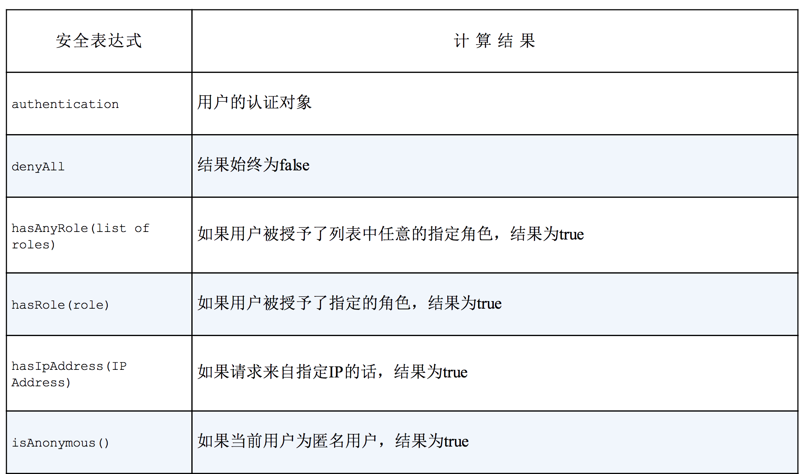 </div><br>
<div align="center">  </div><br>

在掌握了Spring Security的SpEL表达式后，我们就能够不再局限于基于用户的权限进行访问限制了。例如，如果你想限制“spitterme” URL的访问，不仅需要`ROLE_SPITTER`，还需要来自指定的IP地址，那么我们可以按照如下的方式调用access()方法：

	.antMatchers("/spitter/me").access("hasRole('SPITTER') and hasIpaddress('192.168.1.1') ")

我们可以使用SpEL实现各种各样的安全性限制。我敢打赌，你已经在想象基于SpEL所能实现的那些有趣的安全性限制了。

但现在，让我们看一下Spring Security拦截请求的另外一种方式：强制通道的安全性。

### 9.3.2 强制通道的安全性
使用HTTP提交数据是一件具有风险的事情。如果使用HTTP发送无关紧要的信息，这可能不是什么大问题。但是如果你通过HTTP发送诸如密码和信用卡号这样的敏感信息的话，那你就是在找麻烦了。通过HTTP发送的数据没有经过加密，黑客就有机会拦截请求并且能够看到他们想看的数据。这就是为什么敏感信息要通过HTTPS来加密发送的原因。

使用HTTPS似乎很简单。你要做的事情只是在URL中的HTTP后加上一个字母“s”就可以了。是这样吗？

这是真的，但这是把使用HTTPS通道的责任放在了错误的地方。通过添加“s”我们就能很容易地实现页面的安全性，但是忘记添加“s”同样也是很容易出现的。如果我们的应用中有多个链接需要HTTPS，估计在其中的一两个上忘记添加“s”的概率还是很高的。

另一方面，你可能还会在原本并不需要HTTPS的地方，误用HTTPS。

传递到configure()方法中的HttpSecurity对象，除了具有authorizeRequests()方法以外，还有一个requiresChannel()方法，借助这个方法能够为各种URL模式声明所要求的通道。

作为示例，可以参考Spittr应用的注册表单。尽管Spittr应用不需要信用卡号、社会保障号或其他特别敏感的信息，但用户有可能仍然希望信息是私密的。为了保证注册表单的数据通过HTTPS传送，我们可以在配置中添加requiresChannel()方法，如下所示：

程序清单9.5requiresChannel()方法会为选定的URL强制使用HTTPS

```
 @Override
    protected void configure(HttpSecurity http) throws Exception {
        http
                .formLogin()
                .loginPage("/login")
                .and()
                // 需要 HTTPS
                .requiresChannel()
                .antMatchers("/spitter/form").requiresSecure();
    }
```

不论何时，只要是对“spitterform”的请求，Spring Security都视为需要安全通道（通过调用requiresChannel()确定的）并自动将请求重定向到HTTPS上。

与之相反，有些页面并不需要通过HTTPS传送。例如，首页不包含任何敏感信息，因此并不需要通过HTTPS传送。我们可以使用requiresInsecure()代替requiresSecure()方法，将首页声明为始终通过HTTP传送：

	.antMatchers("/").requireInecure();

如果通过HTTPS发送了对“/”的请求，Spring Security将会把请求重定向到不安全的HTTP通道上。

在强制要求通道时，路径的选取方案与authorizeRequests()是相同的。在程序清单9.5中，使用了antMatches()，但我们也可以使用regexMatchers()方法，通过正则表达式选取路径模式。

### 9.3.3 防止跨站请求伪造
我们可以回忆一下，当一个POST请求提交到“/spittles”上时，SpittleController将会为用户创建一个新的Spittle对象。但是，如果这个POST请求来源于其他站点的话，会怎么样呢？如果在其他站点提交如下表单，这个POST请求会造成什么样的结果呢？

<div align="center"> 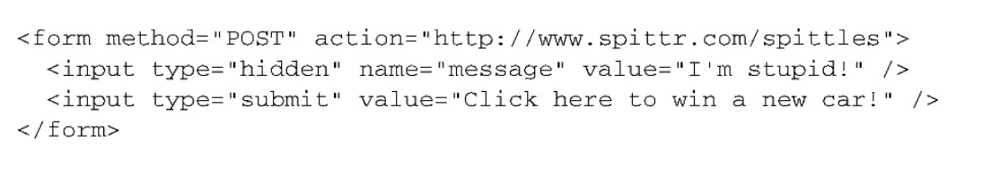 </div><br>

假设你禁不住获得一辆新汽车的诱惑，点击了按钮——那么你将会提交表单到如下地址http://www.spittr.com/spittles。如果你已经登录到了spittr.com，那么这就会广播一条消息，让每个人都知道你做了一件蠢事。

这是**跨站请求伪造（cross-site request forgery，CSRF）**的一个简单样例。简单来讲，如果一个站点欺骗用户提交请求到其他服务器的话，就会发生CSRF攻击，这可能会带来消极的后果。尽管提交“I’m stupid!”这样的信息到微博站点算不上什么CSRF攻击的最糟糕场景，但是你可以很容易想到更为严重的攻击情景，它可能会对你的银行账号执行难以预期的操作。

从Spring Security 3.2开始，默认就会启用CSRF防护。实际上，除非你采取行为处理CSRF防护或者将这个功能禁用，否则的话，在应用中提交表单时，你可能会遇到问题。

Spring Security通过一个**同步token**的方式来实现CSRF防护的功能。它将会拦截状态变化的请求（例如，非GET、HEAD、OPTIONS和TRACE的请求）并检查CSRF token。如果请求中不包含CSRF token的话，或者token不能与服务器端的token相匹配，请求将会失败，并抛出CsrfException异常。

这意味着在你的应用中，所有的表单必须在一个“_csrf”域中提交token，而且这个token必须要与服务器端计算并存储的token一致，这样的话当表单提交的时候，才能进行匹配。

好消息是，Spring Security已经简化了将token放到请求的属性中这一任务。如果你使用Thymeleaf作为页面模板的话，只要<form>标签的action属性添加了Thymeleaf命名空间前缀，那么就会自动生成一个“_csrf”隐藏域：

<div align="center">  </div><br>

如果使用JSP作为页面模板的话，我们要做的事情非常类似：

<div align="center">  </div><br>

更好的功能是，如果使用Spring的表单绑定标签的话，<sf:form>标签会自动为我们添加隐藏的CSRF token标签。

处理CSRF的另外一种方式就是根本不去处理它。我们可以在配置中通过调用csrf().disable()禁用Spring Security的CSRF防护功能，如下所示：

程序清单9.6 我们可以禁用Spring Security的CSRF防护功能

```
    @Override
    protected void configure(HttpSecurity http) throws Exception {
        http
                // 禁用 CSRF 防护功能
                .csrf().disable()    
        }
```

需要提醒的是，禁用CSRF防护功能通常来讲并不是一个好主意。如果这样做的话，那么应用就会面临CSRF攻击的风险。只有在深思熟虑之后，才能使用程序清单9.6中的配置。

我们已经配置好了用户存储，也配置好了使用Spring Security来拦截请求，那么接下来就该提示用户输入凭证了。

## 9.4 认证用户
如果你使用程序清单9.1中最简单的Spring Security配置的话，那么就能无偿地得到一个登录页。实际上，在重写configure(HttpSecurity)之前，我们都能使用一个简单却功能完备的登录页。但是，一旦重写了configure(HttpSecurity)方法，就失去了这个简单的登录页面。

不过，把这个功能找回来也很容易。我们所需要做的就是在configure(HttpSecurity)方法中，调用formLogin()，如下面的程序清单所示。

请注意，和前面一样，这里调用and()方法来将不同的配置指令连接在一起。

如果我们访问应用的“/login”链接或者导航到需要认证的页面，那么将会在浏览器中展现登录页面。如图9.2所示，在审美上它没有什么令人兴奋的，但是它却能实现所需的功能。

程序清单9.7formLogin()方法启用了基本的登录页功能

<div align="center"> 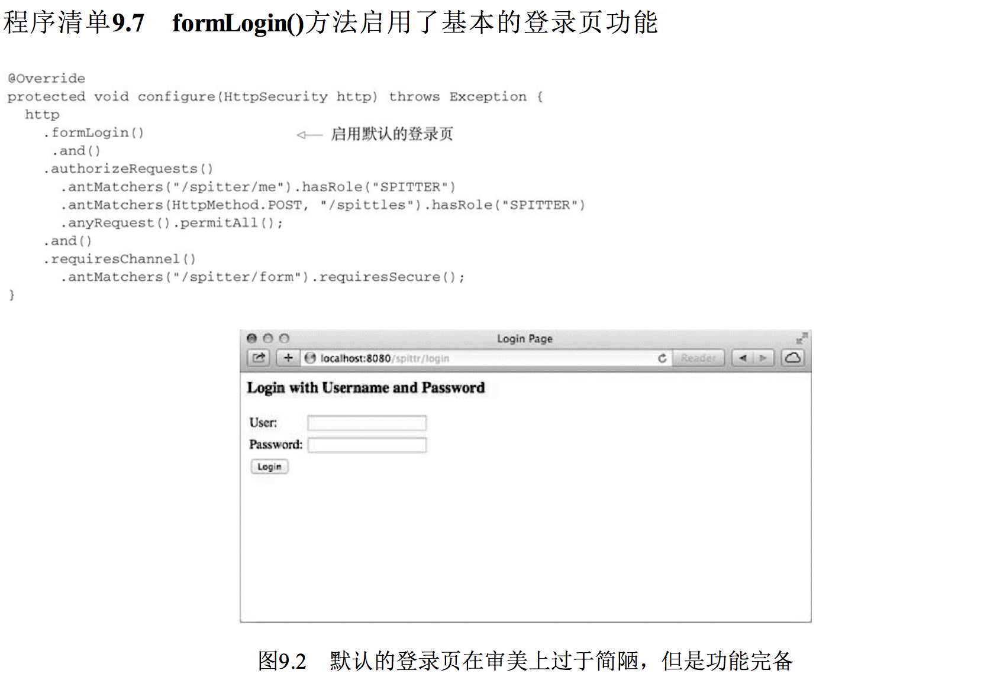 </div><br>

我敢打赌，你肯定希望在自己的应用程序中能有一个比默认登录页更漂亮的登录页面。如果这个普通的登录页面破坏了我们原本精心设计的漂亮站点，那真的是件很令人遗憾的事情。没问题！接下来，我们就看一下如何为应用添加自定义的登录页面。

### 9.4.1 添加自定义的登录页
创建自定义登录页的第一步就是了解登录表单中都需要些什么。只需看一下默认登录页面的HTML源码，我们就能了解需要些什么：

<div align="center"> 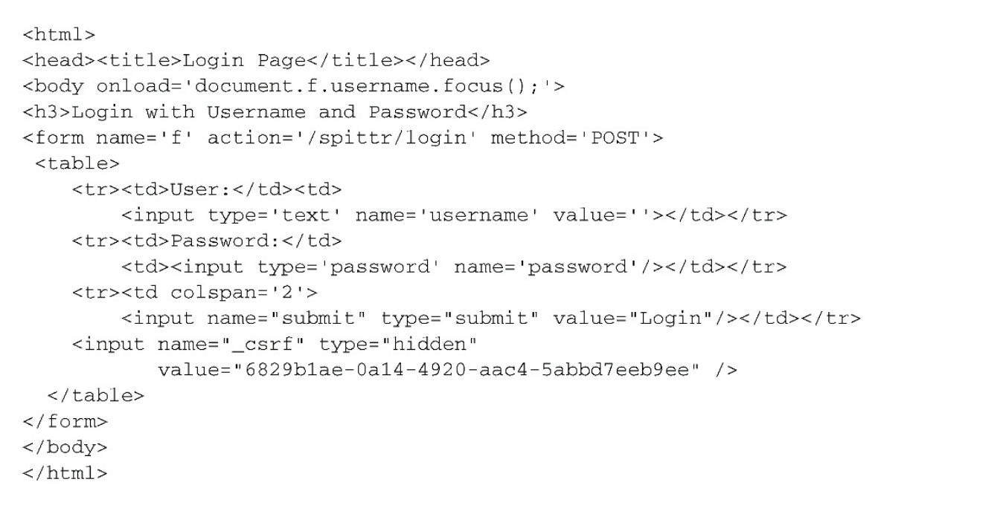 </div><br>

需要注意的一个关键点是<form>提交到了什么地方。同时还需要注意username和password输入域，在你的登录页中，需要同样的输入域。最后，假设没有禁用CSRF的话，还需要保证包含了值为CSRF token的“_csrf”输入域。

如下程序清单所展现的Thymeleaf模板提供了一个与Spittr应用风格一致的登录页。

程序清单9.8 为Spittr应用编写的自定义登录页（以Thymeleaf模板的形式）

<div align="center"> 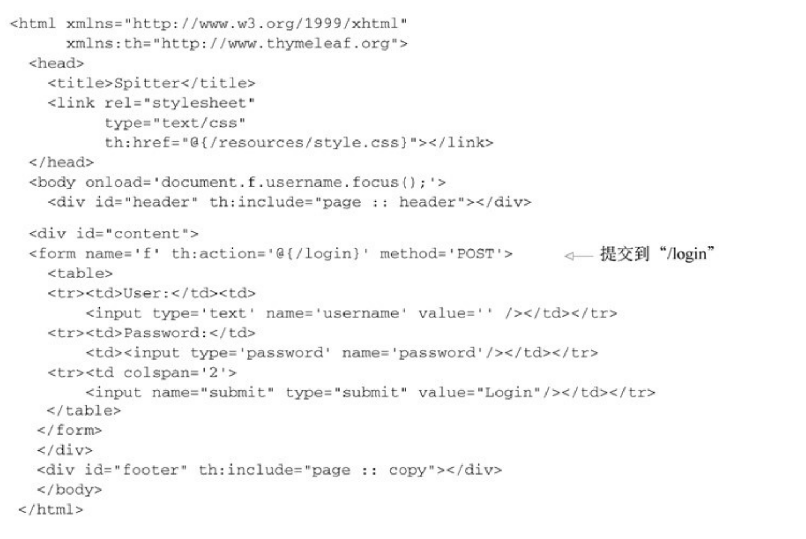 </div><br>

需要注意的是，在Thymeleaf模板中，包含了username和password输入域，就像默认的登录页一样，它也提交到了相对于上下文的“/login”页面上。因为这是一个Thymeleaf模板，因此隐藏的“_csrf”域将会自动添加到表单中。

### 9.4.2 启用HTTP Basic认证
对于应用程序的人类用户来说，基于表单的认证是比较理想的。但是在第16章中，将会看到如何将我们Web应用的页面转化为RESTful API。当应用程序的使用者是另外一个应用程序的话，使用表单来提示登录的方式就不太适合了。

HTTP Basic认证（HTTP Basic Authentication）会直接通过HTTP请求本身，对要访问应用程序的用户进行认证。你可能在以前见过HTTP Basic认证。当在Web浏览器中使用时，它将向用户弹出一个简单的模态对话框。

但这只是Web浏览器的显示方式。本质上，这是一个HTTP 401响应，表明必须要在请求中包含一个用户名和密码。在REST客户端向它使用的服务进行认证的场景中，这种方式比较适合。

如果要启用HTTP Basic认证的话，只需在configure()方法所传入的HttpSecurity对象上调用httpBasic()即可。另外，还可以通过调用realmName()方法指定域。如下是在Spring Security中启用HTTP Basic认证的典型配置：

```
 @Override
    protected void configure(HttpSecurity http) throws Exception {
        http
                .formLogin()
                .loginPage("/login")
                .and()
                .httpBasic()
                .realmName("Spittr");
    }

```

注意，和前面一样，在configure()方法中，通过调用and()方法来将不同的配置指令连接在一起。

在httpBasic()方法中，并没有太多的可配置项，甚至不需要什么额外配置。HTTP Basic认证要么开启要么关闭。所以，与其进一步研究这个话题，还不如看看如何通过Remember-me功能实现用户的自动认证。

### 9.4.3 启用Remember-me功能
对于应用程序来讲，能够对用户进行认证是非常重要的。但是站在用户的角度来讲，如果应用程序不用每次都提示他们登录是更好的。这就是为什么许多站点提供了Remember-me功能，你只要登录过一次，应用就会记住你，当再次回到应用的时候你就不需要登录了。

Spring Security使得为应用添加Remember-me功能变得非常容易。为了启用这项功能，只需在configure()方法所传入的HttpSecurity对象上调用rememberMe()即可。

```
@Override
    protected void configure(HttpSecurity http) throws Exception {
        http
                .formLogin()
                .loginPage("/login")
                .and()
                .rememberMe()
                .tokenValiditySeconds(2419200)
                .key("spittrKey");
    }
```

在这里，我们通过一点特殊的配置就可以启用Remember-me功能。默认情况下，这个功能是通过在cookie中存储一个token完成的，这个token最多两周内有效。但是，在这里，我们指定这个token最多四周内有效（2,419,200秒）。

**存储在cookie中的token包含用户名、密码、过期时间和一个私钥——在写入cookie前都进行了MD5哈希。**默认情况下，私钥的名为SpringSecured，但在这里我们将其设置为spitterKey，使它专门用于Spittr应用。

如此简单。既然Remember-me功能已经启用，我们需要有一种方式来让用户表明他们希望应用程序能够记住他们。为了实现这一点，登录请求必须包含一个名为remember-me的参数。在登录表单中，增加一个简单复选框就可以完成这件事情：

<div align="center"> 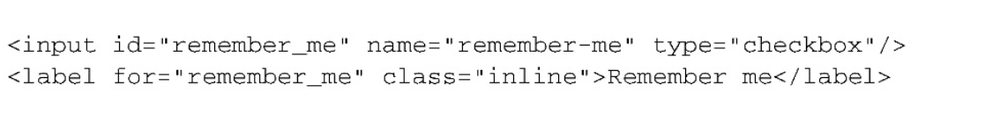 </div><br>

在应用中，与登录同等重要的功能就是退出。如果你启用Remember-me功能的话，更是如此，否则的话，用户将永远登录在这个系统中。我们下面将看一下如何添加退 出功能。

### 9.4.4 退出
其实，按照我们的配置，退出功能已经启用了，不需要再做其他的配置了。我们需要的只是一个使用该功能的链接。

退出功能是通过Servlet容器中的Filter实现的（默认情况下），这个Filter会拦截针对“/logout”的请求。因此，为应用添加退出功能只需添加如下的链接即可（如下以Thymeleaf代码片段的形式进行了展现）：

	<a th:href:"@{/logout}">Logout</a>

当用户点击这个链接的时候，会发起对“/logout”的请求，这个请求会被Spring Security的LogoutFilter所处理。用户会退出应用，所有的Remember-me token都会被清除掉。在退出完成后，用户浏览器将会重定向到“/login?logout”，从而允许用户进行再次登录。

如果你希望用户被重定向到其他的页面，如应用的首页，那么可以在configure()中进行如下的配置：

```
 @Override
    protected void configure(HttpSecurity http) throws Exception {
        http
                .formLogin()
                .loginPage("/login")
                .and()
                .logout()
                .logoutSuccessUrl("/")
       }
```

在这里，和前面一样，通过add()连接起了对logout()的调用。logout()提供了配置退出行为的方法。在本例中，调用logoutSuccessUrl()表明在退出成功之后，浏览器需要重定向到“/”。

除了logoutSuccessUrl()方法以外，你可能还希望重写默认的LogoutFilter拦截路径。我们可以通过调用logoutUrl()方法实现这一功能：

	 .logout()
    // 指定重定向的页面
    .logoutSuccessUrl("/")
    .logoutUrl("/signout")

到目前为止，我们已经看到了如何在发起请求的时候保护Web应用。这假设安全性主要涉及阻止用户访问没有权限的URL。但是，如果我们能够不给用户显示其无权访问的连接，那么这也是一个很好的思路。接下来，我们将会看一下如何添加视图级别的安全性。

## 9.5 保护视图
为浏览器渲染HTML内容时，你可能希望视图中能够反映安全限制和相关的信息。一个简单的样例就是渲染用户的基本信息（比如显示“您已经以......身份登录”）。或者你想根据用户被授予了什么权限，有条件地渲染特定的视图元素。

在第6章，我们看到了在Spring MVC应用中渲染视图的两个最重要的可选方案：JSP和Thymeleaf。不管你使用哪种方案，都有办法在视图上实现安全性。Spring Security本身提供了一个JSP标签库，而Thymeleaf通过特定的方言实现了与Spring Security的集成。

让我们看一下如何将Spring Security用到视图中，就从Spring Security的JSP标签库开始吧。

### 9.5.1 使用Spring Security的JSP标签库
todo

### 9.5.2 使用Thymeleaf的Spring Security方言
与Spring Security的JSP标签库类似，Thymeleaf的安全方言提供了条件化渲染和显示认证细节的能力。表9.8列出了安全方言所提供的属性。

<div align="center"> 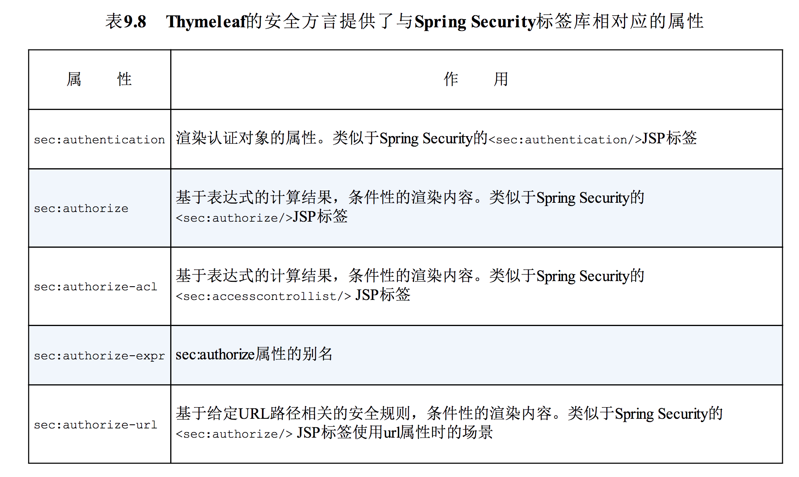 </div><br>

为了使用安全方言，我们需要确保Thymeleaf Extras Spring Security已经位于应用的类路径下。然后，还需要在配置中使用SpringTemplateEngine来注册SpringSecurityDialect。程序清单9.10所展现的@Bean方法声明了SpringTemplateEngine bean，其中就包含了SpringSecurityDialect。

程序清单9.10 注册Thymeleaf的Spring Security安全方言

```
@Bean
    public SpringTemplateEngine templateEngine(TemplateResolver templateResolver) {
        SpringTemplateEngine templateEngine = new SpringTemplateEngine();
        templateEngine.setTemplateResolver(templateResolver);
        // 注册方言
        templateEngine.addDialect(new SpringSecurityDialect());
        return templateEngine;
    }
```

安全方言注册完成之后，我们就可以在Thymeleaf模板中使用它的属性了。首先，需要在使用这些属性的模板中声明安全命名空间：

<div align="center">  </div><br>

在这里，标准的Thymeleaf方法依旧与之前一样，使用th前缀，安全方言则设置为使用sec前缀。

这样我们就能在任意合适的地方使用Thymeleaf属性了。比如，假设我们想要为认证用户渲染“Hello”文本。如下的Thymeleaf模板代码片段就能完成这项任务：

<div align="center">  </div><br>

sec:authorize属性会接受一个SpEL表达式。如果表达式的计算结果为true，那么元素的主体内容就会渲染。在本例中，表达式为isAuthenticated()，所以只有用户已经进行了认证，才会渲染<div>标签的主体内容。就这个标签的主体内容部分而言，它的功能是使用认证对象的name属性提示“Hello”文本。

你可能还记得，在Spring Security中，借助<sec:authorize>JSP标签的url属性能够基于给定URL的权限有条件地渲染内容。在Thymeleaf中，我们可以通过sec:authorize-url属性完成相同的功能。例如，如下Thymeleaf代码片段所实现的功能与之前<sec:authorize> JSP标签和url属性所实现的功能是相同的：

<div align="center"> 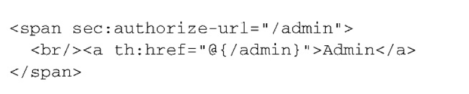 </div><br>

如果用户有权限访问“/admin”的话，那么到管理页面的链接就会渲染，否则的话，这个链接将不会渲染。

## 9.6 小结
对于许多应用而言，安全性都是非常重要的切面。Spring Security提供了一种简单、灵活且强大的机制来保护我们的应用程序。

借助于一系列Servlet Filter，Spring Security能够控制对Web资源的访问，包括Spring MVC控制器。借助于Spring Security的Java配置模型，我们不必直接处理Filter，能够非常简洁地声明Web安全性功能。

当认证用户时，Spring Security提供了多种选项。我们探讨了如何基于内存用户库、关系型数据库和LDAP目录服务器来配置认证功能。如果这些可选方案无法满足认证需求的话，我们还学习了如何创建和配置自定义的用户服务。

在前面的几章中，我们看到了如何将Spring运用到应用程序的前端。在接下来的章中，我们将会继续深入这个技术栈，学习Spring如何在后端发挥作用，下一章将会首先从Spring的JDBC抽象开始。
