# 第3部分 后端中的Spring
尽管用户看到的内容是由Web应用所提供的页面，但是在这背后，实际的工作是在后端服务器中发生的，在这里会处理和持久化数据。第3部分将会关注Spring如何帮助我们在后端处理数据。

多年以来，关系型数据库一直是企业级应用中的统治者。在第10章“通过Spring和JDBC征服数据库”中，我们将会看到如何使用Spring的JDBC抽象来查询关系型数据库，这要比原生的JDBC简单得多。

如果你不喜欢JDBC风格的话，在第11章“通过对象-关系映射持久化数据”中，将会展现如何与ORM框架进行集成，这些框架包括Hibernate以及其他的Java持久化API（Java PersistenceAPI，JPA）实现。除此之外，还将会看到如何发挥Spring Data JPA的魔力，在运行时自动生成Repository实现。

关系型数据库不一定是所有场景下的最佳选择，因此，第12章“使用NoSQL数据库”将会研究其他的Spring Data项目，它们能够持久化各种非关系型数据库中的数据，包括MongoDB、Neo4j和Redis。

第13章“缓存数据”为上述的持久化章提供了一个缓存层，如果数据已经可用的话，它会避免数据库操作，从而提升应用的性能。

与前端类似，安全性在后端也是一个很重要的方面。在第14章“保护方法应用”中，将会把Spring Security应用于后端，它会拦截方法的调用并确保调用者被授予了适当的权限。

## 第10章 通过Spring和JDBC征服数据库
本章内容：

- 定义Spring对数据访问的支持
- 配置数据库资源
- 使用Spring的JDBC模版

在掌握了Spring容器的核心知识之后，是时候将它在实际应用中进行使用了。数据持久化是一个非常不错的起点，因为几乎所有的企业级应用程序中都存在这样的需求。我们可能都处理过数据库访问功能，在实际的工作中也发现数据访问有一些不足之处。我们必须初始化数据访问框架、打开连接、处理各种异常和关闭连接。如果上述操作出现任何问题，都有可能损坏或删除珍贵的企业数据。如果你还未曾经历过因未妥善处理数据访问而带来的严重后果，那我要提醒你这绝对不是什么好事情。

做事要追求尽善尽美，所以我们选择了Spring。Spring自带了一组数据访问框架，集成了多种数据访问技术。不管你是直接通过JDBC还是像Hibernate这样的对象关系映射（object-relational mapping，ORM）框架实现数据持久化，Spring都能够帮你消除持久化代码中那些单调枯燥的数据访问逻辑。我们可以依赖Spring来处理底层的数据访问，这样就可以专注于应用程序中数据的管理了。

当开发Spittr应用的持久层的时候，会面临多种选择，我们可以使用JDBC、Hibernate、Java持久化API（Java Persistence API，JPA）或者其他任意的持久化框架。你可能还会考虑使用最近很流行的NoSQL数据库（其实我更喜欢将其称为无模式数据库）。

幸好，不管你选择哪种持久化方式，Spring都能够提供支持。在本章，我们主要关注于Spring对JDBC的支持。但首先，我们来熟悉一下Spring的持久化哲学，从而为后面打好基础。

## 10.1 Spring的数据访问哲学
从前面的几章可以看出，Spring的目标之一就是允许我们在开发应用程序时，能够遵循面向对象（OO）原则中的“针对接口编程”。Spring对数据访问的支持也不例外。

像很多应用程序一样，Spittr应用需要从某种类型的数据库中读取和写入数据。为了避免持久化的逻辑分散到应用的各个组件中，最好将数据访问的功能放到一个或多个专注于此项任务的组件中。这样的组件通常称为**数据访问对象（data access object，DAO）或Repository**。

- **数据访问对象（data access object，DAO）或Repository**

为了避免应用与特定的数据访问策略耦合在一起，编写良好的Repository应该以接口的方式暴露功能。图10.1展现了设计数据访问层的合理方式。

<div align="center"> 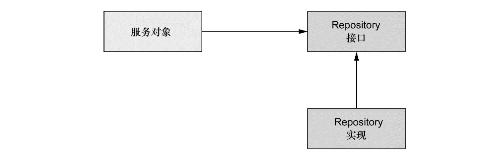 </div><br>

图10.1 服务对象本身并不会处理数据访问，而是将数据访问委托给Repository。Repository接口确保其与服务对象的松耦合

如图所示，服务对象通过接口来访问Repository。这样做会有几个好处。第一，它使得服务对象易于测试，因为它们不再与特定的数据访问实现绑定在一起。实际上，你可以为这些数据访问接口创建mock实现，这样无需连接数据库就能测试服务对象，而且会显著提升单元测试的效率并排除因数据不一致所造成的测试失败。

此外，数据访问层是以持久化技术无关的方式来进行访问的。持久化方式的选择独立于Repository，同时只有数据访问相关的方法才通过接口进行暴露。这可以实现灵活的设计，并且切换持久化框架对应用程序其他部分所带来的影响最小。如果将数据访问层的实现细节渗透到应用程序的其他部分中，那么整个应用程序将与数据访问层耦合在一起，从而导致僵化的设计。

接口与Spring：如果在阅读了上面几段文字之后，你能感受到我倾向于将持久层隐藏在接口之后，那很高兴我的目的达到了。我相信接口是实现松耦合代码的关键，并且应将其用于应用程序的各个层，而不仅仅是持久化层。还要说明一点，尽管Spring鼓励使用接口，但这并不是强制的——你可以使用Spring将bean（DAO或其他类型）直接装配到另一个bean的某个属性中，而不需要一定通过接口注入。

为了将数据访问层与应用程序的其他部分隔离开来，Spring采用的方式之一就是提供统一的异常体系，这个异常体系用在了它支持的所有持久化方案中。

### 10.1.1 了解Spring的数据访问异常体系
这里有一个关于跳伞运动员的经典笑话，这个运动员被风吹离正常路线后降落在树上并高高地挂在那里。后来，有人路过，跳伞运动员就问他自己在什么地方。过路人回答说：“你在离地大约20尺的空中。”跳伞运动员说：“你一定是个软件分析师。”过路人回应说“你说对了。你是怎么知道的呢？”“因为你跟我说的话百分百正确，但丝毫用处都没有。”

这个故事已经听过很多遍了，每次过路人的职业或国籍都会有所不同。但是这个故事使我想起了JDBC中的SQLException。如果你曾经编写过JDBC代码（不使用Spring），你肯定会意识到如果不强制捕获SQLException的话，几乎无法使用JDBC做任何事情。SQLException表示在尝试访问数据库的时出现了问题，但是这个异常却没有告诉你哪里出错了以及如何进行处理。

可能导致抛出SQLException的常见问题包括：

- 应用程序无法连接数据库；
- 要执行的查询存在语法错误；
- 查询中所使用的表和/或列不存在；
- 试图插入或更新的数据违反了数据库约束。

SQLException的问题在于捕获到它的时候该如何处理。事实上，能够触发SQLException的问题通常是不能在catch代码块中解决的。大多数抛出SQLException的情况表明发生了致命性错误。如果应用程序不能连接到数据库，这通常意味着应用不能继续使用了。类似地，如果查询时出现了错误，那在运行时基本上也是无能为力。

如果无法从SQLException中恢复，那为什么我们还要强制捕获它呢？

即使对某些SQLException有处理方案，我们还是要捕获SQLException并查看其属性才能获知问题根源的更多信息。这是因为SQLException被视为处理数据访问所有问题的通用异常。对于所有的数据访问问题都会抛出SQLException，而不是对每种可能的问题都会有不同的异常类型。

一些持久化框架提供了相对丰富的异常体系。例如，Hibernate提供了二十个左右的异常，分别对应于特定的数据访问问题。这样就可以针对想处理的异常编写catch代码块。

即便如此，Hibernate的异常是其本身所特有的。正如前面所言，我们想将特定的持久化机制独立于数据访问层。如果抛出了Hibernate所特有的异常，那我们对Hibernate的使用将会渗透到应用程序的其他部分。如果不这样做的话，我们就得捕获持久化平台的异常，然后将其作为平台无关的异常再次抛出。

一方面，JDBC的异常体系过于简单了——实际上，它算不上一个体系。另一方面，Hibernate的异常体系是其本身所独有的。我们需要的数据访问异常要具有描述性而且又与特定的持久化框架无关。

#### Spring所提供的平台无关的持久化异常
Spring JDBC提供的数据访问异常体系解决了以上的两个问题。不同于JDBC，Spring提供了多个数据访问异常，分别描述了它们抛出时所对应的问题。表10.1对比了Spring的部分数据
访问异常以及JDBC所提供的异常。

从表中可以看出，Spring为读取和写入数据库的几乎所有错误都提供了异常。Spring的数据访问异常要比表10.1所列的还要多。（在此没有列出所有的异常，因为我不想让JDBC显得太寒酸。）

表10.1 JDBC的异常体系与Spring的数据访问异常JDBC的异常Spring的数据访问异常

<div align="center"> 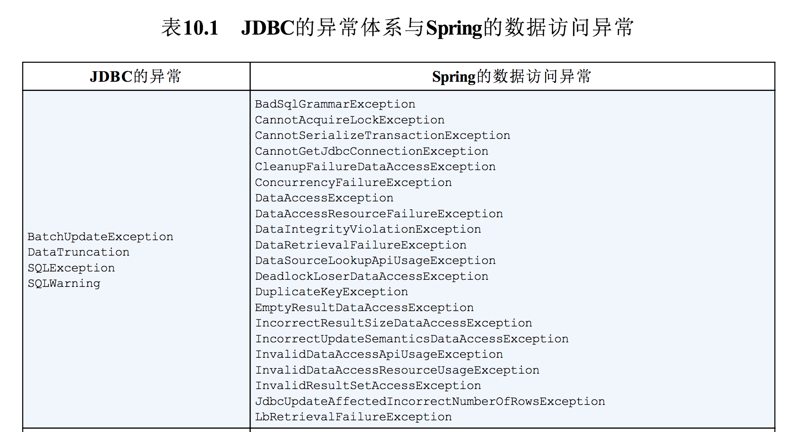 </div><br>
<div align="center"> 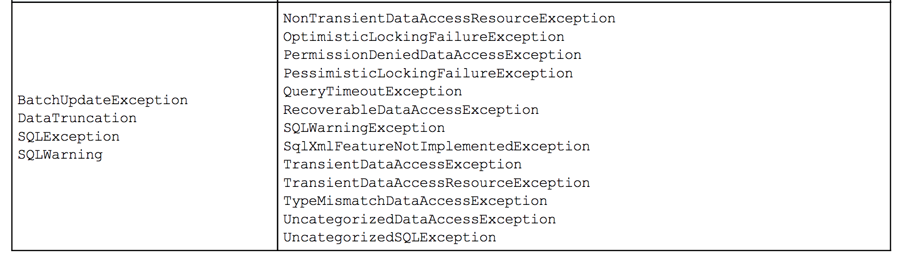 </div><br>

尽管Spring的异常体系比JDBC简单的SQLException丰富得多，但它并没有与特定的持久化方式相关联。这意味着我们可以使用Spring抛出一致的异常，而不用关心所选择的持久化方案。这有助于我们将所选择持久化机制与数据访问层隔离开来。

#### 看！不用写catch代码块
表10.1中没有体现出来的一点就是这些异常都继承自DataAccessException。DataAccessException的特殊之处在于它是一个非检查型异常。换句话说，没有必要捕获Spring所抛出的数据访问异常（当然，如果你想捕获的话也是完全可以的）。

DataAccessException只是Sping处理检查型异常和非检查型异常哲学的一个范例。

Spring认为触发异常的很多问题是不能在catch代码块中修复的。Spring使用了非检查型异常，而不是强制开发人员编写catch代码块（里面经常是空的）。这把是否要捕获异常的权力留给了开发人员。

为了利用Spring的数据访问异常，我们必须使用Spring所支持的数据访问模板。让我们看一下Spring的模板是如何简化数据访问的。

### 10.1.2 数据访问模板化
如果以前有搭乘飞机旅行的经历，你肯定会觉得旅行中很重要的一件事就是将行李从一个地方搬运到另一个地方。这个过程包含多个步骤。当你到达机场时，第一站是到柜台办理行李托运。然后保安人员对其进行安检以确保安全。之后行李将通过行李车转送到飞机上。如果你需要中途转机，行李也要进行中转。当你到达目的地的时候，行李需要从飞机上取下来并放到传送带上。最后，你到行李认领区将其取回。

尽管在这个过程中包含多个步骤，但是涉及到旅客的只有几个。承运人负责推动整个流程。你只会在必要的时候进行参与，其余的过程不必关心。这反映了一个强大的设计模式：**模板方法模式**。

模板方法定义过程的主要框架。在我们的示例中，整个过程是将行李从出发地运送到目的地。过程本身是固定不变的。处理行李过程中的每个事件都会以同样的方式进行：托运检查、运送到飞机上等等。在这个过程中的某些步骤是固定的——这些步骤每次都是一样的。比如当飞机到达目的地后，所有的行李被取下来并通过传送带运到取行李处。在某些特定的步骤上，处理过程会将其工作委派给子类来完成一些特定实现的细节。这是过程中变化的部分。例如，处理行李是从乘客在柜台托运行李开始的。这部分的处理往往是在最开始的时候进行，所以它在处理过程中的顺序是固定的。由于每位乘客的行李登记都不一样，所以这个过程的实现是由旅客决定的。按照软件方面的术语来讲，**模板方法将过程中与特定实现相关的部分委托给接口，而这个接口的不同实现定义了过程中的具体行为**。

这也是Spring在数据访问中所使用的模式。不管我们使用什么样的技术，都需要一些特定的数据访问步骤。例如，我们都需要获取一个到数据存储的连接并在处理完成后释放资源。这都是在数据访问处理过程中的固定步骤，但是每种数据访问方法又会有些不同，我们会查询不同的对象或以不同的方式更新数据，这都是数据访问过程中变化的部分。

Spring将数据访问过程中固定的和可变的部分明确划分为两个不同的类：**模板（template）和回调（callback）**。模板管理过程中固定的部分，而回调处理自定义的数据访问代码。图10.2展现了这两个类的职责。

<div align="center"> 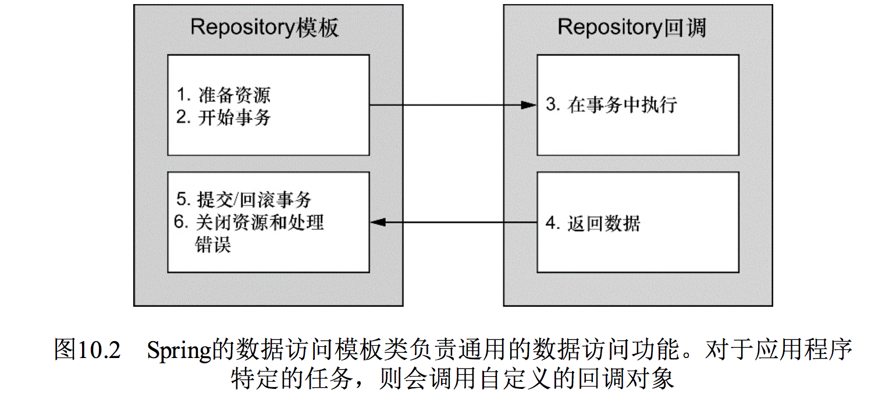 </div><br>
图10.2 Spring的数据访问模板类负责通用的数据访问功能。对于应用程序特定的任务，则会调用自定义的回调对象

如图所示，Spring的模板类处理数据访问的固定部分——事务控制、管理资源以及处理异常。同时，应用程序相关的数据访问——语句、绑定参数以及整理结果集——在回调的实现中处理。事实证明，这是一个优雅的架构，因为你只需关心自己的数据访问逻辑即可。

针对不同的持久化平台，Spring提供了多个可选的模板。如果直接使用JDBC，那你可以选择JdbcTemplate。如果你希望使用对象关系映射框架，那HibernateTemplate或JpaTemplate可能会更适合你。表10.2列出了Spring所提供的所有数据访问模板及其用途。

表10.2 Spring提供的数据访问模板，分别适用于不同的持久化机制

<div align="center"> 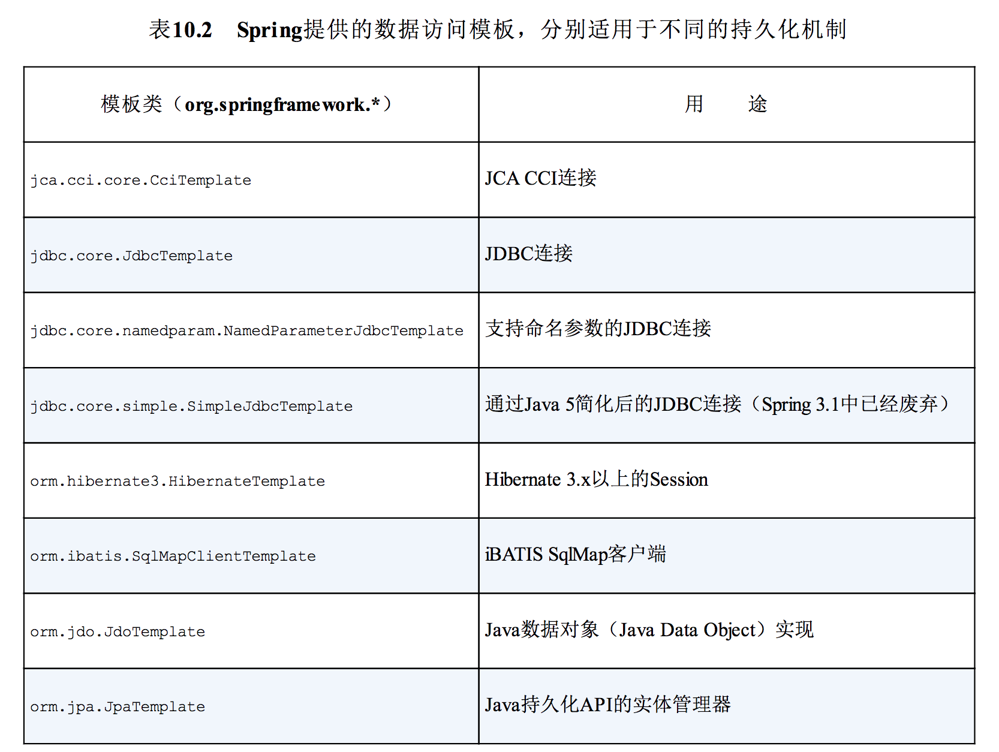 </div><br>

Spring为多种持久化框架提供了支持，这里没有那么多的篇幅在本章对其进行一一介绍。因此，我会关注于我认为最为实用的持久化方案，这也是读者最可能用到的。

在本章中，我们将会从基础的JDBC访问开始，因为这是从数据库中读取和写入数据的最基本方式。在第11章中，我们将会了解Hibernate和JPA，这是最流行的基于POJO的ORM方案。我们会在第12章结束Spring持久化的话题，在这一章中，将会看到Spring Data项目是如何让Spring支持无模式数据的。

但首先要说明的是Spring所支持的大多数持久化功能都依赖于数据源。因此，在声明模板和Repository之前，我们需要在Spring中配置一个数据源用来连接数据库。

## 10.2 配置数据源
无论选择Spring的哪种数据访问方式，你都需要配置一个数据源的引用。Spring提供了在Spring上下文中配置数据源bean的多种方式，包括：

- 通过JDBC驱动程序定义的数据源；
- 通过JNDI查找的数据源；
- 连接池的数据源。

对于即将发布到生产环境中的应用程序，我建议使用从连接池获取连接的数据源。如果可能的话，我倾向于通过应用服务器的JNDI来获取数据源。请记住这一点，让我们首先看一下如何配置Spring从JNDI中获取数据源。

### 10.2.1 使用JNDI数据源
Spring应用程序经常部署在Java EE应用服务器中，如WebSphere、JBoss或甚至像Tomcat这样的Web容器中。这些服务器允许你配置通过JNDI获取数据源。这种配置的好处在于数据源完全可以在应用程序之外进行管理，这样应用程序只需在访问数据库的时候查找数据源就可以了。另外，在应用服务器中管理的数据源通常以池的方式组织，从而具备更好的性能，并且还支持系统管理员对其进行热切换。

利用Spring，我们可以像使用Spring bean那样配置JNDI中数据源的引用并将其装配到需要的类中。位于jee命名空间下的<jee:jndi-lookup>元素可以用于检索JNDI中的任何对象（包括数据源）并将其作为Spring的bean。例如，如果应用程序的数据源配置在JNDI中，我们可以使用<jee:jndi-lookup>元素将其装配到Spring中，如下所示：

```
<jee:jndi-lookup id="datasource"
	  jndi-name="/jdbc/SppitterDS"
	  resource-ref="true"/>
```

其中jndi-name属性用于指定JNDI中资源的名称。如果只设置了jndi-name属性，那么就会根据指定的名称查找数据源。但是，如果应用程序运行在Java应用服务器中，你需要将resource-ref属性设置为true，这样给定的jndi-name将会自动添加“java:comp/env/”前缀。

如果想使用Java配置的话，那我们可以借助JndiObjectFactoryBean从JNDI中查找DataSource：

```
 @Bean
    public JndiObjectFactoryBean datasource() {
        JndiObjectFactoryBean jndiObjectFactoryBean = new JndiObjectFactoryBean();
        jndiObjectFactoryBean.setJndiName("jdbc/spittrDS");
        jndiObjectFactoryBean.setResourceRef(true);
        jndiObjectFactoryBean.setProxyInterface(DataSource.class);
        return jndiObjectFactoryBean;
    }
```

显然，通过Java配置获取JNDI bean要更为复杂。大多数情况下，Java配置要比XML配置简单，但是这一次我们需要写更多的Java代码。但是，很容易就能够看出Java代码中与XML相
对应的配置，Java配置的内容其实也不算多。

### 10.2.2 使用数据源连接池
如果你不能从JNDI中查找数据源，那么下一个选择就是直接在Spring中配置数据源连接池。尽管Spring并没有提供数据源连接池实现，但是我们有多项可用的方案，包括如下开源的实现：

- Apache Commons DBCP (http://jakarta.apache.org/commons/dbcp)；
- c3p0 (http://sourceforge.net/projects/c3p0/) ；
- BoneCP (http://jolbox.com/) 。

这些连接池中的大多数都能配置为Spring的数据源，在一定程度上与Spring自带的DriverManagerDataSource或SingleConnectionDataSource很类似（我们稍后会对其进行介绍）。例如，如下就是配置DBCP BasicDataSource的方式：

<div align="center"> 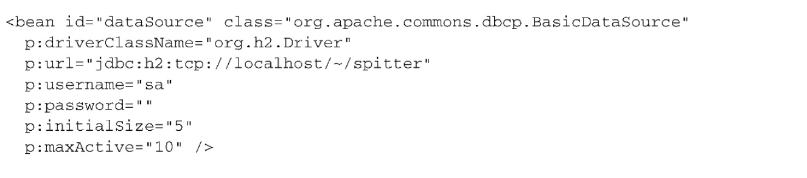 </div><br>

如果你喜欢Java配置的话，连接池形式的DataSourcebean可以声明如下：

<div align="center"> 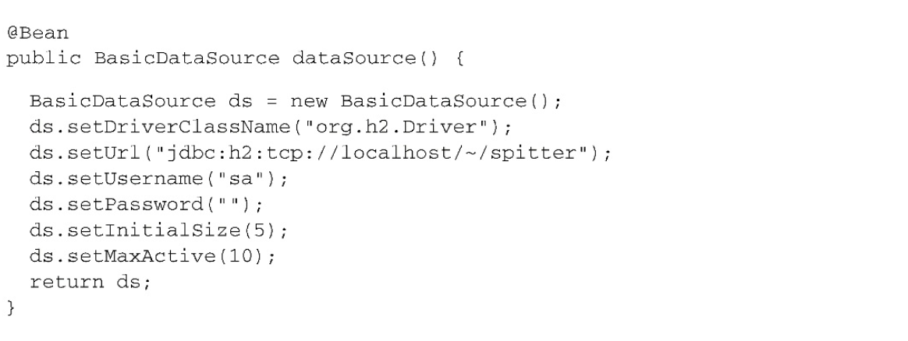 </div><br>

前四个属性是配置BasicDataSource所必需的。属性driverClassName指定了JDBC驱动类的全限定类名。在这里我们配置的是H2数据库的数据源。属性url用于设置数据库的JDBC URL。最后，username和password用于在连接数据库时进行认证。

以上四个基本属性定义了BasicDataSource的连接信息。除此以外，还有多个配置数据源连接池的属性。表10.3列出了DBCP BasicDataSource最有用的一些池配置属性：

表10.3 BasicDataSource的池配置属性

<div align="center"> 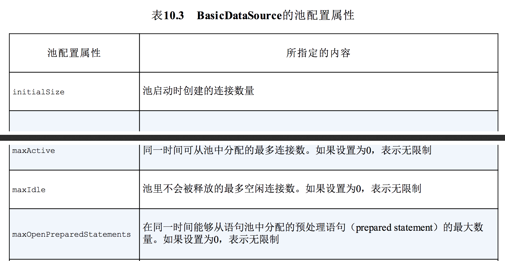 </div><br>
<div align="center"> 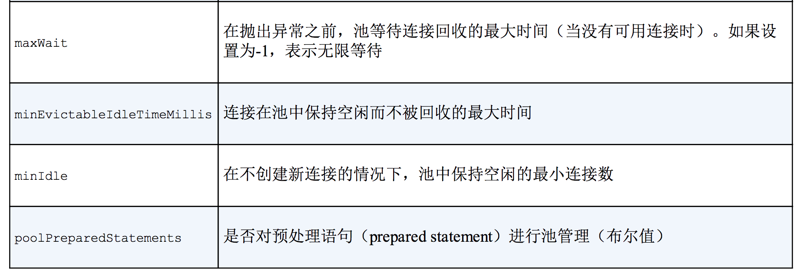 </div><br>

在我们的示例中，连接池启动时会创建5个连接；当需要的时候，允许BasicDataSource创建新的连接，但最大活跃连接数为10。

### 10.2.3 基于JDBC驱动的数据源
在Spring中，通过JDBC驱动定义数据源是最简单的配置方式。Spring提供了三个这样的数据源类（均位于org.springframework.jdbc.datasource包中）供选择：

- DriverManagerDataSource：在每个连接请求时都会返回一个新建的连接。与DBCP的BasicDataSource不同，由DriverManagerDataSource提供的连接并没有进行池化管理；
- SimpleDriverDataSource：与DriverManagerDataSource的工作方式类似，但是它直接使用JDBC驱动，来解决在特定环境下的类加载问题，这样的环境包括OSGi容器；
- SingleConnectionDataSource：在每个连接请求时都会返回同一个的连接。尽管SingleConnectionDataSource不是严格意义上的连接池数据源，但是你可以将其视为只有一个连接的池。

以上这些数据源的配置与DBCPBasicDataSource的配置类似。例如，如下就是配置DriverManagerDataSource的方法：


如果使用XML的话，DriverManagerDataSource可以按照如下的方式配置：

<div align="center"> 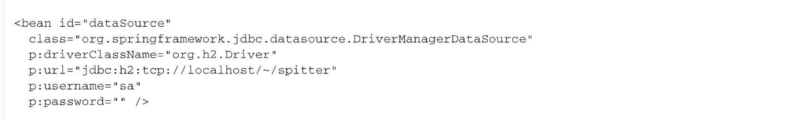 </div><br>

与具备池功能的数据源相比，唯一的区别在于这些数据源bean都没有提供连接池功能，所以没有可配置的池相关的属性。

尽管这些数据源对于小应用或开发环境来说是不错的，但是要将其用于生产环境，你还是需要慎重考虑。因为SingleConnectionDataSource有且只有一个数据库连接，所以不适合用于多线程的应用程序，最好只在测试的时候使用。而DriverManagerDataSource和SimpleDriverDataSource尽管支持多线程，但是在每次请求连接的时候都会创建新连接，这是以性能为代价的。鉴于以上的这些限制，我强烈建议应该使用数据源连接池。

### 10.2.4 使用嵌入式的数据源
除此之外，还有一个数据源是我想对读者介绍的：嵌入式数据库（embedded database）。嵌入式数据库作为应用的一部分运行，而不是应用连接的独立数据库服务器。尽管在生产环境的设置中，它并没有太大的用处，但是对于开发和测试来讲，嵌入式数据库都是很好的可选方案。这是因为每次重启应用或运行测试的时候，都能够重新填充测试数据。

Spring的jdbc命名空间能够简化嵌入式数据库的配置。例如，如下的程序清单展现了如何使用jdbc命名空间来配置嵌入式的H2数据库，它会预先加载一组测试数据。

程序清单10.1 使用jdbc命名空间配置嵌入式数据库

<div align="center"> 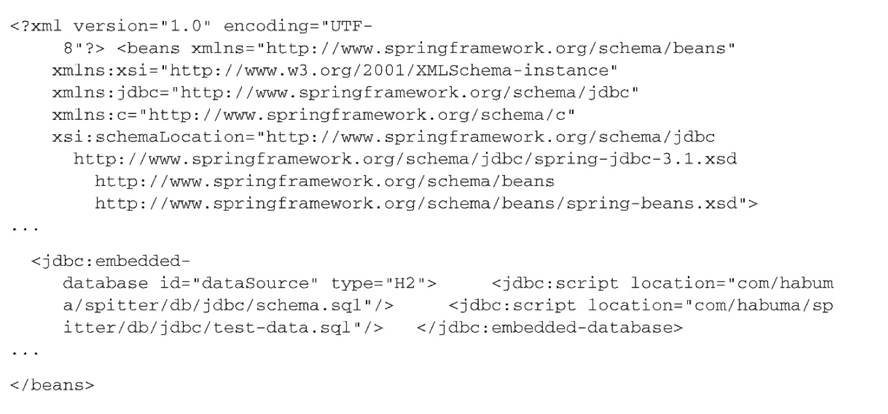 </div><br>

我们将`<jdbc:embedded-database>`的type属性设置为H2，表明嵌入式数据库应该是H2数据库（要确保H2位于应用的类路径下）。另外，我们还可以将type设置为DERBY，以使用嵌入式的Apache Derby数据库。

在`<jdbc:embedded-database>`中，我们可以不配置也可以配置多个<jdbc:script>元素来搭建数据库。程序清单10.1中包含了两个<jdbc:script>元素：第一个引用了schema.sql，它包含了在数据库中创建表的SQL；第二个引用了test-data.sql，用来将测试数据填充到数据库中。

除了搭建嵌入式数据库以外，`<jdbc:embedded-database>`元素还会暴露一个数据源，我们可以像使用其他的数据源那样来使用它。在这里，id属性被设置成了dataSource，这也是所暴露数据源的bean ID。因此，当我们需要javax.sql.DataSource的时候，就可以注入dataSource bean。

如果使用Java来配置嵌入式数据库时，不会像jdbc命名空间那么简便，我们可以使用EmbeddedDatabaseBuilder来构建DataSource：

```
 @Bean
    public DataSource dataSource2() {
        return new EmbeddedDatabaseBuilder()
                .setType(EmbeddedDatabaseType.H2)
                .addScript("classpath:schema.sql")
                .addScript("classpath:test-data.sql")
                .build();
    }
```

可以看到，setType()方法等同于`<jdbc:embedded-database>`元素中的type属性，此外，我们这里用addScript()代替<jdbc:script>元素来指定初始化SQL。

### 10.2.5 使用profile选择数据源
我们已经看到了多种在Spring中配置数据源的方法，我相信你已经找到了一两种适合你的应用程序的配置方式。实际上，我们很可能面临这样一种需求，那就是在某种环境下需要其中一种数据源，而在另外的环境中需要不同的数据源。

例如，对于开发期来说，`<jdbc:embedded-database>`元素是很合适的，而在QA环境中，你可能希望使用DBCP的BasicDataSource，在生产部署环境下，可能需要使用<jee:jndi-lookup>。

我们在第3章所讨论的Spring的bean profile特性恰好用在这里，所需要做的就是将每个数据源配置在不同的profile中，如下所示：

程序清单10.2 借助Spring的profile特性能够在运行时选择数据源

```
public class DataSourceConfiguration {

    /**
     * 生产环境 数据源
     *
     * @return
     */
    @Profile("pro")
    @Bean
    public JndiObjectFactoryBean datasource() {
        JndiObjectFactoryBean jndiObjectFactoryBean = new JndiObjectFactoryBean();
        jndiObjectFactoryBean.setJndiName("jdbc/spittrDS");
        jndiObjectFactoryBean.setResourceRef(true);
        jndiObjectFactoryBean.setProxyInterface(DataSource.class);
        return jndiObjectFactoryBean;
    }

    /**
     * QA 数据源
     *
     * @return
     */
    @Profile("qa")
    @Bean
    public DataSource dataSource() {
        DriverManagerDataSource ds = new DriverManagerDataSource();
        ds.setDriverClassName("org.h2.Driver");
        ds.setUrl("jdbc:h2:tcp://localhost/~/spitter");
        ds.setUsername("sa");
        ds.setPassword("");
        return ds;
    }

    /**
     * 开发 数据源
     *
     * @return
     */
    @Profile("dev")
    @Bean
    public DataSource embeddeddataSource() {
        return new EmbeddedDatabaseBuilder()
                .setType(EmbeddedDatabaseType.H2)
                .addScript("classpath:com/alan/yx/springInAction/Chapter_10/jdbc/src/main/resources/spittr/db/jdbc/schema.sql")
                .addScript("classpath:com/alan/yx/springInAction/Chapter_10/jdbc/src/test/resources/spittr/db/jdbc/test-data.sql")
                .build();
    }
}
```

通过使用profile功能，会在运行时选择数据源，这取决于哪一个profile处于激活状态。如程序清单10.2配置所示，当且仅当development profile处于激活状态时，会创建嵌入式数据库，当且仅当qa profile处于激活状态时，会创建DBCP BasicDataSource，当且仅当production profile处于激活状态时，会从JNDI获取数据源。

为了内容的完整性，如下的程序清单展现了如何使用Spring XML代替Java配置，实现相同的profile配置。

程序清单10.3 借助XML配置，基于profile选择数据源

<div align="center"> 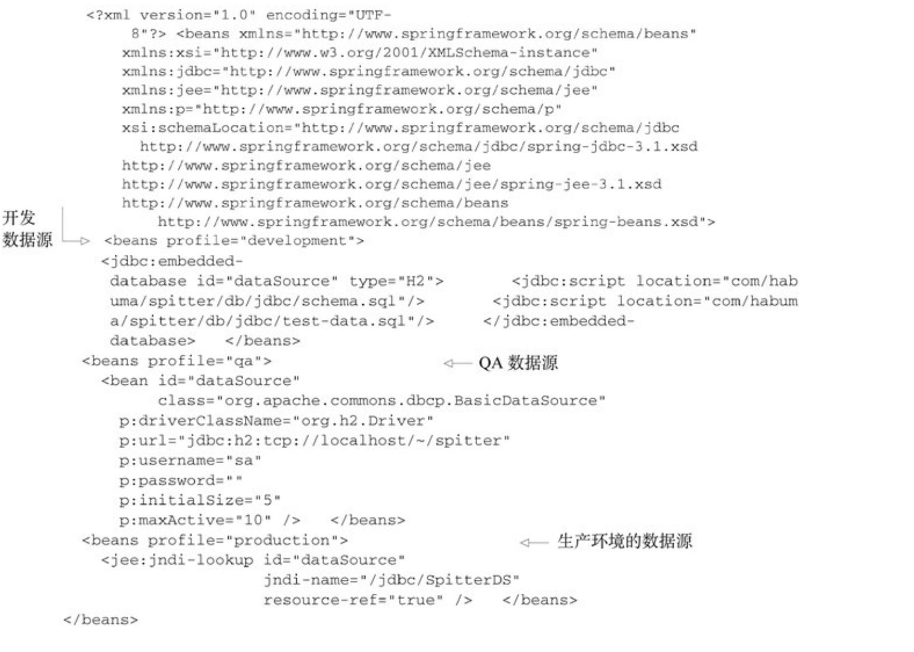 </div><br>

现在我们已经通过数据源建立了与数据库的连接，接下来要实际访问数据库了。就像我在前面所提到的，Spring为我们提供了多种使用数据库的方式包括JDBC、Hibernate以及Java持久化API（Java Persistence API，JPA）。在下一节，我们将会看到如何使用Spring对JDBC的支持为应用程序构建持久层。如果你喜欢使用Hibernate或JPA，那可以直接跳到下一章。

## 10.3 在Spring中使用JDBC
持久化技术有很多种，而Hibernate、iBATIS和JPA只是其中的几种而已。尽管如此，还是有很多的应用程序使用最古老的方式将Java对象保存到数据库中：他们自食其力。不，等等，这是他们挣钱的途径。这种久经考验并证明行之有效的持久化方法就是古老的JDBC。

为什么不采用它呢？JDBC不要求我们掌握其他框架的查询语言。它是建立在SQL之上的，而SQL本身就是数据访问语言。此外，与其他的技术相比，使用JDBC能够更好地对数据访问的性能进行调优。JDBC允许你使用数据库的所有特性，而这是其他框架不鼓励甚至禁止的。

再者，相对于持久层框架，JDBC能够让我们在更低的层次上处理数据，我们可以完全控制应用程序如何读取和管理数据，包括访问和管理数据库中单独的列。这种细粒度的数据访问方式在很多应用程序中是很方便的。例如在报表应用中，如果将数据组织为对象，而接下来唯一要做的就是将其解包为原始数据，那就没有太大意义了。

但是JDBC也不是十全十美的。虽然JDBC具有强大、灵活和其他一些优点，但也有其不足之处。

### 10.3.1 应对失控的JDBC代码
如果使用JDBC所提供的直接操作数据库的API，你需要负责处理与数据库访问相关的所有事情，其中包含管理数据库资源和处理异常。如果你曾经使用JDBC往数据库中插入数据，那如下代码对你应该并不陌生：

程序清单10.4 使用JDBC在数据库里插入一行数据

<div align="center">  </div><br>

看看这些失控的代码！这个超过20行的代码仅仅是为了向数据库中插入一个简单的对象。对于JDBC操作来讲，这应该是最简单的了。但是为什么要用这么多行代码才能做如此简单的事情呢？实际上，并非如此，只有几行代码是真正用于进行插入数据的。但是JDBC要求你必须正确地管理连接和语句，并以某种方式处理可能抛出的SQLException异常。

再提一句这个SQLException异常：你不但不清楚如何处理它（因为并不知道哪里出错了），而且你还要捕捉它两次！你需要在插入记录出错时捕捉它，同时你还需要在关闭语句和连接出错的时候捕捉它。看起来我们要做很多的工作来处理可能出现的问题，而这些问题通常是难以通过编码来处理的。

再来看一下如下程序清单中的代码，我们使用传统的JDBC来更新数据库中Spitter表的一行。

程序清单10.5 使用JDBC更新数据库中的一行

<div align="center">  </div><br>

乍看上去，程序清单10.5和10.4是相同的。实际上，除了SQL字符串和创建语句的那一行，它们是完全相同的。同样，这里也使用大量代码来完成一件简单的事情，而且有很多重复的代码。在理想情况下，我们只需要编写与特定任务相关的代码。毕竟，这才是程序清单10.5和10.4的不同之处，剩下的都是样板代码。

为了完成对JDBC的完整介绍，让我们看一下如何从数据库中获取数据。如下所示，它也不简单。

程序清单10.6 使用JDBC从数据库中查询一行数据

<div align="center">  </div><br>

这段代码与插入和更新的样例一样冗长，甚至更为复杂。这就好像Pareto法则被倒了过来：只有20%的代码是真正用于查询数据的，而80%代码都是样板代码。

现在你可以看出，大量的JDBC代码都是用于创建连接和语句以及异常处理的样板代码。既然已经得出了这个观点，我们将不再接受它的折磨，以后你再也不会看到这样令人厌恶的代码了。

但实际上，这些样板代码是非常重要的。清理资源和处理错误确保了数据访问的健壮性。如果没有它们的话，就不会发现错误而且资源也会处于打开的状态，这将会导致意外的代码和资源泄露。我们不仅需要这些代码，而且还要保证它是正确的。基于这样的原因，我们才需要框架来保证这些代码只写一次而且是正确的。

### 10.3.2 使用JDBC模板
Spring的JDBC框架承担了资源管理和异常处理的工作，从而简化了JDBC代码，让我们只需编写从数据库读写数据的必需代码。

正如前面小节所介绍过的，Spring将数据访问的样板代码抽象到模板类之中。Spring为JDBC提供了三个模板类供选择：

- JdbcTemplate：最基本的Spring JDBC模板，这个模板支持简单的JDBC数据库访问功能以及基于索引参数的查询；
- NamedParameterJdbcTemplate：使用该模板类执行查询时可以将值以命名参数的形式绑定到SQL中，而不是使用简单的索引参数；
- SimpleJdbcTemplate：该模板类利用Java 5的一些特性如自动装箱、泛型以及可变参数列表来简化JDBC模板的使用。

以前，在选择哪一个JDBC模板的时候，我们需要仔细权衡。但是从Spring 3.1开始，做这个决定变得容易多了。SimpleJdbcTemplate已经被废弃了，其Java 5的特性被转移到了JdbcTemplate中，并且只有在你需要使用命名参数的时候，才需要使用NamedParameterJdbcTemplate。这样的话，对于大多数的JDBC任务来说，JdbcTemplate就是最好的可选方案，这也是本小节中所关注的方案。使

#### 用JdbcTemplate来插入数据
为了让JdbcTemplate正常工作，只需要为其设置DataSource就可以了，这使得在Spring中配置JdbcTemplate非常容易，如下面的@Bean方法所示：

```
 @Bean
    public JdbcTemplate jdbcTemplate(DataSource dataSource){
        return new JdbcTemplate(dataSource);
    }
```

在这里，DataSource是通过构造器参数注入进来的。这里所引用的dataSourcebean可以是javax.sql.DataSource的任意实现，包括我们在10.2小节中所创建的。

现在，我们可以将jdbcTemplate装配到Repository中并使用它来访问数据库。例如，SpitterRepository使用了JdbcTemplate：

<div align="center">  </div><br>

在这里，JdbcSpitterRepository类上使用了@Repository注解，这表明它将会在组件扫描的时候自动创建。它的构造器上使用了@Inject注解，因此在创建的时候，会自动获得一个JdbcOperations对象。JdbcOperations是一个接口，定义了JdbcTemplate所实现的操作。通过注入JdbcOperations，而不是具体的JdbcTemplate，能够保证JdbcSpitterRepository通过JdbcOperations接口达到与JdbcTemplate保持**松耦合**。

作为另外一种组件扫描和自动装配的方案，我们可以将JdbcSpitterRepository显式声明为Spring中的bean，如下所示：

```
@Bean
    public SpitterRepository spitterRepository(JdbcTemplate jdbcTemplate){
        return new JdbcSpitterRepository(jdbcTemplate);
    }
```

在Repository中具备可用的JdbcTemplate后，我们可以极大地简化程序清单10.4中的addSpitter()方法。基于JdbcTemplate的addSpitter()方法如下：

程序清单10.7 基于JdbcTemplate的addSpitter()方法

<div align="center"> 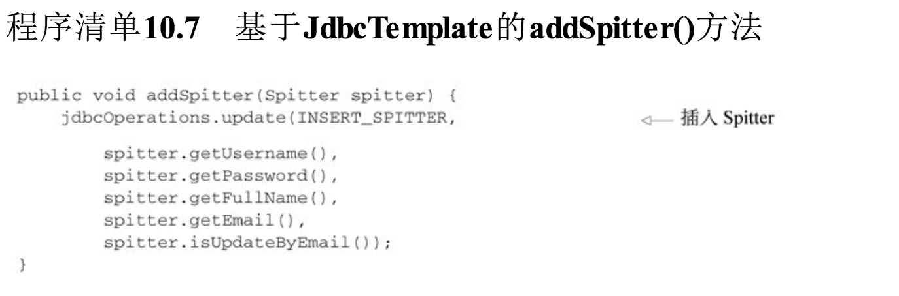 </div><br>

这个版本的addSpitter()方法简单多了。这里没有了创建连接和语句的代码，也没有异常处理的代码，只剩下单纯的数据插入代码。

不能因为你看不到这些样板代码，就意味着它们不存在。样板代码被巧妙地隐藏到JDBC模板类中了。当update()方法被调用的时候JdbcTemplate将会获取连接、创建语句并执行插入SQL。

在这里，你也看不到对SQLException处理的代码。在内部，JdbcTemplate将会捕获所有可能抛出的SQLException，并将通用的SQLException转换为表10.1所列的那些更明确的数据访问异常，然后将其重新抛出。因为Spring的数据访问异常都是运行时异常，所以我们不必在addSpring ()方法中进行捕获。

#### 使用JdbcTemplate来读取数据
JdbcTemplate也简化了数据的读取操作。程序清单10.8展现了新版本的findOne()方法，它使用了JdbcTemplate的回调，实现根据ID查询Spitter，并将结果集映射为Spitter对象。

程序清单10.8 使用JdbcTemplate查询Spitter

```
 public Spitter findOne(long id) {
        // 查询 Spitter
        return jdbcTemplate.queryForObject(
                SELECT_SPITTER + " where id=?",
                // 将查询结果映射到对象
                new SpitterRowMapper(),
                id);
    }

    private static final class SpitterRowMapper implements RowMapper<Spitter> {
        public Spitter mapRow(ResultSet rs, int rowNum) throws SQLException {
            long id = rs.getLong("id");
            String username = rs.getString("username");
            String password = rs.getString("password");
            String fullName = rs.getString("fullname");
            String email = rs.getString("email");
            boolean updateByEmail = rs.getBoolean("updateByEmail");
            // 绑定参数
            return new Spitter(id, username, password, fullName, email, updateByEmail);
        }
    }
```

在这个findOne()方法中使用了JdbcTemplate的queryForObject()方法来从数据库查询Spitter。queryForObject()方法有三个参数：

- String对象，包含了要从数据库中查找数据的SQL；
- RowMapper对象，用来从ResultSet中提取数据并构建域对象（本例中为Spitter）；
- 可变参数列表，列出了要绑定到查询上的索引参数值。

真正奇妙的事情发生在SpitterRowMapper对象中，它实现了RowMapper接口。对于查询返回的每一行数据，JdbcTemplate将会调用RowMapper的mapRow()方法，并传入一个ResultSet和包含行号的整数。在SpitterRowMapper的mapRow()方法中，我们创建了Spitter对象并将ResultSet中的值填充进去。

就像addSpitter()那样，findOne()方法也不用写JDBC模板代码。不同于传统的JDBC，这里没有资源管理或者异常处理代码。使用JdbcTemplate的方法只需关注于如何从数据库中获取Spitter对象即可。

#### 在JdbcTemplate中使用Java 8的Lambda表达式
因为RowMapper接口只声明了addRow()这一个方法，因此它完全符合函数式接口（functional interface）的标准。这意味着如果使用Java 8来开发应用的话，我们可以使用Lambda来表达RowMapper的实现，而不必再使用具体的实现类了。

例如，程序清单10.8中的findOne()方法可以使用Java 8的Lambda表达式改写，如下所示：

<div align="center"> 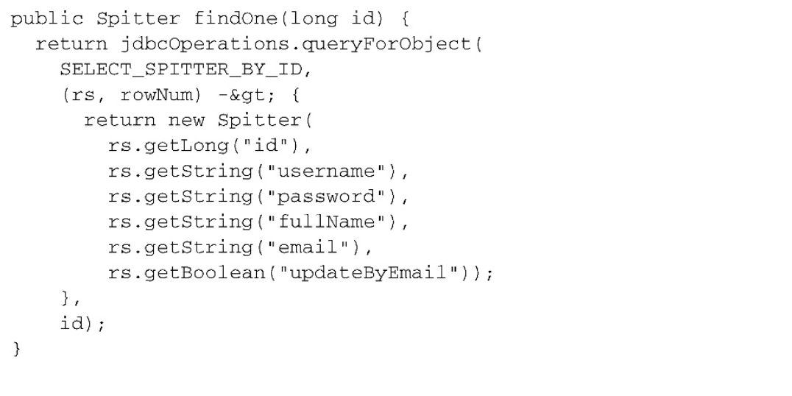 </div><br>

我们可以看到，Lambda表达式要比完整的RowMapper实现更为易读，不过它们的功能是相同的。Java会限制RowMapper中的Lambda表达式，使其满足所传入的参数。

另外，我们还可以使用Java 8的方法引用，在单独的方法中定义映射逻辑：

```
 public Spitter findOne(long id) {
        // 查询 Spitter
        return jdbcTemplate.queryForObject(
                SELECT_SPITTER + " where id=?",
                // 将查询结果映射到对象
                this::mapSpitter,
                id);
    }

    private Spitter mapSpitter(ResultSet rs, int rowNum) throws SQLException {
        return new Spitter(
                rs.getLong("id"),
                rs.getString("username"),
                rs.getString("password"),
                rs.getString("fullname"),
                rs.getString("email"),
                rs.getBoolean("updateByEmail"));
    }
```

不管采用哪种方式，我们都不必显式实现RowMapper接口，但是与实现RowMapper类似，我们所提供的Lambda表达式和方法必须要接受相同的参数，并返回相同的类型。

#### 使用命名参数在清单
10.7的代码中，addSpitter()方法使用了索引参数。这意味着我们需要留意查询中参数的顺序，在将值传递给update()方法的时候要保持正确的顺序。如果在修改SQL时更改了参数的顺序，那我们还需要修改参数值的顺序。

除了这种方法之外，我们还可以使用命名参数。命名参数可以赋予SQL中的每个参数一个明确的名字，在绑定值到查询语句的时候就通过该名字来引用参数。例如，假设SQL_INSERT_SPITTER查询语句是这样定义的：

<div align="center">  </div><br>

使用命名参数查询，绑定值的顺序就不重要了，我们可以按照名字来绑定值。如果查询语句发生了变化导致参数的顺序与之前不一致，我们不需要修改绑定的代码。

NamedParameterJdbcTemplate是一个特殊的JDBC模板类，它支持使用命名参数。在Spring中，NamedParameterJdbcTemplate的声明方式与常规的JdbcTemplate几乎完全相同：

```
 @Bean
    public NamedParameterJdbcTemplate namedParameterJdbcTemplate(DataSource dataSource){
        return new NamedParameterJdbcTemplate(dataSource);
    }
```

在这里，我们将NamedParameterJdbcOperations（NamedParameterJdbcTemplate所实现的接口）注入到Repository中，用它来替代JdbcOperations。现在的addSpitter()方法如下所示：

程序清单10.9 使用Spring JDBC模板的命名参数功能

<div align="center"> 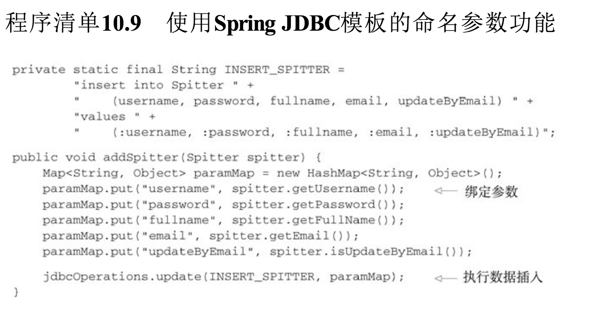 </div><br>

这个版本的addSpitter()比前一版本的代码要长一些。这是因为命名参数是通过java.util.Map来进行绑定的。不过，每行代码都关注于往数据库中插入Spitter对象。这个方法的核心功能并不会被资源管理或异常处理这样的代码所充斥。

## 10.4 小结
数据是应用程序的血液。有些数据中心论者甚至主张数据即应用。鉴于数据的重要地位，以健壮、简单和清晰的方式开发应用程序的数据访问部分就显得举足轻重了。

在Java中，JDBC是与关系型数据库交互的最基本方式。但是按照规范，JDBC有些太笨重了。Spring能够解除我们使用JDBC中的大多数痛苦，包括消除样板式代码、简化JDBC异常处理，你所需要做的仅仅是关注要执行的SQL语句。

在本章中，我们学习了Spring对数据持久化的支持，以及Spring为JDBC所提供的基于模板的抽象，它能够极大地简化JDBC的使用。

在下一章中，我们会继续Spring数据持久化这一话题，将会学习Spring为Java持久化API所提供的功能。