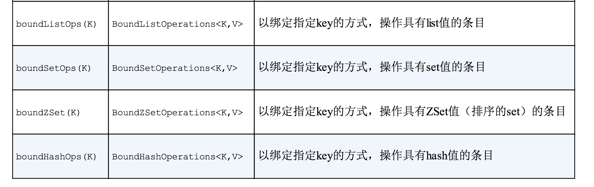

# 第12章 使用NoSQL数据库
本章内容：

- 为MongoDB和Neo4j编写Repository
- 为多种数据存储形式持久化数据
- 组合使用Spring和Redis

亨利·福特在他的自传中曾经写过一句很著名的话：“任何顾客可以将这辆车漆成任何他所愿意的颜色，只要保持它的黑色就可以”[1]。有人说这句话是傲慢和固执的，而有些人则说这句话反映出了他的幽默。事实上，在这本自传出版的时候，他通过使用一种快速烘干的油漆降低了成本，而当时这种油漆只有黑色的。

福特的这句著名的话也可以用在数据库领域，多年来，我们一直被告知，我们可以使用任意想要的数据库，只要它是关系型数据库就行。关系型数据库已经垄断应用开发领域好多年了。

随着一些竞争者进入数据库领域，关系型数据库的垄断地位开始被弱化。所谓的“NoSQL”数据库开始侵入生产型的应用之中，我们也认识到并没有一种全能型的数据库。现在有了更多的可选方案，所以能够为要解决的问题选择最佳的数据库。

在前面的几章中，我们关注于关系型数据库，首先使用Spring对JDBC支持，然后使用对象-关系映射。在上一章，我们看到了Spring Data JPA，它是Spring Data项目下的多个子项目之一。通过在运行时自动生成Repository实现，Spring Data JPA能够让使用JPA的过程更加简单容易。

Spring Data还提供了对多种NoSQL数据库的支持，包括MongoDB、Neo4j和Redis。它不仅支持自动化的Repository，还支持基于模板的数据访问和映射注解。在本章中，将会看到如何为非关系型的NoSQL数据库编写Repository。首先，我们将从Spring Data MongoDB开始，看一下如何编写Repository来处理基于文档的数据。

## 12.3 使用Redis操作key-value数据
Redis是一种特殊类型的数据库，它被称之为key-value存储。顾名思义，key-value存储保存的是键值对。实际上，key-value存储与哈希Map有很大的相似性。可以不太夸张地说，它们就是持久化的哈希Map。

当你思考这一点的时候，可能会意识到，对于哈希Map或者key-value存储来说，其实并没有太多的操作。我们可以将某个value存储到特定的key上，并且能够根据特定key，获取value。差不多也就是这样了。因此，Spring Data的自动Repository生成功能并没有应用到Redis上。不过，Spring Data的另外一个关键特性，也就是面向模板的数据访问，能够在使用Redis的时候，为我们提供帮助。

Spring Data Redis包含了多个模板实现，用来完成Redis数据库的数据存取功能。稍后，我们就会看到如何使用它们。但是为了创建Spring Data Redis的模板，我们首先需要有一个Redis连接工厂。幸好，Spring Data Redis提供了四个连接工厂供我们选择。

### 12.3.1 连接到Redis
Redis连接工厂会生成到Redis数据库服务器的连接。Spring Data Redis为四种Redis客户端实现提供了连接工厂：

- JedisConnectionFactory
- JredisConnectionFactory
- LettuceConnectionFactory
- SrpConnectionFactory

具体选择哪一个取决于你。我建议你自行测试并建立基准，进而确定哪一种Redis客户端和连接工厂最适合你的需求。从Spring Data Redis的角度来看，这些连接工厂在适用性上都是相同的。

在做出决策之后，我们就可以将连接工厂配置为Spring中的bean。例如，如下展示了如何配置JedisConnectionFactory bean：

```
   @Bean
    public RedisConnectionFactory redisCF() {
        return new JedisConnectionFactory();
    }
```

通过默认构造器创建的连接工厂会向localhost上的6379端口创建连接，并且没有密码。如果你的Redis服务器运行在其他的主机或端口上，在创建连接工厂的时候，可以设置这些属性：

```
 @Bean
    public RedisConnectionFactory redisCF() {
        JedisConnectionFactory jcf = new JedisConnectionFactory();
        jcf.setHostName("redis-server");
        jcf.setPort(7379);
        return jcf;
    }
```

类似地，如果你的Redis服务器配置为需要客户端认证的话，那么可以通过调用setPassword()方法来设置密码：

```
 @Bean
    public RedisConnectionFactory redisCF() {
        JedisConnectionFactory jcf = new JedisConnectionFactory();
        jcf.setHostName("redis-server");
        jcf.setPort(7379);
        jcf.setPassword("foobared");
        return jcf;
    }
```

在上面的这些例子中，我都假设使用的是JedisConnectionFactory。如果你选择使用其他连接工厂的话，只需进行简单地替换就可以了。例如，假设你要使用LettuceConnectionFactory的话，可以按照如下的方式进行配置：

```
 @Bean
    public RedisConnectionFactory redisCF() {
        JedisConnectionFactory jcf = new LettuceConnectionFactory();
        jcf.setHostName("redis-server");
        jcf.setPort(7379);
        jcf.setPassword("foobared");
        return jcf;
    }
```

所有的Redis连接工厂都具有setHostName()、setPort()和setPassword()方法。这样，它们在配置方面实际上是相同的。

现在，我们有了Redis连接工厂，接下来就可以使用Spring Data Redis模板了。

### 12.3.2 使用RedisTemplate
顾名思义，Redis连接工厂会生成到Redis key-value存储的连接（以RedisConnection的形式）。借助RedisConnection，可以存储和读取数据。例如，我们可以获取连接并使用它来保存一个问候信息，如下所示：

<div align="center">  </div><br>

与之类似，我们还可以使用RedisConnection来获取之前存储的问候信息：

```
byte[] greetingBytes = conn.get("greeting".getBytes());
String greeting = new String(greetingBytes);
```

毫无疑问，这可以正常运行，但是你难道真的愿意使用字节数组吗？

与其他的Spring Data项目类似，Spring Data Redis以模板的形式提供了较高等级的数据访问方案。实际上，Spring Data Redis提供了两个模板：

- RedisTemplate
- StringRedisTemplate

RedisTemplate可以极大地简化Redis数据访问，能够让我们持久化各种类型的key和value，并不局限于字节数组。在认识到key和value通常是String类型之后，StringRedisTemplate扩展了RedisTemplate，只关注String类型。

假设我们已经有了RedisConnectionFactory，那么可以按照如下的方式构建RedisTemplate：

		  RedisConnectionFactory cf =  . . . ;
		  RedisTemplate<String, Product> redis = new RedisTemplate<String, Product>();
        redis.setConnectionFactory(cf);

注意，RedisTemplate使用两个类型进行了参数化。第一个是key的类型，第二个是value的类型。在这里所构建的RedisTemplate中，将会保存Product对象作为value，并将其赋予一个String类型的key。

如果你所使用的value和key都是String类型，那么可以考虑使用StringRedisTemplate来代替RedisTemplate：

		  RedisConnectionFactory cf =  . . . ;
		  RedisTemplate<String, Product> redis = new StringRedisTemplate<String, Product>();
        redis.setConnectionFactory(cf);


注意，与RedisTemplate不同，StringRedisTemplate有一个接受RedisConnectionFactory的构造器，因此没有必要在构建后再调用setConnectionFactory()。

尽管这并非必须的，但是如果你经常使用RedisTemplate或StringRedisTemplate的话，你可以考虑将其配置为bean，然后注入到需要的地方。如下就是一个声明RedisTemplate的简单@Bean方法：

```
	 @Bean
    public RedisTemplate<String, Product> redisTemplate(RedisConnectionFactory cf) {
        RedisTemplate<String, Product> redis = new RedisTemplate<String, Product>();
        redis.setConnectionFactory(cf);
        return redis;
    }
```

如下是声明StringRedisTemplate bean的@Bean方法：
```
	 @Bean
    public RedisTemplate<String, Product> redisTemplate(RedisConnectionFactory cf) {
        return new StringRedisTemplate <String, Product>(cf);
    }
```

有了RedisTemplate（或StringRedisTemplate）之后，我们就可以开始保存、获取以及删除key-value条目了。RedisTemplate的大多数操作都是表12.5中的子API提供的。

表12.5 RedisTemplate的很多功能是以子API的形式提供的，它们区分了单个值和集合值的场景

<div align="center">  </div><br>
<div align="center">  </div><br>

我们可以看到，表12.5中的子API能够通过RedisTemplate（和StringRedisTemplate）进行调用。其中每个子API都提供了使用数据条目的操作，基于value中所包含的是单个值还是一个值的集合它们会有所差别。

这些子API中，包含了很多从Redis中存取数据的方法。我们没有足够的篇幅介绍所有的方法，但是会介绍一些最为常用的操作。

#### 使用简单的值
假设我们想通过RedisTemplate<String, Product>保存Product，其中key是sku属性的值。如下的代码片段展示了如何借助opsForValue()方法完成该功能：

	redis.opsForValue().set(product.getSku(),product);

类似地，如果你希望获取sku属性为123456的产品，那么可以使用如下的代码片段：

	Product  product = redis.opsForValue().get("123456");

如果按照给定的key，无法获得条目的话，将会返回null。

#### 使用List类型的值
使用List类型的value与之类似，只需使用opsForList()方法即可。例如，我们可以在一个List类型的条目尾部添加一个值：

	redis.opsForList().rightPush("cart",product);

通过这种方式，我们向列表的尾部添加了一个Product，所使用的这个列表在存储时key为cart。如果这个key尚未存在列表的话，将会创建一个。

rightPush()会在列表的尾部添加一个元素，而leftPush()则会在列表的头部添加一个值：

	redis.opsForList().leftPush("cart",product);

我们有很多方式从列表中获取元素，可以通过leftPop()或rightPop()方法从列表中弹出一个元素：

	Product first = redis.opsForList().rightPop("cart",product);
	Product first = redis.opsForList().leftPop("cart",product);

除了从列表中获取值以外，这两个方法还有一个副作用就是从列表中移除所弹出的元素。如果你只是想获取值的话（甚至可能要在列表的中间获取），那么可以使用range()方法：

	List<Product> products = redis.opsForList().range("cart",2,12);

range()方法不会从列表中移除任何元素，但是它会根据指定的key和索引范围，获取范围内的一个或多个值。前面的样例中，会获取11个元素，从索引为2的元素到索引为12的元素（不包含）。如果范围超出了列表的边界，那么只会返回索引在范围内的元素。如果该索引范围内没有元素的话，将会返回一个空的列表。

#### 在Set上执行操作
除了操作列表以外，我们还可以使用opsForSet()操作Set。最为常用的操作就是向Set中添加一个元素：

	redis.opsForSet().add("cart",product);

在我们有多个Set并填充值之后，就可以对这些Set进行一些有意思的操作，如获取其差异、求交集和求并集：

	List<Product> diff = redis.opsForSet().difference("cart1","cart2");
	List<Product> union = redis.opsForSet().union("cart1","cart2");
	List<Product> isect = redis.opsForSet().isect("cart1","cart2");

当然，我们还可以移除它的元素：

	redis.opsForSet().remove(product);

我们甚至还可以随机获取Set中的一个元素：

	Product random = redis.opsForSet().randomMember("cart");

因为Set没有索引和内部的排序，因此我们无法精准定位某个点，然后从Set中获取元素。

#### 绑定到某个key上
表12.5包含了五个子API，它们能够以绑定key的方式执行操作。这些子API与其他的API是对应的，但是关注于某一个给定的key。

为了举例阐述这些子API的用法，我们假设将Product对象保存到一个list中，并且key为cart。在这种场景下，假设我们想从list的右侧弹出一个元素，然后在list的尾部新增三个元素。我们此时可以使用boundListOps()方法所返回的BoundListOperations：

<div align="center">  </div><br>

注意，我们只在一个地方使用了条目的key，也就是调用boundListOps()的时候。对返回的BoundListOperations执行的所有操作都会应用到这个key上。

#### 12.3.3 使用key和value的序列化器
当某个条目保存到Redis key-value存储的时候，key和value都会使用Redis的序列化器（serializer）进行序列化。Spring Data Redis提供了多个这样的序列化器，包括：

- GenericToStringSerializer：使用Spring转换服务进行序列化；
- JacksonJsonRedisSerializer：使用Jackson 1，将对象序列化为JSON；
- Jackson2JsonRedisSerializer：使用Jackson 2，将对象序列化为JSON；
- JdkSerializationRedisSerializer：使用Java序列化；
- OxmSerializer：使用Spring O/X映射的编排器和解排器（marshaler和unmarshaler）实现序列化，用于XML序列化；
- StringRedisSerializer：序列化String类型的key和value。

这些序列化器都实现了RedisSerializer接口，如果其中没有符合需求的序列化器，那么你还可以自行创建。

RedisTemplate会使用JdkSerializationRedisSerializer，这意味着key和value都会通过Java进行序列化。StringRedisTemplate默认会使用StringRedisSerializer，这在我们的预料之中，它实际上就是实现String与byte数组之间的相互转换。这些默认的设置适用于很多的场景，但有时候你可能会发现使用一个不同的序列化器也是很有用处的。

例如，假设当使用RedisTemplate的时候，我们希望将Product类型的value序列化为JSON，而key是String类型。RedisTemplate的setKeySerializer()和setValueSerializer()方法就需要如下所示：

```
@Bean
    public RedisTemplate<String, Product> redisTemplate(RedisConnectionFactory cf) {
        RedisTemplate<String, Product> redis = new RedisTemplate<String, Product>();
        redis.setConnectionFactory(cf);
        redis.setKeySerializer(new StringRedisSerializer());
        redis.setValueSerializer(new Jackson2JsonRedisSerializer<Product>(Product.class));
        return redis;
    }
```

在这里，我们设置RedisTemplate在序列化key的时候，使用StringRedisSerializer，并且也设置了在序列化Product的时候，使用Jackson2JsonRedisSerializer。

## 12.4 小结
关系型数据库作为数据持久化领域唯一可选方案的时代已经一去不返了。现在，我们有多种不同的数据库，每一种都代表了不同形式的数据，并提供了适应多种领域模型的功能。Spring Data能够让我们在Spring应用中使用这些数据库，并且使用一致的抽象方式访问各种数据库方案。

在本章中，我们基于前一章使用JPA时所学到的Spring Data知识，将其应用到了MongoDB文档数据库和Neo4j图数据库中。与JPA对应的功能类似，Spring Data MongoDB和Spring DataNeo4j项目都提供了基于接口定义自动生成Repository的功能。除此之外，我们还看到了如何使用Spring Data所提供的注解将领域模型映射为文档、节点和关联关系。

Spring Data还支持将数据持久化到Redis key-value存储中。Key-value存储明显要简单一些，因此没有必要支持自动化Repository和映射注解。不过，Spring Data Redis还是提供了两个不同的模板类来使用Redis key-value存储。

不管你选择使用哪种数据库，从数据库中获取数据都是消耗成本的操作。实际上，数据库查询是很多应用最大的性能瓶颈。我们已经看过了如何通过各种数据源存储和获取数据，现在看一下如何避免出现这种瓶颈。在下一章中，我们将会看到如何借助声明式缓存避免不必要的数据库查询。