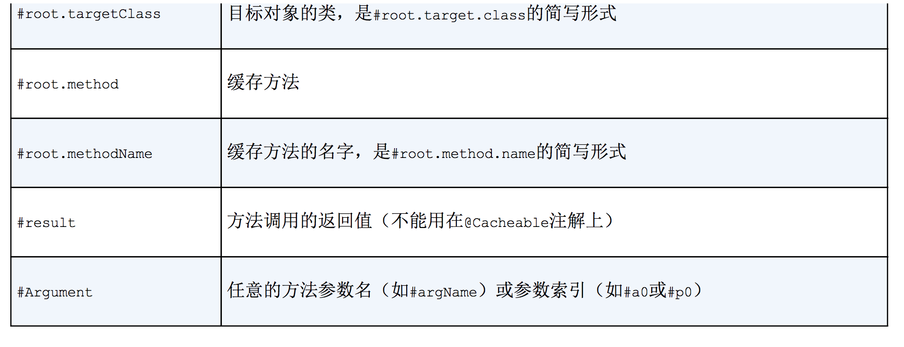
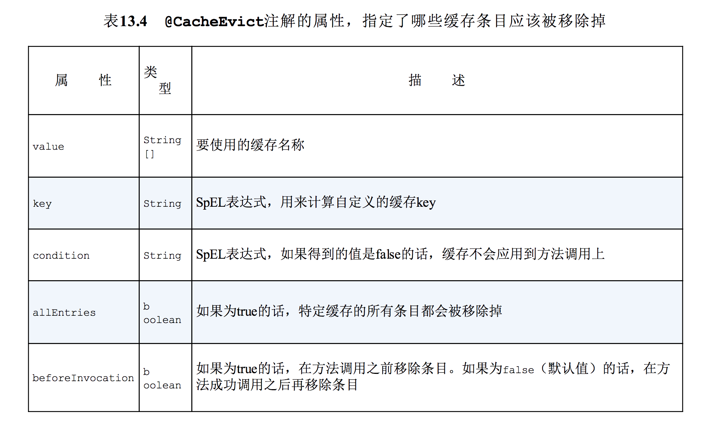
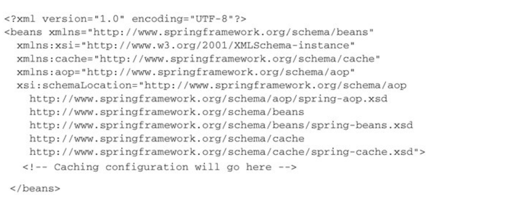
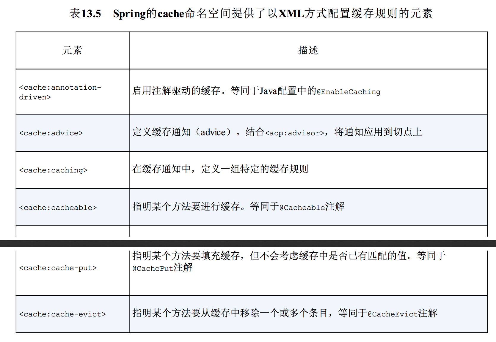
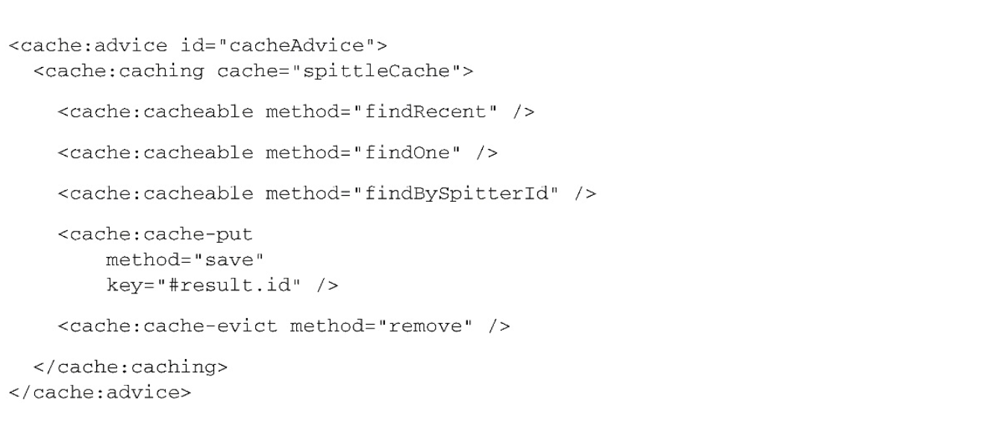

# 第13章 缓存数据
本章内容：

- 启用声明式缓存
- 使用Ehcache、Redis和GemFire实现缓存功能
- 注解驱动的缓存

你有没有遇到过有人反复问你同一个问题的场景，你刚刚给出完解答，马上就会被问相同的问题？我的孩子经常会问我这样的问题：

“我能吃点糖吗？”

“现在几点了？”

“我们到了吗？”

“我能吃点糖吗？”

在很多方面看来，在我们所编写的应用中，有些的组件也是这样的。无状态的组件一般来讲扩展性会更好一些，但它们也会更加倾向于一遍遍地问相同的问题。因为它们是无状态的，所以一旦当前的任务完成，就会丢弃掉已经获取到的所有解答，下一次需要相同的答案时，它们就不得不再问一遍这个问题。

对于所提出的问题，有时候需要一点时间进行获取或计算才能得到答案。我们可能需要在数据库中获取数据，调用远程服务或者执行复杂的计算。为了得到答案，这就会花费时间和资源。

如果问题的答案变更不那么频繁（或者根本不会发生变化），那么按照相同的方式再去获取一遍就是一种浪费了。除此之外，这样做还可能会对应用的性能产生负面的影响。一遍又一遍地问相同的问题，而每次得到的答案都是一样的，与其这样，我们还不如只问一遍并将答案记住，以便稍后再次需要时使用。

**缓存（Caching）**可以存储经常会用到的信息，这样每次需要的时候，这些信息都是立即可用的。在本章中，我们将会了解到Spring的缓存抽象。尽管Spring自身并没有实现缓存解决方案，但是它对缓存功能提供了声明式的支持，能够与多种流行的缓存实现进行集成。

## 13.1 启用对缓存的支持
Spring对缓存的支持有两种方式：

- 注解驱动的缓存
- XML声明的缓存

使用Spring的缓存抽象时，最为通用的方式就是在方法上添加@Cacheable和@CacheEvict注解。在本章中，大多数内容都会使用这种类型的声明式注解。在13.3小节中，我们会看到如何使用XML来声明缓存边界。

在往bean上添加缓存注解之前，必须要启用Spring对注解驱动缓存的支持。如果我们使用Java配置的话，那么可以在其中的一个配置类上添加@EnableCaching，这样的话就能启用注解驱动的缓存。的13.1展现了如何实际使用@EnableCaching。

程序清单13.1 通过使用@EnableCaching启用注解驱动的缓存

```
@Configuration
// 启动缓存
@EnableCaching
public class CachingConfig {

    /**
     * 声明缓存管理器
     *
     * @param cm
     * @return
     */
    @Bean
    public EhCacheCacheManager cacheManager(CacheManager cm) {
        return new EhCacheCacheManager(cm);
    }   
 }
```
如果以XML的方式配置应用的话，那么可以使用Spring cache命名空间中的<cache:annotation-driven>元素来启用注解驱动的缓存。

程序清单13.2 通过使用启用注解驱动的缓存

<div align="center">  </div><br>

其实在本质上，@EnableCaching和<cache:annotation-driven>的工作方式是相同的。它们都会创建一个切面（aspect）并触发Spring缓存注解的切点（pointcut）。根据所使用的注解以及缓存的状态，这个切面会从缓存中获取数据，将数据添加到缓存之中或者从缓存中移除某个值。

在程序清单13.1和程序清单13.2中，你可能已经注意到了，它们不仅仅启用了注解驱动的缓存，还声明了一个缓存管理器（cache manager）的bean。缓存管理器是Spring缓存抽象的核心，它能够与多个流行的缓存实现进行集成。

在本例中，声明了ConcurrentMapCacheManager，这个**简单的缓存管理器使用java.util.concurrent.ConcurrentHashMap作为其缓存存储。**它非常简单，因此对于开发、测试或基础的应用来讲，这是一个很不错的选择。但它的缓存存储是基于内存的，所以它的生命周期是与应用关联的，对于生产级别的大型企业级应用程序，这可能并不是理想的选择。

幸好，有多个很棒的缓存管理器方案可供使用。让我们看一下几个最为常用的缓存管理器。

### 13.1.1 配置缓存管理器
Spring 3.1内置了五个缓存管理器实现，如下所示：

- SimpleCacheManager
- NoOpCacheManager
- ConcurrentMapCacheManager
- CompositeCacheManager
- EhCacheCacheManager

Spring 3.2引入了另外一个缓存管理器，这个管理器可以用在基于JCache（JSR-107）的缓存提供商之中。除了核心的Spring框架，Spring Data又提供了两个缓存管理器：

- RedisCacheManager（来自于Spring Data Redis项目）
- GemfireCacheManager（来自于Spring Data GemFire项目）

所以可以看到，在为Spring的缓存抽象选择缓存管理器时，我们有很多可选方案。具体选择哪一个要取决于想要使用的底层缓存供应商。每一个方案都可以为应用提供不同风格的缓存，其中有一些会比其他的更加适用于生产环境。尽管所做出的选择会影响到数据如何缓存，但是Spring声明缓存的方式上并没有什么差别。

我们必须选择一个缓存管理器，然后要在Spring应用上下文中，以bean的形式对其进行配置。我们已经看到了如何配置ConcurrentMapCacheManager，并且知道它可能并不是实际应用的最佳选择。现在，看一下如何配置Spring其他的缓存管理器，从EhCacheCacheManager开始吧。

#### 使用Ehcache缓存
Ehcache是最为流行的缓存供应商之一。Ehcache网站上说它是“Java领域应用最为广泛的缓存”。鉴于它的广泛采用，Spring提供集成Ehcache的缓存管理器是很有意义的。这个缓存管理器也就是EhCacheCacheManager。

当读这个名字的时候，在cache这个词上似乎有点结结巴巴的感觉。在Spring中配置EhCacheCacheManager是很容易的。程序清单13.3展现了如何在Java中对其进行配置。

程序清单13.3 以Java配置的方式设置EhCacheCacheManager

```
import net.sf.ehcache.CacheManager;

import org.springframework.cache.annotation.EnableCaching;
import org.springframework.cache.ehcache.EhCacheCacheManager;
import org.springframework.cache.ehcache.EhCacheManagerFactoryBean;
import org.springframework.context.annotation.Bean;
import org.springframework.context.annotation.Configuration;
import org.springframework.core.io.ClassPathResource;

@Configuration
// 启动缓存
@EnableCaching
public class CachingConfig {

    /**
     * 配置 EhCacheCacheManager
     * 声明缓存管理器
     *
     * @param cm
     * @return
     */
    @Bean
    public EhCacheCacheManager cacheManager(CacheManager cm) {
        return new EhCacheCacheManager(cm);
    }

    /**
     * 配置 EhCacheManagerFactoryBean
     *
     * @return
     */
    @Bean
    public EhCacheManagerFactoryBean ehcache() {
        EhCacheManagerFactoryBean ehCacheFactoryBean = new EhCacheManagerFactoryBean();
        ehCacheFactoryBean.setConfigLocation(new ClassPathResource("spittr/cache/ehcache.xml"));
        return ehCacheFactoryBean;
    }

}
```

在程序清单13.3中，cacheManager()方法创建了一个EhCacheCacheManager的实例，这是通过传入Ehcache CacheManager实例实现的。在这里，稍微有点诡异的注入可能会让人感觉迷惑，这是因为Spring和EhCache都定义了CacheManager类型。需要明确的是，EhCache的CacheManager要被注入到Spring的EhCacheCacheManager（SpringCacheManager的实现）之中。

我们需要使用EhCache的CacheManager来进行注入，所以必须也要声明一个CacheManager bean。为了对其进行简化，Spring提供了EhCacheManagerFactoryBean来生成EhCache的CacheManager。方法ehcache()会创建并返回一个EhCacheManagerFactoryBean实例。因为它是一个工厂bean（也就是说，它实现了Spring的FactoryBean接口），所以注册在Spring应用上下文中的并不是EhCacheManagerFactoryBean的实例，而是CacheManager的一个实例，因此适合注入到EhCacheCacheManager之中。

除了在Spring中配置的bean，还需要有针对EhCache的配置。EhCache为XML定义了自己的配置模式，我们需要在一个XML文件中配置缓存，该文件需要符合EhCache所定义的模式。在创建EhCacheManagerFactoryBean的过程中，需要告诉它EhCache配置文件在什么地方。在这里通过调用setConfigLocation()方法，传入ClassPath-Resource，用来指明EhCache XML配置文件相对于根类路径（classpath）的位置。

至于ehcache.xml文件的内容，不同的应用之间会有所差别，但是至少需要声明一个最小的缓存。例如，如下的EhCache配置声明一个名为spittleCache的缓存，它最大的堆存储为50MB，存活时间为100秒。

```
<ehcache>
    <!--最大的堆存储为 50MB,存活时间为 100秒-->
    <cache name="spittleCache"
           maxBytesLocalHeap="50m"
           timeToLiveSeconds="100">
    </cache>
</ehcache>
```

显然，这是一个基础的EhCache配置。在你的应用之中，可能需要使用EhCache所提供的丰富的配置选项。参考EhCache的文档以了解调优EhCache配置的细节，地址是http://ehcache.org/documentation/configuration。

#### 使用Redis缓存
如果你仔细想一下的话，缓存的条目不过是一个键值对（key-value pair），其中key描述了产生value的操作和参数。因此，很自然地就会想到，Redis作为key-value存储，非常适合于存储缓存。

Redis可以用来为Spring缓存抽象机制存储缓存条目，Spring Data Redis提供了RedisCacheManager，这是CacheManager的一个实现。RedisCacheManager会与一个Redis服务器协作，并通过RedisTemplate将缓存条目存储到Redis中。

为了使用RedisCacheManager，我们需要RedisTemplate bean以及RedisConnectionFactory实现类（如JedisConnectionFactory）的一个bean。在第12章中，我们已经看到了这些bean该如何配置。在RedisTemplate就绪之后，配置RedisCacheManager就是非常简单的事情了，如程序清单13.4所示。

程序清单13.4 配置将缓存条目存储在Redis服务器的缓存管理器

```
import com.alan.yx.springInAction.Chapter_12.redis.src.main.java.cart.Product;
import net.sf.ehcache.CacheManager;

import org.springframework.cache.annotation.EnableCaching;
import org.springframework.cache.ehcache.EhCacheCacheManager;
import org.springframework.cache.ehcache.EhCacheManagerFactoryBean;
import org.springframework.context.annotation.Bean;
import org.springframework.context.annotation.Configuration;
import org.springframework.core.io.ClassPathResource;
import org.springframework.data.redis.cache.RedisCacheManager;
import org.springframework.data.redis.connection.RedisConnectionFactory;
import org.springframework.data.redis.connection.jedis.JedisConnectionFactory;
import org.springframework.data.redis.core.RedisTemplate;
import org.springframework.data.redis.serializer.Jackson2JsonRedisSerializer;
import org.springframework.data.redis.serializer.StringRedisSerializer;

@Configuration
// 启动缓存
@EnableCaching
public class CachingConfig {
    /**
     * 配置将缓存条目存储在Redis服务器的缓存管理器
     */
    /**
     * redis 缓存管理器
     *
     * @param redisTemplate
     * @return
     */
    @Bean
    public RedisCacheManager cacheManager(RedisTemplate redisTemplate) {
        return new RedisCacheManager(redisTemplate);
    }

    /**
     * redis 连接工厂
     *
     * @return
     */
    @Bean
    public RedisConnectionFactory redisCF() {
        return new JedisConnectionFactory();
    }

    /**
     * RedisTemplate bean
     *
     * @param cf
     * @return
     */
    @Bean
    public RedisTemplate<String, Product> redisTemplate(RedisConnectionFactory cf) {
        RedisTemplate<String, Product> redis = new RedisTemplate<String, Product>();
        redis.setConnectionFactory(cf);
        redis.setKeySerializer(new StringRedisSerializer());
        redis.setValueSerializer(new Jackson2JsonRedisSerializer<Product>(Product.class));
        return redis;
    }
   
}
```

可以看到，我们构建了一个RedisCacheManager，这是通过传递一个RedisTemplate实例作为其构造器的参数实现的。

#### 使用多个缓存管理器
我们并不是只能有且仅有一个缓存管理器。如果你很难确定该使用哪个缓存管理器，或者有合法的技术理由使用超过一个缓存管理器的话，那么可以尝试使用Spring的CompositeCacheManager。

CompositeCacheManager要通过一个或更多的缓存管理器来进行配置，它会迭代这些缓存管理器，以查找之前所缓存的值。以下的程序清单展现了如何创建CompositeCacheManager bean，它会迭代JCacheCacheManager、EhCacheCacheManager和RedisCacheManager。

程序清单13.5CompositeCacheManager会迭代一个缓存管理器的列表

```
 @Bean
    public CacheManager cacheManager(net.sf.ehcache.CacheManager cm, javax.cache.CacheManager jcm) {
        // 创建 CompositeCacheManager
        CompositeCacheManager cacheManager = new CompositeCacheManager();
        List<CacheManager> managers = new ArrayList<>();
        managers.add(new JCacheCacheManager(jcm));
        managers.add(new EnCacheCacheManager(cm));
        managers.add(new RedisCacheManager(redisTemplate()));
        cacheManager.setCacheManagers(managers);
        return cacheManager;
    }
```

当查找缓存条目时，CompositeCacheManager首先会从JCacheCacheManager开始检查JCache实现，然后通过EhCacheCacheManager检查Ehcache，最后会使用RedisCacheManager来检查Redis，完成缓存条目的查找。

在配置完缓存管理器并启用缓存后，就可以在bean方法上应用缓存规则了。让我们看一下如何使用Spring的缓存注解来定义缓存边界。


## 13.2 为方法添加注解以支持缓存
如前文所述，Spring的缓存抽象在很大程度上是围绕切面构建的。在Spring中启用缓存时，会创建一个切面，它触发一个或更多的Spring的缓存注解。表13.1列出了Spring所提供的缓存注解。

表13.1中的所有注解都能运用在方法或类上。当将其放在单个方法上时，注解所描述的缓存行为只会运用到这个方法上。如果注解放在类级别的话，那么缓存行为就会应用到这个类的所有方法上。

表13.1 Spring提供了四个注解来声明缓存规则

<div align="center">  </div><br>

### 13.2.1 填充缓存
我们可以看到，@Cacheable和@CachePut注解都可以填充缓存，但是它们的工作方式略有差异。

@Cacheable首先在缓存中查找条目，如果找到了匹配的条目，那么就不会对方法进行调用了。如果没有找到匹配的条目，方法会被调用并且返回值要放到缓存之中。而@CachePut并不会在缓存中检查匹配的值，目标方法总是会被调用，并将返回值添加到缓存之中。

@Cacheable和@CachePut有一些属性是共有的，参见表13.2。

表13.2 @Cacheable和@CachePut有一些共有的属性

<div align="center"> </div><br>

在最简单的情况下，在@Cacheable和@CachePut的这些属性中，只需使用value属性指定一个或多个缓存即可。例如，考虑SpittleRepository的findOne()方法。在初始保存之后，Spittle就不会再发生变化了。如果有的Spittle比较热门并且会被频繁请求，反复地在数据库中进行获取是对时间和资源的浪费。通过在findOne()方法上添加@Cacheable注解，如下面的程序清单所示，能够确保将Spittle保存在缓存中，从而避免对数据库的不必要访问。

程序清单13.6 通过使用@Cacheable，在缓存中存储和获取值

```
@Cacheable("spittleCache")
	public Spittle findOne(long id) {
		try {
			return jdbcTemplate.queryForObject(SELECT_SPITTLE_BY_ID, new SpittleRowMapper(), id);
		} catch (EmptyResultDataAccessException e) {
			return null;
		}
	}
```

当findOne()被调用时，缓存切面会拦截调用并在缓存中查找之前以名spittleCache存储的返回值。缓存的key是传递到findOne()方法中的id参数。如果按照这个key能够找到值的话，就会返回找到的值，方法不会再被调用。如果没有找到值的话，那么就会调用这个方法，并将返回值放到缓存之中，为下一次调用findOne()方法做好准备。

在程序清单13.6中，@Cacheable注解被放到了JdbcSpittleRepository的findOne()方法实现上。这样能够起作用，但是缓存的作用只限于JdbcSpittleRepository这个实现类中，SpittleRepository的其他实现并没有缓存功能，除非也为其添加上@Cacheable注解。因此，可以考虑将注解添加到SpittleRepository的方法声明上，而不是放在实现类中：

```
@Cacheable("spittleCache")
Spittle findOne(long id);
```

当为接口方法添加注解后，@Cacheable注解会被SpittleRepository的所有实现继承，这些实现类都会应用相同的缓存规则。

#### 将值放到缓存之中
@Cacheable会条件性地触发对方法的调用，这取决于缓存中是不是已经有了所需要的值，对于所注解的方法，@CachePut采用了一种更为直接的流程。带有@CachePut注解的方法始终都会被调用，而且它的返回值也会放到缓存中。这提供一种很便利的机制，能够让我们在请求之前预先加载缓存。

例如，当一个全新的Spittle通过SpittleRepository的save()方法保存之后，很可能马上就会请求这条记录。所以，当save()方法调用后，立即将Spittle塞到缓存之中是很有意义的，这样当其他人通过findOne()对其进行查找时，它就已经准备就绪了。为了实现这一点，可以在save()方法上添加@CachePut注解，如下所示：

```
@CachePut(value="spittleCache")
Spittle save(Spittle spittle);
```

当save()方法被调用时，它首先会做所有必要的事情来保存Spittle，然后返回的Spittle会被放到spittleCache缓存中。在这里只有一个问题：缓存的key。如前文所述，默认的缓存key要基于方法的参数来确定。因为save()方法的唯一参数就是Spittle，所以它会用作缓存的key。将Spittle放在缓存中，而它的缓存key恰好是同一个Spittle，这是不是有一点诡异呢？

显然，在这个场景中，默认的缓存key并不是我们想要的。我们需要的缓存key是新保存Spittle的ID，而不是Spittle本身。所以，在这里需要指定一个key而不是使用默认的key。让我们看一下怎样自定义缓存key。

#### 自定义缓存key
@Cacheable和@CachePut都有一个名为key属性，这个属性能够替换默认的key，它是通过一个SpEL表达式计算得到的。任意的SpEL表达式都是可行的，但是更常见的场景是所定义的表达式与存储在缓存中的值有关，据此计算得到key。

具体到我们这个场景，我们需要将key设置为所保存Spittle的ID。以参数形式传递给save()的Spittle还没有保存，因此并没有ID。我们只能通过save()返回的Spittle得到id属性。

幸好，在为缓存编写SpEL表达式的时候，Spring暴露了一些很有用的元数据。表13.3列出了SpEL中可用的缓存元数据。

表13.3 Spring提供了多个用来定义缓存规则的SpEL扩展

<div align="center">  </div><br>
<div align="center">  </div><br>

对于save()方法来说，我们需要的键是所返回Spittle对象的id属性。表达式#result能够得到返回的Spittle。借助这个对象，我们可以通过将key属性设置为#result.id来引用id属性：

```
@CachePut(value="spittleCache",key="#result.id")
Spittle save(Spittle spittle);
```

按照这种方式配置@CachePut，缓存不会去干涉save()方法的执行，但是返回的Spittle将会保存在缓存中，并且缓存的key与Spittle的id属性相同。

#### 条件化缓存
通过为方法添加Spring的缓存注解，Spring就会围绕着这个方法创建一个缓存切面。但是，在有些场景下我们可能希望将缓存功能关闭。

@Cacheable和@CachePut提供了两个属性用以实现条件化缓存：unless和condition，这两个属性都接受一个SpEL表达式。如果unless属性的SpEL表达式计算结果为true，那么缓存方法返回的数据就不会放到缓存中。与之类似，如果condition属性的SpEL表达式计算结果为false，那么对于这个方法缓存就会被禁用掉。

表面上来看，unless和condition属性做的是相同的事情。但是，这里有一点细微的差别。unless属性只能阻止将对象放进缓存，但是在这个方法调用的时候，依然会去缓存中进行查找，如果找到了匹配的值，就会返回找到的值。与之不同，如果condition的表达式计算结果为false，那么在这个方法调用的过程中，缓存是被禁用的。就是说，不会去缓存进行查找，同时返回值也不会放进缓存中。

作为样例（尽管有些牵强），假设对于message属性包含“NoCache”的Spittle对象，我们不想对其进行缓存。为了阻止这样的Spittle对象被缓存起来，可以这样设置unless属性：

```
 @Cacheable(value = "spittleCache",unless = "#result.message.contains('NoCache')")
  Spittle findOne(long id);
```

为unless设置的SpEL表达式会检查返回的Spittle对象（在表达式中通过#result来识注意：别）的message属性。如果它包含“NoCache”文本内容，那么这个表达式的计算值为true，这个Spittle对象不会放进缓存中。否则的话，表达式的计算结果为false，无法满足unless的条件，这个Spittle对象会被缓存。

属性unless能够阻止将值写入到缓存中，但是有时候我们希望将缓存全部禁用。也就是说，在一定的条件下，我们既不希望将值添加到缓存中，也不希望从缓存中获取数据。

例如，对于ID值小于10的Spittle对象，我们不希望对其使用缓存。在这种场景下，这些Spittle是用来进行调试的测试条目，对其进行缓存并没有实际的价值。为了要对ID小于10的Spittle关闭缓存，可以在@Cacheable上使用condition属性，如下所示：

```
 @Cacheable(value = "spittleCache",
            unless = "#result.message.contains('NoCache')",
            condition = "#id>=10")
    Spittle findOne(long id);
```

如果findOne()调用时，参数值小于10，那么将不会在缓存中进行查找，返回的Spittle也不会放进缓存中，就像这个方法没有添加@Cacheable注解一样。

如样例所示，unless属性的表达式能够通过#result引用返回值。这是很有用的，这么做之所以可行是因为unless属性只有在缓存方法有返回值时才开始发挥作用。而condition肩负着在方法上禁用缓存的任务，因此它不能等到方法返回时再确定是否该关闭缓存。这意味着它的表达式必须要在进入方法时进行计算，所以我们不能通过#result引用返回值。

我们现在已经在缓存中添加了内容，但是这些内容能被移除掉吗？接下来看一下如何借助@CacheEvict将缓存数据移除掉。

### 13.2.2 移除缓存条目
@CacheEvict并不会往缓存中添加任何东西。相反，如果带有@CacheEvict注解的方法被调用的话，那么会有一个或更多的条目会在缓存中移除。

那么在什么场景下需要从缓存中移除内容呢？当缓存值不再合法时，我们应该确保将其从缓存中移除，这样的话，后续的缓存命中就不会返回旧的或者已经不存在的值，其中一个这样的场景就是数据被删除掉了。这样的话，SpittleRepository的remove()方法就是使用@CacheEvict的绝佳选择：

```
@CacheEvict(value = "spittleCache", condition = "")
    void remove(long spittleId);
```

> 注意:与@Cacheable和@CachePut不同，@CacheEvict能够应用在返回值为void的方法上，而@Cacheable和@CachePut需要非void的返回值，它将会作为放在缓存中的条目。因为@CacheEvict只是将条目从缓存中移除，因此它可以放在任意的方法上，甚至void方法。

从这里可以看到，当remove()调用时，会从缓存中删除一个条目。被删除条目的key与传递进来的spittleId参数的值相等。

@CacheEvict有多个属性，如表13.4所示，这些属性会影响到该注解的行为，使其不同于默认的做法。

可以看到，@CacheEvict的一些属性与@Cacheable和@CachePut是相同的，另外还有几个新的属性。与@Cacheable和@CachePut不同，@CacheEvict并没有提供unless属性。

Spring的缓存注解提供了一种优雅的方式在应用程序的代码中声明缓存规则。但是，Spring还为缓存提供了XML命名空间。在结束对缓存的讨论之前，我们快速地看一下如何以XML的形式配置缓存规则。

表13.4 @CacheEvict注解的属性，指定了哪些缓存条目应该被移除掉

<div align="center">  </div><br>

## 13.3 使用XML声明缓存
你可能想要知道为什么想要以XML的方式声明缓存。毕竟，本章中我们所看到的缓存注解要优雅得多。

我认为有两个原因：

- 你可能会觉得在自己的源码中添加Spring的注解有点不太舒服；
- 你需要在没有源码的bean上应用缓存功能。

在上面的任意一种情况下，最好（或者说需要）将缓存配置与缓存数据的代码分隔开来。Spring的cache命名空间提供了使用XML声明缓存规则的方法，可以作为面向注解缓存的替代方案。因为缓存是一种面向切面的行为，所以cache命名空间会与Spring的aop命名空间结合起来使用，用来声明缓存所应用的切点在哪里。

要开始配置XML声明的缓存，首先需要创建Spring配置文件，这个文件中要包含cache和aop命名空间：

<div align="center">  </div><br>

cache命名空间定义了在Spring XML配置文件中声明缓存的配置元素。表13.5列出了cache命名空间所提供的所有元素。

表13.5 Spring的cache命名空间提供了以XML方式配置缓存规则的元素

<div align="center">  </div><br>

<cache:annotation-driven>元素与Java配置中所对应的@EnableCaching非常类似，会启用注解驱动的缓存。我们已经讨论过这种风格的缓存，因此没有必要再对其进行介绍。

表13.5中其他的元素都用于基于XML的缓存配置。接下来的代码清单展现了如何使用这些元素为SpittleRepositorybean配置缓存，其作用等同于本章前面章使用缓存注解的方式。

程序清单13.7 使用XML元素为SpittleRepository声明缓存规则

<div align="center">  </div><br>

在程序清单13.7中，我们首先看到的是<aop:advisor>，它引用ID为cacheAdvice的通知，该元素将这个通知与一个切点进行匹配，因此建立了一个完整的切面。在本例中，这个切面的切点会在执行SpittleRepository的任意方法时触发。如果这样的方法被Spring应
用上下文中的任意某个bean所调用，那么就会调用切面的通知。

在这里，通知利用<cache:advice>元素进行了声明。在<cache:advice>元素中，可以包含任意数量的<cache:caching>元素，这些元素用来完整地定义应用的缓存规则。在本例中，只包含了一个<cache:caching>元素。这个元素又包含了三个<cache:cacheable>元素和一个<cache:cache-put>元素。

每个<cache:cacheable>元素都声明了切点中的某一个方法是支持缓存的。这是与@Cacheable注解同等作用的XML元素。具体来讲，findRecent()、findOne()和findBySpitterId()都声明为支持缓存，它们的返回值将会保存在名为spittleCache的缓存之中。

<cache:cache-put>是Spring XML中与@CachePut注解同等作用的元素。它表明一个方法的返回值要填充到缓存之中，但是这个方法本身并不会从缓存中获取返回值。在本例中，save()方法用来填充缓存。同面向注解的缓存一样，我们需要将默认的key改为返回Spittle对象的id属性。

最后，<cache:cache-evict>元素是Spring XML中用来替代@CacheEvict注解的。它会从缓存中移除元素，这样的话，下次有人进行查找的时候就找不到了。在这里，调用remove()时，会将缓存中的Spittle删除掉，其中key与remove()方法所传递进来的ID参数相等的条目会从缓存中移除。

需要注意的是，<cache:advice>元素有一个cache-manager元素，用来指定作为缓存管理器的bean。它的默认值是cacheManager，这与程序清单13.7底部的<bean>声明恰好是一致的，所以没有必要再显式地进行设置。但是，如果缓存管理器的ID与之不同的话（使用多个缓存管理器的时候，可能会遇到这样的场景），那么可以通过设置cache-manager属性指定要使用哪个缓存管理器。

另外，还要留意的是，<cache:cacheable>、<cache:cache-put>和<cache:cache-evict>元素都引用了同一个名为spittleCache的缓存。为了消除这种重复，我们可以在<cache:caching>元素上指明缓存的名字：

<div align="center">  </div><br>

<cache:caching>有几个可以供<cache:cacheable>、<cache:cache-put>和<cache:cache-evict>共享的属性，包括：

- cache：指明要存储和获取值的缓存；
- condition：SpEL表达式，如果计算得到的值为false，将会为这个方法禁用缓存；
- key：SpEL表达式，用来得到缓存的key（默认为方法的参数）；
- method：要缓存的方法名
- 除此之外，<cache:cacheable>和<cache:cache-put>还有一个unless属性，可以为这个可选的属性指定一个SpEL表达式，如果这个表达式的计算结果为true，那么将会阻止将返回值放到缓存之中。

<cache:cache-evict>元素还有几个特有的属性：

- all-entries：如果是true的话，缓存中所有的条目都会被移除掉。如果是false的话，只有匹配key的条目才会被移除掉。
- before-invocation：如果是true的话，缓存条目将会在方法调用之前被移除掉。如果是false的话，方法调用之后才会移除缓存。

all-entries和before-invocation的默认值都是false。这意味着在使用<cache:cache-evict>元素且不配置这两个属性时，会在方法调用完成后只删除一个缓存条目。要删除的条目会通过默认的key（基于方法的参数）进行识别，当然也可以通过为名为key的属性设置一个SpEL表达式指定要删除的key。

## 13.4 小结
如果想让应用程序避免一遍遍地为同一个问题推导、计算或查询答案的话，缓存是一种很棒的方式。当以一组参数第一次调用某个方法时，返回值会被保存在缓存中，如果这个方法再次以相同的参数进行调用时，这个返回值会从缓存中查询获取。在很多场景中，从缓存查找值会比其他的方式（比如，执行数据库查询）成本更低。因此，缓存会对应用程序的性能带来正面的影响。

在本章中，我们看到了如何在Spring应用中声明缓存。首先，看到的是如何声明一个或更多的Spring缓存管理器。然后，将缓存用到了Spittr应用程序中，这是通过将@Cacheable、@CachePut和@CacheEvict添加到SpittleRepository上实现的。

我们还看到了如何借助XML将缓存规则的配置与应用程序代码分离开来。<cache:cacheable>、<cache:cache-put>和<cache:cache-evict>元素的作用与本章前面所使用的注解是一致的。

在这个过程中，我们讨论了缓存实际上是一种面向切面的行为。Spring将缓存实现为一个切面。在使用XML声明缓存规则时，这一点非常明显：我们必须要将缓存通知绑定到一个切点上。

Spring在将安全功能应用到方法上时，同样使用了切面。在下一章中，我们将会看到如何借助Spring Security确保bean方法的安全性。