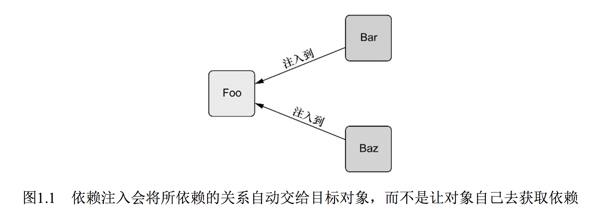
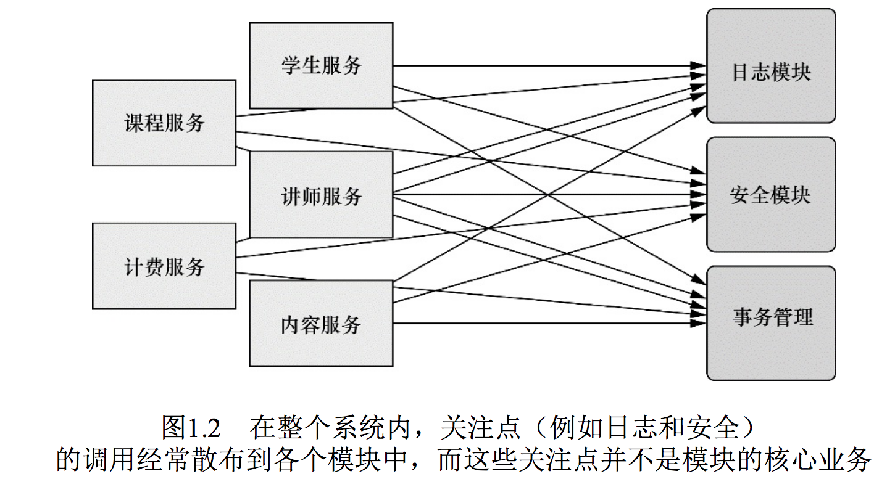
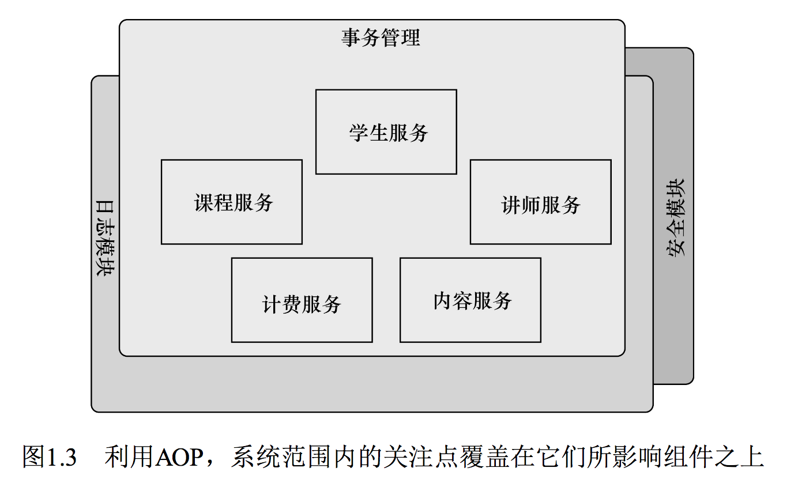
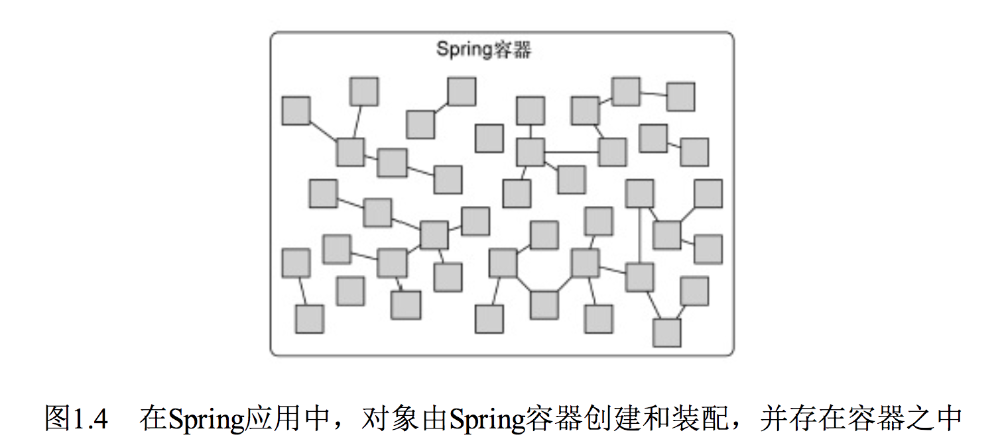
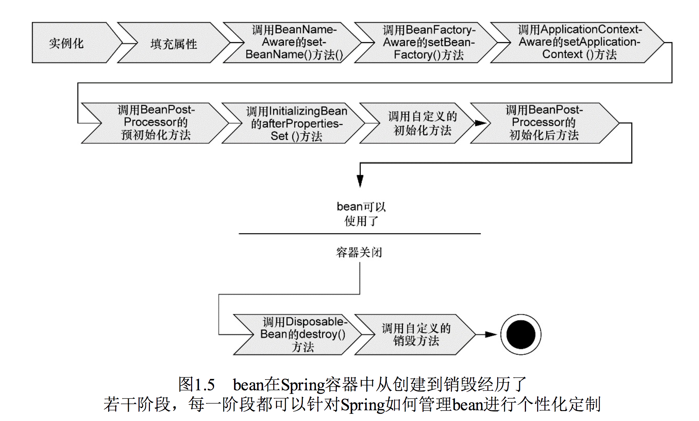
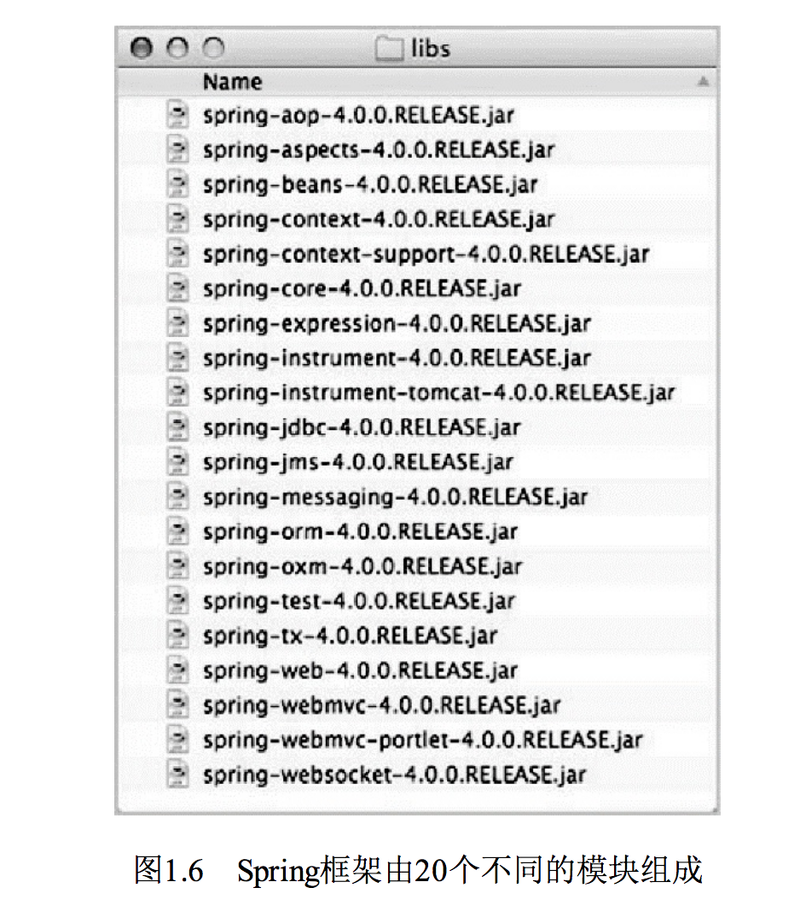
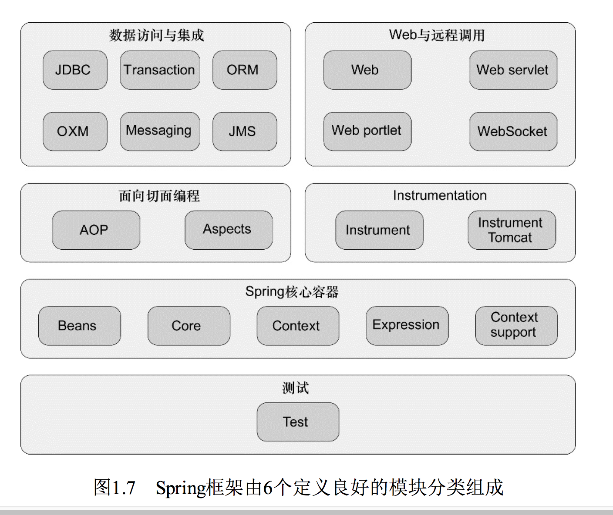

Spring 实战
=======

# 第 1 章 Spring 之旅
## 1.1 简化 Java 开发
Spring最根本的使命上：**简化Java开发**

#### 为了降低Java开发的复杂性，Spring采取了以下4种关键策略：

* 基于**POJO**的轻量级和最小侵入性编程；
* 通过**依赖注入**和**面向接口**实现松耦合；
* 基于**切面和惯例**进行声明式编程；
* 通过**切面和模板**减少样板式代码

### 1.1.1 激发POJO的潜能
Spring竭力避免因自身的API而弄乱你的应用代码===> 非侵入式的编程

基于Spring构建的应用中，它的类通常没有任何痕迹表明你使用了Spring。最坏的场景是，一个类或许会使用Spring注解，但它依旧是`POJO`。

【示例】 1.1 HelloWorldBean类：

> 程序清单1.1 Spring不会在`HelloWorldBean`上有任何不合理的要求.

~~~
public class HelloWorldBean {

    public String sayHello() {
        return "hello world";
    }
}
~~~

没有任何地方表明它是一个Spring组件。Spring的非侵入编程模型意味着这个类在Spring应用和非Spring应用中都可以发挥同样的作用。

尽管形式看起来很简单，但`POJO`一样可以具有魔力。Spring赋予POJO魔力的方式之一就是通过`DI`来装配它们。让我们看看`DI`是如何帮助应用对象彼此之间保持松散耦合的。

### 1.1.2 依赖注入
#### DI功能是如何实现的？
- 传统做法的问题

任何一个有实际意义的应用（肯定比`Hello World`示例更复杂）都会由两个或者更多的类组成，这些类相互之间进行协作来完成特定的业务逻辑。按照传统的做法，**每个对象负责管理与自己相互协作的对象（即它所依赖的对象）的引用【传统做法的问题】**，这将会导致**高度耦合和难以测试**的代码。

【示例】1.2所展现的Knight类

> 程序清单1.2DamselRescuingKnight只能执行RescueDamselQuest探险任务

~~~
public class DamselRescuingKnight implements Knight {

    private RescueDamselQuest quest;

    public DamselRescuingKnight() {
        //  与RescueDamselQuest 紧耦合
        this.quest = new RescueDamselQuest();
    }

    @Override
    public void embarkOnQuest() {
        quest.embark();
    }

}
~~~

可以看到，`DamselRescuingKnight`在它的构造函数中自行创建了`RescueDamselQuest`。这使得`DamselRescuingKnight`紧密地和`RescueDamselQuest`**耦合**到了一起，因此极大地限制了这个骑士执行探险的能力

> 耦合具有两面性（two-headed beast）:
> 
> 一方面，紧密耦合的代码难以测试、难以复用、难以理解，并且典型地表现出“打地鼠”式的bug特性（修复一个bug，将会出现一个或者更多新的bug）。
> 
> 另一方面，一定程度的耦合又是必须的——完全没有耦合的代码什么也做不了。为了完成有实际意义的功能，不同的类必须以适当的方式进行交互。总而言之，耦合是必须的，但应当被小心谨慎地管理

#### 通过DI，对象的依赖关系将由系统中负责协调各对象的第三方组件在创建对象的时候进行设定。
对象无需自行创建或管理它们的依赖关系，如图1.1所示，依赖关系将被自动注入到需要它们的对象当中去,见代码1.3

# 
  
 

【示例】程序清单1.3 `BraveKnight`足够灵活可以接受任何赋予他的探险任务

~~~
public class BraveKnight implements Knight {

  private Quest quest;

  /**
   * Quest 被注入进来
   * @param quest
   */
  public BraveKnight(Quest quest) {
    this.quest = quest;
  }

  @Override
  public void embarkOnQuest() {
    quest.embark();
  }

}
~~~

不同于之前的`DamselRescuingKnight`，`BraveKnight`没有自行创建探险任务，而是在构造的时候把探险任务作为构造器参数传入。这是依赖注入的方式之一，**即构造器注入（constructor injection）**

- **构造器注入（constructor injection）**

更重要的是，传入的探险类型是`Quest`，也就是所有探险任务都必须实现的一个接口。所以，BraveKnight能够响应RescueDamselQuest、SlayDragonQuest、MakeRoundTableRounderQuest等任意的Quest实现

- 参数传入**接口**而不是具体实现，能更加通用和灵活

要点是BraveKnight没有与任何特定的Quest实现发生耦合。对它来说，被要求挑战的探险任务只要实现了Quest接口，那么具体是哪种类型的探险就无关紧要了。这就是DI所带来的最大收益——松耦合。如果一个对象只通过接口（而不是具体实现或初始化过程）来表明依赖关系，那么这种依赖就能够在对象本身毫不知情的情况下，用不同的具体实现进行替换。

- DI所带来的最大收益 ——**松耦合**

对依赖进行替换的一个最常用方法就是在测试的时候使用**mock**实现。我们无法充分地测试DamselRescuingKnight，因为它是紧耦合的；但是可以轻松地测试BraveKnight，只需给它一个Quest的mock实现即可，如程序清单1.4所示

- **学习 mock 做单元测试**

 todo 学习 mock 做单元测试

~~~
package com.alan.yx.springInAction.Chapter_01.knight.src.test.java.sia.knights;

import com.alan.yx.springInAction.Chapter_01.knight.src.main.java.sia.knights.BraveKnight;
import com.alan.yx.springInAction.Chapter_01.knight.src.main.java.sia.knights.Quest;
import org.junit.Test;

import static org.mockito.Mockito.*;

public class BraveKnightTest {

    @Test
    public void knightShouldEmbarkOnQuest() {
        Quest mockQuest = mock(Quest.class);
        BraveKnight knight = new BraveKnight(mockQuest);
        knight.embarkOnQuest();
        verify(mockQuest, times(1)).embark();
    }

}
~~~

可以使用mock框架**Mockito**去创建一个Quest接口的mock实现。通过这个mock对象，就可以创建一个新的BraveKnight实例，并通过构造器注入这个mockQuest。当调用embarkOnQuest()方法时，你可以要求Mockito框架验证Quest的mock实现的embark()方法仅仅被调用了一次。

#### 将Quest注入到Knight中
现在BraveKnight类可以接受你传递给它的任意一种Quest的实现，但该怎样把特定的Query实现传给它呢？假设，希望BraveKnight所要进行探险任务是杀死一只怪龙，那么程序清单1.5中的SlayDragonQuest也许是挺合适的。

【示例】 程序清单1.5 SlayDragonQuest是要注入到BraveKnight中的Quest实现

~~~
package com.alan.yx.springInAction.Chapter_01.knight.src.main.java.sia.knights;

import java.io.PrintStream;

public class SlayDragonQuest implements Quest {

    private PrintStream stream;

    public SlayDragonQuest(PrintStream stream) {
        this.stream = stream;
    }

    @Override
    public void embark() {
        stream.println("Embarking on quest to slay the dragon!");
    }

}
~~~

我们可以看到，SlayDragonQuest实现了Quest接口，这样它就适合注入到BraveKnight中去了。与其他的Java入门样例有所不同，SlayDragonQuest没有使用`System.out.println()`，而是在构造方法中请求一个更为通用的**PrintStream**。这里最大的问题在于，我们该如何将SlayDragonQuest交给BraveKnight呢？又如何将PrintStream交给SlayDragonQuest呢？

- 创建应用组件之间协作的行为通常称为**装配（wiring）**
- 装配方式: xml 和 基于java配置

Spring有多种装配bean的方式，采用`XML`是很常见的一种装配方式。程序清单1.6展现了一个简单的Spring配置文件：knights.xml，该配置文件将BraveKnight、SlayDragonQuest和PrintStream装配到了一起。

【示例】 程序清单1.6 使用Spring将SlayDragonQuest注入到BraveKnight中
~~~
<?xml version="1.0" encoding="UTF-8"?>
<beans xmlns="http://www.springframework.org/schema/beans"
       xmlns:xsi="http://www.w3.org/2001/XMLSchema-instance"
       xsi:schemaLocation="http://www.springframework.org/schema/beans 
      http://www.springframework.org/schema/beans/spring-beans.xsd">

    <!-- 创建 BraveKnight-->
    <bean id="knight" class="com.alan.yx.springInAction.Chapter_01.knight.src.main.java.sia.knights.BraveKnight">
        <!--注入 quest bean-->
        <constructor-arg ref="quest"/>
    </bean>

    <bean id="quest" class="com.alan.yx.springInAction.Chapter_01.knight.src.main.java.sia.knights.SlayDragonQuest">
        <constructor-arg value="#{T(System).out}"/>
    </bean>

</beans>
~~~

在这里，BraveKnight和SlayDragonQuest被声明为Spring中的bean。就BraveKnightbean来讲，它在构造时传入了对SlayDragonQuest bean的`引用`，将其作为构造器参数。同时，SlayDragonQuest bean的声明使用了**Spring表达式语言（Spring ExpressionLanguage）**，将System.out（这是一个PrintStream）传入到了SlayDragonQuest的构造器中。

- **Spring表达式语言（Spring ExpressionLanguage）**

 todo 学习 Spring表达式语言

如果XML配置不符合你的喜好的话，Spring还支持使用Java来描述配置。比如，程序清单1.7展现了基于Java的配置，它的功能与程序清单1.6相同。

【示例】程序清单1.7 Spring提供了基于Java的配置，可作为XML的替代方案
~~~
package com.alan.yx.springInAction.Chapter_01.knight.src.main.java.sia.knights.config;

import com.alan.yx.springInAction.Chapter_01.knight.src.main.java.sia.knights.BraveKnight;
import com.alan.yx.springInAction.Chapter_01.knight.src.main.java.sia.knights.Knight;
import com.alan.yx.springInAction.Chapter_01.knight.src.main.java.sia.knights.Quest;
import com.alan.yx.springInAction.Chapter_01.knight.src.main.java.sia.knights.SlayDragonQuest;
import org.springframework.context.annotation.Bean;
import org.springframework.context.annotation.Configuration;

@Configuration
public class KnightConfig {

  @Bean
  public Knight knight() {
    return new BraveKnight(quest());
  }
  
  @Bean
  public Quest quest() {
    return new SlayDragonQuest(System.out);
  }

}
~~~

不管你使用的是基于XML的配置还是基于Java的配置，DI所带来的收益都是相同的。尽管BraveKnight依赖于Quest，但是它并不知道传递给它的是什么类型的Quest，也不知道这个Quest来自哪里。与之类似，SlayDragonQuest依赖于PrintStream，但是在编码时它并不需要知道这个PrintStream是什么样子的。只有Spring通过它的配置，能够了解这些组成部分是如何装配起来的。这样的话，就可以**在不改变所依赖的类的情况下，修改依赖关系**。

这个样例展现了在Spring中装配bean的一种简单方法。谨记现在不要过多关注细节。第2章我们会深入讲解Spring的配置文件，同时还会了解Spring装配bean的其他方式，甚至包括一种让Spring自动发现bean并在这些bean之间建立关联关系的方式。

现在已经声明了BraveKnight和Quest的关系，接下来我们只需要装载XML配置文件，并把应用启动起来。

#### 观察它如何工作
- **Spring通过应用上下文`（Application Context）`装载bean的定义并把它们组装起来**。
- Spring应用上下文全权负责对象的创建和组装。

Spring自带了多种应用上下文的实现，它们之间主要的区别仅仅在于如何加载配置。(如xml,注解等)

因为knights.xml中的bean是使用XML文件进行配置的，所以选择ClassPathXmlApplicationContext[1]作为应用上下文相对是比较合适的。该类加载位于应用程序类路径下的一个或多个XML配置文件。程序清单1.8中的main()方法调用ClassPathXmlApplicationContext加载knights.xml，并获得Knight对象的引用。

【示例】程序清单1.8 KnightMain.java加载包含Knight的Spring上下文

~~~
package com.alan.yx.springInAction.Chapter_01.knight.src.main.java.sia.knights;

import org.springframework.context.support.
        ClassPathXmlApplicationContext;

public class KnightMain {

    public static void main(String[] args) throws Exception {
        // 加载 spring 上下文
        ClassPathXmlApplicationContext context =
                new ClassPathXmlApplicationContext(
                        "META-INF/INF/spring/knight.xml");
        // 获取 knight bean
        Knight knight = context.getBean(Knight.class);
        // 使用 knight bean
        knight.embarkOnQuest();
        context.close();
    }
}
~~~

这里的main()方法基于knights.xml文件创建了Spring应用上下文。随后它调用该应用上下文获取一个ID为knight的bean。得到Knight对象的引用后，只需简单调用embarkOnQuest()方法就可以执行所赋予的探险任务了。注意这个类完全不知道我们的英雄骑士接受哪种探险任务，而且完全没有意识到这是由BraveKnight来执行的。只有knights.xml文件知道哪个骑士执行哪种探险任务。通过示例我们对依赖注入进行了一个快速介绍。纵览全书，你将对依赖注入有更多的认识。如果你想了解更多关于依赖注入的信息，我推荐阅读Dhanji R. Prasanna的《DependencyInjection》，该著作覆盖了依赖注入的所有内容。

现在让我们再关注Spring简化Java开发的下一个理念：**基于切面进行声明式编程**。

### 1.1.3 应用切面
- DI能够让相互协作的软件组件保持松散耦合，而**面向切面编程（aspect-orientedprogramming，AOP）**允许你把**遍布应用各处的功能分离出来形成可重用的组件**。

面向切面编程往往被定义为促使软件系统实现关注点的分离一项技术。系统由许多不同的组件组成，每一个组件各负责一块特定功能。除了实现自身核心的功能之外，这些组件还经常承担着额外的职责。诸如日志、事务管理和安全这样的系统服务经常融入到自身具有核心业务逻辑的组件中去，这些系统服务通常被称为**横切关注点**，因为它们会跨越系统的多个组件。

- **横切关注点**

#### 为什么需要 AOP？
如果将这些关注点分散到多个组件中去，你的代码将会带来双重的复杂性。

* 实现系统关注点功能的代码将会`重复出现`在多个组件中。这意味着如果你要改变这些关注点的逻辑，必须修改各个模块中的相关实现。即使你把这些关注点抽象为一个独立的模块，其他模块只是调用它的方法，但方法的调用还是会重复出现在各个模块中。
* 组件会因为那些与自身核心业务无关的代码而`变得混乱`。一个向地址簿增加地址条目的方法应该只关注如何添加地址，而不应该关注它是不是安全的或者是否需要支持事务。

图1.2展示了这种复杂性。左边的业务对象与系统级服务结合得过于紧密。每个对象不但要知道它需要记日志、进行安全控制和参与事务，还要亲自执行这些服务。

  
 

AOP能够使这些**服务模块化**，并以声明的方式将它们应用到它们需要影响的组件中去。所造成的结果就是这些**组件会具有更高的内聚性并且会更加关注自身的业务**，完全不需要了解涉及系统服务所带来复杂性。总之，AOP能够确保POJO的简单性。

- **服务模块化**

如图1.3所示，我们可以把切面想象为覆盖在很多组件之上的一个**外壳**。应用是由那些实现各自业务功能的模块组成的。**借助AOP，可以使用各种功能层去包裹核心业务层**。**这些层以声明的方式灵活地应用到系统中，你的核心应用甚至根本不知道它们的存在。这是一个非常强大的理念，可以将安全、事务和日志关注点与核心业务逻辑相分离。**

  
 

为了示范在Spring中如何应用切面，让我们重新回到骑士的例子，并为它添加一个切面。

#### AOP应用
每一个人都熟知骑士所做的任何事情，这是因为吟游诗人用诗歌记载了骑士的事迹并将其进行传唱。假设我们需要使用吟游诗人这个服务类来记载骑士的所有事迹。程序清单1.9展示了我们会使用的Minstrel类。

【示例】程序清单1.9 吟游诗人是中世纪的音乐记录器
~~~
package com.alan.yx.springInAction.Chapter_01.knight.src.main.java.sia.knights;

import java.io.PrintStream;

/**
 * 示例 1.9
 * 吟游诗人
 */
public class Minstrel {

    private PrintStream stream;

    public Minstrel(PrintStream stream) {
        this.stream = stream;
    }

    /**
     * 探险之前调用
     */
    public void singBeforeQuest() {
        stream.println("Fa la la, the knight is so brave!");
    }

    /**
     * 探险之后调用
     */
    public void singAfterQuest() {
        stream.println("Tee hee hee, the brave knight " +
                "did embark on a quest!");
    }

}
~~~

正如你所看到的那样，Minstrel是只有两个方法的简单类。在骑士执行每一个探险任务之前，singBeforeQuest()方法会被调用；在骑士完成探险任务之后，singAfterQuest()方法会被调用。在这两种情况下，Minstrel都会通过一个PrintStream类来歌颂骑士的事迹，这个类是通过构造器注入进来的。

把Minstrel加入你的代码中并使其运行起来，这对你来说是小事一桩。我们适当做一下调整从而让BraveKnight可以使用Minstrel。程序清单1.10展示了将BraveKnight和Minstrel组合起来的第一次尝试。

【示例】程序清单1.10 BraveKnight必须要调用Minstrel的方法

~~~
package com.alan.yx.springInAction.Chapter_01.knight.src.main.java.sia.knights;

/**
 * 示例 1.10
 *
 * @author yinxing
 * @date 2019/4/20
 */

public class BraveKnightWithoutAOP implements Knight {

    private Quest quest;

    private Minstrel minstrel;

    public BraveKnightWithoutAOP(Quest quest, Minstrel minstrel) {
        this.quest = quest;
        this.minstrel = minstrel;
    }

    /**
     * Knight 不应该管理 Minstrel
     * 

     * 骑士应该专注于探险，不应该关注吟唱诗人
     */
    @Override
    public void embarkOnQuest() {
        minstrel.singBeforeQuest();
        quest.embark();
        minstrel.singAfterQuest();
    }
}
~~~

这应该可以达到预期效果。现在，你所需要做的就是回到Spring配置中，声明Minstrelbean并将其注入到BraveKnight的构造器之中。但是，请稍等......

我们似乎感觉有些东西不太对。管理他的吟游诗人真的是骑士职责范围内的工作吗？在我看来，吟游诗人应该做他份内的事，根本不需要骑士命令他这么做。毕竟，用诗歌记载骑士的
探险事迹，这是吟游诗人的职责。为什么骑士还需要提醒吟游诗人去做他份内的事情呢？此外，因为骑士需要知道吟游诗人，所以就必须把吟游诗人注入到BarveKnight类中。这不仅使BraveKnight的代码复杂化了，而且还让我疑惑是否还需要一个不需要吟游诗人的骑士呢？如果Minstrel为null会发生什么呢？我是否应该引入一个空值校验逻辑来覆盖该场景？

简单的BraveKnight类开始变得复杂，如果你还需要应对没有吟游诗人时的场景，那代码会变得更复杂。但利用AOP，你可以声明吟游诗人必须歌颂骑士的探险事迹，而骑士本身并不用直接访问Minstrel的方法。

要将Minstrel抽象为一个切面，你所需要做的事情就是在一个Spring配置文件中声明它。程序清单1.11是更新后的knights.xml文件，Minstrel被声明为一个切面。

【示例】程序清单1.11 将Minstrel声明为一个切面

~~~
<?xml version="1.0" encoding="UTF-8"?>
<beans xmlns="http://www.springframework.org/schema/beans"
       xmlns:xsi="http://www.w3.org/2001/XMLSchema-instance"
       xmlns:aop="http://www.springframework.org/schema/aop"
       xsi:schemaLocation="http://www.springframework.org/schema/aop
      http://www.springframework.org/schema/aop/spring-aop.xsd
		http://www.springframework.org/schema/beans 
      http://www.springframework.org/schema/beans/spring-beans.xsd">

    <bean id="knight" class="com.alan.yx.springInAction.Chapter_01.knight.src.main.java.sia.knights.BraveKnight">
        <constructor-arg ref="quest"/>
    </bean>

    <bean id="quest" class="com.alan.yx.springInAction.Chapter_01.knight.src.main.java.sia.knights.SlayDragonQuest">
        <constructor-arg value="#{T(System).out}"/>
    </bean>

    <!--声明 Minstrel bean-->
    <bean id="minstrel" class="com.alan.yx.springInAction.Chapter_01.knight.src.main.java.sia.knights.Minstrel">
        <constructor-arg value="#{T(System).out}"/>
    </bean>

    <!--声明 Minstrel bean为一个切面-->
    <aop:config>
        <aop:aspect ref="minstrel">
            <!--定义切点-->
            <aop:pointcut id="embark"
                          expression="execution(* *.embarkOnQuest(..))"/>

            <!--声明前置通知-->
            <aop:before pointcut-ref="embark" method="singBeforeQuest"/>

            <!--声明后置通知-->
            <aop:after pointcut-ref="embark" method="singAfterQuest"/>
        </aop:aspect>
    </aop:config>

</beans>
~~~

这里使用了Spring的**aop配置命名空间**把Minstrel bean声明为一个切面。首先，需要把Minstrel声明为一个bean，然后在`<aop:aspect>`元素中引用该bean。为了进一步定义切面，声明（使用`<aop:before>`）在embarkOnQuest()方法执行前调用Minstrel的singBeforeQuest()方法。这种方式被称为**前置通知（before advice）**。同时声明（使用`<aop:after>`）在embarkOnQuest()方法执行后调用singAfter Quest()方法。这种方式被称为**后置通知（after advice）**。

在这两种方式中，`pointcut-ref`属性都引用了名字为embank的切入点。该切入点是在前边的`<pointcut>`元素中定义的，并配置**expression属性**来选择所应用的通知。表达式的语法采用的是**AspectJ的切点表达式语言**。

- **aop配置命名空间**
- **前置通知（before advice）**
- **后置通知（after advice）**
- `<aop:before>`
- `<aop:after>`
- **AspectJ的切点表达式语言**
- `pointcut-ref` 
- `<pointcut>`

现在，你无需担心不了解AspectJ或编写AspectJ切点表达式的细节，我们稍后会在第4章详细地探讨Spring AOP的内容。现在你已经知道，Spring在骑士执行探险任务前后会调用Minstrel的singBeforeQuest()和singAfterQuest()方法，这就足够了。

这就是我们需要做的所有的事情！通过少量的XML配置，就可以把Minstrel声明为一个Spring切面。如果你现在还没有完全理解，不必担心，在第4章你会看到更多的Spring AOP示例，那将会帮助你彻底弄清楚。现在我们可以从这个示例中获得两个重要的观点。

首先，Minstrel仍然是一个POJO，没有任何代码表明它要`被作为一个切面使用`。当我们按照上面那样进行配置后，在Spring的上下文中，Minstrel实际上已经变成一个切面了。

其次，也是最重要的，Minstrel可以被应用到BraveKnight中，而BraveKnight不需要显式地调用它。实际上，BraveKnight完全不知道Minstrel的存在。

必须还要指出的是，尽管我们使用Spring魔法把Minstrel转变为一个切面，但**首先要把它声明为一个Spring bean**。能够为其他Spring bean做到的事情都可以同样应用到Spring切面中，例如为它们注入依赖。

应用切面来歌颂骑士可能只是有点好玩而已，但是Spring AOP可以做很多有实际意义的事情。在后续的各章中，你还会了解基于Spring AOP实现声明式事务和安全（第9章和第14章）。

但现在，让我们再看看 Spring简化Java开发的其他方式。

### 1.1.4 使用模板消除样板式代码
你是否写过这样的代码，当编写的时候总会感觉以前曾经这么写过？我的朋友，这不是似曾相识。这是**样板式的代码（boilerplate code）**

- **样板式的代码（boilerplate code）**

遗憾的是，它们中的很多是因为使用Java API而导致的样板式代码。样板式代码的一个常见范例是使用JDBC访问数据库查询数据。举个例子，如果你曾经用过JDBC，那么你或许会写出类似下面的代码。

程序清单1.12 许多Java API，例如JDBC，会涉及编写大量的样板式代码

~~~
package com.alan.yx.springInAction.Chapter_01.knight.src.test.java.sia.knights;

import javax.sql.DataSource;
import java.io.PrintWriter;
import java.sql.*;
import java.util.logging.Logger;

/**
 * 示例 1.12
 *
 * @author yinxing
 * @date 2019/4/20
 */

public class JDBCAcessData {

    private DataSource dataSource = new DataSource() {
        @Override
        public Connection getConnection() throws SQLException {
            return null;
        }

        @Override
        public Connection getConnection(String username, String password) throws SQLException {
            return null;
        }

        @Override
        public <T> T unwrap(Class<T> iface) throws SQLException {
            return null;
        }

        @Override
        public boolean isWrapperFor(Class<?> iface) throws SQLException {
            return false;
        }

        @Override
        public PrintWriter getLogWriter() throws SQLException {
            return null;
        }

        @Override
        public void setLogWriter(PrintWriter out) throws SQLException {

        }

        @Override
        public void setLoginTimeout(int seconds) throws SQLException {

        }

        @Override
        public int getLoginTimeout() throws SQLException {
            return 0;
        }

        @Override
        public Logger getParentLogger() throws SQLFeatureNotSupportedException {
            return null;
        }
    };

    public Employee getEmployeeById(Long id) {
        Connection conn = null;
        PreparedStatement statement = null;
        ResultSet rs = null;
        try {
            conn = dataSource.getConnection();
            // 查找员工
            statement = conn.prepareStatement("SELECT id,name,salary FROM  emplyee WHERE id=?");
            statement.setLong(1, id);
            rs = statement.executeQuery();
            Employee employee = null;
            if (rs.next()) {
                // 根据数据创建对象
                employee = new Employee();
                employee.setId(rs.getLong("id"));
                employee.setName(rs.getString("name"));
                employee.setSalary(rs.getDouble("salary"));
            }
            return employee;
        } catch (SQLException e) {
            e.printStackTrace();
        } finally {
            if (rs != null) {
                try {
                    rs.close();
                } catch (SQLException e) {
                    e.printStackTrace();
                }
            }
            if (statement != null) {
                try {
                    statement.close();
                } catch (SQLException e) {
                    e.printStackTrace();
                }
            }
            if (conn != null) {
                try {
                    conn.close();
                } catch (SQLException e) {
                    e.printStackTrace();
                }
            }
        }
        return null;
    }
}
~~~

正如你所看到的，这段JDBC代码查询数据库获得员工姓名和薪水。我打赌你很难把上面的代码逐行看完，这是因为少量查询员工的代码淹没在一堆JDBC的样板式代码中。首先你需要创建一个数据库连接，然后再创建一个语句对象，最后你才能进行查询。为了平息JDBC可能会出现的怒火，你必须捕捉SQLException，这是一个检查型异常，即使它抛出后你也做不了太多事情。

最后，毕竟该说的也说了，该做的也做了，你不得不清理战场，关闭数据库连接、语句和结果集。同样为了平息JDBC可能会出现的怒火，你依然要捕捉SQLException。

程序清单1.12中的代码和你实现其他JDBC操作时所写的代码几乎是相同的。只有少量的代码与查询员工逻辑有关系，其他的代码都是JDBC的样板代码。

JDBC不是产生样板式代码的唯一场景。在许多编程场景中往往都会导致类似的样板式代码，JMS、JNDI和使用REST服务通常也涉及大量的重复代码。

Spring旨在通过**模板封装**来消除样板式代码。Spring的JdbcTemplate使得执行数据库操作时，避免传统的JDBC样板代码成为了可能。

- **模板封装**

举个例子，使用Spring的`JdbcTemplate`（利用了 Java 5特性的JdbcTemplate实现）重写的getEmployeeById()方法仅仅关注于获取员工数据的核心逻辑，而不需要迎合JDBCAPI的需求。程序清单1.13展示了修订后的getEmployeeById()方法。

程序清单1.13 模板能够让你的代码关注于自身的职责

~~~
 public Employee getEmployeeById2(Long id) {
        return jbdcTemplate.queryForObject(
                "SELECT id,name,salary FROM  emplyee WHERE id=?",
                new RowMapper<Employee>(){
                    // 将查询结果匹配对象
                    public Employee mapRow(ResultSet rs,int rowNum) throws SQLException {
                        Employee employee = new Employee();
                        employee = new Employee();
                        employee.setId(rs.getLong("id"));
                        employee.setName(rs.getString("name"));
                        employee.setSalary(rs.getDouble("salary"));
                        return employee;
                    }
                },
                // 指定查询参数
                id);
    }
~~~

正如你所看到的，新版本的getEmployeeById()简单多了，而且仅仅关注于从数据库中查询员工。模板的queryForObject()方法需要一个SQL查询语句，一个RowMapper对象（把数据映射为一个域对象），零个或多个查询参数。GetEmp loyeeById()方法再也看不到以前的JDBC样板式代码了，它们全部被封装到了模板中。

我已经向你展示了Spring通过面向POJO编程、DI、切面和模板技术来简化Java开发中的复杂性。在这个过程中，我展示了在基于XML的配置文件中如何配置bean和切面，但这些文件是如何加载的呢？它们被加载到哪里去了？让我们再了解下Spring容器，这是应用中的所有bean所驻留的地方。

## 1.2 容纳你的Bean
在基于Spring的应用中，你的应用对象生存于Spring容器（container）中。如图1.4所示，

- **Spring容器负责创建对象，装配它们，配置它们并管理它们的整个生命周期，从生存到死亡（在这里，可能就是new到finalize()）。**

  
 

在下一章，你将了解如何配置Spring，从而让它知道该创建、配置和组装哪些对象。但首先，最重要的是了解容纳对象的容器。理解容器将有助于理解对象是如何被管理的。

**容器是Spring框架的核心。**Spring容器使用DI管理构成应用的组件，它会创建相互协作的组件之间的关联。毫无疑问，这些对象更简单干净，更易于理解，更易于重用并且更易于进行单元测试。

Spring容器并不是只有一个。Spring自带了多个容器实现，可以**归为两种不同的类型**。

- 两种不同的类型Spring容器
- **bean工厂（由org.springframework. beans. factory.beanFactory接口定义）**是最简单的容器，提供基本的DI支持。
- **应用上下文（由org.springframework.context.ApplicationContext接口定义）**基于BeanFactory构建，并提供应用框架级别的服务，例如从属性文件解析文本信息以及发布应用事件给感兴趣的事件监听者。

虽然我们可以在bean工厂和应用上下文之间任选一种，但bean工厂对大多数应用来说往往太低级了，因此，**应用上下文要比bean工厂更受欢迎。**我们会把精力集中在应用上下文的使用上，不再浪费时间讨论bean工厂。

### 1.2.1 使用应用上下文
Spring自带了多种类型的应用上下文。下面罗列的几个是你最有可能遇到的。

* AnnotationConfigApplicationContext：从一个或多个基于Java的配置类中加载Spring应用上下文。
* AnnotationConfigWebApplicationContext：从一个或多个基于Java的配置类中加载Spring Web应用上下文。
* ClassPathXmlApplicationContext：从类路径下的一个或多个XML配置文件中加载上下文定义，把应用上下文的定义文件作为类资源。
* FileSystemXmlapplicationcontext：从文件系统下的一个或多个XML配置文件中加载上下文定义。
* XmlWebApplicationContext：从Web应用下的一个或多个XML配置文件中加载上下文定义。

当在第8章讨论基于Web的Spring应用时，我们会对`AnnotationConfigWebApplicationContext`和`XmlWebApplicationContext`进行更详细的讨论。现在我们先简单地使用`FileSystemXmlApplicationContext`从文件系统中加载应用上下文或者使用`ClassPathXmlApplicationContext`从类路径中加载应用上下文。

无论是从文件系统中装载应用上下文还是从类路径下装载应用上下文，将bean加载到bean工厂的过程都是相似的。例如，如下代码展示了如何加载一个`FileSystemXmlApplicationContext`：

	ApplicationContext context = new FileSystemXmlApplicationContext("c:/test.xml");

类似地，你可以使用`ClassPathXmlApplicationContext`从应用的类路径下加载应用上下文：

	ApplicationContext context = new ClassPathXmlApplicationContext("test.xml");

使用`FileSystemXmlApplicationContext`和使用`ClassPathXmlApplicationContext`的区别在于：FileSystemXmlApplicationContext在**指定的文件系统路径**下查找knight.xml文件；而ClassPathXmlApplicationContext是在**所有的类路径（包含JAR文件）下**查找knight.xml文件。

如果你想从Java配置中加载应用上下文，那么可以使用`AnnotationConfigApplicationContext`：

    ApplicationContext context3 = new AnnotationConfigApplicationContext("com.alan.yx.springInAction.Chapter_01.knight.src.main.java.sia.knights.config.KnightConfig");

在这里没有指定加载Spring应用上下文所需的XML文件，`AnnotationConfigApplicationContext`通过一个配置类加载bean。应用上下文准备就绪之后，我们就可以调用上下文的`getBean()`方法从Spring容器中获取bean。现在你应该基本了解了如何创建Spring容器，让我们对容器中bean的生命周期做更进一步的探究。

### 1.2.2 bean的生命周期
在传统的Java应用中，bean的生命周期很简单。使用Java关键字new进行bean实例化，然后该bean就可以使用了。一旦该bean不再被使用，则由Java自动进行垃圾回收。

相比之下，Spring容器中的bean的生命周期就显得相对复杂多了。正确理解Spring bean的生命周期非常重要，因为你或许要利用Spring提供的扩展点来自定义bean的创建过程。图1.5展示了bean装载到Spring应用上下文中的一个典型的生命周期过程。

  
 

正如你所见，在bean准备就绪之前，bean工厂执行了若干启动步骤。我们对图1.5进行详细描述：

* 1．Spring对bean进行实例化；
* 2．Spring将值和bean的引用(引用其他bean)注入到bean对应的属性中；
* 3．如果bean实现了BeanNameAware接口，Spring将bean的ID传递给setBean-Name()方法；
* 4．如果bean实现了BeanFactoryAware接口，Spring将调用setBeanFactory()方法，将BeanFactory容器实例传入；
* 5．如果bean实现了ApplicationContextAware接口，Spring将调用setApplicationContext()方法，将bean所在的应用上下文的引用传入进来；
* 6．如果bean实现了BeanPostProcessor接口，Spring将调用它们的post-ProcessBeforeInitialization()方法；
* 7．如果bean实现了InitializingBean接口，Spring将调用它们的after-PropertiesSet()方法。类似地，如果bean使用`init-method`声明了初始化方法，该方法也会被调用；
* 8．如果bean实现了BeanPostProcessor接口，Spring将调用它们的post-ProcessAfterInitialization()方法；
* 9．此时，bean已经准备就绪，可以被应用程序使用了，它们将一直驻留在应用上下文中，直到该应用上下文被销毁；
* 10．如果bean实现了DisposableBean接口，Spring将调用它的destroy()接口方法。同样，如果bean使用destroy-method声明了销毁方法，该方法也会被调用。

现在你已经了解了如何创建和加载一个Spring容器。但是一个空的容器并没有太大的价值，在你把东西放进去之前，它里面什么都没有。为了从Spring的DI中受益，我们必须将应用对象装配进Spring容器中。我们将在第2章对bean装配进行更详细的探讨。

我们现在首先浏览一下Spring的体系结构，了解一下Spring框架的基本组成部分和最新版本的Spring所发布的新特性。

## 1.3 俯瞰Spring风景线
正如你所看到的，Spring框架关注于通过DI、AOP和消除样板式代码来简化企业级Java开发。即使这是Spring所能做的全部事情，那Spring也值得一用。但是，Spring实际上的功能超乎你的想象。

在Spring框架的范畴内，你会发现Spring简化Java开发的多种方式。但在Spring框架之外还存在一个构建在核心框架之上的庞大生态圈，它将Spring扩展到不同的领域，例如Web服务、REST、移动开发以及NoSQL。

首先让我们拆开Spring框架的核心来看看它究竟为我们带来了什么，然后我们再浏览下Spring Portfolio中的其他成员。

### 1.3.1 Spring模块 
当我们下载Spring发布版本并查看其lib目录时，会发现里面有多个JAR文件。在Spring 4.0中，Spring框架的发布版本包括了20个不同的模块，每个模块会有3个JAR文件（二进制类库、源码的JAR文件以及JavaDoc的JAR文件）。完整的库JAR文件如图1.6所示。

  
 

这些模块依据其所属的功能可以划分为6类不同的功能，如图1.7所示。

  
 

总体而言，这些模块为开发企业级应用提供了所需的一切。但是你也不必将应用建立在整个Spring框架之上，你可以自由地选择适合自身应用需求的Spring模块；当Spring不能满足需求时，完全可以考虑其他选择。事实上，Spring甚至提供了与其他第三方框架和类库的集成点，这样你就不需要自己编写这样的代码了。

让我们逐一浏览Spring的模块，看看它们是如何构建起Spring整体蓝图的。

#### Spring核心容器
容器是Spring框架最核心的部分，它管理着Spring应用中bean的创建、配置和管理。在该模块中，包括了Spring bean工厂，它为Spring提供了DI的功能。基于bean工厂，我们还会发现有多种Spring应用上下文的实现，每一种都提供了配置Spring的不同方式。

除了bean工厂和应用上下文，该模块也提供了许多企业服务，例如E-mail、JNDI访问、EJB集成和调度。

所有的Spring模块都构建于核心容器之上。当你配置应用时，其实你隐式地使用了这些类。贯穿本书，我们都会涉及到核心模块，在第2章中我们将会深入探讨Spring的DI。

#### Spring的AOP模块
在AOP模块中，Spring对面向切面编程提供了丰富的支持。这个模块是Spring应用系统中开发切面的基础。与DI一样，AOP可以帮助应用对象解耦。借助于AOP，可以将遍布系统的关注点（例如事务和安全）从它们所应用的对象中解耦出来。

我们将在第4章深入探讨Spring对AOP支持。

#### 数据访问与集成
使用JDBC编写代码通常会导致大量的样板式代码，例如获得数据库连接、创建语句、处理结果集到最后关闭数据库连接。Spring的JDBC和DAO（Data Access Object）模块抽象了这些样板式代码，使我们的数据库代码变得简单明了，还可以避免因为关闭数据库资源失败而引发的问题。该模块在多种数据库服务的错误信息之上构建了一个语义丰富的异常层，以后我们再也不需要解释那些隐晦专有的SQL错误信息了！

对于那些更喜欢**ORM（Object-Relational Mapping）**工具而不愿意直接使用JDBC的开发者，Spring提供了ORM模块。Spring的ORM模块建立在对DAO的支持之上，并为多个ORM框架提供了一种构建DAO的简便方式。Spring没有尝试去创建自己的ORM解决方案，而是对许多流行的ORM框架进行了集成，包括Hibernate、Java Persisternce API、Java Data Object和iBATISSQL Maps。Spring的事务管理支持所有的ORM框架以及JDBC。

- **ORM（Object-Relational Mapping）**

 todo 学习 mybatis 框架和实现原理

在第10章讨论Spring数据访问时，你会看到Spring基于模板的JDBC抽象层能够极大地简化JDBC代码。

本模块同样包含了在JMS（Java Message Service）之上构建的Spring抽象层，它会使用消息以异步的方式与其他应用集成。从Spring 3.0开始，本模块还包含对象到XML映射的特性，它最初是Spring Web Service项目的一部分。

除此之外，本模块会使用Spring AOP模块为Spring应用中的对象提供事务管理服务。

#### Web与远程调用
MVC（Model-View-Controller）模式是一种普遍被接受的构建Web应用的方法，它可以帮助用户将界面逻辑与应用逻辑分离。Java从来不缺少MVC框架，Apache的Struts、JSF、WebWork和Tapestry都是可选的最流行的MVC框架。

虽然Spring能够与多种流行的MVC框架进行集成，但它的Web和远程调用模块自带了一个强大的MVC框架，有助于在Web层提升应用的松耦合水平。在第5章到第7章中，我们将会学习Spring的MVC框架。

除了面向用户的Web应用，该模块还提供了多种构建与其他应用交互的远程调用方案。Spring远程调用功能集成了RMI（Remote Method Invocation）、Hessian、Burlap、JAX-WS，同时Spring还自带了一个远程调用框架：HTTP invoker。Spring还提供了暴露和使用REST API的良好支持。

我们将会在第15章讨论Spring的远程调用功能。在第16章学习如何创建和使用REST API。

#### Instrumentation
Spring的Instrumentation模块提供了为JVM添加代理（agent）的功能。具体来讲，它为Tomcat提供了一个织入代理，能够为Tomcat传递类文件，就像这些文件是被类加载器加载的一样。

如果这听起来有点难以理解，不必对此过于担心。这个模块所提供的Instrumentation使用场景非常有限，在本书中，我们不会介绍该模块。

#### 测试
鉴于开发者自测的重要性，Spring提供了测试模块以致力于Spring应用的测试。

通过该模块，你会发现Spring为使用JNDI、Servlet和Portlet编写单元测试提供了一系列的mock对象实现。对于集成测试，该模块为加载Spring应用上下文中的bean集合以及与Spring上下文中的bean进行交互提供了支持。

在本书中，有很多的样例都是**测试驱动**的，将会使用到Spring所提供的测试功能。

- **测试驱动**
- **单元测试**

 todo 学习 测试驱动 和写 单元测试 的习惯

### 1.3.2 Spring Portfolio
当谈论Spring时，其实它远远超出我们的想象。事实上，Spring远不是Spring框架所下载的那些。如果仅仅停留在核心的Spring框架层面，我们将错过Spring Portfolio所提供的巨额财富。整个Spring Portfolio包括多个构建于核心Spring框架之上的框架和类库。概括地讲，整个Spring Portfolio几乎为每一个领域的Java开发都提供了Spring编程模型。或许需要几卷书才能覆盖Spring Portfolio所提供的所有内容，这也远远超出了本书的范围。不过，我们会介绍Spring Portfolio中的一些项目，同样，我们将体验一下核心框架之外的另一番风景。

#### Spring Web Flow
Spring Web Flow建立于Spring MVC框架之上，它为基于流程的会话式Web应用（可以想一下购物车或者向导功能）提供了支持。

我们将在第8章讨论更多关于Spring Web Flow的内容，你还可以访问Spring Web Flow的主页（http://projects.spring.io/spring-webflow/）。

#### Spring Web Service
虽然核心的Spring框架提供了将Spring bean以声明的方式发布为Web Service的功能，但是这些服务是基于一个具有争议性的架构（拙劣的契约后置模型）之上而构建的。这些服务的契约由bean的接口来决定。 Spring Web Service提供了契约优先的Web Service模型，服务的实现都是为了满足服务的契约而编写的。

本书不会再探讨Spring Web Service，但是你可以浏览站点http://docs.spring.io/spring-ws/site/来了解更多关于Spring Web Service的信息。

#### Spring Security
安全对于许多应用都是一个非常关键的切面。利用Spring AOP，Spring Security为Spring应用提供了声明式的安全机制。你将会在第9章看到如何为应用的Web层添加Spring Security功能。同时，我们还会在第14章重新回到Spring Security的话题，学习如何保护方法调用。你可以在主页http://projects.spring.io/spring-security/上获得关于Spring Security的更多信息。

#### Spring Integration
许多企业级应用都需要与其他应用进行交互。Spring Integration提供了多种通用应用集成模式的Spring声明式风格实现。

我们不会在本书覆盖Spring Integration的内容，但是如果你想了解更多关于Spring Integration的信息，我推荐Mark Fisher、Jonas Partner、Marius Bogoevici和Iwein Fuld编写的《SpringIntegration in Action》（Manning，2012，www.manning.com/fisher/）；或者你还可以访问Spring Integration的主页http://projects.spring.io/spring-integration/。

#### Spring Batch
当我们需要对数据进行大量操作时，没有任何技术可以比批处理更胜任这种场景。如果需要开发一个批处理应用，你可以通过Spring Batch，使用Spring强大的面向POJO的编程模型。

Spring Batch超出了本书的范畴，但是你可以阅读Arnaud Cogoluegnes、Thierry Templier、GaryGregory和Olivier Bazoud编写的《Spring Batch in Action》（Manning，2012，www.manning.com/templier/），或者访问Spring Batch的主页http://projects.spring.io/ spring-batch/。

#### Spring Data
Spring Data使得在Spring中使用任何数据库都变得非常容易。尽管关系型数据库统治企业级应用多年，但是现代化的应用正在认识到并不是所有的数据都适合放在一张表中的行和列中。一种新的数据库种类，通常被称之为NoSQL数据库[2]，提供了使用数据的新方法，这些方法会比传统的关系型数据库更为合适。

不管你使用文档数据库，如MongoDB，图数据库，如Neo4j，还是传统的关系型数据库，Spring Data都为持久化提供了一种简单的编程模型。这包括为多种数据库类型提供了一种自动化的Repository机制，它负责为你创建Repository的实现。

我们将会在第11章看到如何使用Spring Data简化Java Persistence API（JPA）开发，然后在第12章，将相关的讨论拓展至几种NoSQL数据库。

#### Spring Social
社交网络是互联网领域中新兴的一种潮流，越来越多的应用正在融入社交网络网站，例如Facebook或者Twitter。如果对此感兴趣，你可以了解一下Spring Social，这是Spring的一个社交网络扩展模块。

不过，Spring Social并不仅仅是tweet和好友。尽管名字是这样，但Spring Social更多的是关注连接（connect），而不是社交（social）。它能够帮助你通过REST API连接Spring应用，其中有些Spring应用可能原本并没有任何社交方面的功能目标。

限于篇幅，我们在本书中不会涉及Spring Social。但是，如果你对Spring如何帮助你连接Facebook或Twitter感兴趣的话，可以查看网址https://spring.io/guides/gs/accessing-facebook/和https://spring.io/guides/gs/accessing-twitter/中的入门指南。

#### Spring Mobile
移动应用是另一个引人瞩目的软件开发领域。智能手机和平板设备已成为许多用户首选的客户端。Spring Mobile是Spring MVC新的扩展模块，用于支持移动Web应用开发。

#### Spring for Android
与Spring Mobile相关的是Spring Android项目。这个新项目，旨在通过Spring框架为开发基于Android设备的本地应用提供某些简单的支持。最初，这个项目提供了SpringRestTemplate的一个可以用于Android应用之中的版本。它还能与Spring Social协作，使得原生应用可以通过REST API进行社交网络的连接。

本书中，我不会讨论Spring for Android，不过你可以通过Spring Boot。

Spring极大地简化了众多的编程任务，减少甚至消除了很多样板式代码，如果没有Spring的话，在日常工作中你不得不编写这样的样板代码。Spring Boot是一个崭新的令人兴奋的项目，它以Spring的视角，致力于简化Spring本身。

Spring Boot大量依赖于自动配置技术，它能够消除大部分（在很多场景中，甚至是全部）Spring配置。它还提供了多个Starter项目，不管你使用Maven还是Gradle，这都能减少Spring工程构建文件的大小。

在本书即将结束的第21章，我们将会学习Spring Boot。

## 1.4Spring的新功能
当本书的第3版交付印刷的时候，当时Spring的最新版本是3.0.5。那大约是在3年前，从那时到现在发生了很多的变化。Spring框架经历了3个重要的发布版本——3.1、3.2以及现在的4.0——每个版本都带来了新的特性和增强，以简化应用程序的研发。Spring Portfolio中的一些成员项目也经历了重要的变更。

本书也进行了更新，试图涵盖这些发布版本中众多最令人兴奋和有用的特性。但现在，我们先简要地了解一下Spring带来了哪些新功能。

### 1.4.1Spring 3.1新特性
Spring 3.1带来了多项有用的新特性和增强，其中有很多都是关于如何`简化和改善配置的`。除此之外，Spring 3.1还提供了声明式缓存的支持以及众多针对Spring MVC的功能增强。下面的列表展现了Spring 3.1重要的功能升级：

* 为了解决各种环境下（如开发、测试和生产）选择不同配置的问题，Spring 3.1引入了`环境profile功能`。借助于profile，就能根据应用部署在什么环境之中选择不同的数据源bean；
* 在Spring 3.0基于Java的配置之上，Spring 3.1添加了多个`enable注解`，这样就能使用这个注解启用Spring的特定功能；
* 添加了Spring对`声明式缓存的支持`，能够使用简单的注解声明缓存边界和规则，这与你以前声明事务边界很类似；
* 新添加的用于构造器注入的`c命名空间`，它类似于Spring 2.0所提供的面向属性的p命名空间，p命名空间用于属性注入，它们都是非常简洁易用的；
* Spring开始支持Servlet 3.0，包括在基于Java的配置中声明Servlet和Filter，而不再借助于web.xml；
* 改善Spring对JPA的支持，使得它能够在Spring中完整地配置JPA，不必再使用persistence.xml文件。

Spring 3.1还包含了多项针对Spring MVC的功能增强：

* 自动绑定路径变量到模型属性中；
* 提供了@RequestMapping `produces和consumes`属性，用于匹配请求中的`Accept和Content-Type`头部信息；
* 提供了@RequestPart注解，用于将multipart请求中的某些部分绑定到处理器的方法参数中；支持Flash属性（在redirect请求之后依然能够存活的属性）以及用于在请求间存放flash属性的`RedirectAttributes`类型。

除了Spring 3.1所提供的新功能以外，同等重要的是要注意Spring 3.1不再支持的功能。具体来讲，为了支持原生的EntityManager，Spring的JpaTemplate和JpaDaoSupport类被废弃掉了。尽管它们已经被废弃了，但直到Spring 3.2版本，它依然是可以使用的。但最好不要再使用它们了，因为它们不会进行更新以支持JPA 2.0，并且已经在Spring 4中移除掉了。

现在，让我们看一下Spring 3.2提供了什么新功能。

### 1.4.2 Spring 3.2新特性
Spring 3.1在很大程度上聚焦于**配置改善以及其他的一些增强**，包括Spring MVC的增强，而Spring 3.2是主要关注Spring MVC的一个发布版本。Spring MVC 3.2带来了如下的功能提升：

* Spring 3.2的控制器（Controller）可以使用Servlet 3.0的异步请求，允许在一个独立的线程中处理请求，从而将Servlet线程解放出来处理更多的请求；
* 尽管从Spring 2.5开始，Spring MVC控制器就能以POJO的形式进行很便利地测试，但是Spring 3.2引入了Spring MVC测试框架，用于为控制器编写更为丰富的测试，断言它们作为控制器的行为行为是否正确，而且在使用的过程中并不需要Servlet容器；
* 除了提升控制器的测试功能，Spring 3.2还包含了基于RestTemplate的客户端的测试支持，在测试的过程中，不需要往真正的REST端点上发送请求；
* @ControllerAdvice注解能够将通用的@ExceptionHandler、@ InitBinder和@ModelAttributes方法收集到一个类中，并应用到所有控制器上；
* 在Spring 3.2之前，只能通过ContentNegotiatingViewResolver使用完整的内容协商（full content negotiation）功能。但是在Spring 3.2中，完整的内容协商功能可以在整个Spring MVC中使用，即便是依赖于消息转换器（message converter）使用和产生内容的控制器方法也能使用该功能；
* Spring MVC 3.2包含了一个新的@MatrixVariable注解，这个注解能够将请求中的矩阵变量（matrix variable）绑定到处理器的方法参数中；基础的抽象类AbstractDispatcherServletInitializer能够非常便利地配置DispatcherServlet，而不必再使用web.xml。与之类似，当你希望通过基于Java的方式来配置Spring的时候，可以使用Abstract-AnnotationConfigDispatcherServletInitializer的子类；
* 新增了ResponseEntityExceptionHandler，可以用来替代Default-HandlerException Resolver。ResponseEntityExceptionHandler方法会返回ResponseEntity<Object>，而不是ModelAndView；
* RestTemplate和@RequestBody的参数可以支持范型；
* RestTemplate和@RequestMapping可以支持HTTP PATCH方法；
* 在拦截器匹配时，支持使用URL模式将其排除在拦截器的处理功能之外。

虽然Spring MVC是Spring 3.2改善的核心内容，但是它依然还增加了多项非MVC的功能改善。下面列出了Spring 3.2中几项最为有意思的新特性：

* @Autowired、@Value和@Bean注解能够作为元注解，用于创建自定义的注入和bean声明注解；
* @DateTimeFormat注解不再强依赖JodaTime。如果提供了JodaTime，就会使用它，否则的话，会使用`SimpleDateFormat`；
* Spring的声明式缓存提供了对JCache 0.5的支持；
* 支持定义全局的格式来解析和渲染日期与时间；
* 在集成测试中，能够配置和加载WebApplicationContext；
* 在集成测试中，能够针对request和session作用域的bean进行测试。

在本书的多个章节中，都能看到Spring 3.2的特性，尤其是在Web和REST相关的章节中。

### 1.4.3 Spring 4.0新特性
当编写本书时，Spring 4.0是最新的发布版本。在Spring 4.0中包含了很多令人兴奋的新特性，包括：

* Spring提供了对WebSocket编程的支持，包括支持JSR-356——Java API for WebSocket；
* 鉴于WebSocket仅仅提供了一种低层次的API，急需高层次的抽象，因此Spring 4.0在WebSocket之上提供了一个高层次的面向消息的编程模型，该模型基于SockJS，并且包含了对STOMP协议的支持；
* 新的消息（messaging）模块，很多的类型来源于Spring Integration项目。这个消息模块支持Spring的SockJS/STOMP功能，同时提供了基于模板的方式发布消息；
* Spring是第一批（如果不说是第一个的话）支持Java 8特性的Java框架，比如它所支持的lambda表达式。别的暂且不说，这首先能够让使用特定的回调接口（如RowMapper和JdbcTemplate）更加简洁，代码更加易读；
* 与Java 8同时得到支持的是JSR-310——Date与Time API，在处理日期和时间时，它为开发者提供了比java.util.Date或java.util.Calendar更丰富的API；
* 为Groovy开发的应用程序提供了更加顺畅的编程体验，尤其是支持非常便利地完全采用Groovy开发Spring应用程序。随这些一起提供的是来自于Grails的BeanBuilder，借助它能够通过Groovy配置Spring应用；添加了条件化创建bean的功能，在这里只有开发人员定义的条件满足时，才会创建所声明的bean；
* Spring 4.0包含了Spring RestTemplate的一个新的异步实现，它会立即返回并且允许在操作完成后执行回调；
* 添加了对多项JEE规范的支持，包括JMS 2.0、JTA 1.2、JPA 2.1和Bean Validation 1.1。

可以看到，在Spring框架的最新发布版本中，包含了很多令人兴奋的新特性。在本书中，我们将会看到很多这样的新特性，同时也会学习Spring中长期以来一直存在的特性。

## 1.5 小结
现在，你应该对Spring的功能特性有了一个清晰的认识。Spring致力于简化企业级Java开发，促进代码的松散耦合。成功的关键在于依赖注入和AOP。

在本章，我们先体验了Spring的DI。DI是组装应用对象的一种方式，借助这种方式对象无需知道依赖来自何处或者依赖的实现方式。不同于自己获取依赖对象，对**象会在运行期赋予它们所依赖的对象。**依赖对象通常会通过`接口`了解所注入的对象，这样的话就能确保低耦合。

除了DI，我们还简单介绍了Spring对AOP的支持。AOP可以帮助应用将散落在各处的逻辑汇集于一处——切面。当Spring装配bean的时候，这些切面能够在运行期编织起来，这样就能非常有效地赋予bean新的行为。

依赖注入和AOP是Spring框架最核心的部分，因此只有理解了如何应用Spring最关键的功能，你才有能力使用Spring框架的其他功能。在本章，我们只是触及了Spring DI和AOP特性的皮毛。在以后的几章，我们将深入探讨DI和AOP。

闲言少叙，我们立即转到第2章学习如何在Spring中使用DI装配对象。

> [1]对于基于Java的配置，Spring提供了AnnotationConfigApplicationContext。
> 
> [2]相对于NoSQL，我更喜欢非关系型（non-relational）或无模式（schema-less）这样的术语。将这些数据库称之为NoSQL，实际上将问题归因于查询语言，而不是数据模型。

# 第2章 装配Bean
本章内容：

* 声明bean
* 构造器注入和Setter方法注入
* 装配bean控制
* bean的创建和销毁

在看电影的时候，你曾经在电影结束后留在位置上继续观看片尾字幕吗？一部电影需要由这么多人齐心协力才能制作出来，这真是有点令人难以置信！除了主要的参与人员——演员、编剧、导演和制片人，还有那些幕后人员——音乐师、特效制作人员和艺术指导，更不用说道具师、录音师、服装师、化妆师、特技演员、广告师、第一助理摄影师、第二助理摄影师、布景师、灯光师和伙食管理员（或许是最重要的人员）了。

现在想象一下，如果这些人彼此之间没有任何交流，你最喜爱的电影会变成什么样子？让我这么说吧，他们都出现在摄影棚中，开始各做各的事情，彼此之间互不合作。如果导演保持沉默不喊“开机”，摄影师就不会开始拍摄。或许这并没什么大不了的，因为女主角还呆在她的保姆车里，而且因为没有雇佣灯光师，一切处于黑暗之中。或许你曾经看过类似这样的电影。但是大多数电影（总之，都还是很优秀的）都是由成千上万的人一起协作来完成的，他们有着共同的目标：制作一部广受欢迎的佳作。

在这方面，一个优秀的软件与之相比并没有太大区别。

- **任何一个成功的应用都是由多个为了实现某一个业务目标而相互协作的组件构成的。这些组件必须彼此了解，并且相互协作来完成工作。**

例如，在一个在线购物系统中，订单管理组件需要和产品管理组件以及信用卡认证组件协作。这些组件或许还需要与数据访问组件协作，从数据库读取数据以及把数据写入数据库。

但是，正如我们在第1章中所看到的，创建应用对象之间关联关系的传统方法（通过构造器或者查找）通常会导致结构复杂的代码，这些代码很难被复用也很难进行单元测试。如果情况不严重的话，这些对象所做的事情只是超出了它应该做的范围；而最坏的情况则是，这些对象彼此之间高度耦合，难以复用和测试。

**在Spring中，对象无需自己查找或创建与其所关联的其他对象。相反，容器负责把需要相互协作的对象引用赋予各个对象。**例如，一个订单管理组件需要信用卡认证组件，但它不需要自己创建信用卡认证组件。订单管理组件只需要表明自己两手空空，容器就会主动赋予它一个信用卡认证组件。

- **创建应用对象之间协作关系的行为通常称为装配（wiring），这也是依赖注入（DI）的本质**。

在本章我们将介绍使用Spring装配 bean的基础知识。因为DI是Spring的最基本要素，所以在开发基于Spring的应用时，你随时都在使用这些技术。在Spring中装配bean有多种方式。作为本章的开始，我们先花一点时间来介绍一下配置Spring容器最常见的三种方法。

## 2.1Spring配置的可选方案
如第1章中所述，Spring容器负责创建应用程序中的bean并通过DI来协调这些对象之间的关系。但是，作为开发人员，你需要告诉Spring要创建哪些bean并且如何将其装配在一起。当描述bean如何进行装配时，Spring具有非常大的灵活性，它提供了**三种主要的装配机制**：

* 在XML中进行显式配置。
* 在Java中进行显式配置。
* 隐式的bean发现机制和自动装配

乍看上去，提供三种可选的配置方案会使Spring变得复杂。每种配置技术所提供的功能会有一些重叠，所以在特定的场景中，确定哪种技术最为合适就会变得有些困难。但是，不必紧张——在很多场景下，选择哪种方案很大程度上就是个人喜好的问题，你尽可以选择自己最喜欢的方式。

- **根据个人喜好或团队要求使用**

Spring有多种可选方案来配置bean，这是非常棒的，但有时候你必须要在其中做出选择。这方面，并没有唯一的正确答案。你所做出的选择必须要适合你和你的项目。而且，谁说我们只能选择其中的一种方案呢？**Spring的配置风格是可以互相搭配的**，所以你可以选择使用XML装配一些bean，使用Spring基于Java的配置（JavaConfig）来装配另一些bean，而将剩余的bean让Spring去自动发现。

即便如此，**我的建议是尽可能地使用自动配置的机制。显式配置越少越好。**当你必须要显式配置bean的时候（比如，有些源码不是由你来维护的，而当你需要为这些代码配置bean的时候），我推荐使用类型安全并且比XML更加强大的JavaConfig。最后，只有当你想要使用便利的XML命名空间，并且在JavaConfig中没有同样的实现时，才应该使用XML。

> 推荐: 自动配置 > java 配置 > xml 配置

在本章中，我们会详细介绍这三种技术并且在整本书中都会用到它们。现在，我们会尝试一下每种方法，对它们是什么样子的有一个直观的印象。作为Spring配置的开始，我们先看一下Spring的自动化配置。

## 2.2 自动化装配bean
在本章稍后的内容中，你会看到如何借助Java和XML来进行Spring装配。尽管你会发现这些显式装配技术非常有用，但是在便利性方面，最强大的还是Spring的自动化配置。如果Spring能够进行自动化装配的话，那何苦还要显式地将这些bean装配在一起呢？

Spring从两个角度来实现自动化装配：

* **组件扫描（component scanning）**：Spring会自动发现应用上下文中所创建的bean。
* **自动装配（autowiring）**：Spring自动满足bean之间的依赖。

组件扫描和自动装配组合在一起就能发挥出强大的威力，它们能够将你的显式配置降低到最少。

为了阐述组件扫描和装配，我们需要创建几个bean，它们代表了一个音响系统中的组件。首先，要创建CompactDisc类，Spring会发现它并将其创建为一个bean。然后，会创建一个CDPlayer类，让Spring发现它，并将CompactDisc bean注入进来。

### 2.2.1 创建可被发现的bean
在这个MP3和流式媒体音乐的时代，CD（compact disc）显得有点典雅甚至陈旧。它不像卡带机、八轨磁带、塑胶唱片那么普遍，随着以物理载体进行音乐交付的方式越来越少，CD也变得越来越稀少了。

尽管如此，CD为我们阐述DI如何运行提供了一个很好的样例。如果你不将CD插入（注入）到CD播放器中，那么CD播放器其实是没有太大用处的。所以，可以这样说，CD播放器依赖于CD才能完成它的使命。

为了在Spring中阐述这个例子，让我们首先在Java中建立CD的概念。程序清单2.1展现了CompactDisc，它是定义CD的一个接口：

程序清单 2.1 CompactDisc接口在Java中定义了CD的概念

~~~

~~~

CompactDisc的具体内容并不重要，重要的是你将其定义为一个接口。作为接口，它定义了CD播放器对一盘CD所能进行的操作。它将CD播放器的任意实现与CD本身的耦合降低到了最小的程度。我们还需要一个CompactDisc的实现，实际上，我们可以有CompactDisc接口的多个实现。在本例中，我们首先会创建其中的一个实现，也就是程序清单2.2所示的SgtPeppers类。

程序清单2.2 带有@Component注解的CompactDisc实现类SgtPeppers和CompactDisc接口一样，SgtPeppers的具体内容并不重要。你需要注意的就是SgtPeppers类上使用了@Component注解。这个简单的注解表明该类会作为组件类，并告知Spring要为这个类创建bean。没有必要显式配置SgtPeppersbean，因为这个类使用了@Component注解，所以Spring会为你把事情处理妥当。不过，组件扫描默认是不启用的。我们还需要显式配置一下Spring，从而命令它去寻找带有@Component注解的类，并为其创建bean。程序清单2.3的配置类展现了完成这项任务的最简洁配置。程序清单2.3@ComponentScan注解启用了组件扫描类CDPlayerConfig通过Java代码定义了Spring的装配规则。在2.3节中，我们还会更为详细地介绍基于Java的Spring配置。不过，现在我们只需观察一下CDPlayerConfig类并没有显式地声明任何bean，只不过它使用了@ComponentScan注解，这个注解能够在Spring中启用组件扫描。如果没有其他配置的话，@ComponentScan默认会扫描与配置类相同的包。因为CDPlayerConfig类位于soundsystem包中，因此Spring将会扫描这个包以及这个包下的所有子包，查找带有@Component注解的类。这样的话，就能发现CompactDisc，并且会在Spring中自动为其创建一个bean。如果你更倾向于使用XML来启用组件扫描的话，那么可以使用Spring context命名空间的<context:component-scan>元素。程序清单2.4展示了启用组件扫描的最简洁XML配置。程序清单2.4 通过XML启用组件扫描
尽管我们可以通过XML的方案来启用组件扫描，但是在后面的讨论中，我更多的还是会使用基于Java的配置。如果你更喜欢XML的话，<context:component-scan>元素会有与@ComponentScan注解相对应的属性和子元素。可能有点让人难以置信，我们只创建了两个类，就能对功能进行一番尝试了。为了测试组件扫描的功能，我们创建一个简单的JUnit测试，它会创建Spring上下文，并判断CompactDisc是不是真的创建出来了。程序清单2.5中的CDPlayerTest就是用来完成这项任务的。程序清单2.5 测试组件扫描能够发现CompactDiscCDPlayerTest使用了Spring的SpringJUnit4ClassRunner，以便在测试开始的时候自动创建Spring的应用上下文。注解@ContextConfiguration会告诉它需要在CDPlayerConfig中加载配置。因为CDPlayerConfig类中包含了@ComponentScan，因此最终的应用上下文中应该包含CompactDiscbean。为了证明这一点，在测试代码中有一个CompactDisc类型的属性，并且这个属性带有@Autowired注解，以便于将CompactDiscbean注入到测试代码之中（稍后，我会讨论@Autowired）。最后，会有一个简单的测试方法断言cd属性不为null。如果它不为null的话，就意味着Spring能够发现CompactDisc类，自动在Spring上下文中将其创建为bean并将
其注入到测试代码之中。这个代码应该能够通过测试，并以测试成功的颜色显示（在你的测试运行器中，或许会希望出现绿色）。你第一个简单的组件扫描练习就成功了！尽管我们只用它创建了一个bean，但同样是这么少的配置能够用来发现和创建任意数量的bean。在soundsystem包及其子包中，所有带有@Component注解的类都会创建为bean。只添加一行@ComponentScan注解就能自动创建无数个bean，这种权衡还是很划算的。现在，我们会更加深入地探讨@ComponentScan和@Component，看一下使用组件扫描还能做些什么。2.2.2 为组件扫描的bean命名Spring应用上下文中所有的bean都会给定一个ID。在前面的例子中，尽管我们没有明确地为SgtPeppersbean设置ID，但Spring会根据类名为其指定一个ID。具体来讲，这个bean所给定的ID为sgtPeppers，也就是将类名的第一个字母变为小写。如果想为这个bean设置不同的ID，你所要做的就是将期望的ID作为值传递给@Component注解。比如说，如果想将这个bean标识为lonelyHeartsClub，那么你需要将SgtPeppers类的@Component注解配置为如下所示：还有另外一种为bean命名的方式，这种方式不使用@Component注解，而是使用Java依赖注入规范（Java Dependency Injection）中所提供的@Named注解来为bean设置ID：Spring支持将@Named作为@Component注解的替代方案。两者之间有一些细微的差异，但是在大多数场景中，它们是可以互相替换的。话虽如此，我更加强烈地喜欢@Component注解，而对于@Named......怎么说呢，我感觉它的名字起得很不好。它并没有像@Component那样清楚地表明它是做什么的。因此在本书及其示例代码中，我不会再使用@Named。2.2.3 设置组件扫描的基础包到现在为止，我们没有为@ComponentScan设置任何属性。这意味着，按照默认规则，它会以配置类所在的包作为基础包（base package）来扫描组件。但是，如果你想扫描不同的
包，那该怎么办呢？或者，如果你想扫描多个基础包，那又该怎么办呢？有一个原因会促使我们明确地设置基础包，那就是我们想要将配置类放在单独的包中，使其与其他的应用代码区分开来。如果是这样的话，那默认的基础包就不能满足要求了。要满足这样的需求其实也完全没有问题！为了指定不同的基础包，你所需要做的就是在@ComponentScan的value属性中指明包的名称：如果你想更加清晰地表明你所设置的是基础包，那么你可以通过basePackages属性进行配置：可能你已经注意到了basePackages属性使用的是复数形式。如果你揣测这是不是意味着可以设置多个基础包，那么恭喜你猜对了。如果想要这么做的话，只需要将basePackages属性设置为要扫描包的一个数组即可：在上面的例子中，所设置的基础包是以String类型表示的。我认为这是可以的，但这种方法是类型不安全（not type-safe）的。如果你重构代码的话，那么所指定的基础包可能就会出现错误了。除了将包设置为简单的String类型之外，@ComponentScan还提供了另外一种方法，那就是将其指定为包中所包含的类或接口：可以看到，basePackages属性被替换成了basePackageClasses。同时，我们不是再使用String类型的名称来指定包，为basePackageClasses属性所设置的数组中包含了类。这些类所在的包将会作为组件扫描的基础包。尽管在样例中，我为basePackageClasses设置的是组件类，但是你可以考虑在包中创建一个用来进行扫描的空标记接口（marker interface）。通过标记接口的方式，你依然能够保持对重构友好的接口引用，但是可以避免引用任何实际的应用程序代码（在稍后重构中，这些应用代码有可能会从想要扫描的包中移除掉）。在你的应用程序中，如果所有的对象都是独立的，彼此之间没有任何依赖，就像SgtPeppersbean这样，那么你所需要的可能就是组件扫描而已。但是，很多对象会依赖其
他的对象才能完成任务。这样的话，我们就需要有一种方法能够将组件扫描得到的bean和它们的依赖装配在一起。要完成这项任务，我们需要了解一下Spring自动化配置的另外一方面内容，那就是自动装配。2.2.4 通过为bean添加注解实现自动装配简单来说，自动装配就是让Spring自动满足bean依赖的一种方法，在满足依赖的过程中，会在Spring应用上下文中寻找匹配某个bean需求的其他bean。为了声明要进行自动装配，我们可以借助Spring的@Autowired注解。比方说，考虑程序清单2.6中的CDPlayer类。它的构造器上添加了@Autowired注解，这表明当Spring创建CDPlayerbean的时候，会通过这个构造器来进行实例化并且会传入一个可设置给CompactDisc类型的bean。程序清单2.6 通过自动装配，将一个CompactDisc注入到CDPlayer之中@Autowired注解不仅能够用在构造器上，还能用在属性的Setter方法上。比如说，如果CDPlayer有一个setCompactDisc()方法，那么可以采用如下的注解形式进行自动装配：在Spring初始化bean之后，它会尽可能得去满足bean的依赖，在本例中，依赖是通过带有@Autowired注解的方法进行声明的，也就是setCompactDisc()。实际上，Setter方法并没有什么特殊之处。@Autowired注解可以用在类的任何方法上。假设CDPlayer类有一个insertDisc()方法，那么@Autowired能够像在setCompactDisc()上那样，发挥完全相同的作用：
不管是构造器、Setter方法还是其他的方法，Spring都会尝试满足方法参数上所声明的依赖。假如有且只有一个bean匹配依赖需求的话，那么这个bean将会被装配进来。如果没有匹配的bean，那么在应用上下文创建的时候，Spring会抛出一个异常。为了避免异常的出现，你可以将@Autowired的required属性设置为false：将required属性设置为false时，Spring会尝试执行自动装配，但是如果没有匹配的bean的话，Spring将会让这个bean处于未装配的状态。但是，把required属性设置为false时，你需要谨慎对待。如果在你的代码中没有进行null检查的话，这个处于未装配状态的属性有可能会出现NullPointerException。如果有多个bean都能满足依赖关系的话，Spring将会抛出一个异常，表明没有明确指定要选择哪个bean进行自动装配。在第3章中，我们会进一步讨论自动装配中的歧义性。@Autowired是Spring特有的注解。如果你不愿意在代码中到处使用Spring的特定注解来完成自动装配任务的话，那么你可以考虑将其替换为@Inject：@Inject注解来源于Java依赖注入规范，该规范同时还为我们定义了@Named注解。在自动装配中，Spring同时支持@Inject和@Autowired。尽管@Inject和@Autowired之间有着一些细微的差别，但是在大多数场景下，它们都是可以互相替换的。在@Inject和@Autowired中，我没有特别强烈的偏向性。实际上，在有的项目中，我会发现我同时使用了这两个注解。不过在本书的样例中，我会一直使用@Autowired，而你可以根据自己的情况，选择其中的任意一个。
2.2.5 验证自动装配现在，我们已经在CDPlayer的构造器中添加了@Autowired注解，Spring将把一个可分配给CompactDisc类型的bean自动注入进来。为了验证这一点，让我们修改一下CDPlayerTest，使其能够借助CDPlayer bean播放CD：现在，除了注入CompactDisc，我们还将CDPlayerbean注入到测试代码的player成员变量之中（它是更为通用的MediaPlayer类型）。在play()测试方法中，我们可以调用CDPlayer的play()方法，并断言它的行为与你的预期一致。在测试代码中使用System.out.println()是稍微有点棘手的事情。因此，该样例中使用了StandardOutputStreamLog，这是来源于System Rules库（http://stefanbirkner.github.io/system-rules/index.html）的一个JUnit规则，该规则能够基于控制台的输出编写断言。在这里，我们断言SgtPeppers.play()方法的输出被发送到了控制台上。现在，你已经了解了组件扫描和自动装配的基础知识，在第3章中，当我们介绍如何处理自动装配的歧义性时，还会继续研究组件扫描。但是现在，我们先将组件扫描和自动装配放在一边，看一下在Spring中如何显式地装配
bean，首先从通过Java代码编写配置开始。
2.3 通过Java代码装配bean尽管在很多场景下通过组件扫描和自动装配实现Spring的自动化配置是更为推荐的方式，但有时候自动化配置的方案行不通，因此需要明确配置Spring。比如说，你想要将第三方库中的组件装配到你的应用中，在这种情况下，是没有办法在它的类上添加@Component和@Autowired注解的，因此就

~~~
~~~

~~~

~~~

~~~

~~~

~~~

~~~

~~~

~~~

~~~
~~~

~~~

~~~

~~~

~~~

~~~

~~~

~~~

~~~

~~~
~~~

~~~

~~~

~~~

~~~

~~~

