Spring 实战
=======

# 第 1 章 Spring 之旅
## 1.1 简化 Java 开发
Spring最根本的使命上：**简化Java开发**

#### 为了降低Java开发的复杂性，Spring采取了以下4种关键策略：

* 基于**POJO**的轻量级和最小侵入性编程；
* 通过**依赖注入**和**面向接口**实现松耦合；
* 基于**切面和惯例**进行声明式编程；
* 通过**切面和模板**减少样板式代码

### 1.1.1 激发POJO的潜能
Spring竭力避免因自身的API而弄乱你的应用代码===> 非侵入式的编程

基于Spring构建的应用中，它的类通常没有任何痕迹表明你使用了Spring。最坏的场景是，一个类或许会使用Spring注解，但它依旧是`POJO`。

【示例】 1.1 HelloWorldBean类：

> 程序清单1.1 Spring不会在`HelloWorldBean`上有任何不合理的要求.

~~~
public class HelloWorldBean {

    public String sayHello() {
        return "hello world";
    }
}
~~~


没有任何地方表明它是一个Spring组件。Spring的非侵入编程模型意味着这个类在Spring应用和非Spring应用中都可以发挥同样的作用。

尽管形式看起来很简单，但`POJO`一样可以具有魔力。Spring赋予POJO魔力的方式之一就是通过`DI`来装配它们。让我们看看`DI`是如何帮助应用对象彼此之间保持松散耦合的。

### 1.1.2 依赖注入
#### DI功能是如何实现的？
- 传统做法的问题

任何一个有实际意义的应用（肯定比`Hello World`示例更复杂）都会由两个或者更多的类组成，这些类相互之间进行协作来完成特定的业务逻辑。按照传统的做法，**每个对象负责管理与自己相互协作的对象（即它所依赖的对象）的引用【传统做法的问题】**，这将会导致**高度耦合和难以测试**的代码。

【示例】1.2所展现的Knight类

> 程序清单1.2DamselRescuingKnight只能执行RescueDamselQuest探险任务

~~~
public class DamselRescuingKnight implements Knight {

    private RescueDamselQuest quest;

    public DamselRescuingKnight() {
        //  与RescueDamselQuest 紧耦合
        this.quest = new RescueDamselQuest();
    }

    @Override
    public void embarkOnQuest() {
        quest.embark();
    }

}
~~~

可以看到，`DamselRescuingKnight`在它的构造函数中自行创建了`RescueDamselQuest`。这使得`DamselRescuingKnight`紧密地和`RescueDamselQuest`**耦合**到了一起，因此极大地限制了这个骑士执行探险的能力

> 耦合具有两面性（two-headed beast）:
> 
> 一方面，紧密耦合的代码难以测试、难以复用、难以理解，并且典型地表现出“打地鼠”式的bug特性（修复一个bug，将会出现一个或者更多新的bug）。
> 
> 另一方面，一定程度的耦合又是必须的——完全没有耦合的代码什么也做不了。为了完成有实际意义的功能，不同的类必须以适当的方式进行交互。总而言之，耦合是必须的，但应当被小心谨慎地管理


#### 通过DI，对象的依赖关系将由系统中负责协调各对象的第三方组件在创建对象的时候进行设定。
对象无需自行创建或管理它们的依赖关系，如图1.1所示，依赖关系将被自动注入到需要它们的对象当中去,见代码1.3

<div align="center">  </div><br>

【示例】程序清单1.3 `BraveKnight`足够灵活可以接受任何赋予他的探险任务

~~~
public class BraveKnight implements Knight {

  private Quest quest;

  /**
   * Quest 被注入进来
   * @param quest
   */
  public BraveKnight(Quest quest) {
    this.quest = quest;
  }

  @Override
  public void embarkOnQuest() {
    quest.embark();
  }

}
~~~

不同于之前的`DamselRescuingKnight`，`BraveKnight`没有自行创建探险任务，而是在构造的时候把探险任务作为构造器参数传入。这是依赖注入的方式之一，**即构造器注入（constructor injection）**

- **构造器注入（constructor injection）**

更重要的是，传入的探险类型是`Quest`，也就是所有探险任务都必须实现的一个接口。所以，BraveKnight能够响应RescueDamselQuest、SlayDragonQuest、MakeRoundTableRounderQuest等任意的Quest实现

- 参数传入**接口**而不是具体实现，能更加通用和灵活

要点是BraveKnight没有与任何特定的Quest实现发生耦合。对它来说，被要求挑战的探险任务只要实现了Quest接口，那么具体是哪种类型的探险就无关紧要了。这就是DI所带来的最大收益——松耦合。如果一个对象只通过接口（而不是具体实现或初始化过程）来表明依赖关系，那么这种依赖就能够在对象本身毫不知情的情况下，用不同的具体实现进行替换。

- DI所带来的最大收益 ——**松耦合**

对依赖进行替换的一个最常用方法就是在测试的时候使用**mock**实现。我们无法充分地测试DamselRescuingKnight，因为它是紧耦合的；但是可以轻松地测试BraveKnight，只需给它一个Quest的mock实现即可，如程序清单1.4所示

- **学习 mock 做单元测试**

<font color="blue"> todo 学习 mock 做单元测试</font>

~~~
package com.alan.yx.springInAction.Chapter_01.knight.src.test.java.sia.knights;

import com.alan.yx.springInAction.Chapter_01.knight.src.main.java.sia.knights.BraveKnight;
import com.alan.yx.springInAction.Chapter_01.knight.src.main.java.sia.knights.Quest;
import org.junit.Test;

import static org.mockito.Mockito.*;

public class BraveKnightTest {

    @Test
    public void knightShouldEmbarkOnQuest() {
        Quest mockQuest = mock(Quest.class);
        BraveKnight knight = new BraveKnight(mockQuest);
        knight.embarkOnQuest();
        verify(mockQuest, times(1)).embark();
    }

}
~~~

可以使用mock框架**Mockito**去创建一个Quest接口的mock实现。通过这个mock对象，就可以创建一个新的BraveKnight实例，并通过构造器注入这个mockQuest。当调用embarkOnQuest()方法时，你可以要求Mockito框架验证Quest的mock实现的embark()方法仅仅被调用了一次。

#### 将Quest注入到Knight中
现在BraveKnight类可以接受你传递给它的任意一种Quest的实现，但该怎样把特定的Query实现传给它呢？假设，希望BraveKnight所要进行探险任务是杀死一只怪龙，那么程序清单1.5中的SlayDragonQuest也许是挺合适的。

【示例】 程序清单1.5 SlayDragonQuest是要注入到BraveKnight中的Quest实现

~~~
package com.alan.yx.springInAction.Chapter_01.knight.src.main.java.sia.knights;

import java.io.PrintStream;

public class SlayDragonQuest implements Quest {

    private PrintStream stream;

    public SlayDragonQuest(PrintStream stream) {
        this.stream = stream;
    }

    @Override
    public void embark() {
        stream.println("Embarking on quest to slay the dragon!");
    }

}
~~~

我们可以看到，SlayDragonQuest实现了Quest接口，这样它就适合注入到BraveKnight中去了。与其他的Java入门样例有所不同，SlayDragonQuest没有使用`System.out.println()`，而是在构造方法中请求一个更为通用的**PrintStream**。这里最大的问题在于，我们该如何将SlayDragonQuest交给BraveKnight呢？又如何将PrintStream交给SlayDragonQuest呢？

- 创建应用组件之间协作的行为通常称为**装配（wiring）**
- 装配方式: xml 和 基于java配置

Spring有多种装配bean的方式，采用`XML`是很常见的一种装配方式。程序清单1.6展现了一个简单的Spring配置文件：knights.xml，该配置文件将BraveKnight、SlayDragonQuest和PrintStream装配到了一起。

【示例】 程序清单1.6 使用Spring将SlayDragonQuest注入到BraveKnight中
~~~
<?xml version="1.0" encoding="UTF-8"?>
<beans xmlns="http://www.springframework.org/schema/beans"
       xmlns:xsi="http://www.w3.org/2001/XMLSchema-instance"
       xsi:schemaLocation="http://www.springframework.org/schema/beans 
      http://www.springframework.org/schema/beans/spring-beans.xsd">

    <!-- 创建 BraveKnight-->
    <bean id="knight" class="com.alan.yx.springInAction.Chapter_01.knight.src.main.java.sia.knights.BraveKnight">
        <!--注入 quest bean-->
        <constructor-arg ref="quest"/>
    </bean>

    <bean id="quest" class="com.alan.yx.springInAction.Chapter_01.knight.src.main.java.sia.knights.SlayDragonQuest">
        <constructor-arg value="#{T(System).out}"/>
    </bean>

</beans>
~~~

在这里，BraveKnight和SlayDragonQuest被声明为Spring中的bean。就BraveKnightbean来讲，它在构造时传入了对SlayDragonQuest bean的`引用`，将其作为构造器参数。同时，SlayDragonQuest bean的声明使用了**Spring表达式语言（Spring ExpressionLanguage）**，将System.out（这是一个PrintStream）传入到了SlayDragonQuest的构造器中。

- **Spring表达式语言（Spring ExpressionLanguage）**

<font color="blue"> todo 学习 Spring表达式语言</font>

如果XML配置不符合你的喜好的话，Spring还支持使用Java来描述配置。比如，程序清单1.7展现了基于Java的配置，它的功能与程序清单1.6相同。

【示例】程序清单1.7 Spring提供了基于Java的配置，可作为XML的替代方案
~~~
package com.alan.yx.springInAction.Chapter_01.knight.src.main.java.sia.knights.config;

import com.alan.yx.springInAction.Chapter_01.knight.src.main.java.sia.knights.BraveKnight;
import com.alan.yx.springInAction.Chapter_01.knight.src.main.java.sia.knights.Knight;
import com.alan.yx.springInAction.Chapter_01.knight.src.main.java.sia.knights.Quest;
import com.alan.yx.springInAction.Chapter_01.knight.src.main.java.sia.knights.SlayDragonQuest;
import org.springframework.context.annotation.Bean;
import org.springframework.context.annotation.Configuration;


@Configuration
public class KnightConfig {

  @Bean
  public Knight knight() {
    return new BraveKnight(quest());
  }
  
  @Bean
  public Quest quest() {
    return new SlayDragonQuest(System.out);
  }

}
~~~

不管你使用的是基于XML的配置还是基于Java的配置，DI所带来的收益都是相同的。尽管BraveKnight依赖于Quest，但是它并不知道传递给它的是什么类型的Quest，也不知道这个Quest来自哪里。与之类似，SlayDragonQuest依赖于PrintStream，但是在编码时它并不需要知道这个PrintStream是什么样子的。只有Spring通过它的配置，能够了解这些组成部分是如何装配起来的。这样的话，就可以**在不改变所依赖的类的情况下，修改依赖关系**。

这个样例展现了在Spring中装配bean的一种简单方法。谨记现在不要过多关注细节。第2章我们会深入讲解Spring的配置文件，同时还会了解Spring装配bean的其他方式，甚至包括一种让Spring自动发现bean并在这些bean之间建立关联关系的方式。

现在已经声明了BraveKnight和Quest的关系，接下来我们只需要装载XML配置文件，并把应用启动起来。

#### 观察它如何工作
- **Spring通过应用上下文`（Application Context）`装载bean的定义并把它们组装起来**。
- Spring应用上下文全权负责对象的创建和组装。

Spring自带了多种应用上下文的实现，它们之间主要的区别仅仅在于如何加载配置。(如xml,注解等)

因为knights.xml中的bean是使用XML文件进行配置的，所以选择ClassPathXmlApplicationContext[1]作为应用上下文相对是比较合适的。该类加载位于应用程序类路径下的一个或多个XML配置文件。程序清单1.8中的main()方法调用ClassPathXmlApplicationContext加载knights.xml，并获得Knight对象的引用。

【示例】程序清单1.8 KnightMain.java加载包含Knight的Spring上下文

~~~
package com.alan.yx.springInAction.Chapter_01.knight.src.main.java.sia.knights;

import org.springframework.context.support.
        ClassPathXmlApplicationContext;

public class KnightMain {

    public static void main(String[] args) throws Exception {
        // 加载 spring 上下文
        ClassPathXmlApplicationContext context =
                new ClassPathXmlApplicationContext(
                        "META-INF/INF/spring/knight.xml");
        // 获取 knight bean
        Knight knight = context.getBean(Knight.class);
        // 使用 knight bean
        knight.embarkOnQuest();
        context.close();
    }
}
~~~

这里的main()方法基于knights.xml文件创建了Spring应用上下文。随后它调用该应用上下文获取一个ID为knight的bean。得到Knight对象的引用后，只需简单调用embarkOnQuest()方法就可以执行所赋予的探险任务了。注意这个类完全不知道我们的英雄骑士接受哪种探险任务，而且完全没有意识到这是由BraveKnight来执行的。只有knights.xml文件知道哪个骑士执行哪种探险任务。通过示例我们对依赖注入进行了一个快速介绍。纵览全书，你将对依赖注入有更多的认识。如果你想了解更多关于依赖注入的信息，我推荐阅读Dhanji R. Prasanna的《DependencyInjection》，该著作覆盖了依赖注入的所有内容。

现在让我们再关注Spring简化Java开发的下一个理念：**基于切面进行声明式编程**。

### 1.1.3 应用切面
- DI能够让相互协作的软件组件保持松散耦合，而**面向切面编程（aspect-orientedprogramming，AOP）**允许你把**遍布应用各处的功能分离出来形成可重用的组件**。

面向切面编程往往被定义为促使软件系统实现关注点的分离一项技术。系统由许多不同的组件组成，每一个组件各负责一块特定功能。除了实现自身核心的功能之外，这些组件还经常承担着额外的职责。诸如日志、事务管理和安全这样的系统服务经常融入到自身具有核心业务逻辑的组件中去，这些系统服务通常被称为**横切关注点**，因为它们会跨越系统的多个组件。

- **横切关注点**

#### 为什么需要 AOP？
如果将这些关注点分散到多个组件中去，你的代码将会带来双重的复杂性。

* 实现系统关注点功能的代码将会`重复出现`在多个组件中。这意味着如果你要改变这些关注点的逻辑，必须修改各个模块中的相关实现。即使你把这些关注点抽象为一个独立的模块，其他模块只是调用它的方法，但方法的调用还是会重复出现在各个模块中。
* 组件会因为那些与自身核心业务无关的代码而`变得混乱`。一个向地址簿增加地址条目的方法应该只关注如何添加地址，而不应该关注它是不是安全的或者是否需要支持事务。

图1.2展示了这种复杂性。左边的业务对象与系统级服务结合得过于紧密。每个对象不但要知道它需要记日志、进行安全控制和参与事务，还要亲自执行这些服务。

<div align="center">  </div><br>

AOP能够使这些**服务模块化**，并以声明的方式将它们应用到它们需要影响的组件中去。所造成的结果就是这些**组件会具有更高的内聚性并且会更加关注自身的业务**，完全不需要了解涉及系统服务所带来复杂性。总之，AOP能够确保POJO的简单性。

- **服务模块化**

如图1.3所示，我们可以把切面想象为覆盖在很多组件之上的一个**外壳**。应用是由那些实现各自业务功能的模块组成的。**借助AOP，可以使用各种功能层去包裹核心业务层**。**这些层以声明的方式灵活地应用到系统中，你的核心应用甚至根本不知道它们的存在。这是一个非常强大的理念，可以将安全、事务和日志关注点与核心业务逻辑相分离。**

<div align="center">  </div><br>

为了示范在Spring中如何应用切面，让我们重新回到骑士的例子，并为它添加一个切面。

#### AOP应用
每一个人都熟知骑士所做的任何事情，这是因为吟游诗人用诗歌记载了骑士的事迹并将其进行传唱。假设我们需要使用吟游诗人这个服务类来记载骑士的所有事迹。程序清单1.9展示了我们会使用的Minstrel类。

【示例】程序清单1.9 吟游诗人是中世纪的音乐记录器
~~~
package com.alan.yx.springInAction.Chapter_01.knight.src.main.java.sia.knights;

import java.io.PrintStream;

/**
 * 示例 1.9
 * 吟游诗人
 */
public class Minstrel {

    private PrintStream stream;

    public Minstrel(PrintStream stream) {
        this.stream = stream;
    }

    /**
     * 探险之前调用
     */
    public void singBeforeQuest() {
        stream.println("Fa la la, the knight is so brave!");
    }

    /**
     * 探险之后调用
     */
    public void singAfterQuest() {
        stream.println("Tee hee hee, the brave knight " +
                "did embark on a quest!");
    }

}
~~~

正如你所看到的那样，Minstrel是只有两个方法的简单类。在骑士执行每一个探险任务之前，singBeforeQuest()方法会被调用；在骑士完成探险任务之后，singAfterQuest()方法会被调用。在这两种情况下，Minstrel都会通过一个PrintStream类来歌颂骑士的事迹，这个类是通过构造器注入进来的。

把Minstrel加入你的代码中并使其运行起来，这对你来说是小事一桩。我们适当做一下调整从而让BraveKnight可以使用Minstrel。程序清单1.10展示了将BraveKnight和Minstrel组合起来的第一次尝试。

【示例】程序清单1.10 BraveKnight必须要调用Minstrel的方法

~~~
package com.alan.yx.springInAction.Chapter_01.knight.src.main.java.sia.knights;

/**
 * 示例 1.10
 *
 * @author yinxing
 * @date 2019/4/20
 */

public class BraveKnightWithoutAOP implements Knight {

    private Quest quest;

    private Minstrel minstrel;

    public BraveKnightWithoutAOP(Quest quest, Minstrel minstrel) {
        this.quest = quest;
        this.minstrel = minstrel;
    }

    /**
     * Knight 不应该管理 Minstrel
     * <p>
     * 骑士应该专注于探险，不应该关注吟唱诗人
     */
    @Override
    public void embarkOnQuest() {
        minstrel.singBeforeQuest();
        quest.embark();
        minstrel.singAfterQuest();
    }
}
~~~

这应该可以达到预期效果。现在，你所需要做的就是回到Spring配置中，声明Minstrelbean并将其注入到BraveKnight的构造器之中。但是，请稍等......

我们似乎感觉有些东西不太对。管理他的吟游诗人真的是骑士职责范围内的工作吗？在我看来，吟游诗人应该做他份内的事，根本不需要骑士命令他这么做。毕竟，用诗歌记载骑士的
探险事迹，这是吟游诗人的职责。为什么骑士还需要提醒吟游诗人去做他份内的事情呢？此外，因为骑士需要知道吟游诗人，所以就必须把吟游诗人注入到BarveKnight类中。这不仅使BraveKnight的代码复杂化了，而且还让我疑惑是否还需要一个不需要吟游诗人的骑士呢？如果Minstrel为null会发生什么呢？我是否应该引入一个空值校验逻辑来覆盖该场景？

简单的BraveKnight类开始变得复杂，如果你还需要应对没有吟游诗人时的场景，那代码会变得更复杂。但利用AOP，你可以声明吟游诗人必须歌颂骑士的探险事迹，而骑士本身并不用直接访问Minstrel的方法。

要将Minstrel抽象为一个切面，你所需要做的事情就是在一个Spring配置文件中声明它。程序清单1.11是更新后的knights.xml文件，Minstrel被声明为一个切面。

【示例】程序清单1.11 将Minstrel声明为一个切面

~~~
<?xml version="1.0" encoding="UTF-8"?>
<beans xmlns="http://www.springframework.org/schema/beans"
       xmlns:xsi="http://www.w3.org/2001/XMLSchema-instance"
       xmlns:aop="http://www.springframework.org/schema/aop"
       xsi:schemaLocation="http://www.springframework.org/schema/aop
      http://www.springframework.org/schema/aop/spring-aop.xsd
		http://www.springframework.org/schema/beans 
      http://www.springframework.org/schema/beans/spring-beans.xsd">

    <bean id="knight" class="com.alan.yx.springInAction.Chapter_01.knight.src.main.java.sia.knights.BraveKnight">
        <constructor-arg ref="quest"/>
    </bean>

    <bean id="quest" class="com.alan.yx.springInAction.Chapter_01.knight.src.main.java.sia.knights.SlayDragonQuest">
        <constructor-arg value="#{T(System).out}"/>
    </bean>

    <!--声明 Minstrel bean-->
    <bean id="minstrel" class="com.alan.yx.springInAction.Chapter_01.knight.src.main.java.sia.knights.Minstrel">
        <constructor-arg value="#{T(System).out}"/>
    </bean>

    <!--声明 Minstrel bean为一个切面-->
    <aop:config>
        <aop:aspect ref="minstrel">
            <!--定义切点-->
            <aop:pointcut id="embark"
                          expression="execution(* *.embarkOnQuest(..))"/>

            <!--声明前置通知-->
            <aop:before pointcut-ref="embark" method="singBeforeQuest"/>

            <!--声明后置通知-->
            <aop:after pointcut-ref="embark" method="singAfterQuest"/>
        </aop:aspect>
    </aop:config>

</beans>
~~~

这里使用了Spring的**aop配置命名空间**把Minstrel bean声明为一个切面。首先，需要把Minstrel声明为一个bean，然后在`<aop:aspect>`元素中引用该bean。为了进一步定义切面，声明（使用`<aop:before>`）在embarkOnQuest()方法执行前调用Minstrel的singBeforeQuest()方法。这种方式被称为**前置通知（before advice）**。同时声明（使用`<aop:after>`）在embarkOnQuest()方法执行后调用singAfter Quest()方法。这种方式被称为**后置通知（after advice）**。

在这两种方式中，`pointcut-ref`属性都引用了名字为embank的切入点。该切入点是在前边的`<pointcut>`元素中定义的，并配置**expression属性**来选择所应用的通知。表达式的语法采用的是**AspectJ的切点表达式语言**。

- **aop配置命名空间**
- **前置通知（before advice）**
- **后置通知（after advice）**
- `<aop:before>`
- `<aop:after>`
- **AspectJ的切点表达式语言**
- `pointcut-ref` 
- `<pointcut>`

现在，你无需担心不了解AspectJ或编写AspectJ切点表达式的细节，我们稍后会在第4章详细地探讨Spring AOP的内容。现在你已经知道，Spring在骑士执行探险任务前后会调用Minstrel的singBeforeQuest()和singAfterQuest()方法，这就足够了。

这就是我们需要做的所有的事情！通过少量的XML配置，就可以把Minstrel声明为一个Spring切面。如果你现在还没有完全理解，不必担心，在第4章你会看到更多的Spring AOP示例，那将会帮助你彻底弄清楚。现在我们可以从这个示例中获得两个重要的观点。

首先，Minstrel仍然是一个POJO，没有任何代码表明它要`被作为一个切面使用`。当我们按照上面那样进行配置后，在Spring的上下文中，Minstrel实际上已经变成一个切面了。

其次，也是最重要的，Minstrel可以被应用到BraveKnight中，而BraveKnight不需要显式地调用它。实际上，BraveKnight完全不知道Minstrel的存在。

必须还要指出的是，尽管我们使用Spring魔法把Minstrel转变为一个切面，但**首先要把它声明为一个Spring bean**。能够为其他Spring bean做到的事情都可以同样应用到Spring切面中，例如为它们注入依赖。

应用切面来歌颂骑士可能只是有点好玩而已，但是Spring AOP可以做很多有实际意义的事情。在后续的各章中，你还会了解基于Spring AOP实现声明式事务和安全（第9章和第14章）。

但现在，让我们再看看 Spring简化Java开发的其他方式。

### 1.1.4 使用模板消除样板式代码
你是否写过这样的代码，当编写的时候总会感觉以前曾经这么写过？我的朋友，这不是似曾相识。这是**样板式的代码（boilerplate code）**

- **样板式的代码（boilerplate code）**

遗憾的是，它们中的很多是因为使用Java API而导致的样板式代码。样板式代码的一个常见范例是使用JDBC访问数据库查询数据。举个例子，如果你曾经用过JDBC，那么你或许会写出类似下面的代码。

程序清单1.12 许多Java API，例如JDBC，会涉及编写大量的样板式代码

~~~
package com.alan.yx.springInAction.Chapter_01.knight.src.test.java.sia.knights;

import javax.sql.DataSource;
import java.io.PrintWriter;
import java.sql.*;
import java.util.logging.Logger;

/**
 * 示例 1.12
 *
 * @author yinxing
 * @date 2019/4/20
 */

public class JDBCAcessData {

    private DataSource dataSource = new DataSource() {
        @Override
        public Connection getConnection() throws SQLException {
            return null;
        }

        @Override
        public Connection getConnection(String username, String password) throws SQLException {
            return null;
        }

        @Override
        public <T> T unwrap(Class<T> iface) throws SQLException {
            return null;
        }

        @Override
        public boolean isWrapperFor(Class<?> iface) throws SQLException {
            return false;
        }

        @Override
        public PrintWriter getLogWriter() throws SQLException {
            return null;
        }

        @Override
        public void setLogWriter(PrintWriter out) throws SQLException {

        }

        @Override
        public void setLoginTimeout(int seconds) throws SQLException {

        }

        @Override
        public int getLoginTimeout() throws SQLException {
            return 0;
        }

        @Override
        public Logger getParentLogger() throws SQLFeatureNotSupportedException {
            return null;
        }
    };

    public Employee getEmployeeById(Long id) {
        Connection conn = null;
        PreparedStatement statement = null;
        ResultSet rs = null;
        try {
            conn = dataSource.getConnection();
            // 查找员工
            statement = conn.prepareStatement("SELECT id,name,salary FROM  emplyee WHERE id=?");
            statement.setLong(1, id);
            rs = statement.executeQuery();
            Employee employee = null;
            if (rs.next()) {
                // 根据数据创建对象
                employee = new Employee();
                employee.setId(rs.getLong("id"));
                employee.setName(rs.getString("name"));
                employee.setSalary(rs.getDouble("salary"));
            }
            return employee;
        } catch (SQLException e) {
            e.printStackTrace();
        } finally {
            if (rs != null) {
                try {
                    rs.close();
                } catch (SQLException e) {
                    e.printStackTrace();
                }
            }
            if (statement != null) {
                try {
                    statement.close();
                } catch (SQLException e) {
                    e.printStackTrace();
                }
            }
            if (conn != null) {
                try {
                    conn.close();
                } catch (SQLException e) {
                    e.printStackTrace();
                }
            }
        }
        return null;
    }
}
~~~

正如你所看到的，这段JDBC代码查询数据库获得员工姓名和薪水。我打赌你很难把上面的代码逐行看完，这是因为少量查询员工的代码淹没在一堆JDBC的样板式代码中。首先你需要创建一个数据库连接，然后再创建一个语句对象，最后你才能进行查询。为了平息JDBC可能会出现的怒火，你必须捕捉SQLException，这是一个检查型异常，即使它抛出后你也做不了太多事情。

最后，毕竟该说的也说了，该做的也做了，你不得不清理战场，关闭数据库连接、语句和结果集。同样为了平息JDBC可能会出现的怒火，你依然要捕捉SQLException。

程序清单1.12中的代码和你实现其他JDBC操作时所写的代码几乎是相同的。只有少量的代码与查询员工逻辑有关系，其他的代码都是JDBC的样板代码。

JDBC不是产生样板式代码的唯一场景。在许多编程场景中往往都会导致类似的样板式代码，JMS、JNDI和使用REST服务通常也涉及大量的重复代码。

Spring旨在通过**模板封装**来消除样板式代码。Spring的JdbcTemplate使得执行数据库操作时，避免传统的JDBC样板代码成为了可能。

- **模板封装**

举个例子，使用Spring的`JdbcTemplate`（利用了 Java 5特性的JdbcTemplate实现）重写的getEmployeeById()方法仅仅关注于获取员工数据的核心逻辑，而不需要迎合JDBCAPI的需求。程序清单1.13展示了修订后的getEmployeeById()方法。

程序清单1.13 模板能够让你的代码关注于自身的职责

~~~
 public Employee getEmployeeById2(Long id) {
        return jbdcTemplate.queryForObject(
                "SELECT id,name,salary FROM  emplyee WHERE id=?",
                new RowMapper<Employee>(){
                    // 将查询结果匹配对象
                    public Employee mapRow(ResultSet rs,int rowNum) throws SQLException {
                        Employee employee = new Employee();
                        employee = new Employee();
                        employee.setId(rs.getLong("id"));
                        employee.setName(rs.getString("name"));
                        employee.setSalary(rs.getDouble("salary"));
                        return employee;
                    }
                },
                // 指定查询参数
                id);
    }
~~~

正如你所看到的，新版本的getEmployeeById()简单多了，而且仅仅关注于从数据库中查询员工。模板的queryForObject()方法需要一个SQL查询语句，一个RowMapper对象（把数据映射为一个域对象），零个或多个查询参数。GetEmp loyeeById()方法再也看不到以前的JDBC样板式代码了，它们全部被封装到了模板中。

我已经向你展示了Spring通过面向POJO编程、DI、切面和模板技术来简化Java开发中的复杂性。在这个过程中，我展示了在基于XML的配置文件中如何配置bean和切面，但这些文件是如何加载的呢？它们被加载到哪里去了？让我们再了解下Spring容器，这是应用中的所有bean所驻留的地方。

## 1.2 容纳你的Bean
在基于Spring的应用中，你的应用对象生存于Spring容器（container）中。如图1.4所示，

- **Spring容器负责创建对象，装配它们，配置它们并管理它们的整个生命周期，从生存到死亡（在这里，可能就是new到finalize()）。**

<div align="center">  </div><br>

在下一章，你将了解如何配置Spring，从而让它知道该创建、配置和组装哪些对象。但首先，最重要的是了解容纳对象的容器。理解容器将有助于理解对象是如何被管理的。

**容器是Spring框架的核心。**Spring容器使用DI管理构成应用的组件，它会创建相互协作的组件之间的关联。毫无疑问，这些对象更简单干净，更易于理解，更易于重用并且更易于进行单元测试。

Spring容器并不是只有一个。Spring自带了多个容器实现，可以**归为两种不同的类型**。

- 两种不同的类型Spring容器
- **bean工厂（由org.springframework. beans. factory.beanFactory接口定义）**是最简单的容器，提供基本的DI支持。
- **应用上下文（由org.springframework.context.ApplicationContext接口定义）**基于BeanFactory构建，并提供应用框架级别的服务，例如从属性文件解析文本信息以及发布应用事件给感兴趣的事件监听者。

虽然我们可以在bean工厂和应用上下文之间任选一种，但bean工厂对大多数应用来说往往太低级了，因此，**应用上下文要比bean工厂更受欢迎。**我们会把精力集中在应用上下文的使用上，不再浪费时间讨论bean工厂。

### 1.2.1 使用应用上下文
Spring自带了多种类型的应用上下文。下面罗列的几个是你最有可能遇到的。

* AnnotationConfigApplicationContext：从一个或多个基于Java的配置类中加载Spring应用上下文。
* AnnotationConfigWebApplicationContext：从一个或多个基于Java的配置类中加载Spring Web应用上下文。
* ClassPathXmlApplicationContext：从类路径下的一个或多个XML配置文件中加载上下文定义，把应用上下文的定义文件作为类资源。
* FileSystemXmlapplicationcontext：从文件系统下的一个或多个XML配置文件中加载上下文定义。
* XmlWebApplicationContext：从Web应用下的一个或多个XML配置文件中加载上下文定义。

当在第8章讨论基于Web的Spring应用时，我们会对`AnnotationConfigWebApplicationContext`和`XmlWebApplicationContext`进行更详细的讨论。现在我们先简单地使用`FileSystemXmlApplicationContext`从文件系统中加载应用上下文或者使用`ClassPathXmlApplicationContext`从类路径中加载应用上下文。

无论是从文件系统中装载应用上下文还是从类路径下装载应用上下文，将bean加载到bean工厂的过程都是相似的。例如，如下代码展示了如何加载一个`FileSystemXmlApplicationContext`：

	ApplicationContext context = new FileSystemXmlApplicationContext("c:/test.xml");

类似地，你可以使用`ClassPathXmlApplicationContext`从应用的类路径下加载应用上下文：

	ApplicationContext context = new ClassPathXmlApplicationContext("test.xml");

使用`FileSystemXmlApplicationContext`和使用`ClassPathXmlApplicationContext`的区别在于：FileSystemXmlApplicationContext在**指定的文件系统路径**下查找knight.xml文件；而ClassPathXmlApplicationContext是在**所有的类路径（包含JAR文件）下**查找knight.xml文件。

如果你想从Java配置中加载应用上下文，那么可以使用`AnnotationConfigApplicationContext`：

    ApplicationContext context3 = new AnnotationConfigApplicationContext("com.alan.yx.springInAction.Chapter_01.knight.src.main.java.sia.knights.config.KnightConfig");

在这里没有指定加载Spring应用上下文所需的XML文件，`AnnotationConfigApplicationContext`通过一个配置类加载bean。应用上下文准备就绪之后，我们就可以调用上下文的`getBean()`方法从Spring容器中获取bean。现在你应该基本了解了如何创建Spring容器，让我们对容器中bean的生命周期做更进一步的探究。

### 1.2.2 bean的生命周期
在传统的Java应用中，bean的生命周期很简单。使用Java关键字new进行bean实例化，然后该bean就可以使用了。一旦该bean不再被使用，则由Java自动进行垃圾回收。

相比之下，Spring容器中的bean的生命周期就显得相对复杂多了。正确理解Spring bean的生命周期非常重要，因为你或许要利用Spring提供的扩展点来自定义bean的创建过程。图1.5展示了bean装载到Spring应用上下文中的一个典型的生命周期过程。

<div align="center">  </div><br>

正如你所见，在bean准备就绪之前，bean工厂执行了若干启动步骤。我们对图1.5进行详细描述：

* 1．Spring对bean进行实例化；
* 2．Spring将值和bean的引用(引用其他bean)注入到bean对应的属性中；
* 3．如果bean实现了BeanNameAware接口，Spring将bean的ID传递给setBean-Name()方法；
* 4．如果bean实现了BeanFactoryAware接口，Spring将调用setBeanFactory()方法，将BeanFactory容器实例传入；
* 5．如果bean实现了ApplicationContextAware接口，Spring将调用setApplicationContext()方法，将bean所在的应用上下文的引用传入进来；
* 6．如果bean实现了BeanPostProcessor接口，Spring将调用它们的post-ProcessBeforeInitialization()方法；
* 7．如果bean实现了InitializingBean接口，Spring将调用它们的after-PropertiesSet()方法。类似地，如果bean使用`init-method`声明了初始化方法，该方法也会被调用；
* 8．如果bean实现了BeanPostProcessor接口，Spring将调用它们的post-ProcessAfterInitialization()方法；
* 9．此时，bean已经准备就绪，可以被应用程序使用了，它们将一直驻留在应用上下文中，直到该应用上下文被销毁；
* 10．如果bean实现了DisposableBean接口，Spring将调用它的destroy()接口方法。同样，如果bean使用destroy-method声明了销毁方法，该方法也会被调用。

现在你已经了解了如何创建和加载一个Spring容器。但是一个空的容器并没有太大的价值，在你把东西放进去之前，它里面什么都没有。为了从Spring的DI中受益，我们必须将应用对象装配进Spring容器中。我们将在第2章对bean装配进行更详细的探讨。

我们现在首先浏览一下Spring的体系结构，了解一下Spring框架的基本组成部分和最新版本的Spring所发布的新特性。

## 1.3 俯瞰Spring风景线
正如你所看到的，Spring框架关注于通过DI、AOP和消除样板式代码来简化企业级Java开发。即使这是Spring所能做的全部事情，那Spring也值得一用。但是，Spring实际上的功能超乎你的想象。

在Spring框架的范畴内，你会发现Spring简化Java开发的多种方式。但在Spring框架之外还存在一个构建在核心框架之上的庞大生态圈，它将Spring扩展到不同的领域，例如Web服务、REST、移动开发以及NoSQL。

首先让我们拆开Spring框架的核心来看看它究竟为我们带来了什么，然后我们再浏览下Spring Portfolio中的其他成员。

### 1.3.1 Spring模块 
当我们下载Spring发布版本并查看其lib目录时，会发现里面有多个JAR文件。在Spring 4.0中，Spring框架的发布版本包括了20个不同的模块，每个模块会有3个JAR文件（二进制类库、源码的JAR文件以及JavaDoc的JAR文件）。完整的库JAR文件如图1.6所示。

<div align="center">  </div><br>

这些模块依据其所属的功能可以划分为6类不同的功能，如图1.7所示。

<div align="center">  </div><br>

总体而言，这些模块为开发企业级应用提供了所需的一切。但是你也不必将应用建立在整个Spring框架之上，你可以自由地选择适合自身应用需求的Spring模块；当Spring不能满足需求时，完全可以考虑其他选择。事实上，Spring甚至提供了与其他第三方框架和类库的集成点，这样你就不需要自己编写这样的代码了。

让我们逐一浏览Spring的模块，看看它们是如何构建起Spring整体蓝图的。

#### Spring核心容器
容器是Spring框架最核心的部分，它管理着Spring应用中bean的创建、配置和管理。在该模块中，包括了Spring bean工厂，它为Spring提供了DI的功能。基于bean工厂，我们还会发现有多种Spring应用上下文的实现，每一种都提供了配置Spring的不同方式。

除了bean工厂和应用上下文，该模块也提供了许多企业服务，例如E-mail、JNDI访问、EJB集成和调度。

所有的Spring模块都构建于核心容器之上。当你配置应用时，其实你隐式地使用了这些类。贯穿本书，我们都会涉及到核心模块，在第2章中我们将会深入探讨Spring的DI。

#### Spring的AOP模块
在AOP模块中，Spring对面向切面编程提供了丰富的支持。这个模块是Spring应用系统中开发切面的基础。与DI一样，AOP可以帮助应用对象解耦。借助于AOP，可以将遍布系统的关注点（例如事务和安全）从它们所应用的对象中解耦出来。

我们将在第4章深入探讨Spring对AOP支持。

#### 数据访问与集成
使用JDBC编写代码通常会导致大量的样板式代码，例如获得数据库连接、创建语句、处理结果集到最后关闭数据库连接。Spring的JDBC和DAO（Data Access Object）模块抽象了这些样板式代码，使我们的数据库代码变得简单明了，还可以避免因为关闭数据库资源失败而引发的问题。该模块在多种数据库服务的错误信息之上构建了一个语义丰富的异常层，以后我们再也不需要解释那些隐晦专有的SQL错误信息了！

对于那些更喜欢**ORM（Object-Relational Mapping）**工具而不愿意直接使用JDBC的开发者，Spring提供了ORM模块。Spring的ORM模块建立在对DAO的支持之上，并为多个ORM框架提供了一种构建DAO的简便方式。Spring没有尝试去创建自己的ORM解决方案，而是对许多流行的ORM框架进行了集成，包括Hibernate、Java Persisternce API、Java Data Object和iBATISSQL Maps。Spring的事务管理支持所有的ORM框架以及JDBC。

- **ORM（Object-Relational Mapping）**

<font color="blue"> todo 学习 mybatis 框架和实现原理</font>

在第10章讨论Spring数据访问时，你会看到Spring基于模板的JDBC抽象层能够极大地简化JDBC代码。

本模块同样包含了在JMS（Java Message Service）之上构建的Spring抽象层，它会使用消息以异步的方式与其他应用集成。从Spring 3.0开始，本模块还包含对象到XML映射的特性，它最初是Spring Web Service项目的一部分。

除此之外，本模块会使用Spring AOP模块为Spring应用中的对象提供事务管理服务。

#### Web与远程调用
MVC（Model-View-Controller）模式是一种普遍被接受的构建Web应用的方法，它可以帮助用户将界面逻辑与应用逻辑分离。Java从来不缺少MVC框架，Apache的Struts、JSF、WebWork和Tapestry都是可选的最流行的MVC框架。

虽然Spring能够与多种流行的MVC框架进行集成，但它的Web和远程调用模块自带了一个强大的MVC框架，有助于在Web层提升应用的松耦合水平。在第5章到第7章中，我们将会学习Spring的MVC框架。

除了面向用户的Web应用，该模块还提供了多种构建与其他应用交互的远程调用方案。Spring远程调用功能集成了RMI（Remote Method Invocation）、Hessian、Burlap、JAX-WS，同时Spring还自带了一个远程调用框架：HTTP invoker。Spring还提供了暴露和使用REST API的良好支持。

我们将会在第15章讨论Spring的远程调用功能。在第16章学习如何创建和使用REST API。

#### Instrumentation
Spring的Instrumentation模块提供了为JVM添加代理（agent）的功能。具体来讲，它为Tomcat提供了一个织入代理，能够为Tomcat传递类文件，就像这些文件是被类加载器加载的一样。

如果这听起来有点难以理解，不必对此过于担心。这个模块所提供的Instrumentation使用场景非常有限，在本书中，我们不会介绍该模块。

#### 测试
鉴于开发者自测的重要性，Spring提供了测试模块以致力于Spring应用的测试。

通过该模块，你会发现Spring为使用JNDI、Servlet和Portlet编写单元测试提供了一系列的mock对象实现。对于集成测试，该模块为加载Spring应用上下文中的bean集合以及与Spring上下文中的bean进行交互提供了支持。

在本书中，有很多的样例都是**测试驱动**的，将会使用到Spring所提供的测试功能。

- **测试驱动**
- **单元测试**

<font color="blue"> todo 学习 测试驱动 和写 单元测试 的习惯</font>

### 1.3.2 Spring Portfolio
当谈论Spring时，其实它远远超出我们的想象。事实上，Spring远不是Spring框架所下载的那些。如果仅仅停留在核心的Spring框架层面，我们将错过Spring Portfolio所提供的巨额财富。整个Spring Portfolio包括多个构建于核心Spring框架之上的框架和类库。概括地讲，整个Spring Portfolio几乎为每一个领域的Java开发都提供了Spring编程模型。或许需要几卷书才能覆盖Spring Portfolio所提供的所有内容，这也远远超出了本书的范围。不过，我们会介绍Spring Portfolio中的一些项目，同样，我们将体验一下核心框架之外的另一番风景。

#### Spring Web Flow
Spring Web Flow建立于Spring MVC框架之上，它为基于流程的会话式Web应用（可以想一下购物车或者向导功能）提供了支持。

我们将在第8章讨论更多关于Spring Web Flow的内容，你还可以访问Spring Web Flow的主页（http://projects.spring.io/spring-webflow/）。

#### Spring Web Service
虽然核心的Spring框架提供了将Spring bean以声明的方式发布为Web Service的功能，但是这些服务是基于一个具有争议性的架构（拙劣的契约后置模型）之上而构建的。这些服务的契约由bean的接口来决定。 Spring Web Service提供了契约优先的Web Service模型，服务的实现都是为了满足服务的契约而编写的。

本书不会再探讨Spring Web Service，但是你可以浏览站点http://docs.spring.io/spring-ws/site/来了解更多关于Spring Web Service的信息。

#### Spring Security
安全对于许多应用都是一个非常关键的切面。利用Spring AOP，Spring Security为Spring应用提供了声明式的安全机制。你将会在第9章看到如何为应用的Web层添加Spring Security功能。同时，我们还会在第14章重新回到Spring Security的话题，学习如何保护方法调用。你可以在主页http://projects.spring.io/spring-security/上获得关于Spring Security的更多信息。

#### Spring Integration
许多企业级应用都需要与其他应用进行交互。Spring Integration提供了多种通用应用集成模式的Spring声明式风格实现。

我们不会在本书覆盖Spring Integration的内容，但是如果你想了解更多关于Spring Integration的信息，我推荐Mark Fisher、Jonas Partner、Marius Bogoevici和Iwein Fuld编写的《SpringIntegration in Action》（Manning，2012，www.manning.com/fisher/）；或者你还可以访问Spring Integration的主页http://projects.spring.io/spring-integration/。

#### Spring Batch
当我们需要对数据进行大量操作时，没有任何技术可以比批处理更胜任这种场景。如果需要开发一个批处理应用，你可以通过Spring Batch，使用Spring强大的面向POJO的编程模型。

Spring Batch超出了本书的范畴，但是你可以阅读Arnaud Cogoluegnes、Thierry Templier、GaryGregory和Olivier Bazoud编写的《Spring Batch in Action》（Manning，2012，www.manning.com/templier/），或者访问Spring Batch的主页http://projects.spring.io/ spring-batch/。

#### Spring Data
Spring Data使得在Spring中使用任何数据库都变得非常容易。尽管关系型数据库统治企业级应用多年，但是现代化的应用正在认识到并不是所有的数据都适合放在一张表中的行和列中。一种新的数据库种类，通常被称之为NoSQL数据库[2]，提供了使用数据的新方法，这些方法会比传统的关系型数据库更为合适。

不管你使用文档数据库，如MongoDB，图数据库，如Neo4j，还是传统的关系型数据库，Spring Data都为持久化提供了一种简单的编程模型。这包括为多种数据库类型提供了一种自动化的Repository机制，它负责为你创建Repository的实现。

我们将会在第11章看到如何使用Spring Data简化Java Persistence API（JPA）开发，然后在第12章，将相关的讨论拓展至几种NoSQL数据库。

#### Spring Social
社交网络是互联网领域中新兴的一种潮流，越来越多的应用正在融入社交网络网站，例如Facebook或者Twitter。如果对此感兴趣，你可以了解一下Spring Social，这是Spring的一个社交网络扩展模块。

不过，Spring Social并不仅仅是tweet和好友。尽管名字是这样，但Spring Social更多的是关注连接（connect），而不是社交（social）。它能够帮助你通过REST API连接Spring应用，其中有些Spring应用可能原本并没有任何社交方面的功能目标。

限于篇幅，我们在本书中不会涉及Spring Social。但是，如果你对Spring如何帮助你连接Facebook或Twitter感兴趣的话，可以查看网址https://spring.io/guides/gs/accessing-facebook/和https://spring.io/guides/gs/accessing-twitter/中的入门指南。

#### Spring Mobile
移动应用是另一个引人瞩目的软件开发领域。智能手机和平板设备已成为许多用户首选的客户端。Spring Mobile是Spring MVC新的扩展模块，用于支持移动Web应用开发。

#### Spring for Android
与Spring Mobile相关的是Spring Android项目。这个新项目，旨在通过Spring框架为开发基于Android设备的本地应用提供某些简单的支持。最初，这个项目提供了SpringRestTemplate的一个可以用于Android应用之中的版本。它还能与Spring Social协作，使得原生应用可以通过REST API进行社交网络的连接。

本书中，我不会讨论Spring for Android，不过你可以通过Spring Boot。

Spring极大地简化了众多的编程任务，减少甚至消除了很多样板式代码，如果没有Spring的话，在日常工作中你不得不编写这样的样板代码。Spring Boot是一个崭新的令人兴奋的项目，它以Spring的视角，致力于简化Spring本身。

Spring Boot大量依赖于自动配置技术，它能够消除大部分（在很多场景中，甚至是全部）Spring配置。它还提供了多个Starter项目，不管你使用Maven还是Gradle，这都能减少Spring工程构建文件的大小。

在本书即将结束的第21章，我们将会学习Spring Boot。

## 1.4Spring的新功能
当本书的第3版交付印刷的时候，当时Spring的最新版本是3.0.5。那大约是在3年前，从那时到现在发生了很多的变化。Spring框架经历了3个重要的发布版本——3.1、3.2以及现在的4.0——每个版本都带来了新的特性和增强，以简化应用程序的研发。Spring Portfolio中的一些成员项目也经历了重要的变更。

本书也进行了更新，试图涵盖这些发布版本中众多最令人兴奋和有用的特性。但现在，我们先简要地了解一下Spring带来了哪些新功能。

### 1.4.1Spring 3.1新特性
Spring 3.1带来了多项有用的新特性和增强，其中有很多都是关于如何`简化和改善配置的`。除此之外，Spring 3.1还提供了声明式缓存的支持以及众多针对Spring MVC的功能增强。下面的列表展现了Spring 3.1重要的功能升级：

* 为了解决各种环境下（如开发、测试和生产）选择不同配置的问题，Spring 3.1引入了`环境profile功能`。借助于profile，就能根据应用部署在什么环境之中选择不同的数据源bean；
* 在Spring 3.0基于Java的配置之上，Spring 3.1添加了多个`enable注解`，这样就能使用这个注解启用Spring的特定功能；
* 添加了Spring对`声明式缓存的支持`，能够使用简单的注解声明缓存边界和规则，这与你以前声明事务边界很类似；
* 新添加的用于构造器注入的`c命名空间`，它类似于Spring 2.0所提供的面向属性的p命名空间，p命名空间用于属性注入，它们都是非常简洁易用的；
* Spring开始支持Servlet 3.0，包括在基于Java的配置中声明Servlet和Filter，而不再借助于web.xml；
* 改善Spring对JPA的支持，使得它能够在Spring中完整地配置JPA，不必再使用persistence.xml文件。

Spring 3.1还包含了多项针对Spring MVC的功能增强：

* 自动绑定路径变量到模型属性中；
* 提供了@RequestMapping `produces和consumes`属性，用于匹配请求中的`Accept和Content-Type`头部信息；
* 提供了@RequestPart注解，用于将multipart请求中的某些部分绑定到处理器的方法参数中；支持Flash属性（在redirect请求之后依然能够存活的属性）以及用于在请求间存放flash属性的`RedirectAttributes`类型。

除了Spring 3.1所提供的新功能以外，同等重要的是要注意Spring 3.1不再支持的功能。具体来讲，为了支持原生的EntityManager，Spring的JpaTemplate和JpaDaoSupport类被废弃掉了。尽管它们已经被废弃了，但直到Spring 3.2版本，它依然是可以使用的。但最好不要再使用它们了，因为它们不会进行更新以支持JPA 2.0，并且已经在Spring 4中移除掉了。

现在，让我们看一下Spring 3.2提供了什么新功能。

### 1.4.2 Spring 3.2新特性
Spring 3.1在很大程度上聚焦于**配置改善以及其他的一些增强**，包括Spring MVC的增强，而Spring 3.2是主要关注Spring MVC的一个发布版本。Spring MVC 3.2带来了如下的功能提升：

* Spring 3.2的控制器（Controller）可以使用Servlet 3.0的异步请求，允许在一个独立的线程中处理请求，从而将Servlet线程解放出来处理更多的请求；
* 尽管从Spring 2.5开始，Spring MVC控制器就能以POJO的形式进行很便利地测试，但是Spring 3.2引入了Spring MVC测试框架，用于为控制器编写更为丰富的测试，断言它们作为控制器的行为行为是否正确，而且在使用的过程中并不需要Servlet容器；
* 除了提升控制器的测试功能，Spring 3.2还包含了基于RestTemplate的客户端的测试支持，在测试的过程中，不需要往真正的REST端点上发送请求；
* @ControllerAdvice注解能够将通用的@ExceptionHandler、@ InitBinder和@ModelAttributes方法收集到一个类中，并应用到所有控制器上；
* 在Spring 3.2之前，只能通过ContentNegotiatingViewResolver使用完整的内容协商（full content negotiation）功能。但是在Spring 3.2中，完整的内容协商功能可以在整个Spring MVC中使用，即便是依赖于消息转换器（message converter）使用和产生内容的控制器方法也能使用该功能；
* Spring MVC 3.2包含了一个新的@MatrixVariable注解，这个注解能够将请求中的矩阵变量（matrix variable）绑定到处理器的方法参数中；基础的抽象类AbstractDispatcherServletInitializer能够非常便利地配置DispatcherServlet，而不必再使用web.xml。与之类似，当你希望通过基于Java的方式来配置Spring的时候，可以使用Abstract-AnnotationConfigDispatcherServletInitializer的子类；
* 新增了ResponseEntityExceptionHandler，可以用来替代Default-HandlerException Resolver。ResponseEntityExceptionHandler方法会返回ResponseEntity<Object>，而不是ModelAndView；
* RestTemplate和@RequestBody的参数可以支持范型；
* RestTemplate和@RequestMapping可以支持HTTP PATCH方法；
* 在拦截器匹配时，支持使用URL模式将其排除在拦截器的处理功能之外。

虽然Spring MVC是Spring 3.2改善的核心内容，但是它依然还增加了多项非MVC的功能改善。下面列出了Spring 3.2中几项最为有意思的新特性：

* @Autowired、@Value和@Bean注解能够作为元注解，用于创建自定义的注入和bean声明注解；
* @DateTimeFormat注解不再强依赖JodaTime。如果提供了JodaTime，就会使用它，否则的话，会使用`SimpleDateFormat`；
* Spring的声明式缓存提供了对JCache 0.5的支持；
* 支持定义全局的格式来解析和渲染日期与时间；
* 在集成测试中，能够配置和加载WebApplicationContext；
* 在集成测试中，能够针对request和session作用域的bean进行测试。

在本书的多个章节中，都能看到Spring 3.2的特性，尤其是在Web和REST相关的章节中。

### 1.4.3 Spring 4.0新特性
当编写本书时，Spring 4.0是最新的发布版本。在Spring 4.0中包含了很多令人兴奋的新特性，包括：

* Spring提供了对WebSocket编程的支持，包括支持JSR-356——Java API for WebSocket；
* 鉴于WebSocket仅仅提供了一种低层次的API，急需高层次的抽象，因此Spring 4.0在WebSocket之上提供了一个高层次的面向消息的编程模型，该模型基于SockJS，并且包含了对STOMP协议的支持；
* 新的消息（messaging）模块，很多的类型来源于Spring Integration项目。这个消息模块支持Spring的SockJS/STOMP功能，同时提供了基于模板的方式发布消息；
* Spring是第一批（如果不说是第一个的话）支持Java 8特性的Java框架，比如它所支持的lambda表达式。别的暂且不说，这首先能够让使用特定的回调接口（如RowMapper和JdbcTemplate）更加简洁，代码更加易读；
* 与Java 8同时得到支持的是JSR-310——Date与Time API，在处理日期和时间时，它为开发者提供了比java.util.Date或java.util.Calendar更丰富的API；
* 为Groovy开发的应用程序提供了更加顺畅的编程体验，尤其是支持非常便利地完全采用Groovy开发Spring应用程序。随这些一起提供的是来自于Grails的BeanBuilder，借助它能够通过Groovy配置Spring应用；添加了条件化创建bean的功能，在这里只有开发人员定义的条件满足时，才会创建所声明的bean；
* Spring 4.0包含了Spring RestTemplate的一个新的异步实现，它会立即返回并且允许在操作完成后执行回调；
* 添加了对多项JEE规范的支持，包括JMS 2.0、JTA 1.2、JPA 2.1和Bean Validation 1.1。

可以看到，在Spring框架的最新发布版本中，包含了很多令人兴奋的新特性。在本书中，我们将会看到很多这样的新特性，同时也会学习Spring中长期以来一直存在的特性。

## 1.5 小结
现在，你应该对Spring的功能特性有了一个清晰的认识。Spring致力于简化企业级Java开发，促进代码的松散耦合。成功的关键在于依赖注入和AOP。

在本章，我们先体验了Spring的DI。DI是组装应用对象的一种方式，借助这种方式对象无需知道依赖来自何处或者依赖的实现方式。不同于自己获取依赖对象，对**象会在运行期赋予它们所依赖的对象。**依赖对象通常会通过`接口`了解所注入的对象，这样的话就能确保低耦合。

除了DI，我们还简单介绍了Spring对AOP的支持。AOP可以帮助应用将散落在各处的逻辑汇集于一处——切面。当Spring装配bean的时候，这些切面能够在运行期编织起来，这样就能非常有效地赋予bean新的行为。

依赖注入和AOP是Spring框架最核心的部分，因此只有理解了如何应用Spring最关键的功能，你才有能力使用Spring框架的其他功能。在本章，我们只是触及了Spring DI和AOP特性的皮毛。在以后的几章，我们将深入探讨DI和AOP。

闲言少叙，我们立即转到第2章学习如何在Spring中使用DI装配对象。

> [1]对于基于Java的配置，Spring提供了AnnotationConfigApplicationContext。
> 
> [2]相对于NoSQL，我更喜欢非关系型（non-relational）或无模式（schema-less）这样的术语。将这些数据库称之为NoSQL，实际上将问题归因于查询语言，而不是数据模型。

# 第2章 装配Bean
本章内容：

* 声明bean
* 构造器注入和Setter方法注入
* 装配bean控制
* bean的创建和销毁

在看电影的时候，你曾经在电影结束后留在位置上继续观看片尾字幕吗？一部电影需要由这么多人齐心协力才能制作出来，这真是有点令人难以置信！除了主要的参与人员——演员、编剧、导演和制片人，还有那些幕后人员——音乐师、特效制作人员和艺术指导，更不用说道具师、录音师、服装师、化妆师、特技演员、广告师、第一助理摄影师、第二助理摄影师、布景师、灯光师和伙食管理员（或许是最重要的人员）了。

现在想象一下，如果这些人彼此之间没有任何交流，你最喜爱的电影会变成什么样子？让我这么说吧，他们都出现在摄影棚中，开始各做各的事情，彼此之间互不合作。如果导演保持沉默不喊“开机”，摄影师就不会开始拍摄。或许这并没什么大不了的，因为女主角还呆在她的保姆车里，而且因为没有雇佣灯光师，一切处于黑暗之中。或许你曾经看过类似这样的电影。但是大多数电影（总之，都还是很优秀的）都是由成千上万的人一起协作来完成的，他们有着共同的目标：制作一部广受欢迎的佳作。

在这方面，一个优秀的软件与之相比并没有太大区别。

- **任何一个成功的应用都是由多个为了实现某一个业务目标而相互协作的组件构成的。这些组件必须彼此了解，并且相互协作来完成工作。**

例如，在一个在线购物系统中，订单管理组件需要和产品管理组件以及信用卡认证组件协作。这些组件或许还需要与数据访问组件协作，从数据库读取数据以及把数据写入数据库。

但是，正如我们在第1章中所看到的，创建应用对象之间关联关系的传统方法（通过构造器或者查找）通常会导致结构复杂的代码，这些代码很难被复用也很难进行单元测试。如果情况不严重的话，这些对象所做的事情只是超出了它应该做的范围；而最坏的情况则是，这些对象彼此之间高度耦合，难以复用和测试。

**在Spring中，对象无需自己查找或创建与其所关联的其他对象。相反，容器负责把需要相互协作的对象引用赋予各个对象。**例如，一个订单管理组件需要信用卡认证组件，但它不需要自己创建信用卡认证组件。订单管理组件只需要表明自己两手空空，容器就会主动赋予它一个信用卡认证组件。

- **创建应用对象之间协作关系的行为通常称为装配（wiring），这也是依赖注入（DI）的本质**。

在本章我们将介绍使用Spring装配 bean的基础知识。因为DI是Spring的最基本要素，所以在开发基于Spring的应用时，你随时都在使用这些技术。在Spring中装配bean有多种方式。作为本章的开始，我们先花一点时间来介绍一下配置Spring容器最常见的三种方法。

## 2.1Spring配置的可选方案
如第1章中所述，Spring容器负责创建应用程序中的bean并通过DI来协调这些对象之间的关系。但是，作为开发人员，你需要告诉Spring要创建哪些bean并且如何将其装配在一起。当描述bean如何进行装配时，Spring具有非常大的灵活性，它提供了**三种主要的装配机制**：

* 在XML中进行显式配置。
* 在Java中进行显式配置。
* 隐式的bean发现机制和自动装配

乍看上去，提供三种可选的配置方案会使Spring变得复杂。每种配置技术所提供的功能会有一些重叠，所以在特定的场景中，确定哪种技术最为合适就会变得有些困难。但是，不必紧张——在很多场景下，选择哪种方案很大程度上就是个人喜好的问题，你尽可以选择自己最喜欢的方式。

- **根据个人喜好或团队要求使用**

Spring有多种可选方案来配置bean，这是非常棒的，但有时候你必须要在其中做出选择。这方面，并没有唯一的正确答案。你所做出的选择必须要适合你和你的项目。而且，谁说我们只能选择其中的一种方案呢？**Spring的配置风格是可以互相搭配的**，所以你可以选择使用XML装配一些bean，使用Spring基于Java的配置（JavaConfig）来装配另一些bean，而将剩余的bean让Spring去自动发现。

即便如此，**我的建议是尽可能地使用自动配置的机制。显式配置越少越好。**当你必须要显式配置bean的时候（比如，有些源码不是由你来维护的，而当你需要为这些代码配置bean的时候），我推荐使用类型安全并且比XML更加强大的JavaConfig。最后，只有当你想要使用便利的XML命名空间，并且在JavaConfig中没有同样的实现时，才应该使用XML。

> 推荐: 自动配置 > java 配置 > xml 配置

在本章中，我们会详细介绍这三种技术并且在整本书中都会用到它们。现在，我们会尝试一下每种方法，对它们是什么样子的有一个直观的印象。作为Spring配置的开始，我们先看一下Spring的自动化配置。

## 2.2 自动化装配bean
在本章稍后的内容中，你会看到如何借助Java和XML来进行Spring装配。尽管你会发现这些显式装配技术非常有用，但是在便利性方面，最强大的还是Spring的自动化配置。如果Spring能够进行自动化装配的话，那何苦还要显式地将这些bean装配在一起呢？

Spring从两个角度来实现自动化装配：

* **组件扫描（component scanning）**：Spring会自动发现应用上下文中所创建的bean。
* **自动装配（autowiring）**：Spring自动满足bean之间的依赖。

组件扫描和自动装配组合在一起就能发挥出强大的威力，它们能够将你的显式配置降低到最少。

为了阐述组件扫描和装配，我们需要创建几个bean，它们代表了一个音响系统中的组件。首先，要创建CompactDisc类，Spring会发现它并将其创建为一个bean。然后，会创建一个CDPlayer类，让Spring发现它，并将CompactDisc bean注入进来。

### 2.2.1 创建可被发现的bean
在这个MP3和流式媒体音乐的时代，CD（compact disc）显得有点典雅甚至陈旧。它不像卡带机、八轨磁带、塑胶唱片那么普遍，随着以物理载体进行音乐交付的方式越来越少，CD也变得越来越稀少了。

尽管如此，CD为我们阐述DI如何运行提供了一个很好的样例。如果你不将CD插入（注入）到CD播放器中，那么CD播放器其实是没有太大用处的。所以，可以这样说，CD播放器依赖于CD才能完成它的使命。

为了在Spring中阐述这个例子，让我们首先在Java中建立CD的概念。程序清单2.1展现了CompactDisc，它是定义CD的一个接口：

程序清单 2.1 CompactDisc接口在Java中定义了CD的概念

~~~
package com.alan.yx.springInAction.Chapter_02.stereo_autoconfig.src.main.java.soundsystem;

/**
 * 示例2.1
 * CD 接口
 */
public interface CompactDisc {
    void play();
}
~~~

CompactDisc的具体内容并不重要，重要的是你将其定义为一个接口。作为接口，它定义了CD播放器对一盘CD所能进行的操作。它将CD播放器的任意实现与CD本身的耦合降低到了最小的程度。

我们还需要一个CompactDisc的实现，实际上，我们可以有CompactDisc接口的多个实现。在本例中，我们首先会创建其中的一个实现，也就是程序清单2.2所示的SgtPeppers类。


程序清单2.2 带有@Component注解的CompactDisc实现类SgtPeppers

~~~
package com.alan.yx.springInAction.Chapter_02.stereo_autoconfig.src.main.java.soundsystem;

import org.springframework.stereotype.Component;

/**
 * 示例2.2
 * <p>
 * 带有@Component注解的CompactDisc实现类SgtPeppers
 */
@Component
public class SgtPeppers implements CompactDisc {

    private String title = "Sgt. Pepper's Lonely Hearts Club Band";
    
    private String artist = "The Beatles";

    @Override
    public void play() {
        System.out.println("Playing " + title + " by " + artist);
    }

}
~~~


和CompactDisc接口一样，SgtPeppers的具体内容并不重要。你需要注意的就是SgtPeppers类上使用了@Component注解。这个简单的注解表明该类会作为组件类，并告知Spring要为这个类创建bean。没有必要显式配置SgtPeppersbean，因为这个类使用了@Component注解，所以Spring会为你把事情处理妥当。

不过，**组件扫描默认是不启用的**。我们还需要显式配置一下Spring，从而命令它去寻找带有`@Component`注解的类，并为其创建bean。程序清单2.3的配置类展现了完成这项任务的最简洁配置。

程序清单2.3@ComponentScan注解启用了组件扫描类

~~~
package com.alan.yx.springInAction.Chapter_02.stereo_autoconfig.src.main.java.soundsystem;

import org.springframework.context.annotation.ComponentScan;
import org.springframework.context.annotation.Configuration;

/**
 * 示例2.3
 * <p>
 * 程序清单2.3@ComponentScan注解启用了组件扫描
 */
@Configuration
@ComponentScan
public class CDPlayerConfig {

}
~~~

CDPlayerConfig通过Java代码定义了Spring的装配规则。在2.3节中，我们还会更为详细地介绍基于Java的Spring配置。不过，现在我们只需观察一下CDPlayerConfig类并没有显式地声明任何bean，只不过它使用了@ComponentScan注解，这个注解能够在Spring中启用组件扫描。

- **@ComponentScan注解**：在Spring中启用组件扫描
- **Spring将会扫描这个包以及这个包下的所有子包，查找带有@Component注解的类**

如果没有其他配置的话，@ComponentScan默认会扫描与配置类相同的包。因为CDPlayerConfig类位于soundsystem包中，因此**Spring将会扫描这个包以及这个包下的所有子包，查找带有@Component注解的类**。这样的话，就能发现CompactDisc，并且会在Spring中自动为其创建一个bean。

如果你更倾向于使用XML来启用组件扫描的话，那么可以使用Spring context命名空间的**<context:component-scan>元素**。程序清单2.4展示了启用组件扫描的最简洁XML配置。

- **<context:component-scan>元素**：作用与 @ComponentScan 注解相同

程序清单2.4 通过XML启用组件扫描

~~~
<?xml version="1.0" encoding="UTF-8"?>
<beans xmlns="http://www.springframework.org/schema/beans"
       xmlns:xsi="http://www.w3.org/2001/XMLSchema-instance"
       xmlns:context="http://www.springframework.org/schema/context"
       xmlns:c="http://www.springframework.org/schema/c"
       xmlns:p="http://www.springframework.org/schema/p"
       xsi:schemaLocation="http://www.springframework.org/schema/beans http://www.springframework.org/schema/beans/spring-beans.xsd
		http://www.springframework.org/schema/context http://www.springframework.org/schema/context/spring-context.xsd">

    <context:component-scan
            base-package="com.alan.yx.springInAction.Chapter_02.stereo_autoconfig.src.main.java.soundsystem"/>

</beans>
~~~

尽管我们可以通过XML的方案来启用组件扫描，但是在后面的讨论中，我更多的还是会使用基于Java的配置。如果你更喜欢XML的话，<context:component-scan>元素会有与@ComponentScan注解相对应的属性和子元素。

可能有点让人难以置信，我们只创建了两个类，就能对功能进行一番尝试了。为了测试组件扫描的功能，我们创建一个简单的JUnit测试，它会创建Spring上下文，并判断CompactDisc是不是真的创建出来了。程序清单2.5中的CDPlayerTest就是用来完成这项任务的。

程序清单2.5 测试组件扫描能够发现CompactDisc

~~~
package com.alan.yx.springInAction.Chapter_02.stereo_autoconfig.src.test.java.soundsystem;

import com.alan.yx.springInAction.Chapter_02.stereo_autoconfig.src.main.java.soundsystem.CDPlayerConfig;
import com.alan.yx.springInAction.Chapter_02.stereo_autoconfig.src.main.java.soundsystem.CompactDisc;
import com.alan.yx.springInAction.Chapter_02.stereo_autoconfig.src.main.java.soundsystem.MediaPlayer;
import org.junit.Test;
import org.junit.runner.RunWith;
import org.springframework.beans.factory.annotation.Autowired;
import org.springframework.test.context.ContextConfiguration;
import org.springframework.test.context.junit4.SpringJUnit4ClassRunner;

import static org.junit.Assert.assertNotNull;

@RunWith(SpringJUnit4ClassRunner.class)
@ContextConfiguration(classes=CDPlayerConfig.class)
public class CDPlayerTest {

  @Autowired
  private MediaPlayer player;

  @Autowired
  private CompactDisc cd;

  @Test
  public void cdShouldNotBeNull() {
    assertNotNull(cd);
  }

}
~~~

CDPlayerTest使用了Spring的 **SpringJUnit4ClassRunner**，以便在测试开始的时候自动创建Spring的应用上下文。注解 @ContextConfiguration会告诉它需要在CDPlayerConfig中加载配置。因为CDPlayerConfig类中包含了@ComponentScan，因此最终的应用上下文中应该包含CompactDiscbean。

为了证明这一点，在测试代码中有一个CompactDisc类型的属性，并且这个属性带有@Autowired注解，以便于将CompactDisc bean注入到测试代码之中（稍后，我会讨论@Autowired）。最后，会有一个简单的测试方法断言cd属性不为null。如果它不为null的话，就意味着Spring能够发现CompactDisc类，自动在Spring上下文中将其创建为bean并将其注入到测试代码之中。

这个代码应该能够通过测试，并以测试成功的颜色显示（在你的测试运行器中，或许会希望出现绿色）。你第一个简单的组件扫描练习就成功了！尽管我们只用它创建了一个bean，但同样是这么少的配置能够用来发现和创建任意数量的bean。在soundsystem包及其子包中，所有带有@Component注解的类都会创建为bean。只添加一行@ComponentScan注解就能自动创建无数个bean，这种权衡还是很划算的。

现在，我们会更加深入地探讨@ComponentScan和@Component，看一下使用组件扫描还能做些什么。

### 2.2.2 为组件扫描的bean命名
Spring应用上下文中所有的bean都会给定一个ID。在前面的例子中，尽管我们没有明确地为SgtPeppersbean设置ID，但Spring会根据类名为其指定一个ID。具体来讲，这个bean所给定的ID为sgtPeppers，也就是将类名的第一个字母变为小写。

- spring 默认的 bean 的id:**将类名的第一个字母变为小写**

如果想为这个bean设置不同的ID，你所要做的就是将期望的ID作为值传递给@Component注解。比如说，如果想将这个bean标识为lonelyHeartsClub，那么你需要将SgtPeppers类的@Component注解配置为如下所示：

~~~
@Component("lonelyHeartsClub")
public class SgtPeppers implements CompactDisc {

	. . .

}
~~~

还有另外一种为bean命名的方式，这种方式不使用@Component注解，而是使用Java依赖注入规范（Java Dependency Injection）中所提供的@Named注解来为bean设置ID：

~~~
@Named("lonelyHeartsClub")
public class SgtPeppers implements CompactDisc {

	. . .

}
~~~

Spring支持将@Named作为@Component注解的替代方案。两者之间有一些细微的差异，但是在大多数场景中，它们是可以互相替换的。

话虽如此，我更加强烈地喜欢@Component注解，而对于@Named......怎么说呢，我感觉它的名字起得很不好。它并没有像@Component那样清楚地表明它是做什么的。因此在本书及其示例代码中，我不会再使用@Named。

### 2.2.3 设置组件扫描的基础包
到现在为止，我们没有为@ComponentScan设置任何属性。这意味着，按照默认规则，它会以配置类所在的包作为基础包（base package）来扫描组件。但是，如果你想扫描不同的
包，那该怎么办呢？或者，如果你想扫描多个基础包，那又该怎么办呢？

有一个原因会促使我们明确地设置基础包，那就是我们想要将配置类放在单独的包中，使其与其他的应用代码区分开来。如果是这样的话，那默认的基础包就不能满足要求了。

要满足这样的需求其实也完全没有问题！为了指定不同的基础包，你所需要做的就是在@ComponentScan的value属性中指明包的名称：

~~~
@Configuration
@ComponentScan("soundsystem")
public class CDPlayerConfig {
	. . .
}
~~~

如果你想更加清晰地表明你所设置的是基础包，那么你可以通过basePackages属性进行配置：

~~~
@Configuration
@ComponentScan(basePackages = "soundsystem")
public class CDPlayerConfig {

}
~~~

可能你已经注意到了basePackages属性使用的是复数形式。如果你揣测这是不是意味着可以设置多个基础包，那么恭喜你猜对了。如果想要这么做的话，只需要将basePackages属性设置为要扫描包的一个数组即可：

~~~
@Configuration
@ComponentScan(basePackages = {"soundsystem","video"})
public class CDPlayerConfig {

}
~~~

在上面的例子中，所设置的基础包是以String类型表示的。我认为这是可以的，但这种方法是类型不安全（not type-safe）的。如果你重构代码的话，那么所指定的基础包可能就会出现错误了。

除了将包设置为简单的String类型之外，@ComponentScan还提供了另外一种方法，那就是将其指定为包中所包含的类或接口：

~~~
@Configuration
@ComponentScan(basePackageClasses = {CDPlayer.class,CDPlayerConfig.class})
public class CDPlayerConfig {

}
~~~

可以看到，basePackages属性被替换成了basePackageClasses。同时，我们不是再使用String类型的名称来指定包，为basePackageClasses属性所设置的数组中包含了类。这些类所在的包将会作为组件扫描的基础包。

尽管在样例中，我为basePackageClasses设置的是组件类，但是你可以考虑在包中创建一个用来进行扫描的空标记接口（marker interface）。通过标记接口的方式，你依然能够保持对重构友好的接口引用，但是可以避免引用任何实际的应用程序代码（在稍后重构中，这些应用代码有可能会从想要扫描的包中移除掉）。

在你的应用程序中，如果所有的对象都是独立的，彼此之间没有任何依赖，就像SgtPeppersbean这样，那么你所需要的可能就是组件扫描而已。但是，很多对象会依赖其
他的对象才能完成任务。这样的话，我们就需要有一种方法**能够将组件扫描得到的bean和它们的依赖装配在一起**。要完成这项任务，我们需要了解一下Spring自动化配置的另外一方面内容，那就是自动装配。

- **自动装配**

### 2.2.4 通过为bean添加注解实现自动装配
简单来说，自动装配就是让Spring自动满足bean依赖的一种方法，在满足依赖的过程中，会在Spring应用上下文中寻找匹配某个bean需求的其他bean。为了声明要进行自动装配，我们可以借助Spring的@Autowired注解。

比方说，考虑程序清单2.6中的CDPlayer类。它的构造器上添加了@Autowired注解，这表明当Spring创建CDPlayerbean的时候，会通过这个构造器来进行实例化并且会传入一个可设置给CompactDisc类型的bean。

程序清单2.6 通过自动装配，将一个CompactDisc注入到CDPlayer之中

~~~
@Component
public class CDPlayer implements MediaPlayer {
    
    private CompactDisc cd;

    @Autowired
    public CDPlayer(CompactDisc cd) {
        this.cd = cd;
    }

    public void play() {
        cd.play();
    }

}
~~~

- **@Autowired注解不仅能够用在构造器上，还能用在方法上**
- required属性设置为false,注意 null 判断

比如说，如果CDPlayer有一个setCompactDisc()方法，那么可以采用如下的注解形式进行自动装配：

~~~
@Component
public class CDPlayer implements MediaPlayer {

    private CompactDisc cd;
    
    @Autowired
    public void setCd(CompactDisc cd) {
        this.cd = cd;
    }

}
~~~


在Spring初始化bean之后，它会尽可能得去满足bean的依赖，在本例中，依赖是通过带有@Autowired注解的方法进行声明的，也就是setCompactDisc()。

实际上，Setter方法并没有什么特殊之处。@Autowired注解可以用在类的任何方法上。假设CDPlayer类有一个insertDisc()方法，那么@Autowired能够像在setCompactDisc()上那样，发挥完全相同的作用：

~~~
@Component
public class CDPlayer implements MediaPlayer {

    private CompactDisc cd;
    
    @Autowired
    public void insertDisc(CompactDisc cd) {
        this.cd = cd;
    }

}
~~~

不管是构造器、Setter方法还是其他的方法，Spring都会尝试满足方法参数上所声明的依赖。假如有且只有一个bean匹配依赖需求的话，那么这个bean将会被装配进来。如果没有匹配的bean，那么在应用上下文创建的时候，Spring会抛出一个异常。为了避免异常的出现，你可以将@Autowired的required属性设置为false：

~~~
@Component
public class CDPlayer implements MediaPlayer {
    
    private CompactDisc cd;

    @Autowired(required=false)
    public CDPlayer(CompactDisc cd) {
        this.cd = cd;
    }

}
~~~

将required属性设置为false时，Spring会尝试执行自动装配，但是如果没有匹配的bean的话，Spring将会让这个bean处于未装配的状态。但是，把required属性设置为false时，你需要谨慎对待。如果在你的代码中没有进行null检查的话，这个处于未装配状态的属性有可能会出现NullPointerException。

如果有多个bean都能满足依赖关系的话，Spring将会抛出一个异常，表明没有明确指定要选择哪个bean进行自动装配。在第3章中，我们会进一步讨论自动装配中的歧义性。

@Autowired是Spring特有的注解。如果你不愿意在代码中到处使用Spring的特定注解来完成自动装配任务的话，那么你可以考虑将其替换为@Inject：

~~~
@Named
public class CDPlayer implements MediaPlayer {
    
    private CompactDisc cd;

    @Inject
    public CDPlayer(CompactDisc cd) {
        this.cd = cd;
    }

}
~~~

@Inject注解来源于Java依赖注入规范，该规范同时还为我们定义了@Named注解。在自动装配中，Spring同时支持@Inject和@Autowired。尽管@Inject和@Autowired之间有着一些细微的差别，但是在大多数场景下，它们都是可以互相替换的。

在@Inject和@Autowired中，我没有特别强烈的偏向性。实际上，在有的项目中，我会发现我同时使用了这两个注解。不过在本书的样例中，我会一直使用@Autowired，而你可以根据自己的情况，选择其中的任意一个。


### 2.2.5 验证自动装配
现在，我们已经在CDPlayer的构造器中添加了@Autowired注解，Spring将把一个可分配给CompactDisc类型的bean自动注入进来。为了验证这一点，让我们修改一下CDPlayerTest，使其能够借助CDPlayer bean播放CD：

~~~
package com.alan.yx.springInAction.Chapter_02.stereo_autoconfig.src.test.java.soundsystem;

import com.alan.yx.springInAction.Chapter_02.stereo_autoconfig.src.main.java.soundsystem.CDPlayerConfig;
import com.alan.yx.springInAction.Chapter_02.stereo_autoconfig.src.main.java.soundsystem.CompactDisc;
import com.alan.yx.springInAction.Chapter_02.stereo_autoconfig.src.main.java.soundsystem.MediaPlayer;
import org.junit.Test;
import org.junit.runner.RunWith;
import org.springframework.beans.factory.annotation.Autowired;
import org.springframework.test.context.ContextConfiguration;
import org.springframework.test.context.junit4.SpringJUnit4ClassRunner;

import static org.junit.Assert.assertNotNull;

/**
 * 程序清单2.6中的CDPlayer类
 */
@RunWith(SpringJUnit4ClassRunner.class)
@ContextConfiguration(classes=CDPlayerConfig.class)
public class CDPlayerTest {

  @Autowired
  private MediaPlayer player;

  @Autowired
  private CompactDisc cd;

  @Test
  public void cdShouldNotBeNull() {
    assertNotNull(cd);
  }

  @Test
  public void play() {
    player.play();
  }

}
~~~

现在，除了注入CompactDisc，我们还将CDPlayerbean注入到测试代码的player成员变量之中（它是更为通用的MediaPlayer类型）。在play()测试方法中，我们可以调用CDPlayer的play()方法，并断言它的行为与你的预期一致。

在测试代码中使用System.out.println()是稍微有点棘手的事情。因此，该样例中使用了StandardOutputStreamLog，这是来源于System Rules库（http://stefanbirkner.github.io/system-rules/index.html）的一个JUnit规则，该规则能够基于控制台的输出编写断言。在这里，我们断言SgtPeppers.play()方法的输出被发送到了控制台上。

现在，你已经了解了组件扫描和自动装配的基础知识，在第3章中，当我们介绍如何处理自动装配的歧义性时，还会继续研究组件扫描。但是现在，我们先将组件扫描和自动装配放在一边，看一下在Spring中如何显式地装配
bean，首先从通过Java代码编写配置开始。

## 2.3 通过Java代码装配bean
尽管在很多场景下通过组件扫描和自动装配实现Spring的自动化配置是更为推荐的方式，但有时候自动化配置的方案行不通，因此需要明确配置Spring。比如说，你想要将第三方库中的组件装配到你的应用中，在这种情况下，是没有办法在它的类上添加@Component和@Autowired注解的，不能使用自动化装配的方案了。

在这种情况下，你必须要采用显式装配的方式。在进行显式配置的时候，有两种可选方案：**Java和XML**。在这节中，我们将会学习如何使用Java配置，接下来的一节中将会继续学习Spring的XML配置。

就像我之前所说的，**在进行显式配置时，Java Config是更好的方案，因为它更为强大、类型安全并且对重构友好。**因为它就是Java代码，就像应用程序中的其他Java代码一样。

同时，JavaConfig与其他的Java代码又有所区别，在概念上，它与应用程序中的业务逻辑和领域代码是不同的。尽管它与其他的组件一样都使用相同的语言进行表述，但JavaConfig是配置代码。这意味着它不应该包含任何业务逻辑，JavaConfig也不应该侵入到业务逻辑代码之中。尽管不是必须的，但**【编程习惯】通常会将JavaConfig放到单独的包中，使它与其他的应用程序逻辑分离开来，这样对于它的意图就不会产生困惑了。**

接下来，让我们看一下如何通过JavaConfig显式配置Spring。

### 2.3.1 创建配置类
在本章前面的程序清单2.3中，我们第一次见识到JavaConfig。让我们重温一下那个样例中的CDPlayerConfig：

~~~
@Configuration
public class CDPlayerConfig {

}
~~~

- 创建JavaConfig类的关键在于为其添加**@Configuration注解**，**@Configuration注解表明这个类是一个配置类，该类应该包含在Spring应用上下文中如何创建bean的细节**。

到此为止，我们都是依赖组件扫描来发现Spring应该创建的bean。尽管我们可以同时使用组件扫描和显式配置，但是在本节中，我们更加关注于显式配置，因此我将CDPlayerConfig的@ComponentScan注解移除掉了。

移除了@ComponentScan注解，此时的CDPlayerConfig类就没有任何作用了。如果你现在运行CDPlayerTest的话，测试会失败，并且会出现BeanCreation- Exception异常。测试期望被注入CDPlayer和CompactDisc，但是这些bean根本就没有创建，因为组件扫描不会发现它们。

为了再次让测试通过，你可以将@ComponentScan注解添加回去，但是我们这一节关注显式配置，因此让我们看一下如何使用JavaConfig装配CDPlayer和CompactDisc。

### 2.3.2 声明简单的bean
要在JavaConfig中声明bean，我们需要编写一个方法，这个方法会创建所需类型的实例，然后给这个方法添加@Bean注解。比方说，下面的代码声明了CompactDisc bean：

~~~
  @Bean
  public CompactDisc compactDisc() {
    return new SgtPeppers();
  }
~~~

@Bean注解会告诉Spring这个方法将会返回一个对象，该对象要注册为Spring应用上下文中的bean。方法体中包含了最终产生bean实例的逻辑。

- **默认情况下，bean的ID与带有@Bean注解的方法名是一样的**。

在本例中，bean的名字将会是sgtPeppers。如果你想为其设置成一个不同的名字的话，那么可以重命名该方法，也可以通过name属性指定一个不同的名字：

~~~
  @Bean(name = "otherName")
  public CompactDisc compactDisc() {
    return new SgtPeppers();
  }
~~~

不管你采用什么方法来为bean命名，bean声明都是非常简单的。方法体返回了一个新的SgtPeppers实例。这里是使用Java来进行描述的，因此我们可以发挥Java提供的所有功能，只要最终生成一个CompactDisc实例即可。

请稍微发挥一下你的想象力，我们可能希望做一点稍微疯狂的事情，比如说，在一组CD中随机选择一个CompactDisc来播放：

~~~
    @Bean
    public CompactDisc randomCD() {
        int choice = (int) Math.floor(Math.random() * 4);
        if(choice==0){
            return new CompactDiscOne();
        }else if(choice==1){
            return new CompactDiscTwo();
        }else {
            return new SgtPeppers();
        }
    }
~~~

现在，你可以自己想象一下，借助@Bean注解方法的形式，我们该如何发挥出Java的全部威力来产生bean。当你想完之后，我们要回过头来看一下在JavaConfig中，如何将CompactDisc注入到CDPlayer之中。

### 2.3.3 借助JavaConfig实现注入
我们前面所声明的CompactDisc bean是非常简单的，它自身没有其他的依赖。但现在，我们需要声明CDPlayerbean，它依赖于CompactDisc。在JavaConfig中，要如何将它们装配在一起呢？

在JavaConfig中装配bean的最简单方式就是引用创建bean的方法。例如，下面就是一种声明CDPlayer的可行方案：

~~~
	 @Bean
    public CDPlayer cdPlayer() {
        return new CDPlayer(sgtPeppers());
    }
~~~


cdPlayer()方法像sgtPeppers()方法一样，同样使用了@Bean注解，这表明这个方法会创建一个bean实例并将其注册到Spring应用上下文中。所创建的bean ID为cdPlayer，与方法的名字相同。

cdPlayer()的方法体与sgtPeppers()稍微有些区别。在这里并没有使用默认的构造器构建实例，而是调用了需要传入CompactDisc对象的构造器来创建CDPlayer实例。

看起来，CompactDisc是通过调用sgtPeppers()得到的，但情况并非完全如此。因为sgtPeppers()方法上添加了@Bean注解，Spring将会拦截所有对它的调用，并确保直接返回该方法所创建的bean，而不是每次都对其进行实际的调用。

比如说，假设你引入了一个其他的CDPlayerbean，它和之前的那个bean完全一样：

~~~
 	@Bean
    public CDPlayer cdPlayer() {
        return new CDPlayer(sgtPeppers());
    }
    
     @Bean
    public CDPlayer anotherCdPlayer() {
        return new CDPlayer(sgtPeppers());
    }
~~~


假如对sgtPeppers()的调用就像其他的Java方法调用一样的话，那么每个CDPlayer实例都会有一个自己特有的SgtPeppers实例。如果我们讨论的是实际的CD播放器和CD光盘的话，这么做是有意义的。如果你有两台CD播放器，在物理上并没有办法将同一张CD光盘放到两个CD播放器中。

但是，在软件领域中，我们完全可以将同一个SgtPeppers实例注入到任意数量的其他bean之中。**默认情况下，Spring中的bean都是单例的**，我们并没有必要为第二个CDPlayer bean创建完全相同的SgtPeppers实例。所以，Spring会拦截对sgtPeppers()的调用并确保返回的是Spring所创建的bean，也就是Spring本身在调用sgtPeppers()时所创建的CompactDiscbean。因此，**两个CDPlayer bean会得到相同的SgtPeppers实例。**

可以看到，通过调用方法来引用bean的方式有点令人困惑。其实还有一种理解起来更为简单的方式：

~~~
@Bean
    public CDPlayer cdPlayer(CompactDisc compactDisc) {
        return new CDPlayer(compactDisc);
    }
~~~

在这里，cdPlayer()方法请求一个CompactDisc作为参数。当Spring调用cdPlayer()创建CDPlayerbean的时候，它会自动装配一个CompactDisc到配置方法之中。然后，方法体就可以按照合适的方式来使用它。借助这种技术，cdPlayer()方法也能够将CompactDisc注入到CDPlayer的构造器中，而且不用明确引用CompactDisc的@Bean方法。

**通过这种方式引用其他的bean通常是最佳的选择，**因为它不会要求将CompactDisc声明到同一个配置类之中。在这里甚至没有要求CompactDisc必须要在JavaConfig中声明，实际上它可以通过组件扫描功能自动发现或者通过XML来进行配置。你可以**将配置分散到多个配置类、XML文件以及自动扫描和装配bean之中，只要功能完整健全即可。**不管CompactDisc是采用什么方式创建出来的，Spring都会将其传入到配置方法中，并用来创建CDPlayerbean。

另外，需要提醒的是，我们在这里使用CDPlayer的构造器实现了DI功能，但是我们完全可以采用其他风格的DI配置。比如说，如果你想通过Setter方法注入CompactDisc的话，那么代码看起来应该是这样的：

~~~
@Bean
    public CDPlayer cdPlayer(CompactDisc compactDisc) {
    	  CDPlayer cdPlayer = new CDPlayer()；
    	  cdPlayer.setCompactDisc(compactDisc)
        return cdPlayer;
    }
~~~

再次强调一遍，带有@Bean注解的方法可以采用任何必要的Java功能来产生bean实例。构造器和Setter方法只是@Bean方法的两个简单样例。这里所存在的可能性仅仅受到Java语言的限制。

## 2.4 通过XML装配bean
到此为止，我们已经看到了如何让Spring自动发现和装配bean，还看到了如何进行手动干预，即通过JavaConfig显式地装配bean。但是，在装配bean的时候，还有一种可选方案，尽管这种方案可能不太合乎大家的心意，但是它在Spring中已经有很长的历史了。

在Spring刚刚出现的时候，XML是描述配置的主要方式。在Spring的名义下，我们创建了无数行XML代码。在一定程度上，Spring成为了XML配置的同义词。

尽管Spring长期以来确实与XML有着关联，但现在需要明确的是，XML不再是配置Spring的唯一可选方案。Spring现在有了强大的自动化配置和基于Java的配置，XML不应该再是你的第一选择了。

不过，鉴于已经存在那么多基于XML的Spring配置，所以理解如何在Spring中使用XML还是很重要的。但是，我希望本节的内容只是用来帮助你维护已有的XML配置，在完成新的Spring工作时，希望你会使用自动化配置和JavaConfig。

- **【推荐】除了维护已有的XML配置，在完成新的Spring工作时，希望你会使用自动化配置和JavaConfig**。

### 2.4.1 创建XML配置规范
在使用XML为Spring装配bean之前，你需要创建一个新的配置规范。在使用JavaConfig的时候，这意味着要创建一个带有@Configuration注解的类，而在XML配置中，这意味着要创建一个XML文件，并且要以<beans>元素为根。

最为简单的Spring XML配置如下所示：

~~~
<?xml version="1.0" encoding="UTF-8"?>
<beans xmlns="http://www.springframework.org/schema/beans"
       xmlns:xsi="http://www.w3.org/2001/XMLSchema-instance"
       xmlns:c="http://www.springframework.org/schema/c"
       xsi:schemaLocation="http://www.springframework.org/schema/beans http://www.springframework.org/schema/beans/spring-beans.xsd">

    <!--configuration details go here-->

</beans>
~~~

很容易就能看出来，这个基本的XML配置已经比同等功能的JavaConfig类复杂得多了。作为起步，在JavaConfig中所需要的只是@Configuration，但在使用XML时，需要在配置文件的顶部声明多个**XML模式（XSD）文件**，这些文件定义了配置Spring的XML元素。

借助`Spring Tool Suite`创建XML配置文件创建和管理Spring XML配置文件的一种简便方式是使用Spring Tool Suite（https://spring.io/tools/sts）。在Spring Tool Suite的菜单中，选择File>New>Spring Bean Configuration File，能够创建Spring XML配置文件，并且可以选择可用的配置命名空间。

- **`Spring Tool Suite`**:创建管理 XML 文件

用来装配bean的最基本的XML元素包含在spring-beans模式之中，在上面这个XML文件中，它被定义为根命名空间。**<beans>是该模式中的一个元素，它是所有Spring配置文件的根元素。**


在XML中配置Spring时，还有一些其他的模式。尽管在本书中，我更加关注自动化以及基于Java的配置，但是在本书讲解的过程中，当出现其他模式的时候，我至少会提醒你。

就这样，我们已经有了一个合法的Spring XML配置。不过，它也是一个没有任何用处的配置，因为它（还）没有声明任何bean。为了给予它生命力，让我们重新创建一下CD样例，只不过我们这次使用XML配置，而不是使用JavaConfig和自动化装配。

### 2.4.2 声明一个简单的<bean>
要在基于XML的Spring配置中声明一个bean，我们要使用spring-beans模式中的另外一个元素：**<bean>**。<bean>元素类似于JavaConfig中的@Bean注解。我们可以按照如下的方式声明CompactDisc bean：

~~~
<bean class="soundsystem.SgtPeppers"/>
~~~

这里声明了一个很简单的bean，创建这个bean的类通过class属性来指定的，并且要使用**全限定的类名**。

因为没有明确给定ID，所以这个bean将会根据全限定类名来进行命名。在本例中，bean的ID将会是“soundsystem.SgtPeppers#0”。其中，“#0”是一个计数的形式，用来区分相同类型的其他bean。如果你声明了另外一个SgtPeppers，并且没有明确进行标识，那么它自动得到的ID将会是“soundsystem.SgtPeppers#1”。

尽管自动化的bean命名方式非常方便，但如果你要稍后引用它的话，那自动产生的名字就没有多大的用处了。因此，通常来讲更好的办法是借助id属性，为每个bean设置一个你自己选择的名字：

~~~
<bean id="compactDisc" class="soundsystem.SgtPeppers"/>
~~~

稍后将这个bean装配到CDPlayer bean之中的时候，你会用到这个具体的名字。

> 减少繁琐为了减少XML中繁琐的配置，只对那些需要按名字引用的bean（比如，你需要将对它的引用注入到另外一个bean中）进行明确地命名。

在进一步学习之前，让我们花点时间看一下这个简单bean声明的一些特征。

第一件需要注意的事情就是你不再需要直接负责创建SgtPeppers的实例，在基于JavaConfig的配置中，我们是需要这样做的。当Spring发现这个<bean>元素时，它将会调用SgtPeppers的默认构造器来创建bean。在XML配置中，bean的创建显得更加被动，不过，它并没有**JavaConfig那样强大**，在JavaConfig配置方式中，你可以通过任何可以想象到的方法来创建bean实例。

另外一个需要注意到的事情就是，在这个简单的<bean>声明中，我们将bean的类型以字符串的形式设置在了class属性中。谁能保证设置给class属性的值是真正的类呢？**Spring的XML配置并不能从编译期的类型检查中受益。**即便它所引用的是实际的类型，如果你重命名了类，会发生什么呢？(容易出错)

> 借助IDE检查XML的合法性使用能够感知Spring功能的IDE，如Spring Tool Suite，能够在很大程度上帮助你确保Spring XML配置的合法性。

以上介绍的只是JavaConfig要优于XML配置的部分原因。我建议在为你的应用选择配置风格时，要记住XML配置的这些缺点。接下来，我们继续Spring XML配置的学习进程，了解如何将SgtPeppersbean注入到CDPlayer之中。

### 2.4.3 借助构造器注入初始化bean
在Spring XML配置中，只有一种声明bean的方式：使用<bean>元素并指定class属性。Spring会从这里获取必要的信息来创建bean。

但是，在XML中声明DI时，会有多种可选的配置方案和风格。具体到构造器注入，有两种基本的配置方案可供选择：

* <constructor-arg>元素
* 使用Spring 3.0所引入的c-命名空间

> 两者的区别在很大程度就是是否冗长烦琐。可以看到，<constructor-arg>元素比使用c-命名空间会更加冗长，从而导致XML更加难以读懂。另外，有些事情<constructor-arg>可以做到，但是使用c-命名空间却无法实现。

在介绍Spring XML的构造器注入时，我们将会分别介绍这两种可选方案。首先，看一下它们各自如何注入bean引用。

#### 构造器注入bean引用
按照现在的定义，CDPlayerbean有一个接受CompactDisc类型的构造器。这样，我们就有了一个很好的场景来学习如何注入bean的引用。

现在已经声明了SgtPeppers bean，并且SgtPeppers类实现了CompactDisc接口，所以实际上我们已经有了一个可以注入到CDPlayerbean中的bean。我们所需要做的就是在XML中声明CDPlayer并通过ID引用SgtPeppers：

~~~
<bean id="cdPlayer" class="soundsystem.CDPlayer">
	<constructor-arg ref="compactDisc">
</bean>
~~~

当Spring遇到这个<bean>元素时，它会创建一个CDPlayer实例。<constructor-arg>元素会告知Spring要将一个ID为compactDisc的bean引用传递到CDPlayer的构造器中。

作为替代的方案，你也可以使用Spring的c-命名空间。c-命名空间是在Spring 3.0中引入的，它是在XML中更为简洁地描述构造器参数的方式。要使用它的话，必须要在XML的顶部声明其模式，如下所示：

~~~
<beans xmlns="http://www.springframework.org/schema/beans"
       xmlns:xsi="http://www.w3.org/2001/XMLSchema-instance"
       xmlns:c="http://www.springframework.org/schema/c"
       xsi:schemaLocation="http://www.springframework.org/schema/beans http://www.springframework.org/schema/beans/spring-beans.xsd">
		
		. . . 
		
</beans>
~~~

在c-命名空间和模式声明之后，我们就可以使用它来声明构造器参数了，如下所示：

~~~
<bean id="cdPlayer" class="soundsystem.CDPlayer" c:cd-ref="compactDisc"/>
~~~

在这里，我们使用了c-命名空间来声明构造器参数，它作为<bean>元素的一个属性，不过这个属性的名字有点诡异。图2.1描述了这个属性名是如何组合而成的。

<div align="center">  </div><br>

属性名以“c:”开头，也就是命名空间的前缀。接下来就是要装配的构造器参数名，在此之后是“-ref”，这是一个命名的约定，它会告诉Spring，正在装配的是一个bean的引用，这个bean的名字是compactDisc，而不是字面量“compactDisc”。

很显然，使用c-命名空间属性要比使用<constructor-arg>元素简练得多。这是我很喜欢它的原因之一。除了更易读之外，当我在编写样例代码时，c-命名空间属性能够更加有助于使代码的长度保持在书的边框之内。

在编写前面的样例时，关于c-命名空间，有一件让我感到困扰的事情就是它直接引用了构造器参数的名称。引用参数的名称看起来有些怪异，因为这需要在编译代码的时候，将调试标志（debug symbol）保存在类代码中。如果你优化构建过程，将调试标志移除掉，那么这种方式可能就无法正常执行了。

替代的方案是我们使用参数在整个参数列表中的位置信息：

~~~
<bean id="cdPlayer" class="soundsystem.CDPlayer" c:_0-ref="compactDisc"/>
~~~

这个c-命名空间属性看起来似乎比上一种方法更加怪异。我将参数的名称替换成了“0”，也就是参数的索引。因为在XML中不允许数字作为属性的第一个字符，因此必须要添加一个下画线作为前缀。

**使用索引来识别构造器参数感觉比使用名字更好一些**。即便在构建的时候移除掉了调试标志，参数却会依然保持相同的顺序。如果有多个构造器参数的话，这当然是很有用处的。在这里因为只有一个构造器参数，所以我们还有另外一个方案——根本不用去标示参数：

~~~
<bean id="cdPlayer" class="soundsystem.CDPlayer" c:_-ref="compactDisc"/>
~~~

到目前为止，这是最为奇特的一个c-命名空间属性，这里没有参数索引或参数名。只有一个下画线，然后就是用“-ref”来表明正在装配的是一个引用。

我们已经将引用装配到了其他的bean之中，接下来看一下如何将字面量值（literal value）装配到构造器之中。

#### 将字面量注入到构造器中
迄今为止，我们所做的DI通常指的都是类型的装配——也就是将对象的引用装配到依赖于它们的其他对象之中——而有时候，我们需要做的只是用一个字面量值来配置对象。为了阐述这一点，假设你要创建CompactDisc的一个新实现，如下所示:

~~~
/**
 * 示例:将字面量注入到构造器中
 */
public class BlankDisc implements CompactDisc {

    private String title;
    private String artist;

    public BlankDisc(String title, String artist) {
        this.title = title;
        this.artist = artist;
    }

    public void play() {
        System.out.println("Playing " + title + " by " + artist);
    }

}
~~~

在SgtPeppers中，唱片名称和艺术家的名字都是硬编码的，但是这个CompactDisc实现与之不同，它更加灵活。像现实中的空磁盘一样，它可以设置成任意你想要的艺术家和唱片名。现在，我们可以将已有的SgtPeppers替换为这个类：

~~~
<bean id="compactDisc"
        class="com.alan.yx.springInAction.Chapter_02.stereo_mixedconfig.src.main.java.soundsystem.BlankDisc">
        <constructor-arg value="Sgt. Pepper's Lonely Hearts Club Band"></constructor-arg>
        <constructor-arg value="The Beatles"></constructor-arg>
</bean>
~~~

我们再次使用<constructor-arg>元素进行构造器参数的注入。但是这一次我们没有使用“ref”属性来引用其他的bean，而是使用了**value属性，通过该属性表明给定的值要以字面量的形式注入到构造器之中**。

如果要使用c-命名空间的话，这个例子又该是什么样子呢？第一种方案是引用构造器参数的名字：

~~~
<bean id="compactDisc"
        class="com.alan.yx.springInAction.Chapter_02.stereo_mixedconfig.src.main.java.soundsystem.BlankDisc">
        c:_title="Sgt. Pepper's Lonely Hearts Club Band"
        c:_artist="The Beatles"/>
~~~

可以看到，装配字面量与装配引用的区别在于属性名中去掉了“-ref”后缀。与之类似，我们也可以通过`参数索引`装配相同的字面量值，如下所示：


~~~
<bean id="compactDisc"
        class="com.alan.yx.springInAction.Chapter_02.stereo_mixedconfig.src.main.java.soundsystem.BlankDisc">
        c:_0="Sgt. Pepper's Lonely Hearts Club Band"
        c:_1="The Beatles"/>
~~~

XML不允许某个元素的多个属性具有相同的名字。因此，如果有两个或更多的构造器参数的话，我们不能简单地使用下画线进行标示。但是如果只有一个构造器参数的话，我们就可以这样做了。为了完整地展现该功能，假设BlankDisc只有一个构造器参数，这个参数接受唱片的名称。在这种情况下，我们可以在Spring中这样声明它：

~~~
<bean id="compactDisc"
        class="com.alan.yx.springInAction.Chapter_02.stereo_mixedconfig.src.main.java.soundsystem.BlankDisc">
        c:_="Sgt. Pepper's Lonely Hearts Club Band"/>
~~~

在装配bean引用和字面量值方面，<constructor-arg>和c-命名空间的功能是相同的。但是有一种情况是<constructor-arg>能够实现，c-命名空间却无法做到的。接下来，让我们看一下如何将集合装配到构造器参数中。

#### 装配集合
到现在为止，我们假设CompactDisc在定义时只包含了唱片名称和艺术家的名字。如果现实世界中的CD也是这样的话，那么在技术上就不会任何的进展。CD之所以值得购买是因为它上面所承载的音乐。大多数的CD都会包含十多个磁道，每个磁道上包含一首歌。

如果使用CompactDisc为真正的CD建模，那么它也应该有磁道列表的概念。请考虑下面这个新的BlankDisc：

~~~
package com.alan.yx.springInAction.Chapter_02.stereo_mixedconfig.src.main.java.soundsystem;

import java.util.List;

/**
 * 示例：装配集合
 */
public class BlankDisc implements CompactDisc {

    private String title;
    private String artist;
    /**
     * 磁道
     */
    private List<String> tracks;

    public BlankDisc(String title, String artist, List<String> tracks) {
        this.title = title;
        this.artist = artist;
        this.tracks = tracks;
    }

    @Override
    public void play() {
        System.out.println("Playing " + title + " by " + artist);
        for (String track : tracks) {
            System.out.println("-Track: " + track);
        }
    }

}
~~~

这个变更会对Spring如何配置bean产生影响，在声明bean的时候，我们必须要提供一个磁道列表。最简单的办法是将列表设置为null。因为它是一个构造器参数，所以必须要声明它，不过你可以采用如下的方式传递null给它：

~~~
<bean id="compactDisc"
        class="com.alan.yx.springInAction.Chapter_02.stereo_mixedconfig.src.main.java.soundsystem.BlankDisc">
        <constructor-arg value="Sgt. Pepper's Lonely Hearts Club Band"></constructor-arg>
        <constructor-arg value="The Beatles"></constructor-arg>
         <constructor-arg value="The Beatles"><null/></constructor-arg>
</bean>
~~~

<null/>元素所做的事情与你的期望是一样的：将null传递给构造器。这并不是解决问题的好办法，但在注入期它能正常执行。当调用play()方法时，你会遇到NullPointerException异常，因此这并不是理想的方案。更好的解决方法是提供一个磁道名称的列表。要达到这一点，我们可以有多个可选方案。首先，可以使用<list>元素将其声明为一个列表：

~~~
<?xml version="1.0" encoding="UTF-8"?>
<beans xmlns="http://www.springframework.org/schema/beans"
       xmlns:xsi="http://www.w3.org/2001/XMLSchema-instance"
       xmlns:c="http://www.springframework.org/schema/c"
       xsi:schemaLocation="http://www.springframework.org/schema/beans http://www.springframework.org/schema/beans/spring-beans.xsd">

    <bean id="compactDisc"
          class="com.alan.yx.springInAction.Chapter_02.stereo_mixedconfig.src.main.java.soundsystem.BlankDisc"
          c:_0="Sgt. Pepper's Lonely Hearts Club Band"
          c:_1="The Beatles">
        <constructor-arg>
            <list>
                <value>Sgt. Pepper's Lonely Hearts Club Band</value>
                <value>With a Little Help from My Friends</value>
                <value>Lucy in the Sky with Diamonds</value>
                <value>Getting Better</value>
                <value>Fixing a Hole</value>
                <!-- ...other tracks omitted for brevity... -->
            </list>
        </constructor-arg>
    </bean>

</beans>
~~~

其中，<list>元素是<constructor-arg>的子元素，这表明一个包含值的列表将会传递到构造器中。其中，<value>元素用来指定列表中的每个元素。

与之类似，我们也可以使用<ref>元素替代<value>，实现bean引用列表的装配。例如，假设你有一个Discography类，它的构造器如下所示：

~~~
public Discography(String artist, List<CompactDisc> cds) {. . .}
~~~

那么，你可以采取如下的方式配置Discography bean：

~~~
<?xml version="1.0" encoding="UTF-8"?>
<beans xmlns="http://www.springframework.org/schema/beans"
       xmlns:xsi="http://www.w3.org/2001/XMLSchema-instance"
       xmlns:c="http://www.springframework.org/schema/c"
       xsi:schemaLocation="http://www.springframework.org/schema/beans http://www.springframework.org/schema/beans/spring-beans.xsd">

    <bean id="compactDisc"
          class="com.alan.yx.springInAction.Chapter_02.stereo_mixedconfig.src.main.java.soundsystem. Discography"/>
        <constructor-arg>
            <list>
                <value>Sgt. Pepper's Lonely Hearts Club Band</value>
                <value>With a Little Help from My Friends</value>
                <value>Lucy in the Sky with Diamonds</value>
                <value>Getting Better</value>
                <value>Fixing a Hole</value>
                <!-- ...-->
            </list>
        </constructor-arg>
    </bean>

</beans>
~~~

当构造器参数的类型是java.util.List时，使用<list>元素是合情合理的。尽管如此，我们也可以按照同样的方式使用<set>元素：

~~~
<?xml version="1.0" encoding="UTF-8"?>
<beans xmlns="http://www.springframework.org/schema/beans"
       xmlns:xsi="http://www.w3.org/2001/XMLSchema-instance"
       xmlns:c="http://www.springframework.org/schema/c"
       xsi:schemaLocation="http://www.springframework.org/schema/beans http://www.springframework.org/schema/beans/spring-beans.xsd">

    <bean id="compactDisc"
          class="com.alan.yx.springInAction.Chapter_02.stereo_mixedconfig.src.main.java.soundsystem. Discography"/>
        <constructor-arg>
            <set>
                <ref bean="sgtPepers"/>
                <ref bean="sgtPepers2"/>
                <!-- ...-->
            </set>
        </constructor-arg>
    </bean>

</beans>
~~~

<set>和<list>元素的区别不大，其中最重要的不同在于当Spring创建要装配的集合时，所创建的是java.util.Set还是java.util.List。如果是Set的话，所有重复的值都会被忽略掉，存放顺序也不会得以保证。不过无论在哪种情况下，<set>或<list>都可以用来装配List、Set甚至数组。

在装配集合方面，<constructor-arg>比c-命名空间的属性更有优势。目前，使用c-命名空间的属性无法实现装配集合的功能。

使用<constructor-arg>和c-命名空间实现构造器注入时，它们之间还有一些细微的差别。但是到目前为止，我们所涵盖的内容已经足够了，尤其是像我之前所建议的那样，要首选基于Java的配置而不是XML。因此，与其不厌其烦地花费时间讲述如何使用XML进行构造器注入，还不如看一下如何使用XML来装配属性。

### 2.4.4 设置属性
到目前为止，CDPlayer和BlankDisc类完全是通过构造器注入的，没有使用属性的Setter方法。接下来，我们就看一下如何使用Spring XML实现属性注入。假设属性注入的CDPlayer如下所示：

~~~
import org.springframework.beans.factory.annotation.Autowired;

/**
 * 示例:属性注入的CDPlayer
 */
public class CDPlayer implements MediaPlayer {

    private CompactDisc cd;

    @Autowired
    public CDPlayer(CompactDisc cd) {
        this.cd = cd;
    }

    @Override
    public void play() {
        cd.play();
    }

}
~~~

该选择构造器注入还是属性注入呢？作为一个通用的规则，我倾向于**【推荐】对强依赖使用构造器注入，而对可选性的依赖使用属性注入。**按照这个规则，我们可以说对于BlankDisc来讲，唱片名称、艺术家以及磁道列表是强依赖，因此构造器注入是正确的方案。不过，对于CDPlayer来讲，它对CompactDisc是强依赖还是可选性依赖可能会有些争议。虽然我不太认同，但你可能会觉得即便没有将CompactDisc装入进去，CDPlayer依然还能具备一些有限的功能。

现在，CDPlayer没有任何的构造器（除了隐含的默认构造器），它也没有任何的强依赖。因此，你可以采用如下的方式将其声明为Spring bean：

~~~
<bean id="cdPlayer"
          class="soundsystem.CDPlayer">
~~~

Spring在创建bean的时候不会有任何的问题，但是CDPlayerTest会因为出现NullPointerException而导致测试失败，因为我们并没有注入CDPlayer的compactDisc属性。不过，按照如下的方式修改XML，就能解决该问题：

~~~
<bean id="cdPlayer"
          class="com.alan.yx.springInAction.Chapter_02.stereo_mixedconfig.src.main.java.soundsystem.CDPlayer">
        <property name="compactDisc" ref="compactDisc"> </property>>
    </bean>
~~~

<property>元素为属性的Setter方法所提供的功能与<constructor-arg>元素为构造器所提供的功能是一样的。在本例中，它引用了ID为compactDisc的bean（通过ref属性），并将其注入到compactDisc属性中（通过setCompactDisc()方法）。如果你现在运行测试的话，它应该就能通过了。

我们已经知道，Spring为<constructor-arg>元素提供了c-命名空间作为替代方案，与之类似，Spring提供了更加简洁的p-命名空间，作为<property>元素的替代方案。为了启用
p-命名空间，必须要在XML文件中与其他的命名空间一起对其进行声明：

~~~
<?xml version="1.0" encoding="UTF-8"?>
<beans xmlns="http://www.springframework.org/schema/beans"
       xmlns:xsi="http://www.w3.org/2001/XMLSchema-instance"
       xmlns:c="http://www.springframework.org/schema/c"
       xsi:schemaLocation="http://www.springframework.org/schema/beans http://www.springframework.org/schema/beans/spring-beans.xsd">
       
       。 。 。 

</beans>
~~~

我们可以使用p-命名空间，按照以下的方式装配compactDisc属性：

~~~
<bean id="cdPlayer"
          class="java.soundsystem.CDPlayer"
          p:compactDisc-ref="compactDisc"/>
~~~

p-命名空间中属性所遵循的命名约定与c-命名空间中的属性类似。图2.2阐述了p-命名空间属性是如何组成的。

<div align="center"> 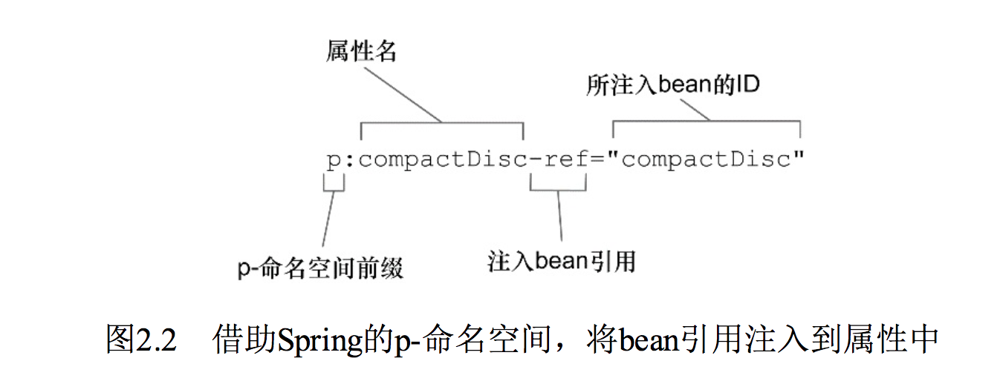 </div><br>

图2.2 借助Spring的p-命名空间，将bean引用注入到属性中首先，属性的名字使用了“p:”前缀，表明我们所设置的是一个属性。接下来就是要注入的属性名。最后，属性的名称以“-ref”结尾，这会提示Spring要进行装配的是引用，而不是字面量。

#### 将字面量注入到属性中
属性也可以注入字面量，这与构造器参数非常类似。作为示例，我们重新看一下BlankDisc bean。不过，BlankDisc这次完全通过属性注入进行配置，而不是构造器注入。新的BlankDisc类如下所示：

~~~
public class BlankDisc implements CompactDisc {

    private String title;
    private String artist;
    /**
     * 磁道
     */
    private List<String> tracks;

    public BlankDisc(String title, String artist, List<String> tracks) {
        this.title = title;
        this.artist = artist;
        this.tracks = tracks;
    }

    public void setTitle(String title) {
        this.title = title;
    }

    public void setArtist(String artist) {
        this.artist = artist;
    }

    public void setTracks(List<String> tracks) {
        this.tracks = tracks;
    }
}
~~~

现在，它不再强制要求我们装配任何的属性。你可以按照如下的方式创建一个BlankDiscbean，它的所有属性全都是空的：

~~~
<bean id="reallyBlankDisc"
          class="BlankDisc"/>
~~~

当然，如果在装配bean的时候不设置这些属性，那么在运行期CD播放器将不能正常播放内容。play()方法可能会遇到的输出内容是“Playing null by null”，随之会抛出NullPointerException异常，这是因为我们没有指定任何的磁道。所以，我们需要装配这些属性，可以借助<property>元素的value属性实现该功能：

```
 <bean id="compactDisc"
          class="com.alan.yx.springInAction.Chapter_02.stereo_mixedconfig.src.main.java.soundsystem.BlankDisc">
        <property name="title" value="Sgt. Pepper's Lonely Hearts Club Band"/>
        <property name="artist" value="the beatles"/>
        <property name="tracks>
            <list>
                <value>Sgt. Pepper's Lonely Hearts Club Band</value>
                <value>With a Little Help from My Friends</value>
                <value>Lucy in the Sky with Diamonds</value>
                <value>Getting Better</value>
                <value>Fixing a Hole</value>
                <!-- ...other tracks omitted for brevity... -->
            </list>
        </property>
    </bean>
```

在这里，除了使用<property>元素的value属性来设置title和artist，我们还使用了内嵌的<list>元素来设置tracks属性，这与之前通过<constructor-arg>装配tracks是完全一样的。

另外一种可选方案就是使用p-命名空间的属性来完成该功能：

```
 <bean id="compactDisc"
          class="com.alan.yx.springInAction.Chapter_02.stereo_mixedconfig.src.main.java.soundsystem.BlankDisc">
        p:title="Sgt. Pepper's Lonely Hearts Club Band"/>
        p:name="the beatles"/>
        <property name="tracks>
            <list>
                <value>Sgt. Pepper's Lonely Hearts Club Band</value>
                <value>With a Little Help from My Friends</value>
                <value>Lucy in the Sky with Diamonds</value>
                <value>Getting Better</value>
                <value>Fixing a Hole</value>
                <!-- ...other tracks omitted for brevity... -->
            </list>
        </property>
    </bean>
```

与c-命名空间一样，装配bean引用与装配字面量的唯一区别在于是否带有“-ref”后缀。如果没有“-ref”后缀的话，所装配的就是字面量。

但需要注意的是，我们不能使用p-命名空间来装配集合，没有便利的方式使用p-命名空间来指定一个值（或bean引用）的列表。但是，我们可以使用Spring util-命名空间中的一些功能来简化BlankDiscbean。

首先，需要在XML中声明util-命名空间及其模式：

<div align="center">  </div><br>

util-命名空间所提供的功能之一就是<util:list>元素，它会创建一个列表的bean。借助<util:list>，我们可以将磁道列表转移到BlankDisc bean之外，并将其声明到单独的bean之中，如下所示：

<div align="center">  </div><br>

现在，我们能够像使用其他的bean那样，将磁道列表bean注入到BlankDisc bean的tracks属性中：

<div align="center">  </div><br>

<util:list>只是util-命名空间中的多个元素之一。表2.1列出了util-命名空间提供的所有元素。
在需要的时候，你可能会用到util-命名空间中的部分成员。但现在，在结束本章前，我们看一下如何将自动化配置、JavaConfig以及XML配置混合并匹配在一起。

表2.1Spring util-命名空间中的元素

<div align="center">  </div><br>

元素描述<util:constant>引用某个类型的public static域，并将其暴露为beanutil:list创建一个java.util.List类型的bean，其中包含值或引用util:map创建一个java.util.Map类型的bean，其中包含值或引用util:properties创建一个java.util.Properties类型的beanutil:property-path引用一个bean的属性（或内嵌属性），并将其暴露为beanutil:set创建一个java.util.Set类型的bean，其中包含值或引用

## 2.5 导入和混合配置
在典型的Spring应用中，我们可能会同时使用自动化和显式配置。即便你更喜欢通过JavaConfig实现显式配置，但有的时候XML却是最佳的方案。

幸好在Spring中，这些配置方案都不是互斥的。你尽可以将JavaConfig的组件扫描和自动装配和/或XML配置混合在一起。实际上，就像在2.2.1小节中所看到的，我们至少需要有一点显式配置来启用组件扫描和自动装配。

关于混合配置，第一件需要了解的事情就是在自动装配时，它并不在意要装配的bean来自哪里。自动装配的时候会考虑到Spring容器中所有的bean，不管它是在JavaConfig或XML中声明的还是通过组件扫描获取到的。

你可能会想在显式配置时，比如在XML配置和Java配置中该如何引用bean呢。让我们先看一下如何在JavaConfig中引用XML配置的bean。

### 2.5.1 在JavaConfig中引用XML配置
现在，我们临时假设CDPlayerConfig已经变得有些笨重，我们想要将其进行拆分。当然，它目前只定义了两个bean，远远称不上复杂的Spring配置。不过，我们假设两个bean就已经太多了。

我们所能实现的一种方案就是将BlankDisc从CDPlayerConfig拆分出来，定义到它自己的CDConfig类中，如下所示：

```
package com.alan.yx.springInAction.Chapter_02.stereo_mixedconfig.src.main.java.soundsystem;

import org.springframework.context.annotation.Bean;
import org.springframework.context.annotation.Configuration;

@Configuration
public class CDConfig {
    @Bean
    public CompactDisc compactDisc() {
        return new SgtPeppers();
    }
}
```

compactDisc()方法已经从CDPlayerConfig中移除掉了，我们需要有一种方式将这两个类组合在一起。一种方法就是在CDPlayerConfig中使用@Import注解导入CDConfig：

```
import org.springframework.context.annotation.Bean;
import org.springframework.context.annotation.Configuration;
import org.springframework.context.annotation.Import;

@Configuration
@Import(CDConfig.class)
public class CDPlayerConfig {
  
  @Bean
  public CDPlayer cdPlayer(CompactDisc compactDisc) {
    return new CDPlayer(compactDisc);
  }

}
```

或者采用一个更好的办法，也就是不在CDPlayerConfig中使用@Import，而是创建一个更高级别的SoundSystemConfig，在这个类中使用@Import将两个配置类组合在一起：

```
@Configuration
@Import({CDPlayerConfig.class,CDConfig.class})
public class SoundSystemConfig {

}
```

不管采用哪种方式，我们都将CDPlayer的配置与BlankDisc的配置分开了。现在，我们假设（基于某些原因）希望通过XML来配置BlankDisc，如下所示：

```
  <bean id="compactDisc"
          class="com.alan.yx.springInAction.Chapter_02.stereo_mixedconfig.src.main.java.soundsystem.BlankDisc"
          c:_0="Sgt. Pepper's Lonely Hearts Club Band"
          c:_1="The Beatles">
        <constructor-arg>
            <list>
                <value>Sgt. Pepper's Lonely Hearts Club Band</value>
                <value>With a Little Help from My Friends</value>
                <value>Lucy in the Sky with Diamonds</value>
                <value>Getting Better</value>
                <value>Fixing a Hole</value>
                <!-- ...other tracks omitted for brevity... -->
            </list>
        </constructor-arg>
    </bean>
```

现在BlankDisc配置在了XML之中，我们该如何让Spring同时加载它和其他基于Java的配置呢？答案是@ImportResource注解，假设BlankDisc定义在名为cd-config.xml的文件中，该文件位于根类路径下，那么可以修改SoundSystemConfig，让它使用@ImportResource注解，如下所示：

```
package com.alan.yx.springInAction.Chapter_02.stereo_mixedconfig.src.main.java.soundsystem;
import org.springframework.context.annotation.Configuration;
import org.springframework.context.annotation.Import;
import org.springframework.context.annotation.ImportResource;

@Configuration
@Import({CDPlayerConfig.class})
@ImportResource("classpath:cd-config.xml")
//@Import({CDPlayerConfig.class,CDConfig.class})
public class SoundSystemConfig {

}
```

两个bean——配置在JavaConfig中的CDPlayer以及配置在XML中BlankDisc——都会被加载到Spring容器之中。因为CDPlayer中带有@Bean注解的方法接受一个CompactDisc作为参数，因此BlankDisc将会装配进来，此时与它是通过XML配置的没有任何关系。

让我们继续这个练习，但是这一次，我们需要在XML中引用JavaConfig声明的bean。

### 2.5.2 在XML配置中引用JavaConfig
假设你正在使用Spring基于XML的配置并且你已经意识到XML逐渐变得无法控制。像前面一样，我们正在处理的是两个bean，但事情实际上会变得更加糟糕。在被无数的尖括号淹没之前，我们决定将XML配置文件进行拆分。

在JavaConfig配置中，我们已经展现了如何使用@Import和@ImportResource来拆分JavaConfig类。在XML中，我们可以使用import元素来拆分XML配置。

比如，假设希望将BlankDisc bean拆分到自己的配置文件中，该文件名为cdplayer-config.xml，这与我们之前使用@ImportResource是一样的。我们可以在XML配置文件中使用<import>元素来引用该文件：

```
<?xml version="1.0" encoding="UTF-8"?>
<beans xmlns="http://www.springframework.org/schema/beans"
       xmlns:xsi="http://www.w3.org/2001/XMLSchema-instance"
       xmlns:c="http://www.springframework.org/schema/c"
       xsi:schemaLocation="http://www.springframework.org/schema/beans http://www.springframework.org/schema/beans/spring-beans.xsd">

    <bean class="soundsystem.CDConfig"/>

    <bean id="cdPlayer"
          class="soundsystem.CDPlayer"
          c:cd-ref="compactDisc"/>

</beans>
```

现在，我们假设不再将BlankDisc配置在XML之中，而是将其配置在JavaConfig中，CDPlayer则继续配置在XML中。基于XML的配置该如何引用一个JavaConfig类呢？

事实上，答案并不那么直观。<import>元素只能导入其他的XML配置文件，并没有XML元素能够导入JavaConfig类。

但是，有一个你已经熟知的元素能够用来将Java配置导入到XML配置中：<bean>元素。为了将JavaConfig类导入到XML配置中，我们可以这样声明bean：

```
<?xml version="1.0" encoding="UTF-8"?>
<beans xmlns="http://www.springframework.org/schema/beans"
       xmlns:xsi="http://www.w3.org/2001/XMLSchema-instance"
       xmlns:c="http://www.springframework.org/schema/c"
       xsi:schemaLocation="http://www.springframework.org/schema/beans http://www.springframework.org/schema/beans/spring-beans.xsd">

    <bean class="soundsystem.CDConfig"/>

    <bean id="cdPlayer"
          class="soundsystem.CDPlayer"
          c:cd-ref="compactDisc"/>

</beans>
```

采用这样的方式，两种配置——其中一个使用XML描述，另一个使用Java描述——被组合在了一起。类似地，你可能还希望创建一个更高层次的配置文件，这个文件不声明任何的bean，只是负责将两个或更多的配置组合起来。例如，你可以将CDConfig bean从之前的XML文件中移除掉，而是使用第三个配置文件将这两个组合在一起：

```
<bean class="com.alan.yx.springInAction.Chapter_02.stereo_mixedconfig.src.main.java.soundsystem.CDConfig"/>

     <bean class="soundsystem.CDConfig"/>
 
    <import resource="cd-config.xml"/>
</bean>
```

不管使用JavaConfig还是使用XML进行装配，我**通常都会创建一个根配置（root configuration）**，也就是这里展现的这样，这个配置会将两个或更多的装配类和/或XML文件组合起来。我也会在根配置中启用组件扫描（通过<context:component-scan>或@ComponentScan）。你会在本书的很多例子中看到这种技术。

## 2.6 小结
Spring框架的核心是Spring容器。容器负责管理应用中组件的生命周期，它会创建这些组件并保证它们的依赖能够得到满足，这样的话，组件才能完成预定的任务。

在本章中，我们看到了在Spring中装配bean的三种主要方式：自动化配置、基于Java的显式配置以及基于XML的显式配置。不管你采用什么方式，这些技术都描述了Spring应用中的组件以及这些组件之间的关系。

我同时**建议尽可能使用自动化配置，以避免显式配置所带来的维护成本**。但是，如果你确实需要显式配置Spring的话，应该优先选择基于Java的配置，它比基于XML的配置更加强大、类型安全并且易于重构。在本书中的例子中，当决定如何装配组件时，我都会遵循这样的指导意见。

因为依赖注入是Spring中非常重要的组成部分，所以本章中介绍的技术在本书中所有的地方都会用到。基于这些基础知识，下一章将会介绍一些更为高级的bean装配技术，这些技术能够让你更加充分地发挥Spring容器的威力。

# 第3章 高级装配
本章内容：

* Spring profile
* 条件化的bean声明
* 自动装配与歧义性
* bean的作用域
* Spring表达式语言

在上一章中，我们看到了一些最为核心的bean装配技术。你可能会发现上一章学到的知识有很大的用处。但是，bean装配所涉及的领域并不仅仅局限于上一章 所学习到的内容。Spring提供了多种技巧，借助它们可以实现更为高级的bean装配功能。

在本章中，我们将会深入介绍一些这样的高级技术。本章中所介绍的技术也许你不会天天都用到，但这并不意味着它们的价值会因此而降低。

## 3.1 环境与profile
在开发软件的时候，有一个很大的挑战就是将应用程序从一个环境迁移到另外一个环境。开发阶段中，某些环境相关做法可能并不适合迁移到生产环境中，甚至即便迁移过去也无法正常工作。数据库配置、加密算法以及与外部系统的集成是跨环境部署时会发生变化的几个典型例子。

比如，考虑一下数据库配置。在开发环境中，我们可能会使用嵌入式数据库，并预先加载测试数据。例如，在Spring配置类中，我们可能会在一个带有@Bean注解的方法上使用EmbeddedDatabaseBuilder：

```
  @Bean(destroyMethod = "shutdown")
    public DataSource embeddedDataSource() {
        return new EmbeddedDatabaseBuilder()
                .setType(EmbeddedDatabaseType.H2)
                .addScript("classpath:schema.sql")
                .addScript("classpath:test-data.sql")
                .build();
    }
```

这会创建一个类型为javax.sql.DataSource的bean，这个bean是如何创建出来的才是最有意思的。使用EmbeddedDatabaseBuilder会搭建一个嵌入式的Hypersonic数据库，它的模式（schema）定义在schema.sql中，测试数据则是通过test-data.sql加载的。

当你在开发环境中运行集成测试或者启动应用进行手动测试的时候，这个DataSource是很有用的。每次启动它的时候，都能让数据库处于一个给定的状态。

尽管EmbeddedDatabaseBuilder创建的DataSource非常适于开发环境，但是对于生产环境来说，这会是一个糟糕的选择。在生产环境的配置中，你可能会希望使用JNDI从容器中获取一个DataSource。在这样场景中，如下的@Bean方法会更加合适：

```
	 @Bean
    public DataSource jndiDataSource() {
        JndiObjectFactoryBean jndiObjectFactoryBean = new JndiObjectFactoryBean();
        jndiObjectFactoryBean.setJndiName("jdbc/myDS");
        jndiObjectFactoryBean.setResourceRef(true);
        jndiObjectFactoryBean.setProxyInterface(DataSource.class);
        return (DataSource) jndiObjectFactoryBean.getObject();
    }
```

通过JNDI获取DataSource能够让容器决定该如何创建这个DataSource，甚至包括切换为容器管理的连接池。即便如此，JNDI管理的DataSource更加适合于生产环境，对于简单的集成和开发测试环境来说，这会带来不必要的复杂性。

同时，在QA环境中，你可以选择完全不同的DataSource配置，可以配置为Commons DBCP连接池，如下所示：

<div align="center">  </div><br>

显然，这里展现的三个版本的dataSource()方法互不相同。虽然它们都会生成一个类型为javax.sql.DataSource的bean，但它们的相似点也仅限于此了。每个方法都使用了完全不同的策略来生成DataSource bean。

再次强调的是，这里的讨论并不是如何配置DataSource（我们将会在第10章更详细地讨论这个话题）。看起来很简单的DataSource实际上并不是那么简单。这是一个很好的例子，它表现了在不同的环境中某个bean会有所不同。我们必须要有一种方法来配置DataSource，使其在每种环境下都会选择最为合适的配置。

其中一种方式就是在单独的配置类（或XML文件）中配置每个bean，然后在构建阶段（可能会使用Maven的profiles）确定要将哪一个配置编译到可部署的应用中。这种方式的问题在于要为每种环境重新构建应用。当从开发阶段迁移到QA阶段时，重新构建也许算不上什么大问题。但是，从QA阶段迁移到生产阶段时，重新构建可能会引入bug并且会在QA团队的成员中带来不安的情绪。

值得庆幸的是，Spring所提供的解决方案并**不需要重新构建**。

### 3.1.1 配置profile bean
Spring为环境相关的bean所提供的解决方案其实与构建时的方案没有太大的差别。当然，在这个过程中需要根据环境决定该创建哪个bean和不创建哪个bean。不过**Spring并不是在构建的时候做出这样的决策，而是等到运行时再来确定**。这样的结果就是同一个部署单元（可能会是WAR文件）能够适用于所有的环境，没有必要进行重新构建。

- **Spring并不是在构建的时候决定创建哪个bean和不创建哪个bean，而是等到运行时根据应用的环境再来确定**。

在3.1版本中，Spring引入了bean profile的功能。要使用profile，你首先要将所有不同的bean定义整理到一个或多个profile之中，在将应用部署到每个环境时，要确保对应的profile处于**激活（active）**的状态。

在Java配置中，可以使用@Profile注解指定某个bean属于哪一个profile。例如，在配置类中，嵌入式数据库的DataSource可能会配置成如下所示：

<div align="center"> 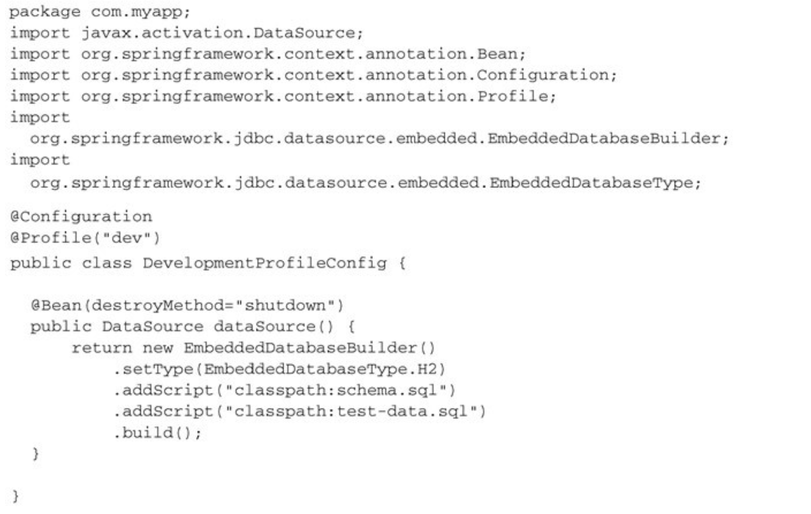 </div><br>

我希望你能够注意的是@Profile注解应用在了类级别上。它会告诉Spring这个配置类中的bean只有在dev profile激活时才会创建。如果dev profile没有激活的话，那么带有@Bean注解的方法都会被忽略掉。

- **@Profile注解**:告诉 Spring这个配置类中的bean只有在该环境下 profile激活时才会创建

同时，你可能还需要有一个适用于生产环境的配置，如下所示：

<div align="center"> 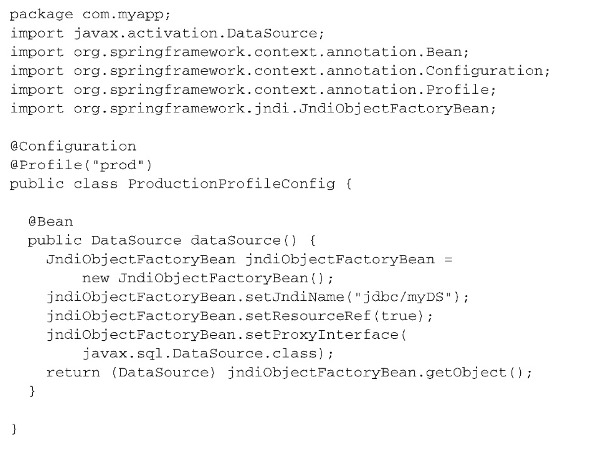 </div><br>

在本例中，只有prod profile激活的时候，才会创建对应的bean。

在Spring 3.1中，只能在类级别上使用@Profile注解。不过，从Spring 3.2开始，你也可以在方法级别上使用@Profile注解，与@Bean注解一同使用。这样的话，就能将这两个bean的声明放到同一个配置类之中，如下所示：

程序清单3.1 @Profile注解基于激活的profile实现bean的装配

```
@Configuration
public class DataSourceConfig {

    /**
     * 开发环境
     * 为 dev profile 装配的 bean
     *
     * @return
     */
    @Bean(destroyMethod = "shutdown")
    @Profile("dev")
    public DataSource embeddedDataSource() {
        return new EmbeddedDatabaseBuilder()
                .setType(EmbeddedDatabaseType.H2)
                .addScript("classpath:schema.sql")
                .addScript("classpath:test-data.sql")
                .build();
    }

    /**
     * 生产环境
     * 为 prod profile 装配的 bean
     *
     * @return
     */
    @Bean
    @Profile("prod")
    public DataSource jndiDataSource() {
        JndiObjectFactoryBean jndiObjectFactoryBean = new JndiObjectFactoryBean();
        jndiObjectFactoryBean.setJndiName("jdbc/myDS");
        jndiObjectFactoryBean.setResourceRef(true);
        jndiObjectFactoryBean.setProxyInterface(DataSource.class);
        return (DataSource) jndiObjectFactoryBean.getObject();
    }
    
}
```

这里有个问题需要注意，尽管每个DataSource bean都被声明在一个profile中，并且只有当规定的profile激活时，相应的bean才会被创建，但是可能会有其他的bean并没有声明在一个给定的profile范围内。

- **注意⚠️**:没有指定profile的bean始终都会被创建，与激活哪个profile没有关系。

#### 在XML中配置profile
我们也可以通过<beans>元素的profile属性，在XML中配置profile bean。例如，为了在XML中定义适用于开发阶段的嵌入式数据库DataSource bean，我们可以创建如下所示的XML文件：

```
<!--为 dev profile 装配的 bean-->
  <beans profile="dev">
    <jdbc:embedded-database id="dataSource" type="H2">
      <jdbc:script location="classpath:com/alan/yx/springInAction/Chapter_03/profiles/src/main/resources/schema.sql" />
      <jdbc:script location="classpath:com/alan/yx/springInAction/Chapter_03/profiles/src/main/resources/test-data.sql" />
    </jdbc:embedded-database>
  </beans>
```

与之类似，我们也可以将profile设置为prod，创建适用于生产环境的从JNDI获取的DataSource bean。同样，可以创建基于连接池定义的DataSource bean，将其放在另外一个XML文件中，并标注为qaprofile。所有的配置文件都会放到部署单元之中（如WAR文件），但是只有profile属性与当前激活profile相匹配的配置文件才会被用到。

你还可以在根<beans>元素中嵌套定义<beans>元素，而不是为每个环境都创建一个profileXML文件。这能够将所有的profile bean定义放到同一个XML文件中，如下所示：

程序清单3.2 重复使用元素来指定多个profile


```
<?xml version="1.0" encoding="UTF-8"?>
<beans xmlns="http://www.springframework.org/schema/beans"
       xmlns:xsi="http://www.w3.org/2001/XMLSchema-instance" xmlns:jdbc="http://www.springframework.org/schema/jdbc"
       xmlns:jee="http://www.springframework.org/schema/jee" xmlns:p="http://www.springframework.org/schema/p"
       xsi:schemaLocation="
    http://www.springframework.org/schema/jee
    http://www.springframework.org/schema/jee/spring-jee.xsd
    http://www.springframework.org/schema/jdbc
    http://www.springframework.org/schema/jdbc/spring-jdbc.xsd
    http://www.springframework.org/schema/beans
    http://www.springframework.org/schema/beans/spring-beans.xsd">

    <!--为 dev profile 装配的 bean-->
    <beans profile="dev">
        <jdbc:embedded-database id="dataSource" type="H2">
            <jdbc:script
                    location="classpath:com/alan/yx/springInAction/Chapter_03/profiles/src/main/resources/schema.sql"/>
            <jdbc:script
                    location="classpath:com/alan/yx/springInAction/Chapter_03/profiles/src/main/resources/test-data.sql"/>
        </jdbc:embedded-database>
    </beans>

    <!--为 prod profile 装配的 bean-->
    <beans profile="prod">
        <jee:jndi-lookup id="dataSource"
                         lazy-init="true"
                         jndi-name="jdbc/myDatabase"
                         resource-ref="true"
                         proxy-interface="javax.sql.DataSource"/>
    </beans>
</beans>
```

<div align="center">  </div><br>

除了所有的bean定义到了同一个XML文件之中，这种配置方式与定义在单独的XML文件中的实际效果是一样的。这里有三个bean，类型都是javax.sql.DataSource，并且ID都是dataSource。但是在运行时，只会创建一个bean，这取决于处于激活状态的是哪个profile。那么问题来了：我们该怎样激活某个profile呢？

### 3.1.2 激活profile
Spring在确定哪个profile处于激活状态时，需要依赖两个独立的属性：`spring.profiles.active`和 `spring.profiles.default` 。如果设置了spring.profiles.active属性的话，那么它的值就会用来确定哪个profile是激活的。但如果没有设置spring.profiles.active属性的话，那Spring将会查找spring.profiles.default的值。如果spring.profiles.active和spring.profiles.default均没有设置的话，那就没有激活的profile，因此只会创建那些没有定义在profile中的bean。

有多种方式来设置这两个属性：

* 作为DispatcherServlet的初始化参数；
* 作为Web应用的上下文参数；
* 作为JNDI条目；
* 作为环境变量；
* 作为JVM的系统属性；
* 在集成测试类上，使用@ActiveProfiles注解设置。

你尽可以选择spring.profiles.active和spring.profiles.default的最佳组合方式以满足需求，我将这样的自主权留给读者。

我所喜欢的一种方式是使用DispatcherServlet的参数将spring.profiles.default设置为开发环境的profile，我会在Servlet上下文中进行设置（为了兼顾到ContextLoaderListener）。例如，在Web应用中，设置spring.profiles.default的web.xml文件会如下所示：

程序清单3.3 在Web应用的web.xml文件中设置默认的profile

<div align="center">  </div><br>

按照这种方式设置spring.profiles.default，所有的开发人员都能从版本控制软件中获得应用程序源码，并使用开发环境的设置（如嵌入式数据库）运行代码，而不需要任何额外的配置。

当应用程序部署到QA、生产或其他环境之中时，负责部署的人根据情况使用系统属性、环境变量或JNDI设置spring.profiles.active即可。当设置spring.profiles.active以后，至于spring.profiles.default置成什么值就已经无所谓了；

- **系统会优先使用spring.profiles.active中所设置的profile。**优先级：`spring.profiles.active` > `spring.profiles.default`

你可能已经注意到了，在spring.profiles.active和spring.profiles.default中，profile使用的都是复数形式。这意味着你可以同时激活多个profile，这可以通过列出多个profile名称，并以逗号分隔来实现。当然，同时启用dev和prod profile可能也没有太大的意义，不过你可以同时设置多个彼此不相关的profile。

#### 使用profile进行测试
当运行集成测试时，通常会希望采用与生产环境（或者是生产环境的部分子集）相同的配置进行测试。但是，如果配置中的bean定义在了profile中，那么在运行测试时，我们就需要有一种方式来启用合适的profile。

Spring提供了@ActiveProfiles注解，我们可以使用它来指定运行测试时要激活哪个profile。在集成测试时，通常想要激活的是开发环境的profile。例如，下面的测试类片段展现了使用 @ActiveProfiles 激活dev profile：

```
@RunWith(SpringJUnit4ClassRunner.class)
    @ContextConfiguration(classes = DataSourceConfig.class)
    @ActiveProfiles("dev")
    public static class DevDataSourceTest {
     	. . .
    }
```

在条件化创建bean方面，Spring的profile机制是一种很棒的方法，这里的条件要基于哪个profile处于激活状态来判断。Spring 4.0中提供了一种更为通用的机制来实现条件化的bean定义，在这种机制之中，条件完全由你来确定。让我们看一下如何使用Spring 4和@Conditional注解定义条件化的bean。

## 3.2 条件化的bean
假设你希望一个或多个bean只有在应用的类路径下包含特定的库时才创建。或者我们希望某个bean只有当另外某个特定的bean也声明了之后才会创建。我们还可能要求只有某个特定的环境变量设置之后，才会创建某个bean。

在Spring 4之前，很难实现这种级别的条件化配置，但是Spring 4引入了一个新的@Conditional注解，它可以用到带有@Bean注解的方法上。如果给定的条件计算结果为true，就会创建这个bean，否则的话，这个bean会被忽略。例如，假设有一个名为MagicBean的类，我们希望只有设置了magic环境属性的时候，Spring才会实例化这个类。如果环境中没有这个属性，那么MagicBean将会被忽略。

例如，假设有一个名为MagicBean的类，我们希望只有设置了magic环境属性的时候，Spring才会实例化这个类。如果环境中没有这个属性，那么MagicBean将会被忽略。在程序清单3.4所展现的配置中，使用@Conditional注解条件化地配置了MagicBean。

程序清单3.4 条件化地配置bean

```
 @Bean
    // 有条件的创建bean
    @Conditional(MagicExistsCondition.class)
    public MagicBean magicBean() {
        return new MagicBean();
    }
```

可以看到，@Conditional中给定了一个Class，它指明了条件——在本例中，也就是MagicExistsCondition。@Conditional将会通过Condition接口进行条件对比：

```
public interface Condition {

	/**
	 * Determine if the condition matches.
	 * @param context the condition context
	 * @param metadata metadata of the {@link org.springframework.core.type.AnnotationMetadata class}
	 * or {@link org.springframework.core.type.MethodMetadata method} being checked
	 * @return {@code true} if the condition matches and the component can be registered,
	 * or {@code false} to veto the annotated component's registration
	 */
	boolean matches(ConditionContext context, AnnotatedTypeMetadata metadata);

}
```

设置给@Conditional的类可以是任意实现了Condition接口的类型。可以看出来，这个接口实现起来很简单直接，只需提供matches()方法的实现即可。如果matches()方法返回true，那么就会创建带有@Conditional注解的bean。如果matches()方法返回false，将不会创建这些bean。

在本例中，我们需要创建Condition的实现并根据环境中是否存在magic属性来做出决策。程序清单3.5展现了 MagicExistsCondition，这是完成该功能的Condition实现类：

程序清单3.5 在Condition中检查是否存在magic属性

```
import org.springframework.context.annotation.Condition;
import org.springframework.context.annotation.ConditionContext;
import org.springframework.core.env.Environment;
import org.springframework.core.type.AnnotatedTypeMetadata;

public class MagicExistsCondition implements Condition {

  @Override
  public boolean matches(ConditionContext context, AnnotatedTypeMetadata metadata) {
    Environment env = context.getEnvironment();
    return env.containsProperty("magic");
  }
  
}
```

在上面的程序清单中，matches()方法很简单但功能强大。它通过给定的ConditionContext对象进而得到Environment对象，并使用这个对象检查环境中是否存在名为magic的环境属性。在本例中，属性的值是什么无所谓，只要属性存在即可满足要求。如果满足这个条件的话，matches()方法就会返回true。所带来的结果就是条件能够得到满足，所有@Conditional注解上引用MagicExistsCondition的bean都会被创建。

话说回来，如果这个属性不存在的话，就无法满足条件，matches()方法会返回false，这些bean都不会被创建。

MagicExistsCondition中只是使用了ConditionContext得到的Environment，但Condition实现的考量因素可能会比这更多。matches()方法会得到ConditionContext和AnnotatedTypeMetadata对象用来做出决策。

ConditionContext是一个接口，大致如下所示：

```
public interface ConditionContext {
    BeanDefinitionRegistry getRegistry();

    @Nullable
    ConfigurableListableBeanFactory getBeanFactory();

    Environment getEnvironment();

    ResourceLoader getResourceLoader();

    @Nullable
    ClassLoader getClassLoader();
}
```

通过ConditionContext，我们可以做到如下几点：

* 借助getRegistry()返回的BeanDefinitionRegistry检查bean定义；
* 借助getBeanFactory()返回的ConfigurableListableBeanFactory检查bean是否存在，甚至探查bean的属性；
* 借助getEnvironment()返回的Environment检查环境变量是否存在以及它的值是什么；
* 读取并探查getResourceLoader()返回的ResourceLoader所加载的资源；
* 借助getClassLoader()返回的ClassLoader加载并检查类是否存在。

AnnotatedTypeMetadata则能够让我们检查带有@Bean注解的方法上还有什么其他的注解。像ConditionContext一样，AnnotatedTypeMetadata也是一个接口。它如下所示：

```
public interface AnnotatedTypeMetadata {
    boolean isAnnotated(String var1);

    @Nullable
    Map<String, Object> getAnnotationAttributes(String var1);

    @Nullable
    Map<String, Object> getAnnotationAttributes(String var1, boolean var2);

    @Nullable
    MultiValueMap<String, Object> getAllAnnotationAttributes(String var1);

    @Nullable
    MultiValueMap<String, Object> getAllAnnotationAttributes(String var1, boolean var2);
}
```

借助isAnnotated()方法，我们能够判断带有@Bean注解的方法是不是还有其他特定的注解。借助其他的那些方法，我们能够检查@Bean注解的方法上其他注解的属性。

非常有意思的是，从Spring 4开始，@Profile注解进行了重构，使其基于@Conditional和Condition实现。作为如何使用@Conditional和Condition的例子，我们来看一下在 Spring 4中，@Profile是如何实现的。@Profile注解如下所示：

```
@Target({ElementType.TYPE, ElementType.METHOD})
@Retention(RetentionPolicy.RUNTIME)
@Documented
@Conditional(ProfileCondition.class)
public @interface Profile {

	/**
	 * The set of profiles for which the annotated component should be registered.
	 */
	String[] value();

}
```

> 注意: @Profile本身也使用了@Conditional注解，并且引用ProfileCondition作为Condition实现。如下所示，ProfileCondition实现了Condition接口，并且在做出决策的过程中，考虑到了ConditionContext和AnnotatedTypeMetadata中的多个因素。

程序清单3.6ProfileCondition检查某个bean profile是否可用

```
class ProfileCondition implements Condition {

	@Override
	public boolean matches(ConditionContext context, AnnotatedTypeMetadata metadata) {
		MultiValueMap<String, Object> attrs = metadata.getAllAnnotationAttributes(Profile.class.getName());
		if (attrs != null) {
			for (Object value : attrs.get("value")) {
				if (context.getEnvironment().acceptsProfiles(Profiles.of((String[]) value))) {
					return true;
				}
			}
			return false;
		}
		return true;
	}

}
```

我们可以看到，ProfileCondition通过AnnotatedTypeMetadata得到了用于@Profile注解的所有属性。借助该信息，它会明确地检查value属性，该属性包含了bean的profile名称。然后，它根据通过ConditionContext得到的Environment来检查［借助acceptsProfiles()方法］该profile是否处于激活状态。

## 3.3 处理自动装配的歧义性
在第2章中，我们已经看到如何使用自动装配让Spring完全负责将bean引用注入到构造参数和属性中。自动装配能够提供很大的帮助，因为它会减少装配应用程序组件时所需要的显式配置的数量。

不过，仅有一个bean匹配所需的结果时，自动装配才是有效的。如果不只有一个bean能够匹配结果的话，这种歧义性会阻碍Spring自动装配属性、构造器参数或方法参数。

为了阐述自动装配的歧义性，假设我们使用@Autowired注解标注了setDessert()方法：

```
@Autowired
public void setDessert(Dessert dessert){
	this.dessert = dessert
}
```

在本例中，Dessert是一个接口，并且有三个类实现了这个接口，分别为Cake、Cookies和IceCream：
```
@Componet
public class Cake implements Dessert{ . . . }

@Componet
public class Cookies implements Dessert{ . . . }

@Componet
public class IceCream implements Dessert{ . . . }

```

因为这三个实现均使用了@Component注解，在组件扫描的时候，能够发现它们并将其创建为Spring应用上下文里面的bean。然后，当Spring试图自动装配setDessert()中的Dessert参数时，它并没有唯一、无歧义的可选值。在从多种甜点中做出选择时，尽管大多数人并不会有什么困难，但是Spring却无法做出选择。Spring此时别无他法，只好宣告失败并抛出异常。更精确地讲，Spring会抛出NoUniqueBeanDefinitionException：


<div align="center">  </div><br>

当然，使用吃甜点的样例来阐述自动装配在遇到歧义性时所面临的问题多少有些牵强。在实际中，自动装配歧义性的问题其实比你想象中的更为罕见。就算这种歧义性确实是个问题，但更常见的情况是给定的类型只有一个实现类，因此自动装配能够很好地运行。

但是，当确实发生歧义性的时候，Spring提供了多种可选方案来解决这样的问题。你可以将可选bean中的某一个**设为首选（primary）的bean**，或者**使用限定符（qualifier）**来帮助Spring将可选的bean的范围缩小到只有一个bean。

- **设为首选（primary）的bean**
- **使用限定符（qualifier）**

### 3.3.1 标示首选的bean
如果你像我一样，喜欢所有类型的甜点，如蛋糕、饼干、冰激凌......它们都很美味。但如果只能在其中选择一种甜点的话，那你最喜欢的是哪一种呢？

在声明bean的时候，通过将其中一个可选的bean设置为首选（primary）bean能够避免自动装配时的歧义性。当遇到歧义性的时候，Spring将会使用首选的bean，而不是其他可选的bean。实际上，你所声明就是“最喜欢”的bean。

假设冰激凌就是你最喜欢的甜点。在Spring中，可以通过@Primary来表达最喜欢的方案。@Primary能够与@Component组合用在组件扫描的bean上，也可以与@Bean组合用在Java配置的bean声明中。比如，下面的代码展现了如何将@Component注解的IceCreambean声明为首选的bean：

```
@Componet
@Primary
public class IceCream implements Dessert{ . . . }
```

或者，如果你通过Java配置显式地声明IceCream，那么@Bean方法应该如下所示：

```
@Bean
@Primary
public class IceCream implements Dessert{ . . . }
```

如果你使用XML配置bean的话，同样可以实现这样的功能。<bean>元素有一个primary属性用来指定首选的bean：

```
<bean id="iceCream"
	class="com.dessert. IceCream"
	primary="true">
```

不管你采用什么方式来标示首选bean，效果都是一样的，都是告诉Spring在遇到歧义性的时候要选择首选的bean。

但是，如果你标示了两个或更多的首选bean，那么它就无法正常工作了。比如，假设Cake类如下所示：

```
@Bean
@Primary
public class Cake implements Dessert{ . . . }
```

现在，有两个首选的Dessert bean：Cake和IceCream。这带来了新的歧义性问题。就像Spring无法从多个可选的bean中做出选择一样，它也无法从多个首选的bean中做出选择。显然，如果不止一个bean被设置成了首选bean，那实际上也就是没有首选bean了。

就解决歧义性问题而言，限定符是一种更为强大的机制，下面就将对其进行介绍。

### 3.3.2 限定自动装配的bean
设置首选bean的局限性在于@Primary无法将可选方案的范围限定到唯一一个无歧义性的选项中。它只能标示一个优先的可选方案。当首选bean的数量超过一个时，我们并没有其他的方法进一步缩小可选范围。

与之相反，**Spring的限定符**能够在所有可选的bean上进行缩小范围的操作，最终能够达到只有一个bean满足所规定的限制条件。如果将所有的限定符都用上后依然存在歧义性，那么你可以继续使用更多的限定符来缩小选择范围。

- **@Qualifier注解是使用限定符的主要方式。**

@Qualifier可以与@Autowired和@Inject协同使用，在注入的时候指定想要注入进去的是哪个bean。例如，我们想要确保要将IceCream注入到setDessert()之中：

```
@Autowired
@Qualifier("iceCream")
public void setDessert(Dessert dessert){
	this.dessert = dessert
}
```

这是使用限定符的最简单的例子。为@Qualifier注解所设置的参数就是想要注入的bean的ID。所有使用@Component注解声明的类都会创建为bean，并且bean的ID为首字母变为小写的类名。因此，@Qualifier("iceCream")指向的是组件扫描时所创建的bean，并且这个bean是IceCream类的实例。

实际上，还有一点需要补充一下。更准确地讲，@Qualifier("iceCream")所引用的bean要具有String类型的“iceCream”作为限定符。**如果没有指定其他的限定符的话，所有的bean都会给定一个默认的限定符，这个限定符与bean的ID相同**。因此，框架会将具有“iceCream”限定符的bean注入到setDessert()方法中。这恰巧就是ID为iceCream的bean，它是IceCream类在组件扫描的时候创建的。

基于默认的bean ID作为限定符是非常简单的，但这有可能会引入一些问题。如果你重构了IceCream类，将其重命名为Gelato的话，那此时会发生什么情况呢？如果这样的话，bean的ID和默认的限定符会变为gelato，这就无法匹配setDessert()方法中的限定符。自动装配会失败。

这里的问题在于**setDessert()方法上所指定的限定符与要注入的bean的名称是紧耦合的。**对类名称的任意改动都会导致限定符失效。

- 使用默认的限定符，即bean 的id，会造成紧耦合

#### 创建自定义的限定符
我们可以为bean设置自己的限定符，而不是依赖于将bean ID作为限定符。在这里所需要做的就是**在bean声明上添加@Qualifier注解**。例如，它可以与@Component组合使用，如下所示：

```
@Componet
@Qualifier("cold")
public class IceCream implements Dessert{ . . . }
```

在这种情况下，cold限定符分配给了IceCreambean。因为它没有耦合类名，因此你可以随意重构IceCream的类名，而不必担心会破坏自动装配。在注入的地方，只要引用cold限定符就可以了：

```
@Autowired
@Qualifier("cold")
public void setDessert(Dessert dessert){
	this.dessert = dessert
}
```

值得一提的是，当通过Java配置显式定义bean的时候，@Qualifier也可以与@Bean注解一起使用：

```
@Bean
@Qualifier("cold")
public Dessert iceCream(){
	return new IceCream();
}
```

- **@Qualifier与@Component组合使用**
- **@Qualifier与@Bean组合使用**

当使用自定义的@Qualifier值时，**最佳实践是为bean选择特征性或描述性的术语，而不是使用随意的名字**。在本例中，我将IceCream bean描述为“cold”bean。在注入的时候，可以将这个需求理解为“给我一个凉的甜点”，这其实就是描述的IceCream。类似地，我可以将Cake描述为“soft”，将Cookie描述为“crispy”。

#### 使用自定义的限定符注解
面向特性的限定符要比基于bean ID的限定符更好一些。但是，如果多个bean都具备相同特性的话，这种做法也会出现问题。例如，如果引入了这个新的Dessert bean，会发生什么情况呢：

```
@Componet
@Qualifier("cold")
public class Popsicle implements Dessert{ . . . }
```

不会吧？！现在我们有了两个带有“cold”限定符的甜点。在自动装配Dessert bean的时候，我们再次遇到了歧义性的问题，需要使用更多的限定符来将可选范围限定到只有一个bean。可能想到的解决方案就是在注入点和bean定义的地方同时再添加另外一个@Qualifier注解。IceCream类大致就会如下所示：

```
@Componet
@Qualifier("cold")
@Qualifier("creamy")
public class IceCream implements Dessert{ . . . }
```

Popsicle类同样也可能再添加另外一个@Qualifier注解：

```
@Componet
@Qualifier("cold")
@Qualifier("fruity")
public class Popsicle implements Dessert{ . . . }
```

在注入点中，我们可能会使用这样的方式来将范围缩小到IceCream：

```
@Autowired
@Qualifier("cold")
@Qualifier("creamy")
public void setDessert(Dessert dessert){
	this.dessert = dessert
}
```

这里只有一个小问题：Java不允许在同一个条目上重复出现相同类型的多个注解。[1]如果你试图这样做的话，编译器会提示错误。在这里，使用@Qualifier注解并没有办法（至少没有直接的办法）将自动装配的可选bean缩小范围至仅有一个可选的bean。

但是，我们可以**创建自定义的限定符注解**，借助这样的注解来表达bean所希望限定的特性。这里所需要做的就是创建一个注解，它本身要使用@Qualifier注解来标注。这样我们将不再使用@Qualifier("cold")，而是使用自定义的@Cold注解，该注解的定义如下所示：

```
import javax.inject.Qualifier;
import java.lang.annotation.ElementType;
import java.lang.annotation.Retention;
import java.lang.annotation.RetentionPolicy;
import java.lang.annotation.Target;

@Target({ElementType.CONSTRUCTOR, ElementType.FIELD,
        ElementType.METHOD, ElementType.TYPE})
@Retention(RetentionPolicy.RUNTIME)
@Qualifier
public @interface Cold {
}
```

同样，你可以创建一个新的@Creamy注解来代替@Qualifier("creamy")：

```
import javax.inject.Qualifier;
import java.lang.annotation.ElementType;
import java.lang.annotation.Retention;
import java.lang.annotation.RetentionPolicy;
import java.lang.annotation.Target;

@Target({ElementType.CONSTRUCTOR, ElementType.FIELD,
        ElementType.METHOD, ElementType.TYPE})
@Retention(RetentionPolicy.RUNTIME)
@Qualifier
public @interface Creamy {
}
```

当你不想用@Qualifier注解的时候，可以类似地创建@Soft、@Crispy和@Fruity。通过在定义时添加@Qualifier注解，它们就具有了@Qualifier注解的特性。它们本身实际上就成为了限定符注解。

```
@Autowired
@Cold
@Creamy
public void setDessert(Dessert dessert){
	this.dessert = dessert
}
```

现在，我们可以重新看一下IceCream，并为其添加@Cold和@Creamy注解，如下所示：

```
@Componet
@Cold
@Fruity
public class Popsicle implements Dessert{ . . . }
```

类似地，Popsicle类可以添加@Cold和@Fruity注解：最终，在注入点，我们使用必要的限定符注解进行任意组合，从而将可选范围缩小到只有一个bean满足需求。为了得到IceCream bean，setDessert()方法可以这样使用注解：

```
@Autowired
@Cold
@Creamy
public void setDessert(Dessert dessert){
	this.dessert = dessert
}
```

通过声明自定义的限定符注解，我们可以同时使用多个限定符，不会再有Java编译器的限制或错误。与此同时，相对于使用原始的@Qualifier并借助String类型来指定限定符，自定义的注解也更为类型安全。

让我们近距离观察一下setDessert()方法以及它的注解，这里并没有在任何地方明确指定要将IceCream自动装配到该方法中。相反，我们使用所需bean的特性来进行指定，即@Cold和@Creamy。因此，setDessert()方法依然能够与特定的Dessert实现保持解耦。任意满足这些特征的bean都是可以的。在当前选择Dessert实现时，恰好如此，IceCream是唯一能够与之匹配的bean。

在本节和前面的节中，我们讨论了几种通过自定义注解扩展Spring的方式。为了创建自定义的条件化注解，我们创建一个新的注解并在这个注解上添加了@Conditional。为了创建自定义的限定符注解，我们创建一个新的注解并在这个注解上添加了@Qualifier。这种技术可以用到很多的Spring注解中，从而能够将它们组合在一起形成特定目标的自定义注解。

现在我们来看一下如何在不同的作用域中声明bean。

## 3.4 bean的作用域
在默认情况下，Spring应用上下文中所有bean都是作为以单例（singleton）的形式创建的。也就是说，不管给定的一个bean被注入到其他bean多少次，每次所注入的都是同一个实例。

在大多数情况下，单例bean是很理想的方案。初始化和垃圾回收对象实例所带来的成本只留给一些小规模任务，在这些任务中，让对象保持无状态并且在应用中反复重用这些对象可能并不合理。

#### 为什么要作用域？
有时候，可能会发现，你所**使用的类是易变的（mutable），它们会保持一些状态，因此重用是不安全的**。在这种情况下，将class声明为单例的bean就不是什么好主意了，**因为对象会被污染，稍后重用的时候会出现意想不到的问题**。

Spring定义了多种作用域，可以基于这些作用域创建bean，包括：

* 单例（Singleton）：在整个应用中，只创建bean的一个实例。
* 原型（Prototype）：每次注入或者通过Spring应用上下文获取的时候，都会创建一个新的bean实例。
* 会话（Session）：在Web应用中，为每个会话创建一个bean实例。
* 请求（Rquest）：在Web应用中，为每个请求创建一个bean实例。

单例是默认的作用域，但是正如之前所述，对于易变的类型，这并不合适。如果选择其他的作用域，要使用@Scope注解，它可以与@Component或@Bean一起使用。

例如，如果你使用组件扫描来发现和声明bean，那么你可以在bean的类上使用@Scope注解，将其声明为原型bean：

```
@Component
@Scope(ConfigurableBeanFactory.SCOPE_PROTOTYPE)
public class Notepad {
  // the details of this class are inconsequential to this example
}
```

这里，使用ConfigurableBeanFactory类的SCOPE_PROTOTYPE常量设置了原型作用域。你当然也可以使用@Scope("prototype")，但是使用SCOPE_PROTOTYPE常量更加安全并且不易出错。

如果你想在Java配置中将Notepad声明为原型bean，那么可以组合使用@Scope和@Bean来指定所需的作用域：

```
    @Bean
    @Scope(ConfigurableBeanFactory.SCOPE_PROTOTYPE)
    public Notepad notepad(){
        return new Notepad();
    }
```

同样，如果你使用XML来配置bean的话，可以使用<bean>元素的scope属性来设置作用域：

```
<bean class="com.myapp.Notepad"
          scope="prototype"/>
```

不管你使用哪种方式来声明原型作用域，每次注入或从Spring应用上下文中检索该bean的时候，都会创建新的实例。这样所导致的结果就是每次操作都能得到自己的Notepad实例。

### 3.4.1 使用会话和请求作用域
在Web应用中，如果能够实例化在会话和请求范围内共享的bean，那将是非常有价值的事情。例如，在典型的电子商务应用中，可能会有一个bean代表用户的购物车。如果购物车是单例的话，那么将会导致所有的用户都会向同一个购物车中添加商品。另一方面，如果购物车是原型作用域的，那么在应用中某一个地方往购物车中添加商品，在应用的另外一个地方可能就不可用了，因为在这里注入的是另外一个原型作用域的购物车。

就购物车bean来说，会话作用域是最为合适的，因为它与给定的用户关联性最大。要指定会话作用域，我们可以使用@Scope注解，它的使用方式与指定原型作用域是相同的：

```
@Componet
@Scope(value = WebApplicationContext.SCOPE_SESSION,
    proxyMode = ScopedProxyMode.INTERFACES)
public ShoppingCart cart(){. . . }
```

这里，我们将value设置成了WebApplicationContext中的SCOPE_SESSION常量（它的值是session）。这会告诉Spring为Web应用中的每个会话创建一个ShoppingCart。这会创建多个ShoppingCart bean的实例，但是对于给定的会话只会创建一个实例，在当前会话相关的操作中，这个bean实际上相当于单例的。

要注意的是，@Scope同时还有一个proxyMode属性，它被设置成了ScopedProxyMode.INTERFACES。这个属性解决了将会话或请求作用域的bean注入到单例bean中所遇到的问题。在描述proxyMode属性之前，我们先来看一下proxyMode所解决问题的场景。

假设我们要将ShoppingCart bean注入到单例StoreService bean的Setter方法中，如下所示：

```
@Component
public class StoreService {

    private ShoppingCart shoppingCart;

    @Autowired
    public void setShoppingCart(ShoppingCart shoppingCart) {
        this.shoppingCart = shoppingCart;
    }
}
```

因为StoreService是一个单例的bean，会在Spring应用上下文加载的时候创建。当它创建的时候，Spring会试图将ShoppingCart bean注入到setShoppingCart()方法中。但是ShoppingCart bean是会话作用域的，此时并不存在。直到某个用户进入系统，创建了会话之后，才会出现ShoppingCart实例。

另外，系统中将会有多个ShoppingCart实例：每个用户一个。我们并不想让Spring注入某个固定的ShoppingCart实例到StoreService中。我们希望的是当StoreService处理购物车功能时，**它所使用的ShoppingCart实例恰好是当前会话所对应的那一个。**

Spring并不会将实际的ShoppingCart bean注入到StoreService中，**Spring会注入一个到ShoppingCart bean的代理，如图3.1所示**。这个代理会暴露与ShoppingCart相同的方法，所以StoreService会认为它就是一个购物车。但是，当StoreService调用ShoppingCart的方法时，代理会对其进行懒解析并将调用委托给会话作用域内真正的ShoppingCart bean。

现在，我们带着对这个作用域的理解，讨论一下proxyMode属性。如配置所示，proxyMode属性被设置成了ScopedProxyMode.INTERFACES，这表明这个**代理要实现ShoppingCart接口，并将调用委托给实现bean**。

- **什么是 CGLib？** 

如果ShoppingCart是接口而不是类的话，这是可以的（也是最为理想的代理模式）。但**如果ShoppingCart是一个具体的类的话，Spring就没有办法创建基于接口的代理了。此时，它必须使用CGLib来生成基于类的代理**。所以，如果bean类型是具体类的话，我们必须要将proxyMode属性设置为ScopedProxyMode.TARGET_CLASS，以此来表明要以生成目标类扩展的方式创建代理。尽管我主要关注了会话作用域，但是请求作用域的bean会面临相同的装配问题。因此，请求作用域的bean应该也以作用域代理的方式进行注入。

<div align="center"> 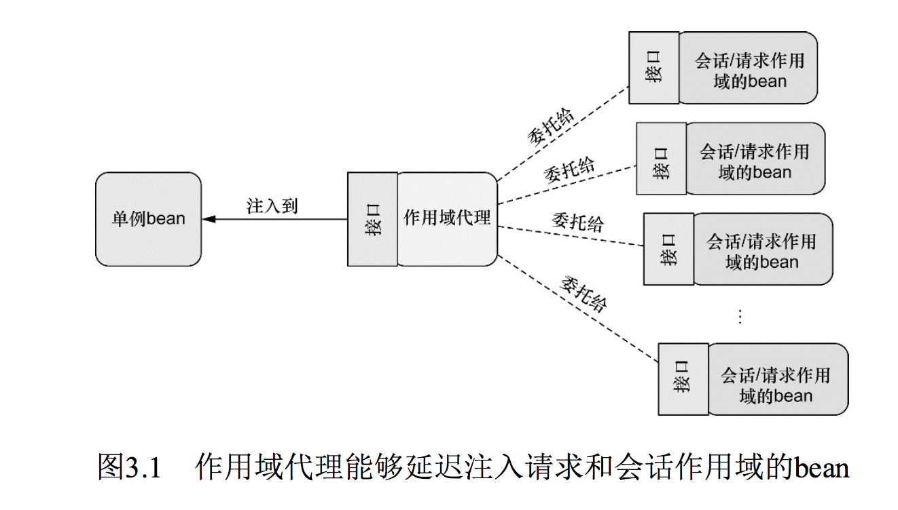 </div><br>

- **用域代理能够`延迟`注入请求和会话作用域的bean**

### 3.4.2 在XML中声明作用域代理
如果你需要使用XML来声明会话或请求作用域的bean，那么就不能使用@Scope注解及其proxyMode属性了。<bean>元素的scope属性能够设置bean的作用域，但是该怎样指定代理模式呢？

要设置代理模式，我们需要使用Spring aop命名空间的一个新元素：

```
<bean id="cart" class="com.alan.yx.springInAction.Chapter_03.scopedbeans.src.main.java.com.myapp.ShoppingCart"
          scope="session">
        <aop:scoped-proxy/>
    </bean>
```

<aop:scoped-proxy>是与@Scope注解的proxyMode属性功能相同的Spring XML配置元素。它会告诉Spring为bean创建一个作用域代理。默认情况下，它会使用CGLib创建目标类的代理。但是我们也可以将proxy-target-class属性设置为false，进而要求它生成基于接口的代理：

```
 <bean id="cart" class="com.myapp.ShoppingCart"
		          scope="session">
		        <aop:scoped-proxy proxy-target-class="false"/>
 </bean>
```

为了使用<aop:scoped-proxy>元素，我们必须在XML配置中声明Spring的aop命名空间：


```
<?xml version="1.0" encoding="UTF-8"?>
<beans xmlns="http://www.springframework.org/schema/beans"
       xmlns:xsi="http://www.w3.org/2001/XMLSchema-instance" xmlns:aop="http://www.springframework.org/schema/aop"
       xsi:schemaLocation="http://www.springframework.org/schema/beans http://www.springframework.org/schema/beans/spring-beans.xsd http://www.springframework.org/schema/aop http://www.springframework.org/schema/aop/spring-aop.xsd">

	. . .
</beans>
```

在第4章中，当我们使用Spring和面向切面编程的时候，会讨论Spring aop命名空间的更多知识。不过，在结束本章的内容之前，我们来看一下Spring高级配置的另外一个可选方案：Spring表达式语言（Spring Expression Language）。

## 3.5 运行时值注入
当讨论依赖注入的时候，我们通常所讨论的是将一个bean引用注入到另一个bean的属性或构造器参数中。它通常来讲指的是将一个对象与另一个对象进行关联。

但是bean装配的另外一个方面指的是将一个值注入到bean的属性或者构造器参数中。我们在第2章中已经进行了很多值装配，如将专辑的名字装配到BlankDisc bean的构造器或title属性中。例如，我们可能按照这样的方式来组装BlankDisc：

```
 @Bean
  public CompactDisc sgtPeppers(){
    return new BlankDisc(
            "Sgt. Pepper's Lonely Hearts Club Band",
            "The Beatles");
  }
```

尽管这实现了你的需求，也就是为BlankDisc bean设置title和artist，但它在实现的时候是将值硬编码在配置类中的。与之类似，如果使用XML的话，那么值也会是硬编码的：

```
<bean id="compactDisc"
          class="soundsystem.BlankDisc"
          c:_0="Sgt. Pepper's Lonely Hearts Club Band"
          c:_1="The Beatles">
```

有时候硬编码是可以的，但有的时候，我们可能会希望避免硬编码值，而是想让这些值在运行时再确定。为了实现这些功能，Spring提供了两种在运行时求值的方式：

- **属性占位符（Property placeholder）。**
- **Spring表达式语言（SpEL**）。

很快你就会发现这两种技术的用法是类似的，不过它们的目的和行为是有所差别的。让我们先看一下属性占位符，在这两者中它较为简单，然后再看一下更为强大的SpEL。

### 3.5.1 注入外部的值
在Spring中，处理外部值的最简单方式就是声明属性源并通过Spring的Environment来检索属性。例如，程序清单3.7展现了一个基本的Spring配置类，它使用外部的属性来装配BlankDisc bean。

程序清单3.7 使用@PropertySource注解和Environment

```
@Configuration
// 声明属性源
@PropertySource("classpath:/com/soundsystem/app.properties")
public class EnvironmentConfig {

  @Autowired
  Environment env;
  
  @Bean
  public BlankDisc blankDisc() {
    return new BlankDisc(
            // 检索属性值
        env.getProperty("disc.title"),
        env.getProperty("disc.artist"));
  }
  
}
```

在本例中，@PropertySource引用了类路径中一个名为app.properties的文件。它大致会如下所示：

```
disc.title=Sgt. Peppers Lonely Hearts Club Band
disc.artist=The Beatles
```

这个属性文件会加载到Spring的Environment中，稍后可以从这里检索属性。同时，在disc()方法中，会创建一个新的BlankDisc，它的构造器参数是从属性文件中获取的，而这是通过调用getProperty()实现的。

#### 深入学习Spring的Environment
当我们去了解Environment的时候会发现，程序清单3.7所示的getProperty()方法并不是获取属性值的唯一方法，getProperty()方法有四个重载的变种形式：

- String getProperty(String key);
- String getProperty(String key, String defaultValue);
- <T> T getProperty(String key, Class<T> targetType);
- <T> T getProperty(String key, Class<T> targetType, T defaultValue);

前两种形式的getProperty()方法都会返回String类型的值。我们已经在程序清单3.7中看到了如何使用第一种getProperty()方法。但是，你可以稍微对@Bean方法进行一下修改，这样在指定属性不存在的时候，会使用一个默认值：

```
@Bean
  public BlankDisc blankDisc() {
    return new BlankDisc(
            // 检索属性值
        env.getProperty("disc.title","Rattle and Hum"),
        env.getProperty("disc.artist","U2"));
  }
```


剩下的两种getProperty()方法与前面的两种非常类似，但是它们不会将所有的值都视为String类型。例如，假设你想要获取的值所代表的含义是连接池中所维持的连接数量。如果我们从属性文件中得到的是一个String类型的值，那么在使用之前还需要将其转换为Integer类型。但是，如果使用重载形式的getProperty()的话，就能非常便利地解决这个问题：

```
int connectionCount = env.getProperty("db.connection.count", Integer.Class, 30);
```

Environment还提供了几个与属性相关的方法，如果你在使用getProperty()方法的时候没有指定默认值，并且这个属性没有定义的话，获取到的值是null。如果你希望这个属性必须要定义，那么可以使用getRequiredProperty()方法，如下所示：

```
  @Bean
  public BlankDisc blankDisc() {
    return new BlankDisc(
            // 检索属性值
        env.getRequiredProperty()("disc.title"),
        env.getRequiredProperty()("disc.artist"));
  }
  
}
```

在这里，如果disc.title或disc.artist属性没有定义的话，将会抛出IllegalStateException异常。

如果想检查一下某个属性是否存在的话，那么可以调用Environment的containsProperty()方法：

```
boolean titleExists = env.containsProperty("disc.title");
```

最后，如果想将属性解析为类的话，可以使用getPropertyAsClass()方法：

```
Class<CompactDisc> compactDiscClass= env.getPropertyAsClass("disc.class", CompactDisc.class);
```

除了属性相关的功能以外，Environment还提供了一些方法来检查哪些profile处于激活状态：

- String[] getActiveProfiles()：返回激活profile名称的数组；
- String[] getDefaultProfiles()：返回默认profile名称的数组；
- boolean acceptsProfiles(String... profiles)：如果environment支持给定profile的话，就返回true。

在程序清单3.6中，我们已经看到了如何使用acceptsProfiles()。在那个例子中，Environment是从ConditionContext中获取到的，在bean创建之前，使用acceptsProfiles()方法来确保给定bean所需的profile处于激活状态。通常来讲，我们并不会频繁使用Environment相关的方法，但是知道有这些方法还是有好处的。

直接从Environment中检索属性是非常方便的，尤其是在Java配置中装配bean的时候。但是，Spring也提供了通过占位符装配属性的方法，这些占位符的值会来源于一个属性源。

#### 解析属性占位符
Spring一直支持将属性定义到外部的属性的文件中，并使用占位符值将其插入到Spring bean中。在Spring装配中，占位符的形式为使用`“${ … }”`包装的属性名称。作为样例，我们可以在XML中按照如下的方式解析BlankDisc构造器参数：

```
<bean id="sgtPeppers"
          class="soundsystem.BlankDisc"
          c:_0="${disc.title}"
          c:_1="${disc.artist}">
```

可以看到，title构造器参数所给定的值是从一个属性中解析得到的，这个属性的名称为disc.title。artist参数装配的是名为disc.artist的属性值。按照这种方式，XML配置没有使用任何硬编码的值，它的值是从**配置文件以外的一个源中解析得到的**。（我们稍后会讨论这些属性是如何解析的。）

如果我们依赖于组件扫描和自动装配来创建和初始化应用组件的话，那么就没有指定占位符的配置文件或类了。在这种情况下，我们可以使用@Value注解，它的使用方式与@Autowired注解非常相似。比如，在BlankDisc类中，构造器可以改成如下所示：

```
public BlankDisc(
	 @Value("${disc.title}") String title,
	 @Value("${disc.artist}") String artist) {
    this.title = title;
    this.artist = artist;
  }
```

为了使用占位符，我们必须要配置一个PropertyPlaceholderConfigurer bean或PropertySourcesPlaceholderConfigurer bean。从Spring 3.1开始，推荐使用**PropertySourcesPlaceholderConfigurer**，因为它能够基于Spring Environment及其属性源来解析占位符。

- **PropertySourcesPlaceholderConfigurer**:基于Spring Environment及其属性源来解析占位符

如下的@Bean方法在Java中配置了PropertySourcesPlaceholderConfigurer：

```
@Bean
  public PropertySourcesPlaceholderConfigurer placeholderConfigurer(){
    return new PropertySourcesPlaceholderConfigurer();
  }
```

如果你想使用XML配置的话，Spring context命名空间中的<context:propertyplaceholder>元素将会为你生成PropertySourcesPlaceholderConfigurer bean：

```
<?xml version="1.0" encoding="UTF-8"?>
<beans xmlns="http://www.springframework.org/schema/beans"
       xmlns:xsi="http://www.w3.org/2001/XMLSchema-instance"
       xmlns:c="http://www.springframework.org/schema/c"
       xmlns:context="http://www.springframework.org/schema/context"
       xsi:schemaLocation="http://www.springframework.org/schema/beans http://www.springframework.org/schema/beans/spring-beans.xsd
		http://www.springframework.org/schema/context http://www.springframework.org/schema/context/spring-context-4.0.xsd">

    <context:property-placeholder
            location="com/alan/yx/springInAction/Chapter_03/externals/src/main/resources/com/soundsystem/app.properties"/>

    <bean class="com.alan.yx.springInAction.Chapter_03.externals.src.main.java.com.soundsystem.BlankDisc"
          c:_0="${disc.title}"
          c:_1="${disc.artist}"/>

</beans>
```

解析外部属性能够将值的处理推迟到运行时，但是它的关注点在于根据名称解析来自于Spring Environment和属性源的属性。而Spring表达式语言提供了一种更通用的方式在运行时计算所要注入的值。

### 3.5.2 使用Spring表达式语言进行装配
Spring 3引入了**Spring表达式语言（Spring Expression Language，SpEL）**，它能够以一种强大和简洁的方式将值装配到bean属性和构造器参数中，在这个过程中所使用的表达式会在运行时计算得到值。使用SpEL，你可以实现超乎想象的装配效果，这是使用其他的装配技术难以做到的（甚至是不可能的）。

- **Spring表达式语言（Spring Expression Language，SpEL）**

SpEL拥有很多特性，包括：

- 使用bean的ID来引用bean；
- 调用方法和访问对象的属性；
- 对值进行算术、关系和逻辑运算；
- 正则表达式匹配；
- 集合操作。

在本书后面的内容中你可以看到，SpEL能够用在依赖注入以外的其他地方。例如，SpringSecurity支持使用SpEL表达式定义安全限制规则。另外，如果你在Spring MVC应用中使用Thymeleaf模板作为视图的话，那么这些模板可以使用SpEL表达式引用模型数据。

作为起步，我们看几个SpEL表达式的样例，以及如何将其注入到bean中。然后我们会深入学习一些SpEL的基础表达式，它们能够组合起来形成更为强大的表达式。

#### SpEL样例
SpEL是一种非常灵活的表达式语言，所以在本书中不可能面面俱到地介绍它的各种用法。但是我们可以展示几个基本的例子，这些例子会激发你的灵感，有助于你编写自己的表达式。需要了解的第一件事情就是SpEL表达式要放到`“#{ … }”`之中，这与属性占位符有些类似，属性占位符需要放到`“${ … }”`之中。下面所展现的可能是最简单的SpEL表达式了：

	#{1}

除去“#{ ... }”标记之后，剩下的就是SpEL表达式体了，也就是一个数字常量。这个表达式的计算结果就是数字1，这恐怕并不会让你感到丝毫惊讶。当然，在实际的应用程序中，我们可能并不会使用这么简单的表达式。我们可能会使用更加有意思的表达式，如：

	#{T(System).currentTimeMills}

它的最终结果是计算表达式的那一刻当前时间的毫秒数。**T()表达式会将java.lang.System视为Java中对应的类型**，因此可以调用其static修饰的currentTimeMillis()方法。

SpEL表达式也可以引用其他的bean或其他bean的属性。例如，如下的表达式会计算得到ID为sgtPeppers的bean的artist属性：

	#{sgtPeppers.artist}
	
我们还可以通过systemProperties对象引用系统属性：

	#{systemProperties['disc.title']}

这只是SpEL的几个基础样例。在本章结束之前，你还会看到很多这样的表达式。但是，在此之前，让我们看一下在bean装配的时候如何使用这些表达式。

如果通过组件扫描创建bean的话，在注入属性和构造器参数时，我们可以使用@Value注解，这与之前看到的属性占位符非常类似。不过，在这里我们所使用的不是占位符表达式，而是SpEL表达式。例如，下面的样例展现了BlankDisc，它会从系统属性中获取专辑名称和艺术家的名字：

```
public BlankDisc(
	 @Value("#{systemProperties['disc.title']}") String title,
	 @Value(("#{systemProperties['disc.artist']}") String artist) {
    this.title = title;
    this.artist = artist;
  }
```

在XML配置中，你可以将SpEL表达式传入<property>或<constructor-arg>的value属性中，或者将其作为p-命名空间或c-命名空间条目的值。例如，在如下BlankDisc bean的XML声明中，构造器参数就是通过SpEL表达式设置的：

```
 <bean class="com.soundsystem.BlankDisc"
          c:_0="#{systemProperties['disc.title']}"
          c:_1="#{systemProperties['disc.artist']}"/>
```


我们已经看过了几个简单的样例，也学习了如何将SpEL解析得到的值注入到bean中，那现在就来继续学习一下SpEL所支持的基础表达式吧。

### 表示字面值
我们在前面已经看到了一个使用SpEL来表示整数字面量的样例。它实际上还可以用来表示浮点数、String值以及Boolean值。

下面的SpEL表达式样例所表示的就是浮点值：

	#{3.1415926}

数值还可以使用科学记数法的方式进行表示。如下面的表达式计算得到的值就是98,700：

	#{9.87E4}

SpEL表达式也可以用来计算String类型的字面值，如：

	#{'Hello'}
	
最后，字面值true和false的计算结果就是它们对应的Boolean类型的值。例如：

	#{false}

在SpEL中使用字面值其实没有太大的意思，毕竟将整型属性设置为1，或者将Boolean属性设置为false时，我们并不需要使用SpEL。我承认在SpEL表达式中，只包含字面值情况并没有太大的用处。但需要记住的一点是，更有意思的SpEL表达式是由更简单的表达式组成的，因此了解在SpEL中如何使用字面量还是很有用处的。当组合更为复杂的表达式时，你迟早会用到它们。

#### 引用bean、属性和方法
SpEL所能做的另外一件基础的事情就是通过ID引用其他的bean。例如，你可以使用SpEL将一个bean装配到另外一个bean的属性中，此时要使用bean ID作为SpEL表达式（在本例中，也就是sgtPeppers）：

	#{sgtPeppers}

现在，假设我们想在一个表达式中引用sgtPeppers的artist属性：

	#{sgtPeppers.artist}

表达式主体的第一部分引用了一个ID为sgtPeppers的bean，分割符之后是对artist属性的引用。

除了引用bean的属性，我们还可以调用bean上的方法。例如，假设有另外一个bean，它的ID为artistSelector，我们可以在SpEL表达式中按照如下的方式来调用bean的selectArtist()方法：

	#{artistSelector.selectArtist()}

对于被调用方法的返回值来说，我们同样可以调用它的方法。例如，如果selectArtist()方法返回的是一个String，那么可以调用toUpperCase()将整个艺术家的名字改为大写字母形式：

	#{artistSelector.selectArtist().toUpperCase()}

如果selectArtist()的返回值不是null的话，这没有什么问题。为了避免出现NullPointerException，我们可以使用类型安全的运算符：

	#{artistSelector.selectArtist()?.toUpperCase()}

与之前只是使用点号（.）来访问toUpperCase()方法不同，现在我们使用了`“?.”`运算符。这个运算符能够在访问它右边的内容之前，确保它所对应的元素不是null。所以，如果selectArtist()的返回值是null的话，那么SpEL将不会调用toUpperCase()方法。表达式的返回值会是null。

#### 在表达式中使用类型
如果要在SpEL中访问类作用域的方法和常量的话，要依赖T()这个关键的运算符。例如，为了在SpEL中表达Java的Math类，需要按照如下的方式使用T()运算符：

	T(java.lang.Math)

这里所示的T()运算符的结果会是一个Class对象，代表了java.lang.Math。如果需要的话，我们甚至可以将其装配到一个Class类型的bean属性中。

- **T()运算符的真正价值在于它能够访问目标类型的静态方法和常量。**

例如，假如你需要将PI值装配到bean属性中。如下的SpEL就能完成该任务：

	T(java.lang.Math).PI

与之类似，我们可以调用T()运算符所得到类型的静态方法。我们已经看到了通过T()调用System.currentTimeMillis()。如下的这个样例会计算得到一个0到1之间的随机数：

	T(java.lang.Math).random()

#### SpEL运算符
SpEL提供了多个运算符，这些运算符可以用在SpEL表达式的值上。表3.1概述了这些运算符。

表3.1 用来操作表达式值的SpEL运算符

<div align="center">  </div><br>

作为使用上述运算符的一个简单样例，我们看一下下面这个SpEL表达式：

	#{ 2 * T(java.lang.Math).PI * circle.radius}

这不仅是使用SpEL中乘法运算符（*）的绝佳样例，它也为你展现了如何将简单的表达式组
合为更为复杂的表达式。在这里PI的值乘以2，然后再乘以radius属性的值，这个属性来源于ID为circle的bean。实际上，它计算了circle bean中所定义圆的周长。

类似地，你还可以在表达式中使用乘方运算符（^）来计算圆的面积：

	#{ 2 * T(java.lang.Math).PI * circle.radius ^ 2}

“^”是用于乘方计算的运算符。在本例中，我们使用它来计算圆半径的平方。

当使用String类型的值时，“+”运算符执行的是连接操作，与在Java中是一样的：

	#{disc.title + 'by' + disc.article}

SpEL同时还提供了比较运算符，用来在表达式中对值进行对比。注意在表3.1中，比较运算符有两种形式：**符号形式和文本形式**。在大多数情况下，符号运算符与对应的文本运算符作用是相同的，使用哪一种形式均可以。

例如，要比较两个数字是不是相等，可以使用双等号运算符（==）：

	#{count.total == 100}

或者，也可以使用文本型的eq运算符：

	#{count.total eq 100}

两种方式的结果都是一样的。表达式的计算结果是个Boolean值：如果counter.total等于100的话，为true，否则为false。

SpEL还提供了三元运算符（ternary），它与Java中的三元运算符非常类似。例如，如下的表达式会判断如果scoreboard.score>1000的话，计算结果为String类型的“Winner！”，否则的话，结果为Loser：

	#{scoreboard.score>1000 ？“Winner！”:"Loser"}

三元运算符的一个常见场景就是检查null值，并用一个默认值来替代null。例如，如下的表达式会判断disc.title的值是不是null，如果是null的话，那么表达式的计算结果就会是“Rattle and Hum”：

	#{disc.title ?:'Rattle and Hum'}

这种表达式通常称为Elvis运算符。这个奇怪名称的来历是，当使用符号来表示表情时，问号看起来很像是猫王（Elvis Presley）的头发。

#### 计算正则表达式
当处理文本时，有时检查文本是否匹配某种模式是非常有用的。SpEL通过matches运算符支持表达式中的模式匹配。matches运算符对String类型的文本（作为左边参数）应用正则表达式（作为右边参数）。matches的运算结果会返回一个Boolean类型的值：如果与正则表达式相匹配，则返回true；否则返回false。

为了进一步解释matches运算符，假设我们想判断一个字符串是否包含有效的邮件地址。在这个场景下，我们可以使用matches运算符，如下所示：

	#{admin.email matches '[a-zA-Z0-9._%+-]+@[a-zA-Z0-9._%+-]+\\.com'}

探寻正则表达式语法的秘密超出了本书的范围，同时我们也应该意识到这里的正则表达式还不足够健壮来涵盖所有的场景。但对于演示matches运算符的用法，这已经足够了。

#### 计算集合
SpEL中最令人惊奇的一些技巧是与集合和数组相关的。最简单的事情可能就是引用列表中的一个元素了：

	#{jukebox.song[4].title}

这个表达式会计算songs集合中第五个（基于零开始）元素的title属性，这个集合来源于ID为jukebox bean。

为了让这个表达式更丰富一些，假设我们要从jukebox中随机选择一首歌：

	#{jukebox.song[T(java.lang.Math).random()] * jukebox.song.size().title}	

“[]”运算符用来从集合或数组中按照索引获取元素，实际上，它还可以从String中获取一个字符。比如：

	#{‘This is a test’[3]}

这个表达式引用了String中的第四个（基于零开始）字符，也就是“s”。

SpEL还提供了查询运算符（.?[]），它会用来对集合进行过滤，得到集合的一个子集。作为阐述的样例，假设你希望得到jukebox中artist属性为Aerosmith的所有歌曲。如下的表达式就使用查询运算符得到了Aerosmith的所有歌曲：

	#{jukebox.song.?[artist eq 'Aerosmith']}

可以看到，选择运算符在它的方括号中接受另一个表达式。当SpEL迭代歌曲列表的时候，会对歌曲集合中的每一个条目计算这个表达式。如果表达式的计算结果为true的话，那么条目会放到新的集合中。否则的话，它就不会放到新集合中。在本例中，内部的表达式会检查歌曲的artist属性是不是等于Aerosmith。

SpEL还提供了另外两个查询运算符：“.^[]”和“`.$[]`”，它们分别用来在集合中查询第一个匹配项和最后一个匹配项。例如，考虑下面的表达式，它会查找列表中第一个artist属性为Aerosmith的歌曲：

	#{jukebox.song.^[artist eq 'Aerosmith']}

最后，SpEL还提供了投影运算符（.![]），它会从集合的每个成员中选择特定的属性放到另外一个集合中。作为样例，假设我们不想要歌曲对象的集合，而是所有歌曲名称的集合。如下的表达式会将title属性投影到一个新的String类型的集合中：

	#{jukebox.song.![title]}

实际上，投影操作可以与其他任意的SpEL运算符一起使用。比如，我们可以使用如下的表达式获得Aerosmith所有歌曲的名称列表：

	#{jukebox.song.?[artist eq 'Aerosmith'].![title]}

我们所介绍的只是SpEL功能的一个皮毛。在本书中还有更多的机会继续介绍SpEL，尤其是在定义安全规则的时候。

现在对SpEL的介绍要告一段落了，不过在此之前，我们有一个提示。在动态注入值到Springbean时，SpEL是一种很便利和强大的方式。我们有时会忍不住编写很复杂的表达式。但需要注意的是，不要让你的表达式太智能。你的表达式越智能，对它的测试就越重要。SpEL毕竟只是String类型的值，可能测试起来很困难。鉴于这一点，我**建议尽可能让表达式保持简洁，这样测试不会是什么大问题**。

## 3.6 小结
我们在本章介绍了许多背景知识，在第2章所介绍的基本bean装配基础之上，又学习了一些强大的高级装配技巧。

首先，我们学习了Spring profile，它解决了Spring bean要跨各种部署环境的通用问题。在运行时，通过将环境相关的bean与当前激活的profile进行匹配，Spring能够让相同的部署单元跨多种环境运行，而不需要进行重新构建。

Profile bean是在运行时条件化创建bean的一种方式，但是Spring 4提供了一种更为通用的方式，通过这种方式能够声明某些bean的创建与否要依赖于给定条件的输出结果。结合使用@Conditional注解和Spring Condition接口的实现，能够为开发人员提供一种强大和灵活的机制，实现条件化地创建bean。

我们还看了两种解决自动装配歧义性的方法：首选bean以及限定符。尽管将某个bean设置为首选bean是很简单的，但这种方式也有其局限性，所以我们讨论了如何将一组可选的自动装配bean，借助限定符将其范围缩小到只有一个符合条件的bean。除此之外，我们还看到了如何创建自定义的限定符注解，这些限定符描述了bean的特性。

尽管大多数的Spring bean都是以单例的方式创建的，但有的时候其他的创建策略更为合适。Spring能够让bean以单例、原型、请求作用域或会话作用域的方式来创建。在声明请求作用域或会话作用域的bean的时候，我们还学习了如何创建作用域代理，它分为基于类的代理和基于接口的代理的两种方式。最后，我们学习了Spring表达式语言，它能够在运行时计算要注入到bean属性中的值。

对于bean装配，我们已经掌握了扎实的基础知识，现在我们要将注意力转向面向切面编程（aspect-oriented programming ，AOP）了。依赖注入能够将组件及其协作的其他组件解耦，与之类似，AOP有助于将应用组件与跨多个组件的任务进行解耦。在下一章，我们将会深入学习在Spring中如何创建和使用切面。

> [1]Java 8允许出现重复的注解，只要这个注解本身在定义的时候带有@Repeatable注解就可以。不过，Spring的@Qualifier注解并没有在定义时添加@Repeatable注解。

> [2]不要责怪我，我不太认同这个名字。但是我必须承认，它看起来确实有点像猫王的头发。

# 第4章 面向切面的Spring
本章内容：

- 面向切面编程的基本原理
- 通过POJO创建切面
- 使用@AspectJ注解
- 为AspectJ切面注入依赖

```
在编写本章时，得克萨斯州（我所居住的地方）正值盛夏，这几天正在经历创历史记录的高温天气。这里真的非常热，在这种天气下，空调当然是必不可少的。但是空调的缺点是它会耗电，而电需要钱。为了享受凉爽和舒适，我们没有什么办法可以避免这种开销。这是因为每家每户都有一个电表来记录用电量，每个月都会有人来查电表，这样电力公司就知道应该收取多少费用了。

现在想象一下，如果没有电表，也没有人来查看用电量，假设现在由户主来联系电力公司并报告自己的用电量。虽然可能会有一些特别执着的户主会详细记录使用电灯、电视和空调的情况，但大多数人肯定不会这么做。基于信用的电力收费对于消费者可能非常不错，但对于电力公司来说结果可能就不那么美妙了。

监控用电量是一个很重要的功能，但并不是大多数家庭重点关注的问题。所有家庭实际上所关注的可能是修剪草坪、用吸尘器清理地毯、打扫浴室等事项。从家庭的角度来看，监控房屋的用电量是一个被动事件（其实修剪草坪也是一个被动事件——特别是在炎热的天气下）。
```

软件系统中的一些功能就像我们家里的电表一样。这些功能需要用到应用程序的多个地方，但是我们又不想在每个点都明确调用它们。**日志、安全和事务管理**的确都很重要，但它们是否为应用对象主动参与的行为呢？如果`让应用对象只关注于自己所针对的业务领域问题，而其他方面的问题由其他应用对象来处理`，这会不会更好呢？

在软件开发中，散布于应用中多处的功能被称为**横切关注点（cross-cutting concern）**。通常来讲，这些横切关注点从概念上是与应用的业务逻辑相分离的（但是往往会直接嵌入到应用的业务逻辑之中）。**把这些横切关注点与业务逻辑相`分离`正是面向切面编程（AOP）所要解决的问题。**

- **横切关注点（cross-cutting concern）**
- **AOP 有助于将 `横切关注点` 与 `影响的对象` 解耦**

在第2章，我们介绍了如何使用依赖注入（DI）管理和配置我们的应用对象。DI有助于应用对象之间的解耦，而AOP可以实现横切关注点与它们所影响的对象之间的解耦。

日志是应用切面的常见范例，但它并不是切面适用的唯一场景。通览本书，我们还会看到切面所适用的多个场景，包括声明式事务、安全和缓存。

本章展示了Spring对切面的支持，包括如何把普通类声明为一个切面和如何使用注解创建切面。除此之外，我们还会看到AspectJ——另一种流行的AOP实现——如何补充Spring AOP框架的功能。但是，我们先不管事务、安全和缓存，先看一下Spring是如何实现切面的，就从AOP的基础知识开始吧。

## 4.1 什么是面向切面编程
如前所述，切面能帮助我们模块化横切关注点。简而言之，横切关注点可以被描述为影响应用多处的功能。例如，安全就是一个横切关注点，应用中的许多方法都会涉及到安全规则。图4.1直观呈现了横切关注点的概念。

<div align="center">  </div><br>

图4.1展现了一个被划分为模块的典型应用。每个模块的核心功能都是为特定业务领域提供服务，但是这些模块都需要类似的**辅助功能**，例如安全和事务管理。

如果要重用通用功能的话，最常见的面向对象技术是**继承（inheritance）或委托（delegation）**。但是，如果在整个应用中都使用相同的基类，继承往往会导致一个脆弱的对象体系；而使用委托可能需要对委托对象进行复杂的调用。

切面提供了取代继承和委托的另一种可选方案，而且在很多场景下更清晰简洁。在使用面向切面编程时，我们仍然在一个地方定义通用功能，但是可以通过声明的方式定义这个功能要以何种方式在何处应用，而无需修改受影响的类。**横切关注点可以被模块化为特殊的类，这些类被称为切面（aspect）**。

#### 切面的好处
- 每个关注点都集中于一个地方，而不是分散到多处代码中
- 服务模块更简洁，因为它们只包含主要关注点（或核心功能）的代码，而次要关注点的代码被转移到切面中

### 4.1.1 定义AOP术语
与大多数技术一样，AOP已经形成了自己的术语。描述切面的常用术语有通知（advice）、切点（pointcut）和连接点（join point）。图4.2展示了这些概念是如何关联在一起的。

- **通知（advice）**
- **切点（pointcut）**
- **连接点（join point）**

<div align="center">  </div><br>

遗憾的是，大多数用于描述AOP功能的术语并不直观，尽管如此，它们现在已经是AOP行话的组成部分了，为了理解AOP，我们必须了解这些术语。在我们进入某个领域之前，必须学会在这个领域该如何说话。

#### 通知（Advice）
当抄表员出现在我们家门口时，他们要登记用电量并回去向电力公司报告。显然，他们必须有一份需要抄表的住户清单，他们所汇报的信息也很重要，但记录用电量才是抄表员的主要工作。

类似地，切面也有目标——它必须要完成的工作。在AOP术语中，**切面的工作被称为通知**。

**通知定义了切面是什么以及何时使用**。除了描述切面要完成的工作，通知还解决了何时执行这个工作的问题。它应该应用在某个方法被调用之前？之后？之前和之后都调用？还是只在方法抛出异常时调用？

Spring切面可以应用5种类型的通知：

- 前置通知（Before）：在目标方法被调用之前调用通知功能；
- 后置通知（After）：在目标方法完成之后调用通知，此时不会关心方法的输出是什么；
- 返回通知（After-returning）：在目标方法成功执行之后调用通知；
- 异常通知（After-throwing）：在目标方法抛出异常后调用通知；
- 环绕通知（Around）：通知包裹了被通知的方法，在被通知的方法调用之前和调用之后执行自定义的行为。

#### 连接点（Join point）
电力公司为多个住户提供服务，甚至可能是整个城市。每家都有一个电表，这些电表上的数字都需要读取，因此每家都是抄表员的潜在目标。抄表员也许能够读取各种类型的设备，但是为了完成他的工作，他的目标应该房屋内所安装的电表。

同样，我们的**应用可能也有数以千计的时机应用通知。这些时机被称为连接点。连接点是在应用执行过程中能够插入切面的一个点。**这个点可以是调`用方法时、抛出异常时、甚至修改一个字段时`。切面代码可以利用这些点插入到应用的正常流程之中，并添加新的行为。

#### 切点（Poincut）
如果让一位抄表员访问电力公司所服务的所有住户，那肯定是不现实的。实际上，电力公司为每一个抄表员都分别指定某一块区域的住户。类似地，一个切面并不需要通知应用的所有连接点。

切点有助于缩小切面所通知的连接点的范围。如果说通知定义了切面的“什么”和“何时”的话，那么切点就定义了“何处”。**切点的定义会匹配通知所要织入的一个或多个连接点**。我们通常使用明确的类和方法名称，或是利用正则表达式定义所匹配的类和方法名称来指定这些切点。有些AOP框架允许我们创建动态的切点，可以根据运行时的决策（比如方法的参数值）来决定是否应用通知。

#### 切面（Aspect）
当抄表员开始一天的工作时，他知道自己要做的事情（报告用电量）和从哪些房屋收集信息。因此，他知道要完成工作所需要的一切东西。

**切面是通知和切点的结合。**通知和切点共同定义了切面的全部内容——它**是什么，在何时和何处完成其功能**。

#### 引入（Introduction）
引入允许我们**向现有的类添加新方法或属性**。例如，我们可以创建一个Auditable通知类，该类记录了对象最后一次修改时的状态。这很简单，只需一个方法，setLastModified(Date)，和一个实例变量来保存这个状态。然后，这个新方法和实例变量就可以被引入到现有的类中，从而可以在无需修改这些现有的类的情况下，让它们具有新的行为和状态。

#### 织入（Weaving）
织入是**把切面应用到目标对象并创建新的代理对象的过程**。切面在指定的连接点被织入到目标对象中。在目标对象的生命周期里有多个点可以进行织入：

- 编译期：切面在**目标类编译时**被织入。这种方式需要特殊的编译器。`AspectJ`的织入编译器就是以这种方式织入切面的。
- 类加载期：切面在**目标类加载到JVM时**被织入。这种方式需要特殊的类加载器（ClassLoader），它可以在目标类被引入应用之前增强该目标类的字节码。`AspectJ 5`的加载时织入（load-time weaving，LTW）就支持以这种方式织入切面。
- 运行期：切面在**应用运行的某个时刻**被织入。一般情况下，在织入切面时，AOP容器会为目标对象动态地创建一个代理对象。`Spring AOP`就是以这种方式织入切面的。

要掌握的新术语可真不少啊。再看一下图4.1，现在我们已经了解了如下的知识，通知包含了需要用于多个应用对象的横切行为；连接点是程序执行过程中能够应用通知的所有点；切点定义了通知被应用的具体位置（在哪些连接点）。其中关键的概念是**切点定义了哪些连接点会得到通知**。

我们已经了解了一些基础的AOP术语，现在让我们再看看这些AOP的核心概念是如何在Spring中实现的。

### 4.1.2 Spring对AOP的支持
并不是所有的AOP框架都是相同的，它们在连接点模型上可能有强弱之分。有些允许在字段修饰符级别应用通知，而另一些只支持与方法调用相关的连接点。它们织入切面的方式和时机也有所不同。

- 无论如何,**创建切点来定义切面所织入的连接点是AOP框架的基本功能。**

因为这是一本介绍Spring的图书，所以我们会关注Spring AOP。虽然如此，Spring和AspectJ项目之间有大量的协作，而且Spring对AOP的支持在很多方面借鉴了AspectJ项目。

Spring提供了4种类型的AOP支持：

- 基于代理的经典Spring AOP；
- 纯POJO切面；
- @AspectJ注解驱动的切面；
- 注入式AspectJ切面（适用于Spring各版本）。

前三种都是Spring AOP实现的变体，**Spring AOP构建在动态代理基础之上，因此，Spring对AOP的支持局限于`方法拦截`。**

术语“经典”通常意味着是很好的东西。老爷车、经典高尔夫球赛、可口可乐精品都是好东西。但是Spring的经典AOP编程模型并不怎么样。当然，曾经它的确非常棒。但是现在Spring提供了更简洁和干净的面向切面编程方式。引入了简单的声明式AOP和基于注解的AOP之后，Spring经典的AOP看起来就显得非常笨重和过于复杂，直接使用 ProxyFactory Bean会让人感觉厌烦。所以在本书中我不会再介绍经典的Spring AOP。

- **不要再使用经典的Spring AOP（笨重和过于复杂）**

借助Spring的aop命名空间，我们可以将纯POJO转换为切面。实际上，这些POJO只是提供了满足切点条件时所要调用的方法。遗憾的是，这种技术需要XML配置，但这的确是声明式地将对象转换为切面的简便方式。

Spring借鉴了AspectJ的切面，以提供注解驱动的AOP。本质上，它依然是Spring基于代理的AOP，但是编程模型几乎与编写成熟的AspectJ注解切面完全一致。这种AOP风格的好处在于能够不使用XML来完成功能。

如果你的AOP需求超过了简单的方法调用（如构造器或属性拦截），那么你需要考虑使用AspectJ来实现切面。在这种情况下，上文所示的第四种类型能够帮助你将值注入到AspectJ驱动的切面中。

我们在将在本章展示更多的Spring AOP技术，但是在开始之前，我们必须要了解Spring AOP框架的一些关键知识。

#### Spring通知是Java编写的
Spring所创建的通知都是用标准的Java类编写的。这样的话，我们就可以使用与普通Java开发一样的集成开发环境（IDE）来开发切面。而且，定义通知所应用的切点通常会使用`注解或在Spring配置文件里采用XML`来编写，这两种语法对于Java开发者来说都是相当熟悉的。

AspectJ与之相反。虽然AspectJ现在支持基于注解的切面，但AspectJ最初是以Java语言扩展的方式实现的。这种方式有优点也有缺点。通过特有的AOP语言，我们可以获得更强大和细粒度的控制，以及更丰富的AOP工具集，但是我们需要额外学习新的工具和语法。

#### Spring在运行时通知对象
通过在代理类中包裹切面，Spring在运行期把切面织入到Spring管理的bean中。如图4.3所示，代理类封装了目标类，并拦截被通知方法的调用，再把调用转发给真正的目标bean。当代理拦截到方法调用时，在调用目标bean方法之前，会执行切面逻辑。

<div align="center">  </div><br>

直到应用需要被代理的bean时，Spring才创建代理对象。如果使用的是ApplicationContext的话，在ApplicationContext从BeanFactory中加载所有bean的时候，Spring才会创建被代理的对象。因为**Spring运行时才创建代理对象**，所以我们不需要特殊的编译器来织入Spring AOP的切面。

#### Spring只支持方法级别的连接点
正如前面所探讨过的，通过使用各种AOP方案可以支持多种连接点模型。因为Spring基于动态代理，所以Spring只支持方法连接点。这与一些其他的AOP框架是不同的，例如AspectJ和JBoss，除了方法切点，它们还提供了字段和构造器接入点。Spring缺少对字段连接点的支持，无法让我们创建细粒度的通知，例如拦截对象字段的修改。而且它不支持构造器连接点，我们就无法在bean创建时应用通知。

但是方法拦截可以满足绝大部分的需求。如果需要方法拦截之外的连接点拦截功能，那么我们可以利用Aspect来补充Spring AOP的功能。

对于什么是AOP以及Spring如何支持AOP的，我们现在已经有了一个大致的了解。现在是时候学习如何在Spring中创建切面了，让我们先从Spring的声明式AOP模型开始。

## 4.2 通过切点来选择连接点
正如之前所提过的，切点用于准确定位应该在什么地方应用切面的通知。通知和切点是切面的最基本元素。因此，了解如何编写切点非常重要。

在Spring AOP中，要使用AspectJ的切点表达式语言来定义切点。如果你已经很熟悉AspectJ，那么在Spring中定义切点就感觉非常自然。但是如果你一点都不了解AspectJ的话，本小节我们将快速介绍一下如何编写AspectJ风格的切点。如果你想进一步了解AspectJ和AspectJ切点表达式语言，我强烈推荐Ramniva Laddad编写的《AspectJ in Action》第二版（Manning，2009，www.manning.com/laddad2/）。

关于Spring AOP的AspectJ切点，最重要的一点就是Spring仅支持AspectJ切点指示器（pointcutdesignator）的一个子集。让我们回顾下，Spring是基于代理的，而某些切点表达式是与基于代理的AOP无关的。表4.1列出了Spring AOP所支持的AspectJ切点指示器。

表4.1 Spring借助AspectJ的切点表达式语言来定义Spring切面

<div align="center">  </div><br>

在Spring中尝试使用AspectJ其他指示器时，将会抛出IllegalArgument-Exception异常。

当我们查看如上所展示的这些Spring支持的指示器时，注意只有execution指示器是实际执行匹配的，而其他的指示器都是用来限制匹配的。这说明execution指示器是我们在编写切点定义时最主要使用的指示器。在此基础上，我们使用其他指示器来限制所匹配的切点。

### 4.2.1 编写切点
为了阐述Spring中的切面，我们需要有个主题来定义切面的切点。为此，我们定义一个Performance接口：

```
package concert;
public interface Performance {

    public void perform();
}
```

Performance可以代表任何类型的现场表演，如舞台剧、电影或音乐会。假设我们想编写Performance的perform()方法触发的通知。图4.4展现了一个切点表达式，这个表达式能够设置当perform()方法执行时触发通知的调用。


<div align="center">  </div><br>

我们使用execution()指示器选择Performance的perform()方法。**方法表达式以`“*”`号开始，表明了我们不关心方法返回值的类型**。然后，我们指定了**全限定类名和方法名**。对于方法参数列表，我们**使用两个点号（..）表明切点要选择任意的perform()方法，无论该方法的入参是什么**。

现在假设我们需要配置的切点仅匹配concert包。在此场景下，可以使用within()指示器来限制匹配，如图4.5所示。

<div align="center">  </div><br>

请注意我们使用了“&&”操作符把execution()和within()指示器连接在一起形成与（and）关系（切点必须匹配所有的指示器）。类似地，我们可以使用“||”操作符来标识或（or）关系，而使用“!”操作符来标识非（not）操作。

因为“&”在XML中有特殊含义，所以在Spring的XML配置里面描述切点时，我们可以使用and来代替“&&”。同样，or和not可以分别用来代替“||”和“!”。

### 4.2.2 在切点中选择bean
除了表4.1所列的指示器外，Spring还引入了一个新的bean()指示器，它允许我们在切点表达式中使用bean的ID来标识bean。bean()使用bean ID或bean名称作为参数来限制切点只匹配特定的bean。例如，考虑如下的切点：

```
excution(* concret.Performance.perform()) and bean('woodstock')
```

在这里，我们希望在执行Performance的perform()方法时应用通知，但限定bean的ID为woodstock。

在某些场景下，限定切点为指定的bean或许很有意义，但我们还可以使用非操作为除了特定ID以外的其他bean应用通知：

```
excution(* concret.Performance.perform()) and !bean('woodstock')
```

在此场景下，切面的通知会被编织到所有ID不为woodstock的bean中。

现在，我们已经讲解了编写切点的基础知识，让我们再了解一下如何编写通知和使用这些切点声明切面。

## 4.3 使用注解创建切面
使用注解来创建切面是AspectJ 5所引入的关键特性。AspectJ 5之前，编写AspectJ切面需要学习一种Java语言的扩展，但是AspectJ面向注解的模型可以非常简便地通过少量注解把任意类转变为切面。

我们已经定义了Performance接口，它是切面中切点的目标对象。现在，让我们使用AspecJ注解来定义切面。

### 4.3.1 定义切面
如果一场演出没有观众的话，那不能称之为演出。对不对？从演出的角度来看，观众是非常重要的，但是对演出本身的功能来讲，它并不是核心，这是一个单独的关注点。因此，将观众定义为一个切面，并将其应用到演出上就是较为明智的做法。

程序清单4.1展现了Audience类，它定义了我们所需的一个切面。

```
@Aspect
public class Audience {

    /**
     * 表演之前
     */
    @Before("execution(* com.alan.yx.springInAction.Chapter_04.src.main.java.Performance.perform(..))")
    public void silenceCellPhones() {
        System.out.println("silenceCellPhones");
    }

    /**
     * 表演之前
     */
    @Before("execution(* com.alan.yx.springInAction.Chapter_04.src.main.java.Performance.perform(..))")
    public void takeSeats() {
        System.out.println("takeSeats");
    }

    /**
     * 表演之后
     */
    @AfterReturning("execution(* com.alan.yx.springInAction.Chapter_04.src.main.java.Performance.perform(..))")
    public void applause(){
        System.out.println("applause");
    }

    /**
     * 表演失败之后
     */
    @AfterThrowing("execution(* com.alan.yx.springInAction.Chapter_04.src.main.java.Performance.perform(..))")
    public void demandRefund(){
        System.out.println("demandRefund");
    }
}
```

Audience类使用@AspectJ注解进行了标注。该注解表明Audience不仅仅是一个POJO，还是一个切面。Audience类中的方法都使用注解来定义切面的具体行为。

Audience有四个方法，定义了一个观众在观看演出时可能会做的事情。在演出之前，观众要就坐（takeSeats()）并将手机调至静音状态（silenceCellPhones()）。如果演出很精彩的话，观众应该会鼓掌喝彩（applause()）。不过，如果演出没有达到观众预期的话，观众会要求退款（demandRefund()）。

可以看到，这些方法都使用了通知注解来表明它们应该在什么时候调用。AspectJ提供了五个注解来定义通知，如表4.2所示。

表4.2 Spring使用AspectJ注解来声明通知方法

<div align="center">  </div><br>

Audience使用到了前面五个注解中的三个。takeSeats()和silenceCellPhones()方法都用到了@Before注解，表明它们应该在演出开始之前调用。applause()方法使用了@AfterReturning注解，它会在演出成功返回后调用。demandRefund()方法上添加了@AfterThrowing注解，这表明它会在抛出异常以后执行。

你可能已经注意到了，所有的这些注解都给定了一个切点表达式作为它的值，同时，这四个方法的切点表达式都是相同的。其实，它们可以设置成不同的切点表达式，但是在这里，这个切点表达式就能满足所有通知方法的需求。让我们近距离看一下这个设置给通知注解的切点表达式，我们发现它会在Performance的perform()方法执行时触发。

相同的切点表达式我们重复了四遍，这可真不是什么光彩的事情。这样的重复让人感觉有些不对劲。如果我们只定义这个切点一次，然后每次需要的时候引用它，那么这会是一个很好的方案。

幸好，我们完全可以这样做：@Pointcut注解能够在一个@AspectJ切面内定义可重用的切点。接下来的程序清单4.2展现了新的Audience，现在它使用了@Pointcut。

- **@Pointcut**

程序清单4.2 通过@Pointcut注解声明频繁使用的切点表达式

```
@Aspect
public class Audience2 {
    
    @Pointcut("execution(* com.alan.yx.springInAction.Chapter_04.src.main.java.Performance.perform(..))")
    public void performance(){}

    /**
     * 表演之前
     */
    @Before("performance()")
    public void silenceCellPhones() {
        System.out.println("silenceCellPhones");
    }

    /**
     * 表演之前
     */
    @Before("performance()")
    public void takeSeats() {
        System.out.println("takeSeats");
    }

    /**
     * 表演之后（鼓掌）
     */
    @AfterReturning("performance()")
    public void applause(){
        System.out.println("applause");
    }

    /**
     * 表演失败之后(退款)
     */
    @AfterThrowing("performance()")
    public void demandRefund(){
        System.out.println("demandRefund");
    }
}
```

在Audience中，performance()方法使用了@Pointcut注解。为@Pointcut注解设置的值是一个切点表达式，就像之前在通知注解上所设置的那样。通过在performance()方法上添加@Pointcut注解，我们实际上扩展了切点表达式语言，这样就可以在任何的切点表达式中使用performance()了，如果不这样做的话，你需要在这些地方使用那个更长的切点表达式。我们现在把所有通知注解中的长表达式都替换成了performance()。

performance()方法的实际内容并不重要，在这里它实际上应该是空的。其实**该方法本身只是一个标识，供@Pointcut注解依附**。

需要注意的是，除了注解和没有实际操作的performance()方法，Audience类依然是一个POJO。我们能够像使用其他的Java类那样调用它的方法，它的方法也能够独立地进行单元测试，这与其他的Java类并没有什么区别。**Audience只是一个Java类，只不过它通过注解表明会作为切面使用而已**。

- **切面类本身是一个 Java 类，只不过通过注解表明会作为切面使用，能够像使用其他的Java类那样调用它的方法**

像其他的Java类一样，它可以装配为Spring中的bean：

```
	 @Bean
    public Audience Audience() {
        return new Audience();
    }
```
如果你就此止步的话，Audience只会是Spring容器中的一个bean。即便使用了AspectJ注解，但它并不会被视为切面，这些注解不会解析，也不会创建将其转换为切面的代理。

如果你使用JavaConfig的话，可以在配置类的类级别上通过使用EnableAspectJ-AutoProxy注解启用自动代理功能。程序清单4.3展现了如何在JavaConfig中启用自动代理。

程序清单4.3 在JavaConfig中启用AspectJ注解的自动代理

```
@Configuration
@ComponentScan
// 启用 AspectJ 自动代理
@EnableAspectJAutoProxy
public class ConcertConfig {

    @Bean
    public Audience Audience() {
        return new Audience();
    }
}
```

假如你在Spring中要使用XML来装配bean的话，那么需要使用Spring aop命名空间中的<aop:aspectj-autoproxy>元素。下面的XML配置展现了如何完成该功能。

程序清单4.4 在XML中，通过Spring的aop命名空间启用AspectJ自动代理

<div align="center">  </div><br>

<font color="red"> @EnableAspectJAutoProxy 如何实现自动代理？反射、代理么</font>

不管你是使用JavaConfig还是XML，AspectJ自动代理都会为使用@Aspect注解的bean创建一个代理，这个代理会围绕着所有该切面的切点所匹配的bean。在这种情况下，将会为Concertbean创建一个代理，Audience类中的通知方法将会在perform()调用前后执行。

我们需要记住的是，Spring的AspectJ自动代理仅仅使用@AspectJ作为创建切面的指导，切面依然是基于代理的。**在本质上，它依然是Spring基于代理的切面。这一点非常重要，因为这意味着尽管使用的是@AspectJ注解，但我们仍然限于`代理方法的调用`。**如果想利用AspectJ的所有能力，我们必须在运行时使用AspectJ并且不依赖Spring来创建基于代理的切面。

到现在为止，我们的切面在定义时，使用了不同的通知方法来实现前置通知和后置通知。但是表4.2还提到了另外的一种通知：环绕通知（around advice）。环绕通知与其他类型的通知有所不同，因此值得花点时间来介绍如何进行编写。

### 4.3.2 创建环绕通知
环绕通知是最为强大的通知类型。它能够让你所编写的逻辑将被通知的目标方法完全包装起来。实际上就像在一个通知方法中同时编写前置通知和后置通知。

为了阐述环绕通知，我们重写Audience切面。这次，我们使用一个环绕通知来代替之前多个不同的前置通知和后置通知。

程序清单4.5 使用环绕通知重新实现Audience切面

```
 /**
     * 环绕通知方法
     *
     * @param jp
     */
    @Around("performance()")
    public void watchPerformance(ProceedingJoinPoint jp) {
        try {
            System.out.println("silenceCellPhones");
            System.out.println("takeSeats");
            jp.proceed();
            System.out.println("applause");
        } catch (Throwable throwable) {
            System.out.println("demandRefund");
            throwable.printStackTrace();
        }
    }
```

在这里，@Around注解表明watchPerformance()方法会作为performance()切点的环绕通知。在这个通知中，观众在演出之前会将手机调至静音并就坐，演出结束后会鼓掌喝彩。像前面一样，如果演出失败的话，观众会要求退款。

可以看到，这个通知所达到的效果与之前的前置通知和后置通知是一样的。但是，现在它们位于同一个方法中，不像之前那样分散在四个不同的通知方法里面。

关于这个新的通知方法，你首先注意到的可能是它接受**ProceedingJoinPoint**作为参数。这个对象是必须要有的，因为你要在通知中通过它来调用被通知的方法。通知方法中可以做任何的事情，当**要将控制权交给被通知的方法时，它需要调用ProceedingJoinPoint的proceed()方法。**

- **ProceedingJoinPoint**
- **ProceedingJoinPoint的proceed()方法**

**需要注意的是，别忘记调用proceed()方法。**如果不调这个方法的话，那么你的通知实际上会阻塞对被通知方法的调用。有可能这就是你想要的效果，但更多的情况是你希望在某个点上执行被通知的方法。

有意思的是，你可以不调用proceed()方法，从而阻塞对被通知方法的访问，与之类似，你也可以在通知中对它进行多次调用。要这样做的一个场景就是实现重试逻辑，也就是在被通知方法失败后，进行重复尝试。

### 4.3.3 处理通知中的参数
到目前为止，我们的切面都很简单，没有任何参数。唯一的例外是我们为环绕通知所编写的watchPerformance()示例方法中使用了ProceedingJoinPoint作为参数。除了环绕
通知，我们编写的其他通知不需要关注传递给被通知方法的任意参数。这很正常，因为我们所通知的perform()方法本身没有任何参数。

但是，如果切面所通知的方法确实有参数该怎么办呢？切面能访问和使用传递给被通知方法的参数吗？

为了阐述这个问题，让我们重新看一下2.4.4小节中的BlankDisc样例。play()方法会循环所有的磁道并调用playTrack()方法。但是，我们也可以通过playTrack()方法直接播放某一个磁道中的歌曲。

假设你想记录每个磁道被播放的次数。一种方法就是修改playTrack()方法，直接在每次调用的时候记录这个数量。但是，记录磁道的播放次数与播放本身是不同的关注点，因此不应该属于playTrack()方法。看起来，这应该是切面要完成的任务。

为了记录每个磁道所播放的次数，我们创建了TrackCounter类，它是通知playTrack()方法的一个切面。下面的程序清单展示了这个切面。

程序清单4.6 使用参数化的通知来记录磁道播放的次数

```

@Aspect
public class TrackCounter {

    private Map<Integer, Integer> trackCounts = new HashMap<>(16);

    /**
     * 通知方法
     *
     * @param trackNumber
     */
    @Pointcut("execution(* com.alan.yx.springInAction.Chapter_04.src.main.java.CompactDisc.playTrack(int))" +
            "&& args(trackNumber)")
    public void trackPlayed(int trackNumber) {
    }

    /**
     * 播放前，为该磁道计数
     *
     * @param trackNumber
     */
    @Before("trackPlayed(trackNumber)")
    public void countTrack(int trackNumber) {
        int cuurentCount = getPlayCount(trackNumber);
        trackCounts.put(trackNumber, cuurentCount + 1);
    }

    /**
     * 获取播放次数
     *
     * @param trackNumber
     * @return
     */
    private int getPlayCount(int trackNumber) {
        return trackCounts.containsValue(trackNumber) ? trackCounts.get(trackNumber) : 0;
    }

}
```

像之前所创建的切面一样，这个切面使用@Pointcut注解定义命名的切点，并使用@Before将一个方法声明为前置通知。但是，这里的不同点在于切点还声明了要提供给通知方法的参数。图4.6将切点表达式进行了分解，以展现参数是在什么地方指定的。

<div align="center">  </div><br>

在图4.6中需要关注的是切点表达式中的args(trackNumber)限定符。它表明传递给playTrack()方法的int类型参数也会传递到通知中去。参数的名称trackNumber也与切点方法签名中的参数相匹配。

这个参数会传递到通知方法中，这个通知方法是通过@Before注解和命名切点trackPlayed(trackNumber)定义的。切点定义中的参数与切点方法中的参数名称是一样的，这样就完成了从命名切点到通知方法的参数转移。

现在，我们可以在Spring配置中将BlankDisc和TrackCounter定义为bean，并启用AspectJ自动代理，如程序清单4.7所示。

程序清单4.7 配置TrackCount记录每个磁道播放的次数

```
@Configuration
// 启用 AspectJ 自动代理
@EnableAspectJAutoProxy
public class TrackCounterConfig {

    @Bean
    public CompactDisc sgtPeppers() {
        SgtPeppers sgtPeppers = new SgtPeppers();
        sgtPeppers.setTitle("new title");
        sgtPeppers.setArtist("new artist");
        return sgtPeppers;
    }

    @Bean
    public TrackCounter trackCounter() {
        return new TrackCounter();
    }
}
```

最后，为了证明它能正常工作，你可以编写如下的简单测试。它会播放几个磁道并通过TrackCounter断言播放的数量。

程序清单4.8 测试TrackCounter切面

```
@RunWith(SpringJUnit4ClassRunner.class)
@ContextConfiguration(classes= TrackCounterConfig.class)
public class TrackCounterTest {

    @Autowired
    private CompactDisc cd;

    @Autowired
    private TrackCounter counter;

    @Test
    public void testTrackCounter(){
        // 播放磁道
        cd.playTrack(1);
        cd.playTrack(2);
        cd.playTrack(3);
        cd.playTrack(3);
        cd.playTrack(3);
        cd.playTrack(4);
        cd.playTrack(4);

        // 断言期望到数量
        assertEquals(1,counter.getPlayCount(1));
        assertEquals(1,counter.getPlayCount(2));
        assertEquals(3,counter.getPlayCount(3));
        assertEquals(2,counter.getPlayCount(4));
        assertEquals(0,counter.getPlayCount(5));
        assertEquals(0,counter.getPlayCount(6));
//        assertEquals(2,counter.getPlayCount(7));
    }
}
```

到目前为止，在我们所使用的切面中，所包装的都是被通知对象的已有方法。但是，方法包装仅仅是切面所能实现的功能之一。让我们看一下如何通过编写切面，为被通知的对象引入全新的功能。

### 4.3.4 通过注解引入新功能
一些编程语言，例如Ruby和Groovy，有开放类的理念。它们可以不用直接修改对象或类的定义就能够为对象或类增加新的方法。不过，Java并不是动态语言。一旦类编译完成了，我们就很难再为该类添加新的功能了。

但是如果仔细想想，我们在本章中不是一直在使用切面这样做吗？当然，我们还没有为对象增加任何新的方法，但是已经为对象拥有的方法添加了新功能。如果切面能够为现有的方法增加额外的功能，为什么不能为一个对象增加新的方法呢？实际上，**利用被称为`引入`的AOP概念，切面可以为Spring bean添加新方法**。

回顾一下，在Spring中，切面只是实现了它们所包装bean相同接口的代理。如果除了实现这些接口，代理也能暴露新接口的话，会怎么样呢？那样的话，切面所通知的bean看起来像是实现了新的接口，即便底层实现类并没有实现这些接口也无所谓。图4.7展示了它们是如何工作的。

<div align="center">  </div><br>

我们需要注意的是，当引入接口的方法被调用时，代理会把此调用委托给实现了新接口的某个其他对象。实际上，一个bean的实现被拆分到了多个类中。

为了验证该主意能行得通，我们为示例中的所有的Performance实现引入下面的Encoreable接口：

```
public interface Encoreable {

    void performEncore();
}
```

暂且先不管Encoreable是不是一个真正存在的单词[1]，我们需要有一种方式将这个接口应用到Performance实现中。我们现在假设你能够访问Performance的所有实现，并对其进行修改，让它们都实现Encoreable接口。但是，从设计的角度来看，这并不是最好的做法，并不是所有的Performance都是具有Encoreable特性的。另外一方面，有可能无法修改所有的Performance实现，当使用第三方实现并且没有源码的时候更是如此。

值得庆幸的是，借助于AOP的引入功能，我们可以不必在设计上妥协或者侵入性地改变现有的实现。为了实现该功能，我们要创建一个新的切面：

```
@Aspect
public class EncoreableIntroducer {

    @DeclareParents(value = "com.alan.yx.springInAction.Chapter_04.src.main.java.Performance+",
            defaultImpl = DefaultEncoreable.class)
    public static Encoreable encoreable;

}
```

可以看到，EncoreableIntroducer是一个切面。但是，它与我们之前所创建的切面不同，它并没有提供前置、后置或环绕通知，而是通过@DeclareParents注解，将Encoreable接口引入到Performance bean中。

@DeclareParents注解由三部分组成：

- value属性指定了哪种类型的bean要引入该接口。在本例中，也就是所有实现Performance的类型。（标记符后面的加号表示是Performance的所有子类型，而不是Performance本身。）
- defaultImpl属性指定了为引入功能提供实现的类。在这里，我们指定的是DefaultEncoreable提供实现。
- @DeclareParents注解所标注的静态属性指明了要引入了接口。在这里，我们所引入的是Encoreable接口。

和其他的切面一样，我们需要在Spring应用中将EncoreableIntroducer声明为一个bean：

	<bean class="java.EncoreableIntroducer">

Spring的自动代理机制将会获取到它的声明，当Spring发现一个bean使用了@Aspect注解时，Spring就会创建一个代理，然后将调用委托给被代理的bean或被引入的实现，这取决于调用的方法属于被代理的bean还是属于被引入的接口。

在Spring中，注解和自动代理提供了一种很便利的方式来创建切面。它非常简单，并且只涉及到最少的Spring配置。但是，**面向注解的切面声明有一个明显的劣势：你必须能够为通知类添加注解**。为了做到这一点，必须**要有源码**。

如果你没有源码的话，或者不想将AspectJ注解放到你的代码之中，Spring为切面提供了另外一种可选方案。让我们看一下如何在Spring XML配置文件中声明切面。

## 4.4 在XML中声明切面
在本书前面的内容中，我曾经建立过这样一种原则，那就是基于注解的配置要优于基于Java的配置，基于Java的配置要优于基于XML的配置。但是，如果你需要声明切面，但是又不能为通知类添加注解的时候，那么就必须转向XML配置了。

<font color="red" size=4>待完成</font>

## 4.5 注入AspectJ切面
虽然Spring AOP能够满足许多应用的切面需求，但是与AspectJ相比，Spring AOP 是一个功能比较弱的AOP解决方案。AspectJ提供了Spring AOP所不能支持的许多类型的切点。

例如，当我们需要在创建对象时应用通知，构造器切点就非常方便。不像某些其他面向对象语言中的构造器，Java构造器不同于其他的正常方法。这使得Spring基于代理的AOP无法把通知应用于对象的创建过程。

对于大部分功能来讲，AspectJ切面与Spring是相互独立的。虽然它们可以织入到任意的Java应用中，这也包括了Spring应用，但是在应用AspectJ切面时几乎不会涉及到Spring。

但是精心设计且有意义的切面很可能依赖其他类来完成它们的工作。如果在执行通知时，切面依赖于一个或多个类，我们可以在切面内部实例化这些协作的对象。但更好的方式是，我们可以借助Spring的依赖注入把bean装配进AspectJ切面中。为了演示，我们为上面的演出创建一个新切面。具体来讲，我们以切面的方式创建一个评论员的角色，他会观看演出并且会在演出之后提供一些批评意见。下面的CriticAspect就是一个这样的切面。

程序清单4.15 使用AspectJ实现表演的评论员

```
public aspect CriticAspect {

    public CriticAspect() {
    }

    pointcut performance():execution(* perform(..));

    afterReturning(): performance(){
        System.out.println(CriticEngine.getCriticism());
    }

    private CriticEngine criticEngine;

    public void setCriticEngine(CriticEngine criticEngine){
        // 注入 CriticEngine
        this.criticEngine = criticEngine;
    }
}
```

CriticAspect的主要职责是在表演结束后为表演发表评论。程序清单4.15中的performance()切点匹配perform()方法。当它与afterReturning()通知一起配合使用时，我们可以让该切面在表演结束时起作用。

程序清单4.15有趣的地方在于并不是评论员自己发表评论，实际上，CriticAspect与一个CriticismEngine对象相协作，在表演结束时，调用该对象的getCriticism()方法来发表一个苛刻的评论。为了避免CriticAspect和CriticismEngine之间产生不必要的耦合，我们通过Setter依赖注入为CriticAspect设置CriticismEngine。图4.9展示了此关系。

<div align="center">  </div><br>

- **像其他的bean一样，Spring可以为AspectJ切面注入依赖**

CriticismEngine自身是声明了一个简单getCriticism()方法的接口。程序清单4.16为CriticismEngine的实现。

```
public class CriticismEngineImpl implements CriticismEngine {

    public CriticismEngineImpl() {
    }

    private String[] criticismPool;

    public String getCriticismEngine() {
        int i = (int) (Math.random() * 3);
        return criticismPool[i];
    }

    public void setCriticismPool(String[] criticismPool) {
        this.criticismPool = criticismPool;
    }
}
```

CriticismEngineImpl实现了CriticismEngine接口，通过从注入的评论池中随机选择一个苛刻的评论。这个类可以使用如下的XML声明为一个Spring bean。

<div align="center">  </div><br>

到目前为止，一切顺利。我们现在有了一个要赋予CriticAspect的CriticismEngine实现。剩下的就是为CriticAspect装配CriticismEngineImple。

在展示如何实现注入之前，我们必须清楚AspectJ切面根本不需要Spring就可以织入到我们的应用中。如果想使用Spring的依赖注入为AspectJ切面注入协作者，那我们就需要在Spring配置中把切面声明为一个Spring配置中的<bean>。如下的<bean>声明会把criticismEnginebean注入到CriticAspect中：

```
<bean class="java.aspect.CriticAspect"
	factory-method="aspectof">
	<property name="criticismEngine" ref="criticismEngine">
</bean>
```

很大程度上，<bean>的声明与我们在Spring中所看到的其他<bean>配置并没有太多的区别，但是最大的不同在于使用了**factory-method属性**。通常情况下，Spring bean由Spring容器初始化，但是AspectJ切面是由AspectJ在运行期创建的。等到Spring有机会为CriticAspect注入CriticismEngine时，CriticAspect已经被实例化了。

因为Spring不能负责创建CriticAspect，那就不能在 Spring中简单地把CriticAspect声明为一个bean。相反，我们需要一种方式为Spring获得已经由AspectJ创建的CriticAspect实例的句柄，从而可以注入CriticismEngine。幸好，所有的AspectJ切面都提供了一个静态的aspectOf()方法，该方法返回切面的一个单例。所以为了获得切面的实例，我们必须使用factory-method来调用asepctOf()方法而不是调用CriticAspect的构造器方法。

简而言之，Spring不能像之前那样使用<bean>声明来创建一个CriticAspect实例——它已经在运行时由AspectJ创建完成了。Spring需要通过aspectOf()工厂方法获得切面的引用，然后像<bean>元素规定的那样在该对象上执行依赖注入。

##4.6 小结
AOP是面向对象编程的一个强大补充。通过AspectJ，我们现在可以把之前分散在应用各处的行为放入可重用的模块中。我们显示地声明在何处如何应用该行为。这有效减少了代码冗余，并让我们的类关注自身的主要功能。

Spring提供了一个AOP框架，让我们把切面插入到方法执行的周围。现在我们已经学会如何把通知织入前置、后置和环绕方法的调用中，以及为处理异常增加自定义的行为。

关于在Spring应用中如何使用切面，我们可以有多种选择。通过使用@AspectJ注解和简化的配置命名空间，在Spring中装配通知和切点变得非常简单。最后，当Spring AOP不能满足需求时，我们必须转向更为强大的AspectJ。对于这些场景，我们了解了如何使用Spring为AspectJ切面注入依赖。

此时此刻，我们已经覆盖了Spring框架的基础知识，了解到如何配置Spring容器以及如何为Spring管理的对象应用切面。正如我们所看到的，这些核心技术为创建松散耦合的应用奠定了坚实的基础。

现在，我们越过这些基础的内容，看一下如何使用Spring构建真实的应用。从下一章开始，首先看到的是如何使用Spring构建Web应用。

# 第2部分 Web中的Spring
Spring通常用来开发Web应用。因此，在第2部分中，将会看到如何使用Spring的MVC框架为应用程序添加Web前端。

在第5章“构建Spring Web应用”中，你将会学习到Spring MVC的基本用法，它是构建在Spring理念之上的一个Web框架。我们将会看到如何编写处理Web请求的控制器以及如何透明地绑定请求参数和负载到业务对象上，同时它还提供了数据检验和错误处理的功能。

在第6章“渲染Web视图”中，将会基于第5章的内容继续讲解，展现了如何得到Spring MVC控制器所生成的模型数据，并将其渲染为用户浏览器中的HTML。这一章的讨论包括JavaServerPages（JSP）、Apache Tiles和Thymeleaf模板。

在第7章“Spring MVC的高级技术”中，将会学习到构建Web应用时的一些高级技术，包括自定义Spring MVC配置、处理multipart文件上传、处理异常以及使用flash属性跨请求传递数据。

第8章，“使用Spring Web Flow”将会为你展示如何使用Spring Web Flow来构建会话式、基于流程的Web应用程序。

鉴于安全是很多应用程序的重要关注点，因此第9章“保护Web应用”将会为你介绍如何使用Spring Security来为Web应用程序提供安全性，保护应用中的信息。

# 第5章 构建Spring Web应用程序
本章内容：

- 映射请求到Spring控制器
- 透明地绑定表单参数
- 校验表单提交

作为企业级Java开发者，你可能开发过一些基于Web的应用程序。对于很多Java开发人员来说，基于Web的应用程序是他们主要的关注点。如果你有这方面经验的话，你会意识到这种系统所面临的挑战。具体来讲，状态管理、工作流以及验证都是需要解决的重要特性。HTTP协议的无状态性决定了这些问题都不那么容易解决。

Spring的Web框架就是为了帮你解决这些关注点而设计的。Spring MVC基于模型-视图-控制器（Model-View-Controller，MVC）模式实现，它能够帮你构建像Spring框架那样灵活和松耦合的Web应用程序。

在本章中，我们将会介绍Spring MVC Web框架，并使用新的Spring MVC注解来构建处理各种Web请求、参数和表单输入的控制器。在深入介绍Spring MVC之前，让我们先总体上介绍一下Spring MVC，并建立起Spring MVC运行的基本配置。

## 5.1 Spring MVC起步
你见到过孩子们的捕鼠器游戏吗？这真是一个疯狂的游戏，它的目标是发送一个小钢球，让它经过一系列稀奇古怪的装置，最后触发捕鼠器。小钢球穿过各种复杂的配件，从一个斜坡上滚下来，被跷跷板弹起，绕过一个微型摩天轮，然后被橡胶靴从桶中踢出去。经过这些后，小钢球会对那只可怜又无辜的橡胶老鼠进行捕获。

乍看上去，你会认为Spring MVC框架与捕鼠器有些类似。Spring将请求在调度Servlet、处理器映射（handler mapping）、控制器以及视图解析器（view resolver）之间移动，而捕鼠器中的钢球则会在各种斜坡、跷跷板以及摩天轮之间滚动。但是，不要将Spring MVC与RubeGoldberg-esque捕鼠器游戏做过多比较。每一个Spring MVC中的组件都有特定的目的，并且它也没有那么复杂。

让我们看一下请求是如何从客户端发起，经过Spring MVC中的组件，最终再返回到客户端的。

### 5.1.1 跟踪Spring MVC的请求
每当用户在Web浏览器中点击链接或提交表单的时候，请求就开始工作了。对请求的工作描述就像是快递投送员。与邮局投递员或FedEx投送员一样，请求会将信息从一个地方带到另一个地方。

请求是一个十分繁忙的家伙。从离开浏览器开始到获取响应返回，它会经历好多站，在每站都会留下一些信息同时也会带上其他信息。图5.1展示了请求使用Spring MVC所经历的所有站点。

<div align="center">  </div><br>

在请求离开浏览器时[1]，会带有用户所请求内容的信息，至少会包含请求的URL。但是还可能带有其他的信息，例如用户提交的表单信息。

请求旅程的第一站是Spring的DispatcherServlet。与大多数基于Java的Web框架一样，Spring MVC所有的请求都会通过一个**前端控制器（front controller）**Servlet。前端控制器是常用的Web应用程序模式，在这里一个单实例的Servlet将请求委托给应用程序的其他组件来执行实际的处理。在Spring MVC中，DispatcherServlet就是前端控制器。

- **前端控制器（front controller）**

DispatcherServlet的任务是将请求发送给Spring MVC控制器（controller）。控制器是一个用于处理请求的Spring组件。在典型的应用程序中可能会有多个控制器，DispatcherServlet需要知道应该将请求发送给哪个控制器。所以DispatcherServlet以会查询一个或多个**处理器映射（handler mapping）[2]**来确定请求的下一站在哪里。处理器映射会根据请求所携带的URL信息来进行决策。

一旦选择了合适的控制器，DispatcherServlet会将请求发送给选中的**控制器[3]**。到了控制器，请求会卸下其负载（用户提交的信息）并耐心等待控制器处理这些信息。（实际上，设计良好的控制器本身只处理很少甚至不处理工作，而是将业务逻辑委托给一个或多个服务对象进行处理。）

控制器在完成逻辑处理后，通常会产生一些信息，这些信息需要返回给用户并在浏览器上显示。这些信息被称为模型（model）。不过仅仅给用户返回原始的信息是不够的——这些信息需要以用户友好的方式进行格式化，一般会是HTML。所以，信息需要发送给一个视图（view），通常会是JSP。

控制器所做的最后一件事就是将模型数据打包，并且标示出用于渲染输出的视图名。它接下来会将请求连同模型和视图名发送回DispatcherServlet[4]。

这样，控制器就不会与特定的视图相耦合，传递给DispatcherServlet的视图名并不直接表示某个特定的JSP。实际上，它甚至并不能确定视图就是JSP。相反，它仅仅传递了一个逻辑名称，这个名字将会用来查找产生结果的真正视图。DispatcherServlet将会使用**视图解析器（view resolver）[5]**来将逻辑视图名匹配为一个特定的视图实现，它可能是也可能不是JSP。

既然DispatcherServlet已经知道由哪个视图渲染结果，那请求的任务基本上也就完成了。它的最后一站是视图的实现（可能是JSP）[6]，在这里它交付模型数据。请求的任务就完成了。视图将使用模型数据渲染输出，这个输出会通过响应对象传递给客户端（不会像听上去那样硬编码[7]）。

可以看到，请求要经过很多的步骤，最终才能形成返回给客户端的响应。大多数的步骤都是在Spring框架内部完成的，也就是图5.1所示的组件中。尽管本章的主要内容都关注于如何编写控制器，但在此之前我们首先看一下如何搭建Spring MVC的基础组件。

### 5.1.2 搭建Spring MVC
基于图5.1，看上去我们需要配置很多的组成部分。幸好，借助于最近几个Spring新版本的功能增强，开始使用Spring MVC变得非常简单了。现在，我们要使用最简单的方式来配置Spring MVC：所要实现的功能仅限于运行我们所创建的控制器。在第7章中，我们会看一些其他的配置选项。

#### 配置DispatcherServlet
DispatcherServlet是Spring MVC的核心。在这里请求会第一次接触到框架，它要负责将请求**路由**到其他的组件之中。

按照传统的方式，像DispatcherServlet这样的Servlet会配置在web.xml文件中，这个文件会放到应用的WAR包里面。当然，这是配置DispatcherServlet的方法之一。但是，借助于Servlet 3规范和Spring 3.1的功能增强，这种方式已经不是唯一的方案了，这也不是我们本章所使用的配置方法。

我们会使用Java将DispatcherServlet配置在Servlet容器中，而不会再使用web.xml文件。如下的程序清单展示了所需的Java类。

程序清单5.1 配置DispatcherServlet

```
/**
 * 程序清单5.1 配置DispatcherServl
 */
public class SpitterWebInitializer extends AbstractAnnotationConfigDispatcherServletInitializer {

    @Override
    protected Class<?>[] getRootConfigClasses() {
        return new Class<?>[]{RootConfig.class};
    }

    /**
     * 指定配置类
     *
     * @return
     */
    @Override
    protected Class<?>[] getServletConfigClasses() {
        return new Class<?>[]{WebConfig.class};
    }

    /**
     * 将 DispatcherServlet 映射到 "/"
     *
     * @return
     */
    @Override
    protected String[] getServletMappings() {
        return new String[]{"/"};
    }

}
```

在我们深入介绍程序清单5.1之前，你可能想知道spittr到底是什么意思。这个类的名字是SpittrWebAppInitializer，它位于名为spittr.config的包中。我稍后会对其进行介绍（在5.1.3小节中），但现在，你只需要知道我们所要创建的应用名为Spittr。

要理解程序清单5.1是如何工作的，我们可能只需要知道扩展AbstractAnnotationConfigDispatcherServletInitializer的任意类都会自动地配置DispatcherServlet和Spring应用上下文，Spring的应用上下文会位于应用程序的Servlet上下文之中。

#### AbstractAnnotationConfigDispatcherServletInitializer剖析
如果你坚持要了解更多细节的话，那就看这里吧。在Servlet 3.0环境中，容器会在类路径中查找实现javax.servlet.ServletContainerInitializer接口的类，如果能发现的话，就会用它来配置Servlet容器。

Spring提供了这个接口的实现，名为SpringServletContainerInitializer，这个类反过来又会查找实现WebApplicationInitializer的类并将配置的任务交给它们来完成。Spring 3.2引入了一个便利的WebApplicationInitializer基础实现，也就是AbstractAnnotationConfigDispatcherServletInitializer。因为我们的SpittrWebAppInitializer扩展了AbstractAnnotationConfig
DispatcherServletInitializer（同时也就实现了WebApplicationInitializer），因此当部署到Servlet 3.0容器中的时候，容器会自动发现它，并用它来配置Servlet上下文。

尽管它的名字很长，但是AbstractAnnotationConfigDispatcherServletInitializer使用起来很简便。在程序清单5.1中，SpittrWebAppInitializer重写了三个方法。

第一个方法是getServletMappings()，它会将一个或多个路径映射到DispatcherServlet上。在本例中，它映射的是“/”，这表示它会是应用的默认Servlet。它会处理进入应用的所有请求。

为了理解其他的两个方法，我们首先要理解DispatcherServlet和一个Servlet监听器（也就是ContextLoaderListener）的关系。

#### 两个应用上下文之间的故事
当DispatcherServlet启动的时候，它会创建Spring应用上下文，并加载配置文件或配置类中所声明的bean。在程序清单5.1的getServletConfigClasses()方法中，我们要求DispatcherServlet加载应用上下文时，使用定义在WebConfig配置类（使用Java配置）中的bean。

但是在Spring Web应用中，通常还会有另外一个应用上下文。另外的这个应用上下文是由ContextLoaderListener创建的。

我们希望DispatcherServlet加载包含Web组件的bean，如控制器、视图解析器以及处理器映射，而ContextLoaderListener要加载应用中的其他bean。这些bean通常是驱动应用后端的中间层和数据层组件。

实际上，AbstractAnnotationConfigDispatcherServletInitializer会同时创建DispatcherServlet和ContextLoaderListener。GetServlet-ConfigClasses()方法返回的带有@Configuration注解的类将会用来定义DispatcherServlet应用上下文中的bean。getRootConfigClasses()方法返回的带有@Configuration注解的类将会用来配置ContextLoaderListener创建的应用上下文中的bean。

在本例中，根配置定义在RootConfig中，DispatcherServlet的配置声明在WebConfig中。稍后我们将会看到这两个类的内容。

需要注意的是，通过AbstractAnnotationConfigDispatcherServletInitializer来配置DispatcherServlet是传统web.xml方式的替代方案。如果你愿意的话，可以同时包含web.xml和AbstractAnnotationConfigDispatcherServletInitializer，但这其实并没有必要。

如果按照这种方式配置DispatcherServlet，而不是使用web.xml的话，那唯一问题在于它只能部署到支持Servlet 3.0的服务器中才能正常工作，如Tomcat 7或更高版本。Servlet 3.0规范在2009年12月份就发布了，因此很有可能你会将应用部署到支持Servlet 3.0的Servlet容器之中。

如果你还没有使用支持Servlet 3.0的服务器，那么在AbstractAnnotationConfigDispatcherServletInitializer子类中配置DispatcherServlet的方法就不适合你了。你别无选择，只能使用web.xml了。我们将会在第7章学习web.xml和其他配置选项。但现在，我们先看一下程序清单5.1中所引用的WebConfig和RootConfig，了解一下如何启用Spring MVC。

#### 启用Spring MVC
我们有多种方式来配置DispatcherServlet，与之类似，启用Spring MVC组件的方法也不仅一种。以前，Spring是使用XML进行配置的，你可以使用<mvc:annotation-driven>启用注解驱动的Spring MVC。

我们会在第7章讨论Spring MVC配置可选项的时候，再讨论<mvc:annotation-driven>。不过，现在我们会让Spring MVC的搭建过程尽可能简单并基于Java进行配置。

我们所能创建的最简单的Spring MVC配置就是一个带有@EnableWebMvc注解的类：

```
@Configuration
@EnableWebMvc
public class WebConfig{
}
```

这可以运行起来，它的确能够启用Spring MVC，但还有不少问题要解决：

- 没有配置视图解析器。如果这样的话，Spring默认会使用BeanNameView-Resolver，这个视图解析器会查找ID与视图名称匹配的bean，并且查找的bean要实现View接口，它以这样的方式来解析视图。
- 没有启用组件扫描。这样的结果就是，Spring只能找到显式声明在配置类中的控制器。
- 这样配置的话，DispatcherServlet会映射为应用的默认Servlet，所以它会处理所有的请求，包括对静态资源的请求，如图片和样式表（在大多数情况下，这可能并不是你想要的效果）。

因此，我们需要在WebConfig这个最小的Spring MVC配置上再加一些内容，从而让它变得真正有用。如下程序清单中的WebConfig解决了上面所述的问题。

程序清单5.2 最小但可用的Spring MVC配置

```
/**
 * 程序清单5.2 最小但可用的Spring MVC配置
 */
@Configuration
// 启用 spring MVC
@EnableWebMvc
// 启用组件扫描
@ComponentScan("com.alan.yx.springInAction.Chapter_05.Spittr.src.main.java.spittr.web")
public class WebConfig extends WebMvcConfigurerAdapter {

    /**
     * 配置 视图解析器
     *
     * @return
     */
    @Bean
    public ViewResolver viewResolver() {
        InternalResourceViewResolver resolver = new InternalResourceViewResolver();
        resolver.setPrefix("/WEB-INF/views/");
        resolver.setSuffix(".jsp");
        return resolver;
    }

    /**
     * 配置静态资源的处理
     *
     * @param configurer
     */
    @Override
    public void configureDefaultServletHandling(DefaultServletHandlerConfigurer configurer) {
        configurer.enable();
    }

    @Override
    public void addResourceHandlers(ResourceHandlerRegistry registry) {
        // TODO Auto-generated method stub
        super.addResourceHandlers(registry);
    }

}
```

在程序清单5.2中第一件需要注意的事情是WebConfig现在添加了@ComponentScan注解，因此将会扫描spitter.web包来查找组件。稍后你就会看到，我们所编写的控制器将会带有@Controller注解，这会使其成为组件扫描时的候选bean。因此，我们不需要在配置类中显式声明任何的控制器。

接下来，我们添加了一个ViewResolver bean。更具体来讲，是InternalResourceViewResolver。我们将会在第6章更为详细地讨论视图解析器。我们只需要知道它会查找JSP文件，在查找的时候，它会在视图名称上加一个特定的前缀和后缀（例如，名为home的视图将会解析为WEB-INFviews/home.jsp）。

最后，新的WebConfig类还扩展了WebMvcConfigurerAdapter并重写了其configureDefaultServletHandling()方法。通过调用DefaultServlet-HandlerConfigurer的enable()方法，我们要求DispatcherServlet将对静态资源的请求转发到Servlet容器中默认的Servlet上，而不是使用DispatcherServlet本身来处理此类请求。

WebConfig已经就绪，那RootConfig呢？因为本章聚焦于Web开发，而Web相关的配置通过DispatcherServlet创建的应用上下文都已经配置好了，因此现在的RootConfig相对很简单：

```
@Configuration
@Import(DataConfig.class)
@ComponentScan(basePackages = {"src.main.java.spittr"},
        excludeFilters = {@Filter(type = FilterType.ANNOTATION, value = EnableWebMvc.class)})
public class RootConfig {
    public static class WebPackage extends RegexPatternTypeFilter {
        public WebPackage() {
            super(Pattern.compile("spittr\\.web"));
        }
    }
}
```

唯一需要注意的是RootConfig使用了@ComponentScan注解。这样的话，在本书中，我们就有很多机会用非Web的组件来充实完善RootConfig。

现在，我们基本上已经可以开始使用Spring MVC构建Web应用了。此时，最大的问题在于，我们要构建的应用到底是什么。

### 5.1.3 Spittr应用简介
为了实现在线社交的功能，我们将要构建一个简单的微博（microblogging）应用。在很多方面，我们所构建的应用与最早的微博应用Twitter很类似。在这个过程中，我们会添加一些小的变化。当然，我们要使用Spring技术来构建这个应用。

因为从Twitter借鉴了灵感并且通过Spring来进行实现，所以它就有了一个名字：Spitter。再进一步，应用网站命名中流行的模式，如Flickr，我们去掉字母e，这样的话，我们就将这个应用称为Spittr。这个名称也有助于区分应用名称和领域类型，因为我们将会创建一个名为Spitter的领域类。

Spittr应用有两个基本的领域概念：Spitter（应用的用户）和Spittle（用户发布的简短状态更新）。当我们在书中完善Spittr应用的功能时，将会介绍这两个领域概念。在本章中，我们会构建应用的Web层，创建展现Spittle的控制器以及处理用户注册成为Spitter的表单。

舞台已经搭建完成了。我们已经配置了DispatcherServlet，启用了基本的Spring MVC组件并确定了目标应用。让我们进入本章的核心内容：使用Spring MVC控制器处理Web请求。

## 5.2 编写基本的控制器
在Spring MVC中，控制器只是方法上添加了@RequestMapping注解的类，这个注解声明了它们所要处理的请求。

开始的时候，我们尽可能简单，假设控制器类要处理对“/”的请求，并渲染应用的首页。程序清单5.3所示的HomeController可能是最简单的Spring MVC控制器类了。

程序清单5.3HomeController：超级简单的控制器

```
/**
 * 程序清单5.3HomeController：超级简单的控制器
 */
//声明为一个控制器
@Controller
// 处理对 "/" 的 GET 请求
@RequestMapping("/")
public class HomeController {

    @RequestMapping(method = GET)
    public String home(Model model) {
        // 视图名为 home
        return "home";
    }

}
```

你可能注意到的第一件事情就是HomeController带有@Controller注解。很显然这个注解是用来声明控制器的，但实际上这个注解对Spring MVC本身的影响并不大。

HomeController是一个构造型（stereotype）的注解，它基于@Component注解。在这里，它的目的就是辅助实现组件扫描。因为HomeController带有@Controller注解，因此组件扫描器会自动找到HomeController，并将其声明为Spring应用上下文中的一个bean。

其实，你也可以让HomeController带有@Component注解，它所实现的效果是一样的，但是在表意性上可能会差一些，无法确定HomeController是什么组件类型。

HomeController唯一的一个方法，也就是home()方法，带有@RequestMapping注解。它的value属性指定了这个方法所要处理的请求路径，method属性细化了它所处理的HTTP方法。在本例中，当收到对“/”的HTTP GET请求时，就会调用home()方法。

你可以看到，home()方法其实并没有做太多的事情：它返回了一个String类型的“home”。这个String将会被Spring MVC解读为要渲染的视图名称。DispatcherServlet会要求视图解析器将这个逻辑名称解析为实际的视图。

鉴于我们配置InternalResourceViewResolver的方式，视图名“home”将会解析为“WEB-INFviews/home.jsp”路径的JSP。现在，我们会让Spittr应用的首页相当简单，如下所示。

程序清单5.4Spittr应用的首页，定义为一个简单的JSP

```
<%@ taglib uri="http://java.sun.com/jsp/jstl/core" prefix="c" %>
<%@ page session="false" %>
<html>
<head>
    <title>Spitter</title>
    <link rel="stylesheet"
          type="text/css"
          href="<c:url value="/resources/style.css" />">
</head>
<body>
<h1>Welcome to Spitter</h1>

<a href="<c:url value="/spittles" />">Spittles</a> |
<a href="<c:url value="/spitter/register" />">Register</a>
</body>
</html>
```

这个JSP并没有太多需要注意的地方。它只是欢迎应用的用户，并提供了两个链接：一个是查看Spittle列表，另一个是在应用中进行注册。图5.2展现了此时的首页是什么样子的。

在本章完成之前，我们将会实现处理这些请求的控制器方法。但现在，让我们对这个控制器发起一些请求，看一下它是否能够正常工作。测试控制器最直接的办法可能就是构建并部署应用，然后通过浏览器对其进行访问，但是自动化测试可能会给你更快的反馈和更一致的独立结果。所以，让我们编写一个针对HomeController的测试。

<div align="center">  </div><br>

### 5.2.1 测试控制器
让我们再审视一下HomeController。如果你眼神不太好的话，你甚至可能注意不到这些注解，所看到的仅仅是一个简单的POJO。我们都知道测试POJO是很容易的。因此，我们可以编写一个简单的类来测试HomeController，如下所示：
程序清单5.5HomeControllerTest：测试HomeController

```
public class HomeControllerTest {

    @Test
    public void testHomePage() throws Exception {
        HomeController controller = new HomeController();
        assertEquals("test", "home", controller.home());
    }

}
```

程序清单5.5中的测试很简单，但它只测试了home()方法中会发生什么。在测试中会直接调用home()方法，并断言返回包含“home”值的String。它完全没有站在Spring MVC控制器的视角进行测试。这个测试没有断言当接收到针对“/”的GET请求时会调用home()方法。因为它返回的值就是“home”，所以也没有真正判断home是视图的名称。

不过从Spring 3.2开始，我们可以按照控制器的方式来测试Spring MVC中的控制器了，而不仅仅是作为POJO进行测试。Spring现在包含了一种mock Spring MVC并针对控制器执行HTTP请求的机制。这样的话，在测试控制器的时候，就没有必要再启动Web服务器和Web浏览器了。

为了阐述如何测试Spring MVC的控制器，我们重写HomeControllerTest并使用SpringMVC中新的测试特性。程序清单5.6展现了新的HomeControllerTest。

```
public class HomeControllerTest {

    @Test
    public void testHomePage() throws Exception {
        HomeController controller = new HomeController();
        MockMvc mockMvc = standaloneSetup(controller).build();
        mockMvc.perform(get("/"))
                .andExpect(view().name("home"));
    }

}
```

程序清单5.6 改进HomeControllerTest尽管新版本的测试只比之前版本多了几行代码，但是它更加完整地测试了HomeController。这次我们不是直接调用home()方法并测试它的返回值，而是发起了对“/”的GET请求，并断言结果视图的名称为home。它首先传递一个HomeController实例到MockMvcBuilders.standaloneSetup()并调用build()来构建MockMvc实例。然后它使用MockMvc实例来执行针对“/”的GET请求并设置期望得到的视图名称。

### 5.2.2 定义类级别的请求处理
现在，已经为HomeController编写了测试，那么我们可以做一些重构，并通过测试来保证不会对功能造成什么破坏。我们可以做的一件事就是拆分@RequestMapping，并将其路径映射部分放到类级别上。程序清单5.7展示了这个过程。

```
//声明为一个控制器
@Controller
// 处理对 "/" 的 GET 请求
@RequestMapping("/")
public class HomeController {

    @RequestMapping(method = GET)
    public String home() {
        // 视图名为 home
        return "home";
    }

}
```

在这个新版本的HomeController中，路径现在被转移到类级别的@RequestMapping上，而HTTP方法依然映射在方法级别上。当控制器在类级别上添加@RequestMapping注解时，这个注解会应用到控制器的所有处理器方法上。处理器方法上的@RequestMapping注解会对类级别上的@RequestMapping的声明进行补充。

就HomeController而言，这里只有一个控制器方法。与类级别的@RequestMapping合并之后，这个方法的@RequestMapping表明home()将会处理对“/”路径的GET请求。

换言之，我们其实没有改变任何功能，只是将一些代码换了个地方，但是HomeController所做的事情和以前是一样的。因为我们现在有了测试，所以可以确保在这个过程中，没有对原有的功能造成破坏。当我们在修改@RequestMapping时，还可以对HomeController做另外一个变更。@RequestMapping的value属性能够接受一个String类型的数组。到目前为止，我们给它设置的都是一个String类型的“/”。但是，我们还可以将它映射到对“/homepage”的请求，只需将类级别的@RequestMapping改为如下所示：

	@RequestMapping(value = {"/", "/homepage"})
	public class HomeController {}

现在，HomeController的home()方法能够映射到对“”和“homepage”的GET请求。

### 5.2.3 传递模型数据到视图中
到现在为止，就编写超级简单的控制器来说，HomeController已经是一个不错的样例了。但是大多数的控制器并不是这么简单。在Spittr应用中，我们需要有一个页面展现最近提交的Spittle列表。因此，我们需要一个新的方法来处理这个页面。

首先，需要定义一个数据访问的Repository。为了实现解耦以及避免陷入数据库访问的细节之中，我们将Repository定义为一个接口，并在稍后实现它（第10章中）。此时，我们只需要一个能够获取Spittle列表的Repository，如下所示的SpittleRepository功能已经足够了：

```

public interface SpittleRepository {

    List<Spittle> findSpittles(long max, int count);

}
```

findSpittles()方法接受两个参数。其中max参数代表所返回的Spittle中，SpittleID属性的最大值，而count参数表明要返回多少个Spittle对象。为了获得最新的20个Spittle对象，我们可以这样调用findSpittles()：

	spittleRepository.findSpittles(max, count);

现在，我们让Spittle类尽可能的简单，如下面的程序清单5.8所示。它的属性包括消息内容、时间戳以及Spittle发布时对应的经纬度。

```
import org.apache.commons.lang3.builder.EqualsBuilder;
import org.apache.commons.lang3.builder.HashCodeBuilder;

import java.util.Date;

/**
 * 程序清单5.8 Spittle类：包含消息内容、时间戳和位置信息
 */
public class Spittle {

    private final Long id;
    private final String message;
    private final Date time;
    /**
     * 纬度
     */
    private Double latitude;
    /**
     * 经度
     */
    private Double longitude;

    public Spittle(String message, Date time) {
        this(null, message, time, null, null);
    }

    public Spittle(Long id, String message, Date time, Double longitude, Double latitude) {
        this.id = id;
        this.message = message;
        this.time = time;
        this.longitude = longitude;
        this.latitude = latitude;
    }

    public long getId() {
        return id;
    }

    public String getMessage() {
        return message;
    }

    public Date getTime() {
        return time;
    }

    public Double getLongitude() {
        return longitude;
    }

    public Double getLatitude() {
        return latitude;
    }

    @Override
    public boolean equals(Object that) {
        return EqualsBuilder.reflectionEquals(this, that, "id", "time");
    }

    @Override
    public int hashCode() {
        return HashCodeBuilder.reflectionHashCode(this, "id", "time");
    }

}
```

就大部分内容来看，Spittle就是一个基本的POJO数据对象——没有什么复杂的。唯一要注意的是，我们使用Apache Common Lang包来实现equals()和hashCode()方法。这些方法除了常规的作用以外，当我们为控制器的处理器方法编写测试时，它们也是有用的。

既然我们说到了测试，那么我们继续讨论这个话题并为新的控制器方法编写测试。如下的程序清单使用Spring的MockMvc来断言新的处理器方法中你所期望的行为。

程序清单5.9 测试SpittleController处理针对“/spittles”的GET请求

<div align="center">  </div><br>

这个测试首先会创建SpittleRepository接口的mock实现，这个实现会从它的findSpittles()方法中返回20个Spittle对象。然后，它将这个Repository注入到一个新的SpittleController实例中，然后创建MockMvc并使用这个控制器。

需要注意的是，与HomeController不同，这个测试在MockMvc构造器上调用了setSingleView()。这样的话，mock框架就不用解析控制器中的视图名了。在很多场景中，其实没有必要这样做。但是对于这个控制器方法，视图名与请求路径是非常相似的，这样按照默认的视图解析规则时，MockMvc就会发生失败，因为无法区分视图路径和控制器的路径。在这个测试中，构建InternalResourceView时所设置的实际路径是无关紧要的，但我们将其设置为与InternalResourceViewResolver配置一致。

这个测试对“/spittles”发起GET请求，然后断言视图的名称为spittles并且模型中包含名为spittleList的属性，在spittleList中包含预期的内容。当然，如果此时运行测试的话，它将会失败。它不是运行失败，而是在编译的时候就会失败。这是因为我们还没有编写SpittleController。现在，我们创建SpittleController，让它满足程序清单5.9的预期。如下的SpittleController实现将会满足以上测试的要求。

程序清单5.10SpittleController：在模型中放入最新的spittle列表

<div align="center">  </div><br>

我们可以看到SpittleController有一个构造器，这个构造器使用了@Autowired注解，用来注入SpittleRepository。这个SpittleRepository随后又用在spittles()方法中，用来获取最新的spittle列表。

需要注意的是，我们在spittles()方法中给定了一个Model作为参数。这样，spittles()方法就能将Repository中获取到的Spittle列表填充到模型中。Model实际上就是一个Map（也就是key-value对的集合），它会传递给视图，这样数据就能渲染到客户端了。当调用addAttribute()方法并且不指定key的时候，那么key会根据值的对象类型推断确定。在本例中，因为它是一个List<Spittle>，因此，键将会推断为spittleList。

spittles()方法所做的最后一件事是返回spittles作为视图的名字，这个视图会渲染模型。

如果你希望显式声明模型的key的话，那也尽可以进行指定。例如，下面这个版本的spittles()方法与程序清单5.10中的方法作用是一样的：

```
 @RequestMapping(method = RequestMethod.GET)
    public String spittle(Model model) {
        // 将 Spittle 添加到模型中
        // 显示的指定 mode 的 key
        model.addAttribute("spittle",spittleRepository.findOne(1));
        // 返回视图名
        return "spittle";
    }
```

如果你希望使用非Spring类型的话，那么可以用java.util.Map来代替Model。下面这个版本的spittles()方法与之前的版本在功能上是一样的：

```
@RequestMapping(method = RequestMethod.GET)
    public String spittle(Map map) {
        // Map 将 Spittle 添加到模型中(效果同上)
        map.put("spittle", spittleRepository.findOne(1))
        return "spittle";
    }
```

既然我们现在提到了各种可替代的方案，那下面还有另外一种方式来编写spittles()方法：

```
 @RequestMapping(method = RequestMethod.GET)
    public List<Spittle> spittles(
            @RequestParam(value = "max", defaultValue = MAX_LONG_AS_STRING) long max,
            @RequestParam(value = "count", defaultValue = "20") int count) {
        return spittleRepository.findSpittles(max, count);
    }
```

这个版本与其他的版本有些差别。它并没有返回视图名称，也没有显式地设定模型，这个方法返回的是Spittle列表。当处理器方法像这样返回对象或集合时，**这个值会放到模型中，模型的key会根据其类型推断得出（**在本例中，也就是spittleList）。

- **模型 Mode 具备一定的推断能力**

而逻辑视图的名称将会根据请求路径推断得出。因为这个方法处理针对“/spittles”的GET请求，因此视图的名称将会是spittles（去掉开头的斜线）。

不管你选择哪种方式来编写spittles()方法，所达成的结果都是相同的。模型中会存储一个Spittle列表，key为spittleList，然后这个列表会发送到名为spittles的视图中。按照我们配置InternalResourceViewResolver的方式，视图的JSP将会是“WEB-INFviews/spittles.jsp”。现在，数据已经放到了模型中，在JSP中该如何访问它呢？实际上，当视图是JSP的时候，模型数据会作为请求属性放到请求（request）之中。因此，在spittles.jsp文件中可以使用JSTL（JavaServer Pages Standard Tag Library）的<c:forEach>标签渲染spittle列表：

<div align="center">  </div><br>

图5.3为显示效果，能够让你对它在Web浏览器中是什么样子有个可视化的印象。

尽管SpittleController很简单，但是它依然比HomeController更进一步了。不过，SpittleController和HomeController都没有处理任何形式的输入。现在，让我们扩展SpittleController，让它从客户端接受一些输入。

<div align="center">  </div><br>

## 5.3 接受请求的输入
有些Web应用是只读的。人们只能通过浏览器在站点上闲逛，阅读服务器发送到浏览器中的内容。

不过，这并不是一成不变的。众多的Web应用允许用户参与进去，将数据发送回服务器。如果没有这项能力的话，那Web将完全是另一番景象。

Spring MVC允许以多种方式将客户端中的数据传送到控制器的处理器方法中，包括：

- 查询参数（Query Parameter）。
- 表单参数（Form Parameter）。
- 路径变量（Path Variable）。

你将会看到如何编写控制器处理这些不同机制的输入。作为开始，我们先看一下如何处理带有查询参数的请求，这也是客户端往服务器端发送数据时，最简单和最直接的方式。

### 5.3.1 处理查询参数
在Spittr应用中，我们可能需要处理的一件事就是展现分页的Spittle列表。在现在的SpittleController中，它只能展现最新的Spittle，并没有办法向前翻页查看以前编写的Spittle历史记录。如果你想让用户每次都能查看某一页的Spittle历史，那么就需要提供一种方式让用户传递参数进来，进而确定要展现哪些Spittle集合。

在确定该如何实现时，假设我们要查看某一页Spittle列表，这个列表会按照最新的Spittle在前的方式进行排序。因此，下一页中第一条的ID肯定会早于当前页最后一条的ID。所以，为了显示下一页的Spittle，我们需要将一个Spittle的ID传入进来，这个ID要恰好小于当前页最后一条Spittle的ID。另外，你还可以传入一个参数来确定要展现的Spittle数量。

为了实现这个分页的功能，我们所编写的处理器方法要接受如下的参数：

- before参数（表明结果中所有Spittle的ID均应该在这个值之前）。
- count参数（表明在结果中要包含的Spittle数量）。

为了实现这个功能，我们将程序清单5.10中的spittles()方法替换为使用before和count参数的新spittles()方法。我们首先添加一个测试，这个测试反映了新spittles()方法的功能。

程序清单5.11 用来测试分页Spittle列表的新方法

```
 @Test
    public void shouldShowPagedSpittles() throws Exception {
        List<Spittle> expectedSpittles = createSpittleList(50);
        SpittleRepository mockRepository = mock(SpittleRepository.class);
        // 预期的 max 和 count 参数
        when(mockRepository.findSpittles(238900, 50))
                .thenReturn(expectedSpittles);

        SpittleController controller = new SpittleController(mockRepository);
        MockMvc mockMvc = standaloneSetup(controller)
                .setSingleView(new InternalResourceView("/WEB-INF/views/spittles.jsp"))
                .build();

        // 传入 max 和 count 参数
        mockMvc.perform(get("/spittles?max=238900&count=50"))
                .andExpect(view().name("spittles"))
                .andExpect(model().attributeExists("spittleList"))
                .andExpect(model().attribute("spittleList",
                        hasItems(expectedSpittles.toArray())));
    }
```

这个测试方法与程序清单5.9中的测试方法关键区别在于它针对“/spittles”发送GET请求，同时还传入了max和count参数。它测试了这些参数存在时的处理器方法，而另一个测试方法则测试了没有这些参数时的情景。这两个测试就绪后，我们就能确保不管控制器发生什么样的变化，它都能够处理这两种类型的请求：

```
 @RequestMapping(method = RequestMethod.GET)
    public List<Spittle> spittles(
            @RequestParam(value = "max") long max,
            @RequestParam(value = "count") int count) {
        return spittleRepository.findSpittles(max, count);
    }
```

SpittleController中的处理器方法要同时处理有参数和没有参数的场景，那我们需要对其进行修改，让它能接受参数，同时，如果这些参数在请求中不存在的话，就使用默认值Long.MAX_VALUE和20。@RequestParam注解的defaultValue属性可以完成这项任务：

```
 @RequestMapping(method = RequestMethod.GET)
    public List<Spittle> spittles(
            @RequestParam(value = "max", defaultValue = MAX_LONG_AS_STRING) long max,
            @RequestParam(value = "count", defaultValue = "20") int count) {
        return spittleRepository.findSpittles(max, count);
    }

```

现在，如果max参数没有指定的话，它将会是Long类型的最大值。因为查询参数都是String类型的，因此defaultValue属性需要String类型的值。因此，使用Long.MAX_VALUE是不行的。我们可以将Long.MAX_VALUE转换为名为MAX_LONG_-AS_STRING的String类型常量：

	private static final String MAX_LONG_AS_STRING = Lng.toString(9223372036854775807);

尽管defaultValue属性给定的是String类型的值，但是当绑定到方法的max参数时，它会转换为Long类型。

如果请求中没有count参数的话，count参数的默认值将会设置为20。

请求中的查询参数是往控制器中传递信息的常用手段。另外一种方式也很流行，尤其是在构建面向资源的控制器时，这种方式就是将传递参数作为请求路径的一部分。让我们看一下如何将路径变量作为请求路径的一部分，从而实现信息的输入。

### 5.3.2 通过路径参数接受输入
假设我们的应用程序需要根据给定的ID来展现某一个Spittle记录。其中一种方案就是编写处理器方法，通过使用@RequestParam注解，让它接受ID作为查询参数：

```
    @RequestMapping(method = RequestMethod.GET)
    public String spittle2(@RequestParam(value = "spittle_id") long spittleId,Model model){
        model.addAttribute("spittle",spittleRepository.findOne(spittleId));
        return "spittle";
    }
```

这个处理器方法将会处理形如“spittlesshow?spittle_id=12345”这样的请求。尽管这也可以正常工作，但是从面向资源的角度来看这并不理想。在理想情况下，要识别的资源（Spittle）应该通过URL路径进行标示，而不是通过查询参数。对“spittles12345”发起GET请求要优于对“spittlesshow?spittle_id=12345”发起请求。前者能够识别出要查询的资源，而后者描述的是带有参数的一个操作——本质上是通过HTTP发起的RPC。

既然已经以面向资源的控制器作为目标，那我们将这个需求转换为一个测试。程序清单5.12展现了一个新的测试方法，它会断言SpittleController中对面向资源请求的处理。

程序清单5.12 测试对某个Spittle的请求，其中ID要在路径变量中指定

```
 @Test
    public void testSpittle() throws Exception {
        Spittle expectedSpittle = new Spittle("Hello", new Date());
        SpittleRepository mockRepository = mock(SpittleRepository.class);
        when(mockRepository.findOne(12345)).thenReturn(expectedSpittle);

        SpittleController controller = new SpittleController(mockRepository);
        MockMvc mockMvc = standaloneSetup(controller).build();

        // 通过路径请求资源
        mockMvc.perform(get("/spittles/12345"))
                .andExpect(view().name("spittle"))
                .andExpect(model().attributeExists("spittle"))
                .andExpect(model().attribute("spittle", expectedSpittle));
    }
```

可以看到，这个测试构建了一个mock Repository、一个控制器和MockMvc，这与本章中我们所编写的其他测试很类似。这个测试中最重要的部分是最后几行，它对“spittles12345”发起GET请求，然后断言视图的名称是spittle，并且预期的Spittle对象放到了模型之中。因为我们还没有为这种请求实现处理器方法，因此这个请求将会失败。但是，我们可以通过为SpittleController添加新的方法来修正这个失败的测试。

到目前为止，在我们编写的控制器中，所有的方法都映射到了（通过@RequestMapping）静态定义好的路径上。但是，如果想让这个测试通过的话，我们编写的@RequestMapping要包含变量部分，这部分代表了Spittle ID。

为了实现这种路径变量，Spring MVC允许我们在**@RequestMapping路径中添加占位符。占位符的名称要用大括号（“{”和“}”）括起来**。路径中的其他部分要与所处理的请求完全匹配，但是占位符部分可以是任意的值。

下面的处理器方法使用了占位符，将Spittle ID作为路径的一部分：

```
   @RequestMapping(value = "/{spittleId}", method = RequestMethod.GET)
    public String spittle(@PathVariable("spittleId") long spittleId, Model model) {
        // 将 Spittle 添加到模型中
        model.addAttribute(spittleRepository.findOne(spittleId));
        // 返回视图名
        return "spittle";
    }
```

例如，它就能够处理针对“spittles12345”的请求，也就是程序清单5.12中的路径

我们可以看到，spittle()方法的spittleId参数上添加了@PathVariable("spittleId")注解，这表明在请求路径中，不管占位符部分的值是什么都会传递到处理器方法的spittleId参数中。如果对“spittles54321”发送GET请求，那么将会把“54321”传递进来，作为spittleId的值。

需要注意的是：在样例中spittleId这个词出现了好几次：先是在@RequestMapping的路径中，然后作为@PathVariable属性的值，最后又作为方法的参数名称。因为方法的参数名碰巧与占位符的名称相同，因此我们可以去掉@PathVariable中的value属性：

```
   @RequestMapping(value = "/{spittleId}", method = RequestMethod.GET)
    public String spittle(@PathVariable long spittleId, Model model) {
        // 将 Spittle 添加到模型中
        model.addAttribute(spittleRepository.findOne(spittleId));
        // 返回视图名
        return "spittle";
    }
```

如果@PathVariable中没有value属性的话，它会假设占位符的名称与方法的参数名相同。这能够让代码稍微简洁一些，因为不必重复写占位符的名称了。但需要注意的是，如果你想要重命名参数时，必须要同时修改占位符的名称，使其互相匹配。

spittle()方法会将参数传递到SpittleRepository的findOne()方法中，用来获取某个Spittle对象，然后将Spittle对象添加到模型中。模型的key将会是spittle，这是根据传递到addAttribute()方法中的类型推断得到的。

这样Spittle对象中的数据就可以渲染到视图中了，此时需要引用请求中key为spittle的属性（与模型的key一致）。如下为渲染Spittle的JSP视图片段：

```
<div class="spittleMessage"><c:out value="{spittle.message}"/></div>
                <div>
                <span class="spittleTime"><c:out value="{spittle.time}"/></span>
                <span class="spittleLocation">(<c:out value="{spittle.latitude}"/>,
                <c:out value="{spittle.longitude}"/>)</span>
</div>
```

这个视图并没有什么特别之处，它的屏幕截图如图5.4所示。

<div align="center">  </div><br>

如果传递请求中少量的数据，那查询参数和路径变量是很合适的。但通常我们还需要传递很多的数据（也许是表单提交的数据），那查询参数显得有些笨拙和受限了。下面让我们来看一下如何编写控制器方法来处理表单提交。

## 5.4 处理表单
Web应用的功能通常并不局限于为用户推送内容。大多数的应用允许用户填充表单并将数据提交回应用中，通过这种方式实现与用户的交互。像提供内容一样，Spring MVC的控制器也为表单处理提供了良好的支持。

使用表单分为两个方面：展现表单以及处理用户通过表单提交的数据。在Spittr应用中，我们需要有个表单让新用户进行注册。SpitterController是一个新的控制器，目前只有一个请求处理的方法来展现注册表单。

程序清单5.13SpitterController：展现一个表单，允许用户注册该应用

```
@Controller
@RequestMapping("/spitter")
public class SpitterController {

    private SpitterRepository spitterRepository;

    @Autowired
    public SpitterController(SpitterRepository spitterRepository) {
        this.spitterRepository = spitterRepository;
    }

    @RequestMapping(value = "/register", method = GET)
    public String showRegistrationForm() {
        return "registerForm";
    }
}
```

showRegistrationForm()方法的@RequestMapping注解以及类级别上的@RequestMapping注解组合起来，声明了这个方法要处理的是针对“spitterregister”的GET请求。这是一个简单的方法，没有任何输入并且只是返回名为registerForm的逻辑视图。按照我们配置InternalResourceViewResolver的方式，这意味着将会使用“WEB-INF views/registerForm.jsp”这个JSP来渲染注册表单。

尽管showRegistrationForm()方法非常简单，但测试依然需要覆盖到它。因为这个方法很简单，所以它的测试也比较简单。

程序清单5.14 测试展现表单的控制器方法

```
  /**
     * 程序清单5.14 测试展现表单的控制器方法
     *
     * @throws Exception
     */
    @Test
    public void shouldShowRegistration() throws Exception {
        SpitterRepository mockRepository = mock(SpitterRepository.class);
        SpitterController controller = new SpitterController(mockRepository);
        // 构建 mockMvc
        MockMvc mockMvc = standaloneSetup(controller).build();
        // 断言 registerForm 视图
        mockMvc.perform(get("/spitter/register"))
                .andExpect(view().name("registerForm"));
    }
```

这个测试方法与首页控制器的测试非常类似。它对“spitterregister”发送GET请求，然后断言结果的视图名为registerForm。

现在，让我们回到视图上。因为视图的名称为registerForm，所以JSP的名称需要是registerForm.jsp。这个JSP必须要包含一个HTML <form>标签，在这个标签中用户输入注册
应用的信息。如下就是我们现在所要使用的JSP。

程序清单5.15 渲染注册表单的JSP

```
<%@ taglib uri="http://java.sun.com/jsp/jstl/core" prefix="c" %>
<%@ page session="false" %>
<html>
<head>
    <title>Spitter</title>
    <link rel="stylesheet" type="text/css"
          href="<c:url value="/resources/style.css" />">
</head>
<body>
<h1>Register</h1>

<form method="POST">
    First Name: <input type="text" name="firstName"/><br/>
    Last Name: <input type="text" name="lastName"/><br/>
    Email: <input type="email" name="email"/><br/>
    Username: <input type="text" name="username"/><br/>
    Password: <input type="password" name="password"/><br/>
    <input type="submit" value="Register"/>
</form>
</body>
</html>

```

可以看到，这个JSP非常基础。它的HTML表单域中记录用户的名字、姓氏、用户名以及密码，然后还包含一个提交表单的按钮。在浏览器渲染之后，它的样子大致如图5.5所示。

需要注意的是：这里的<form>标签中并没有设置action属性。在这种情况下，当表单提交时，它会提交到与展现时相同的URL路径上。也就是说，它会提交到“spitterregister”上。

这就意味着需要在服务器端处理该HTTP POST请求。现在，我们在SpitterController中再添加一个方法来处理这个表单提交。

<div align="center">  </div><br>

### 5.4.1 编写处理表单的控制器
当处理注册表单的POST请求时，控制器需要接受表单数据并将表单数据保存为Spitter对象。最后，为了防止重复提交（用户点击浏览器的刷新按钮有可能会发生这种情况），应该将浏览器重定向到新创建用户的基本信息页面。这些行为通过下面的shouldProcessRegistration()进行了测试。

程序清单5.16 测试处理表单的控制器方法

```
@Test
    public void shouldProcessRegistration() throws Exception {
        // 构建 Repository
        SpitterRepository mockRepository = mock(SpitterRepository.class);
        Spitter unsaved = new Spitter("jbauer", "24hours", "Jack", "Bauer", "jbauer@ctu.gov");
        Spitter saved = new Spitter(24L, "jbauer", "24hours", "Jack", "Bauer", "jbauer@ctu.gov");
        when(mockRepository.save(unsaved)).thenReturn(saved);

        SpitterController controller = new SpitterController(mockRepository);
        // 构建 mockMvc
        MockMvc mockMvc = standaloneSetup(controller).build();

        mockMvc.perform(post("/spitter/register")
                .param("firstName", "Jack")
                .param("lastName", "Bauer")
                .param("username", "jbauer")
                .param("password", "24hours")
                .param("email", "jbauer@ctu.gov"))
                .andExpect(redirectedUrl("/spitter/jbauer"));

        // 校验保存情况
        verify(mockRepository, atLeastOnce()).save(unsaved);
    }
```

显然，这个测试比展现注册表单的测试复杂得多。在构建完SpitterRepository的mock实现以及所要执行的控制器和MockMvc之后，shouldProcessRegistration()对“spitter register”发起了一个POST请求。作为请求的一部分，用户信息以参数的形式放到request中，从而模拟提交的表单。

在处理POST类型的请求时，在请求处理完成后，最好进行一下重定向，这样浏览器的刷新就不会重复提交表单了。在这个测试中，预期请求会重定向到“spitterjbauer”，也就是新建用户的基本信息页面。

- **利用重定向防止浏览器的刷新就不会重复提交表单**

最后，测试会校验SpitterRepository的mock实现最终会真正用来保存表单上传入的数据。

现在，我们来实现处理表单提交的控制器方法。通过shouldProcessRegistration()方法，我们可能认为要满足这个需求需要做很多的工作。但是，在如下的程序清单中，我们可以看到新的SpitterController并没有做太多的事情。

程序清单5.17 处理所提交的表单并注册新用户

```
@Controller
@RequestMapping("/spitter")
public class SpitterController {

    private SpitterRepository spitterRepository;

    @Autowired
    public SpitterController(SpitterRepository spitterRepository) {
        this.spitterRepository = spitterRepository;
    }
    
    /**
     * 程序清单5.17 SpitterController：展现一个表单，允许用户注册该应用
     */
    @RequestMapping(value = "/register", method = POST)
    public String processRegistration(
            @Valid Spitter spitter,
            Errors errors) {
        if (errors.hasErrors()) {
            return "registerForm";
        }

        // 保存 Spitter
        spitterRepository.save(spitter);
        // 重定向到基本信息页
        return "redirect:/spitter/" + spitter.getUsername();
    }
}
```

我们之前创建的showRegistrationForm()方法依然还在，不过请注意新创建的processRegistration()方法，它接受一个Spitter对象作为参数。这个对象有firstName、lastName、username和password属性，这些属性将会使用请求中同名的参数进行填充。

当使用Spitter对象调用processRegistration()方法时，它会进而调用SpitterRepository的save()方法，SpitterRepository是在SpitterController的构造器中注入进来的。

processRegistration()方法做的最后一件事就是返回一个String类型，用来指定视图。但是这个视图格式和以前我们所看到的视图有所不同。这里不仅返回了视图的名称供视图解析器查找目标视图，而且返回的值还带有重定向的格式。

当InternalResourceViewResolver看到视图格式中的“redirect:”前缀时，它就知道要将其解析为重定向的规则，而不是视图的名称。在本例中，它将会重定向到用户基本信息的页面。例如，如果Spitter.username属性的值为“jbauer”，那么视图将会重定向到“spitterjbauer”。

需要注意的是，除了“redirect:”，InternalResourceViewResolver还能识别“forward:”前缀。当它发现视图格式中以“forward:”作为前缀时，请求将会前往（forward）指定的URL路径，而不再是重定向。

- InternalResourceViewResolver能识别**“forward:”前缀**:请求将会前往（forward）指定的URL路径
- **“redirect:”前缀**:将其解析为重定向的规则，重定向到指定的页面

万事俱备！现在，程序清单5.16中的测试应该能够通过了。但是，我们的任务还没有完成，因为我们重定向到了用户基本信息页面，那么我们应该往SpitterController中添加一个处理器方法，用来处理对基本信息页面的请求。如下的showSpitterProfile()将会完成这项任务：

```
  @RequestMapping(value = "/{username}", method = GET)
    public String showSpitterProfile(@PathVariable String username, Model model) {
        Spitter spitter = spitterRepository.findByUsername(username);
        model.addAttribute(spitter);
        return "profile";
    }
```

SpitterRepository通过用户名获取一个Spitter对象，showSpitterProfile()得到这个对象并将其添加到模型中，然后返回profile，也就是基本信息页面的逻辑视图名。像本章展现的其他视图一样，现在的基本信息视图非常简单：

<div align="center">  </div><br>

图5.6展现了在Web浏览器中渲染的基本信息页面。

如果表单中没有发送username或password的话，会发生什么情况呢？或者说，如果firstName或lastName的值为空或太长的话，又会怎么样呢？接下来，让我们看一下如何为表单提交添加校验，从而避免数据呈现的不一致性。

### 5.4.2 校验表单
如果用户在提交表单的时候，username或password文本域为空的话，那么将会导致在新建Spitter对象中，username或password是空的String。至少这是一种怪异的行为。如果这种现象不处理的话，这将会出现安全问题，因为不管是谁只要提交一个空的表单就能登录应用。

同时，我们还应该阻止用户提交空的firstName和/或lastName，使应用仅在一定程度上保持匿名性。有个好的办法就是限制这些输入域值的长度，保持它们的值在一个合理的长度范围，避免这些输入域的误用。

有种处理校验的方式非常初级，那就是在processRegistration()方法中添加代码来检查值的合法性，如果值不合法的话，就将注册表单重新显示给用户。这是一个很简短的方法，因此，添加一些额外的if语句也不是什么大问题，对吧？

与其让校验逻辑弄乱我们的处理器方法，还不如使用Spring对Java校验API（Java ValidationAPI，又称JSR-303）的支持。从Spring 3.0开始，在Spring MVC中提供了对Java校验API的支持。在Spring MVC中要使用Java校验API的话，并不需要什么额外的配置。只要保证在类路径下包含这个Java API的实现即可，比如Hibernate Validator。

Java校验API定义了多个注解，这些注解可以放到属性上，从而限制这些属性的值。所有的注解都位于javax.validation.constraints包中。表5.1列出了这些校验注解。

<div align="center">  </div><br>

<div align="center">  </div><br>

除了表5.1中的注解，Java校验API的实现可能还会提供额外的校验注解。同时，也可以定义自己的限制条件。但就我们来讲，将会关注于上表中的两个核心限制条件。

请考虑要添加到Spitter域上的限制条件，似乎需要使用@NotNull和@Size注解。我们所要做的事情就是将这些注解添加到Spitter的属性上。如下的程序清单展现了Spitter类，它的属性已经添加了校验注解。

程序清单5.18Spitter：包含了要提交到Spittle POST请求中的域

```
public class Spitter {

    private Long id;

    /**
     * 非空，5到16个字符
     */
    @NotNull
    @Size(min = 5, max = 16)
    private String username;

    @NotNull
    @Size(min = 5, max = 25)
    private String password;

    @NotNull
    @Size(min = 2, max = 30)
    private String firstName;

    @NotNull
    @Size(min = 2, max = 30)
    private String lastName;
```

现在，Spitter的所有属性都添加了@NotNull注解，以确保它们的值不为null。类似地，属性上也添加了@Size注解以限制它们的长度在最大值和最小值之间。对Spittr应用来说，这意味着用户必须要填完注册表单，并且值的长度要在给定的范围内。

我们已经为Spitter添加了校验注解，接下来需要修改processRegistration()方法来应用校验功能。启用校验功能的processRegistration()如下所示：

程序清单5.19 processRegistration()：确保所提交的数据是合法的

```
    @RequestMapping(value = "/register", method = POST)
    public String processRegistration(
            // 校验 Spitter 输入
            @Valid Spitter spitter,
            Errors errors) {
        // 如果校验出现错误，则重新返回注册菜单
        if (errors.hasErrors()) {
            return "registerForm";
        }
        // 保存 Spitter
        spitterRepository.save(spitter);
        // 重定向到基本信息页
        return "redirect:/spitter/" + spitter.getUsername();
    }
```

与程序清单5.17中最初的processRegistration()方法相比，这里有了很大的变化。Spitter参数添加了@Valid注解，这会告知Spring，需要确保这个对象满足校验限制。

- **添加了@Valid注解，告知Spring，需要确保这个对象满足校验限制**

在Spitter属性上添加校验限制并不能阻止表单提交。即便用户没有填写某个域或者某个域所给定的值超出了最大长度，processRegistration()方法依然会被调用。这样，我们就需要处理校验的错误，就像在processRegistration()方法中所看到的那样。

如果有校验出现错误的话，那么这些错误可以通过Errors对象进行访问，现在这个对象已作为processRegistration()方法的参数。（很重要一点需要注意，Errors参数要紧跟在带有@Valid注解的参数后面，@Valid注解所标注的就是要检验的参数。）processRegistration()方法所做的第一件事就是调用Errors.hasErrors()来检查是否有错误。

如果有错误的话，Errors.hasErrors()将会返回到registerForm，也就是注册表单的视图。这能够让用户的浏览器重新回到注册表单页面，所以他们能够修正错误，然后重新尝试提交。现在，会显示空的表单，但是在下一章中，我们将在表单中显示最初提交的值并将校验错误反馈给用户。如果没有错误的话，Spitter对象将会通过Repository进行保存，控制器会像之前那样重定向到基本信息页面。

## 5.5 小结
在本章中，我们为编写应用程序的Web部分开了一个好头。可以看到，Spring有一个强大灵活的Web框架。借助于注解，Spring MVC提供了近似于POJO的开发模式，这使得开发处理请求的控制器变得非常简单，同时也易于测试。

当编写控制器的处理器方法时，Spring MVC极其灵活。概括来讲，如果你的处理器方法需要内容的话，**只需将对应的对象作为参数，而它不需要的内容，则没有必要出现在参数列表中**。这样，就为请求处理带来了无限的可能性，同时还能保持一种简单的编程模型。

尽管本章中的很多内容都是关于控制器的请求处理的，但是渲染响应同样也是很重要的。我们通过使用JSP的方式，简单了解了如何为控制器编写视图。但是就Spring MVC的视图来说，它并不限于本章所看到的简单JSP。

在接下来的第6章中，我们将会更深入地学习Spring视图，包括如何在JSP中使用Spring标签库。我们还会学习如何借助Apache Tiles为视图添加一致的布局结构。同时，还会了解Thymeleaf，这是一个很有意思的JSP替代方案，Spring为其提供了内置的支持。

# 第6章 渲染Web视图
本章内容：

- 将模型数据渲染为HTML
- 使用JSP视图
- 通过tiles定义视图布局
- 使用Thymeleaf视图

上一章主要关注于如何编写处理Web请求的控制器。我们也创建了一些简单的视图，用来渲染控制器产生的模型数据，但我们并没有花太多时间讨论视图，也没有讨论控制器完成请求到结果渲染到用户的浏览器中的这段时间内到底发生了什么，而这正是本章的主要内容。

## 6.1 理解视图解析
在第5章中，我们所编写的控制器方法都没有直接产生浏览器中渲染所需的HTML。这些方法**只是将一些数据填充到模型中，然后将模型传递给一个用来渲染的视图**。这些方法会返回一个String类型的值，这个值是视图的**逻辑名称**，不会直接引用具体的视图实现。尽管我们也编写了几个简单的JavaServer Page（JSP）视图，但是控制器并不关心这些。

将控制器中请求处理的逻辑和视图中的渲染实现解耦是Spring MVC的一个重要特性。如果控制器中的方法直接负责产生HTML的话，就很难在不影响请求处理逻辑的前提下，维护和更新视图。**控制器方法和视图的实现会在模型内容上达成一致，这是两者的最大关联，**除此之外，两者应该保持足够的距离。

但是，如果控制器只通过逻辑视图名来了解视图的话，那Spring该如何确定使用哪一个视图实现来渲染模型呢？这就是Spring视图解析器的任务了。

在第5章中，我们使用名为InternalResourceViewResolver的视图解析器。在它的配置中，为了得到视图的名字，会使用“WEB-INFviews/”前缀和“.jsp”后缀，从而确定来渲染模型的JSP文件的物理位置。现在，我们回过头来看一下视图解析的基础知识以及Spring提供的其他视图解析器。

Spring MVC定义了一个名为ViewResolver的接口，它大致如下所示：

```
public interface ViewResolver {
    View resolveViewName(String var1, Locale var2) throws Exception;
}
```

当给resolveViewName()方法传入一个视图名和Locale对象时，它会返回一个View实例。View是另外一个接口，如下所示：

```
public interface View {
	default String getContentType() {
			return null;
		}
	void render(@Nullable Map<String, ?> model, HttpServletRequest request, HttpServletResponse response)
			throws Exception;

}

```

View接口的任务就是接受模型以及Servlet的request和response对象，并将输出结果渲染到response中。

这看起来非常简单。我们所需要做的就是编写ViewResolver和View的实现，将要渲染的内容放到response中，进而展现到用户的浏览器中。对吧？

实际上，我们并不需要这么麻烦。尽管我们可以编写ViewResolver和View的实现，在有些特定的场景下，这样做也是有必要的，但是一般来讲，我们并不需要关心这些接口。我在这里提及这些接口只是为了让你对视图解析内部如何工作有所了解。Spring提供了多个内置的实现，如表6.1所示，它们能够适应大多数的场景。

<div align="center">  </div><br>

<div align="center">  </div><br>

Spring 4和Spring 3.2支持表6.1中的所有视图解析器。Spring 3.1支持除Tiles 3TilesViewResolver之外的所有视图解析器。我们没有足够的篇幅介绍Spring所提供的13种视图解析器。

这其实也没什么，因为在大多数应用中，我们只会用到其中很少的一部分。

对于表6.1中的大部分视图解析器来讲，每一项都对应Java Web应用中特定的某种视图技术。InternalResourceViewResolver一般会用于JSP，TilesViewResolver用于Apache Tiles视图，而FreeMarkerViewResolver和VelocityViewResolver分别对应FreeMarker和Velocity模板视图。

在本章中，我们将会关注与大多数Java开发人员最息息相关的视图技术。因为大多数JavaWeb应用都会用到JSP，我们首先将会介绍InternalResourceViewResolver，这个视图解析器一般会用来解析JSP视图。接下来，我们将会介绍TilesViewResolver，控制JSP页面的布局。

在本章的最后，我们将会看一个没有列在表6.1中的视图解析器。Thymeleaf是一种用来替代JSP的新兴技术，Spring提供了与Thymeleaf的原生模板（natural template）协作的视图解析器，这种模板之所以得到这样的称呼是因为它更像是最终产生的HTML，而不是驱动它们的Java代码。Thymeleaf是一种非常令人兴奋的视图方案，所以你尽可以先往后翻几页，去6.4节看一下在Spring中是如何使用它的。

如果你依然停留在本页的话，那么你可能知道JSP曾经是，而且现在依然还是Java领域占主导地位的视图技术。在以前的项目中，也许你使用过JSP，将来有可能还会继续使用这项技术，所以接下来让我们看一下如何在Spring MVC中使用JSP视图。

## 6.2 创建JSP视图
todo 

## 6.3 使用Apache Tiles视图定义布局
todo 

## 6.4 使用Thymeleaf
尽管JSP已经存在了很长的时间，并且在Java Web服务器中无处不在，但是它却存在一些缺陷。JSP最明显的问题在于它看起来像HTML或XML，但它其实上并不是。大多数的JSP模板都是采用HTML的形式，但是又掺杂上了各种JSP标签库的标签，使其变得很混乱。这些标签库能够以很便利的方式为JSP带来动态渲染的强大功能，但是它也摧毁了我们想维持一个格式良好的文档的可能性。作为一个极端的样例，如下的JSP标签甚至作为HTML参数的值：

<div align="center">  </div><br>

标签库和JSP缺乏良好格式的一个副作用就是它**很少能够与其产生的HTML类似**。所以，在Web浏览器或HTML编辑器中查看未经渲染的JSP模板是非常令人困惑的，而且得到的结果看上去也非常丑陋。这个结果是不完整的——在视觉上这简直就是一场灾难！因为JSP并不是真正的HTML，很多浏览器和编辑器展现的效果都很难在审美上接近模板最终所渲染出来的效果。

同时，**JSP规范是与Servlet规范紧密耦合的**。这意味着它只能用在基于Servlet的Web应用之中。JSP模板不能作为通用的模板（如格式化Email），也不能用于非Servlet的Web应用。

多年来，在Java应用中，有多个项目试图挑战JSP在视图领域的统治性地位。最新的挑战者是Thymeleaf，它展现了一些切实的承诺，是一项很令人兴奋的可选方案。Thymeleaf模板是原生的，不依赖于标签库。它能在接受原始HTML的地方进行编辑和渲染。因为它没有与Servlet规范耦合，因此Thymeleaf模板能够进入JSP所无法涉足的领域。现在，我们看一下如何在Spring MVC中使用Thymeleaf。

### 6.4.1 配置Thymeleaf视图解析器
为了要在Spring中使用Thymeleaf，我们需要配置三个启用Thymeleaf与Spring集成的bean：

- ThymeleafViewResolver：将逻辑视图名称解析为Thymeleaf模板视图；
- SpringTemplateEngine：处理模板并渲染结果；
- TemplateResolver：加载Thymeleaf模板。

如下为声明这些bean的Java配置。

程序清单6.4 使用Java代码的方式，配置Spring对Thymeleaf的支持

```
  /**
     * Thymeleaf 视图解析器
     *
     * @param templateEngine
     * @return
     */
    @Bean
    public ViewResolver viewResolver(SpringTemplateEngine templateEngine) {
        ThymeleafViewResolver viewResolver = new ThymeleafViewResolver();
        viewResolver.setTemplateEngine(templateEngine);
        return viewResolver;
    }

    /**
     * 模版引擎
     *
     * @param templateResolver
     * @return
     */
    @Bean
    public SpringTemplateEngine templateEngine(TemplateResolver templateResolver) {
        SpringTemplateEngine templateEngine = new SpringTemplateEngine();
        templateEngine.setTemplateResolver(templateResolver);
        return templateEngine;
    }

    /**
     * 模版解析器
     *
     * @return
     */
    @Bean
    public TemplateResolver templateResolver() {
        TemplateResolver templateResolver = new ServletContextTemplateResolver();
        templateResolver.setPrefix("/WEB-INF/views/");
        templateResolver.setSuffix(".html");
        templateResolver.setTemplateMode("HTML5");
        return templateResolver;
    }
```

如果你更愿意使用XML来配置bean，那么如下的<bean>声明能够完成该任务。

程序清单6.5 使用XML的方式，配置Spring对Thymeleaf的支持

<div align="center">  </div><br>

不管使用哪种配置方式，Thymeleaf都已经准备就绪了，它可以将响应中的模板渲染到SpringMVC控制器所处理的请求中。

ThymeleafViewResolver是Spring MVC中ViewResolver的一个实现类。像其他的视图解析器一样，它会接受一个逻辑视图名称，并将其解析为视图。不过在该场景下，视图会是一个Thymeleaf模板。

需要注意的是ThymeleafViewResolver bean中注入了一个对SpringTemplateEngine bean的引用。SpringTemplateEngine会在Spring中启用Thymeleaf引擎，用来解析模板，并基于这些模板渲染结果。可以看到，我们为其注入了一个TemplateResolverbean的引用。

TemplateResolver会最终定位和查找模板。与之前配置InternalResourceViewResolver类似，它使用了prefix和suffix属性。前缀和后缀将会与逻辑视图名组合使用，进而定位Thymeleaf引擎。它的templateMode属性被设置成了HTML 5，这表明我们预期要解析的模板会渲染成HTML 5输出。

所有的Thymeleaf bean都已经配置完成了，那么接下来我们该创建几个视图了。

### 6.4.2 定义Thymeleaf模板
Thymeleaf在很大程度上就是HTML文件，与JSP不同，它没有什么特殊的标签或标签库。Thymeleaf之所以能够发挥作用，是因为它通过自定义的命名空间，为标准的HTML标签集合添加Thymeleaf属性。如下的程序清单展现了home.html，也就是使用Thymeleaf命名空间的首页模板。

程序清单6.6home.html：使用Thymeleaf命名空间的首页模板引擎

```
<html xmlns="http://www.w3.org/1999/xhtml"
      xmlns:th="http://www.thymeleaf.org">
<!--声明 thymeleaf 命名空间-->
<head>
    <title>Spitter</title>
    <!--到样式表到 th:href 链接-->
    <link rel="stylesheet"
          type="text/css"
          th:href="@{/resources/style.css}"></link>
</head>
<body>
<div id="header" th:include="page :: header"></div>

<div id="content">
    <h1>Welcome to Spitter</h1>

    <!--到页面的 th:href 链接-->
    <a th:href="@{/spittles}">Spittles</a> |
    <a th:href="@{/spitter/register}">Register</a>

    <br/>

    View: <span th:text="{view}">unknown</span>
</div>
<div id="footer" th:include="page :: copy"></div>
</body>
</html>
```

首页模板相对来讲很简单，只使用了th:href属性。这个属性与对应的原生HTML属性很类似，也就是href属性，并且可以按照相同的方式来使用。th:href属性的特殊之处在于它的值中可以包含Thymeleaf表达式，用来计算动态的值。它会渲染成一个标准的href属性，其中会包含在渲染时动态创建得到的值。这是Thymeleaf命名空间中很多属性的运行方式：它们对应标准的HTML属性，并且具有相同的名称，但是会渲染一些计算后得到的值。在本例中，使用th:href属性的三个地方都用到了“@{}”表达式，用来计算相对于URL的路径（就像在JSP页面中，我们可能会使用的JSTL <c:url>标签或Spring<s:url>标签类似）。

尽管home.html是一个相当简单的Thymeleaf模板，但是它依然很有价值，这在于它与纯HTML模板非常接近。唯一的区别之处在于th:href属性，否则的话，它就是基础且功能丰富的HTML文件。

这意味着Thymeleaf模板与JSP不同，它能够按照原始的方式进行编辑甚至渲染，而不必经过任何类型的处理器。当然，我们需要Thymeleaf来处理模板并渲染得到最终期望的输出。即便如此，如果没有任何特殊的处理，home.html也能够加载到Web浏览器中，并且看上去与完整渲染的效果很类似。为了更加清晰地阐述这一点，图6.6对比了home.jsp（上方）和home.html（下方）在Web浏览器中的显式效果。

可以看到，在Web浏览器中，JSP模板的渲染效果很糟糕。尽管我们可以看到一些熟悉的元素，但是JSP标签库的声明也显示了出来。在链接前出现了一些令人费解的未闭合标记，这是Web浏览器没有正常解析<s:url>标签的结果。

与之相反，Thymeleaf模板的渲染效果基本上没有任何错误。稍微有点问题的是链接部分，Web浏览器并不会像处理href属性那样处理th:href，所以链接并没有渲染为链接的样子。除了这些细微的问题，模板的渲染效果与我们的预期完全符合。

像home.jsp这样的模板作为Thymeleaf入门是很合适的。但是Spring的JSP标签所擅长的是表单绑定。如果我们抛弃JSP的话，那是不是也要抛弃表单绑定呢？不必担心。Thymeleaf提供了与之相匹敌的功能。

<div align="center">  </div><br>

#### 借助Thymeleaf实现表单绑定
表单绑定是Spring MVC的一项重要特性。它能够将表单提交的数据填充到命令对象中，并将其传递给控制器，而在展现表单的时候，表单中也会填充命令对象中的值。如果没有表单绑定功能的话，我们需要确保HTML表单域要映射后端命令对象中的属性，并且在校验失败后展现表单的时候，还要负责确保输入域中值要设置为命令对象的属性。

但是，如果有表单绑定的话，它就会负责这些事情了。为了复习一下表单绑定是如何运行的，下面展现了在registration.jsp中的First Name输入域：

<div align="center">  </div><br>

在这里，调用了Spring表单绑定标签库的<sf:input>标签，它会渲染出一个HTML<input>标签，并且其value属性设置为后端对象firstName属性的值。它还使用了Spring的<sf:label>标签及其cssErrorClass属性，如果出现校验错误的话，会将文本标记渲染为红色。

但是，我们本节讨论的并不是JSP，而是使用Thymeleaf替换JSP。因此，我们不能使用Spring的JSP标签实现表单绑定，而是使用Thymeleaf的Spring方言。作为阐述的样例，请参考如下的Thymeleaf模板片段，它会渲染First Name输入域：

<div align="center">  </div><br>

在这里，我们不再使用Spring JSP标签中的cssClassName属性，而是在标准的HTML标签
上使用th:class属性。th:class属性会渲染为一个class属性，它的值是根据给定的表达式计算得到的。在上面的这两个th:class属性中，它会直接检查firstName域有没有校验错误。如果有的话，class属性在渲染时的值为error。如果这个域没有错误的话，将不会渲染class属性。

<input>标签使用了th:field属性，用来引用后端对象的firstName域。这可能与你的预期有点差别。在Thymeleaf模板中，我们在很多情况下所使用的属性都对应于标准的HTML属性，因此貌似使用th:value属性来设置<input>标签的value属性才是合理的。

其实不然，因为我们是在将这个输入域绑定到后端对象的firstName属性上，因此使用th:field属性引用firstName域。通过使用th:field，我们将value属性设置为firstName的值，同时还会将name属性设置为firstName。为了阐述Thymeleaf是如何实际运行的，如下的程序清单展示了完整的注册表单模板。

程序清单6.7 注册页面，使用Thymeleaf将一个表单绑定到命令对象上

<div align="center">  </div><br>

程序清单6.7使用了相同的Thymeleaf属性和“{}”表达式，为所有的表单域绑定后端对象。这其实重复了我们在First Name域中所做的事情。

但是，需要注意我们在表单的顶部了也使用了Thymeleaf，它会用来渲染所有的错误。<div>元素使用th:if属性来检查是否有校验错误。如果有的话，会渲染<div>，否则的话，它将不会渲染。

在<div>中，会使用一个无顺序的列表来展现每项错误。<li>标签上的th:each属性将会通知Thymeleaf为每项错误都渲染一个<li>，在每次迭代中会将当前错误设置到一个名
为err的变量中。

<li>标签还有一个th:text属性。这个命令会通知Thymeleaf计算某一个表达式（在本例中，也就是err变量）并将它的值渲染为<li>标签的内容体。实际上的效果就是每项错误对应一个<li>元素，并展现错误的文本。

你可能会想知道 `“${}”`和`“*{}”`括起来的表达式到底有什么区别。“{}”表达式（如{spitter}）是变量表达式（variable expression）。一般来讲，它们会是**对象图导航语言（Object-Graph Navigation Language，OGNL）表达式**（http://commons.apache.org/proper/commons-ognl/）。但在使用Spring的时候，它们是SpEL表达式。在{spitter}这个例子中，它会解析为key为spitter的model属性。

而对于`“*{}”`表达式，它们是选择表达式（selection expression）。变量表达式是基于整个SpEL上下文计算的，而选择表达式是基于某一个选中对象计算的。在本例的表单中，选中对象就是<form>标签中th:object属性所设置的对象：模型中的Spitter对象。因此，“*{firstName}”表达式就会计算为Spitter对象的firstName属性。

- **对象图导航语言（Object-Graph Navigation Language，OGNL）表达式**

## 6.5 小结
处理请求只是Spring MVC功能的一部分。如果控制器所产生的结果想要让人看到，那么它们产生的模型数据就要渲染到视图中，并展现到用户的Web浏览器中。Spring的视图渲染是很灵活的，并提供了多个内置的可选方案，包括传统的JavaServer Pages以及流行的ApacheTiles布局引擎。

在本章中，我们首先快速了解了一下Spring所提供的视图和视图解析可选方案。我们还深入学习了如何在Spring MVC中使用JSP和Apache Tiles。

我们还看到了如何使用Thymeleaf作为Spring MVC应用的视图层，它被视为JSP的替代方案。Thymeleaf是一项很有吸引力的技术，因为它能创建原始的模板，这些模板是纯HTML，能像静态HTML那样以原始的方式编写和预览，并且能够在运行时渲染动态模型数据。除此之外，Thymeleaf是与Servlet没有耦合关系的，这样它就能够用在JSP所不能使用的领域中。

Spittr应用的视图定义完成之后，我们已经具有了一个虽然微小但是可部署且具有一定功能的Spring MVC Web应用。还有一些其他的特性需要更新进来，如数据持久化和安全性，我们会在合适的时候关注这些特性。但现在，这个应用开始变得有模有样了。

在深入学习应用的技术栈之前，在下一章我们将会继续讨论Spring MVC，学习这个框架中一些更为有用和高级的功能。

# 第7章 Spring MVC的高级技术
本章内容：

- Spring MVC配置的替代方案
- 处理文件上传
- 在控制器中处理异常
- 使用flash属性

在本章中，我们会继续Spring MVC的话题，本章所介绍的特性已经超出了第5章和第6章基础知识的范畴。我们将会看到如何编写控制器来处理文件上传、如何处理控制器所抛出的异常，以及如何在模型中传递数据，使其能够在重定向（redirect）之后依然存活。

但首先，我要兑现一个承诺。在第5章中，我快速展现了如何通过AbstractAnnotationConfigDispatcherServletInitializer搭建Spring MVC，当时我承诺会为读者展现其他的配置方案。所以，在介绍文件上传和异常处理之前，我们先花一点时间探讨一下如何用其他的方式来搭建DispatcherServlet和ContextLoaderListener。

## 7.1 Spring MVC配置的替代方案
在第5章中，我们通过扩展AbstractAnnotationConfigDispatcherServletInitializer快速搭建了SpringMVC环境。在这个便利的基础类中，假设我们需要基本的DispatcherServlet和ContextLoaderListener环境，并且Spring配置是使用Java的，而不是XML。

尽管对很多Spring应用来说，这是一种安全的假设，但是并不一定总能满足我们的要求。除了DispatcherServlet以外，我们可能还需要额外的Servlet和Filter；我们可能还需要对DispatcherServlet本身做一些额外的配置；或者，如果我们需要将应用部署到Servlet3.0之前的容器中，那么还需要将DispatcherServlet配置到传统的web.xml中。

### 7.1.1 自定义DispatcherServlet配置
虽然从程序清单7.1的外观上不一定能够看得出来，但是AbstractAnnotationConfigDispatcherServletInitializer所完成的事情其实比看上去要多。在SpittrWebAppInitializer中我们所编写的三个方法仅仅是必须要重载的abstract方法。但实际上还有更多的方法可以进行重载，从而实现额外的配置。

此类的方法之一就是customizeRegistration()。在AbstractAnnotationConfigDispatcherServletInitializer将DispatcherServlet注册到Servlet容器中之后，就会调用customizeRegistration()，并将Servlet注册后得到的Registration.Dynamic传递进来。通过重载customizeRegistration()方法，我们可以对DispatcherServlet进行额外的配置。

例如，在本章稍后的内容中（7.2节），我们将会看到如何在Spring MVC中处理multipart请求和文件上传。如果计划使用Servlet 3.0对multipart配置的支持，那么需要使用DispatcherServlet的registration来启用multipart请求。我们可以重载customizeRegistration()方法来设置MultipartConfigElement，如下所示：

```
@Override
    protected void customizeRegistration(Dynamic registration) {
        registration.setMultipartConfig(
                new MultipartConfigElement("/tmp/spittr/uploads", 2097152, 4194304, 0));
    }
```

借助customizeRegistration()方法中的ServletRegistration.Dynamic，我们能够完成多项任务，包括通过调用setLoadOnStartup()设置load-on-startup优先级，通过setInitParameter()设置初始化参数，通过调用setMultipartConfig()配置Servlet3.0对multipart的支持。在前面的样例中，我们设置了对multipart的支持，将上传文件的临时存储目录设置在“tmpspittr/uploads”中。

### 7.1.2 添加其他的Servlet和Filter
按照AbstractAnnotationConfigDispatcherServletInitializer的定义，它会创建DispatcherServlet和ContextLoaderListener。但是，如果你想注册其他的Servlet、Filter或Listener的话，那该怎么办呢？

基于Java的初始化器（initializer）的一个好处就在于我们可以定义任意数量的初始化器类。因此，如果我们想往Web容器中注册其他组件的话，只需创建一个新的初始化器就可以了。最简单的方式就是实现Spring的WebApplicationInitializer接口。

例如，如下的程序清单展现了如何创建WebApplicationInitializer实现并注册一个Servlet。

程序清单7.1 通过实现WebApplicationInitializer来注册Servlet

```
package com.alan.yx.springInAction.Chapter_07.Spittr.src.main.java.spittr.config;

import org.springframework.web.WebApplicationInitializer;

import javax.servlet.ServletContext;
import javax.servlet.ServletException;
import javax.servlet.ServletRegistration;

/**
 * 程序清单7.1 通过实现WebApplicationInitializer来注册Servlet
 *
 * @author yinxing
 * @date 2019/4/30
 */

public class MyServletInitializer implements WebApplicationInitializer {

    @Override
    public void onStartup(ServletContext servletContext) throws ServletException {
        // 注册 Servlet
        ServletRegistration.Dynamic myServlet = servletContext.addServlet("myServlet", MyServlet.class);
        // 映射 Servlet
        myServlet.addMapping("/custom/**");
    }
}
```

程序清单7.1是相当基础的Servlet注册初始化器类。它注册了一个Servlet并将其映射到一个路径上。我们也可以通过这种方式来手动注册DispatcherServlet。（但这并没有必要，因为AbstractAnnotationConfigDispatcherServletInitializer没用太多代码就将这项任务完成得很漂亮。）

类似地，我们还可以创建新的WebApplicationInitializer实现来注册Listener和Filter。例如，如下的程序清单展现了如何注册Filter。

程序清单7.2 注册Filter的WebApplicationInitializer

```
public class MyServletInitializer implements WebApplicationInitializer {

    @Override
    public void onStartup(ServletContext servletContext) throws ServletException {
        // 注册 Filter
        FilterRegistration.Dynamic myFilter = servletContext.addFilter("myFilter", MyFilter.class);
        // 添加 Filter 的映射路径
        myFilter.addMappingForUrlPatterns(null, false, "/custom/**");
    }
}
```

如果要将应用部署到支持Servlet 3.0的容器中，那么WebApplicationInitializer提供了一种通用的方式，实现在Java中注册Servlet、Filter和Listener。不过，如果你只是注册Filter，并且该Filter只会映射到DispatcherServlet上的话，那么在AbstractAnnotationConfigDispatcherServletInitializer中还有一种快捷方式。

为了注册Filter并将其映射到DispatcherServlet，所需要做的仅仅是重载AbstractAnnotationConfigDispatcherServletInitializer的getServletFilters()方法。例如，在如下的代码中，重载了AbstractAnnotationConfigDispatcherServletInitializer的getServletFilters()方法以注册Filter：

```
 /**
     * 注册Filter并将其映射到DispatcherServlet
     * @return
     */
    @Override
    protected Filter[] getServletFilters() {
        return new Filter[]{new MyFilter()};
    }
```

我们可以看到，这个方法返回的是一个javax.servlet.Filter的数组。在这里它只返回了一个Filter，但它实际上可以返回任意数量的Filter。在这里没有必要声明它的映射路径，getServletFilters()方法返回的所有Filter都会映射到DispatcherServlet上。

如果要将应用部署到Servlet 3.0容器中，那么Spring提供了多种方式来注册Servlet（包括DispatcherServlet）、Filter和Listener，而不必创建web.xml文件。但是，如果你不想采取以上所述方案的话，也是可以的。假设你需要将应用部署到不支持Servlet 3.0的容器中（或者你只是希望使用web.xml文件），那么我们完全可以按照传统的方式，通过web.xml配置Spring MVC。让我们看一下该怎么做。

### 7.1.3 在web.xml中声明DispatcherServlet
在典型的Spring MVC应用中，我们会需要DispatcherServlet和ContextLoaderListener。AbstractAnnotationConfigDispatcherServletInitializer会自动注册它们，但是如果需要在web.xml中注册的话，那就需要我们自己来完成这项任务了。

如下是一个基本的web.xml文件，它按照传统的方式搭建了DispatcherServlet和ContextLoaderListener。

程序清单7.3 在web.xml中搭建Spring MVC

<div align="center"> 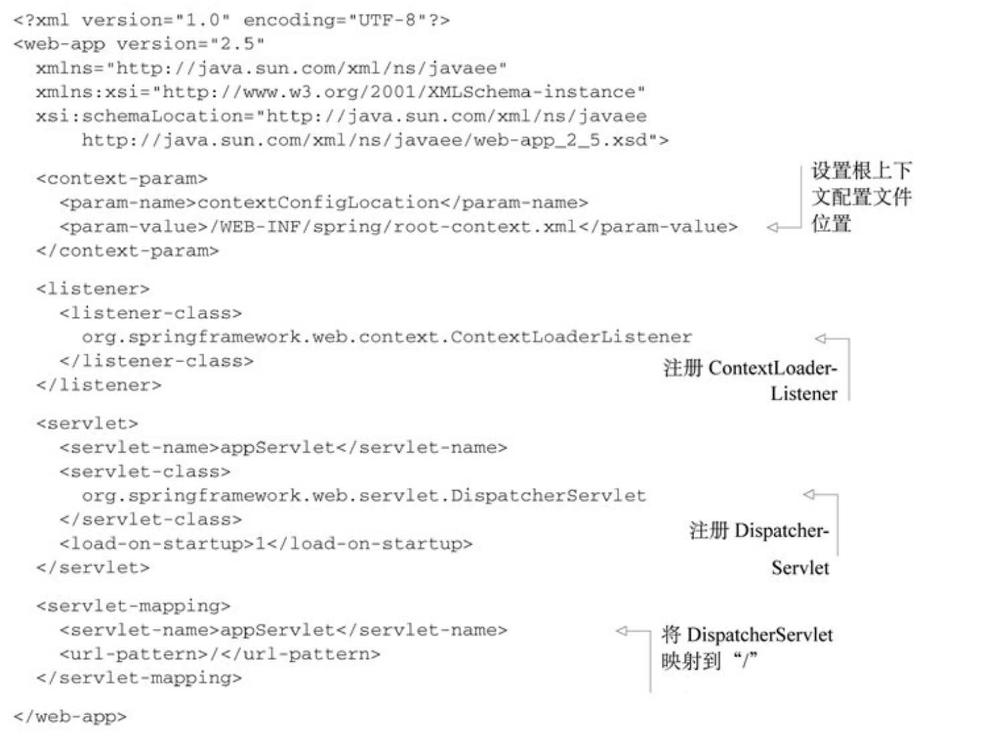 </div><br>

就像我在第5章曾经介绍过的，ContextLoaderListener和DispatcherServlet各自都会加载一个Spring应用上下文。上下文参数contextConfigLocation指定了一个XML文件的地址，这个文件定义了根应用上下文，它会被ContextLoaderListener加载。如程序清单7.3所示，根上下文会从“WEB-INFspring/root-context.xml”中加载bean定义。

DispatcherServlet会根据Servlet的名字找到一个文件，并基于该文件加载应用上下文。在程序清单7.3中，Servlet的名字是appServlet，因此DispatcherServlet会从“WEB-INFappServlet-context.xml”文件中加载其应用上下文。

如果你希望指定DispatcherServlet配置文件的位置的话，那么可以在Servlet上指定一个contextConfigLocation初始化参数。例如，如下的配置中，DispatcherServlet会从“WEB-INFspring/appServlet/servlet-context.xml”加载它的bean：

<div align="center"> 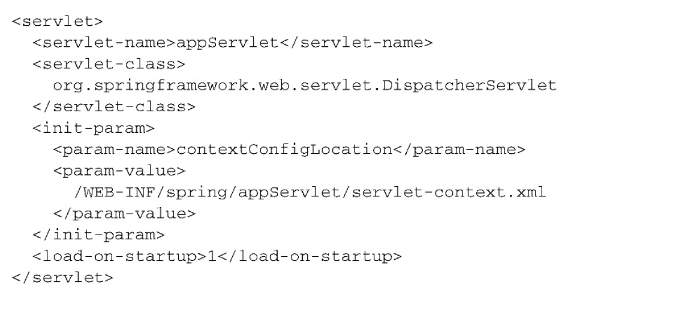 </div><br>

当然，上面阐述的都是如何让DispatcherServlet和ContextLoaderListener从XML中加载各自的应用上下文。但是，在本书中的大部分内容中，我们都更倾向于使用Java配置而不是XML配置。因此，我们需要让Spring MVC在启动的时候，从带有@Configuration注解的类上加载配置。

要在Spring MVC中使用基于Java的配置，我们需要告诉DispatcherServlet和ContextLoaderListener使用AnnotationConfigWebApplicationContext，这是一个WebApplicationContext的实现类，它会加载Java配置类，而不是使用XML。要实现这种配置，我们可以设置contextClass上下文参数以及DispatcherServlet的初始化参数。如下的程序清单展现了一个新的web.xml，在这个文件中，它所搭建的Spring MVC使用基于Java的Spring配置：

程序清单7.4 设置web.xml使用基于Java的配置

<div align="center"> 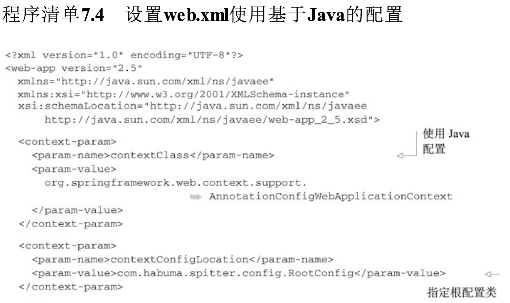 </div><br>
<div align="center"> 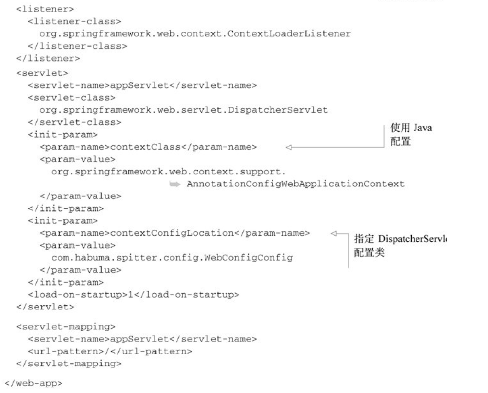 </div><br>

现在我们已经看到了如何以多种不同的方式来搭建Spring MVC，那么接下来我们会看一下如何使用Spring MVC来处理文件上传。

## 7.2 处理multipart形式的数据
TODO

## 7.3 处理异常
到现在为止，在Spittr应用中，我们假设所有的功能都正常运行。但是如果某个地方出错的话，该怎么办呢？当处理请求的时候，抛出异常该怎么处理呢？如果发生了这样的情况，该给客户端什么响应呢？

不管发生什么事情，不管是好的还是坏的，Servlet请求的输出都是一个Servlet响应。如果在请求处理的时候，出现了异常，那它的输出依然会是Servlet响应。异常必须要以某种方式转换为响应。

Spring提供了多种方式将异常转换为响应：

- 特定的Spring异常将会自动映射为指定的HTTP状态码；
- 异常上可以添加@ResponseStatus注解，从而将其映射为某一个HTTP状态码；
- 在方法上可以添加@ExceptionHandler注解，使其用来处理异常。

处理异常的最简单方式就是将其映射到HTTP状态码上，进而放到响应之中。接下来，我们看一下如何将异常映射为某一个HTTP状态码。

### 7.3.1 将异常映射为HTTP状态码
在默认情况下，Spring会将自身的一些异常自动转换为合适的状态码。表7.1列出了这些映射关系。

表7.1 Spring的一些异常会默认映射为HTTP状态码

<div align="center">  </div><br>
<div align="center">  </div><br>

表7.1中的异常一般会由Spring自身抛出，作为DispatcherServlet处理过程中或执行校验时出现问题的结果。例如，如果DispatcherServlet无法找到适合处理请求的控制器方法，那么将会抛出NoSuchRequestHandlingMethodException异常，最终的结果就是产生404状态码的响应（Not Found）。

尽管这些内置的映射是很有用的，但是对于应用所抛出的异常它们就无能为力了。幸好，Spring提供了一种机制，能够通过@ResponseStatus注解将异常映射为HTTP状态码。

为了阐述这项功能，请参考SpittleController中如下的请求处理方法，它可能会产生HTTP 404状态（但目前还没有实现）：

```
@RequestMapping(value="/{spittleId}", method=RequestMethod.GET)
  public String spittle(
      @PathVariable("spittleId") long spittleId,
      Model model) {
    Spittle spittle = spittleRepository.findOne(spittleId);
    if (spittle == null) {
      // 可能会产生HTTP 404状态
      throw new SpittleNotFoundException();
    }
    model.addAttribute(spittle);
    return "spittle";
  }
```

在这里，会从SpittleRepository中，通过ID检索Spittle对象。如果findOne()方法能够返回Spittle对象的话，那么会将Spittle放到模型中，然后名为spittle的视图会负责将其渲染到响应之中。但是如果findOne()方法返回null的话，那么将会抛出SpittleNotFoundException异常。现在SpittleNotFoundException就是一个简单的非检查型异常，如下所示：

```
public class SpittleNotFoundException extends RuntimeException {

}
```

如果调用spittle()方法来处理请求，并且给定ID获取到的结果为空，那么SpittleNotFoundException（默认）将会产生500状态码（Internal Server Error）的响应。实际上，如果出现任何没有映射的异常，响应都会带有500状态码，但是，我们可以通过映射SpittleNotFoundException对这种默认行为进行变更。

当抛出SpittleNotFoundException异常时，这是一种请求资源没有找到的场景。如果资源没有找到的话，HTTP状态码404是最为精确的响应状态码。所以，我们要使用@ResponseStatus注解将SpittleNotFoundException映射为HTTP状态码404。

程序清单7.8@ResponseStatus注解：将异常映射为特定的状态码

```
@ResponseStatus(value = HttpStatus.NOT_FOUND, reason = "Spittle Not Found")
public class SpittleNotFoundException extends RuntimeException {

}
```

在引入@ResponseStatus注解之后，如果控制器方法抛出SpittleNotFoundException异常的话，响应将会具有404状态码，这是因为Spittle NotFound。

### 7.3.2 编写异常处理的方法
在很多的场景下，将异常映射为状态码是很简单的方案，并且就功能来说也足够了。但是如果我们想在响应中不仅要包括状态码，还要包含所产生的错误，那该怎么办呢？此时的话，我们就不能将异常视为HTTP错误了，而是要按照处理请求的方式来处理异常了。

作为样例，假设用户试图创建的Spittle与已创建的Spittle文本完全相同，那么SpittleRepository的save()方法将会抛出DuplicateSpittle Exception异常。这意味着SpittleController的saveSpittle()方法可能需要处理这个异常。如下面的程序清单所示，saveSpittle()方法可以直接处理这个异常。

程序清单7.9 在处理请求的方法中直接处理异常

```
 @RequestMapping(method = RequestMethod.POST)
    public String saveSpittle(SpittleForm form, Model model) {
        try {
            spittleRepository.save(new Spittle(null, form.getMessage(), new Date(),
                    form.getLongitude(), form.getLatitude()));
            return "redirect:/spittles";
        } catch (DuplicateSpittleException e) {
            // 捕获异常
            return "error/duplicate";
        }
    }
```

程序清单7.9中并没有特别之处，它只是在Java中处理异常的基本样例，除此之外，也就没什么了。

它运行起来没什么问题，但是这个方法有些复杂。该方法可以有两个路径，每个路径会有不同的输出。如果能让saveSpittle()方法只关注正确的路径，而让其他方法处理异常的话，那么它就能简单一些。

首先，让我们首先将saveSpittle()方法中的异常处理方法剥离掉：

```
 @RequestMapping(method = RequestMethod.POST)
    public String saveSpittle(SpittleForm form, Model model) {
        try {
            spittleRepository.save(new Spittle(null, form.getMessage(), new Date(),
                    form.getLongitude(), form.getLatitude()));
            return "redirect:/spittles";
    }
```

可以看到，saveSpittle()方法简单了许多。因为它只关注成功保存Spittle的情况，所以只有一个执行路径，很容易理解（和测试）。

现在，我们为SpittleController添加一个新的方法，它会处理抛出DuplicateSpittleException的情况：

```
@ExceptionHandler(DuplicateSpittleException.class)
    public String handleNotFound() {
        return "error/duplicate";
    }
```

handleDuplicateSpittle()方法上添加了@ExceptionHandler注解，当抛出DuplicateSpittleException异常的时候，将会委托该方法来处理。它返回的是一个String，这与处理请求的方法是一致的，指定了要渲染的逻辑视图名，它能够告诉用户他们正在试图创建一条重复的条目。

对于@ExceptionHandler注解标注的方法来说，比较有意思的一点在于它能处理同一个控制器中所有处理器方法所抛出的异常。所以，尽管我们从saveSpittle()中抽取代码创建了handleDuplicateSpittle()方法，但是它能够处理SpittleController中所有方法所抛出的DuplicateSpittleException异常。我们不用在每一个可能抛出DuplicateSpittleException的方法中添加异常处理代码，这一个方法就涵盖了所有的功能。

- **@ExceptionHandler注解标注的方法：它能处理同一个控制器中所有处理器方法所抛出的异常**

既然@ExceptionHandler注解所标注的方法能够处理同一个控制器类中所有处理器方法的异常，那么你可能会问有没有一种方法能够处理所有控制器中处理器方法所抛出的异常呢。从Spring 3.2开始，这肯定是能够实现的，我们只需将其定义到控制器通知类中即可。

什么是控制器通知方法？很高兴你会问这样的问题，因为这就是我们下面要讲的内容。

## 7.4 为控制器添加通知
如果控制器类的特定切面能够运用到整个应用程序的所有控制器中，那么这将会便利很多。举例来说，如果要在多个控制器中处理异常，那@ExceptionHandler注解所标注的方法是很有用的。不过，如果多个控制器类中都会抛出某个特定的异常，那么你可能会发现要在所有的控制器方法中重复相同的@ExceptionHandler方法。或者，**为了避免重复，我们会创建一个基础的控制器类，所有控制器类要扩展这个类，从而继承通用的@ExceptionHandler方法。**

Spring 3.2为这类问题引入了一个新的解决方案：控制器通知。控制器通知（controlleradvice）是任意带有@ControllerAdvice注解的类，这个类会包含一个或多个如下类型的方法：

- @ExceptionHandler注解标注的方法；
- @InitBinder注解标注的方法；
- @ModelAttribute注解标注的方法。

- **在带有@ControllerAdvice注解的类中，以上所述的这些方法会运用到`整个应用程序`所有控制器中带有`@RequestMapping`注解的方法上。**

@ControllerAdvice注解本身已经使用了@Component，因此@ControllerAdvice注解所标注的类将会自动被组件扫描获取到，就像带有@Component注解的类一样。@ControllerAdvice最为实用的一个场景就是将所有的@ExceptionHandler方法收集到一个类中，这样所有控制器的异常就能在一个地方进行一致的处理。例如，我们想将DuplicateSpittleException的处理方法用到整个应用程序的所有控制器上。如下的程序清单展现的AppWideExceptionHandler就能完成这一任务，这是一个带有@ControllerAdvice注解的类。

程序清单7.10 使用@ControllerAdvice，为所有的控制器处理异常

```
@ControllerAdvice
public class AppWideExceptionHandler {

    @ExceptionHandler(DuplicateSpittleException.class)
    public String handleNotFound() {
        return "error/duplicate";
    }

}
```

现在，如果任意的控制器方法抛出了DuplicateSpittleException，不管这个方法位于哪个控制器中，都会调用这个duplicateSpittleHandler()方法来处理异常。我们可以像编写@RequestMapping注解的方法那样来编写@ExceptionHandler注解的方法。如程序清单7.10所示，它返回“error/duplicate”作为逻辑视图名，因此将会为用户展现一个友好的出错页面。

## 7.5 跨重定向请求传递数据
在5.4.1小节中，在处理完POST请求后，通常来讲一个最佳实践就是执行一下重定向。除了其他的一些因素外，这样做能够防止用户点击浏览器的刷新按钮或后退箭头时，客户端重新执行危险的POST请求。

在第5章，在控制器方法返回的视图名称中，我们借助了“redirect:”前缀的力量。当控制器方法返回的String值以“redirect:”开头的话，那么这个String不是用来查找视图的，而是用来指导浏览器进行重定向的路径。我们可以回头看一下程序清单5.17，可以看到processRegistration()方法返回的“redirect:String”如下所示：

	return "redirect:/spitter" +spitter.getUsername();

“redirect:”前缀能够让重定向功能变得非常简单。你可能会想Spring很难再让重定向功能变得更简单了。但是，请稍等：Spring为重定向功能还提供了一些其他的辅助功能。

具体来讲，正在发起重定向功能的方法该如何发送数据给重定向的目标方法呢？一般来讲，当一个处理器方法完成之后，该方法所指定的模型数据将会复制到请求中，并作为请求中的属性，请求会转发（forward）到视图上进行渲染。因为控制器方法和视图所处理的是同一个请求，所以在转发的过程中，请求属性能够得以保存。

但是，如图7.1所示，当控制器的结果是重定向的话，原始的请求就结束了，并且会发起一个新的GET请求。原始请求中所带有的模型数据也就随着请求一起消亡了。在新的请求属性中，没有任何的模型数据，这个请求必须要自己计算数据。

<div align="center">  </div><br>

显然，对于重定向来说，模型并不能用来传递数据。但是我们也有一些其他方案，能够从发起重定向的方法传递数据给处理重定向方法中：

- 使用URL模板以路径变量和/或查询参数的形式传递数据
- 通过flash属性发送数据。

首先，我们看一下Spring如何帮助我们通过路径变量和/或查询参数的形式传递数据。

### 7.5.1 通过URL模板进行重定向
通过路径变量和查询参数传递数据看起来非常简单。例如，在程序清单5.19中，我们以路径变量的形式传递了新创建Spitter的username。但是按照现在的写法，username的值是直接连接到重定向String上的。这能够正常运行，但是还远远不能说没有问题。当构建URL或SQL查询语句的时候，使用String连接是很危险的。

	return "redirect:/spitter/{username};

除了连接String的方式来构建重定向URL，Spring还提供了使用模板的方式来定义重定向URL。例如，在程序清单5.19中，processRegistration()方法的最后一行可以改写为如下的形式：

```
    @RequestMapping(value = "/register", method = POST)
    public String processRegistration(Spitter spitter,Model model) {
        // 保存 Spitter
        spitterRepository.save(spitter);
        // 重定向的方式2：以占位符的方式更加的安全
        model.addAttribute("username",spitter.getUsername());
        return "redirect:/spitter/{username}";
    }
```

现在，username作为占位符填充到了URL模板中，而不是直接连接到重定向String中，所以username中所有的不安全字符都会进行转义。这样会更加安全，这里允许用户输入任何想要的内容作为username，并会将其附加到路径上。

除此之外，模型中所有其他的**原始类型值**都可以添加到URL中作为查询参数。作为样例，假设除了username以外，模型中还要包含新创建Spitter对象的id属性，那processRegistration()方法可以改写为如下的形式：

```
    @RequestMapping(value = "/register", method = POST)
    public String processRegistration(Spitter spitter,Model model) {
        // 保存 Spitter
        spitterRepository.save(spitter);
        // 重定向的方式2：以占位符的方式更加的安全
        model.addAttribute("username",spitter.getUsername());
		 model.addAttribute("spitterId",spitter.getId());
        return "redirect:/spitter/{username}";
    }
```

所返回的重定向String并没有太大的变化。但是，因为模型中的spitterId属性没有匹配重定向URL中的任何占位符，所以它会自动以查询参数的形式附加到重定向URL上。

如果username属性的值是habuma并且spitterId属性的值是42，那么结果得到的重定向URL路径将会是“spitterhabuma?spitterId=42”。

通过路径变量和查询参数的形式跨重定向传递数据是很简单直接的方式，但它也有一定的限制。它只能用来发送简单的值，如String和数字的值。在URL中，并没有办法发送更为复杂的值，但这正是flash属性能够提供帮助的领域。

### 7.5.2 使用flash属性
假设我们不想在重定向中发送username或ID了，而是要发送实际的Spitter对象。如果我们只发送ID的话，那么处理重定向的方法还需要从数据库中查找才能得到Spitter对象。但是，在重定向之前，我们其实已经得到了Spitter对象。为什么不将其发送给处理重定向的方法，并将其展现出来呢？

Spitter对象要比String和int更为复杂。因此，我们不能像路径变量或查询参数那么容易地发送Spitter对象。它只能设置为模型中的属性。

但是，正如我们前面所讨论的那样，模型数据最终是以请求参数的形式复制到请求中的，当重定向发生的时候，这些数据就会丢失。因此，我们需要将Spitter对象放到一个位置，使其能够在重定向的过程中存活下来。

有个方案是将Spitter放到会话中。**会话能够长期存在，并且能够跨多个请求**。所以我们可以在重定向发生之前将Spitter放到会话中，并在重定向后，从会话中将其取出。当然，我们还要负责在重定向后在会话中将其清理掉。实际上，Spring也认为将跨重定向存活的数据放到会话中是一个很不错的方式。但是，Spring认为我们并不需要管理这些数据，相反，Spring提供了将数据发送为flash属性（flash attribute）的功能。按照定义，**flash属性会一直携带这些数据直到下一次请求，然后才会消失。**

Spring提供了通过RedirectAttributes设置flash属性的方法，这是Spring 3.1引入的Model的一个子接口。RedirectAttributes提供了Model的所有功能，除此之外，还有几个方法是用来设置flash属性的。

具体来讲，RedirectAttributes提供了一组addFlashAttribute()方法来添加flash属性。重新看一下processRegistration()方法，我们可以使用addFlashAttribute()将Spitter对象添加到模型中：

```
    @RequestMapping(value = "/register", method = POST)
    public String processRegistration(Spitter spitter,Model model) {
        // 保存 Spitter
        spitterRepository.save(spitter);
        // 重定向的方式2：以占位符的方式更加的安全
        model.addAttribute("username",spitter.getUsername());
		 model.addFlashAttribute("spitter",spitter);
        return "redirect:/spitter/{username}";
    }
```

在这里，我们调用了addFlashAttribute()方法，并将spitter作为key，Spitter对象作为值。另外，我们还可以不设置key参数，让key根据值的类型自行推断得出：

model.addFlashAttribute(spitter);

因为我们传递了一个Spitter对象给addFlashAttribute()方法，所以推断得到的key将会是spitter。

在重定向执行之前，所有的flash属性都会复制到会话中。在重定向后，存在会话中的flash属性会被取出，并从会话转移到模型之中。处理重定向的方法就能从模型中访问Spitter对象了，就像获取其他的模型对象一样。图7.2阐述了它是如何运行的。

<div align="center"> 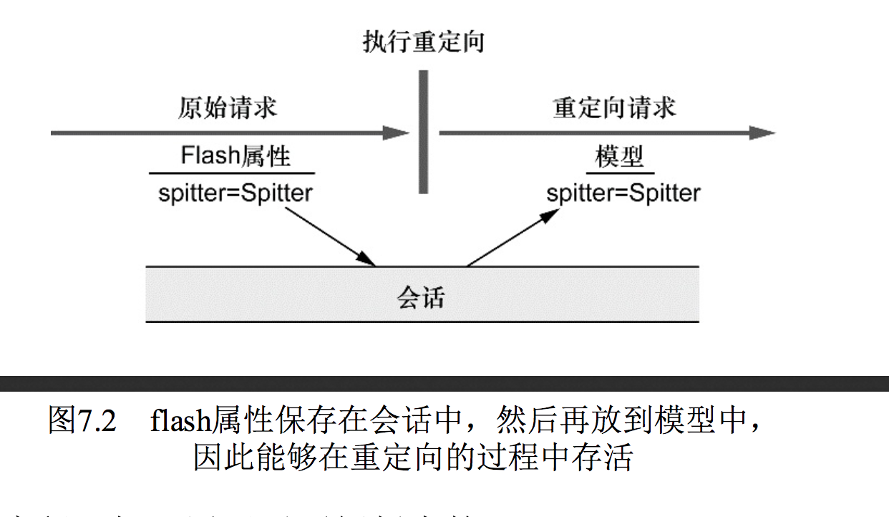 </div><br>

为了完成flash属性的流程，如下展现了更新版本的showSpitterProfile()方法，在从数据库中查找之前，它会首先从模型中检查Spitter对象：

```
@RequestMapping(value = "/{username}", method = GET)
    public String showSpitterProfile(
            @PathVariable String username, Model model) {
        if (!model.containsAttribute("spitter")) {
            model.addAttribute(spitterRepository.findByUsername(username));
        }
        return "profile";
    }
```

可以看到，showSpitterProfile()方法所做的第一件事就是检查是否存有key为spitter的model属性。如果模型中包含spitter属性，那就什么都不用做了。这里面包含的Spitter对象将会传递到视图中进行渲染。但是如果模型中不包含spitter属性的话，那么showSpitterProfile()将会从Repository中查找Spitter，并将其存放到模型中。

## 7.6 小结
在Spring中，总是会有“还没有结束”的感觉：更多的特性、更多的选择以及实现开发目标的更多方式。Spring MVC有很多功能和技巧。

当然，Spring MVC的环境搭建是有多种可选方案的一个领域。在本章中，我们首先看了一下搭建Spring MVC中DispatcherServlet和ContextLoaderListener的多种方式。我们还看到了如何调整DispatcherServlet的注册功能以及如何注册自定义的Servlet和Filter。如果你需要将应用部署到更老的应用服务器上，我们还快速了解了如何使用web.xml声明DispatcherServlet和ContextLoaderListener。

然后，我们了解了如何处理Spring MVC控制器所抛出的异常。尽管带有@RequestMapping注解的方法可以在自身的代码中处理异常，但是如果我们将异常处理的代码抽取到单独的方法中，那么控制器的代码会整洁得多。

为了采用一致的方式处理通用的任务，包括在应用的所有控制器中处理异常，Spring 3.2引入了@ControllerAdvice，它所创建的类能够将控制器的通用行为抽取到同一个地方。

最后，我们看了一下如何跨重定向传递数据，包括Spring对flash属性的支持：类似于模型的属性，但是能在重定向后存活下来。这样的话，就能采用非常恰当的方式为POST请求执行一个重定向回应，而且能够将处理POST请求时的模型数据传递过来，然后在重定向后使用或展现这些模型数据。

如果你还有疑惑的话，那么可以告诉你，这就是我所说的“更多的功能”！其实，我们并没有讨论到Spring MVC的每个方面。我们将会在第16章中重新讨论Spring MVC，到时你会看到如何使用它来创建REST API。

但现在，我们将会暂时放下Spring MVC，看一下Spring Web Flow，这是一个构建在SpringMVC之上的流程框架，它能够引导用户执行一系列向导步骤。

# 第8章 使用Spring Web Flow
todo

## 第9章 保护Web应用
本章内容：

- Spring Security介绍
- 使用Servlet规范中的Filter保护Web应用
- 基于数据库和LDAP进行认证

现在，信息可能是我们最有价值的东西，一些不怀好意的人想尽办法试图偷偷进入不安全的应用程序来窃取我们的数据和身份信息。作为软件开发人员，我们必须采取措施来保护应用程序中的信息。无论你是通过用户名/密码来保护电子邮件账号，还是基于交易PIN来保护经济账户，安全性都是绝大多数应用系统中的一个重要切面（aspect）。

我有意选择了“切面”这个词来描述应用系统的安全性。安全性是超越应用程序功能的一个关注点。应用系统的绝大部分内容都不应该参与到与自己相关的安全性处理中。尽管我们可以直接在应用程序中编写安全性功能相关的代码（这种情况并不少见），但更好的方式还是将安全性相关的关注点与应用程序本身的关注点进行分离。

如果你觉得安全性听上去好像是使用面向切面技术实现的，那你猜对了。在本章中，我们将使用切面技术来探索保护应用程序的方式。不过我们不必自己开发这些切面——我们将介绍Spring Security，这是一种基于Spring AOP和Servlet规范中的Filter实现的安全框架。

## 9.1Spring Security简介
Spring Security是为基于Spring的应用程序提供声明式安全保护的安全性框架。Spring Security提供了完整的安全性解决方案，它能够在Web请求级别和方法调用级别处理身份认证和授权。因为基于Spring框架，所以Spring Security充分利用了依赖注入（dependency injection，DI）和面向切面的技术。

最初，Spring Security被称为Acegi Security。Acegi是一个强大的安全框架，但是它存在一个严重的问题：那就是需要大量的XML配置。我不会向你介绍这种复杂配置的细节。总之一句话，典型的Acegi配置有几百行XML是很常见的。

到了2.0版本，Acegi Security更名为Spring Security。但是2.0发布版本所带来的不仅仅是表面上名字的变化。为了在Spring中配置安全性，Spring Security引入了一个全新的、与安全性相关的XML命名空间。这个新的命名空间连同注解和一些合理的默认设置，将典型的安全性配置从几百行XML减少到十几行。Spring Security 3.0融入了SpEL，这进一步简化了安全性的配置。

它的最新版本为3.2，Spring Security从两个角度来解决安全性问题。它使用Servlet规范中的Filter保护Web请求并限制URL级别的访问。Spring Security还能够使用Spring AOP保护方法调用——借助于对象代理和使用通知，能够确保只有具备适当权限的用户才能访问安全保护的方法。

- **Spring Security从两个角度来解决安全性问题**：
- a.使用**Servlet规范中的Filter**保护Web请求并**限制URL**级别的访问
- b.使用Spring AOP保护方法调用——**借助于对象代理和使用通知**，能够确保只有具备适当权限的用户才能**访问安全保护的方法**。

在本章中，我们将会关注如何将Spring Security用于Web层的安全性之中。在稍后的第14章中，我们会重新学习Spring Security，了解它如何保护方法的调用。

### 9.1.1 理解Spring Security的模块
不管你想使用Spring Security保护哪种类型的应用程序，第一件需要做的事就是将SpringSecurity模块添加到应用程序的类路径下。Spring Security 3.2分为11个模块，如表9.1所示。

表9.1 Spring Security被分成了11个模块

<div align="center">  </div><br>

<div align="center">  </div><br>

应用程序的类路径下至少要包含Core和Configuration这两个模块。Spring Security经常被用于保护Web应用，这显然也是Spittr应用的场景，所以我们还需要添加Web模块。同时我们还会用到Spring Security的JSP标签库，所以我们需要将这个模块也添加进来。

现在，我们已经为在Spring Security中进行安全性配置做好了准备。让我们看看如何使用Spring Security的XML命名空间。

### 9.1.2 过滤Web请求
Spring Security借助一系列Servlet Filter来提供各种安全性功能。你可能会想，这是否意味着我们需要在web.xml或WebApplicationInitializer中配置多个Filter呢？实际上，借助于Spring的小技巧，我们只需配置一个Filter就可以了。

DelegatingFilterProxy是一个特殊的Servlet Filter，它本身所做的工作并不多。只是将工作委托给一个javax.servlet.Filter实现类，这个实现类作为一个<bean>注册在Spring应用的上下文中，如图9.1所示。

<div align="center">  </div><br>

如果你喜欢在传统的web.xml中配置Servlet和Filter的话，可以使用<filter>元素，如下所示：

<div align="center">  </div><br>

在这里，最重要的是<filter-name>设置成了springSecurityFilterChain。这是因为我们马上就会将Spring Security配置在Web安全性之中，这里会有一个名为springSecurityFilterChain的Filter bean，DelegatingFilterProxy会将过滤逻辑委托给它。

如果你希望借助WebApplicationInitializer以Java的方式来配置DelegatingFilterProxy的话，那么我们所需要做的就是创建一个扩展的新类：

```
import org.springframework.security.web.context.AbstractSecurityWebApplicationInitializer;

public class SecurityWebInitializer extends AbstractSecurityWebApplicationInitializer {
}
```

AbstractSecurityWebApplicationInitializer实现了WebApplicationInitializer，因此Spring会发现它，并用它在Web容器中注册DelegatingFilterProxy。尽管我们可以重载它的appendFilters()或insertFilters()方法来注册自己选择的Filter，但是要注册DelegatingFilterProxy的话，我们并不需要重载任何方法。

不管我们通过web.xml还是通过AbstractSecurityWebApplicationInitializer的子类来配置DelegatingFilterProxy，它都会拦截发往应用中的请求，并将请求委托给ID为springSecurityFilterChain bean。

springSecurityFilterChain本身是另一个特殊的Filter，它也被称为**FilterChainProxy**。它可以链接任意一个或多个其他的Filter。Spring Security依赖一系列Servlet Filter来提供不同的安全特性。但是，你几乎不需要知道这些细节，因为你不需要显式声明springSecurityFilterChain以及它所链接在一起的其他Filter。当我们启用Web安全性的时候，会自动创建这些Filter。

- **FilterChainProxy**
- **FilterChain**

为了让Web安全性运行起来，我们创建一个最简单的安全性配置。

### 9.1.3 编写简单的安全性配置
在Spring Security的早期版本中（在其还被称为Acegi Security之时），为了在Web应用中启用简单的安全功能，我们需要编写上百行的XML配置。Spring Security 2.0提供了安全性相关的XML配置命名空间，让情况有了一些好转。

Spring 3.2引入了新的Java配置方案，完全不再需要通过XML来配置安全性功能了。如下的程序清单展现了Spring Security最简单的Java配置。

程序清单9.1 启用Web安全性功能的最简单配置

```
@Configuration
@EnableWebSecurity
public class SecurityConfig extends WebSecurityConfigurerAdapter {
}
```


顾名思义，@EnableWebSecurity注解将会启用Web安全功能。但它本身并没有什么用处，Spring Security必须配置在一个实现了WebSecurityConfigurer的bean中，或者（简单起见）扩展WebSecurityConfigurerAdapter。在Spring应用上下文中，任何实现了WebSecurityConfigurer的bean都可以用来配置Spring Security，但是最为简单的方式还是像程序清单9.1那样扩展WebSecurityConfigurer Adapter类。

@EnableWebSecurity可以启用任意Web应用的安全性功能，不过，如果你的应用碰巧是使用Spring MVC开发的，那么就应该考虑使用@EnableWebMvcSecurity替代它，如程序清单9.2所示。

程序清单9.2 为Spring MVC启用Web安全性功能的最简单配置

```
@Configuration
@EnableWebMvcSecurity
public class SecurityConfig extends WebSecurityConfigurerAdapter {
}
```

除了其他的内容以外，@EnableWebMvcSecurity注解还配置了一个Spring MVC参数解析解析器（argument resolver），这样的话处理器方法就能够通过带有@AuthenticationPrincipal注解的参数获得认证用户的principal（或username）。它同时还配置了一个bean，在使用Spring表单绑定标签库来定义表单时，这个bean会自动添加一个隐藏的跨站请求伪造（cross-site request forgery，CSRF）token输入域。

看起来似乎并没有做太多的事情，但程序清单9.1和9.2中的配置类会给应用产生很大的影响。其中任何一种配置都会将应用严格锁定，导致没有人能够进入该系统了！

尽管不是严格要求的，但我们可能希望指定Web安全的细节，这要通过重载WebSecurityConfigurerAdapter中的一个或多个方法来实现。我们可以通过重载WebSecurityConfigurerAdapter的三个configure()方法来配置Web安全性，这个过程中会使用传递进来的参数设置行为。表9.2描述了这三个方法。

<div align="center">  </div><br>

让我们重新看一下程序清单9.2，可以看到它没有重写上述三个configure()方法中的任何一个，这就说明了为什么应用现在是被锁定的。尽管对于我们的需求来讲默认的Filter链是不错的，但是默认的configure(HttpSecurity)实际上等同于如下所示：

```
protected void configure(HttpSecurity http) throws Exception {
        http
                .authorizeRequests()
                .anyRequest().authenticated()
                .and()
                .formLogin().and()
                .httpBasic();
    }
```

这个简单的默认配置指定了该如何保护HTTP请求，以及客户端认证用户的方案。通过调用authorizeRequests()和anyRequest().authenticated()就会要求所有进入应用的HTTP请求都要进行认证。它也配置Spring Security支持基于表单的登录以及HTTP Basic方式的认证。

同时，因为我们没有重载configure(AuthenticationManagerBuilder)方法，所以没有用户存储支撑认证过程。没有用户存储，实际上就等于没有用户。所以，在这里所有的请求都需要认证，但是没有人能够登录成功。

为了让Spring Security满足我们应用的需求，还需要再添加一点配置。具体来讲，我们需要：

- 配置用户存储；
- 指定哪些请求需要认证，哪些请求不需要认证，以及所需要的权限；
- 提供一个自定义的登录页面，替代原来简单的默认登录页。

除了Spring Security的这些功能，我们可能还希望基于安全限制，有选择性地在Web视图上显示特定的内容。

但首先，我们看一下如何在认证的过程中配置访问用户数据的服务。

## 9.2 选择查询用户详细信息的服务
假如你计划去一个独家经营的饭店享受一顿晚餐，当然，你会提前几周预订，保证到时候能有一个位置。当到达饭店的时候，你会告诉服务员你的名字。但令人遗憾的是，里面并没有你的预订记录。美好的夜晚眼看就要泡汤了。但是没有人会如此轻易地放弃，你会要求服务员再次确认预订名单。此时，事情变得有些怪异了。

服务员说没有预订名单。你的名字不在名单上——名单上没有任何人——因为根本就不存在这么个名单。这就解释了为什么位置是空的，但我们却进不去。几周后，我们也就明白这家饭店为何最终会关门大吉，被一家墨西哥美食店所代替。

这也是此时我们应用程序的现状。我们没有办法进入应用，即便用户认为他们应该能够登录进去，但实际上却没有允许他们访问应用的数据记录。因为缺少用户存储，现在的应用程序太封闭了，变得不可用。

我们所需要的是用户存储，也就是用户名、密码以及其他信息存储的地方，在进行认证决策的时候，会对其进行检索。

好消息是，Spring Security非常灵活，能够基于各种数据存储来认证用户。它内置了多种常见的用户存储场景，如内存、关系型数据库以及LDAP。但我们也可以编写并插入自定义的用户存储实现。

借助Spring Security的Java配置，我们能够很容易地配置一个或多个数据存储方案。那我们就从最简单的开始：在内存中维护用户存储。

### 9.2.1 使用基于内存的用户存储
因为我们的安全配置类扩展了WebSecurityConfigurerAdapter，因此配置用户存储的最简单方式就是重载configure()方法，并以AuthenticationManagerBuilder作为传入参数。AuthenticationManagerBuilder有多个方法可以用来配置Spring Security对认证的支持。通过inMemoryAuthentication()方法，我们可以启用、配置并任意填充基于内存的用户存储。

例如，在如程序清单9.3中，SecurityConfig重载了configure()方法，并使用两个用户来配置内存用户存储。

程序清单9.3 配置Spring Security使用内存用户存储

```
 @Override
    protected void configure(AuthenticationManagerBuilder auth) throws Exception {
        auth
                // 启用内存用户存储
                .inMemoryAuthentication()
                .withUser("user").password("password").roles("USER").and()
                .withUser("admin").password("password2").roles("USER", "ADMIN");
    }
```

我们可以看到，configure()方法中的AuthenticationManagerBuilder使用构造者风格的接口来构建认证配置。通过简单地调用inMemoryAuthentication()就能启用内存用户存储。但是我们还需要有一些用户，否则的话，这和没有用户并没有什么区别。

因此，我们需要调用withUser()方法为内存用户存储添加新的用户，这个方法的参数是username。withUser()方法返回的是UserDetailsManagerConfigurer.UserDetailsBuilder，这个对象提供了多个进一步配置用户的方法，包括设置用户密码的password()方法以及为给定用户授予一个或多个角色权限的roles()方法。

在程序清单9.3中，我们添加了两个用户，“user”和“admin”，密码均为“password”。“user”用户具有USER角色，而“admin”用户具有ADMIN和USER两个角色。我们可以看到，and()方法能够将多个用户的配置连接起来。除了password()、roles()和and()方法以外，还有其他的几个方法可以用来配置内存用户存储中的用户信息。表9.3描述了UserDetailsManagerConfigurer.UserDetailsBuilder对象所有可用的方法。

需要注意的是，roles()方法是authorities()方法的简写形式。roles()方法所给定的值都会添加一个“ROLE_”前缀，并将其作为权限授予给用户。实际上，如下的用户配置与程序清单9.3是等价的：

```
        auth
                // 启用内存用户存储
                .inMemoryAuthentication()
                .withUser("admin").password("password2").roles("USER", "ADMIN").and()
                .withUser("guest").password("password3").authorities("USER");
```


表9.3 配置用户详细信息的方法


<div align="center">  </div><br>
<div align="center">  </div><br>

对于调试和开发人员测试来讲，基于内存的用户存储是很有用的，但是对于生产级别的应用来讲，这就不是最理想的可选方案了。为了用于生产环境，通常最好将用户数据保存在某种类型的数据库之中。

### 9.2.2 基于数据库表进行认证
用户数据通常会存储在关系型数据库中，并通过JDBC进行访问。为了配置Spring Security使用以JDBC为支撑的用户存储，我们可以使用jdbcAuthentication()方法，所需的最少配置如下所示：

```
  @Autowired
    private DataSource dataSource;

    @Override
    protected void configure(AuthenticationManagerBuilder auth) throws Exception {
        auth
                .jdbcAuthentication()
                .dataSource(dataSource);
    }
```

我们必须要配置的只是一个DataSource，这样的话，就能访问关系型数据库了。在这里，DataSource是通过自动装配的技巧得到的。

#### 重写默认的用户查询功能
尽管默认的最少配置能够让一切运转起来，但是它对我们的数据库模式有一些要求。它预期存在某些存储用户数据的表。更具体来说，下面的代码片段来源于Spring Security内部，这块代码展现了当查找用户信息时所执行的SQL查询语句：

<div align="center">  </div><br>

在第一个查询中，我们获取了用户的用户名、密码以及是否启用的信息，这些信息会用来进行用户认证。接下来的查询查找了用户所授予的权限，用来进行鉴权，最后一个查询中，查找了用户作为群组的成员所授予的权限。

如果你能够在数据库中定义和填充满足这些查询的表，那么基本上就不需要你再做什么额外的事情了。但是，也有可能你的数据库与上面所述并不一致，那么你就会希望在查询上有更多的控制权。如果是这样的话，我们可以按照如下的方式配置自己的查询：

```
 @Autowired
    private DataSource dataSource;

    @Override
    protected void configure(AuthenticationManagerBuilder auth) throws Exception {
        auth
                .jdbcAuthentication()
                .dataSource(dataSource)
                .usersByUsernameQuery("select username,password,true from Spitter where username=?")
                .authoritiesByUsernameQuery("select username,'ROLE_USER' from Spitter where username=?");
    }
```

在本例中，我们只重写了认证和基本权限的查询语句，但是通过调用group-AuthoritiesByUsername()方法，我们也能够将群组权限重写为自定义的查询语句。

将默认的SQL查询替换为自定义的设计时，很重要的一点就是要遵循查询的基本协议。所有查询都将用户名作为唯一的参数。认证查询会选取用户名、密码以及启用状态信息。权限查询会选取零行或多行包含该用户名及其权限信息的数据。群组权限查询会选取零行或多行数据，每行数据中都会包含群组ID、群组名称以及权限。

#### 使用转码后的密码
看一下上面的认证查询，它会预期用户密码存储在了数据库之中。这里唯一的问题在于如果密码明文存储的话，会很容易受到黑客的窃取。但是，如果数据库中的密码进行了转码的话，那么认证就会失败，因为它与用户提交的明文密码并不匹配。

为了解决这个问题，我们需要借助`passwordEncoder()`方法指定一个**密码转码器（encoder）**：

```
@Override
    protected void configure(AuthenticationManagerBuilder auth) throws Exception {
        auth
                .jdbcAuthentication()
                .dataSource(dataSource)
                .usersByUsernameQuery("select username,password,true from Spitter where username=?")
                .authoritiesByUsernameQuery("select username,'ROLE_USER' from Spitter where username=?")
                .passwordEncoder(new StandardPasswordEncoder("53cr3t"))
        ;
    }
```

- **密码转码器（encoder）**

passwordEncoder()方法可以接受Spring Security中PasswordEncoder接口的任意实现。Spring Security的加密模块包括了三个这样的实现：BCryptPasswordEncoder、NoOpPasswordEncoder和StandardPasswordEncoder。

上述的代码中使用了StandardPasswordEncoder，但是如果内置的实现无法满足需求时，你可以提供自定义的实现。PasswordEncoder接口非常简单：

```
public interface PasswordEncoder {

	String encode(CharSequence rawPassword);

	boolean matches(CharSequence rawPassword, String encodedPassword);
}

```

- 密码加密策略: **不管你使用哪一个密码转码器，都需要理解的一点是，数据库中的密码是永远不会解码的。所采取的策略与之相反，用户在登录时输入的密码会按照相同的算法进行转码，然后再与数据库中已经转码过的密码进行对比。这个对比是在PasswordEncoder的matches()方法中进行的。**

### 9.2.3 基于LDAP进行认证
> 轻型目录访问协议（英文：Lightweight Directory Access Protocol，缩写：LDAP，/ˈɛldæp/）是一个开放的，中立的，工业标准的应用协议，通过IP协议提供访问控制和维护分布式信息的目录信息

todo

### 9.2.4 配置自定义的用户服务
假设我们需要认证的用户存储在非关系型数据库中，如Mongo或Neo4j，在这种情况下，我们需要提供一个自定义的UserDetailsService接口实现。UserDetailsService接口非常简单：

```
public interface UserDetailsService {

	UserDetails loadUserByUsername(String username) throws UsernameNotFoundException;
}
```

我们所需要做的就是实现loadUserByUsername()方法，根据给定的用户名来查找用户。loadUserByUsername()方法会返回代表给定用户的UserDetails对象。如下的程序清单展现了一个UserDetailsService的实现，它会从给定的SpitterRepository实现中查找用户。

程序清单9.4 从SpitterRepository中查找UserDetails对象

```
@Service
public class SpitterUserService implements UserDetailsService {

    /**
     * 注入 SpitterRepository
     */
    @Autowired
    private SpitterRepository spitterRepository;

    @Override
    public UserDetails loadUserByUsername(String username) throws UsernameNotFoundException {
        // 查找 Spitter
        Spitter spitter = spitterRepository.findByUsername(username);
        if (spitter != null) {
            // 创建权限列表
            List<GrantedAuthority> authorities = new ArrayList<>();
            authorities.add(new SimpleGrantedAuthority("ROLE_SPITTER"));
            // 返回 User
            return new User(spitter.getUsername(), spitter.getPassword(), authorities);
        }

        throw new UsernameNotFoundException("User '" + username + " ' not found.");
    }
}
```

SpitterUserService有意思的地方在于它并不知道用户数据存储在什么地方。设置进来的SpitterRepository能够从关系型数据库、文档数据库或图数据中查找Spitter对象，甚至可以伪造一个。SpitterUserService不知道也不会关心底层所使用的数据存储。它只是获得Spitter对象，并使用它来创建User对象。（User是UserDetails的具体实现。）

为了使用SpitterUserService来认证用户，我们可以通过userDetailsService()方法将其设置到安全配置中：

```
@Autowired
    private SpitterRepository spitterRepository;

    @Override
    protected void configure(AuthenticationManagerBuilder auth) throws Exception {
        auth
            .userDetailsService(new SpitterUserService(spitterRepository))
                ;
    }
```

userDetailsService()方法（类似于jdbcAuthentication()、ldapAuthentication以及inMemoryAuthentication()）会配置一个用户存储。不过，这里所使用的不是Spring所提供的用户存储，而是使用UserDetailsService的实现。

另外一种值得考虑的方案就是修改Spitter，让其实现UserDetails。这样的话，loadUserByUsername()就能直接返回Spitter对象了，而不必再将它的值复制到User对象中。

## 9.3 拦截请求
在前面的9.1.3小节中，我们看到一个特别简单的Spring Security配置，在这个默认的配置中，会要求所有请求都要经过认证。有些人可能会说，过多的安全性总比安全性太少要好。但也有一种说法就是要适量地应用安全性。

在任何应用中，并不是所有的请求都需要同等程度地保护。有些请求需要认证，而另一些可能并不需要。有些请求可能只有具备特定权限的用户才能访问，没有这些权限的用户会无法访问。

例如，考虑Spittr应用的请求。首页当然是公开的，不需要进行保护。类似地，因为所有的Spittle都是公开的，所以展现Spittle的页面不需要安全性。但是，创建Spittle的请求只有认证用户才能执行。同样，尽管用户基本信息页面是公开的，不需要认证，但是，如果要处理“spittersme”请求，并展现当前用户的基本信息时，那么就需要进行认证，从而确定要展现谁的信息。

对每个请求进行细粒度安全性控制的关键在于重载configure(HttpSecurity)方法。如下的代码片段展现了重载的configure(HttpSecurity)方法，它为不同的URL路径有选择地应用安全性：

```
 @Override
    protected void configure(HttpSecurity http) throws Exception {
        http
                .authorizeRequests()
                .antMatchers("/").authenticated()
                .antMatchers("/spitter/me").authenticated()
                .antMatchers(HttpMethod.POST, "/spittles").authenticated()
                .anyRequest().permitAll();
    }
```

configure()方法中得到的HttpSecurity对象可以在多个方面配置HTTP的安全性。在这里，我们首先调用authorizeRequests()，然后调用该方法所返回的对象的方法来配置请求级别的安全性细节。其中，第一次调用antMatchers()指定了对“spittersme”路径的请求需要进行认证。第二次调用antMatchers()更为具体，说明对“/spittles”路径的HTTPPOST请求必须要经过认证。最后对anyRequests()的调用中，说明其他所有的请求都是允许的，不需要认证和任何的权限。

antMatchers()方法中设定的路径支持Ant风格的通配符。在这里我们并没有这样使用，但是也可以使用通配符来指定路径，如下所示：

	 .antMatchers("/spitter/me").authenticated()

我们也可以在一个对antMatchers()方法的调用中指定多个路径：

	 .antMatchers("/spitter/me"，"/spitter/mine").authenticated()
	 
antMatchers()方法所使用的路径可能会包括Ant风格的通配符，而regexMatchers()方法则能够接受正则表达式来定义请求路径。例如，如下代码片段所使用的正则表达式与“spitters**”（Ant风格）功能是相同的：

	 .regexMatchers("/spitter/me"，"/spitter/mine").authenticated()

除了路径选择，我们还通过authenticated()和permitAll()来定义该如何保护路径。authenticated()要求在执行该请求时，必须已经登录了应用。如果用户没有认证的话，Spring Security的Filter将会捕获该请求，并将用户重定向到应用的登录页面。同时，permitAll()方法允许请求没有任何的安全限制。

除了authenticated()和permitAll()以外，还有其他的一些方法能够用来定义该如何保护请求。表9.4描述了所有可用的方案。

表9.4 用来定义如何保护路径的配置方法

<div align="center">  </div><br>
<div align="center">  </div><br>

通过使用表9.4中的方法，我们所配置的安全性能够不仅仅限于认证用户。例如，我们可以修改之前的configure()方法，要求用户不仅需要认证，还要具备ROLE_SPITTER权限：

```
 @Override
    protected void configure(HttpSecurity http) throws Exception {
        http
                .authorizeRequests()
                .antMatchers("/").authenticated().hasAuthority("ROLE_SOITTER")
                .antMatchers("/spitter/me").authenticated().hasAuthority("ROLE_SOITTER")
                .anyRequest().permitAll();
    }
```

作为替代方案，我们还可以使用hasRole()方法，它会自动使用“ROLE_”前缀：

```
 @Override
    protected void configure(HttpSecurity http) throws Exception {
        http
                .authorizeRequests()
                .antMatchers("/").authenticated().hasRole("SPITTER")
                .antMatchers("/spitter/me").authenticated(). hasRole("SPITTER")
                .anyRequest().permitAll();
    }
```

我们可以将任意数量的antMatchers()、regexMatchers()和anyRequest()连接起来，以满足Web应用安全规则的需要。但是，我们需要知道，这些规则会按照给定的顺序发挥作用。所以，很重要的一点就是将最为具体的请求路径放在前面，而最不具体的路径（如anyRequest()）放在最后面。如果不这样做的话，那不具体的路径配置将会覆盖掉更为具体的路径配置。

### 9.3.1 使用Spring表达式进行安全保护
表9.4中的大多数方法都是一维的，也就是说我们可以使用hasRole()限制某个特定的角色，但是我们不能在相同的路径上同时通过hasIpAddress()限制特定的IP地址。

另外，除了表9.4定义的方法以外，我们没有办法使用其他的条件。如果我们希望限制某个角色只能在星期二进行访问的话，该怎么办呢？

在第3章中，我们看到了如何使用Spring表达式语言（Spring Expression Language，SpEL），将其作为装配bean属性的高级技术。借助access()方法，我们也可以将SpEL作为声明访问限制的一种方式。例如，如下就是使用SpEL表达式来声明具有`“ROLE_SPITTER”`角色才能访问“spitterme”URL：

	.antMatchers("/spitter/me").access("hasRole('SPITTER')")

这个对“spitterme”的安全限制与开始时的效果是等价的，只不过这里使用了SpEL来描述安全规则。如果当前用户被授予了给定角色的话，那hasRole()表达式的计算结果就为true。

让SpEL更强大的原因在于，hasRole()仅是Spring支持的安全相关表达式中的一种，表9.5列出了Spring Security支持的所有SpEL表达式。

表9.5 Spring Security通过一些安全性相关的表达式扩展了Spring表达式语言

<div align="center">  </div><br>
<div align="center">  </div><br>

在掌握了Spring Security的SpEL表达式后，我们就能够不再局限于基于用户的权限进行访问限制了。例如，如果你想限制“spitterme” URL的访问，不仅需要`ROLE_SPITTER`，还需要来自指定的IP地址，那么我们可以按照如下的方式调用access()方法：

	.antMatchers("/spitter/me").access("hasRole('SPITTER') and hasIpaddress('192.168.1.1') ")

我们可以使用SpEL实现各种各样的安全性限制。我敢打赌，你已经在想象基于SpEL所能实现的那些有趣的安全性限制了。

但现在，让我们看一下Spring Security拦截请求的另外一种方式：强制通道的安全性。

### 9.3.2 强制通道的安全性
使用HTTP提交数据是一件具有风险的事情。如果使用HTTP发送无关紧要的信息，这可能不是什么大问题。但是如果你通过HTTP发送诸如密码和信用卡号这样的敏感信息的话，那你就是在找麻烦了。通过HTTP发送的数据没有经过加密，黑客就有机会拦截请求并且能够看到他们想看的数据。这就是为什么敏感信息要通过HTTPS来加密发送的原因。

使用HTTPS似乎很简单。你要做的事情只是在URL中的HTTP后加上一个字母“s”就可以了。是这样吗？

这是真的，但这是把使用HTTPS通道的责任放在了错误的地方。通过添加“s”我们就能很容易地实现页面的安全性，但是忘记添加“s”同样也是很容易出现的。如果我们的应用中有多个链接需要HTTPS，估计在其中的一两个上忘记添加“s”的概率还是很高的。

另一方面，你可能还会在原本并不需要HTTPS的地方，误用HTTPS。

传递到configure()方法中的HttpSecurity对象，除了具有authorizeRequests()方法以外，还有一个requiresChannel()方法，借助这个方法能够为各种URL模式声明所要求的通道。

作为示例，可以参考Spittr应用的注册表单。尽管Spittr应用不需要信用卡号、社会保障号或其他特别敏感的信息，但用户有可能仍然希望信息是私密的。为了保证注册表单的数据通过HTTPS传送，我们可以在配置中添加requiresChannel()方法，如下所示：

程序清单9.5requiresChannel()方法会为选定的URL强制使用HTTPS

```
 @Override
    protected void configure(HttpSecurity http) throws Exception {
        http
                .formLogin()
                .loginPage("/login")
                .and()
                // 需要 HTTPS
                .requiresChannel()
                .antMatchers("/spitter/form").requiresSecure();
    }
```

不论何时，只要是对“spitterform”的请求，Spring Security都视为需要安全通道（通过调用requiresChannel()确定的）并自动将请求重定向到HTTPS上。

与之相反，有些页面并不需要通过HTTPS传送。例如，首页不包含任何敏感信息，因此并不需要通过HTTPS传送。我们可以使用requiresInsecure()代替requiresSecure()方法，将首页声明为始终通过HTTP传送：

	.antMatchers("/").requireInecure();

如果通过HTTPS发送了对“/”的请求，Spring Security将会把请求重定向到不安全的HTTP通道上。

在强制要求通道时，路径的选取方案与authorizeRequests()是相同的。在程序清单9.5中，使用了antMatches()，但我们也可以使用regexMatchers()方法，通过正则表达式选取路径模式。

### 9.3.3 防止跨站请求伪造
我们可以回忆一下，当一个POST请求提交到“/spittles”上时，SpittleController将会为用户创建一个新的Spittle对象。但是，如果这个POST请求来源于其他站点的话，会怎么样呢？如果在其他站点提交如下表单，这个POST请求会造成什么样的结果呢？

<div align="center">  </div><br>

假设你禁不住获得一辆新汽车的诱惑，点击了按钮——那么你将会提交表单到如下地址http://www.spittr.com/spittles。如果你已经登录到了spittr.com，那么这就会广播一条消息，让每个人都知道你做了一件蠢事。

这是**跨站请求伪造（cross-site request forgery，CSRF）**的一个简单样例。简单来讲，如果一个站点欺骗用户提交请求到其他服务器的话，就会发生CSRF攻击，这可能会带来消极的后果。尽管提交“I’m stupid!”这样的信息到微博站点算不上什么CSRF攻击的最糟糕场景，但是你可以很容易想到更为严重的攻击情景，它可能会对你的银行账号执行难以预期的操作。

从Spring Security 3.2开始，默认就会启用CSRF防护。实际上，除非你采取行为处理CSRF防护或者将这个功能禁用，否则的话，在应用中提交表单时，你可能会遇到问题。

Spring Security通过一个**同步token**的方式来实现CSRF防护的功能。它将会拦截状态变化的请求（例如，非GET、HEAD、OPTIONS和TRACE的请求）并检查CSRF token。如果请求中不包含CSRF token的话，或者token不能与服务器端的token相匹配，请求将会失败，并抛出CsrfException异常。

这意味着在你的应用中，所有的表单必须在一个“_csrf”域中提交token，而且这个token必须要与服务器端计算并存储的token一致，这样的话当表单提交的时候，才能进行匹配。

好消息是，Spring Security已经简化了将token放到请求的属性中这一任务。如果你使用Thymeleaf作为页面模板的话，只要<form>标签的action属性添加了Thymeleaf命名空间前缀，那么就会自动生成一个“_csrf”隐藏域：

<div align="center">  </div><br>

如果使用JSP作为页面模板的话，我们要做的事情非常类似：

<div align="center">  </div><br>

更好的功能是，如果使用Spring的表单绑定标签的话，<sf:form>标签会自动为我们添加隐藏的CSRF token标签。

处理CSRF的另外一种方式就是根本不去处理它。我们可以在配置中通过调用csrf().disable()禁用Spring Security的CSRF防护功能，如下所示：

程序清单9.6 我们可以禁用Spring Security的CSRF防护功能

```
    @Override
    protected void configure(HttpSecurity http) throws Exception {
        http
                // 禁用 CSRF 防护功能
                .csrf().disable()    
        }
```

需要提醒的是，禁用CSRF防护功能通常来讲并不是一个好主意。如果这样做的话，那么应用就会面临CSRF攻击的风险。只有在深思熟虑之后，才能使用程序清单9.6中的配置。

我们已经配置好了用户存储，也配置好了使用Spring Security来拦截请求，那么接下来就该提示用户输入凭证了。

## 9.4 认证用户
如果你使用程序清单9.1中最简单的Spring Security配置的话，那么就能无偿地得到一个登录页。实际上，在重写configure(HttpSecurity)之前，我们都能使用一个简单却功能完备的登录页。但是，一旦重写了configure(HttpSecurity)方法，就失去了这个简单的登录页面。

不过，把这个功能找回来也很容易。我们所需要做的就是在configure(HttpSecurity)方法中，调用formLogin()，如下面的程序清单所示。

请注意，和前面一样，这里调用and()方法来将不同的配置指令连接在一起。

如果我们访问应用的“/login”链接或者导航到需要认证的页面，那么将会在浏览器中展现登录页面。如图9.2所示，在审美上它没有什么令人兴奋的，但是它却能实现所需的功能。

程序清单9.7formLogin()方法启用了基本的登录页功能

<div align="center">  </div><br>

我敢打赌，你肯定希望在自己的应用程序中能有一个比默认登录页更漂亮的登录页面。如果这个普通的登录页面破坏了我们原本精心设计的漂亮站点，那真的是件很令人遗憾的事情。没问题！接下来，我们就看一下如何为应用添加自定义的登录页面。

### 9.4.1 添加自定义的登录页
创建自定义登录页的第一步就是了解登录表单中都需要些什么。只需看一下默认登录页面的HTML源码，我们就能了解需要些什么：

<div align="center">  </div><br>

需要注意的一个关键点是<form>提交到了什么地方。同时还需要注意username和password输入域，在你的登录页中，需要同样的输入域。最后，假设没有禁用CSRF的话，还需要保证包含了值为CSRF token的“_csrf”输入域。

如下程序清单所展现的Thymeleaf模板提供了一个与Spittr应用风格一致的登录页。

程序清单9.8 为Spittr应用编写的自定义登录页（以Thymeleaf模板的形式）

<div align="center">  </div><br>

需要注意的是，在Thymeleaf模板中，包含了username和password输入域，就像默认的登录页一样，它也提交到了相对于上下文的“/login”页面上。因为这是一个Thymeleaf模板，因此隐藏的“_csrf”域将会自动添加到表单中。

### 9.4.2 启用HTTP Basic认证
对于应用程序的人类用户来说，基于表单的认证是比较理想的。但是在第16章中，将会看到如何将我们Web应用的页面转化为RESTful API。当应用程序的使用者是另外一个应用程序的话，使用表单来提示登录的方式就不太适合了。

HTTP Basic认证（HTTP Basic Authentication）会直接通过HTTP请求本身，对要访问应用程序的用户进行认证。你可能在以前见过HTTP Basic认证。当在Web浏览器中使用时，它将向用户弹出一个简单的模态对话框。

但这只是Web浏览器的显示方式。本质上，这是一个HTTP 401响应，表明必须要在请求中包含一个用户名和密码。在REST客户端向它使用的服务进行认证的场景中，这种方式比较适合。

如果要启用HTTP Basic认证的话，只需在configure()方法所传入的HttpSecurity对象上调用httpBasic()即可。另外，还可以通过调用realmName()方法指定域。如下是在Spring Security中启用HTTP Basic认证的典型配置：

```
 @Override
    protected void configure(HttpSecurity http) throws Exception {
        http
                .formLogin()
                .loginPage("/login")
                .and()
                .httpBasic()
                .realmName("Spittr");
    }

```

注意，和前面一样，在configure()方法中，通过调用and()方法来将不同的配置指令连接在一起。

在httpBasic()方法中，并没有太多的可配置项，甚至不需要什么额外配置。HTTP Basic认证要么开启要么关闭。所以，与其进一步研究这个话题，还不如看看如何通过Remember-me功能实现用户的自动认证。

### 9.4.3 启用Remember-me功能
对于应用程序来讲，能够对用户进行认证是非常重要的。但是站在用户的角度来讲，如果应用程序不用每次都提示他们登录是更好的。这就是为什么许多站点提供了Remember-me功能，你只要登录过一次，应用就会记住你，当再次回到应用的时候你就不需要登录了。

Spring Security使得为应用添加Remember-me功能变得非常容易。为了启用这项功能，只需在configure()方法所传入的HttpSecurity对象上调用rememberMe()即可。

```
@Override
    protected void configure(HttpSecurity http) throws Exception {
        http
                .formLogin()
                .loginPage("/login")
                .and()
                .rememberMe()
                .tokenValiditySeconds(2419200)
                .key("spittrKey");
    }
```

在这里，我们通过一点特殊的配置就可以启用Remember-me功能。默认情况下，这个功能是通过在cookie中存储一个token完成的，这个token最多两周内有效。但是，在这里，我们指定这个token最多四周内有效（2,419,200秒）。

**存储在cookie中的token包含用户名、密码、过期时间和一个私钥——在写入cookie前都进行了MD5哈希。**默认情况下，私钥的名为SpringSecured，但在这里我们将其设置为spitterKey，使它专门用于Spittr应用。

如此简单。既然Remember-me功能已经启用，我们需要有一种方式来让用户表明他们希望应用程序能够记住他们。为了实现这一点，登录请求必须包含一个名为remember-me的参数。在登录表单中，增加一个简单复选框就可以完成这件事情：

<div align="center">  </div><br>

在应用中，与登录同等重要的功能就是退出。如果你启用Remember-me功能的话，更是如此，否则的话，用户将永远登录在这个系统中。我们下面将看一下如何添加退 出功能。

### 9.4.4 退出
其实，按照我们的配置，退出功能已经启用了，不需要再做其他的配置了。我们需要的只是一个使用该功能的链接。

退出功能是通过Servlet容器中的Filter实现的（默认情况下），这个Filter会拦截针对“/logout”的请求。因此，为应用添加退出功能只需添加如下的链接即可（如下以Thymeleaf代码片段的形式进行了展现）：

	<a th:href:"@{/logout}">Logout</a>

当用户点击这个链接的时候，会发起对“/logout”的请求，这个请求会被Spring Security的LogoutFilter所处理。用户会退出应用，所有的Remember-me token都会被清除掉。在退出完成后，用户浏览器将会重定向到“/login?logout”，从而允许用户进行再次登录。

如果你希望用户被重定向到其他的页面，如应用的首页，那么可以在configure()中进行如下的配置：

```
 @Override
    protected void configure(HttpSecurity http) throws Exception {
        http
                .formLogin()
                .loginPage("/login")
                .and()
                .logout()
                .logoutSuccessUrl("/")
       }
```

在这里，和前面一样，通过add()连接起了对logout()的调用。logout()提供了配置退出行为的方法。在本例中，调用logoutSuccessUrl()表明在退出成功之后，浏览器需要重定向到“/”。

除了logoutSuccessUrl()方法以外，你可能还希望重写默认的LogoutFilter拦截路径。我们可以通过调用logoutUrl()方法实现这一功能：

	 .logout()
    // 指定重定向的页面
    .logoutSuccessUrl("/")
    .logoutUrl("/signout")

到目前为止，我们已经看到了如何在发起请求的时候保护Web应用。这假设安全性主要涉及阻止用户访问没有权限的URL。但是，如果我们能够不给用户显示其无权访问的连接，那么这也是一个很好的思路。接下来，我们将会看一下如何添加视图级别的安全性。

## 9.5 保护视图
为浏览器渲染HTML内容时，你可能希望视图中能够反映安全限制和相关的信息。一个简单的样例就是渲染用户的基本信息（比如显示“您已经以......身份登录”）。或者你想根据用户被授予了什么权限，有条件地渲染特定的视图元素。

在第6章，我们看到了在Spring MVC应用中渲染视图的两个最重要的可选方案：JSP和Thymeleaf。不管你使用哪种方案，都有办法在视图上实现安全性。Spring Security本身提供了一个JSP标签库，而Thymeleaf通过特定的方言实现了与Spring Security的集成。

让我们看一下如何将Spring Security用到视图中，就从Spring Security的JSP标签库开始吧。

### 9.5.1 使用Spring Security的JSP标签库
todo

### 9.5.2 使用Thymeleaf的Spring Security方言
与Spring Security的JSP标签库类似，Thymeleaf的安全方言提供了条件化渲染和显示认证细节的能力。表9.8列出了安全方言所提供的属性。

<div align="center">  </div><br>

为了使用安全方言，我们需要确保Thymeleaf Extras Spring Security已经位于应用的类路径下。然后，还需要在配置中使用SpringTemplateEngine来注册SpringSecurityDialect。程序清单9.10所展现的@Bean方法声明了SpringTemplateEngine bean，其中就包含了SpringSecurityDialect。

程序清单9.10 注册Thymeleaf的Spring Security安全方言

```
@Bean
    public SpringTemplateEngine templateEngine(TemplateResolver templateResolver) {
        SpringTemplateEngine templateEngine = new SpringTemplateEngine();
        templateEngine.setTemplateResolver(templateResolver);
        // 注册方言
        templateEngine.addDialect(new SpringSecurityDialect());
        return templateEngine;
    }
```

安全方言注册完成之后，我们就可以在Thymeleaf模板中使用它的属性了。首先，需要在使用这些属性的模板中声明安全命名空间：

<div align="center">  </div><br>

在这里，标准的Thymeleaf方法依旧与之前一样，使用th前缀，安全方言则设置为使用sec前缀。

这样我们就能在任意合适的地方使用Thymeleaf属性了。比如，假设我们想要为认证用户渲染“Hello”文本。如下的Thymeleaf模板代码片段就能完成这项任务：

<div align="center">  </div><br>

sec:authorize属性会接受一个SpEL表达式。如果表达式的计算结果为true，那么元素的主体内容就会渲染。在本例中，表达式为isAuthenticated()，所以只有用户已经进行了认证，才会渲染<div>标签的主体内容。就这个标签的主体内容部分而言，它的功能是使用认证对象的name属性提示“Hello”文本。

你可能还记得，在Spring Security中，借助<sec:authorize>JSP标签的url属性能够基于给定URL的权限有条件地渲染内容。在Thymeleaf中，我们可以通过sec:authorize-url属性完成相同的功能。例如，如下Thymeleaf代码片段所实现的功能与之前<sec:authorize> JSP标签和url属性所实现的功能是相同的：

<div align="center">  </div><br>

如果用户有权限访问“/admin”的话，那么到管理页面的链接就会渲染，否则的话，这个链接将不会渲染。

## 9.6 小结
对于许多应用而言，安全性都是非常重要的切面。Spring Security提供了一种简单、灵活且强大的机制来保护我们的应用程序。

借助于一系列Servlet Filter，Spring Security能够控制对Web资源的访问，包括Spring MVC控制器。借助于Spring Security的Java配置模型，我们不必直接处理Filter，能够非常简洁地声明Web安全性功能。

当认证用户时，Spring Security提供了多种选项。我们探讨了如何基于内存用户库、关系型数据库和LDAP目录服务器来配置认证功能。如果这些可选方案无法满足认证需求的话，我们还学习了如何创建和配置自定义的用户服务。

在前面的几章中，我们看到了如何将Spring运用到应用程序的前端。在接下来的章中，我们将会继续深入这个技术栈，学习Spring如何在后端发挥作用，下一章将会首先从Spring的JDBC抽象开始。

# 第3部分 后端中的Spring
尽管用户看到的内容是由Web应用所提供的页面，但是在这背后，实际的工作是在后端服务器中发生的，在这里会处理和持久化数据。第3部分将会关注Spring如何帮助我们在后端处理数据。

多年以来，关系型数据库一直是企业级应用中的统治者。在第10章“通过Spring和JDBC征服数据库”中，我们将会看到如何使用Spring的JDBC抽象来查询关系型数据库，这要比原生的JDBC简单得多。

如果你不喜欢JDBC风格的话，在第11章“通过对象-关系映射持久化数据”中，将会展现如何与ORM框架进行集成，这些框架包括Hibernate以及其他的Java持久化API（Java PersistenceAPI，JPA）实现。除此之外，还将会看到如何发挥Spring Data JPA的魔力，在运行时自动生成Repository实现。

关系型数据库不一定是所有场景下的最佳选择，因此，第12章“使用NoSQL数据库”将会研究其他的Spring Data项目，它们能够持久化各种非关系型数据库中的数据，包括MongoDB、Neo4j和Redis。

第13章“缓存数据”为上述的持久化章提供了一个缓存层，如果数据已经可用的话，它会避免数据库操作，从而提升应用的性能。

与前端类似，安全性在后端也是一个很重要的方面。在第14章“保护方法应用”中，将会把Spring Security应用于后端，它会拦截方法的调用并确保调用者被授予了适当的权限。

## 第10章 通过Spring和JDBC征服数据库
本章内容：

- 定义Spring对数据访问的支持
- 配置数据库资源
- 使用Spring的JDBC模版

在掌握了Spring容器的核心知识之后，是时候将它在实际应用中进行使用了。数据持久化是一个非常不错的起点，因为几乎所有的企业级应用程序中都存在这样的需求。我们可能都处理过数据库访问功能，在实际的工作中也发现数据访问有一些不足之处。我们必须初始化数据访问框架、打开连接、处理各种异常和关闭连接。如果上述操作出现任何问题，都有可能损坏或删除珍贵的企业数据。如果你还未曾经历过因未妥善处理数据访问而带来的严重后果，那我要提醒你这绝对不是什么好事情。

做事要追求尽善尽美，所以我们选择了Spring。Spring自带了一组数据访问框架，集成了多种数据访问技术。不管你是直接通过JDBC还是像Hibernate这样的对象关系映射（object-relational mapping，ORM）框架实现数据持久化，Spring都能够帮你消除持久化代码中那些单调枯燥的数据访问逻辑。我们可以依赖Spring来处理底层的数据访问，这样就可以专注于应用程序中数据的管理了。

当开发Spittr应用的持久层的时候，会面临多种选择，我们可以使用JDBC、Hibernate、Java持久化API（Java Persistence API，JPA）或者其他任意的持久化框架。你可能还会考虑使用最近很流行的NoSQL数据库（其实我更喜欢将其称为无模式数据库）。

幸好，不管你选择哪种持久化方式，Spring都能够提供支持。在本章，我们主要关注于Spring对JDBC的支持。但首先，我们来熟悉一下Spring的持久化哲学，从而为后面打好基础。

## 10.1 Spring的数据访问哲学
从前面的几章可以看出，Spring的目标之一就是允许我们在开发应用程序时，能够遵循面向对象（OO）原则中的“针对接口编程”。Spring对数据访问的支持也不例外。

像很多应用程序一样，Spittr应用需要从某种类型的数据库中读取和写入数据。为了避免持久化的逻辑分散到应用的各个组件中，最好将数据访问的功能放到一个或多个专注于此项任务的组件中。这样的组件通常称为**数据访问对象（data access object，DAO）或Repository**。

- **数据访问对象（data access object，DAO）或Repository**

为了避免应用与特定的数据访问策略耦合在一起，编写良好的Repository应该以接口的方式暴露功能。图10.1展现了设计数据访问层的合理方式。

<div align="center">  </div><br>

图10.1 服务对象本身并不会处理数据访问，而是将数据访问委托给Repository。Repository接口确保其与服务对象的松耦合

如图所示，服务对象通过接口来访问Repository。这样做会有几个好处。第一，它使得服务对象易于测试，因为它们不再与特定的数据访问实现绑定在一起。实际上，你可以为这些数据访问接口创建mock实现，这样无需连接数据库就能测试服务对象，而且会显著提升单元测试的效率并排除因数据不一致所造成的测试失败。

此外，数据访问层是以持久化技术无关的方式来进行访问的。持久化方式的选择独立于Repository，同时只有数据访问相关的方法才通过接口进行暴露。这可以实现灵活的设计，并且切换持久化框架对应用程序其他部分所带来的影响最小。如果将数据访问层的实现细节渗透到应用程序的其他部分中，那么整个应用程序将与数据访问层耦合在一起，从而导致僵化的设计。

接口与Spring：如果在阅读了上面几段文字之后，你能感受到我倾向于将持久层隐藏在接口之后，那很高兴我的目的达到了。我相信接口是实现松耦合代码的关键，并且应将其用于应用程序的各个层，而不仅仅是持久化层。还要说明一点，尽管Spring鼓励使用接口，但这并不是强制的——你可以使用Spring将bean（DAO或其他类型）直接装配到另一个bean的某个属性中，而不需要一定通过接口注入。

为了将数据访问层与应用程序的其他部分隔离开来，Spring采用的方式之一就是提供统一的异常体系，这个异常体系用在了它支持的所有持久化方案中。

### 10.1.1 了解Spring的数据访问异常体系
这里有一个关于跳伞运动员的经典笑话，这个运动员被风吹离正常路线后降落在树上并高高地挂在那里。后来，有人路过，跳伞运动员就问他自己在什么地方。过路人回答说：“你在离地大约20尺的空中。”跳伞运动员说：“你一定是个软件分析师。”过路人回应说“你说对了。你是怎么知道的呢？”“因为你跟我说的话百分百正确，但丝毫用处都没有。”

这个故事已经听过很多遍了，每次过路人的职业或国籍都会有所不同。但是这个故事使我想起了JDBC中的SQLException。如果你曾经编写过JDBC代码（不使用Spring），你肯定会意识到如果不强制捕获SQLException的话，几乎无法使用JDBC做任何事情。SQLException表示在尝试访问数据库的时出现了问题，但是这个异常却没有告诉你哪里出错了以及如何进行处理。

可能导致抛出SQLException的常见问题包括：

- 应用程序无法连接数据库；
- 要执行的查询存在语法错误；
- 查询中所使用的表和/或列不存在；
- 试图插入或更新的数据违反了数据库约束。

SQLException的问题在于捕获到它的时候该如何处理。事实上，能够触发SQLException的问题通常是不能在catch代码块中解决的。大多数抛出SQLException的情况表明发生了致命性错误。如果应用程序不能连接到数据库，这通常意味着应用不能继续使用了。类似地，如果查询时出现了错误，那在运行时基本上也是无能为力。

如果无法从SQLException中恢复，那为什么我们还要强制捕获它呢？

即使对某些SQLException有处理方案，我们还是要捕获SQLException并查看其属性才能获知问题根源的更多信息。这是因为SQLException被视为处理数据访问所有问题的通用异常。对于所有的数据访问问题都会抛出SQLException，而不是对每种可能的问题都会有不同的异常类型。

一些持久化框架提供了相对丰富的异常体系。例如，Hibernate提供了二十个左右的异常，分别对应于特定的数据访问问题。这样就可以针对想处理的异常编写catch代码块。

即便如此，Hibernate的异常是其本身所特有的。正如前面所言，我们想将特定的持久化机制独立于数据访问层。如果抛出了Hibernate所特有的异常，那我们对Hibernate的使用将会渗透到应用程序的其他部分。如果不这样做的话，我们就得捕获持久化平台的异常，然后将其作为平台无关的异常再次抛出。

一方面，JDBC的异常体系过于简单了——实际上，它算不上一个体系。另一方面，Hibernate的异常体系是其本身所独有的。我们需要的数据访问异常要具有描述性而且又与特定的持久化框架无关。

#### Spring所提供的平台无关的持久化异常
Spring JDBC提供的数据访问异常体系解决了以上的两个问题。不同于JDBC，Spring提供了多个数据访问异常，分别描述了它们抛出时所对应的问题。表10.1对比了Spring的部分数据
访问异常以及JDBC所提供的异常。

从表中可以看出，Spring为读取和写入数据库的几乎所有错误都提供了异常。Spring的数据访问异常要比表10.1所列的还要多。（在此没有列出所有的异常，因为我不想让JDBC显得太寒酸。）

表10.1 JDBC的异常体系与Spring的数据访问异常JDBC的异常Spring的数据访问异常

<div align="center"> 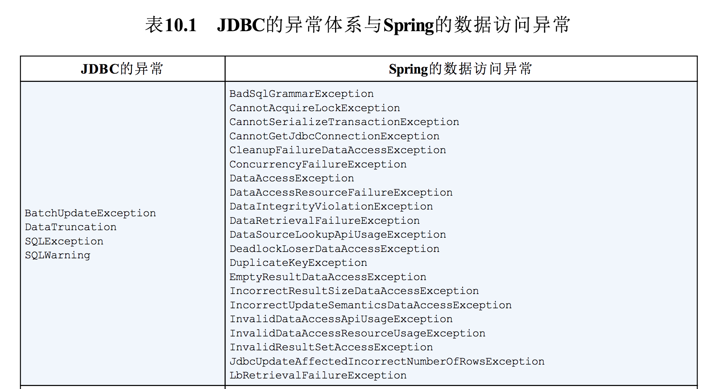 </div><br>
<div align="center">  </div><br>

尽管Spring的异常体系比JDBC简单的SQLException丰富得多，但它并没有与特定的持久化方式相关联。这意味着我们可以使用Spring抛出一致的异常，而不用关心所选择的持久化方案。这有助于我们将所选择持久化机制与数据访问层隔离开来。

#### 看！不用写catch代码块
表10.1中没有体现出来的一点就是这些异常都继承自DataAccessException。DataAccessException的特殊之处在于它是一个非检查型异常。换句话说，没有必要捕获Spring所抛出的数据访问异常（当然，如果你想捕获的话也是完全可以的）。

DataAccessException只是Sping处理检查型异常和非检查型异常哲学的一个范例。

Spring认为触发异常的很多问题是不能在catch代码块中修复的。Spring使用了非检查型异常，而不是强制开发人员编写catch代码块（里面经常是空的）。这把是否要捕获异常的权力留给了开发人员。

为了利用Spring的数据访问异常，我们必须使用Spring所支持的数据访问模板。让我们看一下Spring的模板是如何简化数据访问的。

### 10.1.2 数据访问模板化
如果以前有搭乘飞机旅行的经历，你肯定会觉得旅行中很重要的一件事就是将行李从一个地方搬运到另一个地方。这个过程包含多个步骤。当你到达机场时，第一站是到柜台办理行李托运。然后保安人员对其进行安检以确保安全。之后行李将通过行李车转送到飞机上。如果你需要中途转机，行李也要进行中转。当你到达目的地的时候，行李需要从飞机上取下来并放到传送带上。最后，你到行李认领区将其取回。

尽管在这个过程中包含多个步骤，但是涉及到旅客的只有几个。承运人负责推动整个流程。你只会在必要的时候进行参与，其余的过程不必关心。这反映了一个强大的设计模式：**模板方法模式**。

模板方法定义过程的主要框架。在我们的示例中，整个过程是将行李从出发地运送到目的地。过程本身是固定不变的。处理行李过程中的每个事件都会以同样的方式进行：托运检查、运送到飞机上等等。在这个过程中的某些步骤是固定的——这些步骤每次都是一样的。比如当飞机到达目的地后，所有的行李被取下来并通过传送带运到取行李处。在某些特定的步骤上，处理过程会将其工作委派给子类来完成一些特定实现的细节。这是过程中变化的部分。例如，处理行李是从乘客在柜台托运行李开始的。这部分的处理往往是在最开始的时候进行，所以它在处理过程中的顺序是固定的。由于每位乘客的行李登记都不一样，所以这个过程的实现是由旅客决定的。按照软件方面的术语来讲，**模板方法将过程中与特定实现相关的部分委托给接口，而这个接口的不同实现定义了过程中的具体行为**。

这也是Spring在数据访问中所使用的模式。不管我们使用什么样的技术，都需要一些特定的数据访问步骤。例如，我们都需要获取一个到数据存储的连接并在处理完成后释放资源。这都是在数据访问处理过程中的固定步骤，但是每种数据访问方法又会有些不同，我们会查询不同的对象或以不同的方式更新数据，这都是数据访问过程中变化的部分。

Spring将数据访问过程中固定的和可变的部分明确划分为两个不同的类：**模板（template）和回调（callback）**。模板管理过程中固定的部分，而回调处理自定义的数据访问代码。图10.2展现了这两个类的职责。

<div align="center">  </div><br>
图10.2 Spring的数据访问模板类负责通用的数据访问功能。对于应用程序特定的任务，则会调用自定义的回调对象

如图所示，Spring的模板类处理数据访问的固定部分——事务控制、管理资源以及处理异常。同时，应用程序相关的数据访问——语句、绑定参数以及整理结果集——在回调的实现中处理。事实证明，这是一个优雅的架构，因为你只需关心自己的数据访问逻辑即可。

针对不同的持久化平台，Spring提供了多个可选的模板。如果直接使用JDBC，那你可以选择JdbcTemplate。如果你希望使用对象关系映射框架，那HibernateTemplate或JpaTemplate可能会更适合你。表10.2列出了Spring所提供的所有数据访问模板及其用途。

表10.2 Spring提供的数据访问模板，分别适用于不同的持久化机制

<div align="center"> 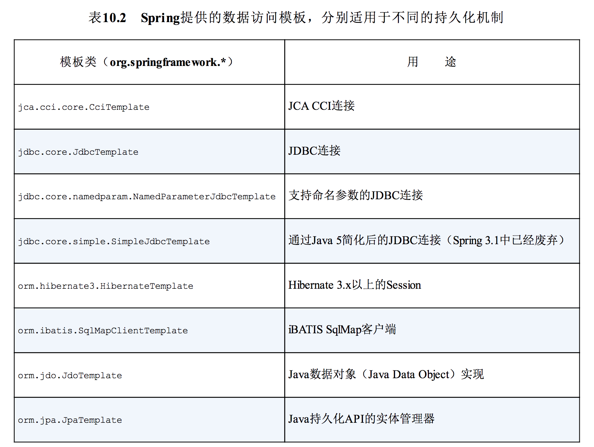 </div><br>

Spring为多种持久化框架提供了支持，这里没有那么多的篇幅在本章对其进行一一介绍。因此，我会关注于我认为最为实用的持久化方案，这也是读者最可能用到的。

在本章中，我们将会从基础的JDBC访问开始，因为这是从数据库中读取和写入数据的最基本方式。在第11章中，我们将会了解Hibernate和JPA，这是最流行的基于POJO的ORM方案。我们会在第12章结束Spring持久化的话题，在这一章中，将会看到Spring Data项目是如何让Spring支持无模式数据的。

但首先要说明的是Spring所支持的大多数持久化功能都依赖于数据源。因此，在声明模板和Repository之前，我们需要在Spring中配置一个数据源用来连接数据库。

## 10.2 配置数据源
无论选择Spring的哪种数据访问方式，你都需要配置一个数据源的引用。Spring提供了在Spring上下文中配置数据源bean的多种方式，包括：

- 通过JDBC驱动程序定义的数据源；
- 通过JNDI查找的数据源；
- 连接池的数据源。

对于即将发布到生产环境中的应用程序，我建议使用从连接池获取连接的数据源。如果可能的话，我倾向于通过应用服务器的JNDI来获取数据源。请记住这一点，让我们首先看一下如何配置Spring从JNDI中获取数据源。

### 10.2.1 使用JNDI数据源
Spring应用程序经常部署在Java EE应用服务器中，如WebSphere、JBoss或甚至像Tomcat这样的Web容器中。这些服务器允许你配置通过JNDI获取数据源。这种配置的好处在于数据源完全可以在应用程序之外进行管理，这样应用程序只需在访问数据库的时候查找数据源就可以了。另外，在应用服务器中管理的数据源通常以池的方式组织，从而具备更好的性能，并且还支持系统管理员对其进行热切换。

利用Spring，我们可以像使用Spring bean那样配置JNDI中数据源的引用并将其装配到需要的类中。位于jee命名空间下的<jee:jndi-lookup>元素可以用于检索JNDI中的任何对象（包括数据源）并将其作为Spring的bean。例如，如果应用程序的数据源配置在JNDI中，我们可以使用<jee:jndi-lookup>元素将其装配到Spring中，如下所示：

```
<jee:jndi-lookup id="datasource"
	  jndi-name="/jdbc/SppitterDS"
	  resource-ref="true"/>
```

其中jndi-name属性用于指定JNDI中资源的名称。如果只设置了jndi-name属性，那么就会根据指定的名称查找数据源。但是，如果应用程序运行在Java应用服务器中，你需要将resource-ref属性设置为true，这样给定的jndi-name将会自动添加“java:comp/env/”前缀。

如果想使用Java配置的话，那我们可以借助JndiObjectFactoryBean从JNDI中查找DataSource：

```
 @Bean
    public JndiObjectFactoryBean datasource() {
        JndiObjectFactoryBean jndiObjectFactoryBean = new JndiObjectFactoryBean();
        jndiObjectFactoryBean.setJndiName("jdbc/spittrDS");
        jndiObjectFactoryBean.setResourceRef(true);
        jndiObjectFactoryBean.setProxyInterface(DataSource.class);
        return jndiObjectFactoryBean;
    }
```

显然，通过Java配置获取JNDI bean要更为复杂。大多数情况下，Java配置要比XML配置简单，但是这一次我们需要写更多的Java代码。但是，很容易就能够看出Java代码中与XML相
对应的配置，Java配置的内容其实也不算多。

### 10.2.2 使用数据源连接池
如果你不能从JNDI中查找数据源，那么下一个选择就是直接在Spring中配置数据源连接池。尽管Spring并没有提供数据源连接池实现，但是我们有多项可用的方案，包括如下开源的实现：

- Apache Commons DBCP (http://jakarta.apache.org/commons/dbcp)；
- c3p0 (http://sourceforge.net/projects/c3p0/) ；
- BoneCP (http://jolbox.com/) 。

这些连接池中的大多数都能配置为Spring的数据源，在一定程度上与Spring自带的DriverManagerDataSource或SingleConnectionDataSource很类似（我们稍后会对其进行介绍）。例如，如下就是配置DBCP BasicDataSource的方式：

<div align="center">  </div><br>

如果你喜欢Java配置的话，连接池形式的DataSourcebean可以声明如下：

<div align="center">  </div><br>

前四个属性是配置BasicDataSource所必需的。属性driverClassName指定了JDBC驱动类的全限定类名。在这里我们配置的是H2数据库的数据源。属性url用于设置数据库的JDBC URL。最后，username和password用于在连接数据库时进行认证。

以上四个基本属性定义了BasicDataSource的连接信息。除此以外，还有多个配置数据源连接池的属性。表10.3列出了DBCP BasicDataSource最有用的一些池配置属性：

表10.3 BasicDataSource的池配置属性

<div align="center">  </div><br>
<div align="center"> 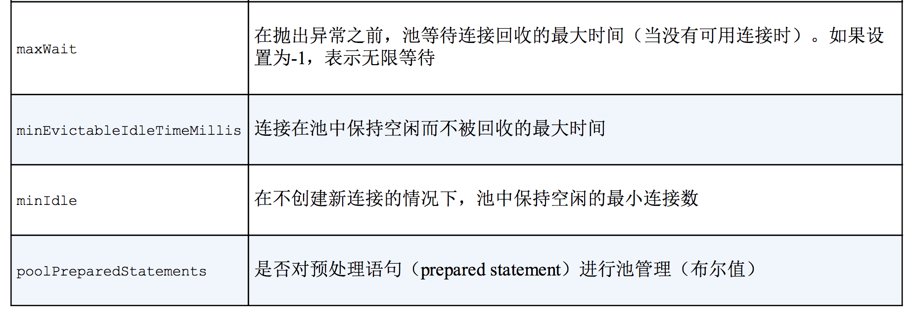 </div><br>

在我们的示例中，连接池启动时会创建5个连接；当需要的时候，允许BasicDataSource创建新的连接，但最大活跃连接数为10。

### 10.2.3 基于JDBC驱动的数据源
在Spring中，通过JDBC驱动定义数据源是最简单的配置方式。Spring提供了三个这样的数据源类（均位于org.springframework.jdbc.datasource包中）供选择：

- DriverManagerDataSource：在每个连接请求时都会返回一个新建的连接。与DBCP的BasicDataSource不同，由DriverManagerDataSource提供的连接并没有进行池化管理；
- SimpleDriverDataSource：与DriverManagerDataSource的工作方式类似，但是它直接使用JDBC驱动，来解决在特定环境下的类加载问题，这样的环境包括OSGi容器；
- SingleConnectionDataSource：在每个连接请求时都会返回同一个的连接。尽管SingleConnectionDataSource不是严格意义上的连接池数据源，但是你可以将其视为只有一个连接的池。

以上这些数据源的配置与DBCPBasicDataSource的配置类似。例如，如下就是配置DriverManagerDataSource的方法：


如果使用XML的话，DriverManagerDataSource可以按照如下的方式配置：

<div align="center"> 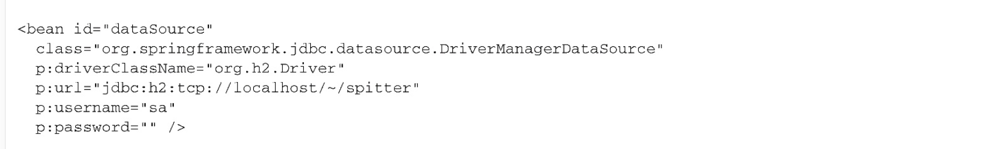 </div><br>

与具备池功能的数据源相比，唯一的区别在于这些数据源bean都没有提供连接池功能，所以没有可配置的池相关的属性。

尽管这些数据源对于小应用或开发环境来说是不错的，但是要将其用于生产环境，你还是需要慎重考虑。因为SingleConnectionDataSource有且只有一个数据库连接，所以不适合用于多线程的应用程序，最好只在测试的时候使用。而DriverManagerDataSource和SimpleDriverDataSource尽管支持多线程，但是在每次请求连接的时候都会创建新连接，这是以性能为代价的。鉴于以上的这些限制，我强烈建议应该使用数据源连接池。

### 10.2.4 使用嵌入式的数据源
除此之外，还有一个数据源是我想对读者介绍的：嵌入式数据库（embedded database）。嵌入式数据库作为应用的一部分运行，而不是应用连接的独立数据库服务器。尽管在生产环境的设置中，它并没有太大的用处，但是对于开发和测试来讲，嵌入式数据库都是很好的可选方案。这是因为每次重启应用或运行测试的时候，都能够重新填充测试数据。

Spring的jdbc命名空间能够简化嵌入式数据库的配置。例如，如下的程序清单展现了如何使用jdbc命名空间来配置嵌入式的H2数据库，它会预先加载一组测试数据。

程序清单10.1 使用jdbc命名空间配置嵌入式数据库

<div align="center">  </div><br>

我们将`<jdbc:embedded-database>`的type属性设置为H2，表明嵌入式数据库应该是H2数据库（要确保H2位于应用的类路径下）。另外，我们还可以将type设置为DERBY，以使用嵌入式的Apache Derby数据库。

在`<jdbc:embedded-database>`中，我们可以不配置也可以配置多个<jdbc:script>元素来搭建数据库。程序清单10.1中包含了两个<jdbc:script>元素：第一个引用了schema.sql，它包含了在数据库中创建表的SQL；第二个引用了test-data.sql，用来将测试数据填充到数据库中。

除了搭建嵌入式数据库以外，`<jdbc:embedded-database>`元素还会暴露一个数据源，我们可以像使用其他的数据源那样来使用它。在这里，id属性被设置成了dataSource，这也是所暴露数据源的bean ID。因此，当我们需要javax.sql.DataSource的时候，就可以注入dataSource bean。

如果使用Java来配置嵌入式数据库时，不会像jdbc命名空间那么简便，我们可以使用EmbeddedDatabaseBuilder来构建DataSource：

```
 @Bean
    public DataSource dataSource2() {
        return new EmbeddedDatabaseBuilder()
                .setType(EmbeddedDatabaseType.H2)
                .addScript("classpath:schema.sql")
                .addScript("classpath:test-data.sql")
                .build();
    }
```

可以看到，setType()方法等同于`<jdbc:embedded-database>`元素中的type属性，此外，我们这里用addScript()代替<jdbc:script>元素来指定初始化SQL。

### 10.2.5 使用profile选择数据源
我们已经看到了多种在Spring中配置数据源的方法，我相信你已经找到了一两种适合你的应用程序的配置方式。实际上，我们很可能面临这样一种需求，那就是在某种环境下需要其中一种数据源，而在另外的环境中需要不同的数据源。

例如，对于开发期来说，`<jdbc:embedded-database>`元素是很合适的，而在QA环境中，你可能希望使用DBCP的BasicDataSource，在生产部署环境下，可能需要使用<jee:jndi-lookup>。

我们在第3章所讨论的Spring的bean profile特性恰好用在这里，所需要做的就是将每个数据源配置在不同的profile中，如下所示：

程序清单10.2 借助Spring的profile特性能够在运行时选择数据源

```
public class DataSourceConfiguration {

    /**
     * 生产环境 数据源
     *
     * @return
     */
    @Profile("pro")
    @Bean
    public JndiObjectFactoryBean datasource() {
        JndiObjectFactoryBean jndiObjectFactoryBean = new JndiObjectFactoryBean();
        jndiObjectFactoryBean.setJndiName("jdbc/spittrDS");
        jndiObjectFactoryBean.setResourceRef(true);
        jndiObjectFactoryBean.setProxyInterface(DataSource.class);
        return jndiObjectFactoryBean;
    }

    /**
     * QA 数据源
     *
     * @return
     */
    @Profile("qa")
    @Bean
    public DataSource dataSource() {
        DriverManagerDataSource ds = new DriverManagerDataSource();
        ds.setDriverClassName("org.h2.Driver");
        ds.setUrl("jdbc:h2:tcp://localhost/~/spitter");
        ds.setUsername("sa");
        ds.setPassword("");
        return ds;
    }

    /**
     * 开发 数据源
     *
     * @return
     */
    @Profile("dev")
    @Bean
    public DataSource embeddeddataSource() {
        return new EmbeddedDatabaseBuilder()
                .setType(EmbeddedDatabaseType.H2)
                .addScript("classpath:com/alan/yx/springInAction/Chapter_10/jdbc/src/main/resources/spittr/db/jdbc/schema.sql")
                .addScript("classpath:com/alan/yx/springInAction/Chapter_10/jdbc/src/test/resources/spittr/db/jdbc/test-data.sql")
                .build();
    }
}
```

通过使用profile功能，会在运行时选择数据源，这取决于哪一个profile处于激活状态。如程序清单10.2配置所示，当且仅当development profile处于激活状态时，会创建嵌入式数据库，当且仅当qa profile处于激活状态时，会创建DBCP BasicDataSource，当且仅当production profile处于激活状态时，会从JNDI获取数据源。

为了内容的完整性，如下的程序清单展现了如何使用Spring XML代替Java配置，实现相同的profile配置。

程序清单10.3 借助XML配置，基于profile选择数据源

<div align="center"> 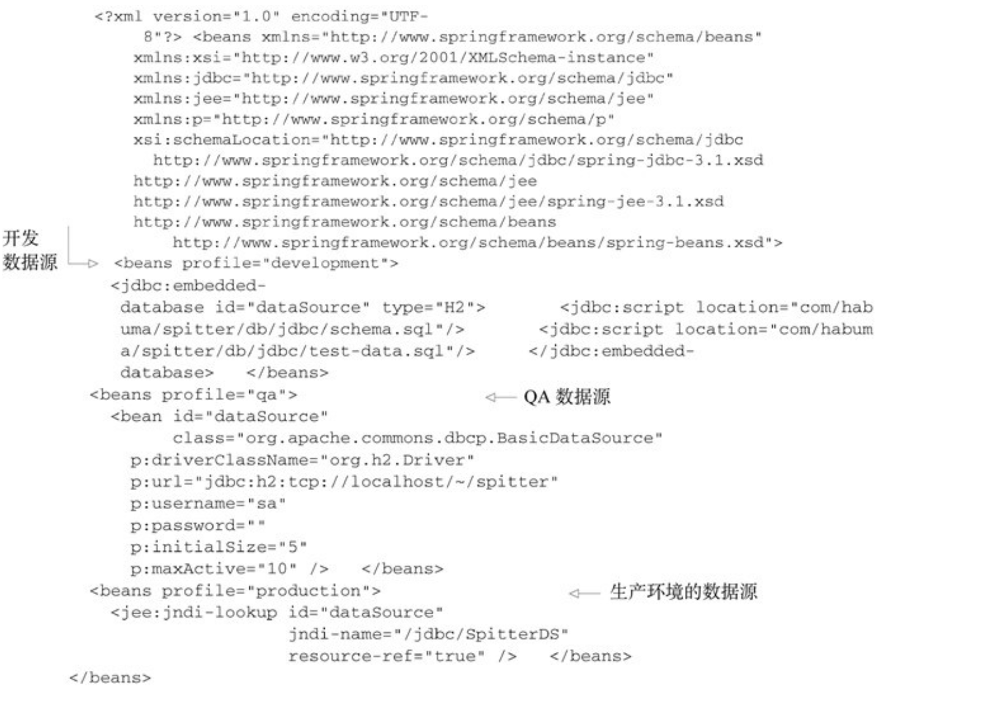 </div><br>

现在我们已经通过数据源建立了与数据库的连接，接下来要实际访问数据库了。就像我在前面所提到的，Spring为我们提供了多种使用数据库的方式包括JDBC、Hibernate以及Java持久化API（Java Persistence API，JPA）。在下一节，我们将会看到如何使用Spring对JDBC的支持为应用程序构建持久层。如果你喜欢使用Hibernate或JPA，那可以直接跳到下一章。

## 10.3 在Spring中使用JDBC
持久化技术有很多种，而Hibernate、iBATIS和JPA只是其中的几种而已。尽管如此，还是有很多的应用程序使用最古老的方式将Java对象保存到数据库中：他们自食其力。不，等等，这是他们挣钱的途径。这种久经考验并证明行之有效的持久化方法就是古老的JDBC。

为什么不采用它呢？JDBC不要求我们掌握其他框架的查询语言。它是建立在SQL之上的，而SQL本身就是数据访问语言。此外，与其他的技术相比，使用JDBC能够更好地对数据访问的性能进行调优。JDBC允许你使用数据库的所有特性，而这是其他框架不鼓励甚至禁止的。

再者，相对于持久层框架，JDBC能够让我们在更低的层次上处理数据，我们可以完全控制应用程序如何读取和管理数据，包括访问和管理数据库中单独的列。这种细粒度的数据访问方式在很多应用程序中是很方便的。例如在报表应用中，如果将数据组织为对象，而接下来唯一要做的就是将其解包为原始数据，那就没有太大意义了。

但是JDBC也不是十全十美的。虽然JDBC具有强大、灵活和其他一些优点，但也有其不足之处。

### 10.3.1 应对失控的JDBC代码
如果使用JDBC所提供的直接操作数据库的API，你需要负责处理与数据库访问相关的所有事情，其中包含管理数据库资源和处理异常。如果你曾经使用JDBC往数据库中插入数据，那如下代码对你应该并不陌生：

程序清单10.4 使用JDBC在数据库里插入一行数据

<div align="center">  </div><br>

看看这些失控的代码！这个超过20行的代码仅仅是为了向数据库中插入一个简单的对象。对于JDBC操作来讲，这应该是最简单的了。但是为什么要用这么多行代码才能做如此简单的事情呢？实际上，并非如此，只有几行代码是真正用于进行插入数据的。但是JDBC要求你必须正确地管理连接和语句，并以某种方式处理可能抛出的SQLException异常。

再提一句这个SQLException异常：你不但不清楚如何处理它（因为并不知道哪里出错了），而且你还要捕捉它两次！你需要在插入记录出错时捕捉它，同时你还需要在关闭语句和连接出错的时候捕捉它。看起来我们要做很多的工作来处理可能出现的问题，而这些问题通常是难以通过编码来处理的。

再来看一下如下程序清单中的代码，我们使用传统的JDBC来更新数据库中Spitter表的一行。

程序清单10.5 使用JDBC更新数据库中的一行

<div align="center">  </div><br>

乍看上去，程序清单10.5和10.4是相同的。实际上，除了SQL字符串和创建语句的那一行，它们是完全相同的。同样，这里也使用大量代码来完成一件简单的事情，而且有很多重复的代码。在理想情况下，我们只需要编写与特定任务相关的代码。毕竟，这才是程序清单10.5和10.4的不同之处，剩下的都是样板代码。

为了完成对JDBC的完整介绍，让我们看一下如何从数据库中获取数据。如下所示，它也不简单。

程序清单10.6 使用JDBC从数据库中查询一行数据

<div align="center">  </div><br>

这段代码与插入和更新的样例一样冗长，甚至更为复杂。这就好像Pareto法则被倒了过来：只有20%的代码是真正用于查询数据的，而80%代码都是样板代码。

现在你可以看出，大量的JDBC代码都是用于创建连接和语句以及异常处理的样板代码。既然已经得出了这个观点，我们将不再接受它的折磨，以后你再也不会看到这样令人厌恶的代码了。

但实际上，这些样板代码是非常重要的。清理资源和处理错误确保了数据访问的健壮性。如果没有它们的话，就不会发现错误而且资源也会处于打开的状态，这将会导致意外的代码和资源泄露。我们不仅需要这些代码，而且还要保证它是正确的。基于这样的原因，我们才需要框架来保证这些代码只写一次而且是正确的。

### 10.3.2 使用JDBC模板
Spring的JDBC框架承担了资源管理和异常处理的工作，从而简化了JDBC代码，让我们只需编写从数据库读写数据的必需代码。

正如前面小节所介绍过的，Spring将数据访问的样板代码抽象到模板类之中。Spring为JDBC提供了三个模板类供选择：

- JdbcTemplate：最基本的Spring JDBC模板，这个模板支持简单的JDBC数据库访问功能以及基于索引参数的查询；
- NamedParameterJdbcTemplate：使用该模板类执行查询时可以将值以命名参数的形式绑定到SQL中，而不是使用简单的索引参数；
- SimpleJdbcTemplate：该模板类利用Java 5的一些特性如自动装箱、泛型以及可变参数列表来简化JDBC模板的使用。

以前，在选择哪一个JDBC模板的时候，我们需要仔细权衡。但是从Spring 3.1开始，做这个决定变得容易多了。SimpleJdbcTemplate已经被废弃了，其Java 5的特性被转移到了JdbcTemplate中，并且只有在你需要使用命名参数的时候，才需要使用NamedParameterJdbcTemplate。这样的话，对于大多数的JDBC任务来说，JdbcTemplate就是最好的可选方案，这也是本小节中所关注的方案。使

#### 用JdbcTemplate来插入数据
为了让JdbcTemplate正常工作，只需要为其设置DataSource就可以了，这使得在Spring中配置JdbcTemplate非常容易，如下面的@Bean方法所示：

```
 @Bean
    public JdbcTemplate jdbcTemplate(DataSource dataSource){
        return new JdbcTemplate(dataSource);
    }
```

在这里，DataSource是通过构造器参数注入进来的。这里所引用的dataSourcebean可以是javax.sql.DataSource的任意实现，包括我们在10.2小节中所创建的。

现在，我们可以将jdbcTemplate装配到Repository中并使用它来访问数据库。例如，SpitterRepository使用了JdbcTemplate：

<div align="center">  </div><br>

在这里，JdbcSpitterRepository类上使用了@Repository注解，这表明它将会在组件扫描的时候自动创建。它的构造器上使用了@Inject注解，因此在创建的时候，会自动获得一个JdbcOperations对象。JdbcOperations是一个接口，定义了JdbcTemplate所实现的操作。通过注入JdbcOperations，而不是具体的JdbcTemplate，能够保证JdbcSpitterRepository通过JdbcOperations接口达到与JdbcTemplate保持**松耦合**。

作为另外一种组件扫描和自动装配的方案，我们可以将JdbcSpitterRepository显式声明为Spring中的bean，如下所示：

```
@Bean
    public SpitterRepository spitterRepository(JdbcTemplate jdbcTemplate){
        return new JdbcSpitterRepository(jdbcTemplate);
    }
```

在Repository中具备可用的JdbcTemplate后，我们可以极大地简化程序清单10.4中的addSpitter()方法。基于JdbcTemplate的addSpitter()方法如下：

程序清单10.7 基于JdbcTemplate的addSpitter()方法

<div align="center"> 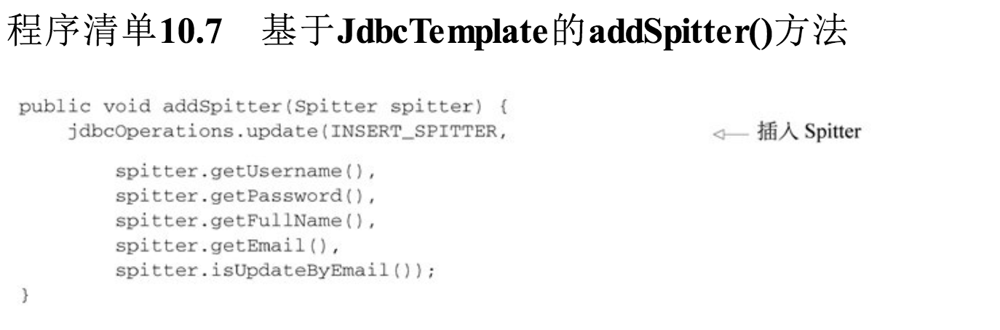 </div><br>

这个版本的addSpitter()方法简单多了。这里没有了创建连接和语句的代码，也没有异常处理的代码，只剩下单纯的数据插入代码。

不能因为你看不到这些样板代码，就意味着它们不存在。样板代码被巧妙地隐藏到JDBC模板类中了。当update()方法被调用的时候JdbcTemplate将会获取连接、创建语句并执行插入SQL。

在这里，你也看不到对SQLException处理的代码。在内部，JdbcTemplate将会捕获所有可能抛出的SQLException，并将通用的SQLException转换为表10.1所列的那些更明确的数据访问异常，然后将其重新抛出。因为Spring的数据访问异常都是运行时异常，所以我们不必在addSpring ()方法中进行捕获。

#### 使用JdbcTemplate来读取数据
JdbcTemplate也简化了数据的读取操作。程序清单10.8展现了新版本的findOne()方法，它使用了JdbcTemplate的回调，实现根据ID查询Spitter，并将结果集映射为Spitter对象。

程序清单10.8 使用JdbcTemplate查询Spitter

```
 public Spitter findOne(long id) {
        // 查询 Spitter
        return jdbcTemplate.queryForObject(
                SELECT_SPITTER + " where id=?",
                // 将查询结果映射到对象
                new SpitterRowMapper(),
                id);
    }

    private static final class SpitterRowMapper implements RowMapper<Spitter> {
        public Spitter mapRow(ResultSet rs, int rowNum) throws SQLException {
            long id = rs.getLong("id");
            String username = rs.getString("username");
            String password = rs.getString("password");
            String fullName = rs.getString("fullname");
            String email = rs.getString("email");
            boolean updateByEmail = rs.getBoolean("updateByEmail");
            // 绑定参数
            return new Spitter(id, username, password, fullName, email, updateByEmail);
        }
    }
```

在这个findOne()方法中使用了JdbcTemplate的queryForObject()方法来从数据库查询Spitter。queryForObject()方法有三个参数：

- String对象，包含了要从数据库中查找数据的SQL；
- RowMapper对象，用来从ResultSet中提取数据并构建域对象（本例中为Spitter）；
- 可变参数列表，列出了要绑定到查询上的索引参数值。

真正奇妙的事情发生在SpitterRowMapper对象中，它实现了RowMapper接口。对于查询返回的每一行数据，JdbcTemplate将会调用RowMapper的mapRow()方法，并传入一个ResultSet和包含行号的整数。在SpitterRowMapper的mapRow()方法中，我们创建了Spitter对象并将ResultSet中的值填充进去。

就像addSpitter()那样，findOne()方法也不用写JDBC模板代码。不同于传统的JDBC，这里没有资源管理或者异常处理代码。使用JdbcTemplate的方法只需关注于如何从数据库中获取Spitter对象即可。

#### 在JdbcTemplate中使用Java 8的Lambda表达式
因为RowMapper接口只声明了addRow()这一个方法，因此它完全符合函数式接口（functional interface）的标准。这意味着如果使用Java 8来开发应用的话，我们可以使用Lambda来表达RowMapper的实现，而不必再使用具体的实现类了。

例如，程序清单10.8中的findOne()方法可以使用Java 8的Lambda表达式改写，如下所示：

<div align="center"> 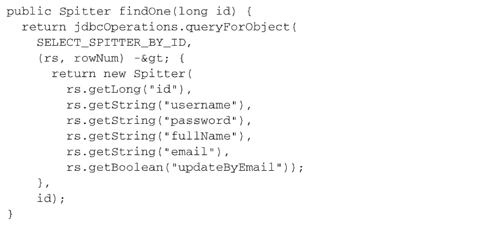 </div><br>

我们可以看到，Lambda表达式要比完整的RowMapper实现更为易读，不过它们的功能是相同的。Java会限制RowMapper中的Lambda表达式，使其满足所传入的参数。

另外，我们还可以使用Java 8的方法引用，在单独的方法中定义映射逻辑：

```
 public Spitter findOne(long id) {
        // 查询 Spitter
        return jdbcTemplate.queryForObject(
                SELECT_SPITTER + " where id=?",
                // 将查询结果映射到对象
                this::mapSpitter,
                id);
    }

    private Spitter mapSpitter(ResultSet rs, int rowNum) throws SQLException {
        return new Spitter(
                rs.getLong("id"),
                rs.getString("username"),
                rs.getString("password"),
                rs.getString("fullname"),
                rs.getString("email"),
                rs.getBoolean("updateByEmail"));
    }
```

不管采用哪种方式，我们都不必显式实现RowMapper接口，但是与实现RowMapper类似，我们所提供的Lambda表达式和方法必须要接受相同的参数，并返回相同的类型。

#### 使用命名参数在清单
10.7的代码中，addSpitter()方法使用了索引参数。这意味着我们需要留意查询中参数的顺序，在将值传递给update()方法的时候要保持正确的顺序。如果在修改SQL时更改了参数的顺序，那我们还需要修改参数值的顺序。

除了这种方法之外，我们还可以使用命名参数。命名参数可以赋予SQL中的每个参数一个明确的名字，在绑定值到查询语句的时候就通过该名字来引用参数。例如，假设SQL_INSERT_SPITTER查询语句是这样定义的：

<div align="center">  </div><br>

使用命名参数查询，绑定值的顺序就不重要了，我们可以按照名字来绑定值。如果查询语句发生了变化导致参数的顺序与之前不一致，我们不需要修改绑定的代码。

NamedParameterJdbcTemplate是一个特殊的JDBC模板类，它支持使用命名参数。在Spring中，NamedParameterJdbcTemplate的声明方式与常规的JdbcTemplate几乎完全相同：

```
 @Bean
    public NamedParameterJdbcTemplate namedParameterJdbcTemplate(DataSource dataSource){
        return new NamedParameterJdbcTemplate(dataSource);
    }
```

在这里，我们将NamedParameterJdbcOperations（NamedParameterJdbcTemplate所实现的接口）注入到Repository中，用它来替代JdbcOperations。现在的addSpitter()方法如下所示：

程序清单10.9 使用Spring JDBC模板的命名参数功能

<div align="center"> 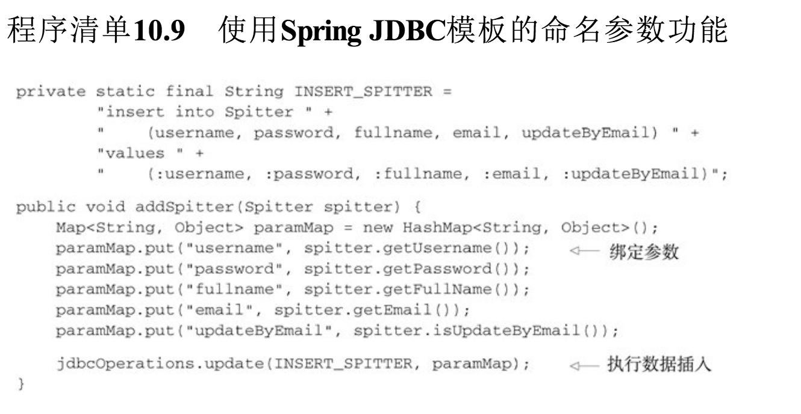 </div><br>

这个版本的addSpitter()比前一版本的代码要长一些。这是因为命名参数是通过java.util.Map来进行绑定的。不过，每行代码都关注于往数据库中插入Spitter对象。这个方法的核心功能并不会被资源管理或异常处理这样的代码所充斥。

## 10.4 小结
数据是应用程序的血液。有些数据中心论者甚至主张数据即应用。鉴于数据的重要地位，以健壮、简单和清晰的方式开发应用程序的数据访问部分就显得举足轻重了。

在Java中，JDBC是与关系型数据库交互的最基本方式。但是按照规范，JDBC有些太笨重了。Spring能够解除我们使用JDBC中的大多数痛苦，包括消除样板式代码、简化JDBC异常处理，你所需要做的仅仅是关注要执行的SQL语句。

在本章中，我们学习了Spring对数据持久化的支持，以及Spring为JDBC所提供的基于模板的抽象，它能够极大地简化JDBC的使用。

在下一章中，我们会继续Spring数据持久化这一话题，将会学习Spring为Java持久化API所提供的功能。

# 第12章 使用NoSQL数据库
本章内容：

- 为MongoDB和Neo4j编写Repository
- 为多种数据存储形式持久化数据
- 组合使用Spring和Redis

亨利·福特在他的自传中曾经写过一句很著名的话：“任何顾客可以将这辆车漆成任何他所愿意的颜色，只要保持它的黑色就可以”[1]。有人说这句话是傲慢和固执的，而有些人则说这句话反映出了他的幽默。事实上，在这本自传出版的时候，他通过使用一种快速烘干的油漆降低了成本，而当时这种油漆只有黑色的。

福特的这句著名的话也可以用在数据库领域，多年来，我们一直被告知，我们可以使用任意想要的数据库，只要它是关系型数据库就行。关系型数据库已经垄断应用开发领域好多年了。

随着一些竞争者进入数据库领域，关系型数据库的垄断地位开始被弱化。所谓的“NoSQL”数据库开始侵入生产型的应用之中，我们也认识到并没有一种全能型的数据库。现在有了更多的可选方案，所以能够为要解决的问题选择最佳的数据库。

在前面的几章中，我们关注于关系型数据库，首先使用Spring对JDBC支持，然后使用对象-关系映射。在上一章，我们看到了Spring Data JPA，它是Spring Data项目下的多个子项目之一。通过在运行时自动生成Repository实现，Spring Data JPA能够让使用JPA的过程更加简单容易。

Spring Data还提供了对多种NoSQL数据库的支持，包括MongoDB、Neo4j和Redis。它不仅支持自动化的Repository，还支持基于模板的数据访问和映射注解。在本章中，将会看到如何为非关系型的NoSQL数据库编写Repository。首先，我们将从Spring Data MongoDB开始，看一下如何编写Repository来处理基于文档的数据。

## 12.3 使用Redis操作key-value数据
Redis是一种特殊类型的数据库，它被称之为key-value存储。顾名思义，key-value存储保存的是键值对。实际上，key-value存储与哈希Map有很大的相似性。可以不太夸张地说，它们就是持久化的哈希Map。

当你思考这一点的时候，可能会意识到，对于哈希Map或者key-value存储来说，其实并没有太多的操作。我们可以将某个value存储到特定的key上，并且能够根据特定key，获取value。差不多也就是这样了。因此，Spring Data的自动Repository生成功能并没有应用到Redis上。不过，Spring Data的另外一个关键特性，也就是面向模板的数据访问，能够在使用Redis的时候，为我们提供帮助。

Spring Data Redis包含了多个模板实现，用来完成Redis数据库的数据存取功能。稍后，我们就会看到如何使用它们。但是为了创建Spring Data Redis的模板，我们首先需要有一个Redis连接工厂。幸好，Spring Data Redis提供了四个连接工厂供我们选择。

### 12.3.1 连接到Redis
Redis连接工厂会生成到Redis数据库服务器的连接。Spring Data Redis为四种Redis客户端实现提供了连接工厂：

- JedisConnectionFactory
- JredisConnectionFactory
- LettuceConnectionFactory
- SrpConnectionFactory

具体选择哪一个取决于你。我建议你自行测试并建立基准，进而确定哪一种Redis客户端和连接工厂最适合你的需求。从Spring Data Redis的角度来看，这些连接工厂在适用性上都是相同的。

在做出决策之后，我们就可以将连接工厂配置为Spring中的bean。例如，如下展示了如何配置JedisConnectionFactory bean：

```
   @Bean
    public RedisConnectionFactory redisCF() {
        return new JedisConnectionFactory();
    }
```

通过默认构造器创建的连接工厂会向localhost上的6379端口创建连接，并且没有密码。如果你的Redis服务器运行在其他的主机或端口上，在创建连接工厂的时候，可以设置这些属性：

```
 @Bean
    public RedisConnectionFactory redisCF() {
        JedisConnectionFactory jcf = new JedisConnectionFactory();
        jcf.setHostName("redis-server");
        jcf.setPort(7379);
        return jcf;
    }
```

类似地，如果你的Redis服务器配置为需要客户端认证的话，那么可以通过调用setPassword()方法来设置密码：

```
 @Bean
    public RedisConnectionFactory redisCF() {
        JedisConnectionFactory jcf = new JedisConnectionFactory();
        jcf.setHostName("redis-server");
        jcf.setPort(7379);
        jcf.setPassword("foobared");
        return jcf;
    }
```

在上面的这些例子中，我都假设使用的是JedisConnectionFactory。如果你选择使用其他连接工厂的话，只需进行简单地替换就可以了。例如，假设你要使用LettuceConnectionFactory的话，可以按照如下的方式进行配置：

```
 @Bean
    public RedisConnectionFactory redisCF() {
        JedisConnectionFactory jcf = new LettuceConnectionFactory();
        jcf.setHostName("redis-server");
        jcf.setPort(7379);
        jcf.setPassword("foobared");
        return jcf;
    }
```

所有的Redis连接工厂都具有setHostName()、setPort()和setPassword()方法。这样，它们在配置方面实际上是相同的。

现在，我们有了Redis连接工厂，接下来就可以使用Spring Data Redis模板了。

### 12.3.2 使用RedisTemplate
顾名思义，Redis连接工厂会生成到Redis key-value存储的连接（以RedisConnection的形式）。借助RedisConnection，可以存储和读取数据。例如，我们可以获取连接并使用它来保存一个问候信息，如下所示：

<div align="center">  </div><br>

与之类似，我们还可以使用RedisConnection来获取之前存储的问候信息：

```
byte[] greetingBytes = conn.get("greeting".getBytes());
String greeting = new String(greetingBytes);
```

毫无疑问，这可以正常运行，但是你难道真的愿意使用字节数组吗？

与其他的Spring Data项目类似，Spring Data Redis以模板的形式提供了较高等级的数据访问方案。实际上，Spring Data Redis提供了两个模板：

- RedisTemplate
- StringRedisTemplate

RedisTemplate可以极大地简化Redis数据访问，能够让我们持久化各种类型的key和value，并不局限于字节数组。在认识到key和value通常是String类型之后，StringRedisTemplate扩展了RedisTemplate，只关注String类型。

假设我们已经有了RedisConnectionFactory，那么可以按照如下的方式构建RedisTemplate：

		  RedisConnectionFactory cf =  . . . ;
		  RedisTemplate<String, Product> redis = new RedisTemplate<String, Product>();
        redis.setConnectionFactory(cf);

注意，RedisTemplate使用两个类型进行了参数化。第一个是key的类型，第二个是value的类型。在这里所构建的RedisTemplate中，将会保存Product对象作为value，并将其赋予一个String类型的key。

如果你所使用的value和key都是String类型，那么可以考虑使用StringRedisTemplate来代替RedisTemplate：

		  RedisConnectionFactory cf =  . . . ;
		  RedisTemplate<String, Product> redis = new StringRedisTemplate<String, Product>();
        redis.setConnectionFactory(cf);


注意，与RedisTemplate不同，StringRedisTemplate有一个接受RedisConnectionFactory的构造器，因此没有必要在构建后再调用setConnectionFactory()。

尽管这并非必须的，但是如果你经常使用RedisTemplate或StringRedisTemplate的话，你可以考虑将其配置为bean，然后注入到需要的地方。如下就是一个声明RedisTemplate的简单@Bean方法：

```
	 @Bean
    public RedisTemplate<String, Product> redisTemplate(RedisConnectionFactory cf) {
        RedisTemplate<String, Product> redis = new RedisTemplate<String, Product>();
        redis.setConnectionFactory(cf);
        return redis;
    }
```

如下是声明StringRedisTemplate bean的@Bean方法：
```
	 @Bean
    public RedisTemplate<String, Product> redisTemplate(RedisConnectionFactory cf) {
        return new StringRedisTemplate <String, Product>(cf);
    }
```

有了RedisTemplate（或StringRedisTemplate）之后，我们就可以开始保存、获取以及删除key-value条目了。RedisTemplate的大多数操作都是表12.5中的子API提供的。

表12.5 RedisTemplate的很多功能是以子API的形式提供的，它们区分了单个值和集合值的场景

<div align="center"> 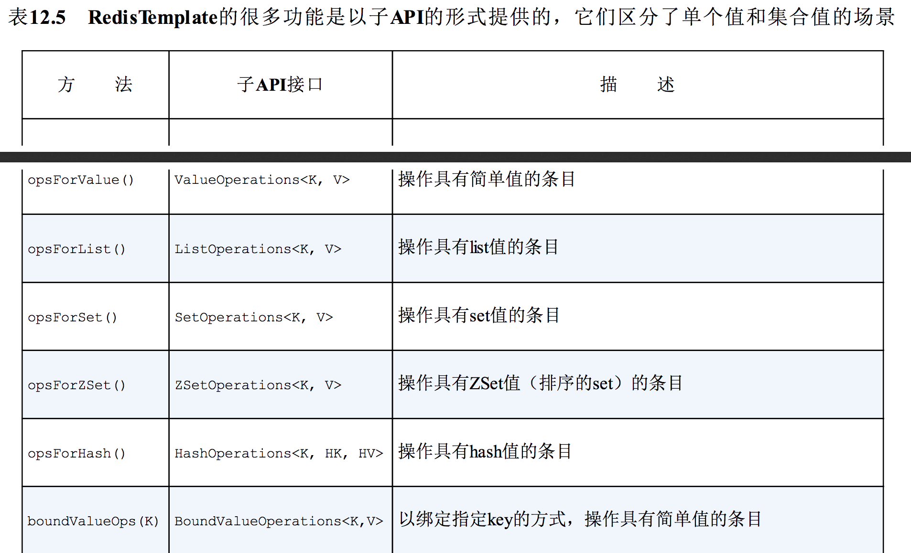 </div><br>
<div align="center">  </div><br>

我们可以看到，表12.5中的子API能够通过RedisTemplate（和StringRedisTemplate）进行调用。其中每个子API都提供了使用数据条目的操作，基于value中所包含的是单个值还是一个值的集合它们会有所差别。

这些子API中，包含了很多从Redis中存取数据的方法。我们没有足够的篇幅介绍所有的方法，但是会介绍一些最为常用的操作。

#### 使用简单的值
假设我们想通过RedisTemplate<String, Product>保存Product，其中key是sku属性的值。如下的代码片段展示了如何借助opsForValue()方法完成该功能：

	redis.opsForValue().set(product.getSku(),product);

类似地，如果你希望获取sku属性为123456的产品，那么可以使用如下的代码片段：

	Product  product = redis.opsForValue().get("123456");

如果按照给定的key，无法获得条目的话，将会返回null。

#### 使用List类型的值
使用List类型的value与之类似，只需使用opsForList()方法即可。例如，我们可以在一个List类型的条目尾部添加一个值：

	redis.opsForList().rightPush("cart",product);

通过这种方式，我们向列表的尾部添加了一个Product，所使用的这个列表在存储时key为cart。如果这个key尚未存在列表的话，将会创建一个。

rightPush()会在列表的尾部添加一个元素，而leftPush()则会在列表的头部添加一个值：

	redis.opsForList().leftPush("cart",product);

我们有很多方式从列表中获取元素，可以通过leftPop()或rightPop()方法从列表中弹出一个元素：

	Product first = redis.opsForList().rightPop("cart",product);
	Product first = redis.opsForList().leftPop("cart",product);

除了从列表中获取值以外，这两个方法还有一个副作用就是从列表中移除所弹出的元素。如果你只是想获取值的话（甚至可能要在列表的中间获取），那么可以使用range()方法：

	List<Product> products = redis.opsForList().range("cart",2,12);

range()方法不会从列表中移除任何元素，但是它会根据指定的key和索引范围，获取范围内的一个或多个值。前面的样例中，会获取11个元素，从索引为2的元素到索引为12的元素（不包含）。如果范围超出了列表的边界，那么只会返回索引在范围内的元素。如果该索引范围内没有元素的话，将会返回一个空的列表。

#### 在Set上执行操作
除了操作列表以外，我们还可以使用opsForSet()操作Set。最为常用的操作就是向Set中添加一个元素：

	redis.opsForSet().add("cart",product);

在我们有多个Set并填充值之后，就可以对这些Set进行一些有意思的操作，如获取其差异、求交集和求并集：

	List<Product> diff = redis.opsForSet().difference("cart1","cart2");
	List<Product> union = redis.opsForSet().union("cart1","cart2");
	List<Product> isect = redis.opsForSet().isect("cart1","cart2");

当然，我们还可以移除它的元素：

	redis.opsForSet().remove(product);

我们甚至还可以随机获取Set中的一个元素：

	Product random = redis.opsForSet().randomMember("cart");

因为Set没有索引和内部的排序，因此我们无法精准定位某个点，然后从Set中获取元素。

#### 绑定到某个key上
表12.5包含了五个子API，它们能够以绑定key的方式执行操作。这些子API与其他的API是对应的，但是关注于某一个给定的key。

为了举例阐述这些子API的用法，我们假设将Product对象保存到一个list中，并且key为cart。在这种场景下，假设我们想从list的右侧弹出一个元素，然后在list的尾部新增三个元素。我们此时可以使用boundListOps()方法所返回的BoundListOperations：

<div align="center">  </div><br>

注意，我们只在一个地方使用了条目的key，也就是调用boundListOps()的时候。对返回的BoundListOperations执行的所有操作都会应用到这个key上。

#### 12.3.3 使用key和value的序列化器
当某个条目保存到Redis key-value存储的时候，key和value都会使用Redis的序列化器（serializer）进行序列化。Spring Data Redis提供了多个这样的序列化器，包括：

- GenericToStringSerializer：使用Spring转换服务进行序列化；
- JacksonJsonRedisSerializer：使用Jackson 1，将对象序列化为JSON；
- Jackson2JsonRedisSerializer：使用Jackson 2，将对象序列化为JSON；
- JdkSerializationRedisSerializer：使用Java序列化；
- OxmSerializer：使用Spring O/X映射的编排器和解排器（marshaler和unmarshaler）实现序列化，用于XML序列化；
- StringRedisSerializer：序列化String类型的key和value。

这些序列化器都实现了RedisSerializer接口，如果其中没有符合需求的序列化器，那么你还可以自行创建。

RedisTemplate会使用JdkSerializationRedisSerializer，这意味着key和value都会通过Java进行序列化。StringRedisTemplate默认会使用StringRedisSerializer，这在我们的预料之中，它实际上就是实现String与byte数组之间的相互转换。这些默认的设置适用于很多的场景，但有时候你可能会发现使用一个不同的序列化器也是很有用处的。

例如，假设当使用RedisTemplate的时候，我们希望将Product类型的value序列化为JSON，而key是String类型。RedisTemplate的setKeySerializer()和setValueSerializer()方法就需要如下所示：

```
@Bean
    public RedisTemplate<String, Product> redisTemplate(RedisConnectionFactory cf) {
        RedisTemplate<String, Product> redis = new RedisTemplate<String, Product>();
        redis.setConnectionFactory(cf);
        redis.setKeySerializer(new StringRedisSerializer());
        redis.setValueSerializer(new Jackson2JsonRedisSerializer<Product>(Product.class));
        return redis;
    }
```

在这里，我们设置RedisTemplate在序列化key的时候，使用StringRedisSerializer，并且也设置了在序列化Product的时候，使用Jackson2JsonRedisSerializer。

## 12.4 小结
关系型数据库作为数据持久化领域唯一可选方案的时代已经一去不返了。现在，我们有多种不同的数据库，每一种都代表了不同形式的数据，并提供了适应多种领域模型的功能。Spring Data能够让我们在Spring应用中使用这些数据库，并且使用一致的抽象方式访问各种数据库方案。

在本章中，我们基于前一章使用JPA时所学到的Spring Data知识，将其应用到了MongoDB文档数据库和Neo4j图数据库中。与JPA对应的功能类似，Spring Data MongoDB和Spring DataNeo4j项目都提供了基于接口定义自动生成Repository的功能。除此之外，我们还看到了如何使用Spring Data所提供的注解将领域模型映射为文档、节点和关联关系。

Spring Data还支持将数据持久化到Redis key-value存储中。Key-value存储明显要简单一些，因此没有必要支持自动化Repository和映射注解。不过，Spring Data Redis还是提供了两个不同的模板类来使用Redis key-value存储。

不管你选择使用哪种数据库，从数据库中获取数据都是消耗成本的操作。实际上，数据库查询是很多应用最大的性能瓶颈。我们已经看过了如何通过各种数据源存储和获取数据，现在看一下如何避免出现这种瓶颈。在下一章中，我们将会看到如何借助声明式缓存避免不必要的数据库查询。


# 第13章 缓存数据
本章内容：

- 启用声明式缓存
- 使用Ehcache、Redis和GemFire实现缓存功能
- 注解驱动的缓存

你有没有遇到过有人反复问你同一个问题的场景，你刚刚给出完解答，马上就会被问相同的问题？我的孩子经常会问我这样的问题：

“我能吃点糖吗？”

“现在几点了？”

“我们到了吗？”

“我能吃点糖吗？”

在很多方面看来，在我们所编写的应用中，有些的组件也是这样的。无状态的组件一般来讲扩展性会更好一些，但它们也会更加倾向于一遍遍地问相同的问题。因为它们是无状态的，所以一旦当前的任务完成，就会丢弃掉已经获取到的所有解答，下一次需要相同的答案时，它们就不得不再问一遍这个问题。

对于所提出的问题，有时候需要一点时间进行获取或计算才能得到答案。我们可能需要在数据库中获取数据，调用远程服务或者执行复杂的计算。为了得到答案，这就会花费时间和资源。

如果问题的答案变更不那么频繁（或者根本不会发生变化），那么按照相同的方式再去获取一遍就是一种浪费了。除此之外，这样做还可能会对应用的性能产生负面的影响。一遍又一遍地问相同的问题，而每次得到的答案都是一样的，与其这样，我们还不如只问一遍并将答案记住，以便稍后再次需要时使用。

**缓存（Caching）**可以存储经常会用到的信息，这样每次需要的时候，这些信息都是立即可用的。在本章中，我们将会了解到Spring的缓存抽象。尽管Spring自身并没有实现缓存解决方案，但是它对缓存功能提供了声明式的支持，能够与多种流行的缓存实现进行集成。

## 13.1 启用对缓存的支持
Spring对缓存的支持有两种方式：

- 注解驱动的缓存
- XML声明的缓存

使用Spring的缓存抽象时，最为通用的方式就是在方法上添加@Cacheable和@CacheEvict注解。在本章中，大多数内容都会使用这种类型的声明式注解。在13.3小节中，我们会看到如何使用XML来声明缓存边界。

在往bean上添加缓存注解之前，必须要启用Spring对注解驱动缓存的支持。如果我们使用Java配置的话，那么可以在其中的一个配置类上添加@EnableCaching，这样的话就能启用注解驱动的缓存。的13.1展现了如何实际使用@EnableCaching。

程序清单13.1 通过使用@EnableCaching启用注解驱动的缓存

```
@Configuration
// 启动缓存
@EnableCaching
public class CachingConfig {

    /**
     * 声明缓存管理器
     *
     * @param cm
     * @return
     */
    @Bean
    public EhCacheCacheManager cacheManager(CacheManager cm) {
        return new EhCacheCacheManager(cm);
    }   
 }
```
如果以XML的方式配置应用的话，那么可以使用Spring cache命名空间中的<cache:annotation-driven>元素来启用注解驱动的缓存。

程序清单13.2 通过使用启用注解驱动的缓存

<div align="center">  </div><br>

其实在本质上，@EnableCaching和<cache:annotation-driven>的工作方式是相同的。它们都会创建一个切面（aspect）并触发Spring缓存注解的切点（pointcut）。根据所使用的注解以及缓存的状态，这个切面会从缓存中获取数据，将数据添加到缓存之中或者从缓存中移除某个值。

在程序清单13.1和程序清单13.2中，你可能已经注意到了，它们不仅仅启用了注解驱动的缓存，还声明了一个缓存管理器（cache manager）的bean。缓存管理器是Spring缓存抽象的核心，它能够与多个流行的缓存实现进行集成。

在本例中，声明了ConcurrentMapCacheManager，这个**简单的缓存管理器使用java.util.concurrent.ConcurrentHashMap作为其缓存存储。**它非常简单，因此对于开发、测试或基础的应用来讲，这是一个很不错的选择。但它的缓存存储是基于内存的，所以它的生命周期是与应用关联的，对于生产级别的大型企业级应用程序，这可能并不是理想的选择。

幸好，有多个很棒的缓存管理器方案可供使用。让我们看一下几个最为常用的缓存管理器。

### 13.1.1 配置缓存管理器
Spring 3.1内置了五个缓存管理器实现，如下所示：

- SimpleCacheManager
- NoOpCacheManager
- ConcurrentMapCacheManager
- CompositeCacheManager
- EhCacheCacheManager

Spring 3.2引入了另外一个缓存管理器，这个管理器可以用在基于JCache（JSR-107）的缓存提供商之中。除了核心的Spring框架，Spring Data又提供了两个缓存管理器：

- RedisCacheManager（来自于Spring Data Redis项目）
- GemfireCacheManager（来自于Spring Data GemFire项目）

所以可以看到，在为Spring的缓存抽象选择缓存管理器时，我们有很多可选方案。具体选择哪一个要取决于想要使用的底层缓存供应商。每一个方案都可以为应用提供不同风格的缓存，其中有一些会比其他的更加适用于生产环境。尽管所做出的选择会影响到数据如何缓存，但是Spring声明缓存的方式上并没有什么差别。

我们必须选择一个缓存管理器，然后要在Spring应用上下文中，以bean的形式对其进行配置。我们已经看到了如何配置ConcurrentMapCacheManager，并且知道它可能并不是实际应用的最佳选择。现在，看一下如何配置Spring其他的缓存管理器，从EhCacheCacheManager开始吧。

#### 使用Ehcache缓存
Ehcache是最为流行的缓存供应商之一。Ehcache网站上说它是“Java领域应用最为广泛的缓存”。鉴于它的广泛采用，Spring提供集成Ehcache的缓存管理器是很有意义的。这个缓存管理器也就是EhCacheCacheManager。

当读这个名字的时候，在cache这个词上似乎有点结结巴巴的感觉。在Spring中配置EhCacheCacheManager是很容易的。程序清单13.3展现了如何在Java中对其进行配置。

程序清单13.3 以Java配置的方式设置EhCacheCacheManager

```
import net.sf.ehcache.CacheManager;

import org.springframework.cache.annotation.EnableCaching;
import org.springframework.cache.ehcache.EhCacheCacheManager;
import org.springframework.cache.ehcache.EhCacheManagerFactoryBean;
import org.springframework.context.annotation.Bean;
import org.springframework.context.annotation.Configuration;
import org.springframework.core.io.ClassPathResource;

@Configuration
// 启动缓存
@EnableCaching
public class CachingConfig {

    /**
     * 配置 EhCacheCacheManager
     * 声明缓存管理器
     *
     * @param cm
     * @return
     */
    @Bean
    public EhCacheCacheManager cacheManager(CacheManager cm) {
        return new EhCacheCacheManager(cm);
    }

    /**
     * 配置 EhCacheManagerFactoryBean
     *
     * @return
     */
    @Bean
    public EhCacheManagerFactoryBean ehcache() {
        EhCacheManagerFactoryBean ehCacheFactoryBean = new EhCacheManagerFactoryBean();
        ehCacheFactoryBean.setConfigLocation(new ClassPathResource("spittr/cache/ehcache.xml"));
        return ehCacheFactoryBean;
    }

}
```

在程序清单13.3中，cacheManager()方法创建了一个EhCacheCacheManager的实例，这是通过传入Ehcache CacheManager实例实现的。在这里，稍微有点诡异的注入可能会让人感觉迷惑，这是因为Spring和EhCache都定义了CacheManager类型。需要明确的是，EhCache的CacheManager要被注入到Spring的EhCacheCacheManager（SpringCacheManager的实现）之中。

我们需要使用EhCache的CacheManager来进行注入，所以必须也要声明一个CacheManager bean。为了对其进行简化，Spring提供了EhCacheManagerFactoryBean来生成EhCache的CacheManager。方法ehcache()会创建并返回一个EhCacheManagerFactoryBean实例。因为它是一个工厂bean（也就是说，它实现了Spring的FactoryBean接口），所以注册在Spring应用上下文中的并不是EhCacheManagerFactoryBean的实例，而是CacheManager的一个实例，因此适合注入到EhCacheCacheManager之中。

除了在Spring中配置的bean，还需要有针对EhCache的配置。EhCache为XML定义了自己的配置模式，我们需要在一个XML文件中配置缓存，该文件需要符合EhCache所定义的模式。在创建EhCacheManagerFactoryBean的过程中，需要告诉它EhCache配置文件在什么地方。在这里通过调用setConfigLocation()方法，传入ClassPath-Resource，用来指明EhCache XML配置文件相对于根类路径（classpath）的位置。

至于ehcache.xml文件的内容，不同的应用之间会有所差别，但是至少需要声明一个最小的缓存。例如，如下的EhCache配置声明一个名为spittleCache的缓存，它最大的堆存储为50MB，存活时间为100秒。

```
<ehcache>
    <!--最大的堆存储为 50MB,存活时间为 100秒-->
    <cache name="spittleCache"
           maxBytesLocalHeap="50m"
           timeToLiveSeconds="100">
    </cache>
</ehcache>
```

显然，这是一个基础的EhCache配置。在你的应用之中，可能需要使用EhCache所提供的丰富的配置选项。参考EhCache的文档以了解调优EhCache配置的细节，地址是http://ehcache.org/documentation/configuration。

#### 使用Redis缓存
如果你仔细想一下的话，缓存的条目不过是一个键值对（key-value pair），其中key描述了产生value的操作和参数。因此，很自然地就会想到，Redis作为key-value存储，非常适合于存储缓存。

Redis可以用来为Spring缓存抽象机制存储缓存条目，Spring Data Redis提供了RedisCacheManager，这是CacheManager的一个实现。RedisCacheManager会与一个Redis服务器协作，并通过RedisTemplate将缓存条目存储到Redis中。

为了使用RedisCacheManager，我们需要RedisTemplate bean以及RedisConnectionFactory实现类（如JedisConnectionFactory）的一个bean。在第12章中，我们已经看到了这些bean该如何配置。在RedisTemplate就绪之后，配置RedisCacheManager就是非常简单的事情了，如程序清单13.4所示。

程序清单13.4 配置将缓存条目存储在Redis服务器的缓存管理器

```
import com.alan.yx.springInAction.Chapter_12.redis.src.main.java.cart.Product;
import net.sf.ehcache.CacheManager;

import org.springframework.cache.annotation.EnableCaching;
import org.springframework.cache.ehcache.EhCacheCacheManager;
import org.springframework.cache.ehcache.EhCacheManagerFactoryBean;
import org.springframework.context.annotation.Bean;
import org.springframework.context.annotation.Configuration;
import org.springframework.core.io.ClassPathResource;
import org.springframework.data.redis.cache.RedisCacheManager;
import org.springframework.data.redis.connection.RedisConnectionFactory;
import org.springframework.data.redis.connection.jedis.JedisConnectionFactory;
import org.springframework.data.redis.core.RedisTemplate;
import org.springframework.data.redis.serializer.Jackson2JsonRedisSerializer;
import org.springframework.data.redis.serializer.StringRedisSerializer;

@Configuration
// 启动缓存
@EnableCaching
public class CachingConfig {
    /**
     * 配置将缓存条目存储在Redis服务器的缓存管理器
     */
    /**
     * redis 缓存管理器
     *
     * @param redisTemplate
     * @return
     */
    @Bean
    public RedisCacheManager cacheManager(RedisTemplate redisTemplate) {
        return new RedisCacheManager(redisTemplate);
    }

    /**
     * redis 连接工厂
     *
     * @return
     */
    @Bean
    public RedisConnectionFactory redisCF() {
        return new JedisConnectionFactory();
    }

    /**
     * RedisTemplate bean
     *
     * @param cf
     * @return
     */
    @Bean
    public RedisTemplate<String, Product> redisTemplate(RedisConnectionFactory cf) {
        RedisTemplate<String, Product> redis = new RedisTemplate<String, Product>();
        redis.setConnectionFactory(cf);
        redis.setKeySerializer(new StringRedisSerializer());
        redis.setValueSerializer(new Jackson2JsonRedisSerializer<Product>(Product.class));
        return redis;
    }
   
}
```

可以看到，我们构建了一个RedisCacheManager，这是通过传递一个RedisTemplate实例作为其构造器的参数实现的。

#### 使用多个缓存管理器
我们并不是只能有且仅有一个缓存管理器。如果你很难确定该使用哪个缓存管理器，或者有合法的技术理由使用超过一个缓存管理器的话，那么可以尝试使用Spring的CompositeCacheManager。

CompositeCacheManager要通过一个或更多的缓存管理器来进行配置，它会迭代这些缓存管理器，以查找之前所缓存的值。以下的程序清单展现了如何创建CompositeCacheManager bean，它会迭代JCacheCacheManager、EhCacheCacheManager和RedisCacheManager。

程序清单13.5CompositeCacheManager会迭代一个缓存管理器的列表

```
 @Bean
    public CacheManager cacheManager(net.sf.ehcache.CacheManager cm, javax.cache.CacheManager jcm) {
        // 创建 CompositeCacheManager
        CompositeCacheManager cacheManager = new CompositeCacheManager();
        List<CacheManager> managers = new ArrayList<>();
        managers.add(new JCacheCacheManager(jcm));
        managers.add(new EnCacheCacheManager(cm));
        managers.add(new RedisCacheManager(redisTemplate()));
        cacheManager.setCacheManagers(managers);
        return cacheManager;
    }
```

当查找缓存条目时，CompositeCacheManager首先会从JCacheCacheManager开始检查JCache实现，然后通过EhCacheCacheManager检查Ehcache，最后会使用RedisCacheManager来检查Redis，完成缓存条目的查找。

在配置完缓存管理器并启用缓存后，就可以在bean方法上应用缓存规则了。让我们看一下如何使用Spring的缓存注解来定义缓存边界。


## 13.2 为方法添加注解以支持缓存
如前文所述，Spring的缓存抽象在很大程度上是围绕切面构建的。在Spring中启用缓存时，会创建一个切面，它触发一个或更多的Spring的缓存注解。表13.1列出了Spring所提供的缓存注解。

表13.1中的所有注解都能运用在方法或类上。当将其放在单个方法上时，注解所描述的缓存行为只会运用到这个方法上。如果注解放在类级别的话，那么缓存行为就会应用到这个类的所有方法上。

表13.1 Spring提供了四个注解来声明缓存规则

<div align="center">  </div><br>

### 13.2.1 填充缓存
我们可以看到，@Cacheable和@CachePut注解都可以填充缓存，但是它们的工作方式略有差异。

@Cacheable首先在缓存中查找条目，如果找到了匹配的条目，那么就不会对方法进行调用了。如果没有找到匹配的条目，方法会被调用并且返回值要放到缓存之中。而@CachePut并不会在缓存中检查匹配的值，目标方法总是会被调用，并将返回值添加到缓存之中。

@Cacheable和@CachePut有一些属性是共有的，参见表13.2。

表13.2 @Cacheable和@CachePut有一些共有的属性

<div align="center"> </div><br>

在最简单的情况下，在@Cacheable和@CachePut的这些属性中，只需使用value属性指定一个或多个缓存即可。例如，考虑SpittleRepository的findOne()方法。在初始保存之后，Spittle就不会再发生变化了。如果有的Spittle比较热门并且会被频繁请求，反复地在数据库中进行获取是对时间和资源的浪费。通过在findOne()方法上添加@Cacheable注解，如下面的程序清单所示，能够确保将Spittle保存在缓存中，从而避免对数据库的不必要访问。

程序清单13.6 通过使用@Cacheable，在缓存中存储和获取值

```
@Cacheable("spittleCache")
	public Spittle findOne(long id) {
		try {
			return jdbcTemplate.queryForObject(SELECT_SPITTLE_BY_ID, new SpittleRowMapper(), id);
		} catch (EmptyResultDataAccessException e) {
			return null;
		}
	}
```

当findOne()被调用时，缓存切面会拦截调用并在缓存中查找之前以名spittleCache存储的返回值。缓存的key是传递到findOne()方法中的id参数。如果按照这个key能够找到值的话，就会返回找到的值，方法不会再被调用。如果没有找到值的话，那么就会调用这个方法，并将返回值放到缓存之中，为下一次调用findOne()方法做好准备。

在程序清单13.6中，@Cacheable注解被放到了JdbcSpittleRepository的findOne()方法实现上。这样能够起作用，但是缓存的作用只限于JdbcSpittleRepository这个实现类中，SpittleRepository的其他实现并没有缓存功能，除非也为其添加上@Cacheable注解。因此，可以考虑将注解添加到SpittleRepository的方法声明上，而不是放在实现类中：

```
@Cacheable("spittleCache")
Spittle findOne(long id);
```

当为接口方法添加注解后，@Cacheable注解会被SpittleRepository的所有实现继承，这些实现类都会应用相同的缓存规则。

#### 将值放到缓存之中
@Cacheable会条件性地触发对方法的调用，这取决于缓存中是不是已经有了所需要的值，对于所注解的方法，@CachePut采用了一种更为直接的流程。带有@CachePut注解的方法始终都会被调用，而且它的返回值也会放到缓存中。这提供一种很便利的机制，能够让我们在请求之前预先加载缓存。

例如，当一个全新的Spittle通过SpittleRepository的save()方法保存之后，很可能马上就会请求这条记录。所以，当save()方法调用后，立即将Spittle塞到缓存之中是很有意义的，这样当其他人通过findOne()对其进行查找时，它就已经准备就绪了。为了实现这一点，可以在save()方法上添加@CachePut注解，如下所示：

```
@CachePut(value="spittleCache")
Spittle save(Spittle spittle);
```

当save()方法被调用时，它首先会做所有必要的事情来保存Spittle，然后返回的Spittle会被放到spittleCache缓存中。在这里只有一个问题：缓存的key。如前文所述，默认的缓存key要基于方法的参数来确定。因为save()方法的唯一参数就是Spittle，所以它会用作缓存的key。将Spittle放在缓存中，而它的缓存key恰好是同一个Spittle，这是不是有一点诡异呢？

显然，在这个场景中，默认的缓存key并不是我们想要的。我们需要的缓存key是新保存Spittle的ID，而不是Spittle本身。所以，在这里需要指定一个key而不是使用默认的key。让我们看一下怎样自定义缓存key。

#### 自定义缓存key
@Cacheable和@CachePut都有一个名为key属性，这个属性能够替换默认的key，它是通过一个SpEL表达式计算得到的。任意的SpEL表达式都是可行的，但是更常见的场景是所定义的表达式与存储在缓存中的值有关，据此计算得到key。

具体到我们这个场景，我们需要将key设置为所保存Spittle的ID。以参数形式传递给save()的Spittle还没有保存，因此并没有ID。我们只能通过save()返回的Spittle得到id属性。

幸好，在为缓存编写SpEL表达式的时候，Spring暴露了一些很有用的元数据。表13.3列出了SpEL中可用的缓存元数据。

表13.3 Spring提供了多个用来定义缓存规则的SpEL扩展

<div align="center">  </div><br>
<div align="center">  </div><br>

对于save()方法来说，我们需要的键是所返回Spittle对象的id属性。表达式#result能够得到返回的Spittle。借助这个对象，我们可以通过将key属性设置为#result.id来引用id属性：

```
@CachePut(value="spittleCache",key="#result.id")
Spittle save(Spittle spittle);
```

按照这种方式配置@CachePut，缓存不会去干涉save()方法的执行，但是返回的Spittle将会保存在缓存中，并且缓存的key与Spittle的id属性相同。

#### 条件化缓存
通过为方法添加Spring的缓存注解，Spring就会围绕着这个方法创建一个缓存切面。但是，在有些场景下我们可能希望将缓存功能关闭。

@Cacheable和@CachePut提供了两个属性用以实现条件化缓存：unless和condition，这两个属性都接受一个SpEL表达式。如果unless属性的SpEL表达式计算结果为true，那么缓存方法返回的数据就不会放到缓存中。与之类似，如果condition属性的SpEL表达式计算结果为false，那么对于这个方法缓存就会被禁用掉。

表面上来看，unless和condition属性做的是相同的事情。但是，这里有一点细微的差别。unless属性只能阻止将对象放进缓存，但是在这个方法调用的时候，依然会去缓存中进行查找，如果找到了匹配的值，就会返回找到的值。与之不同，如果condition的表达式计算结果为false，那么在这个方法调用的过程中，缓存是被禁用的。就是说，不会去缓存进行查找，同时返回值也不会放进缓存中。

作为样例（尽管有些牵强），假设对于message属性包含“NoCache”的Spittle对象，我们不想对其进行缓存。为了阻止这样的Spittle对象被缓存起来，可以这样设置unless属性：

```
 @Cacheable(value = "spittleCache",unless = "#result.message.contains('NoCache')")
  Spittle findOne(long id);
```

为unless设置的SpEL表达式会检查返回的Spittle对象（在表达式中通过#result来识注意：别）的message属性。如果它包含“NoCache”文本内容，那么这个表达式的计算值为true，这个Spittle对象不会放进缓存中。否则的话，表达式的计算结果为false，无法满足unless的条件，这个Spittle对象会被缓存。

属性unless能够阻止将值写入到缓存中，但是有时候我们希望将缓存全部禁用。也就是说，在一定的条件下，我们既不希望将值添加到缓存中，也不希望从缓存中获取数据。

例如，对于ID值小于10的Spittle对象，我们不希望对其使用缓存。在这种场景下，这些Spittle是用来进行调试的测试条目，对其进行缓存并没有实际的价值。为了要对ID小于10的Spittle关闭缓存，可以在@Cacheable上使用condition属性，如下所示：

```
 @Cacheable(value = "spittleCache",
            unless = "#result.message.contains('NoCache')",
            condition = "#id>=10")
    Spittle findOne(long id);
```

如果findOne()调用时，参数值小于10，那么将不会在缓存中进行查找，返回的Spittle也不会放进缓存中，就像这个方法没有添加@Cacheable注解一样。

如样例所示，unless属性的表达式能够通过#result引用返回值。这是很有用的，这么做之所以可行是因为unless属性只有在缓存方法有返回值时才开始发挥作用。而condition肩负着在方法上禁用缓存的任务，因此它不能等到方法返回时再确定是否该关闭缓存。这意味着它的表达式必须要在进入方法时进行计算，所以我们不能通过#result引用返回值。

我们现在已经在缓存中添加了内容，但是这些内容能被移除掉吗？接下来看一下如何借助@CacheEvict将缓存数据移除掉。

### 13.2.2 移除缓存条目
@CacheEvict并不会往缓存中添加任何东西。相反，如果带有@CacheEvict注解的方法被调用的话，那么会有一个或更多的条目会在缓存中移除。

那么在什么场景下需要从缓存中移除内容呢？当缓存值不再合法时，我们应该确保将其从缓存中移除，这样的话，后续的缓存命中就不会返回旧的或者已经不存在的值，其中一个这样的场景就是数据被删除掉了。这样的话，SpittleRepository的remove()方法就是使用@CacheEvict的绝佳选择：

```
@CacheEvict(value = "spittleCache", condition = "")
    void remove(long spittleId);
```

> 注意:与@Cacheable和@CachePut不同，@CacheEvict能够应用在返回值为void的方法上，而@Cacheable和@CachePut需要非void的返回值，它将会作为放在缓存中的条目。因为@CacheEvict只是将条目从缓存中移除，因此它可以放在任意的方法上，甚至void方法。

从这里可以看到，当remove()调用时，会从缓存中删除一个条目。被删除条目的key与传递进来的spittleId参数的值相等。

@CacheEvict有多个属性，如表13.4所示，这些属性会影响到该注解的行为，使其不同于默认的做法。

可以看到，@CacheEvict的一些属性与@Cacheable和@CachePut是相同的，另外还有几个新的属性。与@Cacheable和@CachePut不同，@CacheEvict并没有提供unless属性。

Spring的缓存注解提供了一种优雅的方式在应用程序的代码中声明缓存规则。但是，Spring还为缓存提供了XML命名空间。在结束对缓存的讨论之前，我们快速地看一下如何以XML的形式配置缓存规则。

表13.4 @CacheEvict注解的属性，指定了哪些缓存条目应该被移除掉

<div align="center">  </div><br>

## 13.3 使用XML声明缓存
你可能想要知道为什么想要以XML的方式声明缓存。毕竟，本章中我们所看到的缓存注解要优雅得多。

我认为有两个原因：

- 你可能会觉得在自己的源码中添加Spring的注解有点不太舒服；
- 你需要在没有源码的bean上应用缓存功能。

在上面的任意一种情况下，最好（或者说需要）将缓存配置与缓存数据的代码分隔开来。Spring的cache命名空间提供了使用XML声明缓存规则的方法，可以作为面向注解缓存的替代方案。因为缓存是一种面向切面的行为，所以cache命名空间会与Spring的aop命名空间结合起来使用，用来声明缓存所应用的切点在哪里。

要开始配置XML声明的缓存，首先需要创建Spring配置文件，这个文件中要包含cache和aop命名空间：

<div align="center">  </div><br>

cache命名空间定义了在Spring XML配置文件中声明缓存的配置元素。表13.5列出了cache命名空间所提供的所有元素。

表13.5 Spring的cache命名空间提供了以XML方式配置缓存规则的元素

<div align="center">  </div><br>

<cache:annotation-driven>元素与Java配置中所对应的@EnableCaching非常类似，会启用注解驱动的缓存。我们已经讨论过这种风格的缓存，因此没有必要再对其进行介绍。

表13.5中其他的元素都用于基于XML的缓存配置。接下来的代码清单展现了如何使用这些元素为SpittleRepositorybean配置缓存，其作用等同于本章前面章使用缓存注解的方式。

程序清单13.7 使用XML元素为SpittleRepository声明缓存规则

<div align="center">  </div><br>

在程序清单13.7中，我们首先看到的是<aop:advisor>，它引用ID为cacheAdvice的通知，该元素将这个通知与一个切点进行匹配，因此建立了一个完整的切面。在本例中，这个切面的切点会在执行SpittleRepository的任意方法时触发。如果这样的方法被Spring应
用上下文中的任意某个bean所调用，那么就会调用切面的通知。

在这里，通知利用<cache:advice>元素进行了声明。在<cache:advice>元素中，可以包含任意数量的<cache:caching>元素，这些元素用来完整地定义应用的缓存规则。在本例中，只包含了一个<cache:caching>元素。这个元素又包含了三个<cache:cacheable>元素和一个<cache:cache-put>元素。

每个<cache:cacheable>元素都声明了切点中的某一个方法是支持缓存的。这是与@Cacheable注解同等作用的XML元素。具体来讲，findRecent()、findOne()和findBySpitterId()都声明为支持缓存，它们的返回值将会保存在名为spittleCache的缓存之中。

<cache:cache-put>是Spring XML中与@CachePut注解同等作用的元素。它表明一个方法的返回值要填充到缓存之中，但是这个方法本身并不会从缓存中获取返回值。在本例中，save()方法用来填充缓存。同面向注解的缓存一样，我们需要将默认的key改为返回Spittle对象的id属性。

最后，<cache:cache-evict>元素是Spring XML中用来替代@CacheEvict注解的。它会从缓存中移除元素，这样的话，下次有人进行查找的时候就找不到了。在这里，调用remove()时，会将缓存中的Spittle删除掉，其中key与remove()方法所传递进来的ID参数相等的条目会从缓存中移除。

需要注意的是，<cache:advice>元素有一个cache-manager元素，用来指定作为缓存管理器的bean。它的默认值是cacheManager，这与程序清单13.7底部的<bean>声明恰好是一致的，所以没有必要再显式地进行设置。但是，如果缓存管理器的ID与之不同的话（使用多个缓存管理器的时候，可能会遇到这样的场景），那么可以通过设置cache-manager属性指定要使用哪个缓存管理器。

另外，还要留意的是，<cache:cacheable>、<cache:cache-put>和<cache:cache-evict>元素都引用了同一个名为spittleCache的缓存。为了消除这种重复，我们可以在<cache:caching>元素上指明缓存的名字：

<div align="center">  </div><br>

<cache:caching>有几个可以供<cache:cacheable>、<cache:cache-put>和<cache:cache-evict>共享的属性，包括：

- cache：指明要存储和获取值的缓存；
- condition：SpEL表达式，如果计算得到的值为false，将会为这个方法禁用缓存；
- key：SpEL表达式，用来得到缓存的key（默认为方法的参数）；
- method：要缓存的方法名
- 除此之外，<cache:cacheable>和<cache:cache-put>还有一个unless属性，可以为这个可选的属性指定一个SpEL表达式，如果这个表达式的计算结果为true，那么将会阻止将返回值放到缓存之中。

<cache:cache-evict>元素还有几个特有的属性：

- all-entries：如果是true的话，缓存中所有的条目都会被移除掉。如果是false的话，只有匹配key的条目才会被移除掉。
- before-invocation：如果是true的话，缓存条目将会在方法调用之前被移除掉。如果是false的话，方法调用之后才会移除缓存。

all-entries和before-invocation的默认值都是false。这意味着在使用<cache:cache-evict>元素且不配置这两个属性时，会在方法调用完成后只删除一个缓存条目。要删除的条目会通过默认的key（基于方法的参数）进行识别，当然也可以通过为名为key的属性设置一个SpEL表达式指定要删除的key。

## 13.4 小结
如果想让应用程序避免一遍遍地为同一个问题推导、计算或查询答案的话，缓存是一种很棒的方式。当以一组参数第一次调用某个方法时，返回值会被保存在缓存中，如果这个方法再次以相同的参数进行调用时，这个返回值会从缓存中查询获取。在很多场景中，从缓存查找值会比其他的方式（比如，执行数据库查询）成本更低。因此，缓存会对应用程序的性能带来正面的影响。

在本章中，我们看到了如何在Spring应用中声明缓存。首先，看到的是如何声明一个或更多的Spring缓存管理器。然后，将缓存用到了Spittr应用程序中，这是通过将@Cacheable、@CachePut和@CacheEvict添加到SpittleRepository上实现的。

我们还看到了如何借助XML将缓存规则的配置与应用程序代码分离开来。<cache:cacheable>、<cache:cache-put>和<cache:cache-evict>元素的作用与本章前面所使用的注解是一致的。

在这个过程中，我们讨论了缓存实际上是一种面向切面的行为。Spring将缓存实现为一个切面。在使用XML声明缓存规则时，这一点非常明显：我们必须要将缓存通知绑定到一个切点上。

Spring在将安全功能应用到方法上时，同样使用了切面。在下一章中，我们将会看到如何借助Spring Security确保bean方法的安全性。

# 第16章 使用Spring MVC创建REST API
本章内容：

- 编写处理REST资源的控制器
- 以XML、JSON及其他格式来表述资源
- 使用REST资源

数据为王。

作为开发人员，我们经常关注于构建伟大的软件来解决业务问题。数据只是软件完成工作时要处理的原材料。但是如果你问一下业务人员，数据和软件谁更重要的话，他们很可能会选择数据。数据是许多业务的生命之血。软件通常是可以替换的，但是多年积累的数据是永远不能替换的。

你是不是觉得有些奇怪，既然数据如此重要，为何在开发软件的时候却经常将其视为事后才考虑的事情？以我们前面上一章所介绍的远程服务为例，这些服务是以操作和处理为中心的，而不是信息和资源。

近几年来，以信息为中心的**表述性状态转移（Representational State Transfer，REST）**已成为替换传统SOAP Web服务的流行方案。SOAP一般会关注行为和处理，而REST关注的是要处理的数据。

- **表述性状态转移（Representational State Transfer，REST）**

从Spring 3.0版本开始，Spring为创建REST API提供了良好的支持。Spring的REST实现在Spring 3.1、3.2和如今的4.0版本中不断得到发展。

好消息是Spring对REST的支持是构建在Spring MVC之上的，所以我们已经了解了许多在Spring中使用REST所需的知识。在本章中，我们将基于已了解的Spring MVC知识来开发处理RESTful资源的控制器。但在深入了解细节之前，先让我们看看使用REST到底是什么。

##16.1 了解REST
我敢打赌这并不是你第一次听到或读到REST这个词。近些年来，关于REST已经有了许多讨论，在软件开发中你可能会发现有一种很流行的做法，那就是在推动REST替换SOAP Web服务的时候，会谈论到SOAP的不足。

诚然，对于许多应用程序而言，使用SOAP可能会有些大材小用了，而REST提供了一个更简单的可选方案。另外，很多的现代化应用都会有移动或富JavaScript客户端，它们都会使用运行在服务器上REST API。

问题在于并不是每个人都清楚REST到底是什么。结果就出现了许多误解。有很多打着REST幌子的事情其实并不符合REST真正的本意。在谈论Spring如何支持REST之前，我们需要对REST是什么达成共识。

### 16.1.1 REST的基础知识
当谈论REST时，有一种常见的错误就是将其视为“基于URL的Web服务”——将REST作为另一种类型的远程过程调用（remote procedure call，RPC）机制，就像SOAP一样，只不过是通过简单的HTTP URL来触发，而不是使用SOAP大量的XML命名空间。

恰好相反，REST与RPC几乎没有任何关系。RPC是面向服务的，并关注于行为和动作；而REST是面向资源的，强调描述应用程序的事物和名词。

为了理解REST是什么，我们将它的首字母缩写拆分为不同的构成部分：

- 表述性（Representational）：REST资源实际上可以用各种形式来进行表述，包括XML、JSON（JavaScript Object Notation）甚至HTML——最适合资源使用者的任意形式；
- 状态（State）：当使用REST的时候，我们更关注资源的状态而不是对资源采取的行为；
- 转移（Transfer）：REST涉及到转移资源数据，它以某种表述性形式从一个应用转移到另一个应用。

更简洁地讲，REST就是将资源的状态以最适合客户端或服务端的形式从服务器端转移到客户端（或者反过来）。

在REST中，资源通过URL进行识别和定位。至于RESTful URL的结构并没有严格的规则，但是URL应该能够识别资源，而不是简单的发一条命令到服务器上。再次强调，关注的核心是事物，而不是行为。

REST中会有行为，它们是通过HTTP方法来定义的。具体来讲，也就是GET、POST、PUT、DELETE、PATCH以及其他的HTTP方法构成了REST中的动作。这些HTTP方法通常会匹配为如下的CRUD动作：

- Create：POST
- Read：GET
- Update：PUT或PATCH
- Delete：DELETE

尽管通常来讲，HTTP方法会映射为CRUD动作，但这并不是严格的限制。有时候，PUT可以用来创建新资源，POST可以用来更新资源。实际上，POST请求非幂等性（non-idempotent）的特点使其成为一个非常灵活的方法，对于无法适应其他HTTP方法语义的操作，它都能够胜任。

基于对REST的这种观点，所以我尽量避免使用诸如REST服务、REST Web服务或类似的术语，这些术语会不恰当地强调行为。相反，我更愿意强调REST面向资源的本质，并讨论RESTful资源。

### 16.1.2 Spring是如何支持REST的
Spring很早就有导出REST资源的需求。从3.0版本开始，Spring针对Spring MVC的一些增强功能对REST提供了良好的支持。当前的4.0版本中，Spring支持以下方式来创建REST资源：

- 控制器可以处理所有的HTTP方法，包含四个主要的REST方法：GET、PUT、DELETE以及POST。Spring 3.2及以上版本还支持PATCH方法；
- 借助@PathVariable注解，控制器能够处理参数化的URL（将变量输入作为URL的一部分）；
- 借助Spring的视图和视图解析器，资源能够以多种方式进行表述，包括将模型数据渲染为XML、JSON、Atom以及RSS的View实现；
- 可以使用ContentNegotiatingViewResolver来选择最适合客户端的表述；
- 借助@ResponseBody注解和各种HttpMethodConverter实现，能够替换基于视图的渲染方式；
- 类似地，@RequestBody注解以及HttpMethodConverter实现可以将传入的HTTP数据转化为传入控制器处理方法的Java对象；
- 借助RestTemplate，Spring应用能够方便地使用REST资源。

本章中，我们将会介绍Spring RESTful的所有特性，首先介绍如何借助Spring MVC生成资源。然后在16.4小节中，我们会转向REST的客户端，看一下如何使用这些资源。那么，就从了解RESTful Spring MVC控制器是什么样子开始吧。

## 16.2 创建第一个REST端点
借助Spring的支持来实现REST功能有一个很有利的地方，那就是我们已经掌握了很多创建RESTful控制器的知识。从第5章到第7章中，我们学到了创建Web应用的知识，它们可以用在通过REST API暴露资源上。首先，我们会在名为SpittleApiController的新控制器中创建第一个REST端点。

```
@Controller
@RequestMapping("/spittlesx")
public class SpittleApiController {

    private static final String MAX_LONG_AS_STRING = "9223372036854775807";

    private SpittleRepository spittleRepository;

    @Autowired
    public SpittleApiController(SpittleRepository spittleRepository) {
        this.spittleRepository = spittleRepository;
    }

    @RequestMapping(method = RequestMethod.GET)
    public List<Spittle> spittles(
            @RequestParam(value = "max", defaultValue = MAX_LONG_AS_STRING) long max,
            @RequestParam(value = "count", defaultValue = "20") int count) {
        return spittleRepository.findSpittles(max, count);
    }

}
```

如下的程序清单展现了这个新REST控制器起始的样子，它会提供Spittle资源。这是一个很简单的开始，但是在本章中，随着不断学习Spring REST编程模型的细节，我们将会不断构建这个控制器。

程序清单16.1 实现RESTful功能的Spring MVC控制器

```
@Controller
@RequestMapping("/spittlesx")
public class SpittleApiController {

    private static final String MAX_LONG_AS_STRING = "9223372036854775807";

    private SpittleRepository spittleRepository;

    @Autowired
    public SpittleApiController(SpittleRepository spittleRepository) {
        this.spittleRepository = spittleRepository;
    }

    @RequestMapping(method = RequestMethod.GET)
    public List<Spittle> spittles(
            @RequestParam(value = "max", defaultValue = MAX_LONG_AS_STRING) long max,
            @RequestParam(value = "count", defaultValue = "20") int count) {
        return spittleRepository.findSpittles(max, count);
    }

}
```

让我们仔细看一下程序清单16.1。你能够看出来它服务于一个REST资源而不是Web页面吗？

可能看不出来！按照这个控制器的写法，并没有地方表明它是RESTful、服务于资源的控制器。实际上，你也许能够认出这个spittles()方法，我们曾经在第5章（5.3.1小节）见过它。

我们回忆一下，当发起对“/spittles”的GET请求时，将会调用spittles()方法。它会查找并返回Spittle列表，而这个列表会通过注入的SpittleRepository获取到。列表会放到模型中，用于视图的渲染。对于基于浏览器的Web应用，这可能意味着模型数据会渲染到HTML页面中。

但是，我们现在讨论的是创建REST API。在这种情况下，HTML并不是合适的数据表述形式。

表述是REST中很重要的一个方面。它是关于客户端和服务器端针对某一资源是如何通信的。任何给定的资源都几乎可以用任意的形式来进行表述。如果资源的使用者愿意使用JSON，那么资源就可以用JSON格式来表述。如果使用者喜欢尖括号，那相同的资源可以用XML来进行表述。同时，如果用户在浏览器中查看资源的话，可能更愿意以HTML的方式来展现（或者PDF、Excel及其他便于人类阅读的格式）。资源没有变化——只是它的表述方式变化了。

> 注意：尽管Spring支持多种资源表述形式，但是在定义REST API的时候，不一定要全部使用它们。对于大多数客户端来说，用JSON和XML来进行表述就足够了。

当然，如果内容要由人类用户来使用的话，那么我们可能需要支持HTML格式的资源。根据资源的特点和应用的需求，我们还可能选择使用PDF文档或Excel表格来展现资源。

对于非人类用户的使用者，比如其他的应用或调用REST端点的代码，资源表述的首选应该是XML和JSON。借助Spring同时支持这两种方案非常简单，所以没有必要做一个非此即彼的选择。

按照我的意见，我推荐至少要支持JSON。JSON使用起来至少会像XML一样简单（很多人会说JSON会更加简单），并且如果客户端是JavaScript（最近一段时间以来，这种做法越来越常见）的话，JSON更是会成为优胜者，因为在JavaScript中使用JSON数据根本就不需要编排和解排（marshaling/demarshaling）。

需要了解的是控制器本身通常并不关心资源如何表述。控制器以Java对象的方式来处理资源。控制器完成了它的工作之后，资源才会被转化成最适合客户端的形式。

Spring提供了两种方法将资源的Java表述形式转换为发送给客户端的表述形式：

- 内容协商（Content negotiation）：选择一个视图，它能够将模型渲染为呈现给客户端的表述形式；
- 消息转换器（Message conversion）：通过一个消息转换器将控制器所返回的对象转换为呈现给客户端的表述形式。

鉴于我们在第5章和第6章中已经讨论过视图解析器，并且已经熟悉了基于视图的渲染（在第6章中），所以首先看一下如何使用内容协商来选择视图或视图解析器，它们将资源渲染为客户端能够接受的形式。

### 16.2.1 协商资源表述
你可以回忆一下在第5章中（以及图5.1所示），当控制器的处理方法完成时，通常会返回一个逻辑视图名。如果方法不直接返回逻辑视图名（例如方法返回void），那么逻辑视图名会根据请求的URL判断得出。DispatcherServlet接下来会将视图的名字传递给一个视图解析器，要求它来帮助确定应该用哪个视图来渲染请求结果。在面向人类访问的Web应用程序中，选择的视图通常来讲都会渲染为HTML。视图解析方案是个简单的一维活动。如果根据视图名匹配上了视图，那这就是我们要用的视图了。
当要将视图名解析为能够产生资源表述的视图时，我们就有另外一个维度需要考虑了。视图不仅要匹配视图名，而且所选择的视图要适合客户端。如果客户端想要JSON，那么渲染HTML的视图就不行了——尽管视图名可能匹配。Spring的ContentNegotiatingViewResolver是一个特殊的视图解析器，它考虑到了客户端所需要的内容类型。按照其最简单的形式，ContentNegotiatingViewResolver可以按照下述形式进行配置：在这个简单的bean声明背后会涉及到很多事情。要理解ContentNegotiatingViewResolver是如何工作的，这涉及内容协商的两个步骤：1．确定请求的媒体类型；2．找到适合请求媒体类型的最佳视图。让我们深入了解每个步骤来了解ContentNegotiatingViewResolver是如何完成其任务的，首先从弄明白客户端需要什么类型的内容开始。确定请求的媒体类型在内容协商两步骤中，第一步是确定客户端想要什么类型的内容表述。表面上看，这似乎是一个很简单的事情。难道请求的Accept头部信息不是已经很清楚地表明要发送什么样的表述给客户端吗？遗憾的是，Accept头部信息并不总是可靠的。如果客户端是Web浏览器，那并不能保证客户端需要的类型就是浏览器在Accept头部所发送的值。Web浏览器一般只接受对人类用户友好的内容类型（如text/html），所以没有办法（除了面向开发人员的浏览器插件）指定不同的内容类型。ContentNegotiatingViewResolver将会考虑到Accept头部信息并使用它所请求的媒体类型，但是它会首先查看URL的文件扩展名。如果URL在结尾处有文件扩展名的话，ContentNegotiatingViewResolver将会基于该扩展名确定所需的类型。如果扩展名是“.json”的话，那么所需的内容类型必须是“application/json”。如果扩展名是“.xml”，那么客户端请求的就是“application/xml”。当然，“.html”扩展名表明客户端所需的资源表述为HTML（text/html）。如果根据文件扩展名不能得到任何媒体类型的话，那就会考虑请求中的Accept头部信息。在这种情况下，Accept头部信息中的值就表明了客户端想要的MIME类型，没有必要再去查找了。最后，如果没有Accept头部信息，并且扩展名也无法提供帮助的话，ContentNegotiatingViewResolver将会使用“/”作为默认的内容类型，这就意味着客户端必须要接收服务器发送的任何形式的表述。
一旦内容类型确定之后，ContentNegotiatingViewResolver就该将逻辑视图名解析为渲染模型的View。与Spring的其他视图解析器不同，ContentNegotiatingViewResolver本身不会解析视图。而是委托给其他的视图解析器，让它们来解析视图。ContentNegotiatingViewResolver要求其他的视图解析器将逻辑视图名解析为视图。解析得到的每个视图都会放到一个列表中。这个列表装配完成后，ContentNegotiatingViewResolver会循环客户端请求的所有媒体类型，在候选的视图中查找能够产生对应内容类型的视图。第一个匹配的视图会用来渲染模型。影响媒体类型的选择在上述的选择过程中，我们阐述了确定所请求媒体类型的默认策略。但是通过为其设置一个ContentNegotiationManager，我们能够改变它的行为。借助ContentNegotiationManager我们所能做到的事情如下所示：指定默认的内容类型，如果根据请求无法得到内容类型的话，将会使用默认值；通过请求参数指定内容类型；忽视请求的Accept头部信息；将请求的扩展名映射为特定的媒体类型；将JAF（Java Activation Framework）作为根据扩展名查找媒体类型的备用方案。有三种配置ContentNegotiationManager的方法：直接声明一个ContentNegotiationManager类型的bean；通过ContentNegotiationManagerFactoryBean间接创建bean；重载WebMvcConfigurerAdapter的configureContentNegotiation()方法。直接创建ContentNegotiationManager有一些复杂，除非有充分的原因，否则我们不会愿意这样做。后两种方案能够让创建ContentNegotiationManager更加简单。ContentNegotiationManager是在Spring 3.2中加入的ContentNegotiationManager是Spring中相对比较新的功能，是在Spring 3.2中引入的。在Spring 3.2之前，ContentNegotiatingViewResolver的很多行为都是通过直接设置ContentNegotiatingViewResolver的属性进行配置的。从Spring 3.2开始，ContentNegotiatingViewResolver的大多数Setter方法都废弃了，鼓励通过ContentNegotiationManager来进行配置。尽管我不会在本章中介绍配置ContentNegotiatingViewResolver的旧方法，但是我们在创建ContentNegotiationManager所设置的很多属性，在ContentNegotiatingViewResolver中都有对应的属性。如果你使用较早版本的Spring的话，应该能够很容易地将新的配置方式对应到旧配置方式中。一般而言，如果我们使用XML配置ContentNegotiationManager的话，那最有用的将会是ContentNegotiationManagerFactoryBean。例如，我们可能希望在XML中配
置ContentNegotiationManager使用“application/json”作为默认的内容类型：因为ContentNegotiationManagerFactoryBean是FactoryBean的实现，所以它会创建一个ContentNegotiationManager bean。这个ContentNegotiationManager能够注入到ContentNegotiatingViewResolver的contentNegotiationManager属性中。如果使用Java配置的话，获得ContentNegotiationManager的最简便方法就是扩展WebMvcConfigurerAdapter并重载configureContentNegotiation()方法。在创建Spring MVC应用的时候，我们很可能已经扩展了WebMvcConfigurerAdapter。例如，在Spittr应用中，我们已经有了WebMvcConfigurerAdapter的扩展类，名为WebConfig，所以需要做的就是重载configureContentNegotiation()方法。如下就是configureContentNegotiation()的一个实现，它设置了默认的内容类型：我们可以看到，configureContentNegotiation()方法给定了一个ContentNegotiationConfigurer对象。ContentNegotiationConfigurer中的一些方法对应于ContentNegotiationManager的Setter方法，这样我们就能在ContentNegotiationManager创建时，设置任意内容协商相关的属性。在本例中，我们调用defaultContentType()方法将默认的内容类型设置为“application/json”。现在，我们已经有了ContentNegotiationManagerbean，接下来就需要将它注入到ContentNegotiatingViewResolver的contentNegotiationManager属性中。这需要我们稍微修改一下之前声明ContentNegotiatingViewResolver的@Bean方法：这个@Bean方法注入了ContentNegotiationManager，并使用它调用了setContentNegotiationManager()。这样的结果就是ContentNegotiatingView、Resolver将会使用ContentNegotiationManager所定义的行为。配置ContentNegotiationManager有很多的细节，在这里无法对它们进行一一介绍。如下的程序清单是一个非常简单的配置样例，当我使用ContentNegotiatingViewResolver的时候，通常会采用这种用法：它默认会使用HTML视图，但是对特定的视图名称将会渲染为JSON输出。
程序清单16.2 配置ContentNegotiationManager除了程序清单16.2中的内容以外，还应该有一个能够处理HTML的视图解析器（如InternalResourceViewResolver或TilesViewResolver）。在大多数场景下，ContentNegotiatingViewResolver会假设客户端需要HTML，如ContentNegotiationManager配置所示。但是，如果客户端指定了它想要JSON（通过在请求路径上使用“.json”扩展名或Accept头部信息）的话，那么ContentNegotiatingViewResolver将会查找能够处理JSON视图的视图解析器。如果逻辑视图的名称为“spittles”，那么我们所配置的BeanNameViewResolver将会解析spittles()方法中所声明的View。这是因为bean名称匹配逻辑视图的名称。如果没有匹配的View的话，ContentNegotiatingViewResolver将会采用默认的行为，将其输出为HTML。ContentNegotiatingViewResolver一旦能够确定客户端想要什么样的媒体类型，接下来就是查找渲染这种内容的视图。ContentNegotiatingViewResolver的优势与限制ContentNegotiatingViewResolver最大的优势在于，它在Spring MVC之上构建了REST资源表述层，控制器代码无需修改。相同的一套控制器方法能够为面向人类的用户产生HTML内容，也能针对不是人类的客户端产生JSON或XML。如果面向人类用户的接口与面向非人类客户端的接口之间有很多重叠的话，那么内容协商是一种很便利的方案。在实践中，面向人类用户的视图与REST API在细节上很少能够处于相同的级别。如果面向人类用户的接口与面向非人类客户端的接口之间没有太多重叠的话，那么ContentNegotiatingViewResolver的优势就体现不出来了。ContentNegotiatingViewResolver还有一个严重的限制。作为ViewResolver的实现，它只能决定资源该如何渲染到客户端，并没有涉及到客户端要发送什么样的表述给控制器使用。如果客户端发送JSON或XML的话，那么ContentNegotiatingViewResolver就无法提供帮助了。
ContentNegotiatingViewResolver还有一个相关的小问题，所选中的View会渲染模型给客户端，而不是资源。这里有个细微但很重要的区别。当客户端请求JSON格式的Spittle对象列表时，客户端希望得到的响应可能如下所示：而模型是key-value组成的Map，那么响应可能会如下所示：尽管这不是很严重的问题，但确实可能不是客户端所预期的结果。因为有这些限制，我通常建议不要使用ContentNegotiatingViewResolver。我更加倾向于使用Spring的消息转换功能来生成资源表述。接下来，我们看一下如何在控制器代码中使用Spring的消息转换器。16.2.2 使用HTTP信息转换器消息转换（message conversion）提供了一种更为直接的方式，它能够将控制器产生的数据转换为服务于客户端的表述形式。当使用消息转换功能时，DispatcherServlet不再需要那么麻烦地将模型数据传送到视图中。实际上，这里根本就没有模型，也没有视图，只有控制器产生的数据，以及消息转换器（mes


```

```


