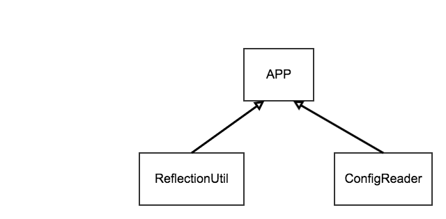
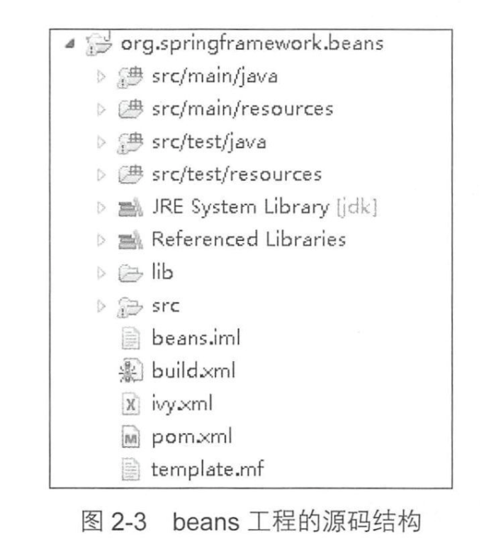
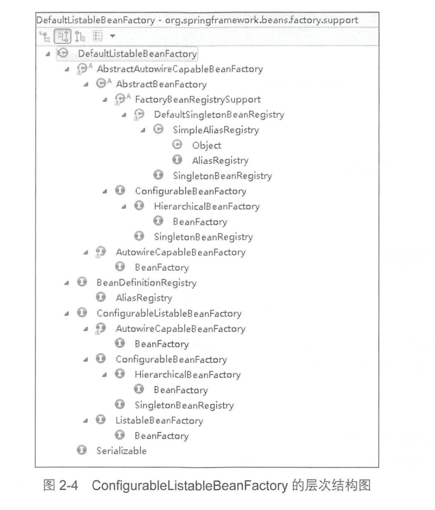
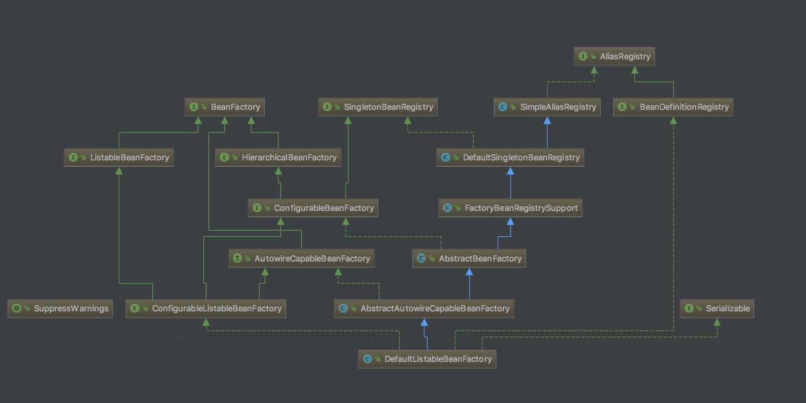
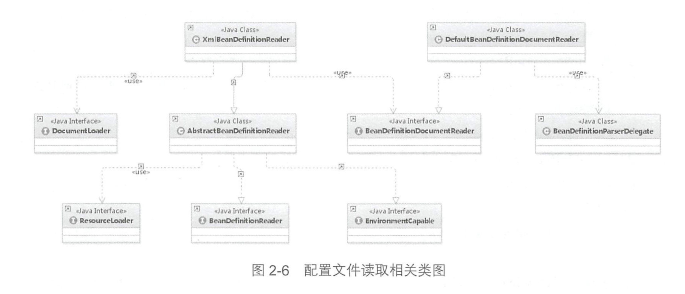
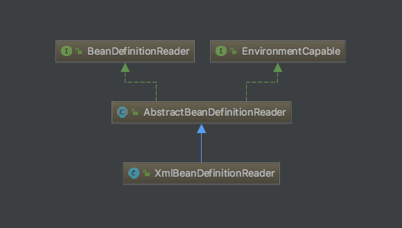
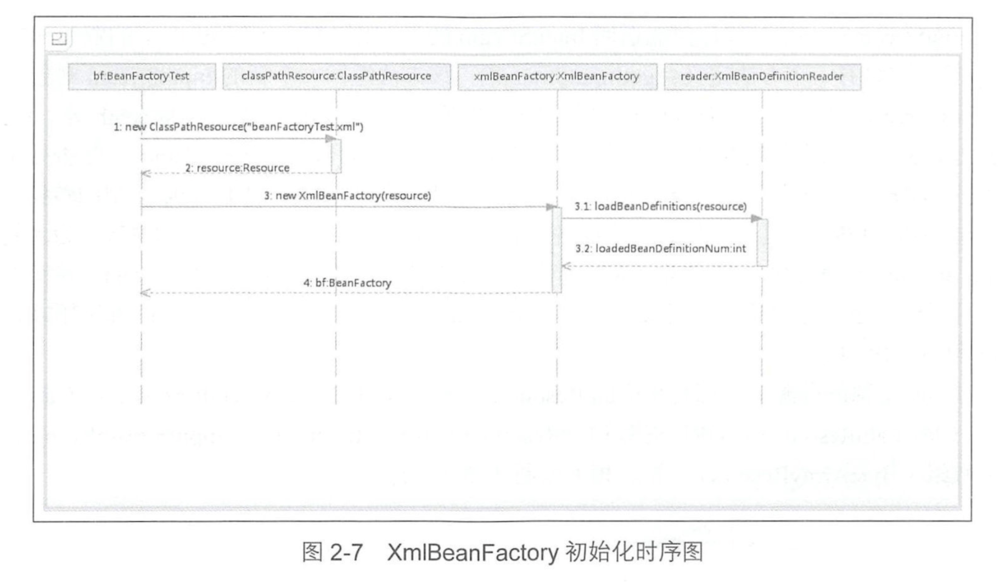
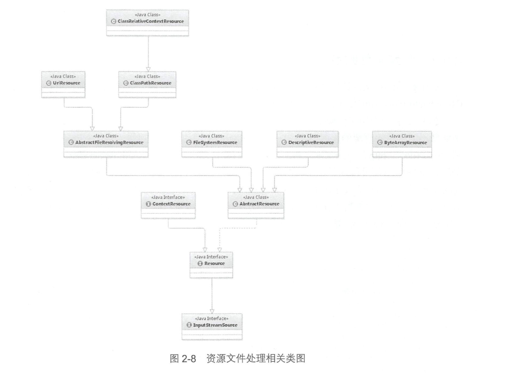
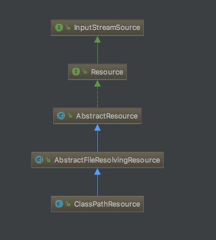
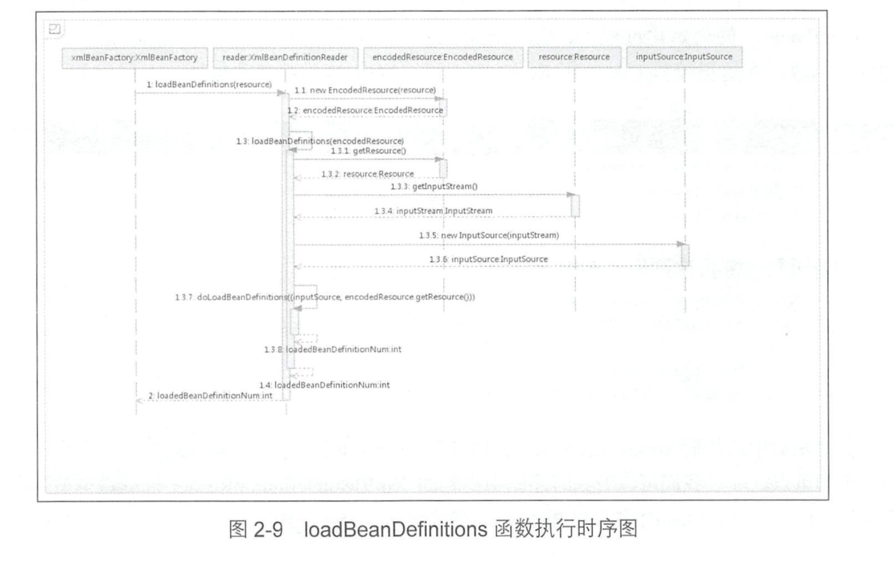

第 2 章 容器的基本实现
====

## 2.1 容器的基本用法
#### 用了这么久的 spring,你知道容器的基本用法是什么样么？
让我们先来看一个容器的使用案例。

> 对应的 JavaBean 代码
> 
> ``` java
> public class MyTestBean {
> 
>     private String testName = "testName";
> 
>     public String getTestName() {
>         System.out.println("getTestName");
>         return testName;
>     }
> 
>     public void setTestName(String testName) {
>         this.testName = testName;
>     }
> 
> }
> ```
> 
> 对应的配置文件:
>  
> ``` xml
> <?xml version="1.0" encoding="UTF-8"?>
> <beans xmlns="http://www.springframework.org/schema/beans"
>        xmlns:xsi="http://www.w3.org/2001/XMLSchema-instance"
>        xsi:schemaLocation="http://www.springframework.org/schema/beans
>       http://www.springframework.org/schema/beans/spring-beans.xsd">
> 
>     <!— 创建 bean—>
>     <bean id="myTestBean" class="com.alan.yx.springRevealed.chap2.src.main.java.introduction01.MyTestBean">
>     </bean>
> </beans>
> ```
> 
> 测试代码:
> 
> ```
> @RunWith(SpringRunner.class)
> @SpringBootTest
> public class MyTestBeanTest {
> 
>     @Test
>     public void test(){
>         BeanFactory bf = new ClassPathXmlApplicationContext("myTestBean.xml");
>         MyTestBean myTestBean = (MyTestBean)bf.getBean("myTestBean");
>         assertThat(myTestBean.getTestName(), Is.is("testName"));
>     }
> }
> ```

上面的代码很简单，但是你有没有想过，这样一段简单的代码( test 中)执行了什么样的逻辑呢？这个执行的流程是什么样的呢？

> 如果你没有了解过 spring 的原理，可能一时半会儿不知道从什么地方开始分析，废话少说，让我们上车，开启 spring 源码之路。

## 2.2 功能分析

#### 上面这段代码都有哪些功能呢？

作为一名 spring 老司机，我想上面那段代码，你大概能猜出来有哪些功能:

> * 读取配置文件 myTestBean.xml 
> 
> * 根据 myTestBean.xml 中的配置找到对应的类的配直，并实例化 。
> 
> 	> (要将这个 xml “转化”为咱们平时熟悉的 bean 对象,这样才方便我们后续处理嘛)
> 
> * 调用实例化后的实例

为了让你理解的更加清晰，最简单的 spring 功能架构就下面这张图所示，可以完成我们想要的功能:

<div align="center">  </div><br>

#### 要完成这些功能，需要哪些类来支持呢？

可见，想要达到目的，至少需要 3个类:

* ConfigReader:用于读取及验证自己的配置文件。

	> 我们要用配直文件里面的东西，当然先要读取，然后放在内存中。spring 固然强大，但是“巧妇难为无米之炊”嘛！
	
* ReflectionUtil :用于根据配置文件中的配置进行反射实例化。 

	> 比如在上例中 myTestBean.xml 出现的 <bean id=”myTestBean” class=”xxxxx.MyTestBean"/>，我们就可以根据bean.MyTestBean 进行实例化。

* App:用于完成整个逻辑的串联

	> 这个部分，你可以想象一下一个摩托车厂，将来自世界各地的零件组装成一辆摩托车。

## 2.4 spring 的结构组成

一个比较推荐阅读源码的方式，就是通过**跟着示例操作一遍**。

> 好吧，我承认大多数时候会绕来绕去 (毕竟这么多年的积淀，封装得让人头晕也正常嘛)，最后都不知道绕哪里去了，但是通过一个思路分析，再结合流程图，就会清晰很多。

### 2.4.1 beans 包的层级结构
#### 你了解过 beans 包的层级结构吗？

让我们先来看看整个 beans 工程的源码结构，如图所示:

<div align="center">  </div><br>

beans 包中的各个源码包的功能如下：

* src/main/java 用于展现 Spring 的主要逻辑 
* src/main/resources 用于存放系统的配置文件 
* src/test/iava 用于对主要逻辑进行单元测试 
* src/test/resources 用于存放测试用的配置文件

### 2.4.2 核心类介绍

我们在展示源码分析之前，有必要先对核心的一些类有所认识，不要一开始就钻进到 “浩如烟海”的源码当中去，所谓 “打蛇妖打七寸”，让我们先看看这个“七寸”在哪里。

### 1. DefaultListableBeanFactory

XmlBeanFactory 继承自 DefaultListableBeanFactory，而 **DefaultListableBeanFactory 是整个 bean 加载的核心部分**，是 Spring 注册及加载 bean 的默认实现。

而对于 XmlBeanFactory 与 DefaultListableBeanFactory 不同的地方：其实是在 XmlBeanFactory 中使用了自定义的 XML 读取器 XmlBeanDefinitionReader，实现了个性化的 BeanDefinitionReaderi卖取， DefaultListableBeanFactory 继承了 AbstractAutowireCapableBeanFactory 并实现了 ConfigurableListableBeanFactoy 以及 BeanDefinitionRegistry 接口 。 图 2-4 是 ConfigurableListableBeanFactory 的层次结构图，图 2-5 是相关类图 。

<div align="center">  </div><br>

<div align="center">  </div><br>

从上面这张图可以从整体的角度了解 DefaultListableBeanFactory 的脉络，暂时不熟悉也不要慌，后面会“抽丝剥茧”地逐一分析，此处先了解一下图中各个类的作用。

* AliasRegistry: 定义对 alias 的简单增删改等操作。
* SimpleAliasRegistry: 主要用 map 作为 alias 的缓存，并对 AliasRegistry 接口进行实现。

	> 你要是之前读过源码，会发现 spring 很多的地方用 map 进行缓存，比如存在并发的场景会用 ConcurrentHashMap。

* SingletonBeanRegistry： 定义对单例的注册和获取。

* DefaultSingletonBeanRegistry：对接口 SingletonBeanRegistry 接口的实现。

* FactoryBeanRegistrySupport: 在 DefaultSingletonBeanRegistry 基础上增加了对 FactoryBean 的特殊处理器。 

	> +=======================+=======================-
	
* BeanFactory：定义获取 bean 以及 bean 的各种属性(类型、别名等)。

* HierarchicalBeanFactory: 继承 BeanFactory，也就是在 BeanFactory 基础上增加了 对 parentFactory 的支持。

* BeanDefinitionRegistry：定义对 BeanDefinition 的各种增删改操作。

* ConfigurableBeanFactory： 提供配置 Factory 的各种方法。

* ListableBeanFactory： 根据各种条件获取 bean 的配置清单。

	> +=======================+=======================-

* AbstractBeanFactory： 综合 FactoryBeanRegistrySupport 和 ConfigurableBeanFactory 的功能。

	> 其实实现的方式就是 继承了 FactoryBeanRegistrySupport 类，同时实现了 ConfigurableBeanFactory 接口。
	>
	> 毕竟 java 当中没有多继承的概念，所以通过这种方式“集成功能”，

* AutowireCapableBeanFactory：提供创建 bean、自动注入、初始化以及应用 bean 的后处理器（初始化前和后）。

* AbstractAutowireCapableBeanFactory：综合 AbstractBeanFactory 并对接口 AutowireCapableBeanFactory 接口进行实现。

* ConfigurableListableBeanFactory: BeanFactory 配置清单，指定忽略类型及接口等。

* DefaultListableBeanFactory：综合上面所有的功能，主要是对 bean 注册后的处理。

> 看着这一个核心类的脉络就已经这么复杂，是不是感觉有点开始“迷糊”了，别着急，我第一次看的时候和你感受一样，先有个整体映象，后面再来“啃”这块硬骨头。

XmlBeanFactory 对 DefaultListableBeanFactory 类进行了扩展，主要用于从 XML 文档中读 取 BeanDefinition，对于注册及获取 bean 都是使用从父类 DefaultListableBeanFactory 继承的方法去实现的。

而唯独与父类不同的个性化实现就是增加了 XmlBeanDefinitionReader 类型的 reader 属性。在 XmlBeanFactory 中主要使用 reader 属性对资源文件进行读取和注册。

### 2. XmlBeanDefinitionReader

XML 配置文件的读取是 Spring 巾重要 的功能 ，因为 Spring 的大部分功能都是以配置作为 切入，点的，那么我们可以从 XmlBeanDefinitionReader中梳理一下资源文件读取、解析及注册的 大致脉络，首先我们看看各个类的功能 。

* ResourceLoader: 定义资源加载器，主要应用于根据给定的资源文件地址返回对应的 Resource。
* BeanDefinitionReader: 主要定义资源文件读取并转换为 BeanDefinition 的各个功能 。
* EnvironmentCapable: 定义获取 Environment 方法 。
* DocumentLoader: 定义从资源、文件加载到转换为 Document 的功能 。 
* AbstractBeanDefinitionReader: 对 EnvironmentCapable、 BeanDefinitionReader 类定义的功能进行实现 。
* BeanDefinitionDocumentReader :定义读取 Docuemnt 并注册 BeanDefinition 功能。
* BeanDefinitionParserDelegate: 定义解析 Element 的各种方法 。 

通过以上的功能，我们可以尝试梳理一下整个 XML 配置文件读取的大致流程，如图 2-6 所示:

<div align="center">  </div><br>

<div align="center">  </div><br>

XmlBeanDifinitionReader 中主要包含以下几步的处理:

1. 通过继承向 AbstractBeanDefinitionReader中的方法，来使用 ResourLoader将资源文件路径转换为对应的 Resource文件。
2. 通过 DocumentLoader 对 Resource 文件进行转换，将 Resource 文件转换为 Document 文件。
3. 通过实现接口 BeanDefinitionDocumentReader 的 DefaultBeanDefinitionDocumentReader 类对 Document进行解析，并使用 BeanDefinitionParserDelegate 对 Element 进行解析。

### 2.5 容器的基础 XmlBeanFactory

通过上面的介绍，我们对 spring 容器的功能有了大概的了解，好吧，你可能会说，我还是很迷糊啊。没关系，我们接下来去探索一下每个步骤的实现。接下来，我们先对下面的代码进行分析:

	BeanFactory bf = new XmlBeanFactory(new ClassPathResource("myTestBean.xml"));

为了帮助你有个更加清晰的认识，我们先看下 XmlBeanFactory 的初始化时序图的处理逻辑:

<div align="center">  </div><br>

时序图从 MyTestBeanTest 测试类开始:

- 首先调用 ClassPathResource 的构造函数来构造 Resource 资源文件的实例对象，这样后续的资源处理就可以用 Resource 提供各种服务操作了。
- 有了 Resource 就可以进行 XmlBeanFactory 的初始化了，再此之前，我们来看看 Resource 是如何封装的吧。
	
	> 毕竟后续要用 Resource 进行各种操作，我们有必要先来揭开它的神秘“面纱”。

#### 2.5.1 配置文件封装

> 从上面可以看出，Spring 的配置文件读取是通过 ClassPathResource 进行封装的，如 new ClassPathResource (”myTestBean.xml")，那么 ClassPathResource 完成了什么功能呢?

#### 为什么 spring 要对内部使用的资源用 Resource 接口封装底层资源？

在 Java 中，将不同来源的**资源抽象成 URL**，通过**注册不同的 handler( URLStreamHandler ) 来处理不同来源的资源的读取逻辑**。

一般 handler 的类型使用不同前缀(协议， Protocol )来识别，如`“file:”“http:” “jar:”`等，然而 URL 没有默认定义相对 Classpath 或 ServletContext 等资源的 handler，虽然可以注册自己的 URLStreamHandler来解析特定的 URL前缀(协议 )， 比如 “classpath:”，然而这需要了解  URL 的实现机制，而且 URL 也没有提供基本的方法，如检查当前资源是否存在、检查当前资源是否可读等方法。 

> 因此 Spring 对其内部使用到的资源实现了自己的抽象结构: Resource 接口封装底层资源 。

> ``` java
> public interface InputStreamSource {
> 
> 	InputStream getInputStream() throws IOException;
> 
> }
> 
> public interface Resource extends InputStreamSource {
> 	// 方法参见源码
> }
> 
> ```

结合上面的源码，InputStreamSource 可以封装任何可以返回 InputStream 的类，比如 File、ClassPath 下的资源和 Byte Array等等。而且它也很直接，只有一个方法  getInputStream()，返回一个新的 InputStream 对象。

#### Resource 接口在封装资源上做了什么事？
Resource 接口抽象类所有 spring 内部使用到的底层资源: File、ClassPath、URL 等。

- 它定义了 3 个判断当前资源状态的方法: 存在性(exist)、可读性(isReadable)、是否处于打开状态(isOpen)
- 提供了不同资源到 File、ClassPath、URL 类型的转换，以及获取 lastModified 属性、文件名等方法
- 提供了基于当前资源创建一个相对资源的方法 createRelative
- 错误处理中需要打印出错的资源文件，有 getDescription() 打印错误消息

> 现在你知道了吧，所有你要用到的**物理资源**都是可以在这里开始被封装的。

不同的资源文件有对应的实现：文件( FileSystemResource )、 Classpath 资源( ClassPathResource )、 URL 资源( UrlResource )、 InputStream 资源( InputStreamResource )、 Byte 数组( ByteArrayResource )等 。相关类图如图所示 

<div align="center">  </div><br>

<div align="center">  </div><br>

> 日常的开发中，资源文件的加载我们也经常遇到，比如:
> 
> 		Resource resource = new ClassPathResource("testBean.xml");

#### 你知道 Resource 接口怎么实现的么？

Resource 接口的实现，其实非常简单的， 以 getlnputStream 为例， ClassPathResource 巾的实现方式便是通过 class 或者 classLoader 提供的底层方法进行调用，而对于 FileSystemResource 的实现其实更简单，直接使用 FileInputStream 对文件进行实例化。

> ``` java
> ClassPathResource
> 		if (this.clazz != null) {
> 			is = this.clazz.getResourceAsStream(this.path);
> 		}
> 		else if (this.classLoader != null) {
> 			is = this.classLoader.getResourceAsStream(this.path);
> 		}	
> ```
> 
> ``` java
> FileInputStream
> 		public InputStream getInputStream() throws IOException {
> 		try {
> 			return Files.newInputStream(this.filePath);
> 		}
> 		catch (NoSuchFileException ex) {
> 			throw new FileNotFoundException(ex.getMessage());
> 		}
> 	}
> ```

在通过 Resource 相关类完成了对配置文件进行封装后，配置文件的读取工作就全权交给 XmlBeanDefinitionReader 来处理了 。

> @yx
> 
> 比如说你有一个文本阅读器，现在有很多的图书资源，但是他们有英文的、法语的、西班牙语的(各种资源形式)，通过一个翻译工具(Resource)将他们全部转成中文，之后的阅读工作( XmlBeanDefinitionReader )你就可以做了。

#### 到此为止， Resource 已经完成了配置文件的封装，是时候继续我们探索 XmlBeanFactory 的初始化过程了。

spring 当中有很多的构造函数，此处以使用 Resource 实例作为构造函数参数的方法为例分析，让我们先看下代码:

``` java
public XmlBeanFactory(Resource resource) throws BeansException {
		this(resource, null);
	}

public XmlBeanFactory(Resource resource, BeanFactory parentBeanFactory) throws BeansException {
		super(parentBeanFactory);
		this.reader.loadBeanDefinitions(resource);
	}
```

上面代码的重点在于 **reader.loadBeanDefinitions(resource)**，让我们好好分析一下。上面的时序图说的 XmlBeanDefinitionReader 加载数据就在这里完成的，但在 XmlBeanDefinitionReader 加载数据前还调用了父类的构造函数: super(parentBeanFactory), 跟踪到父类 AbstractAutowireCapableBeanFactory 的构造函数中：

> 这里是一路向上追踪直到代码终于有实际的含义:

```
/**
* Create a new AbstractAutowireCapableBeanFactory.
*/
public AbstractAutowireCapableBeanFactory() {
		super();
		ignoreDependencyInterface(BeanNameAware.class);
		ignoreDependencyInterface(BeanFactoryAware.class);
		ignoreDependencyInterface(BeanClassLoaderAware.class);
	}
```

看到这里，有必要提前剧透一下 ignoreDependencyInterface 方法。它主要功能是**忽略给定接口的自动装配功能**。

#### 那么为什么这么做？目的和效果是什么呢？

举个例子来说明下: 

当 A 中有属性 B，那么当 Spring 在获取 A 的 Bean 的时候如果其属性 B还没有初始化，那么 Spring 会自动初始化 B，这也是Spring 提供的一个重要特性。 

但是，在某些情况下， B 不会被初始化，其中的一种情况就是 B 实现了 BeanNameAware 接口。**Spring 中是这样介绍的: 自动装配时忽略给定的依赖接口**，典型应用是通过其他方式解析 Application 上下文并注册依赖，类似于 BeanFactory 通过 BeanFactoryAware 进行注入或者 ApplicationContext 通过 ApplicationContextAware 进行注入 。

> 这段话有点绕，自动装配时忽略给定的依赖接口，其实就是通过自动装配这种方式，需要忽略给定接口，就好像一个 JavaBean 实现了 BeanFactoryAware 之后，就已经注入到了 BeanFactory 当中，而不再是显示的 new 出来然后再放到容器中。

#### 2.5.2 加载 Bean

上面提到了 XmlBeanFactory 构造函数中调用了 XmlBeanDefinitionReader 的 reader 属性提供的方法 reader.loadBeanDefinitions(resource)，这一句代码就是整个资源加载的切入点。

> spring 之旅一上车就可以感觉到，路途有点颠簸也不是一帆风顺，终于我们找到一个切入点，废话少说，开始啦。

<div align="center">  </div><br>

##### 1.准备工作
看到上面的这张时序图才知道 spring "绕"不是浪得虚名，比如加载 XML 文档和解析注册 Bean，一直在在做准备工作。顺着这张图让我们来分析一下到底这么复杂地在准备什么？

1. **封装资源文件**。 当 进入 XmlBeanDefinitionReader 后首先对参数 Resource 使用 EncodedResource类进行封装。
2. **获取输入流**。 从 Resource 中获取对应的 InputStream 并构造 InputSource。
3. 通过构造的 InputSource 实例和 Resource 实例继续调用函数 doLoadBeanDefinitions。

##### 2.我们来看一下 doLoadBeanDefinitions 函数具体的实现过程 。

```
@Override
public int loadBeanDefinitions(Resource resource) throws BeanDefinitionStoreException {
	return loadBeanDefinitions(new EncodedResource(resource));
}
```

这里面的 EncodedResource 是做什么的？从名字可以大致猜测出，主要是用于处理资源文件编码的。其主要的逻辑体现在 getReader() 中，当设置了编码属性时，spring 会使用相应的编码作为输入流的编码。

> 看到这里，有没有联想到配置的 xml 文件中，有时我们会指定字符编码，此处就可以解析到了。
> 
> 始终记住，不论 xml 文件“千奇百怪”，终究是要解析为代码处理的。

```
		public Reader getReader() throws IOException {
		if (this.charset != null) {
			return new InputStreamReader(this.resource.getInputStream(), this.charset);
		}
		else if (this.encoding != null) {
			return new InputStreamReader(this.resource.getInputStream(), this.encoding);
		}
		else {
			return new InputStreamReader(this.resource.getInputStream());
		}
	}
```

上面代码构造了一个有编码( encoding )或者字符集( charset )的 InputStrearnReader。当构造好 encodedResource 对象后，再次转入了可复用的方法 loadBeanDefinitions(new EncodedResource(resource))。

这个方法的内部才是真正的数据准备阶段，对应了时序图的逻辑:

``` java
XmlBeanDefinitionReader:
public int loadBeanDefinitions(EncodedResource encodedResource) throws BeanDefinitionStoreException {
		Assert.notNull(encodedResource, "EncodedResource must not be null");
		if (logger.isTraceEnabled()) {
			logger.trace("Loading XML bean definitions from " + encodedResource);
		}
		
		//  通过属性来记录已经加载的资源
		Set<EncodedResource> currentResources = this.resourcesCurrentlyBeingLoaded.get();
		if (currentResources == null) {
			currentResources = new HashSet<>(4);
			this.resourcesCurrentlyBeingLoaded.set(currentResources);
		}
		if (!currentResources.add(encodedResource)) {
			throw new BeanDefinitionStoreException(
					"Detected cyclic loading of " + encodedResource + " - check your import definitions!");
		}
		try {
			// 从 encodedResource 获取已经封装的 Resource 对象，并再次从 Resource 获取其中的 inputStream
			InputStream inputStream = encodedResource.getResource().getInputStream();
			try {
				// InputSource 这个类并不来自于 Spring ，它的全路径是 org.xml.sax.InputSource
				InputSource inputSource = new InputSource(inputStream);
				if (encodedResource.getEncoding() != null) {
					inputSource.setEncoding(encodedResource.getEncoding());
				}
				// **进入真正的核心逻辑部分**
				return doLoadBeanDefinitions(inputSource, encodedResource.getResource());
			}
			finally {
				// 关闭输入流（见个人联想）
				inputStream.close();
			}
		}
		catch (IOException ex) {
			throw new BeanDefinitionStoreException(
					"IOException parsing XML document from " + encodedResource.getResource(), ex);
		}
		finally {
			currentResources.remove(encodedResource);
			if (currentResources.isEmpty()) {
				this.resourcesCurrentlyBeingLoaded.remove();
			}
		}
	}
```

> 顺带插一句，jdk1.7 之后 try-with-resource 的方式来处理资源打开的情况更佳

「小结一下」: 我们再次整理数据准备阶段的逻辑:

- 首先对传入的 resource 参数做封装，目的是考虑到 Resource 可能存在**编码要求**的情况；
- 其次，通过 SAX 读取 XML 文件的方式来准备 InputSource 对象；
- 最后将准备的数据通过参数传入真正的核心处理部分 doLoadBeanDefinitions(inputSource, encodedResource.getResource())。

##### 3.现在是时候看一下 doLoadBeanDefinitions 具体的实现了 。

``` java
XmlBeanDefinitionReader:
protected int doLoadBeanDefinitions(InputSource inputSource, Resource resource)
			throws BeanDefinitionStoreException {

		try {
			Document doc = doLoadDocument(inputSource, resource);
			int count = registerBeanDefinitions(doc, resource);
			if (logger.isDebugEnabled()) {
				logger.debug("Loaded " + count + " bean definitions from " + resource);
			}
			return count;
		}
		catch (BeanDefinitionStoreException ex) {
			throw ex;
		}
		catch (SAXParseException ex) {
			throw new XmlBeanDefinitionStoreException(resource.getDescription(),
					"Line " + ex.getLineNumber() + " in XML document from " + resource + " is invalid", ex);
		}
		catch (SAXException ex) {
			throw new XmlBeanDefinitionStoreException(resource.getDescription(),
					"XML document from " + resource + " is invalid", ex);
		}
		catch (ParserConfigurationException ex) {
			throw new BeanDefinitionStoreException(resource.getDescription(),
					"Parser configuration exception parsing XML from " + resource, ex);
		}
		catch (IOException ex) {
			throw new BeanDefinitionStoreException(resource.getDescription(),
					"IOException parsing XML document from " + resource, ex);
		}
		catch (Throwable ex) {
			throw new BeanDefinitionStoreException(resource.getDescription(),
					"Unexpected exception parsing XML document from " + resource, ex);
		}
	}
```

> 从这段代码中我们可以学到:
> 
> - logger.isDebugEnabled() 方式在开发中的调试技巧
> - try-catch 是从小到大逐级捕获的，这对于我们平时不分情况，一股脑地 try-catch 是很好的启发。

在上面冗长的代码先忽略掉异常的代码，其实只做了两件事，这两件事的每一件都必不可少:

* 加载 XML 文件，并得到对应的 Document。===> doLoadDocument(inputSource, resource)
* 根据返回的 Document 注册 Bean 信息。===> registerBeanDefinitions(doc, resource)

### 2.6 获取 XML 的验证模式

> 了解 XML 文件的读者都应该知道 XML 文件的验证模式保证了 XML 文件的正确性，而比 较常用的验证模式有两种: DTD 和 XSD。

这一部分暂时个人兴趣不大，如果有需要再来研究，小伙伴们有兴趣可以自己去研究。

> 其实主要做的就是 验证 XML 文件的正确性，毕竟要是有人一顿“乱写”(比如随便输入点什么内容)，企图想要让 spring 给他加载出 bean 对象，是不是要给他提前校验出来。(当然越早发现问题越好)

### 2.7 获取 Document

经过了验证模式准备的步骤之后，就可以进行 Document 加载啦！

同样 XmlBeanFactoryReader 类对于文档的读取并没有亲力亲为，而是**委托**给了 DocumentLoader 去执行，这里的 DocumentLoader 是个接口，而真正调用的是 DefaultDocumentLoader，解析代码如下:

> 这就好像一个高效的企业家，不可能所有的事情都亲力亲为，专业的事情是交给专业的职业经理人(DocumentLoader)，而不是自己包揽所有的事情。
> 
> 其实这也符合软件设计接耦的原则，大家各司其职，完成一个复杂的系统。

``` java
DefaultDocumentLoader
	public Document loadDocument(InputSource inputSource, EntityResolver entityResolver,
			ErrorHandler errorHandler, int validationMode, boolean namespaceAware) throws Exception {

		DocumentBuilderFactory factory = createDocumentBuilderFactory(validationMode, namespaceAware);
		if (logger.isTraceEnabled()) {
			logger.trace("Using JAXP provider [" + factory.getClass().getName() + "]");
		}
		DocumentBuilder builder = createDocumentBuilder(factory, entityResolver, errorHandler);
		return builder.parse(inputSource);
	}
```	

- 这里也是首先创建 DocumentBuilderFactory
- 再通过 DocumentBuilderFactory创建 DocumentBuilder
- 进而解析 inputSource 来返回 Document对象

> 这里值得一提的是 EntityResolver:
> 
> 在 loadDocument 方法中涉及一个参数 EntityResolver, 什么是 EntityResolver?
> 
> 官网这样解释: 如果 SAX 应用程序需要实现自定义处理外部实体，则必须实现此接口并使用 setEntityResolver 方法向 SAX 驱动器注册一个实例。
> 
> 也就是说，对于解析一个 XML, SAX 首先读取该 XML 文档上的声明，根据声明去寻找相应的 DTD定义，以便对文档进行一个验证。默认的寻找规则， 即通过网络(实现上就是声明的 DTD 的 URI 地址)来下载相应的 DTD 声明，并进行认证。
> 
> EntityResolver 的作用: 项目本身就可以提供一个如何寻找 DTD 声明的方法，即由程序来实现寻找 DTD 声明的过程，比如我们将 DTD 文件放到项目中某处 ，在实现时直接将此文档读取并返回给 SAX 即可。这样就避免了通过网络来寻找相应的声明。（万一网络出现问题，就不会因为）

### 2.8 解析及注册 BeanDedinitions

经过上面的操作， spring 已经把文件转换为 Document，接下来就是解析及注册 bean 啦。

让我们继续上面的分析，当程序拥有了 XML 文档文件的 Document 实例对象时，就会引入下面的方法。

> 你可以想象一下你定义的 xml 文件，有很多的 <bean> 标签，我们想要的目的就是把这些标签对应的部分转换为 spring 中的 bean 对象。

``` java
XmlBeanDefinitionReader:
public int registerBeanDefinitions(Document doc, Resource resource) throws BeanDefinitionStoreException {
		// 使用 BeanDefinitionDocumentReader 实例化 BeanDefinitionDocumentReader
		BeanDefinitionDocumentReader documentReader = createBeanDefinitionDocumentReader();
		// 在实例化 BeanDefinitionReader 是会将 BeanDefinitionRegistry 传入，默认使用继承自 DefaultListableBeanFactory 的子类
		// 记录注册前的 BeanDefinition 个数
		int countBefore = getRegistry().getBeanDefinitionCount();
		// 加载及注册 bean
		documentReader.registerBeanDefinitions(doc, createReaderContext(resource));
		// 记录本次加载的 BeanDefinition 个数
		return getRegistry().getBeanDefinitionCount() - countBefore;
	}
```

这里的参数 doc 是通过上一节 loadDocurnent 加载转换出来的。这个方法中很好地应用了面向对象中`单一职责的原则`，将逻辑处理委托给单一的类进行处理，而这个逻辑处理类就是 BeanDefinitionDocrnnentReader。 

BeanDefinitionDocumentReader 是一个接口，而实例化的工作是在 createBeanDefinitionDocumentReader() 中完成的，而通过此方法， BeanDefinitionDocumentReader 真正的类型其实已经是 DefaultBeanDefinitionDocumentReader 了，进入查看一下源码，会看到在 DefaultBeanDefinitionDocument­Reader 后，发现这个方法的重要目的之一就是**提取 root，以便于再次将 root 作为参数继续 BeanDefinition 的注册。**

```
DefaultBeanDefinitionDocument­Reader:
public void registerBeanDefinitions(Document doc, XmlReaderContext readerContext) {
		this.readerContext = readerContext;
		Element root = doc.getDocumentElement();
		doRegisterBeanDefinitions(root);
	}
```

> 到这里，实际上是将 Document 转化为了 Element（元素），从直观和代码可以看出，这一步步看上去很绕，实际上是为了对其进行进一步的抽丝剥茧和转化，以便转换为我们的目标———bean。

经过“山路十八弯”，我们终于到了核心逻辑的底部 doRegisterBeanDefinitions(root),是不是有一种看到黎明前光明的感觉，没错，希望就在眼前。

在此之前一直是 XML 加载解析的准备阶段，到了 doRegisterBeanDefinitions(root) 算是真正开始解析了，这就我们“朝思暮想”的核心部分。

``` java
DefaultBeanDefinitionDocumentReader:
protected void doRegisterBeanDefinitions(Element root) {
		// 专门处理解析
		BeanDefinitionParserDelegate parent = this.delegate;
		this.delegate = createDelegate(getReaderContext(), root, parent);

		if (this.delegate.isDefaultNamespace(root)) {
			// 处理 profile 属性(这个跟应用的环境有关)
			String profileSpec = root.getAttribute(PROFILE_ATTRIBUTE);
			if (StringUtils.hasText(profileSpec)) {
				String[] specifiedProfiles = StringUtils.tokenizeToStringArray(
						profileSpec, BeanDefinitionParserDelegate.MULTI_VALUE_ATTRIBUTE_DELIMITERS);
				// We cannot use Profiles.of(...) since profile expressions are not supported
				// in XML config. See SPR-12458 for details.
				if (!getReaderContext().getEnvironment().acceptsProfiles(specifiedProfiles)) {
					if (logger.isDebugEnabled()) {
						logger.debug("Skipped XML bean definition file due to specified profiles [" + profileSpec +
								"] not matching: " + getReaderContext().getResource());
					}
					return;
				}
			}
		}

		// 解析前处理，留给子类实现
		preProcessXml(root);
		parseBeanDefinitions(root, this.delegate);
		// 解析后处理，留给子类实现
		postProcessXml(root);

		this.delegate = parent;
	}
```

通过阅读上面的代码我们看到了处理的流程:

- 首先是对 profile 的处理，然后开始进行解析，可是 当我们点进去 preProcessXml(root) 或者 postProcessXml(root) 发现代码是空的。

#### 既然方法是空的写着还有什么用呢?

这就涉及到面向对象设计方法中常说的一句话: **一个类要么是面向继承的设计的，要么就用 final 修饰**。

在 DefaultBeanDefinitionDocumentReader 中并没有用 final 修饰，所以它是面向继承而设计的。**这两个方法正是为子类而设计的**。

> 如果你之前有了解过设计模式，可以很快想到这是**`模版方法模式`**，如果继承自 DefaultBeanDefinitionDocumentReader 的子类需要在 Bean 解析前后做一些处理的话，那么只需要`重写`这两个方法就可以了。
> 
> 通过预留一个空方法的实现，可以给子类留下扩展点，是不是设计很灵活，这也是我们平时可以学到的。

#### 2.8.1 profile 属性的使用

查看上面的代码，我们注意到在注册 Bean 的最开始是对 `PROFILE_ATTRIBUTE` 属性的解析。

我想你平时肯定遇到过环境的问题，让我们先了解一下这个属性的用法吧，这是官方的示例代码:

```
<beans profile="dev"
    xmlns="http://www.springframework.org/schema/beans"
    xmlns:xsi="http://www.w3.org/2001/XMLSchema-instance"
    xmlns:jdbc="http://www.springframework.org/schema/jdbc"
    xsi:schemaLocation="...">

    <jdbc:embedded-database id="dataSource">
        <jdbc:script location="classpath:com/bank/config/sql/schema.sql"/>
        <jdbc:script location="classpath:com/bank/config/sql/test-data.sql"/>
    </jdbc:embedded-database>
</beans>

<beans profile="production"
    xmlns="http://www.springframework.org/schema/beans"
    xmlns:xsi="http://www.w3.org/2001/XMLSchema-instance"
    xmlns:jee="http://www.springframework.org/schema/jee"
    xsi:schemaLocation="...">

    <jee:jndi-lookup id="dataSource" jndi-name="java:comp/env/jdbc/datasource"/>
</beans>
```

集成到 Web环境中时，在 web.xml 中加入以下代码:

```
<context-param>
	<param-name>Spring.profiles.active</param-name>
	<param-value>dev</param-value>
</context-param>
```

有了这个特性我们就可以同时在配置文件中部署两套配置来适用于生产环境和开发环境，这样可以方便的进行切换开发、部署环境。比如最常用的就是更换不同的数据库。

> 比如你们公司在开发过程中有 dev、pro、test、uat 等环境，如果没有这个特性，每次环境一改你就要变更，不仅容易出错，是不是想一下就觉得很麻烦？
> 
> 这个最常用的就是在应用的部署环境中通过环境变量来获取。

了解了 profile 的使用再来分析代码会清晰得多：

首先程序会获取 beans 节点是否定义了 profile 属性，如果定义了则会需要到**环境变量**中去寻找，所以这里首先断言 environment 不可能为空，因为 profile 是可以同时指定多个的，需要程序对其拆分，并解析每个 profile 是都符合环境变量中所定义的，不定义则不会浪费性能去解析。

#### 2.8.2 解析并注册 BeanDefinition

好了，现在让我们看看在处理完 profile 之后， 怎么解析 BeanDefinition的吧！跟踪代码到 parseBeanDefinitions(root, this.delegate);

``` java
DefaultBeanDefinitionDocumentReader:
protected void parseBeanDefinitions(Element root, BeanDefinitionParserDelegate delegate) {
		// 对 bean 进行处理
		if (delegate.isDefaultNamespace(root)) {
			NodeList nl = root.getChildNodes();
			for (int i = 0; i < nl.getLength(); i++) {
				Node node = nl.item(i);
				if (node instanceof Element) {
					Element ele = (Element) node;
					if (delegate.isDefaultNamespace(ele)) {
						// 对 bean 进行处理
						parseDefaultElement(ele, delegate);
					} else {
						// 对 bean 进行处理（用户自定义）
						delegate.parseCustomElement(ele);
					}
				}
			}
		} else {
			// 对 bean 进行处理（用户自定义）
			delegate.parseCustomElement(root);
		}
	}
```

上面的代码很清晰，因为在 Spring 的 XML 配置里面有两大类 Bean 声明，一个是默认的，如:

	<bean id=”test” class=”test.TestBean”/>

另一类是用户自定义的:

	<tx:annotation-driven/>

对于这两种方式的读取及解析差别是非常大的：

- 如果采用 Spring 默认的配置，Spring 当然知道该怎么做 (毕竟一切尽在自己“掌握”)

- 但是如果是自定义的，那么就需要用户实现一些接口及配置了。 

对于根节点或者子节点如果是默认命名空间的话，则采用 parseDefaultElement 方法进行解析，否则使用delegate.parseCustomElement 方法对自定义命名空间进行解析。 

而判断是`默认命名空间`还是`自定义命名空间`的办法其实是使用 node.getNamespaceURI() 来获取命名空间，并与 Spring 中固定的命名空间 `http://www.springframework.org/scherna/beans` 进行比对。如果一致则认为是默认，否则就认为是自定义 。 

而对于默认标签解析与自定义标签解析我们将会在下一章中进行讨论。

> 备注：自定义标签解析这一块笔者暂时没有去研究，如果遇到有需要的场景再研究，优先研究 spring 默认的方式。
> 
> 毕竟 spring 是如此的庞大，要做到“面面俱到”不仅需要时间，也需要配套的知识做支撑。根据 “二八法则”，我们真正使用到的可能绝大多数是默认的实现，有兴趣的读者可以自行研究。