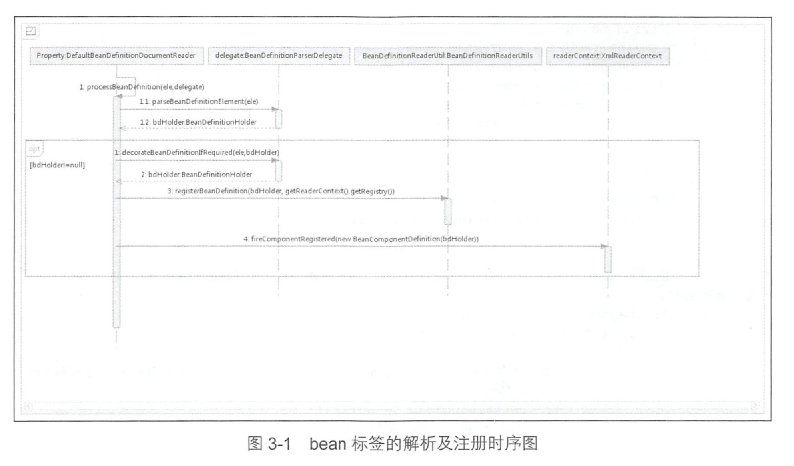
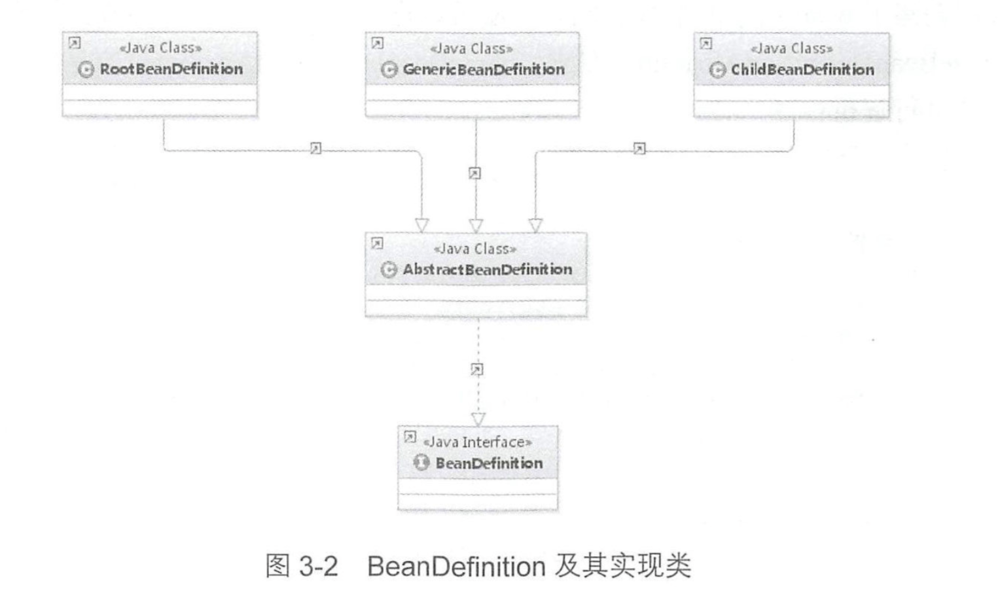

第 3 章 默认标签的解析
====

之前我们提到过 spring 中的标签包括默认的标签和自定义标签，这一站，让我们一起来看看的默认标签的风光吧～

> 还记得上一站咱们到过哪嘛，好吧，我想你可能已经忘记了，让我们再回去看一样，没错，就是 DefaultBeanDefinitionDocumentReader 的 doRegisterBeanDefinitions 方法，其中最后一个景点是 parseBeanDefinitions(root, this.delegate);

首先我们先来看本站核心函数 parseDefaultElement，方法中逻辑一目了然，分别对 4 种不同的标签 (import、alias、bean、beans) 做了不同的处理。

``` java
DefaultBeanDefinitionDocumentReader:
private void parseDefaultElement(Element ele, BeanDefinitionParserDelegate delegate) {
		// 对 import 标签的处理
		if (delegate.nodeNameEquals(ele, IMPORT_ELEMENT)) {
			importBeanDefinitionResource(ele);
		}
		// 对 alias 标签的处理
		else if (delegate.nodeNameEquals(ele, ALIAS_ELEMENT)) {
			processAliasRegistration(ele);
		}
		// 对 bean 标签的处理【最复杂最重要】
		else if (delegate.nodeNameEquals(ele, BEAN_ELEMENT)) {
			processBeanDefinition(ele, delegate);
		}
		// 对 beans 标签的处理
		else if (delegate.nodeNameEquals(ele, NESTED_BEANS_ELEMENT)) {
			// recurse
			doRegisterBeanDefinitions(ele);
		}
	}
```

## 3.1 bean 标签的解析及注册

我们知道 spring 最重要的管理目标是 bean， 所以这 4 种标签当中对 bean 标签的解析最重要也最复杂，本着“二八法则”和“擒贼先擒王”的原则，我们先来分析一下 bean 标签的解析，其他标签自然手到擒来，让我们进入 parseDefaultElement(ele, delegate)。

#### bean 标签的主要解析步骤是什么样的？

``` java
DefaultBeanDefinitionDocumentReader:
protected void processBeanDefinition(Element ele, BeanDefinitionParserDelegate delegate) {
		BeanDefinitionHolder bdHolder = delegate.parseBeanDefinitionElement(ele);
		if (bdHolder != null) {
			bdHolder = delegate.decorateBeanDefinitionIfRequired(ele, bdHolder);
			try {
				// Register the final decorated instance.
				BeanDefinitionReaderUtils.registerBeanDefinition(bdHolder, getReaderContext().getRegistry());
			}
			catch (BeanDefinitionStoreException ex) {
				getReaderContext().error("Failed to register bean definition with name '" +
						bdHolder.getBeanName() + "'", ele, ex);
			}
			// Send registration event.
			getReaderContext().fireComponentRegistered(new BeanComponentDefinition(bdHolder));
		}
	}
```

初次一看感觉一头雾水，逻辑不是特别清晰。大概的逻辑其实是这样的：

1.首先委托 BeanDefinitionParserDelegate 类的 parseBeanDefinitionElement 方法进行元素解析，返回 BeanDefinitionHolder 类型的实例 bdHolder，经过这个方法后，bdHolder 实例已经包含我们配置文件中配置的各种属性了，例如 class、name、id、alias之类的属性。

> 这里传进去的就是我们前面准备好的 Element，经过这个“委托人”一处理，就有了我们想要的配置文件中的各种属性。
> 
> BeanDefinitionHolder 的名字也很想形象，将各种属性“hold”住，很有意思吧。
 
2.当返回的 bdHolder 不为空的情况下若存在默认标签的子节点下再有自定义属性，还需要再次**对自定义标签进行解析**。

3.解析完成后，需要对解析后的 bdHolder 进行注册，同样，注册操作委托给了 Bean­DefinitionReaderUtils 的registerBeanDefinition 方法。

> 看到这个方法你就知道了，通过各种“委托”，各种处理其实是交给“别人”(bean)去做，自己其实主要掌握总体的步骤即可，“事必亲躬”可不是 spring 的风格。

4.最后发出响应事件，通知相关的监昕器，这个bean已经加载完成了。 配合时序图(见图 3-1 )，可能会更容易理解。

一图胜千言，让我们结合时序图来看下吧:

<div align="center">  </div><br>

### 3.1.1 解析 BeanDefinition（parseBeanDefinitionElement方法）

了解了总体的步骤，下面让我们一步步来“各个击破”。首先我们从元素解析及信息提取开始吧，也就是 `BeanDefinitionHolder bdHolder = delegate.parseBeanDefinitionElement(ele);`，进入 BeanDefinitionHolder 的 parseBeanDefinitionElement 方法瞧一瞧。

#### 对默认标签解析 BeanDefinition 的全过程是什么样的呢？

``` java
BeanDefinitionHolder:
public BeanDefinitionHolder parseBeanDefinitionElement(Element ele) {
		return parseBeanDefinitionElement(ele, null);
	}

// 解析 bean定义的元素(<bean>标签)
	@Nullable
	public BeanDefinitionHolder parseBeanDefinitionElement(Element ele, @Nullable BeanDefinition containingBean) {
		// 解析 id 属性
		String id = ele.getAttribute(ID_ATTRIBUTE);
		// 解析 name 属性
		String nameAttr = ele.getAttribute(NAME_ATTRIBUTE);

		// 分割 name 属性
		List<String> aliases = new ArrayList<>();
		if (StringUtils.hasLength(nameAttr)) {
			String[] nameArr = StringUtils.tokenizeToStringArray(nameAttr, MULTI_VALUE_ATTRIBUTE_DELIMITERS);
			aliases.addAll(Arrays.asList(nameArr));
		}

		String beanName = id;
		// 如果没有 id 属性，那就拿个别名来作为它的 beanName
		if (!StringUtils.hasText(beanName) && !aliases.isEmpty()) {
			beanName = aliases.remove(0);
			if (logger.isTraceEnabled()) {
				logger.trace("No XML 'id' specified - using '" + beanName +
						"' as bean name and " + aliases + " as aliases");
			}
		}

		if (containingBean == null) {
			checkNameUniqueness(beanName, aliases, ele);
		}

		AbstractBeanDefinition beanDefinition = parseBeanDefinitionElement(ele, beanName, containingBean);
		if (beanDefinition != null) {
			if (!StringUtils.hasText(beanName)) {
				try {
					// 如果不存在 beanName，那么根据 spring 中提供的命名规则为当前 bean 生成对应的 beanName
					if (containingBean != null) {
						beanName = BeanDefinitionReaderUtils.generateBeanName(
								beanDefinition, this.readerContext.getRegistry(), true);
					} else {
						beanName = this.readerContext.generateBeanName(beanDefinition);
						// Register an alias for the plain bean class name, if still possible,
						// if the generator returned the class name plus a suffix.
						// This is expected for Spring 1.2/2.0 backwards compatibility.
						String beanClassName = beanDefinition.getBeanClassName();
						if (beanClassName != null &&
								beanName.startsWith(beanClassName) && beanName.length() > beanClassName.length() &&
								!this.readerContext.getRegistry().isBeanNameInUse(beanClassName)) {
							aliases.add(beanClassName);
						}
					}
					if (logger.isTraceEnabled()) {
						logger.trace("Neither XML 'id' nor 'name' specified - " +
								"using generated bean name [" + beanName + "]");
					}
				} catch (Exception ex) {
					error(ex.getMessage(), ele);
					return null;
				}
			}
			String[] aliasesArray = StringUtils.toStringArray(aliases);
			return new BeanDefinitionHolder(beanDefinition, beanName, aliasesArray);
		}

		return null;
	}
```

> todo
> 
> 1.分割 name 属性是做什么？对应 bean 标签什么属性设置？

> ```
> <?xml version="1.0" encoding="UTF-8"?>
> <beans xmlns="http://www.springframework.org/schema/beans"
> 	xmlns:xsi="http://www.w3.org/2001/XMLSchema-instance"
> 	xmlns:p="http://www.springframework.org/schema/p"
> 	xsi:schemaLocation="http://www.springframework.org/schema/beans http://www.springframework.org/schema/beans/spring-beans.xsd">
> 
>   <bean id="compactDisc" class="soundsystem.BlankDisc">
>     <constructor-arg value="Sgt. Pepper's Lonely Hearts Club Band" />
>     <constructor-arg value="The Beatles" />
>   </bean>
>         
>   <bean id="cdPlayer" class="soundsystem.properties.CDPlayer">
>     <property name="compactDisc" ref="compactDisc" />
>   </bean>
> 
> </beans>
> ```

以上就是对默认标签解析的全过程了，看完之后是不是还是很困惑？

> 小贴士：
> 
> (这里有个小建议，由于单独看代码的变量名可能不是那么直观，你可以找一个bean 的 xml文件对照一起理解，这样便于在你的脑海中逐一映射上，上面我就随意给了一个示例)。

当然，对 Spring 的解析犹如洋葱剥皮一样， 一层一层地进行，尽管现在我们只能从上面的代码看到对属性 id 以及 name 的解析，但是很庆幸，思路我们至少已经了解了。 

在展开对属性的全面解析之前，Spring 在外层又做了一个当前层的功能架构，在当前层完成的主要工作包括如下内容:

1. 提取元素中的 id 以及 name 属性。
2. 进一步解析其他所有属性并统一封装至 GenericBeanDefinition 类型的实例中。
3. 如果检测到 bean 没有指定 beanName，那么使用默认规则为此 Bean 生成 beanName。
	
> (默认规则就是用类名，首字母小写)
> 
> 毕竟每一个 bean 在 spring 中是要有身份的，既然你“舍不得”指定名字，那只好给个默认名字了，去个“外号”也行。

4.将获取到的信息封装到 BeanDefinitionHolder 的实例中 。

#### 我们进一步地查看步骤 2 中对标签其他属性的解析过程。

```
// 解析 bean定义的元素(<bean>标签)
	@Nullable
	public AbstractBeanDefinition parseBeanDefinitionElement(
			Element ele, String beanName, @Nullable BeanDefinition containingBean) {

		this.parseState.push(new BeanEntry(beanName));

		String className = null;
		// 解析 class 属性
		if (ele.hasAttribute(CLASS_ATTRIBUTE)) {
			className = ele.getAttribute(CLASS_ATTRIBUTE).trim();
		}
		String parent = null;
		// 解析 parent 属性
		if (ele.hasAttribute(PARENT_ATTRIBUTE)) {
			parent = ele.getAttribute(PARENT_ATTRIBUTE);
		}

		try {
			// 创建用于承载属性的 AbstractBeanDefinition 类型的 GenericBeanDefinition
			AbstractBeanDefinition bd = createBeanDefinition(className, parent);

			// 硬编码解析默认 bean 的各种属性
			parseBeanDefinitionAttributes(ele, beanName, containingBean, bd);
			// 提取 description
			bd.setDescription(DomUtils.getChildElementValueByTagName(ele, DESCRIPTION_ELEMENT));

			// 解析元数据
			parseMetaElements(ele, bd);
			// 解析 lookup-method 属性
			parseLookupOverrideSubElements(ele, bd.getMethodOverrides());
			// 解析 replace-method 属性
			parseReplacedMethodSubElements(ele, bd.getMethodOverrides());

			// 解析构造函数参数
			parseConstructorArgElements(ele, bd);
			// 解析 property 子元素
			parsePropertyElements(ele, bd);
			// 解析 qualifier 子元素:用于消除相同 beanName 的歧义
			parseQualifierElements(ele, bd);

			bd.setResource(this.readerContext.getResource());
			bd.setSource(extractSource(ele));

			return bd;
		} catch (ClassNotFoundException ex) {
			error("Bean class [" + className + "] not found", ele, ex);
		} catch (NoClassDefFoundError err) {
			error("Class that bean class [" + className + "] depends on not found", ele, err);
		} catch (Throwable ex) {
			error("Unexpected failure during bean definition parsing", ele, ex);
		} finally {
			this.parseState.pop();
		}

		return null;
	}
```

到这次，bean 标签的所有属性，不论常用的还是不常用的我们都看到了。当然，尽管有些复杂的属性还需要进一步的解析，不过这一点也不会影响我们兴奋的心情(毕竟好不容易终于把那“难弄”的复杂的 xml 配置的属性逐一解析出来了)。 

> 其实这里解析的属性，就是我们可以在 xml 文件中定义的属性(除去这里的之外的属性，可见代码也是不支持滴)。

接下来，我们继续一些复杂标签属性的解析。

#### 3.1.1.1 创建用于属性承载的 BeanDefinition

#### 让我们总览一下 BeanDefinition
BeanDefinition 是一个接口，在 Spring 中有三种实现: RootBeanDefinition、 ChildBean­Definition 以及 GenericBeanDefinition。

这三种实现均继承了 AbstractBeanDefiniton ，其中 BeanDefinition 是配置文件<bean>元素标签在容器中的内部表示形式。 <bean>元素标签拥有 class、 scope、 lazy-init 等配置属性，BeanDefinition 则提供了相应的 beanClass、scope、lazyInit 属性， BeanDefinition和<bean>中的属性是-一对应的。

> @yx
> 
> 看到这里你应该能想象出来， xml 中的 <bean> 标签的每一个的属性都是和 BeanDefinition 一一对应的，没错，他们可以理解成“映射”上了。

其中 RootBeanDefinition是最常用的实现类，它对应一般性的 <bean> 元素标签，GenericBeanDefinition 是自 2.5 版本以后新加入的 bean 文件配置属性定义类，是一站式服务类。(各种操作应有尽有，给你“一条龙”的服务)

在配置文件中可以定义父`<bean>` 和子`<bean>` ，父` <bean>` 用 RootBeanDefinition 表示，而子 `<bean>`用 ChildBeanDefiniton 表示，而没有父`<bean>`的`<bean>`就使用 RootBeanDefinition 表示。AbstractBeanDefinition 对两者共同的类信息进行抽象。

> @yx
> 
> 无论是 jdk 源码还是 spring 源码，你总能看到很多的抽象类，对于那种存在 “is-a” 关系并且希望实现代码复用的类，抽象类是一个很不错的选择。

Spring 通过 BeanDefinition 将配置文件中的` <bean>` 配置信息转换为容器的内部表示，并将这些 BeanDefiniton 注册到 BeanDefinitonRegistry 中。Spring容器的 BeanDefinitionRegistry 就像是 Spring配置信息的内存数据库，主要是以 map 的形式保存，后续操作直接从 BeanDefinition­Registry 中读取配置信息。 

> @yx
> 
> BeanDefinitionRegistry 就像是一个 spring “内置数据库”，保存了所有的 BeanDefiniton，他就是一个“大管家”，把 BeanDefiniton 都存起来，等你要用的时候找他要。

它们之间的关系如图 3-2 所示。

<div align="center">  </div><br>

根据以上的内容可知，要解析属性首先要做的就是**创建用于承载属性的实例**，也就是创建 GenericBeanDefinition
类型的实例。 而代码 createBeanDefinition(className, parent)的作用就是实现此功能，接下来让我们看下代码吧。

``` java
BeanDefinitionParserDelegate:
protected AbstractBeanDefinition createBeanDefinition(@Nullable String className, @Nullable String parentName)
			throws ClassNotFoundException {

		return BeanDefinitionReaderUtils.createBeanDefinition(
				parentName, className, this.readerContext.getBeanClassLoader());
	}
```

``` java
BeanDefinitionReaderUtils:
public static AbstractBeanDefinition createBeanDefinition(
			@Nullable String parentName, @Nullable String className, @Nullable ClassLoader classLoader) throws ClassNotFoundException {

		GenericBeanDefinition bd = new GenericBeanDefinition();
		// parent 可能为空
		bd.setParentName(parentName);
		if (className != null) {
			if (classLoader != null) {
				// 如果 classLoader 不为空，则使用以传入的 classLoader 同一虚拟机加载类对象；否则只是记录 className
				bd.setBeanClass(ClassUtils.forName(className, classLoader));
			} else {
				bd.setBeanClassName(className);
			}
		}
		return bd;
	}
```

#### 3.1.1.2 解析各种属性
经过上一个步骤，我们已经创建好了 bean 信息的承载实例，现在我们可以进行 bean 信息的各种属性解析了。

首先，让我们进入 parseBeanDefinitionAttributes 方法，该方法是对 element 所有元素属性进行解析：

```
BeanDefinitionParserDelegate:
// Spring 完成对所有 bean 属性的解析
	public AbstractBeanDefinition parseBeanDefinitionAttributes(Element ele, String beanName,
																@Nullable BeanDefinition containingBean, AbstractBeanDefinition bd) {

		// 解析 singleton 属性
		if (ele.hasAttribute(SINGLETON_ATTRIBUTE)) {
			// scope 与 singleton 两个属性只能指定其中之一，不可以同时出现， 否则 Sprinq将会报异常
			error("Old 1.x 'singleton' attribute in use - upgrade to 'scope' declaration", ele);
			// 解析 scope 属性
		} else if (ele.hasAttribute(SCOPE_ATTRIBUTE)) {
			bd.setScope(ele.getAttribute(SCOPE_ATTRIBUTE));
		} else if (containingBean != null) {
			// Take default from containing bean in case of an inner bean definition.
			// 在嵌入 beanDifinition 情况下且没有单独指定 scope 属性则佼用父类默认的属性
			bd.setScope(containingBean.getScope());
		}

		// 解析 abstract 属性
		if (ele.hasAttribute(ABSTRACT_ATTRIBUTE)) {
			bd.setAbstract(TRUE_VALUE.equals(ele.getAttribute(ABSTRACT_ATTRIBUTE)));
		}

		// 解析 lazy-init 属性
		String lazyInit = ele.getAttribute(LAZY_INIT_ATTRIBUTE);
		if (isDefaultValue(lazyInit)) {
			lazyInit = this.defaults.getLazyInit();
		}
		// 若没有设置号或设置成其他字何都会被设置为 false
		bd.setLazyInit(TRUE_VALUE.equals(lazyInit));


		// 解析 autowire 属性
		String autowire = ele.getAttribute(AUTOWIRE_ATTRIBUTE);
		bd.setAutowireMode(getAutowireMode(autowire));

		// 解析 depends-on 属性
		if (ele.hasAttribute(DEPENDS_ON_ATTRIBUTE)) {
			String dependsOn = ele.getAttribute(DEPENDS_ON_ATTRIBUTE);
			bd.setDependsOn(StringUtils.tokenizeToStringArray(dependsOn, MULTI_VALUE_ATTRIBUTE_DELIMITERS));
		}

		// 解析 autowire-candidate 属性
		String autowireCandidate = ele.getAttribute(AUTOWIRE_CANDIDATE_ATTRIBUTE);
		if (isDefaultValue(autowireCandidate)) {
			String candidatePattern = this.defaults.getAutowireCandidates();
			if (candidatePattern != null) {
				String[] patterns = StringUtils.commaDelimitedListToStringArray(candidatePattern);
				bd.setAutowireCandidate(PatternMatchUtils.simpleMatch(patterns, beanName));
			}
		} else {
			bd.setAutowireCandidate(TRUE_VALUE.equals(autowireCandidate));
		}

		// 解析 primary 属性
		if (ele.hasAttribute(PRIMARY_ATTRIBUTE)) {
			bd.setPrimary(TRUE_VALUE.equals(ele.getAttribute(PRIMARY_ATTRIBUTE)));
		}

		// 解析 init-method 属性
		if (ele.hasAttribute(INIT_METHOD_ATTRIBUTE)) {
			String initMethodName = ele.getAttribute(INIT_METHOD_ATTRIBUTE);
			bd.setInitMethodName(initMethodName);
		} else if (this.defaults.getInitMethod() != null) {
			bd.setInitMethodName(this.defaults.getInitMethod());
			bd.setEnforceInitMethod(false);
		}

		// 解析 destroy-method 属性
		if (ele.hasAttribute(DESTROY_METHOD_ATTRIBUTE)) {
			String destroyMethodName = ele.getAttribute(DESTROY_METHOD_ATTRIBUTE);
			bd.setDestroyMethodName(destroyMethodName);
		} else if (this.defaults.getDestroyMethod() != null) {
			bd.setDestroyMethodName(this.defaults.getDestroyMethod());
			bd.setEnforceDestroyMethod(false);
		}

		// 解析 factory-method 属性
		if (ele.hasAttribute(FACTORY_METHOD_ATTRIBUTE)) {
			bd.setFactoryMethodName(ele.getAttribute(FACTORY_METHOD_ATTRIBUTE));
		}
		// 解析 factory-bean 属性
		if (ele.hasAttribute(FACTORY_BEAN_ATTRIBUTE)) {
			bd.setFactoryBeanName(ele.getAttribute(FACTORY_BEAN_ATTRIBUTE));
		}

		return bd;
	}
```

通过这个方法我们可以看到 spring 完成了所有 bean 属性的解析，里面有一部分是平时比较常用的，还有一部分可能大家很少使用或不熟悉，你如果有兴趣可以去查阅相关资料了解一下。

#### 3.1.1.3 解析子元素 meta

在开始解析元数据的分析前，让我们先回顾一下元数据 meta 属性是怎么使用的吧。

> ```
> <bean id=”myTestBean” class=”bean.MyTestBean”>
> 	<meta key=”testStr" value=”aaaaaa”/>
> </bean>
> ```

这段代码并不会体现在 MyTestBean 的属性当中，而是一个额外的声明，当需要使用里面的信息的时候可以通过 BeanDefinition 的 getAttribute(key) 方法进行获取。

#### 对 meta 属性的解析是怎样的？

```
BeanDefinitionParserDelegate:
	/**
	 * Parse the meta elements underneath the given element, if any.
	 */
	public void parseMetaElements(Element ele, BeanMetadataAttributeAccessor attributeAccessor) {
		// 获取当前节点的所有子元素
		NodeList nl = ele.getChildNodes();
		for (int i = 0; i < nl.getLength(); i++) {
			Node node = nl.item(i);
			// 提取 meta
			if (isCandidateElement(node) && nodeNameEquals(node, META_ELEMENT)) {
				Element metaElement = (Element) node;
				String key = metaElement.getAttribute(KEY_ATTRIBUTE);
				String value = metaElement.getAttribute(VALUE_ATTRIBUTE);
				// 使用 key、value 构造 BeanMetadataAttribute
				BeanMetadataAttribute attribute = new BeanMetadataAttribute(key, value);
				attribute.setSource(extractSource(metaElement));
				// 记录信息
				attributeAccessor.addMetadataAttribute(attribute);
			}
		}
	}
```

#### 3.1.1.4 解析子元素 lookup-method

> 子元素 lookup-method 好像在平时并不是很常用，但是在某些时候它的确是非常有用的属性，通常我们称它为获取器注入。 

用 Springin Action 中的话说: **获取器注入**是一种特殊的方法注入，它是把一个方法声明为返回某种类型的 bean，但实际要返回的 bean 是在配置文件里面配置的，此方法可用在设计有些**可插拔的功能**，解除程序依赖。 


####  lookup-method 怎么使用？
这么说有点抽象，让我们来看个具体的例子:

```
/**
 * 1. 首先我们创建一个父类。
 */

public class User {

    public void showMe() {
        System.out.println("i am user");
    }
}
```


```
/**
 * 2. 创建其子类并覆盖showMe方法。
 */

public class Teacher extends User {

    @Override
    public void showMe() {
        System.out.println("i am Teacher");
    }
}
```

```
/**
 * 2. 创建其子类并覆盖showMe方法。
 */

public class Teacher extends User {

    @Override
    public void showMe() {
        System.out.println("i am Teacher");
    }
}
```

```
/**
 * 3. 创建调用方法。
 */

public abstract class GetBeanTest {

    public void showMe() {
        this.getBean().showMe();
    }

    public abstract User getBean();
}
```

```
	/**
     * 4. 创建测试方法。
     */
    public static void main(String[] args) {
        ApplicationContext context = new ClassPathXmlApplicationContext("com/alan/yx/springSource/chapter_3/lookup_method/lookupTest.xml");
        GetBeanTest getBeanTest = (GetBeanTest) context.getBean("getBeanTest");
        getBeanTest.showMe();
    }
```

到现在为止，除了配置文件外，整个测试方法就完成了，如果之前没有接触过获取器注入, 那你一定有疑问:抽象方法还没有被实现，怎么可以直接调用呢? ===》 答案在于 Spring为我们提供的获取器中，我们看看配置文件是怎么配置的。

```
<?xml version="1.0" encoding="UTF-8"?>
<beans xmlns="http://www.springframework.org/schema/beans"
       xmlns:xsi="http://www.w3.org/2001/XMLSchema-instance"
       xsi:schemaLocation="http://www.springframework.org/schema/beans http://www.springframework.org/schema/beans/spring-beans.xsd">

    <bean id="getBeanTest" class="com.alan.yx.springSource.chapter_3.lookup_method.GetBeanTest">
        <lookup-method name="getBean" bean="teacher"></lookup-method>
    </bean>

    <bean id="teacher" class="com.alan.yx.springSource.chapter_3.lookup_method.Teacher"></bean>
</beans>
```

在这个配置文件中，我们看到了源码解析中提到的 lookup-method 子元素，这个配置完成的功能是动态地将 teacher 所代表的 bean 作为 getBean 的返回值，运行测试方法我们会看到控制台上的输出 :

	i am Teacher

当我们的业务变更或者在其他情况下， teacher 里面的业务逻辑已经不再符合我们的业务要求，需要进行替换怎么办呢?比如，这是我们需要增加新的逻辑类:

```
<?xml version="1.0" encoding="UTF-8"?>
<beans xmlns="http://www.springframework.org/schema/beans"
       xmlns:xsi="http://www.w3.org/2001/XMLSchema-instance"
       xsi:schemaLocation="http://www.springframework.org/schema/beans http://www.springframework.org/schema/beans/spring-beans.xsd">

    <bean id="getBeanTest" class="com.alan.yx.springSource.chapter_3.lookup_method.GetBeanTest">
        <!-- 将来逻辑变更为 student-->
        <lookup-method name="getBean" bean="student"></lookup-method>
    </bean>

    <bean id="teacher" class="com.alan.yx.springSource.chapter_3.lookup_method.Teacher"></bean>

    <bean id="student" class="com.alan.yx.springSource.chapter_3.lookup_method.Student"></bean>
</beans>
```

#### 源码解析

```
BeanDefinitionParserDelegate:
public void parseLookupOverrideSubElements(Element beanEle, MethodOverrides overrides) {
		NodeList nl = beanEle.getChildNodes();
		for (int i = 0; i < nl.getLength(); i++) {
			Node node = nl.item(i);
			// 仅当在 spring 默认 bean 的子元素下且为 <lookup method 有效
			if (isCandidateElement(node) && nodeNameEquals(node, LOOKUP_METHOD_ELEMENT)) {
				Element ele = (Element) node;
				// 获取要修饰的方法
				String methodName = ele.getAttribute(NAME_ATTRIBUTE);
				// 获取配置返回的bean
				String beanRef = ele.getAttribute(BEAN_ELEMENT);
				LookupOverride override = new LookupOverride(methodName, beanRef);
				override.setSource(extractSource(ele));
				overrides.addOverride(override);
			}
		}
	}
```

有没有觉得上面的代码很眼熟，似乎与 parseMetaElements 的代码大同小异，最大的区别就是在 if 判断中的节点名称在这里被修改为 `LOOKUP_METHOD_ELEMENT`。 还有一个区别，在数据存储上面通过使用 LookupOverride 类型的实体类来进行数据承载并记录在 AbstractBeanDefinition 中的 methodOverrides 属性中 。

#### 3.1.1.5 解析子元素 replaced-method

同样，在解析源码之前让我们先了解一下这个元素的用法。

方法替换: 可以在运行时用新的方法替换现有的方法。与前面的 look-up 不同的是，replaced-method 不但可以**动态地替换返回实体 bean**，而且还能**动态地更改原有方法的逻辑**。

#### 举个例子看下。

```
/**
 * 1.在 changeMe 中完成某个业务逻辑。
 */

public class TestChangeMethod {

    public void changeMe() {
        System.out.println("changeMe");
    }
}
```

```
/**
 * 2. 在运行一段时间后需要改变原有的业务逻辑
 */

public class TestMethodReplacer implements MethodReplacer {

    @Override
    public Object reimplement(Object obj, Method method, Object[] args) throws Throwable {
        System.out.println("I replace the method");
        return null;
    }
   
}

```

```
<?xml version="1.0" encoding="UTF-8"?>
<beans xmlns="http://www.springframework.org/schema/beans"
       xmlns:xsi="http://www.w3.org/2001/XMLSchema-instance"
       xsi:schemaLocation="http://www.springframework.org/schema/beans http://www.springframework.org/schema/beans/spring-beans.xsd">

    <!--3. 使替换后的类生效。-->
    <bean id="testChangeMethod" class="com.alan.yx.springSource.chapter_3.replaced_method.TestChangeMethod">
        <replaced-method name="changeMe" replacer="replacer"></replaced-method>
    </bean>

    <bean id="replacer" class="com.alan.yx.springSource.chapter_3.replaced_method.TestMethodReplacer"></bean>
</beans>
```

```
 	/**
     * 4. 测试。
     */
    public static void main(String[] args) {
        ApplicationContext context =
                new ClassPathXmlApplicationContext("com/alan/yx/springSource/chapter_3/replaced_method");
        TestChangeMethod testChangeMethod = (TestChangeMethod) context.getBean("testChangeMethod");
        testChangeMethod.changeMe();
    }
```

让我们运行测试类就可以看到打印出 “I replace the method”，也就是说我们做到了动态替换原有方法，知道了这个元素的用法，是时候看源码了。

#### 源码解析

```
public void parseReplacedMethodSubElements(Element beanEle, MethodOverrides overrides) {
		NodeList nl = beanEle.getChildNodes();
		for (int i = 0; i < nl.getLength(); i++) {
			Node node = nl.item(i);
			// 仅且仅当 Spring 默认 bean 的子元素下且为 <replaced-method> 才有效
			if (isCandidateElement(node) && nodeNameEquals(node, REPLACED_METHOD_ELEMENT)) {
				Element replacedMethodEle = (Element) node;
				// 提取要被替换的旧方法
				String name = replacedMethodEle.getAttribute(NAME_ATTRIBUTE);
				// 提取对应的新的替换方法
				String callback = replacedMethodEle.getAttribute(REPLACER_ATTRIBUTE);
				ReplaceOverride replaceOverride = new ReplaceOverride(name, callback);
				// Look for arg-type match elements.
				List<Element> argTypeEles = DomUtils.getChildElementsByTagName(replacedMethodEle, ARG_TYPE_ELEMENT);
				for (Element argTypeEle : argTypeEles) {
					// 记录参数
					String match = argTypeEle.getAttribute(ARG_TYPE_MATCH_ATTRIBUTE);
					match = (StringUtils.hasText(match) ? match : DomUtils.getTextValue(argTypeEle));
					if (StringUtils.hasText(match)) {
						replaceOverride.addTypeIdentifier(match);
					}
				}
				replaceOverride.setSource(extractSource(replacedMethodEle));
				overrides.addOverride(replaceOverride);
			}
		}
	}
```

通过对比，我们可以发现，不论是 look-up 还是 replaced-method 都是构造了一个 MethodOverrides，并记录在 AbstractBeanDefinition 中的 methodOverrides 属性当中。至于这个属性怎么使用，我们在后面再娓娓道来。

#### 3.1.1.6 解析子元素 constructor-arg

对于构造函数的解析也很常用，并且也很复杂(毕竟它是一个函数创建的重要一环，表示理解)。

#### 举个简单的例子

``` xml
<bean id="exampleBean" class="examples.ExampleBean">
    <constructor-arg index="0" value="7500000"/>
    <constructor-arg index="1" value="42"/>
</bean>
```

上面的例子非常基础，作用呢就是对 ExampleBean 自动寻找对应的构造函数，并在初始化的时候把设置的参数传进去，让我们一起看怎么解析的吧。

#### 源码解析

```
BeanDefinitionParserDelegate:
public void parseConstructorArgElements(Element beanEle, BeanDefinition bd) {
		NodeList nl = beanEle.getChildNodes();
		for (int i = 0; i < nl.getLength(); i++) {
			Node node = nl.item(i);
			if (isCandidateElement(node) && nodeNameEquals(node, CONSTRUCTOR_ARG_ELEMENT)) {
				parseConstructorArgElement((Element) node, bd);
			}
		}
	}
```

这个我们可以想象的出，遍历所有的子元素，提取所有的 `constructor-arg` ，然后进行解析，具体的解析在另一个方法中：

```
BeanDefinitionParserDelegate:
public void parseConstructorArgElement(Element ele, BeanDefinition bd) {
		// 提取 index 属性
		String indexAttr = ele.getAttribute(INDEX_ATTRIBUTE);
		// 提取 type 属性
		String typeAttr = ele.getAttribute(TYPE_ATTRIBUTE);
		// 提取 name 属性
		String nameAttr = ele.getAttribute(NAME_ATTRIBUTE);
		if (StringUtils.hasLength(indexAttr)) {
			try {
				int index = Integer.parseInt(indexAttr);
				if (index < 0) {
					error("'index' cannot be lower than 0", ele);
				} else {
					try {
						this.parseState.push(new ConstructorArgumentEntry(index));
						// 解析 ele 对应的属性元素：解析构造函数配置中子元素
						Object value = parsePropertyValue(ele, bd, null);
						// 使用 ConstructorArgumentValues.ValueHolder 类型来封装解析出来的元素
						ConstructorArgumentValues.ValueHolder valueHolder = new ConstructorArgumentValues.ValueHolder(value);
						// 将 type、 name 属性一并封装在 ConstructorArgumentValues.ValueHolder类型 中
						// 并和 index 属性一起添加至当前 BeanDefinition 的 constructorArgumentValues 的 indexedArgumentValues 属性中
						if (StringUtils.hasLength(typeAttr)) {
							valueHolder.setType(typeAttr);
						}
						if (StringUtils.hasLength(nameAttr)) {
							valueHolder.setName(nameAttr);
						}
						valueHolder.setSource(extractSource(ele));
						// 不允许重复指定相同参数
						if (bd.getConstructorArgumentValues().hasIndexedArgumentValue(index)) {
							error("Ambiguous constructor-arg entries for index " + index, ele);
						} else {
							bd.getConstructorArgumentValues().addIndexedArgumentValue(index, valueHolder);
						}
					} finally {
						this.parseState.pop();
					}
				}
			} catch (NumberFormatException ex) {
				error("Attribute 'index' of tag 'constructor-arg' must be an integer", ele);
			}
		} else {
			// 没有 index 属性则忽略属性，自动寻找
			try {
				this.parseState.push(new ConstructorArgumentEntry());
				Object value = parsePropertyValue(ele, bd, null);
				ConstructorArgumentValues.ValueHolder valueHolder = new ConstructorArgumentValues.ValueHolder(value);
				if (StringUtils.hasLength(typeAttr)) {
					valueHolder.setType(typeAttr);
				}
				if (StringUtils.hasLength(nameAttr)) {
					valueHolder.setName(nameAttr);
				}
				valueHolder.setSource(extractSource(ele));
				bd.getConstructorArgumentValues().addGenericArgumentValue(valueHolder);
			} finally {
				this.parseState.pop();
			}
		}
	}
```

上面的代码还是稍微有点考验耐心的，不过逻辑并不复杂。首先是提取 `constructor-arg` 上必要的属性(index、type、name)。

- 如果配置了指定的 index 属性，则步骤如下:

	- 1. 解析 Constructor-arg 的子元素。
	- 2. 使用 ConstructorArgumentValues.ValueHolder 类型来封装解析出来的元素。
	- 3. 将 type、 name 和 index属性一并封装在 ConstructorArgumentValues.ValueHolder类型 中
并添加 至当 前 BeanDefinition 的 constructorArgumentValues 的 indexedArgumentValues 属性中 。

- 如果没有指定 index 属性，那么操作步骤如下 。
	
	- 1. 解析 Constructor-arg 的子元素 。
	- 2. 使用 ConstructorArgumentValues.ValueHolder 类型来封装解析出来的元素。
	- 3. 将 type、name 属性一并封装在 ConstructorArgurnentValues.ValueHolder 类型中并添加至当前 BeanDefinition 的 constructorArgumentValues 的 genericArgumentValues 属性中 。

由此可见，有无 index 属性， spring 处理流程是不同的，关键在于属性信息被保存的位置。

##### 怎么解析 Constructor-arg 的子元素？
了解了整个流程之后，我们再看看上面方法里面的方法，进一步了解解析构造函数中子元素的过程，进入 parsePropertyValue，看下怎么解析：

```
BeanDefinitionParserDelegate:
// 解析构造函数配置中子元素
	@Nullable
	public Object parsePropertyValue(Element ele, BeanDefinition bd, @Nullable String propertyName) {
		String elementName = (propertyName != null ?
				"<property> element for property '" + propertyName + "'" :
				"<constructor-arg> element");

		// 一个属性只能对应一种类型: ref, value, list等
		// Should only have one child element: ref, value, list, etc.
		NodeList nl = ele.getChildNodes();
		Element subElement = null;
		for (int i = 0; i < nl.getLength(); i++) {
			Node node = nl.item(i);
			// 对应 description 或者 meta 不处理
			if (node instanceof Element && !nodeNameEquals(node, DESCRIPTION_ELEMENT) &&
					!nodeNameEquals(node, META_ELEMENT)) {
				// Child element is what we're looking for.
				if (subElement != null) {
					error(elementName + " must not contain more than one sub-element", ele);
				} else {
					subElement = (Element) node;
				}
			}
		}

		// 解析 constructor-arg 上的 ref 属性
		boolean hasRefAttribute = ele.hasAttribute(REF_ATTRIBUTE);
		// 解析 constructor-arg 上的 value 属性
		boolean hasValueAttribute = ele.hasAttribute(VALUE_ATTRIBUTE);
		if ((hasRefAttribute && hasValueAttribute) ||
				((hasRefAttribute || hasValueAttribute) && subElement != null)) {
			/**
			 * 在 constructor arg 不存在：
			 * 	1.同时既有 ref 又有 value 属性
			 * 	2.存在 ref 或者 value 属性且又有子元素
			 */
			error(elementName +
					" is only allowed to contain either 'ref' attribute OR 'value' attribute OR sub-element", ele);
		}

		if (hasRefAttribute) {
			// ref 属性的处理，使用 RuntimeBeanReference 封装对应的 ref 名称
			String refName = ele.getAttribute(REF_ATTRIBUTE);
			if (!StringUtils.hasText(refName)) {
				error(elementName + " contains empty 'ref' attribute", ele);
			}
			RuntimeBeanReference ref = new RuntimeBeanReference(refName);
			ref.setSource(extractSource(ele));
			return ref;
		} else if (hasValueAttribute) {
			// value 属性的处理，使用 TypedStringValue 封装
			TypedStringValue valueHolder = new TypedStringValue(ele.getAttribute(VALUE_ATTRIBUTE));
			valueHolder.setSource(extractSource(ele));
			return valueHolder;
		} else if (subElement != null) {
			// 解析子元素
			return parsePropertySubElement(subElement, bd);
		} else {
			// Neither child element nor "ref" or "value" attribute found.
			// 既没有 ref 也没有 value 也没有子元素，spring 就报错
			error(elementName + " must specify a ref or value", ele);
			return null;
		}
	}
```

从上面的代码来看，对构造函数中属性元素的解析，经历了以下几个过程：

1. 略过 description 或者 meta。
2. 提取 constructor-arg 上的 ref 和 value 属性，以便于根据规则验证正确性，其规则为在 constructor-arg 上不存在以下情况。
	- 同时既有 ref属性又有 value属性。
	- 存在 ref 属性或者 value 属性且又有子元素。
3. ref属性的处理。 使用 RuntimeBeanReference 封装对应的 ref名称。
	- 如: `<constructor-arg ref=“a”>`
4. value属性的处理。 使用 TypedStringValue封装。

	- 如: `<constructor-arg value=“a”>`

5. 子元素的处理。

```
	如: <constructor-arg>
		<map>
			<entry key=”key” value=”value” />
		</map> 
		</constructor- arg>
```

#### 对于子元素的处理，比如上面的例子在构造函数中嵌入了资源书 map 是怎么实现的呢？

密码就在与 parsePropertySubElement 中实现了对各种子元素的处理:

```
BeanDefinitionParserDelegate:
	@Nullable
	public Object parsePropertySubElement(Element ele, @Nullable BeanDefinition bd) {
		return parsePropertySubElement(ele, bd, null);
	}
	
	// 该函数实现了所有可支持的子类的分类处理
	@Nullable
	public Object parsePropertySubElement(Element ele, @Nullable BeanDefinition bd, @Nullable String defaultValueType) {
		if (!isDefaultNamespace(ele)) {
			return parseNestedCustomElement(ele, bd);
		} else if (nodeNameEquals(ele, BEAN_ELEMENT)) {
		   // 如果 constructor-arg 标签中又嵌入了 bean 标签，继续bean 的解析
			BeanDefinitionHolder nestedBd = parseBeanDefinitionElement(ele, bd);
			if (nestedBd != null) {
				nestedBd = decorateBeanDefinitionIfRequired(ele, nestedBd, bd);
			}
			return nestedBd;
		} else if (nodeNameEquals(ele, REF_ELEMENT)) {
			// A generic reference to any name of any bean.
			String refName = ele.getAttribute(BEAN_REF_ATTRIBUTE);
			boolean toParent = false;
			if (!StringUtils.hasLength(refName)) {
				// A reference to the id of another bean in a parent context.
				// 解析 parent
				refName = ele.getAttribute(PARENT_REF_ATTRIBUTE);
				toParent = true;
				if (!StringUtils.hasLength(refName)) {
					error("'bean' or 'parent' is required for <ref> element", ele);
					return null;
				}
			}
			if (!StringUtils.hasText(refName)) {
				error("<ref> element contains empty target attribute", ele);
				return null;
			}
			RuntimeBeanReference ref = new RuntimeBeanReference(refName, toParent);
			ref.setSource(extractSource(ele));
			return ref;
		}
		// 对 idref 元素的解析
		else if (nodeNameEquals(ele, IDREF_ELEMENT)) {
			return parseIdRefElement(ele);
		}
		// 对 value 元素的解析
		else if (nodeNameEquals(ele, VALUE_ELEMENT)) {
			return parseValueElement(ele, defaultValueType);
		}
		// 对 null 元素的解析
		else if (nodeNameEquals(ele, NULL_ELEMENT)) {
			// It's a distinguished null value. Let's wrap it in a TypedStringValue
			// object in order to preserve the source location.
			TypedStringValue nullHolder = new TypedStringValue(null);
			nullHolder.setSource(extractSource(ele));
			return nullHolder;
		} else if (nodeNameEquals(ele, ARRAY_ELEMENT)) {
			// 解析 array 子元素
			return parseArrayElement(ele, bd);
		} else if (nodeNameEquals(ele, LIST_ELEMENT)) {
			// 解析 list 子元素
			return parseListElement(ele, bd);
		} else if (nodeNameEquals(ele, SET_ELEMENT)) {
			// 解析 set 子元素
			return parseSetElement(ele, bd);
		} else if (nodeNameEquals(ele, MAP_ELEMENT)) {
			// 解析 map 子元素
			return parseMapElement(ele, bd);
		} else if (nodeNameEquals(ele, PROPS_ELEMENT)) {
			// 解析 props 子元素
			return parsePropsElement(ele);
		} else {
			error("Unknown property sub-element: [" + ele.getNodeName() + "]", ele);
			return null;
		}
	}
```

从上面的代码可以看到，在上面的函数中实现了所有可支持的子类的分类处理，到这里，我们已经大致理清构造函数的解析流程，是不是长长的舒了一口气？至于更深入的解析读者有兴趣可以自己去探索。

> 所有 xml 中支持的 bean 填写的属性也就这么多了，其实还蛮多的，当然我们经常用到的可能十之三四吧。

#### 3.1.1.7 解析子元素 property

parsePropertyElement 函数完成了对 property 属性的提取， property 的使用方式如下:

``` xml
<bean id="test" class="examples.TestBean">
    <property name="testStr" value="6666"></property>
</bean>
```

或者：

```
	<bean id="test" class="examples.TestBean">
        <property name="testStr" >
            <list>
                <value>aaa</value>
                <value>bbb</value>
            </list>
        </property>
    </bean>
```

#### 源码解析

```
BeanDefinitionParserDelegate:
public void parsePropertyElements(Element beanEle, BeanDefinition bd) {
		NodeList nl = beanEle.getChildNodes();
		for (int i = 0; i < nl.getLength(); i++) {
			Node node = nl.item(i);
			if (isCandidateElement(node) && nodeNameEquals(node, PROPERTY_ELEMENT)) {
				parsePropertyElement((Element) node, bd);
			}
		}
	}
```

有了前面的经验，这个方法很好理解，无非就是提取所有的 property 子元素，然后调用 parsePropertyElement 来处理，让我们看下 parsePropertyElement 代码吧：

```
BeanDefinitionParserDelegate:
public void parsePropertyElement(Element ele, BeanDefinition bd) {
		// 获取配置中的 name 值
		String propertyName = ele.getAttribute(NAME_ATTRIBUTE);
		if (!StringUtils.hasLength(propertyName)) {
			error("Tag 'property' must have a 'name' attribute", ele);
			return;
		}
		this.parseState.push(new PropertyEntry(propertyName));
		try {
			// 不允许多次对同一属性配置
			if (bd.getPropertyValues().contains(propertyName)) {
				error("Multiple 'property' definitions for property '" + propertyName + "'", ele);
				return;
			}
			Object val = parsePropertyValue(ele, bd, propertyName);
			// 使用 PropertyValue 进行封装
			PropertyValue pv = new PropertyValue(propertyName, val);
			parseMetaElements(ele, pv);
			pv.setSource(extractSource(ele));
			// 记录在了 BeanDefinition中的 propertyValues属性
			bd.getPropertyValues().addPropertyValue(pv);
		} finally {
			this.parseState.pop();
		}
	}
```

对比前面所分析的，它与构造函数注入方式不同的是把返回值使用 Property Value 进行了封装，记录在 BeanDefinition 的 PropertyValue 属性当中。

#### 3.1.1.8 解析子元素 qualifier

对于 qualifier 元素的获取，我们平时接触更多的是注解的形式(@Qulifier)，使用 Spring 框架中进行自动注入时，Spring 容器中匹配的候选 Bean 数目必须有且仅有一个。当找不到一个匹配的 Bean时，Spring容器将抛出 BeanCreationException 异常，并指出必须至少拥有一个匹配的 Bean。

> 有时候在进行 bean 注入时，必须要注明注入哪个 bean(特别是存在多个选择时，否则会“困惑的”)，这样 Spring 才能匹配上为你注入为你所用，如果连候选的你都“吝啬”指定，那 spring 也只好表示“我无能为力”。

Spring 允许我们通过 Qualifier 指定注入 Bean 的名称， 这样歧义就消除了，而对于配置方式使用如:

```
<bean id=”myTestBean " class=”bean.MyTestBean”>
	<qualifier type=”org.Springframework.beans.factory.annotation.Qualifier” value=”gf”/>
</bean>
```

其解析过程与之前大同小异，这里不再赘述了，相信你已经有能力搞定它啦。

### 3.1.2 AbstractBeanDefinition 属性

旅途行到这里，我们可以歇个脚了。至此我们完成了对 XML 文档到 GenericBeanDefinition 的转换，也就是说 XML 中所有的配置都可以在 GenericBeanDefinition 的实例类中找到对应的配置。

不知道你还记得吗？ GenericBeanDefinition 只是子类的实现，其实大部分的通用属性其实都保存在了 AbstractBeanDefinition
中，那么我们再次通过 AbstractBeanDefinition 的属性来回顾一下我们都解析了哪些对应的配置。

```
public abstract class AbstractBeanDefinition extends BeanMetadataAttributeAccessor
		implements BeanDefinition, Cloneable {

	@Nullable
	private volatile Object beanClass;

	/**
	 * bean 的作用范围 ，对应 bean 属性 scope
	 */
	@Nullable
	private String scope = SCOPE_DEFAULT;

	/**
	 * 是否为抽象，对应 bean 属性 abstract
	 */
	private boolean abstractFlag = false;

	/**
	 * 是否延迟加载，对应bean 属性 lazy-init
	 */
	@Nullable
	private Boolean lazyInit;

	/**
	 * 自动注入模式 ，对应 bean 属性 autowire
	 */
	private int autowireMode = AUTOWIRE_NO;

	/**
	 * 依赖检查， spring 3.0 后废弃该属性
	 */
	private int dependencyCheck = DEPENDENCY_CHECK_NONE;

	/**
	 * 用来表示一个 bean 的实例化依赖其他 bean 先实例化，对应 bean 属性 depends-on
	 */
	@Nullable
	private String[] dependsOn;

	/**
	 * autowireCandidate 属性设置为 false。这样容器在查找自动装配对象时，将不考虑这个 bean，
	 * 即它不会被考虑作为其他 bean 自动装配的候选者，但是该 bean 本身还是可以使用自动装配来注入其他 bean 的。
	 */
	private boolean autowireCandidate = true;

	/**
	 * 自动装配时出现多个 bean 候选者时，将作为首选
	 */
	private boolean primary = false;

	/**
	 * 用于记录 qualifier,对应子元素 qualifier
	 */
	private final Map<String, AutowireCandidateQualifier> qualifiers = new LinkedHashMap<>();

	@Nullable
	private Supplier<?> instanceSupplier;

	/**
	 * 允许访问非公开的构造器和方法，程序设置
	 */
	private boolean nonPublicAccessAllowed = true;

	/**
	 * 是否以一种宽松的模式解析构造函数，默认为 true,
	 * 如果设置为 false,则有如下情况:
	 * Interface ITest{};
	 * Class ITestImpl implements ITest {};
	 * Class Main{
	 * Main(ITest i){}
	 * Main(ITestImpl i){}
	 * }
	 * 抛出异常，因为 spring 无法确定为哪个构造函数程序设置
	 */
	private boolean lenientConstructorResolution = true;

	/**
	 * 对应 bean 属性 factory-bean，用法示例：
	 * <bean id="instanceFactoryBean” class ="example.chapter3.InstanceFactoryBean” />
	 * <bean id="currentTime" factory-bean=”instanceFactoryBean” factory-method="createTime” />
	 */
	@Nullable
	private String factoryBeanName;

	/**
	 * 对应 bean 属性 factory-method
	 */
	@Nullable
	private String factoryMethodName;

	/**
	 * 记录构造函数注入属性，对应 bean 属性 constructor-arg
	 */
	@Nullable
	private ConstructorArgumentValues constructorArgumentValues;

	/**
	 * 普通属性集合
	 */
	@Nullable
	private MutablePropertyValues propertyValues;

	/**
	 * 方法重写的持有者，记录 lookup-method,replaced-method 元素
	 */
	private MethodOverrides methodOverrides = new MethodOverrides();

	/**
	 * 对应 bean 属性 init-method
	 */
	@Nullable
	private String initMethodName;

	/**
	 * 是否执行 destroy-method,由程序设置
	 */
	@Nullable
	private String destroyMethodName;

	private boolean enforceInitMethod = true;

	private boolean enforceDestroyMethod = true;

	/**
	 * 是否是用户定义的而不是应用程序本身定义的，创建 AOP 时候为 true，程序设置
	 */
	private boolean synthetic = false;

	/**
	 * 定义这个 bean 的应用, APPLICATION: 用户；INFRASTRUCTURE:完全内部使用,与用户无关；SUPPORT:某些复杂配笠的一部分,
	 * 由程序设置
	 */
	private int role = BeanDefinition.ROLE_APPLICATION;

	/**
	 * bean 的描述信息
	 */
	@Nullable
	private String description;

	/**
	 * 这个 bean 定义的资源
	 */
	@Nullable
	private Resource resource;
		
}
```

从上面的代码我们终于“一览全局属性”，知道前面 spring “付出了”这么多，都解析了什么配置。

### 3.1.3 解析默认标签中的自定义标签元素

行程到了这里，我们已经完成了默认标签的解析与提取过程，但是旅途的景点有点太“密集了”，或许涉及的内容太多，我想你可能已经忘了我们从哪个函数开始的了(这一站的名字你还记得嘛)，确实有点难记，让我们再次回顾下默认标签解析函数的起始函数:

```
DefaultBeanDefinitionDocumentReader:
	// 解析 BeanDefinition
	protected void processBeanDefinition(Element ele, BeanDefinitionParserDelegate delegate) {
		// 首先我们从元素解析及信息提取开始
		BeanDefinitionHolder bdHolder = delegate.parseBeanDefinitionElement(ele);
		if (bdHolder != null) {
			bdHolder = delegate.decorateBeanDefinitionIfRequired(ele, bdHolder);
			try {
				// Register the final decorated instance.
				BeanDefinitionReaderUtils.registerBeanDefinition(bdHolder, getReaderContext().getRegistry());
			} catch (BeanDefinitionStoreException ex) {
				getReaderContext().error("Failed to register bean definition with name '" +
						bdHolder.getBeanName() + "'", ele, ex);
			}
			// Send registration event.
			getReaderContext().fireComponentRegistered(new BeanComponentDefinition(bdHolder));
		}
	}
```

前面我们已经在景点  `delegate.parseBeanDefinitionElement(ele);`做了大量的参观和分析，接下来，让我们顺着代码继续 `delegate.decorateBeanDefinitionIfRequired(ele, bdHolder);` 的分析。

#### delegate.decorateBeanDefinitionIfRequired(ele, bdHolder) 是做什么的？
首先我们大致了解一下这句代码做什么的，其实从命名上就可以猜到，如果需要的话就对 beanDefinition 进行装饰，那它到底是做什么的呢？

首先先给你一个适用的场景,如:

```
<bean id=”test” class=”test.MyClass”>
	<myBean:user username="test"/>
<bean>
```

当 Spring 中的 bean 使用的是默认的标签配置，但是其中的子元素如果使用了自定义的配置时，这句代码便会起作用了。 

我想你可能也会有这样的疑问: 之前讲过，对 bean 的解析分为两种类型: a.一种是默认类型的解析; b.另一种是自定义类型的解析，

**这不正是自定义类型的解析吗?为什么会在默认类型解析中单独添加一个方法处理呢?**

确实，这个问题很让人迷惑，但是，不知道你有没有发现，这个自定义类型并不是以 Bean 的形式出现的。我们之前讲过的两种类型的不同处理只是针对 Bean 的，这里我们看到**，这个自定义类型其实是属性，而不是 bean**。 好了，谜底将在下面这段代码的逻辑中“浮出水面”。

```
DefaultBeanDefinitionDocumentReader:
public BeanDefinitionHolder decorateBeanDefinitionIfRequired(Element ele, BeanDefinitionHolder originalDef) {
		return decorateBeanDefinitionIfRequired(ele, originalDef, null);
	}
```

> 这里函数中第三个参数被设置为空，那么它是做什么用的呢?什么情况下不为空呢?

其实这第三个参数是父类 bean，当对某个**嵌套配置**进行分析时，这里需要传递父类 beanDefinition。通过分析源码得知**这里传递的参数其实是为了使用父类的 scope 属性，以备子类如果没有设置 scope 时默认使用父类的属性，这里分析的是顶层配置，所以传递null**。 

将第三个参数设置为空后进一步跟踪函数 :

```
DefaultBeanDefinitionDocumentReader:
public BeanDefinitionHolder decorateBeanDefinitionIfRequired(
			Element ele, BeanDefinitionHolder originalDef, @Nullable BeanDefinition containingBd) {

		BeanDefinitionHolder finalDefinition = originalDef;

		// Decorate based on custom attributes first.
		// 遍历所有的属性，看看是否有使用于修饰的属性
		NamedNodeMap attributes = ele.getAttributes();
		for (int i = 0; i < attributes.getLength(); i++) {
			Node node = attributes.item(i);
			finalDefinition = decorateIfRequired(node, finalDefinition, containingBd);
		}

		// Decorate based on custom nested elements.
		// 遍历所有的子节点，看看是否有使用于修饰的子元素
		NodeList children = ele.getChildNodes();
		for (int i = 0; i < children.getLength(); i++) {
			Node node = children.item(i);
			if (node.getNodeType() == Node.ELEMENT_NODE) {
				finalDefinition = decorateIfRequired(node, finalDefinition, containingBd);
			}
		}
		return finalDefinition;
	}
```

查看上面的代码，我们看到函数分别对元素的所有属性以及子节点进行了 decorateIfRequired 函数的调用，我们继续跟踪代码:

```
public BeanDefinitionHolder decorateIfRequired(
			Node node, BeanDefinitionHolder originalDef, @Nullable BeanDefinition containingBd) {

		// 获取自定义标签的命名空间
		String namespaceUri = getNamespaceURI(node);
		// 对非默认标签进行修饰
		if (namespaceUri != null && !isDefaultNamespace(namespaceUri)) {
			// 根据命名空间找到对应的处理器
			NamespaceHandler handler = this.readerContext.getNamespaceHandlerResolver().resolve(namespaceUri);
			if (handler != null) {
				// 进行修饰
				BeanDefinitionHolder decorated =
						handler.decorate(node, originalDef, new ParserContext(this.readerContext, this, containingBd));
				if (decorated != null) {
					return decorated;
				}
			} else if (namespaceUri.startsWith("http://www.springframework.org/schema/")) {
				error("Unable to locate Spring NamespaceHandler for XML schema namespace [" + namespaceUri + "]", node);
			} else {
				// A custom namespace, not to be handled by Spring - maybe "xml:...".
				if (logger.isDebugEnabled()) {
					logger.debug("No Spring NamespaceHandler found for XML schema namespace [" + namespaceUri + "]");
				}
			}
		}
		return originalDef;
	}
```

我们来到景点的内部，也就是程序走到这里，条理已经很清楚了:

- 首先，获取属性或者元素的命名空间，以此来判断该元素或者属性是否适用于自定义标签的解析条件；

- 如果满足，则找出自定义类型所对应的 NamespaceHandler 并进行进一步解析。 

	> 在自定义标签解析的部分我们会详细讲解，此处暂时先略过。

##### 小结:
我们总结下 decorateBeanDefinitionIfRequired 方法的作用，在 decorateBeanDefinitionIfRequired 中我们可以看到对于程序默认的标签的处理其实是直接跳过的，因为默认的标签到这里已经被处理完了，这里只对自定义的标签或者说对 bean 的自定义属性感兴趣。 

从而在方法中实现了寻找自定义标签并根据自定义标签寻找命名空间处理器，并进行进一步的解析。

### 3.1.4 注册解析的 BeanDefinition

到了这里，对于配置文件，我们总算是解析也解析完了，装饰也装饰完了，对于得到的 beanDinition 已经可以满足后续的使用要求了。

是不是为了享受一下后续 beanDinition 使用感觉很不容易？ 不要心急，“行百里者半九十”，现在唯一还剩下的工作就是注册了，也就是 processBeanDefinition 函数中的 BeanDefinitionReaderUtils.registerBeanDefinition(bdHolder, getReaderContext().getRegistry()); 代码的解析了。


## 3.2 alias 标签的解析


## 3.3 import 标签的解析

## 3.4 嵌入式 beans 标签的解析