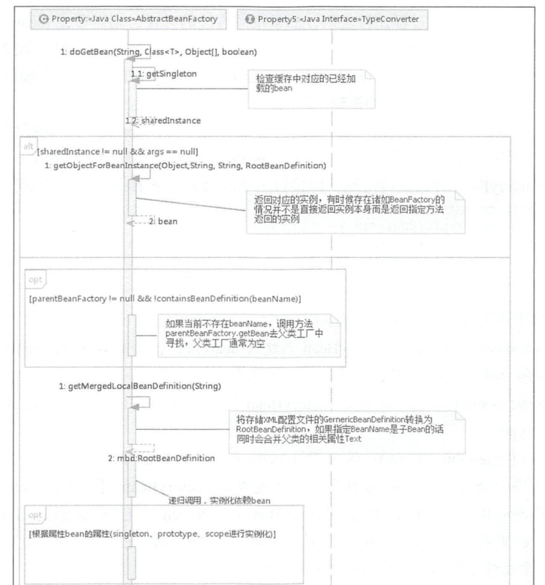
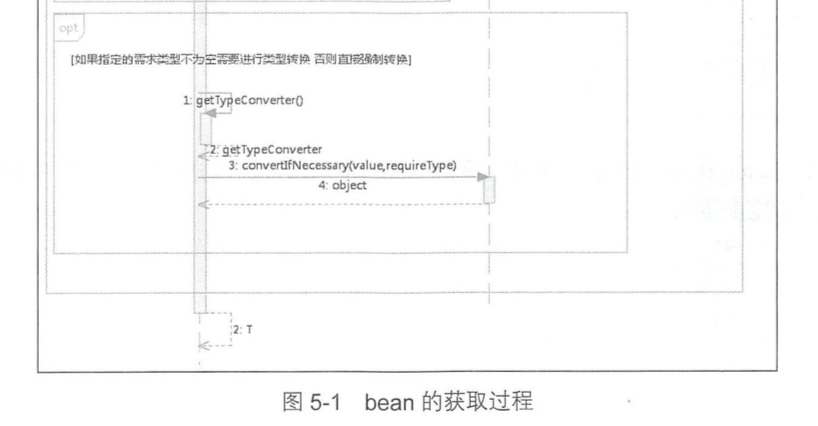

5 bean 的加载
====

经过前面的景点，我们已经参观了对 XML 配置文件的解析，接下来的景点将更加“绚丽”，也将面临更大的挑战。没错！这就是对 bean 加载的探索。

#### 为什么说更加“绚丽”呢？

因为 bean 加载的功能实现远比 bean 解析要复杂的多。一如既往，我们还是以开篇示例为引导，对于 bean 的加载， spring 中的调用方式为:

	MyTestBean bean = (MyTestBean) bf.getBean("myTestBean");
	
#### 这句话实现了什么样的功能呢？背后暗藏什么玄机？

让我们先来体验一下 spring 中代码是如何实现的吧～

``` java
protected <T> T doGetBean(final String name, @Nullable final Class<T> requiredType,
							  @Nullable final Object[] args, boolean typeCheckOnly) throws BeansException {
		// 提取对应的 beanName
		final String beanName = transformedBeanName(name);
		Object bean;

		/**
		 * 单例在 Spring 的同一个容器内只会被创建一次，后续再获取 bean，就直接从单例缓存中获取了 。
		 * 当然这里也只是尝试加载，首先尝试从缓存中加载，如果加载不成功则再次尝试从 singletonFactories 中加载。
		 * 因为在创建单例 bean 的时候会存在依赖注入的情况，而在创建依赖的时候为了避免循环依赖，
		 * 在 Spring 中创建 bean 的原则是: 不等 bean 创建完成就会将创建 bean 的 ObjectFactory 提早曝光加入到缓存中，
		 * 一旦下一个 bean 创建时候需要依赖上一个 bean 则直 接使用 ObjectFactory
		 */
		// Eagerly check singleton cache for manually registered singletons.
		Object sharedInstance = getSingleton(beanName);
		if (sharedInstance != null && args == null) {
			if (logger.isTraceEnabled()) {
				if (isSingletonCurrentlyInCreation(beanName)) {
					logger.trace("Returning eagerly cached instance of singleton bean '" + beanName +
							"' that is not fully initialized yet - a consequence of a circular reference");
				} else {
					logger.trace("Returning cached instance of singleton bean '" + beanName + "'");
				}
			}
			// 返回对应的实例，有时候存在诸如 BeanFactory 的情况并不是直接返回实例本身而是返回指定方法返回的实例
			bean = getObjectForBeanInstance(sharedInstance, name, beanName, null);
		} else {
			// Fail if we're already creating this bean instance:
			// We're assumably within a circular reference.
			/**
			 * 只有在单例情况下才会尝试解决循环依赖，如果存在 A 中有 B 的属性， B 中有 A 的属性，
			 * 那么当依赖注入的时候，就会产生当 A 还未创建完的时候因为对于 B 的创建再次返回创建 A, 造成循环依赖，
			 * 也就是情况: isPrototypeCurrentlyInCreation(beanName) 判断为 true
			 */
			if (isPrototypeCurrentlyInCreation(beanName)) {
				throw new BeanCurrentlyInCreationException(beanName);
			}

			// Check if bean definition exists in this factory.
			// 如果 beanDefinitionMap 中也就是在所有已经加载的类中不包括 beanName, 则尝试从 parentBeanFactory 中检测
			BeanFactory parentBeanFactory = getParentBeanFactory();
			if (parentBeanFactory != null && !containsBeanDefinition(beanName)) {
				// Not found -> check parent.
				String nameToLookup = originalBeanName(name);
				// 递归到 BeanFactory 中寻找
				if (parentBeanFactory instanceof AbstractBeanFactory) {
					return ((AbstractBeanFactory) parentBeanFactory).doGetBean(
							nameToLookup, requiredType, args, typeCheckOnly);
				} else if (args != null) {
					// Delegation to parent with explicit args.
					return (T) parentBeanFactory.getBean(nameToLookup, args);
				} else if (requiredType != null) {
					// No args -> delegate to standard getBean method.
					return parentBeanFactory.getBean(nameToLookup, requiredType);
				} else {
					return (T) parentBeanFactory.getBean(nameToLookup);
				}
			}

			// 如果不是仅仅做类型检查，则是创建 bean,这里要进行记录
			if (!typeCheckOnly) {
				markBeanAsCreated(beanName);
			}

			try {
				// 从 XML 配置文件中读取到的 bean信息是存储在 GernericBeanDefinition 中的 ，
				// 但是所有的 bean 后续处理都是针对于 RootBeanDefinition 的 ，所以这里需要进行一个转换，
				// 转换的同时如果父类 bean不为空的话，则会一并合并父类的属性。
				final RootBeanDefinition mbd = getMergedLocalBeanDefinition(beanName);
				checkMergedBeanDefinition(mbd, beanName, args);

				// Guarantee initialization of beans that the current bean depends on.
				String[] dependsOn = mbd.getDependsOn();
				// 如果存在依赖，需要递归实例化依赖的 bean
				if (dependsOn != null) {
					for (String dep : dependsOn) {
						if (isDependent(beanName, dep)) {
							throw new BeanCreationException(mbd.getResourceDescription(), beanName,
									"Circular depends-on relationship between '" + beanName + "' and '" + dep + "'");
						}
						registerDependentBean(dep, beanName);
						try {
							getBean(dep);
						} catch (NoSuchBeanDefinitionException ex) {
							throw new BeanCreationException(mbd.getResourceDescription(), beanName,
									"'" + beanName + "' depends on missing bean '" + dep + "'", ex);
						}
					}
				}

				// 实例化依赖的 bean 后便可以实例化 mbd 本身了
				// singleton 模式的创建
				// Create bean instance.
				if (mbd.isSingleton()) {
					sharedInstance = getSingleton(beanName, () -> {
						try {
							return createBean(beanName, mbd, args);
						} catch (BeansException ex) {
							// Explicitly remove instance from singleton cache: It might have been put there
							// eagerly by the creation process, to allow for circular reference resolution.
							// Also remove any beans that received a temporary reference to the bean.
							destroySingleton(beanName);
							throw ex;
						}
					});
					bean = getObjectForBeanInstance(sharedInstance, name, beanName, mbd);
				} else if (mbd.isPrototype()) {
					// It's a prototype -> create a new instance.
					// prototype 模式的创建
					Object prototypeInstance = null;
					try {
						beforePrototypeCreation(beanName);
						prototypeInstance = createBean(beanName, mbd, args);
					} finally {
						afterPrototypeCreation(beanName);
					}
					bean = getObjectForBeanInstance(prototypeInstance, name, beanName, mbd);
				} else {
					// 指定的 scope 上实例化 bean
					String scopeName = mbd.getScope();
					final Scope scope = this.scopes.get(scopeName);
					if (scope == null) {
						throw new IllegalStateException("No Scope registered for scope name '" + scopeName + "'");
					}
					try {
						Object scopedInstance = scope.get(beanName, () -> {
							beforePrototypeCreation(beanName);
							try {
								return createBean(beanName, mbd, args);
							} finally {
								afterPrototypeCreation(beanName);
							}
						});
						bean = getObjectForBeanInstance(scopedInstance, name, beanName, mbd);
					} catch (IllegalStateException ex) {
						throw new BeanCreationException(beanName,
								"Scope '" + scopeName + "' is not active for the current thread; consider " +
										"defining a scoped proxy for this bean if you intend to refer to it from a singleton",
								ex);
					}
				}
			} catch (BeansException ex) {
				cleanupAfterBeanCreationFailure(beanName);
				throw ex;
			}
		}

		// 检查需要的类型是否符号 bean 的实际类型
		// Check if required type matches the type of the actual bean instance.
		if (requiredType != null && !requiredType.isInstance(bean)) {
			try {
				T convertedBean = getTypeConverter().convertIfNecessary(bean, requiredType);
				if (convertedBean == null) {
					throw new BeanNotOfRequiredTypeException(name, requiredType, bean.getClass());
				}
				return convertedBean;
			} catch (TypeMismatchException ex) {
				if (logger.isTraceEnabled()) {
					logger.trace("Failed to convert bean '" + name + "' to required type '" +
							ClassUtils.getQualifiedName(requiredType) + "'", ex);
				}
				throw new BeanNotOfRequiredTypeException(name, requiredType, bean.getClass());
			}
		}
		return (T) bean;
	}
```

单看代码就能感受到 bean 的加载经历了一个相当复杂的过程，因为中间需要考虑很多的内容。不过现在不懂也没关系，参考上面的注释，还是可以粗略了解 bean 是怎么加载的。我们大致介绍一下基本的步骤，让你的心里有个“总览”，具体细节我们后面一一道来。

### 1. 转换对应 beanName

> 我猜你可能会疑惑转换对应 beanName 是什么意思。你可能会问传入的参数 name 不就是 beanName 吗?

其实不是，这里传入的参数可能是`别名`，也可能是 `FactoryBean`，所以需要进行一系列的解析，这些解析内容包括:

- 去除 FactoryBean 的修饰符，也就是如果 `name="&aa"`， 那么会首先去除 & 而使 `name ="aa”`。 

- 取指定 alias 所表示的最终 beanName

	> 例如别名 A 指向名称为 B 的 bean 则返回 B; 若别名 A 指向别名 B，别名 B 又指向名称为 C 的 bean 则返回 C。

### 2. 尝试从缓存中加载单例

单例在 Spring 的同一个容器内只会被创建一次，后续再获取 bean，就直接从单例缓存中获取了。 

> 实际上如果没有显示指定，spring 创建的 bean 的就是单例，因为很多的场景单例足够满足需要，这样可以节省开销(创建和存储)。

当然啦，这里也只是尝试加载，首先尝试从缓存中加载，如果加载不成功则再次尝试从 singletonFactories 中加载。

因为在创建单例 bean 的时候会存在**`依赖注入`**的情况，而在创建依赖的时候为了避免循环依赖，在 Spring 中创建 bean 的原则是不等 bean 创建完成就会将创建 bean 的 ObjectFactory 提早曝光加入到缓存中, 一旦下一个 bean创建时候需要依赖上一个 bean则直 接使用 ObectFactory。

> 这个地方是解决循环依赖的重要解决方式，其实是利用了 3 级缓存: 
> 
> ```
> 
>  具体可见 DefaultSingletonBeanRegistry
>  /**
> 	 * Cache of singleton objects: bean name to bean instance.
> 	 * 缓存单例对象:(一级缓存)完成初始化的单例对象的cache
> 	 */
> 	private final Map<String, Object> singletonObjects = new ConcurrentHashMap<>(256);
> 
> 	/**
> 	 * Cache of singleton factories: bean name to ObjectFactory.
> 	 * 缓存单例工厂:(三级缓存) 进入实例化阶段的单例对象工厂的cache
> 	 */
> 	private final Map<String, ObjectFactory<?>> singletonFactories = new HashMap<>(16);
> 
> 	/**
> 	 * Cache of early singleton objects: bean name to bean instance.
> 	 * 缓存单例对象：(二级缓存)完成实例化但是尚未初始化的，提前曝光的单例对象的Cache
> 	 */
> 	private final Map<String, Object> earlySingletonObjects = new HashMap<>(16);
> > ```

### 3. bean 的实例化

如果从缓存中得到了 bean 的原始状态，则需要对 bean 进行实例化。

这里有必要强调一下：缓存中记录的只是最原始的 bean 状态，井不一定是我们最终想要的 bean。 

> 举个例子，假如我们需要对工厂 bean 进行处理，那么这里得到的其实是工厂 bean 的初始状态，但是我们 真正需 要的是工厂 bean 中定义的 factory-method  方法中返回的 bean，而 getObjectForBeanlnstance 就是完成这个工作的，我们会在后面详细讲解 。

### 4. 原型模式的依赖检查

只有在**单例情况**下才会尝试解决循环依赖。如果存在 A 中有 B 的属性， B 中有 A 的属性，那么当依赖注入的时候，就会产生当 A 还未创建完的时候因为对于 B 的创建再次返回创建 A, 造成循环依赖，也就是情况: `isPrototypeCurrentlyInCreation(beanName) `判断 true。

### 5. 检测 parentBeanFactory

#### 从代码上看，如果缓存没有数据的话直接转到父类工厂上去加载了，这是为什么呢? 

很容易忽略的一个很重要的判断条件是: `parentBeanFactory != null && !containsBeanDefinition(beanName)` , `parentBeanFactory != null`。 

- parentBeanFactory 如果为空，则其他一切都是浮云，这个就不用多说了，毕竟都没有父类工厂
- 但是 `!containsBeanDefinition(beanName)` 就比较重要了，它是在检测如果当前 加载的 XML 配置文件中不包含 beanName 所对应的配置（也就是所有已经加载的类中不包括 beanName），就只能到 parentBeanFactory 去尝试加载一下了，然后再去递归的调用 getBean 方法。

### 6. 将存储 XML 配置文件的 GernericBeanDefinition 转换为 RootBeanDefinition

因为从 XML 配置文件中读取到的 bean信息是存储在 GernericBeanDefinition 中的 ，但是所有的 bean 后续处理都是针对于 RootBeanDefinition 的 ，所以这里需要进行一个转换，转换的同时如果父类 bean不为空的话，则会一并合并父类的属性。

> @yx 你想啊，子类继承了父类，最终我们加载的 bean 肯定是需要把继承的属性一并加载过来的，不然这个继承就没啥意义了。

### 7. 寻找依赖

 bean 的初始化过程中很可能会用到某些属性，而某些属性很可能是动态配置的，并且可能配置成依赖于其他的 bean，那这个时候就有必要先加载依赖的 bean。
 
所以，在 Spring 的加载顺序中，在初始化某一个 bean 的时候首先会初始化这个 bean 所对应的依赖。

> @yx 就好像 A 类依赖于 B 类，那么 A 要想完成的使用它的方法属性，就必须把它的依赖准备好。
> 
> 这就好像你要过江，你依赖于一艘船，那么在过江之前就要先把船建好。

### 8. 针对不同的 scope 进行 bean 的创建

我们都知道，在 Spring 中存在着不同的 scope，默认的是 singleton，但是还有些其他的配置诸如 prototype、request、session 之类的。

在这个步骤中，Spring 会根据不同的配置进行不同的初始化策略 。

### 9. 类型转换

其实程序到这里返回 bean 后已经基本结束了。

一般来说，对该方法的调用参数 requiredType 是为空的，但是可能会存在这样的情况，返回的 bean 其实是个 String，但是 requiredType 却传入是 Integer 类型，那么这时候本步骤就会起作用了，它的功能是将返回的 bean 转换为 requiredType 所指定的类型。 

> 当然， String 转换为 Integer 是最简单的一种转换，在 Spring 中提供了各种各样的转换器，你也可以自己扩展转换器来满足你的需求。

终于，经过上面的步骤后 bean 的加载就结束了，这个时候就可以返回我们所需要的 bean 啦！

### bean 加载示意图

图 5-1 直观地反映了整个过程。其中最重要的就是步骤 8，针对不同的 scope 进行 bean 的创建，你会在这里看到各种常用的 Spring特性的实现。

<div align="center">  </div><br>

<div align="center">  </div><br>

在细化分析各个步骤提供的功能前，我们有必要先了解一下 FactoryBean 的用法。

> 这个概念很多搞不清 FactoryBean 和 BeanFactory 的区别和关系。事实上，他俩只是名字像而已，其实没啥“大关系”。

## 5.1 FactoryBean 的使用

#### 为什么要设计 FactoryBean？
一般情况下， Spring 通过反射机制利用 bean 的 class 属性指定实现类来实例化 bean 。 

在一些情况下，实例化 bean 过程比较复杂，如果按照传统的方式，则需要在 `<bean>` 中提供大量的配置信息，配置方式的灵前性是受限 的，这时采用编码的方式可能会得到一个简单的方案。 

Spring 为此提供了一个 `org.Springframework.bean.factory.FactoryBean` 的工厂类接口，**用户可以通过实现该接口定制实例化 bean 的逻辑。**

> @yx 简单来说，就是你想定制 bean 实例化的逻辑，那就实现 FactoryBean 接口吧！

#### FactoryBean 的基本信息

FactoryBean 接口对于 Spring 框架来说占有重要的地位，Spring 自身就提供了 70 多个 FactoryBean 的实现。它们隐藏了实例化一些复杂 bean 的细节，给上层应用带来了便利。从 Spring 3.0 开始，FactoryBean开始支持泛型，即接口声明改为 FactoryBean<T>的形式: 

```
package org.springframework.beans.factory;
public interface FactoryBean<T> {
	T getObject () throws Exception ; 
	Class<?> c;etObjectType(); 
	boolean isSingleton();
}
```

在该接口中还定义了以下 3 个方法:

* T getObject():  返回由 FactoryBean 创建的 bean 实例，如果 isSingleton()返回 true，则该实例会放到 Spring 容器中单实例缓存池中。

* boolean isSingleton(): 返回由 FactoryBean 创建的 bean 实例的作用域是 singleton 还是 prototype 。

* Class<T> getObjectType(): 返回 FactoryBean 创建的 bean 类型 。

当配置文件中<bean>的 class 属性配置的实现类是 FactoryBean 时，通过 getBean() 方法返回的可不是 FactoryBean 本身，而是 `FactoryBean#getObject()` 方法所返回的对象，相当于 `FactoryBean#getObject() `代理了 getBean()方法。

#### 看个例子

这样说有点抽象，我们来看个例子吧！例如:如果使用传统方式配置下面 Car 的 `<bean>` 时，Car 的每个属性分别对应一个` <property>`元素标签。 

``` java
public class Car {
	private int maxSpeed;
	private String brand;
	private double price 
	// get/set 方法
}
```

如果用 FactoryBean 的方式实现就会灵活一些，下例通过逗号分割符的方式一次性地为 Car 的所有属性指定配置值:

```
<bean id="car" class="com.alan.yx.springSource.chapter_5.factory_bean.CarFactoryBean"
          carInfo="跑车,400,200000000"></bean>
```

当调用 getBean(”car”) 时， Spring 通过**反射机制**发现 CarFactoryBean 实现了 FactoryBean 的接口，这时 Spring容器就调用接口方法 CarFactoryBean#getObject() 方法返回。 如果希望获取 CarFactoryBean 的实例，则需要在使用 getBean(beanName) 方法时在 beanName 前显示的加上 ”&”前缀，例如 getBean(”&car”)。

> @yx 还记得前面说的转换对应 beanName吗？这里的 factoryBean 正是其中转换的一种，现在看到用法就知道为什么源码中要加个 “&” 了。

## 5.2 缓存中获取单例 bean

了解了 FactoryBean 的用法后，我们就可以开始 bean 加载过程之旅啦！新的一站已经到站，你准备好了吗？

> 前面已经讲过，单例在 Spring 的同一个容器内只会被创建一次，后续再获取 bean 直接从单例缓存中获取。
> 
> 当然这里也只是尝试加载，首先尝试从缓存中加载，然后再次尝试尝试从 singletonFactories 中加载 。 因为在创建单例 bean 的时候会存在依赖注入的情况，而在创建依赖的时候为了避免循环依赖，Spring创建 bean 的原则是不等 bean 创建完成就会将创建 bean 的 `ObjectFactory` 提早曝光加入到缓存中，一旦下一个 bean 创建时需要依赖上个 bean，则直接使用 ObjectFactory。

让我们一起来看下代码吧。

``` java
DefaultSingletonBeanRegistry:
public Object getSingleton(String beanName) {
		// 参数 true 设置标识允许早期依赖
		return getSingleton(beanName, true);
	}
```

``` java
protected Object getSingleton(String beanName, boolean allowEarlyReference) {
		// 检查缓存中是否存在实例
		Object singletonObject = this.singletonObjects.get(beanName);
		if (singletonObject == null && isSingletonCurrentlyInCreation(beanName)) {
			// 如果为空，则锁定全局变量并进行处理
			synchronized (this.singletonObjects) {
				// 如果此 bean 正在加载则不处理
				singletonObject = this.earlySingletonObjects.get(beanName);
				if (singletonObject == null && allowEarlyReference) {
					// 当某些方法需要提前初始化时，则会调用 addSingleFactory 方法
					// 将对应的 ObjectFactory 初始化策略存储在 singleFactories
					ObjectFactory<?> singletonFactory = this.singletonFactories.get(beanName);
					if (singletonFactory != null) {
						// 调用预先设定的 getObject 方法
						singletonObject = singletonFactory.getObject();
						// 记录在缓存中，earlySingleObjects 与 singletonFactories 互斥
						this.earlySingletonObjects.put(beanName, singletonObject);
						this.singletonFactories.remove(beanName);
					}
				}
			}
		}
		return singletonObject;
	}
```

很多人第一次看到这段代码可能会有点迷糊，主要是因为这个方法涉及到循环依赖的检测，以及很多变量的记录存取。

- 1.其实这个方法首先尝试从 singletonObjects 里面获取实例

- 2.如果获取不到再从 earlySingleton­Objects 里面获取

- 3.如果还获取不到，再尝试从 singletonFactories 里面获取 beanName 对应的 ObjectFactory，然后调用这个 ObjectFactory 的 getObject 来创建 bean，并放到 earlySingletonObjects里面去，并且从 singletonFacotories里面 remove 掉这个 ObjectFactory (因为他们两个之间是互斥的)，而对于后续的所 有内存操作都只为了循环依赖检测时候使用，也就是在 allowEarlyReference 为 true 的情况下才会使用。

#### 这里的关键点在于这几个 map

这里涉及用于存储 bean 的不同的 map，可能让第一次接触的同学感到困惑，所以我们简单解释一下。 

* singletonObjects: 用于保存 BeanName 和创建 bean 实例之间的关系， bean name 一> bean instance 。

* singletonFactories: 用于保存 BeanName 和创建 bean 的工厂之间的关系， bean name 一> ObjectFactory。

* earlySingletonObjects: 也是保存 BeanName 和创建 bean 实例之间的关系

	earlySingletonObjects 与 singletonObjects 的不同之处在于: 当一个单例 bean 被放到这里面后，那么当 bean 还在创建过程中，就可以通过 getBean 方法获取到了，其目的是用来**检测循环引用** 。
	
* registeredSingletons: 用来保存当前所有巳注册的 bean。

## 5.3 从 bean 的实例中获取对象

在 getBean 方法中， getObjectForBeanlnstance 是个高频率使用的方法，无论是从缓存中获得 bean 还是根据不同的 scope 策略加载 bean。 

总之，我们得到 bean 的实例后要做的第一步就是调用这个方法来检测一下正确性，其实就是用于检测当前 bean 是否是 FactoryBean 类型的 bean，如果是，那么需要调用该 bean 对应的 FactoryBean 实例中的 getObject()作为返回值 。

无论是从缓存中获取到的 bean 还是通过不同的 scope策略加载的 bean 都只是**`最原始的 bean 状态`**，并不一定是我们最终想要的 bean。

> 举个例子，假如我们需要对工厂 bean 进行处理，那么这里得到的其实是工厂 bean 的初始状态，但是我们真正需要的是工厂 bean 中定义的 factory-method 方法中退回的 bean，而 `getObjectForBeanInstance` 方法就是完成这个工作的。

```java
AbstractBeanFactory:
protected Object getObjectForBeanInstance(
			Object beanInstance, String name, String beanName, @Nullable RootBeanDefinition mbd) {

		// 如果指定的 name 是工厂相关(以 & 为前缀)且 beanFactory 又不是 FactoryBean 类型，则校验不通过
		// Don't let calling code try to dereference the factory if the bean isn't a factory.
		if (BeanFactoryUtils.isFactoryDereference(name)) {
			if (beanInstance instanceof NullBean) {
				return beanInstance;
			}
			if (!(beanInstance instanceof FactoryBean)) {
				throw new BeanIsNotAFactoryException(beanName, beanInstance.getClass());
			}
			if (mbd != null) {
				mbd.isFactoryBean = true;
			}
			return beanInstance;
		}

		// 现在我们有了这个 bean 的实例，这个实例可能会是正常的 bean 或者是 FactoryBean
		// 如果是 FactoryBean，我们用它来创建一个 bean 实例，但是如果用户想要直接获取工厂实例
		// 而不是工厂的 getObject 方法对应的实例，那么传入的 name 应该加入前缀 &
		// Now we have the bean instance, which may be a normal bean or a FactoryBean.
		// If it's a FactoryBean, we use it to create a bean instance, unless the
		// caller actually wants a reference to the factory.
		if (!(beanInstance instanceof FactoryBean)) {
			return beanInstance;
		}

		// 加载 FactoryBean
		Object object = null;
		if (mbd != null) {
			mbd.isFactoryBean = true;
		} else {
			// 尝试从缓存中加载 bean
			object = getCachedObjectForFactoryBean(beanName);
		}
		if (object == null) {
			// 到这里已经明确知道 beanInstance 一定是 FactoryBean 类型
			// Return bean instance from factory.
			FactoryBean<?> factory = (FactoryBean<?>) beanInstance;
			// containsBeanDefinition 检测 beanDefinitionMap 中也就是在所有已经加载的类中检测
			// 是否定义 beanName
			// Caches object obtained from FactoryBean if it is a singleton.
			if (mbd == null && containsBeanDefinition(beanName)) {
				// 将存储在 XML 配置文件中的 GernericBeanDefinition 转换为 RootBeanDefinition，
				// 如果指定 BeanName 是子 Bean 的话同时会合并父类的相关属性
				mbd = getMergedLocalBeanDefinition(beanName);
			}
			// 是否是用户定义的而不是应用程序本身定义的
			boolean synthetic = (mbd != null && mbd.isSynthetic());
			// 【****】最关键的代码委托给 getObjectFromFactoryBean(factory, beanName, !synthetic)
			object = getObjectFromFactoryBean(factory, beanName, !synthetic);
		}
		return object;
	}
```

从上面的代码来看，这个方法并没有什么重要的信息，很多是一些辅助代码以及功能性的判断，真正的核心代码是委托给了 getObjectFromFactoryBean，所以接下来让我们来看看 getObjectForBeanInstance 中的所做的工作。

1. 对 FactoryBean 正确性的验证。
2. 对非 FactoryBean 不做任何处理。
3. 对 bean 进行转换。
4. 将从 Factory 中解析 bean 的工作委托给 getObjectFromFactoryBean

```java
FactoryBeanRegistrySupport:
	/**
	 * 在这个方法里只做了一件事情，就是返回的 bean 如果是单例的，那就必须要保证全局唯一 ，
	 * 同时，也因为是单例的，所以不必重复创建，可以使用缓存来提高性能，也就是说已经加载过就要记录下来以便于下次复用，否则的话就直接获取了 。
	 */
	protected Object getObjectFromFactoryBean(FactoryBean<?> factory, String beanName, boolean shouldPostProcess) {
		// 如果是单例模式
		if (factory.isSingleton() && containsSingleton(beanName)) {
			synchronized (getSingletonMutex()) {
				Object object = this.factoryBeanObjectCache.get(beanName);
				// 如果有缓存值，直接返回；否则创建
				if (object == null) {
					// #### 关键代码
					object = doGetObjectFromFactoryBean(factory, beanName);
					// Only post-process and store if not put there already during getObject() call above
					// (e.g. because of circular reference processing triggered by custom getBean calls)
					Object alreadyThere = this.factoryBeanObjectCache.get(beanName);
					if (alreadyThere != null) {
						object = alreadyThere;
					} else {
						if (shouldPostProcess) {
							if (isSingletonCurrentlyInCreation(beanName)) {
								// Temporarily return non-post-processed object, not storing it yet..
								return object;
							}
							beforeSingletonCreation(beanName);
							try {
								// 调用 ObjectFactory 的后处理器
								object = postProcessObjectFromFactoryBean(object, beanName);
							} catch (Throwable ex) {
								throw new BeanCreationException(beanName,
										"Post-processing of FactoryBean's singleton object failed", ex);
							} finally {
								afterSingletonCreation(beanName);
							}
						}
						if (containsSingleton(beanName)) {
							this.factoryBeanObjectCache.put(beanName, object);
						}
					}
				}
				return object;
			}
		} else {
			// #### 关键代码
			Object object = doGetObjectFromFactoryBean(factory, beanName);
			if (shouldPostProcess) {
				try {
					object = postProcessObjectFromFactoryBean(object, beanName);
				} catch (Throwable ex) {
					throw new BeanCreationException(beanName, "Post-processing of FactoryBean's object failed", ex);
				}
			}
			return object;
		}
	}
```

这段代码逻辑很清晰，但是在这段代码在这个方法里只做了一件事情: 就是返回的 bean 如果是单例的，那就必须要保证全局唯一，同时，也因为是单例的，所以不必重复创建，可以使用缓存来提高性能，也就是说已经加载过就要记录下来以便于下次复用，否则的话就直接获取了。

然而，我们真正想看的在 doGetObjectFromFactoryBean 方法中，也就是 object = factory.getObject() ,没错！就是这句代码，有没有感觉我们的历程就好像剥洋葱一样，一层一层的直到最内部的代码实现，虽然道路“有些曲折”，终究还是让我们走到了。

```java
FactoryBeanRegistrySupport:
private Object doGetObjectFromFactoryBean(final FactoryBean<?> factory, final String beanName)
			throws BeanCreationException {

		Object object;
		try {
			// 需要验证权限
			if (System.getSecurityManager() != null) {
				AccessControlContext acc = getAccessControlContext();
				try {
					object = AccessController.doPrivileged((PrivilegedExceptionAction<Object>) factory::getObject, acc);
				} catch (PrivilegedActionException pae) {
					throw pae.getException();
				}
			} else {
				// 直接调用 getObject 方法
				object = factory.getObject();
			}
		} catch (FactoryBeanNotInitializedException ex) {
			throw new BeanCurrentlyInCreationException(beanName, ex.toString());
		} catch (Throwable ex) {
			throw new BeanCreationException(beanName, "FactoryBean threw exception on object creation", ex);
		}

		// Do not accept a null value for a FactoryBean that's not fully
		// initialized yet: Many FactoryBeans just return null then.
		if (object == null) {
			if (isSingletonCurrentlyInCreation(beanName)) {
				throw new BeanCurrentlyInCreationException(
						beanName, "FactoryBean which is currently in creation returned null from getObject");
			}
			object = new NullBean();
		}
		return object;
	}
```

上面我们已经讲述了 FactoryBean 的调用方法，如果 bean 声明为 FactoryBean 类型，则当 提取 bean 时才提取的并不是 FactoryBean，而是 FactoryBean 中对应的 getObject 方法返回的 bean, 而 doGetObjectFromFactoryBean 正是实现这个功能的。 

#### 但是，我们看到在上上个的方法中(getObjectFromFactoryBean) 除了调用 object = factory.getObject() 得到我们想要的结果后并没有直接返回，而是接下来又做了一些后处理的操作，这个又是做什么用的呢?

于是我们跟踪进入 AbstractAutowireCapableBeanFactory 类的 postProcessObjectFromFactoryBean方法:

```java
AbstractAutowireCapableBeanFactory:
	/**
	 * 重点在与:BeanPostProcessor 的 postProcessAfterInitialization,属于bean 的生命周期的一环
	 */
public Object applyBeanPostProcessorsAfterInitialization(Object existingBean, String beanName)
			throws BeansException {

		Object result = existingBean;
		for (BeanPostProcessor processor : getBeanPostProcessors()) {
			// 在 Spring获取 bean的规则中有这样一条: 尽可能保证所有 bean初始化后都会调用注册的 BeanPostProcessor 的
			// postProcessAfterInitialization 方法进行处理，在实际开发过程中大可以针对此特性设计自己的业务逻辑。
			Object current = processor.postProcessAfterInitialization(result, beanName);
			if (current == null) {
				return result;
			}
			result = current;
		}
		return result;
	}
```

对于后处理器的使用我们暂时不用了解太多，后续会详细介绍，这里，我们只需了解在 Spring获取 bean的规则中有这样一条: **尽可能保证所有 bean初始化后都会调用注册的 BeanPostProcessor 的 postProcessAferlnitialization 方法进行处理**，在实际开发过程中大可以针对此特性设计自己的业务逻辑 。

>@yx
>
>看到这里，有没有觉得有那么一点熟悉呢？
>
>给点提示 BeanPostProcessor 有两个方法： postProcessBeforeInitialization 和 postProcessAfterInitialization。这里正是我们可以利用的 bean 生命周期的一步，借此扩展我们的业务逻辑，这个扩展点设计是不是很棒呢。

## 5.4 获取单例

前面我们提过从缓存中获取单例的过程，但是，如果缓存中不存在已经加载的单例 bean 的话，就需要从头开始 bean 的加载过程了，Spring 中使用 getSingleton 的重载方法实现 bean 的加载过程，让我们一起来看下吧！

```java
public Object getSingleton(String beanName, ObjectFactory<?> singletonFactory) {
		Assert.notNull(beanName, "Bean name must not be null");
		// 全局变量需要同步
		synchronized (this.singletonObjects) {
			// 首先检查对应的 bean 是否已经加载过，因为 singleton 模式其实就是复用已经创建的 bean，所以这一步是必须的
			Object singletonObject = this.singletonObjects.get(beanName);
			// 如果为空才可以进行 singleton 的 bean 初始化
			if (singletonObject == null) {
				if (this.singletonsCurrentlyInDestruction) {
					throw new BeanCreationNotAllowedException(beanName,
							"Singleton bean creation not allowed while singletons of this factory are in destruction " +
									"(Do not request a bean from a BeanFactory in a destroy method implementation!)");
				}
				if (logger.isDebugEnabled()) {
					logger.debug("Creating shared instance of singleton bean '" + beanName + "'");
				}
				//#### 值得关注的方法
				beforeSingletonCreation(beanName);
				boolean newSingleton = false;
				boolean recordSuppressedExceptions = (this.suppressedExceptions == null);
				if (recordSuppressedExceptions) {
					this.suppressedExceptions = new LinkedHashSet<>();
				}
				try {
					// 初始化 bean
					singletonObject = singletonFactory.getObject();
					newSingleton = true;
				} catch (IllegalStateException ex) {
					// Has the singleton object implicitly appeared in the meantime ->
					// if yes, proceed with it since the exception indicates that state.
					singletonObject = this.singletonObjects.get(beanName);
					if (singletonObject == null) {
						throw ex;
					}
				} catch (BeanCreationException ex) {
					if (recordSuppressedExceptions) {
						for (Exception suppressedException : this.suppressedExceptions) {
							ex.addRelatedCause(suppressedException);
						}
					}
					throw ex;
				} finally {
					if (recordSuppressedExceptions) {
						this.suppressedExceptions = null;
					}
					//#### 值得关注的方法
					afterSingletonCreation(beanName);
				}
				if (newSingleton) {
					// 加入缓存
					addSingleton(beanName, singletonObject);
				}
			}
			return singletonObject;
		}
	}
```

上面一段代码中其实是使用了`回调方法`，使得程序可以在单例创建的前后做一些准备及处理操作，而真正的获取单例 bean 的方法并不是在此方法中实现的，而是在 ObjctFactory 类型的实例 singletonFactory 中实现的。 而这些准备及处理操作包括如下内容。

1. 检查缓存是否已加载过。
2. 若没有加载，则记录 beanName 的正在加载状态。
3. 加载单例前记录加载状态。

	可能你会觉得 beforeSingletonCreation方法是个空实现，里面没有任何逻辑，其实并不是 ，这个方法中做了一个很重要的操作:记 录加载状态，也就是通过 this.singletonsCurrentlyInCreation.add(beanName) 将当前正要创建的 bean记录在缓存中，这样便可以对循环依赖进行检测。
	
4. 通过调用参数传入的 ObjectFactory 的个体 Object方法实例化 bean。
5. 加载单例的后处理方法调用。

	> 同步骤 3 的记录加载状态相似，当 bean加载结束后需要移除缓存中对该 bean 的正在加载状态的记录。(见方法 afterSingletonCreation )
	
6. 将结果记录至缓存并删除加载 bean 过程中所记录的各种辅助状态。

7. 返回处理结果。
	
	虽然我们已经从外部了解了加载 bean 的逻辑架构，但我们并没有开始对 bean 加载功能的探索，之前我们提到过，bean 的加载逻辑其实是在传入的 ObjectFactory 类型的参数 singletonFactory 中定义的，我们反推参数的获取，得到如下代码 :
	
	```java
	sharedInstance = getSingleton(beanName, () -> {
						try {
							return createBean(beanName, mbd, args);
						} catch (BeansException ex) {
							// Explicitly remove instance from singleton cache: It might have been put there
							// eagerly by the creation process, to allow for circular reference resolution.
							// Also remove any beans that received a temporary reference to the bean.
							destroySingleton(beanName);
							throw ex;
						}
					});
	```
	
ObjectFactory 的核心部分其实只是调用了 createBean 的方法，所以我们还需要到 createBean 方法中追寻真理。

> @yx
> 
> 不管这个路径有多绕，记住我们最初的目的，在阅读源码时要适当的“取舍”，要紧抓核心的方法和逻辑，不要一开始就“死抠”每一行的细节，将主要的流程弄明白之后，再局部逐一“各个击破”。

## 5.5 准备创建 bean 

> 我们不可能指望在一个函数中完成一个复杂的逻辑（那不就成了面向过程编程了嘛），而且我们跟踪了这么多 Spring代码，经历了这么多函数，或多或少也发现了一些规律: 
> 
> * 一个真正干活的函数其实是以 do 开头的， 比如 doGetObjectFromFactoryBean;
> * 而给我们错觉的函数，比如 getObjectFromFactoryBean，其实只是从全局角度去做些统筹的工作。 

上面这个规则对于 createBean 也不例外，让我们看看在 createBean 函数中做了那些准备工作吧！

```java
protected Object createBean(String beanName, RootBeanDefinition mbd, @Nullable Object[] args)
			throws BeanCreationException {

		if (logger.isTraceEnabled()) {
			logger.trace("Creating instance of bean '" + beanName + "'");
		}
		// 锁定 class, 根据设置的 class 属性或者根据 className 来解析 Class
		RootBeanDefinition mbdToUse = mbd;

		// Make sure bean class is actually resolved at this point, and
		// clone the bean definition in case of a dynamically resolved Class
		// which cannot be stored in the shared merged bean definition.
		Class<?> resolvedClass = resolveBeanClass(mbd, beanName);
		if (resolvedClass != null && !mbd.hasBeanClass() && mbd.getBeanClassName() != null) {
			mbdToUse = new RootBeanDefinition(mbd);
			mbdToUse.setBeanClass(resolvedClass);
		}

		// 验证及准备覆盖的方法
		// Prepare method overrides.
		try {
			// #### 重点关注
			mbdToUse.prepareMethodOverrides();
		} catch (BeanDefinitionValidationException ex) {
			throw new BeanDefinitionStoreException(mbdToUse.getResourceDescription(),
					beanName, "Validation of method overrides failed", ex);
		}

		try {
			// #### 重点关注
			// 给 BeanPostProcessors 一个机会来返回代理来代替真正的实例
			// Give BeanPostProcessors a chance to return a proxy instead of the target bean instance.
			Object bean = resolveBeforeInstantiation(beanName, mbdToUse);
			// 有一个短路判断
			if (bean != null) {
				return bean;
			}
		} catch (Throwable ex) {
			throw new BeanCreationException(mbdToUse.getResourceDescription(), beanName,
					"BeanPostProcessor before instantiation of bean failed", ex);
		}

		try {
			// #### 重点关注
			Object beanInstance = doCreateBean(beanName, mbdToUse, args);
			if (logger.isTraceEnabled()) {
				logger.trace("Finished creating instance of bean '" + beanName + "'");
			}
			return beanInstance;
		} catch (BeanCreationException | ImplicitlyAppearedSingletonException ex) {
			// A previously detected exception with proper bean creation context already,
			// or illegal singleton state to be communicated up to DefaultSingletonBeanRegistry.
			throw ex;
		} catch (Throwable ex) {
			throw new BeanCreationException(
					mbdToUse.getResourceDescription(), beanName, "Unexpected exception during bean creation", ex);
		}
	}
```

从上面的代码我们可以总结一下函数完成的具体步骤及功能:

1. 根据设置的 class 属性或者根据 className 来解析 Class。
2. 对 override 属性进行标记及验证。
	
	很多人可能不知道这个方法的作用，因为在 Spring 的配置里面根本就没有诸如 override-method 之类的配置，那么这个方法到底是干什么用的呢?

	其实在 Spring 中确实没有 override-method 这样的配置，但是如果读过前面的部分，可能会有所发现，在 Spring 配置中是存在 **`lookup-method 和 replace-method`** 的，而这两个配置的加载其实就是将配置统一存放在 BeanDefinition 中 的 methodOverrides 属性里，而这个函数的操作其实也就是针对于这两个配置的 。

3. 应用初始化前的后处理器，解析指定 bean是否存在初始化前的短路操作。 
4. 创建 bean

接下来，我们首先来查看下对 override 属性标记及验证的逻辑实现。

### 5.5.1 处理 override 属性

我们一起来看下 AbstractBeanDefinition 类的 prepareMethodOverride 方法:

```java
public void prepareMethodOverrides() throws BeanDefinitionValidationException {
		// Check that lookup methods exist and determine their overloaded status.
		if (hasMethodOverrides()) {
			getMethodOverrides().getOverrides().forEach(this::prepareMethodOverride);
		}
	}
	
protected void prepareMethodOverride(MethodOverride mo) throws BeanDefinitionValidationException {
		// 获取对应类中对应方法名的个数
		int count = ClassUtils.getMethodCountForName(getBeanClass(), mo.getMethodName());
		if (count == 0) {
			throw new BeanDefinitionValidationException(
					"Invalid method override: no method with name '" + mo.getMethodName() +
							"' on class [" + getBeanClassName() + "]");
		} else if (count == 1) {
			// Mark override as not overloaded, to avoid the overhead of arg type checking.
			// 标记 MethodOverride 暂未被覆盖，避免参数类型检查的开销
			mo.setOverloaded(false);
		}
	}
```

通过以上两个函数的代码你能体会到它所要实现的功能吗?

之前我们提到过，在 Spring 配置中存在 lookup-method 和 replace-method 两个配置功能，而这两个配置的加载其实就是将配置统一存放在 BeanDefinition 中的 methodOverrides 属性里，这两个功能实现原理其实是在 bean 实例化的时候如果检测到存在 methodOverrides 属性，**会动态地为当前 bean 生成代理并使用对应的拦截器为 bean 做增强处理**。

> 相关逻辑实现在 bean 的实例化部分详细介绍 。

但是，这里要提到的是，对于方法的匹配来讲，如果一个类中存在若干个重载方法，那么，在函数调用及增强的时候还需要**根据参数类型进行匹配，来最终确认当前调用的到底是哪个函数**。 但是，Spring 将一部分匹配工作在这里完成了，如果当前类中的方法只有一个，那么就设置重载该方法没有被重载，这样在后续调用的时候便可以直接使用找到的方法，而不需要进行方法的参数匹配验证了，而且还可以提前对方法存在性进行验证，正可谓一箭双雕。

> 也就是说，这里做了一个简化的操作。

### 5.5.2 实例化的前置处理

在真正调用 doCreate方法创建 bean 的实例前使用了这样一个方法 resolveBeforeInstantiation(beanName, mbdToUse)对 BeanDefinigiton 中的属性做些前置处理。当然，无论其中是再有相应的逻辑实现我们都可以理解，因为真正逻辑实现前后留有处理函数也是可扩展的一种体现，但是，这并不是最重要的，在函数中还提供了一个短路判断，这才是最为关键的部分。

```java
// 有一个短路判断
			if (bean != null) {
				return bean;
			}
```

当经过前置处理后返回的结果如果不为空，那么会直接略过后续 的 bean 的创建而直接返回结果。 这一特性虽然很容易被忽略，但是却起着至关重要的作用，**我们熟知的 AOP 功能就是基于这里的判断的**。

```java
protected Object resolveBeforeInstantiation(String beanName, RootBeanDefinition mbd) {
		Object bean = null;
		// 如果尚未被解析
		if (!Boolean.FALSE.equals(mbd.beforeInstantiationResolved)) {
			// Make sure bean class is actually resolved at this point.
			if (!mbd.isSynthetic() && hasInstantiationAwareBeanPostProcessors()) {
				Class<?> targetType = determineTargetType(beanName, mbd);
				if (targetType != null) {
					// #### 重点关注
					// 调用前处理器的方法处理
					bean = applyBeanPostProcessorsBeforeInstantiation(targetType, beanName);
					if (bean != null) {
						// #### 重点关注
						// 调用后处理器的方法处理
						bean = applyBeanPostProcessorsAfterInitialization(bean, beanName);
					}
				}
			}
			mbd.beforeInstantiationResolved = (bean != null);
		}
		return bean;
	}
```

上面这个方法中最吸引我们的无疑是两个方法: applyBeanPostProcessorsBeforeInstantiation 以及 applyBeanPostProcessorsAfterInitialization。

两个方法实现的非常简单，无非是对后处理器中的所有 InstantiationAwareBeanPostProcessor 类型的后处理器进行 postProcessBeforelnstantiation方 法和 BeanPostProcessor 的 postProcessAfterInitialization 方法 的调用 。

#### 1. 实例化前的后处理器应用

bean 的实例化前调用，也就是将 AbsractBeanDefinition 转换为 BeanWrapper 前的处理。 

给子类一个修改 BeanDefinition 的机会，也就是说当程序经过这个方法后， bean 可能已经不是我们认为的 bean 了，或许成为了一个经过处理的代理 bean，可能是通过 cglib 生成的，也可能是通过其他技术生成的。 

> 这在第 7 章中会详细介绍，我们现在只需要知道，在 bean 的实例化前会调用后处理器的方法进行处理 。

```java
AbstractAutowireCapableBeanFactory：
protected Object applyBeanPostProcessorsBeforeInstantiation(Class<?> beanClass, String beanName) {
		for (BeanPostProcessor bp : getBeanPostProcessors()) {
			if (bp instanceof InstantiationAwareBeanPostProcessor) {
				InstantiationAwareBeanPostProcessor ibp = (InstantiationAwareBeanPostProcessor) bp;
				// 实例化之前调用后处理器的方法处理
				Object result = ibp.postProcessBeforeInstantiation(beanClass, beanName);
				if (result != null) {
					return result;
				}
			}
		}
		return null;
	}
```

#### 2. 实例化后的后处理器应用

在讲解从缓存中获取单例 bean 的时候就提到过， Spring 中的规则是在 bean 的初始化后尽可能保证将 注册的后处理器的 postProcessAfterInitialization 方法应用到该 bean 中，因为如果返回的 bean 不为空，那么便不会再次经历普通 bean 的创建过程，所以只能在这里应用后处理器 的 postProcessAfterInitialization 方法。

```java
public Object applyBeanPostProcessorsAfterInitialization(Object existingBean, String beanName)
			throws BeansException {

		Object result = existingBean;
		for (BeanPostProcessor processor : getBeanPostProcessors()) {
			// 在 Spring 获取 bean的规则中有这样一条: 尽可能保证所有 bean初始化后都会调用注册的 BeanPostProcessor 的
			// postProcessAfterInitialization 方法进行处理，在实际开发过程中大可以针对此特性设计自己的业务逻辑。
			Object current = processor.postProcessAfterInitialization(result, beanName);
			if (current == null) {
				return result;
			}
			result = current;
		}
		return result;
	}
```

```java

```

```java

```


```java

```