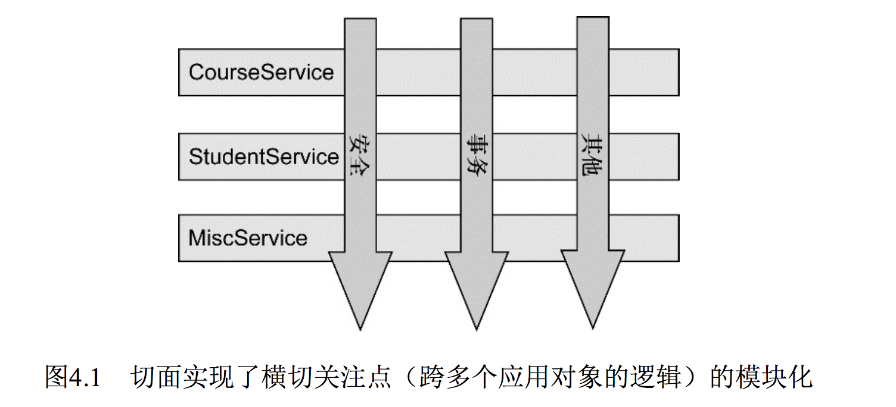
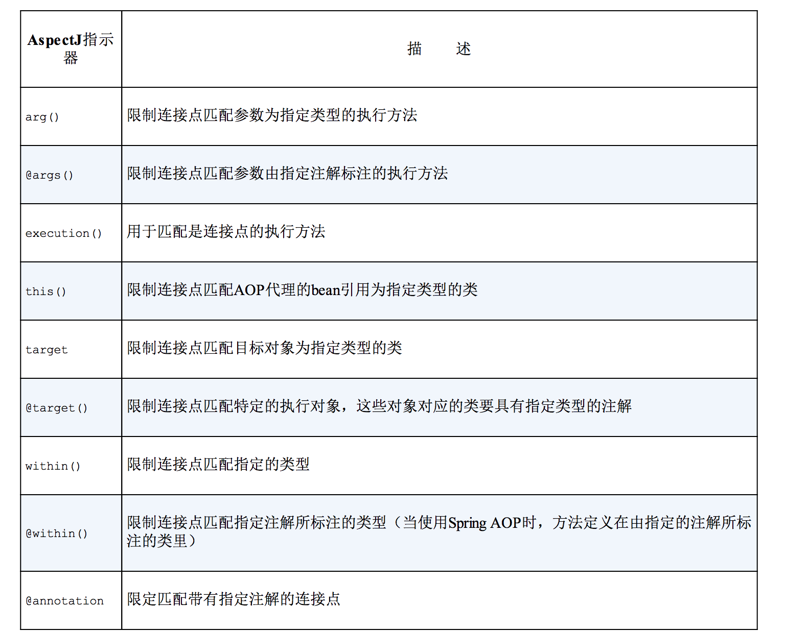
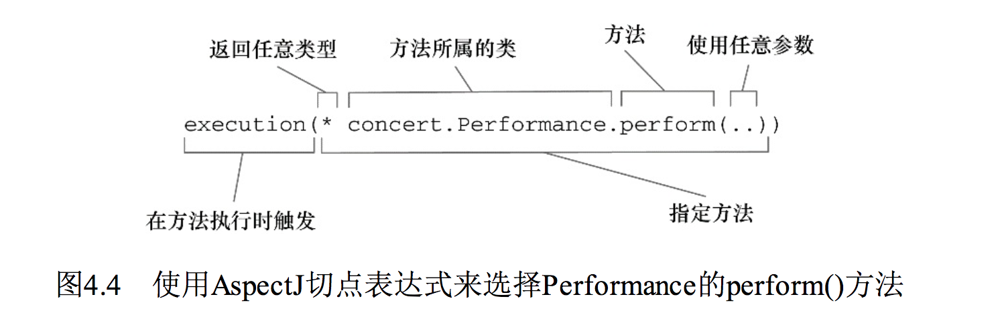
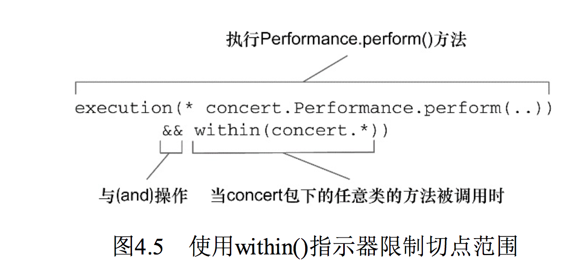
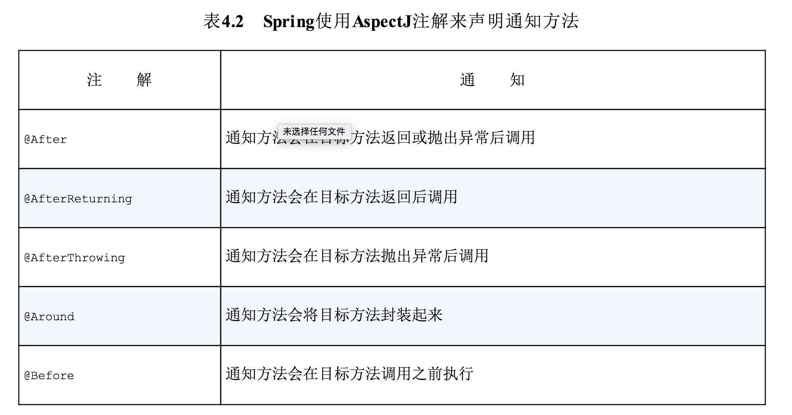
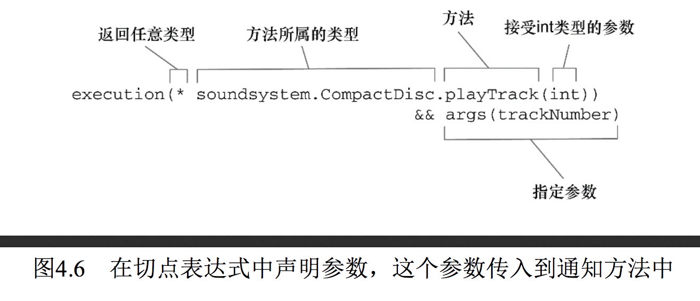

spring 实战 学习记录
=======

## IV. 面向切面的 Spring

#### 为什么需要 AOP ？

因为软件开发中，应用中有很多横切关注点(散布在应用多处)，而这些横切关注点一般与业务逻辑没什么关系，所以需要 AOP 来将其与业务逻辑代码分离。

> 比如常见的日志、事务管理、安全、缓存都是很常见的横切关注点，但我们不应该让它们混在业务代码中，是时候用上 AOP 解耦，走上开发的康康大道了。
> 
> 这就好像你每天都在用电，统计用电的度数是你想考虑的问题吗？你总不想用任何电器的时候还自己测量，月底自己去主动去缴费吧。你真正关心的是用电做什么事，比如看电视、烧水、吹空调（业务逻辑），至于记录用电（横切关注点）就交给电力局安装的电表吧（AOP 技术）。

#### DI 和 AOP 有什么异同点？

它们的目的都是为了解耦， DI 可以帮助应用对象之间解耦， AOP 可以帮助横切关注点与它们影响的对象解耦。

> 现在你看到了吧，整出这些看似“高大上”的名词最终是为了应对耦合这个”bad guy“，帮助你更高效的编程，特别是维护。

#### 什么是 AOP 呢？

额。。。这个问题范围有点大，所谓“一口吃不成大胖子”，我们一个一个概念来，揭开它“高大上”背后的面纱。

> 举个例子，下面这张图展示了切面实现了横切关注点的模块化。
> 
> <div align="center">  </div><br>
> 
> 上面这张图展示了一个被划分为模块的典型应用。

横切关注点可以被模块化为特殊的类，这些类被称为切面（aspect）。

#### 为了重用，我们经常使用的 OOP 技术是继承或委托，为什么还需要 AOP 呢？

重用技术|缺点/优点
----|----
继承| 如果在应用中使用相同基类，往往对象体系比较脆弱
委托|可能需要对委托对象进行复杂的调用
AOP|在一个地方定义通用功能，但可以通过声明的方式定义这个功能要以何种方式在何处应用，无需修改受影响的类

> 继承: 你想想动物世界吧，如果你定义一个基类 Animal,所有的动物继承它，比如 鸭子类 Duck,鸭子有不同的种类，比如绿头鸭、麻鸭、唐老鸭？再继承一次，他们行为是多变的，万一将来一变更，你打算怎么改呢？这样的类爆炸，想象都头大了💥
> 
> 委托: 委托本身就不是很直接，你想想，如果你委托 jack 给你取快递，jack 又委托 rose,如此一来，一个简单的动作需要复杂的调用。

### 4.1 定义AOP术语

#### 你了解哪些常见的 AOP 术语？

通知（advice）、切点（pointcut）和 连接点（join point），参见下面这张图。

> <div align="center">  </div><br>

#### 什么是通知(Advice)？

切面的工作称为通知，也就是定义了切面是什么以及什么时候使用。

> 打个比方，以前电力局每个月都会有抄电表的工作人员来记录各家各户的电表用电量，这个抄电表的工作，就是通知。

#### spring 切面有哪些类型的通知？

类型|描述
---|----
前置通知（Before）|在目标方法被调用之前调用通知功能
后置通知（After）|在目标方法完成之后调用通知，此时不会关心方法的输出是什么
环绕通知（Around）|通知包裹了被通知的方法，在被通知的方法调用之前和调用之后执行自定义的行为
返回通知（After-returning）|在目标方法成功执行之后调用通知
异常通知（After-throwing）|在目标方法抛出异常后调用通知

> 前、后、环绕很好理解，这个就是简单的先后顺序关系
> 
> 返回通知主要针对方法的返回值，你想，如果方法都没有返回值，也就谈不上什么返回通知了。
> 
> 异常通知对标的是语言中的异常体系，考虑还是比较完备的。

#### 什么是连接点（Join point）？

应应用有数以千计的时机应用通知，这些时机被称为连接点。可以利用连接点在应用执行过程插入切面代码。

> 还是那个查电表的小兄弟，为了完成各家各户的抄电表的工作，需要在每个家庭安装一个电表(连接点)。

#### 什么是切点（Poincut）？

切点定义何处使用切面，切点定义会匹配通知所要织入的 一个或者多个连接点。（切点:一对多:连接点）

> 可见切点可以缩小连接点的范围。
> 
> 那个查电表的兄弟又来了，我们现在假设在杭州范围内记录每家用电量，那么记录全部家庭的电表（所有连结点）肯定是不现实的，这么多家庭不得累死，而且要查到什么时候（说不定都下个月了），一般电力局会给他指定一片区域的家庭（切点）。

#### 什么是切面（Aspect）？

切面 = 通知 + 切点。也就是定义什么是切面，在何时、何处完成指定功能。

> 也就是电表小哥知道自己一天要记录用电量（通知），并且是那个区域的家庭（切点）。

#### 什么是引入（Introduction）？

允许我们向现有类添加新的方法和属性。

> 比如我们定义一个通知类，这个类中的新方法和属性可以引入现有类，而无需更改现有类，又让它具有新的行为和状态。

#### 什么是织入（Weaving）？

把**切面应用到目标对象**并**创建新的代理对象**的过程。

#### 什么时候可以织入？

目标对象的生命周期有多个点可以进行织入：

织入期|描述|说明
----|----|----
编译期|切面在目标类编译时被织入|这种方式需要特殊的编译器。</br>AspectJ的织入编译器就是以这种方式织入切面的。
类加载期|切面在目标类加载到JVM时被织入|这种方式需要特殊的类加载器（ClassLoader），它可以在目标类被引入应用之前增强该目标类的字节码。</br>AspectJ 5的加载时织入（load-time weaving，LTW）就支持以这种方式织入切面。
运行期|切面在应用运行的某个时刻被织入|在织入切面时，AOP容器会为目标对象动态地创建一个代理对象。</br>Spring AOP就是以这种方式织入切面的。

> 这3个时期从前往后，分别对应不同的机制。

#### 既然 AOP 这么强，spring 支持哪些类型的 AOP？

4种类型|描述
----|----
基于代理的经典 Spring AOP|曾经非常棒(毕竟那会儿也没其他选择)，现在使用 ProxyFactory Bean 会非常笨重和复杂
纯 POJO 切面|需要 XML 配置，借助Spring的aop命名空间，声明式将对象转切面（一想到 xml 那些标签，你能记住几个？个人觉得不够便捷）
@AspectJ 注解驱动的切面|提供注解驱动的AOP，好处在于能够不使用XML来完成功能 【推荐】
注入式的 AspectJ 切面（各种版本的Spring）|AOP需求超过了简单方法调用（如需构造器或属性拦截），需要考虑使用AspectJ来实现切面 【更复杂情况推荐】


#### Spring AOP 和 AspectJ 有什么区别？

类别|区别1|区别2
---|---|---
Spring AOP|切面在目标类运行时被织入|通知都是用标准的Java类编写（支持注解或 XML）
AspectJ|切面在目标类编译时被织入|特有的AOP语言获得更强大和细粒度的控制(需要学习额外工具和语法)

#### Spring AOP在运行时通知对象是怎么做的？

关键在于代理类，通过在代理类中包裹切面，Spring在运行期把切面织入到Spring管理的bean。

> 代理会封装目标类，并拦截被通知方法的调用，再把调用转发给真正的目标 bean。
> 
> 在拦截到调用后，会在调用目标方法前，执行切面的逻辑。（这就织入啦）
> 
> 这就好像跟团游旅行社的工作人员(代理)，把你的需求囊括（封装），在你预约酒店、航班的时候，将你的需求获取（拦截），在预定、买票之前，比如收点中介费什么的（切面逻辑），最后才是真正买票（目标方法）。

#### Spring AOP 有什么局限吗？

只支持方法级别的连接点。而像 AspectJ和JBoss，除了方法切点，它们还提供了字段和构造器接入点，更细粒度。

绝大多数需求都可以满足，实在不行可以再用 AspectJ 补充，所谓“杀鸡焉用牛刀”，真正需要牛刀的时候再掏出来吧。

### 4.2 通过切点来选择连接点

#### Spring AOP 怎么支持切点表达式的？

Spring借助AspectJ的切点表达式语言来定义Spring切面，注意它仅支持 AspectJ 切点指示器的一个子集。

<div align="center">  </div><br>

> 上面的表注意只有execution指示器是实际执行匹配的，而其他的指示器都是用来限制匹配的。
> 
> 这说明execution指示器是我们在编写切点定义时最主要使用的指示器，在此基础上，我们使用其他指示器来限制所匹配的切点。有个最重要的，是不是感觉一下子轻松了很多？

#### 怎么编写切点呢？

这个涉及实际使用，举几个例子会很直观，是不是迫不及待地跃跃欲试了？

别急，先定一个接口:

```
package concert;
public interface Performance {

    public void perform();
}
```

- 例1: 假设我们想编写Performance的perform()方法触发的通知。

> 如图4.4展现了一个切点表达式，这个表达式能够设置当perform()方法执行时触发通知的调用。
> 
> <div align="center">  </div><br>
> 
> 使用execution()指示器选择Performance的perform()方法。

方法表达式以“*”号开始，表明了我们不关心方法返回值的类型。然后，我们指定了全限定类名和方法名。对于方法参数列表，我们使用两个点号（..）表明切点要选择任意的perform()方法，无论该方法的入参是什么。

- 例2: 现在假设我们需要配置的切点仅匹配concert包

> 在此场景下，可以使用within()指示器来限制匹配，如图4.5所示。
> 
> <div align="center">  </div><br>

注意这里使用了“&&”操作符把execution()和within()指示器连接在一起形成与（and）关系（切点必须匹配所有的指示器）。类似地，我们可以使用“||”操作符来标识或（or）关系，而使用“!”操作符来标识非（not）操作。

> 因为“&”在XML中有特殊含义，所以在Spring的XML配置里面描述切点时，我们可以使用and来代替“&&”。同样，or和not可以分别用来代替“||”和“!”。

#### 怎么在切点中选择 bean?

还是实例中学习，“实践是最好的老师”。

除了表4.1的指示器外，Spring还引入了一个新的bean()指示器，它允许我们在切点表达式中使用bean的ID来标识bean。bean()使用bean ID或bean名称作为参数来限制切点只匹配特定的bean。

- 例1：

		excution(* concret.Performance.perform()) and bean('woodstock')

这里，我们希望在执行Performance的perform()方法时应用通知，但限定bean的ID为woodstock。

- 例2：还可以使用非操作为除了特定ID以外的其他bean应用通知：

		excution(* concret.Performance.perform()) and bean('woodstock')
	
这里，切面的通知会被编织到所有ID不为woodstock的bean中。

#### 怎么创建切面呢？

继续沿用上面表演的例子，既然有表演，那必须得有观众不成，不然表演没啥意义了。

下面就是用切面定义了观众类。

```
@Aspect
public class Audience {

    /**
     * 表演之前
     */
    @Before("execution(* com.alan.yx.springInAction.Chapter_04.src.main.java.Performance.perform(..))")
    public void silenceCellPhones() {
        System.out.println("silenceCellPhones");
    }

    /**
     * 表演之前
     */
    @Before("execution(* com.alan.yx.springInAction.Chapter_04.src.main.java.Performance.perform(..))")
    public void takeSeats() {
        System.out.println("takeSeats");
    }

    /**
     * 表演之后
     */
    @AfterReturning("execution(* com.alan.yx.springInAction.Chapter_04.src.main.java.Performance.perform(..))")
    public void applause(){
        System.out.println("applause");
    }

    /**
     * 表演失败之后
     */
    @AfterThrowing("execution(* com.alan.yx.springInAction.Chapter_04.src.main.java.Performance.perform(..))")
    public void demandRefund(){
    	  // 太烂了，退款！
        System.out.println("demandRefund");
    }
}
```

#### Spring使用AspectJ注解来声明通知方法有哪些注解？

<div align="center">  </div><br>

#### 频繁使用的切点表达式怎么简化？

通过@Pointcut注解声明切点表达式（特别是频繁使用时），被调用的方法实际内容不重要，该方法本身只是一个标识，供@Pointcut注解依附。

> 上面的示例里的的切点表达式出现了很多次["execution(* com.alan.yx.springInAction.Chapter_04.src.main.java.Performance.perform(..))"]
> 
> 作为一个有代码feel的你一定会感觉不对劲，所以 @Pointcut 就派上了用场。

优化后的代码:

```
@Aspect
public class Audience2 {
    
    @Pointcut("execution(* com.alan.yx.springInAction.Chapter_04.src.main.java.Performance.perform(..))")
    public void performance(){}

    /**
     * 表演之前
     */
    @Before("performance()")
    public void silenceCellPhones() {
        System.out.println("silenceCellPhones");
    }

    /**
     * 表演之前
     */
    @Before("performance()")
    public void takeSeats() {
        System.out.println("takeSeats");
    }

    /**
     * 表演之后（鼓掌）
     */
    @AfterReturning("performance()")
    public void applause(){
        System.out.println("applause");
    }

    /**
     * 表演失败之后(退款)
     */
    @AfterThrowing("performance()")
    public void demandRefund(){
        System.out.println("demandRefund");
    }
}
```

#### @EnableAspectJAutoProxy 如何启用 AspectJ 自动代理？

不管你是使用 JavaConfig 还是 XML，AspectJ 自动代理会为使用 @Aspect 注解的bean创建一个代理，这个代理会围绕着所有该切面的切点所匹配的bean。在这种情况下，将会为配置类创建一个代理，切面类中的处理逻辑将会在目标方法调用前后执行。

> ⚠️Spring的AspectJ自动代理仅仅使用@AspectJ作为创建切面的指导，切面依然是基于代理的。 
> 
> **在本质上，它依然是Spring基于代理的切面。这一点非常重要，因为这意味着尽管使用的是@AspectJ注解，但我们仍然限于代理方法的调用。**
> 如果想利用AspectJ的所有能力，我们必须在运行时使用AspectJ并且不依赖Spring来创建基于代理的切面。
> 
> 尽管你用的是 AspectJ 自动代理， 毕竟你用的还是 Spring AOP,它依然是基于代理的，所以你想用人家 AOP 的“特效”，就必须严格按照人家的规矩来。

#### 通知类型的王者 @Around 是怎么使用的？

 @Around 能够让你所编写的逻辑将被通知的目标方法完全包装起来，相当于同时使用 @Before + @After。
 
还是之前的观众类，见例子：

```
	/**
     * 环绕通知方法
     *
     * @param jp
     */
    @Around("performance()")
    public void watchPerformance(ProceedingJoinPoint jp) {
        try {
            System.out.println("silenceCellPhones");
            System.out.println("takeSeats");
            jp.proceed();
            System.out.println("applause");
        } catch (Throwable throwable) {
            System.out.println("demandRefund");
            throwable.printStackTrace();
        }
    }
```

这个方法接受ProceedingJoinPoint作为参数。这个对象是必须要有，因为你要在通知中用它来调用被通知的方法。通知方法中可以做任何的事情，当要将控制权交给被通知的方法时，它需要调用**ProceedingJoinPoint的proceed()方法**。

> 如果不调 proceed()方法，那么你的通知实际上会阻塞对被通知方法的调用。当然这有可能这就是你想要的效果，但更多的情况是你可能希望在某个点上执行被通知的方法，那就不要忘记哦。
> 
> 这个方法是切面类调用目标类方法的保证，毕竟方法要被执行，总得有人调用吧？（毕竟它不会自动知道你要不要执行），万一你真忘了，那就“捡了芝麻丢了西瓜”（执行类切面逻辑，结果把业务逻辑丢了）

#### 怎么处理通知中的参数呢？

	@Pointcut("execution(* com.test.Test.playTrack(int)) && args(argNumber)")

<div align="center">  </div><br>

#### 如何通过切面类给目标类引入新功能(一般指方法)？

可以利用 “引入”的 AOP 概念，让切面给 Spring bean（目标类） 添加方法。

话不多说，看个实例:

```
// 引入
@Aspect
public class EncoreableIntroducer {

    @DeclareParents(value = "com.alan.yx.springInAction.Chapter_04.src.main.java.Performance+",
            defaultImpl = DefaultEncoreable.class)
    public static Encoreable encoreable;

}

// 接口
public interface Encoreable {

    void performEncore();
}

// 接口实现类
public class DefaultEncoreable implements Encoreable {

    @Override
    public void performEncore() {
        System.out.println("DefaultEncoreable");
    }

}
```

上面例子通过 @DeclareParents 注解，将 Encoreable 接口引入到 Performance bean 中。

@DeclareParents 注解组成|描述
---|----
value属性|指定了哪种类型的bean要引入该接口</br>在上例中，也就是所有实现Performance的类型。（标记符后面的加号表示是Performance的所有子类型，而不是Performance本身。）
defaultImpl属性|指定了为引入功能提供实现的类。</br>在上例中，指定的是DefaultEncoreable提供实现。
@DeclareParents注解|标注的静态属性指明了要引入了接口。</br>在上例中，我们所引入的是Encoreable接口。

> 你可能会想，如果我想新增 performance 类的功能，直接实现 Encoreable接口。
> 
> 这其实存在两个问题，一方面，也不是所有的 Performance 都想要 Encoreable 的特性(所谓“强扭的瓜不甜”，生搬硬套总不太好)；
> 另一方面，你也可能修改不了 Performance 的代码，比如你用的是第三方实现（比如你总不会想为了兼容你的代码，找一下 Apache 组织为你“打开大门”吧）

#### Spring AOP 切面是不是只能用在目标类上？

通过上面的例子看得出，可不是只有一种情况可用，实际上支持 被代理的bean(目标类) + 被引入的接口。

Spring的自动代理机制将会获取到切面的声明，当Spring发现一个bean使用了 @Aspect 注解时，Spring 就会创建一个代理，然后将调用委托给被代理的 bean 或被引入的实现，这取决于调用的方法属于`被代理的bean`还是属于`被引入的接口`。

#### 如果 Spring AOP 不能满足业务需求怎么办？

是时候考虑更加强大的 AspectJ 啦！像其他的bean一样，Spring可以为AspectJ切面注入依赖。

> 有兴趣和需求可以再系统地看一下。
