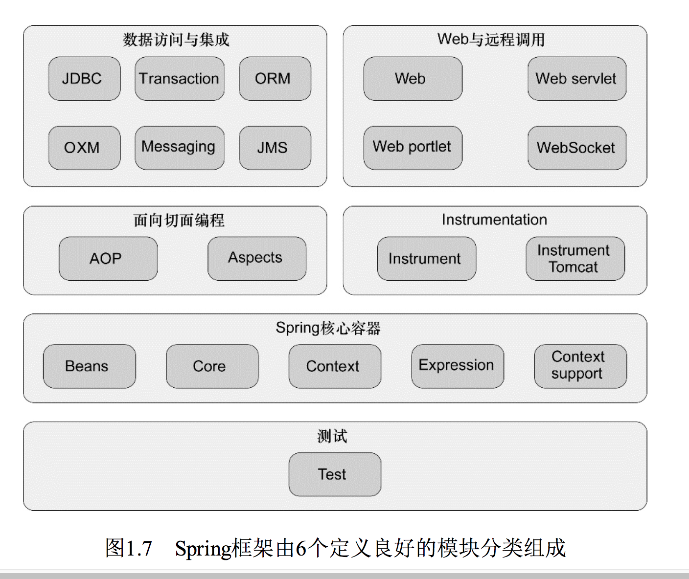

spring 学习记录
=======

# spring 实战

## I. Spring 之旅

#### Spring 的目的是什么？

简化 Java 开发

#### 怎么简化 java 开发？

- 基于 pojo 轻量级和最小侵入编程
- 依赖注入(DI)/控制反转(IOC) 实现解耦合
- 面向切面编程(AOP) 声明式编程和减少样样板代码

#### 不用 DI/IOC 有什么问题？

每个对象都要管理它依赖的对象，造成耦合性太高和难以测试和复用

> 比如每个对象还要 new 出来

#### DI 怎么实现的呢？

通过系统中负责协调的`第三方组件`在创建对象的时候设定对象的依赖关系

#### 有哪些 DI 注入的方式？

方式|备注
----|----
构造器|注入的是接口，不是实现类(更加的通用和灵活)👍🏻　
setter 方法|推荐对强依赖使用构造器注入，而对可选性的依赖使用属性注入

#### 什么是装配？

创建应用对象之间协作关系的行为称为装配（wiring），这是依赖注入（DI）的本质。

> 就好像汽车中各个配件组合到一起做成发动机

#### 有哪些装配的方式？

- XML
- 基于 java 配置(比如注解,如 @Bean)

> 我们可以把这个过程成想象成变形金刚变形合体，spring 把各种 bean 装配到一起形成一个“巨型大金刚”，爆发出的能量超乎单体作战的想象！👽

#### spring 是通过什么来完成装配的呢？

谜底揭晓！ **ApplicationContext(应用上下文)** 装载bean的定义并把它们组装起来

#### AOP 有什么用？

把应用中各处分散的功能分离出来，形成可复用的组件

> 比如我们常见的日志模块、事务管理、安全等等，都是一些通用的模块或功能
> 
> 你想想啊，如果除了核心的代码逻辑，每一个地方你都要维护类似于日志、事务、安全的代码，万一需求变更，头都大了🤪

#### 为什么要 AOP?

- 实现`横向关注点`(经常使用到的系统服务，如日志、安全等)功能的代码会重复出现在多个组件中，维护繁琐

> 丑陋的 ctrl c + ctrl v 真的有必要么

- 各个组件会因为与自身业务无关的代码变得混乱

> 想象一下一个支付的组件，日志、安全、事务等混杂其中，你会想，这到底要干什么(实际它的核心代码只是为了实现支付)

- AOP 就可以将横向关注点**服务模块化**【分离的思想】

> 这个你可以想象一下，各个横向关注点的功能层像外壳一样包裹着核心业务层📦，就好像钢铁侠穿上了高科技的钢铁套装，既变得很厉害，又没有给自己增加太大负担。

#### AOP 定义切点时用什么语法？

pointcut 配置expression 属性来选择所应用的通知,表达式的语法采用的是`AspectJ`的切点表达式语言

> AspectJ 用来做 AOP 很强大，Spring AOP 也有参考 AspectJ 来做，一般开发也足够用

#### 你能举几个样板代码的例子吗？

例子：比如JDBC，为了进行一个简单的数据库操作，需要写一大堆样本代码，处理无关的数据库连接、sql 语句、返回结果解析、异常处理等等

#### 怎么解决样板代码？

使用模板封装

> 比如 JdbcTemplate 很好地封装了 JDBC 的处理，有兴趣查看源码实现 

#### 你的 bean 在应用中是如何管理的？

Spring 容器负责创建、装配、配置、管理 bean 的整个生命周期，从出生--->死亡。

> 可见 `容器` 是 spring 的核心。

#### spring 有哪些类型的容器

- 最简单的容器:BeanFactory
- 常用的容器:ApplicationContext（基于BeanFactory构建）

> BeanFactory 对大多数应用来说往往太低级了，因此，ApplicationContext 更受欢迎。这就好比现在有了电锯去砍树，偏偏使用最原始的手工铁据，是不是有点费力不讨好。

#### spring 有哪些常见的应用上下文？

种类|描述
----|----
AnnotationConfigApplicationContext|从一个或多个基于Java的配置类中加载Spring应用上下文。
AnnotationConfigWebApplicationContext|从一个或多个基于Java的配置类中加载Spring Web应用上下文。
ClassPathXmlApplicationContext|从类路径下的一个或多个XML配置文件中加载上下文定义，把应用上下文的定义文件作为类资源。
FileSystemXmlapplicationcontext|从文件系统下的一个或多个XML配置文件中加载上下文定义。
XmlWebApplicationContext|从Web应用下的一个或多个XML配置文件中加载上下文定义。

#### 传统的 bean 生命周期是什么样的？

一般就是使用Java关键字new进行bean实例化，然后该bean就可以使用了。一旦该bean不再被使用，则由Java自动进行垃圾回收。

> 简单粗暴，在 new 或者销毁回收 的过程能够做的事非常有限，操作也很麻烦(比如用反射)

#### Spring bean的生命周期是什么样的？[非常重要]

  
 

在bean准备就绪之前，bean工厂执行了若干启动步骤。我们对图1.5进行详细描述：

1.Spring对bean进行实例化

2.Spring将值和bean的引用(引用其他bean)注入到bean对应的属性中

> 比如通过构造函数、类中注入的接口/类的引用

3.如果bean实现了BeanNameAware接口，Spring将bean的ID传递给setBeanName()方法；

4.如果bean实现了BeanFactoryAware接口，Spring将调用setBeanFactory()方法，将BeanFactory容器实例传入；

5.如果bean实现了ApplicationContextAware接口，Spring将调用setApplicationContext()方法，将bean所在的应用上下文的引用传入进来；

> 3个 aware,从名字上看的出，它实现这个接口是为了让自己被发现（“意识到”），至于具体你想让自己什么东西被容器发现并生效，就选用合适的接口

6.如果bean实现了BeanPostProcessor接口，Spring将调用它们的postProcessBeforeInitialization()方法；

7.如果bean实现了InitializingBean接口，Spring将调用它们的afterPropertiesSet()方法。类似地，如果bean使用init-method声明了初始化方法，该方法也会被调用；

8.如果bean实现了BeanPostProcessor接口，Spring将调用它们的post-ProcessAfterInitialization()方法；

> BeanPostProcessor 和 InitializingBean的3个方法之间的关系就好像汉堡包🍔中的两块面包(before/after)和夹心鸡肉🍗(afterPropertiesSet)

9.此时，bean已经准备就绪，可以被应用程序使用了，它们将一直驻留在应用上下文中，直到该应用上下文被销毁；

10.如果bean实现了DisposableBean接口，Spring将调用它的destroy()接口方法。同样，如果bean使用destroy-method声明了销毁方法，该方法也会被调用。

#### spring 有哪些核心的模块？

  
 

#### spring 5.x 有哪些新特性？

todo

## II.装配 Bean

#### 为什么需要装配？

任何一个成功的应用都是由多个相互协作的组件构成从而实现某一个业务目标。这些组件必须彼此了解，并且相互协作来完成工作，这就需要装配。

> 这就好比你使用某个购物软件 shopping,里面有订单组件、支付组件、认证组件等，它们需要携手合作，才能让你体验买买买的快乐。
> 
> 就好像拍一部大片，需要导演、编剧、演员、摄影师等通力合作，否则就会乱成一锅粥。😭

#### spring 中对象装配是什么样的？

在Spring中，对象无需自己查找或创建与其所关联的其他对象。相反，容器负责把需要相互协作的对象引用赋予各个对象，他是一个“大管家”。

> 比如购物中的订单组件需要依赖支付组件和认证组件，它只需向容器表示自己“两手空空”，容器就会给它想要的关联对象，是不是很羡慕。

#### spring 有哪些主要的装配机制？

方式|描述
----|----
XML中显式配置|
Java中显式配置|显式配置时，Java Config是比 XML 更好的方案，因为它更为强大、类型安全并且对重构友好
隐式的bean发现机制和自动装配|极力“吐血”推荐

推荐: 自动配置 > java 配置 > xml 配置

> 如果能自动配置，既然能减少显示配置的成本(好便利啊)，又能多出时间干点有意思的事情，何乐而不为呢？

#### 怎么实现自动装配？

强大威力的秘诀在于：组件扫描(component scanning) + 自动装配(autowiring)

> - 前者让 spring 发现 ApplicationContext 中的 bean
> 
> 组件扫描就像一个“千里眼”👀一样，将 ApplicationContext 所有的 bean “小家伙”全部找出来，无处可藏(前提得有标记，如 @Componet,不然看大千世界可得“累坏”了)
> 
> - 后者让 spring 自动满足 bean 之间的依赖
> 
> 后者就好像是把依赖的对象请进容器的家门，spring 内部就给他安排上“关系图谱”，他就知道自己和其他对象是怎么依赖的，很清楚自己的“定位”

#### 怎么实现组件扫描呢？

@ComponentScan + @Component/@Service/@Controller/@RestController/@Configuration等等

> - @ComponentScan：用于 spring 开启组件扫描(“千里眼”模式打开)
> 
> 它会扫描指定基础包（base package）及其包下面的子包(你让他满世界扫描，是不是太不现实了，就好像考试范围指定的跟“宇宙一样大”)
> 
> 如 @ComponentScan(basePackages = {"soundsystem","video"})
> 
> - @Component等: 为了让扫描时发现自己是个组件，其他类似注解都是它的组合注解，不过业务描述性更加清晰
> 
> (不然你想想，满应用的@Component注解，这个组件干嘛的不是那么明显，毕竟各个具体的组件也想来点不一样的 "style",有自己的名字，虽然骨子里是一样的)

#### @ComponentScan 注解有哪些要点呢？

@ComponentScan 会扫描指定基础包（base package）及其包下面的子包(你让他满世界扫描，是不是太不现实了，就好像考试范围指定的跟“宇宙一样大”)

用法形如: @ComponentScan(basePackages = {"soundsystem","video"}), 更多用法请参见文档和源码

#### @Autowired 注解实现自动装配有哪些要点？

要点|描述
----|----
使用场合|可以用在构造方法和普通方法上
常见属性|requried: 设置成 false 要谨防 NPE(空指针异常)

#### 怎么通过Java代码装配 bean ?

关键在于: @Configuration + @Bean

> @Configuration 注解表明这个类是一个配置类，该类应该包含在 Spring 应用上下文中如何创建 bean 的细节。
> 
> @Bean 用于声明 bean:
> 
> - 告诉 Spring 这个方法将会返回一个对象，该对象要注册为 Spring 应用上下文中的 bean 
> - 默认情况下，bean的ID与带有@Bean注解的方法名是一样的

【编程推荐】由于 JavaConfig 是配置代码，则不应该包含任何业务逻辑，JavaConfig也不应该侵入到业务逻辑代码之中。因此，**推荐将JavaConfig放到单独的包中，使它与其他的应用程序逻辑分离开来，这样对于它的意图就不会产生困惑**。

> 比如常见的就是单独放在一个 config 目录下

#### XML 配置有些常见点？

- 所有的 bean 都在 `<beans>` 根元素下

- bean 标签： `<bean>`

> 示例：`<bean id="cdPlayer" class="soundsystem.CDPlayer">`

- 构造器标签 `<constructor-arg>`

> 示例: `<constructor-arg ref="compactDisc">`

#### @Import 注解是做什么的？

* 声明一个bean
* 导入@Configuration注解的配置类
* 导入ImportSelector的实现类
* 导入ImportBeanDefinitionRegistrar的实现类

> 具体示例可以参见[代码](https://github.com/Alanyx/spring-learn/tree/master/topic/import-annotation): 

####

####

####

####

####

####

####

####

####

####

####

####

####

####

####

####

####

####

####

####

####

####

####

####

####

####

####

####

####

####

####

####

####

####

####

####

####

####

####

####

####

####

####

####

####

####

####

####

####

####

####

####

####

####

####

####
####

####

####

####

####

####

####

####

####

####

####

####

####

####

####

####

####

####

####

####

####

####

# spring 企业应用开发实战

####

####

####

####

####

####

####

####

####

####

####

####

####

####

####

####

####

####

####

####

####

####

####

####

####

####

####

####

####

####

####

####

####

####

####

####

####

####

####

####

####

####

####

####

####

####

####

####

####

####

####

####

####

####

####

####

####

####

####

####

####

####

####

####

####

####

####

####

####

####

####

####

####

####

####

####

####

####

####
####

####

####

####

####

####

####

####

####

####

####

####

####

####

####

####

####

####

####

####

####

####

