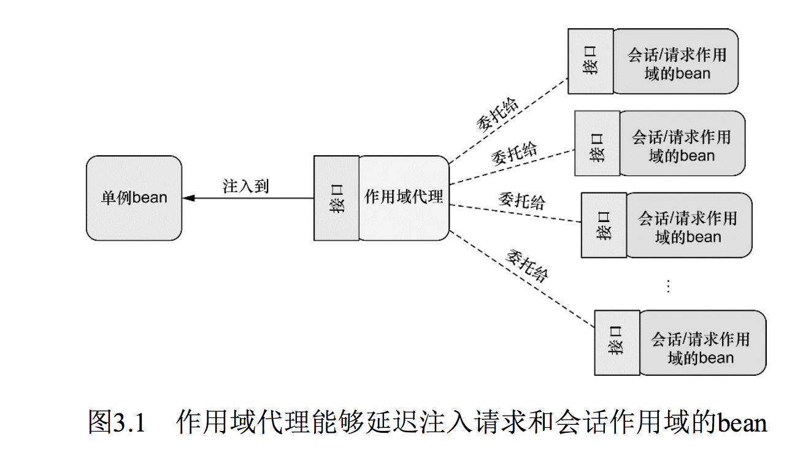
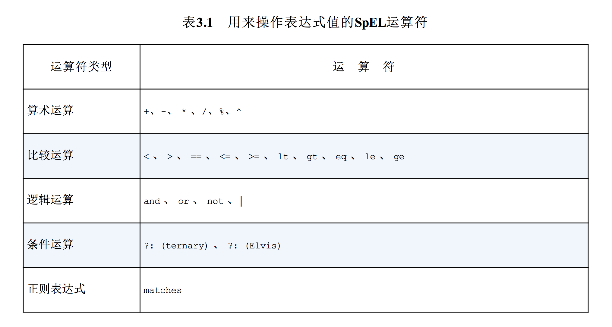

spring 学习记录
=======

# spring 实战

## I. Spring 之旅

#### Spring 的目的是什么？

简化 Java 开发

#### 怎么简化 java 开发？

- 基于 pojo 轻量级和最小侵入编程
- 依赖注入(DI)/控制反转(IOC) 实现解耦合
- 面向切面编程(AOP) 声明式编程和减少样样板代码

#### 不用 DI/IOC 有什么问题？

每个对象都要管理它依赖的对象，造成耦合性太高和难以测试和复用

> 比如每个对象还要 new 出来

#### DI 怎么实现的呢？

通过系统中负责协调的`第三方组件`在创建对象的时候设定对象的依赖关系

#### 有哪些 DI 注入的方式？

方式|备注
----|----
构造器|注入的是接口，不是实现类(更加的通用和灵活)👍🏻　
setter 方法|推荐对强依赖使用构造器注入，而对可选性的依赖使用属性注入


#### 什么是装配？

创建应用对象之间协作关系的行为称为装配（wiring），这是依赖注入（DI）的本质。

> 就好像汽车中各个配件组合到一起做成发动机

#### 有哪些装配的方式？

- XML
- 基于 java 配置(比如注解,如 @Bean)

> 我们可以把这个过程成想象成变形金刚变形合体，spring 把各种 bean 装配到一起形成一个“巨型大金刚”，爆发出的能量超乎单体作战的想象！👽

#### spring 是通过什么来完成装配的呢？

谜底揭晓！ **ApplicationContext(应用上下文)** 装载bean的定义并把它们组装起来

#### AOP 有什么用？

把应用中各处分散的功能分离出来，形成可复用的组件

> 比如我们常见的日志模块、事务管理、安全等等，都是一些通用的模块或功能
> 
> 你想想啊，如果除了核心的代码逻辑，每一个地方你都要维护类似于日志、事务、安全的代码，万一需求变更，头都大了🤪

#### 为什么要 AOP?

- 实现`横向关注点`(经常使用到的系统服务，如日志、安全等)功能的代码会重复出现在多个组件中，维护繁琐

> 丑陋的 ctrl c + ctrl v 真的有必要么

- 各个组件会因为与自身业务无关的代码变得混乱

> 想象一下一个支付的组件，日志、安全、事务等混杂其中，你会想，这到底要干什么(实际它的核心代码只是为了实现支付)

- AOP 就可以将横向关注点**服务模块化**【分离的思想】

> 这个你可以想象一下，各个横向关注点的功能层像外壳一样包裹着核心业务层📦，就好像钢铁侠穿上了高科技的钢铁套装，既变得很厉害，又没有给自己增加太大负担。

#### AOP 定义切点时用什么语法？

pointcut 配置expression 属性来选择所应用的通知,表达式的语法采用的是`AspectJ`的切点表达式语言

> AspectJ 用来做 AOP 很强大，Spring AOP 也有参考 AspectJ 来做，一般开发也足够用

#### 你能举几个样板代码的例子吗？

例子：比如JDBC，为了进行一个简单的数据库操作，需要写一大堆样本代码，处理无关的数据库连接、sql 语句、返回结果解析、异常处理等等

#### 怎么解决样板代码？

使用模板封装

> 比如 JdbcTemplate 很好地封装了 JDBC 的处理，有兴趣查看源码实现 

#### 你的 bean 在应用中是如何管理的？

Spring 容器负责创建、装配、配置、管理 bean 的整个生命周期，从出生--->死亡。

> 可见 `容器` 是 spring 的核心。

#### spring 有哪些类型的容器

- 最简单的容器:BeanFactory
- 常用的容器:ApplicationContext（基于BeanFactory构建）

> BeanFactory 对大多数应用来说往往太低级了，因此，ApplicationContext 更受欢迎。这就好比现在有了电锯去砍树，偏偏使用最原始的手工铁据，是不是有点费力不讨好。

#### spring 有哪些常见的应用上下文？

种类|描述
----|----
AnnotationConfigApplicationContext|从一个或多个基于Java的配置类中加载Spring应用上下文。
AnnotationConfigWebApplicationContext|从一个或多个基于Java的配置类中加载Spring Web应用上下文。
ClassPathXmlApplicationContext|从类路径下的一个或多个XML配置文件中加载上下文定义，把应用上下文的定义文件作为类资源。
FileSystemXmlapplicationcontext|从文件系统下的一个或多个XML配置文件中加载上下文定义。
XmlWebApplicationContext|从Web应用下的一个或多个XML配置文件中加载上下文定义。

#### 传统的 bean 生命周期是什么样的？

一般就是使用Java关键字new进行bean实例化，然后该bean就可以使用了。一旦该bean不再被使用，则由Java自动进行垃圾回收。

> 简单粗暴，在 new 或者销毁回收 的过程能够做的事非常有限，操作也很麻烦(比如用反射)

#### Spring bean的生命周期是什么样的？[非常重要]

<div align="center">  </div><br>

在bean准备就绪之前，bean工厂执行了若干启动步骤。我们对图1.5进行详细描述：

1.Spring对bean进行实例化

2.Spring将值和bean的引用(引用其他bean)注入到bean对应的属性中

> 比如通过构造函数、类中注入的接口/类的引用

3.如果bean实现了BeanNameAware接口，Spring将bean的ID传递给setBeanName()方法；

4.如果bean实现了BeanFactoryAware接口，Spring将调用setBeanFactory()方法，将BeanFactory容器实例传入；

5.如果bean实现了ApplicationContextAware接口，Spring将调用 setApplicationContext()方法，将bean所在的应用上下文的引用传入进来；

> 3个 aware,从名字上看的出，它实现这个接口是为了让自己被发现（“意识到”），至于具体你想让自己什么东西被容器发现并生效，就选用合适的接口

6.如果bean实现了BeanPostProcessor接口，Spring将调用它们的postProcessBeforeInitialization() 方法；

7.如果bean实现了InitializingBean接口，Spring将调用它们的 afterPropertiesSet() 方法。类似地，如果bean使用init-method声明了初始化方法，该方法也会被调用；

8.如果bean实现了BeanPostProcessor接口，Spring将调用它们的post-ProcessAfterInitialization()方法；

> BeanPostProcessor 和 InitializingBean的3个方法之间的关系就好像汉堡包🍔中的两块面包(before/after)和夹心鸡肉🍗(afterPropertiesSet)

9.此时，bean已经准备就绪，可以被应用程序使用了，它们将一直驻留在应用上下文中，直到该应用上下文被销毁；

10.如果bean实现了DisposableBean接口，Spring将调用它的destroy()接口方法。同样，如果bean使用destroy-method声明了销毁方法，该方法也会被调用。

#### spring 有哪些核心的模块？

<div align="center">  </div><br>

#### spring 5.x 有哪些新特性？

todo

## II.装配 Bean

#### 为什么需要装配？

任何一个成功的应用都是由多个相互协作的组件构成从而实现某一个业务目标。这些组件必须彼此了解，并且相互协作来完成工作，这就需要装配。

> 这就好比你使用某个购物软件 shopping,里面有订单组件、支付组件、认证组件等，它们需要携手合作，才能让你体验买买买的快乐。
> 
> 就好像拍一部大片，需要导演、编剧、演员、摄影师等通力合作，否则就会乱成一锅粥。😭

#### spring 中对象装配是什么样的？

在Spring中，对象无需自己查找或创建与其所关联的其他对象。相反，容器负责把需要相互协作的对象引用赋予各个对象，他是一个“大管家”。

> 比如购物中的订单组件需要依赖支付组件和认证组件，它只需向容器表示自己“两手空空”，容器就会给它想要的关联对象，是不是很羡慕。

#### spring 有哪些主要的装配机制？

方式|描述
----|----
XML中显式配置|
Java中显式配置|显式配置时，Java Config是比 XML 更好的方案，因为它更为强大、类型安全并且对重构友好
隐式的bean发现机制和自动装配|极力“吐血”推荐

推荐: 自动配置 > java 配置 > xml 配置

> 如果能自动配置，既然能减少显示配置的成本(好便利啊)，又能多出时间干点有意思的事情，何乐而不为呢？

#### 怎么实现自动装配？

强大威力的秘诀在于：组件扫描(component scanning) + 自动装配(autowiring)

> - 前者让 spring 发现 ApplicationContext 中的 bean
> 
> 组件扫描就像一个“千里眼”👀一样，将 ApplicationContext 所有的 bean “小家伙”全部找出来，无处可藏(前提得有标记，如 @Componet,不然看大千世界可得“累坏”了)
> 
> - 后者让 spring 自动满足 bean 之间的依赖
> 
> 后者就好像是把依赖的对象请进容器的家门，spring 内部就给他安排上“关系图谱”，他就知道自己和其他对象是怎么依赖的，很清楚自己的“定位”

#### 怎么实现组件扫描呢？

@ComponentScan + @Component/@Service/@Controller/@RestController/@Configuration等等

> - @ComponentScan：用于 spring 开启组件扫描(“千里眼”模式打开)
> 
> 它会扫描指定基础包（base package）及其包下面的子包(你让他满世界扫描，是不是太不现实了，就好像考试范围指定的跟“宇宙一样大”)
> 
> 如 @ComponentScan(basePackages = {"soundsystem","video"})
> 
> - @Component等: 为了让扫描时发现自己是个组件，其他类似注解都是它的组合注解，不过业务描述性更加清晰
> 
> (不然你想想，满应用的@Component注解，这个组件干嘛的不是那么明显，毕竟各个具体的组件也想来点不一样的 "style",有自己的名字，虽然骨子里是一样的)

#### @ComponentScan 注解有哪些要点呢？

@ComponentScan 会扫描指定基础包（base package）及其包下面的子包(你让他满世界扫描，是不是太不现实了，就好像考试范围指定的跟“宇宙一样大”)

用法形如: @ComponentScan(basePackages = {"soundsystem","video"}), 更多用法请参见文档和源码

#### @Autowired 注解实现自动装配有哪些要点？

要点|描述
----|----
使用场合|可以用在构造方法和普通方法上
常见属性|requried: 设置成 false 要谨防 NPE(空指针异常)

#### 怎么通过Java代码装配 bean ?

关键在于: @Configuration + @Bean

> @Configuration 注解表明这个类是一个配置类，该类应该包含在 Spring 应用上下文中如何创建 bean 的细节。
> 
> @Bean 用于声明 bean:
> 
> - 告诉 Spring 这个方法将会返回一个对象，该对象要注册为 Spring 应用上下文中的 bean 
> - 默认情况下，bean的ID与带有@Bean注解的方法名是一样的

【编程推荐】由于 JavaConfig 是配置代码，则不应该包含任何业务逻辑，JavaConfig也不应该侵入到业务逻辑代码之中。因此，**推荐将JavaConfig放到单独的包中，使它与其他的应用程序逻辑分离开来，这样对于它的意图就不会产生困惑**。

> 比如常见的就是单独放在一个 config 目录下

#### XML 配置有些常见点？

- 所有的 bean 都在 `<beans>` 根元素下

- bean 标签： `<bean>`

> 示例：`<bean id="cdPlayer" class="soundsystem.CDPlayer">`

- 构造器标签 `<constructor-arg>`

> 示例: `<constructor-arg ref="compactDisc">`

#### @Import 注解是做什么的？

* 声明一个bean
* 导入@Configuration注解的配置类
* 导入ImportSelector的实现类
* 导入ImportBeanDefinitionRegistrar的实现类

> 具体示例可以参见[代码](https://github.com/Alanyx/spring-learn/tree/master/topic/import-annotation): 

## III. 高级装配

### 3.1 环境与profile

#### 应用的开发环境不同怎么办？

使用 spring profile 激活对应的环境

> profile 就好像是 环境的“试金石”，帮助你的应用完成选择

注意：Spring 不是在构建的时候决定创建哪个bean和不创建哪个bean，而是等到运行时根据应用的环境再来确定。

> 这个比较好理解， spring 作为一个框架，并不是具有“未卜先知”的“巫师”，应用没有 run 起来，是不能判断你用的哪个环境

> 常见的环境有 : 开发、灰度、QA、生产等
> 
> 比如你线上使用的是集群的 redis,本地只有一个单机（当然最好是两者一样，但如果是你自己玩一下呢，搭个集群是不是有点麻烦）

#### 怎么使用 profile 激活对应的环境呢？

@Profile 注解 + spring.profiles.active / spring.profiles.default(active 没有制定时)

> 如果 spring.profiles.active / spring.profiles.default 都没有指定，那么 spring 只会创建那些没有定义在profile中的bean。
> 
> 你都不定义，spring 也很为难啊，总不能乱创建吧，所以干脆就不做（这也体现了一个哲学--"less is more"）；同时，没有指定 @Profile 的 bean 说明不受环境限制🚫，那就稳稳地创建，准没错！

#### 有关 @Profile 注解

- 可以在类上使用，
- 可以在方法上和 @Bean 注解配合使用

#### 怎么设置 spring.profiles.active 和 spring.profiles.default 属性？

有多种方式来设置这两个属性：

* 对于 spring boot 项目，**首推**在 properties 文件中注明

> 如 spring.profiles.active=${ENVIRONMENT:dev}

* 作为DispatcherServlet的初始化参数
* 作为Web应用的上下文参数
* 作为JNDI条目
* 作为环境变量
* 作为JVM的系统属性
* 在集成测试类上，使用@ActiveProfiles注解设置

### 3.2 条件化的 bean

#### 什么时候需要用到条件化的 bean？

以下这些场景条件化 bean 将“粉墨登场”:

- 当你希望一个或多个bean只在应用的类路径下包含特定的库时才创建
- 当你希望某个bean只有当另外某个特定的bean也声明了之后才会创建
- 当你要求只有某个特定的环境变量设置之后，才会创建某个bean

> 实际上，Spring 4 才引入了新的@Conditional 注解，它可以用到带有@Bean注解的方法上。如果你用的低版本,则没有这么便捷的享受这个“福利”

#### @Conditional 是怎么做到条件判断的呢？

@Conditional 将会通过 Condition 接口的 matches 方法进行条件对比，具体实现请参见源码。

⚠️:从源码中说明可以看出设置给@Conditional 的类可以是任意实现了Condition接口的类型

> 没有实现 Condition 接口的类不能享受这个“待遇”哦，所谓有所得必有所付出，不要老想着“天上掉馅饼”

#### 推荐阅读 Condition 接口 matches 方法中的两个接口参数: ConditionContext 和 AnnotatedTypeMetadata

ConditionContext 接口各方法 |描述
----|----
getRegistry()| 用返回的 BeanDefinitionRegistry 检查 bean 定义
getBeanFactory()| 用返回的 ConfigurableListableBeanFactory 检查bean是否存在，甚至探查bean的属性
getEnvironment()| 返回的 Environment 检查环境变量是否存在以及它的值是什么
getResourceLoader()| 返回的 ResourceLoader 读取和探查所加载的资源
getClassLoader()| 返回的ClassLoader加载并检查类是否存在


AnnotatedTypeMetadata 接口各方法 |描述
----|----
isAnnotated()| 能够判断指定注解的方法是不是还有其他特定的注解
其他方法| 能够检查@Bean注解的方法上其他注解的属性

### 3.3 处理自动装配的歧义性

#### 为什么会出现自动装配中的歧义？

因为对于一个接口有多个实现类时，通过自动装配接口，没有有唯一、无歧义的可选值。

> 对于只有一个实现类，没有什么歧义，自动装配当然没问题。
> 
> 这就好像你去蛋糕店买蛋糕，你跟店员说“我要买蛋糕”，如果这家店只有一种蛋糕，店员肯定没什么疑问；但是这家店同时有巧克力蛋糕、慕斯蛋糕、清水蛋糕，那店员肯定就很困惑了，肯定要告诉你要具体哪种蛋糕(spring 就会抛 bean 定义不唯一的异常)

#### 怎么处理 @Autowire 自动装配中的歧义？

* 设为首选（primary）的bean
* 使用限定符（qualifier）【更加强大的方式】

> 目的就是限制 bean 只有一个范围，就好像限制具体某一种蛋糕(比如慕斯蛋糕)
> 
> 设为多个首选时还是有歧义，但限定符可以使用多个，直到没歧义，所以威力更大

#### 怎么设为首选的bean？

操作很简单:在 @Bean 上加个注解 @Primary

> 这个注解就好像买蛋糕时，如果有多个品种，你告诉店员，我“最喜欢的/最优先”选的蛋糕
> 
> 尽然是首选，那就要唯一哦(总不能多个都最喜欢吧，当然现实中可能多种口味都是你最爱，谁让咱是个吃货呢，这里为了避免歧义只能唯一)

#### 怎么使用限定符限定？

主要方式: @Qualifier 注解


#### @Qualifier 这个注解有哪些需要使用要点呢？

方式|描述|举例
----|----|---
默认的限定符|默认的限定符，这个限定符与bean的ID相同，会造成紧耦合|见例1: </br> 如果你将来改了 IceCream 的类名，这个方式就无法匹配("凉凉")
创建自定义的限定符|不依赖于将 bean ID作为限定符,需要与 @Componet 联合使用|见例2</br>最佳实践是为 bean 选择特征性或描述性的术语，而不是使用随意的名字
使用自定义限定符注解|可以解决 Java 不允许在同一个条目上重复出现相同类型的多个注解|见例3:

- 例1: 

```
@Componet
public class IceCream implements Dessert{ . . . }

public class Buy {

private Dessert dessert;

	@Autowired
	@Qualifier("iceCream")
	public void setDessert(Dessert dessert){
		this.dessert = dessert
	}

}
```

- 例2: 

```
@Componet
@Qualifier("Yeah-IceCream")
public class IceCream implements Dessert{ . . . }

@Componet
@Qualifier("Yeah-Cake")
public class Cake implements Dessert{ . . . }

public class Buy {

private Dessert dessert;

	@Autowired
	@Qualifier("Yeah-IceCream")
	public void setDessert(Dessert dessert){
		this.dessert = dessert
	}

}
```

- 例3: 现在店主新开发了多种 IceCream（苹果味的，榴莲味的，味道好像有点重），单靠之前注解不方便区分

``` java
@Componet
@IceCream
@Apple
public class AppleIceCream implements Dessert{ . . . }

@Componet
@IceCream
@Durian
public class DurianIceCream implements Dessert{ . . . }

public class Buy {

private Dessert dessert;

	@Autowired
	@IceCream
	@Apple  // 如果你喜欢榴莲味的冰淇凌，请换成 @Durian
	@Qualifier("Yeah-IceCream")
	public void setDessert(Dessert dessert){
		this.dessert = dessert
	}

}

// 定义注解
@Target({ElementType.CONSTRUCTOR, ElementType.FIELD,
        ElementType.METHOD, ElementType.TYPE})
@Retention(RetentionPolicy.RUNTIME)
@Qualifier
public @interface IceCream {
}

@Target({ElementType.CONSTRUCTOR, ElementType.FIELD,
        ElementType.METHOD, ElementType.TYPE})
@Retention(RetentionPolicy.RUNTIME)
@Qualifier
public @interface Apple {
}

@Target({ElementType.CONSTRUCTOR, ElementType.FIELD,
        ElementType.METHOD, ElementType.TYPE})
@Retention(RetentionPolicy.RUNTIME)
@Qualifier
public @interface Durian {
}

```

### 3.4 bean的作用域

#### 为什么需要作用域？

有时候使用的类是易变的（mutable），它们会保持一些状态，因此**重用是不安全的**。在这种情况下，将class声明为单例的bean就不是什么好主意了，因为**对象会被污染，稍后重用的时候会出现意想不到的问题**。

> 打个比方，有个单例 bean 负责记录用户的金额，jack 过来买了一个自行车，记录花费 200块。由于重用，现在 rose 来了，买了辆特斯拉，记录花了 50万。后面 jack 来一看，这什么自行车，要 50 万！！！从此拉黑这个购买平台。

#### 有哪些作用域呢？

类别|描述
----|----
单例（Singleton）|整个应用中，只创建bean的一个实例 【**默认作用域**】
原型（Prototype）|每次注入或者通过Spring应用上下文获取的时候，都会创建一个新的bean实例
会话（Session）|在Web应用中，为每个会话创建一个bean实例
请求（Rquest）|在Web应用中，为每个请求创建一个bean实例

> 还是以购买东西为例，分别举个例子说明下。
> 
> a.比如你要记录一下这个应用的时间，这个可以考虑单例，大多数时候的选择
> 
> b.同一个用户的购物车，可以考虑用 Session:
> 
> - 如果购物车是 Singleton 的话，会导致所有的用户都会向同一个购物车中添加商品
> - 另一方面，如果购物车是 Prototype 作用域的，那么在应用中某一个地方往购物车中添加商品，在应用的另外一个地方可能就不可用了，因为在这里注入的是另外一个原型作用域的购物车。
> - 设成 Rquest ，下一次请求来了之后，上一次的商品就没了，你双 11 抢购时，好不容易选好一堆东西，不小心刷新了请求，结果商品没了，什么感觉就不用形容了吧。
> 
> 顺便提醒一下，后两种都只是在 web 应用中才能使用

#### 默认单例作用域有什么好处呢？

大多数情况下，单例bean很理想:

- 初始化和垃圾回收对象实例成本低
- 在重用安全时，让对象保持无状态并且在应用中反复重用挺合理的

> 你想想，比如你要获取一下系统当前时间的 bean，每次用户来请求，你都创建一个新实例，是不是没必要还浪费资源？

#### 怎么声明作用域？

常用: 使用 @Scope + @Componet(类)/@Bean(方法)

```
@Component
@Scope(ConfigurableBeanFactory.SCOPE_PROTOTYPE)
public class Test {}

@@Bean
@Scope(ConfigurableBeanFactory.SCOPE_PROTOTYPE)
public void testMethod(){}
```

#### @Scope 注解中的 proxyMode 属性是干嘛的？

用来指定是否应将组件配置为作用域代理，若是，代理是基于接口还是基于子类；默认是 `ScopedProxyMode.DEFAULT `。除非使用不同的默认值，否则不应创建作用域代理。

> 这个比较难理解，继续购物车的例子。
> 
> 假设我们要将 购物车(ShoppingCart) bean注入到单例存储(StoreService) bean的Setter方法中，如下所示：
> 
> ```
> @Component
> public class StoreService {
> 
>     private ShoppingCart shoppingCart;
> 
>     @Autowired
>     public void setShoppingCart(ShoppingCart shoppingCart) {
>         this.shoppingCart = shoppingCart;
>     }
> }
> ```
> 
> 因为StoreService是一个单例的bean，所以会在Spring应用上下文加载的时候创建。
> 
> 当它创建的时候，Spring会试图将ShoppingCart bean注入到setShoppingCart()方法中。但是ShoppingCart bean是会话作用域的，此时并不存在。直到某个用户进入系统，创建了会话之后，才会出现ShoppingCart实例。
> 
> 这就是所谓的“巧妇难为无米之炊”，那怎么办呢？
> 
> 另外，系统中将会有多个 ShoppingCart 实例：每个用户一个。但是我们并不想让 Spring 注入某个固定的 ShoppingCart 实例到 StoreService 中。我们希望的是当 StoreService 处理购物车功能时，它所使用的 ShoppingCart 实例恰好是当前会话所对应的那一个。
> 
> 这很好理解，如果你买单的时候，发现自己的购物车有别人的东西(别的会话添加)，你肯定不会掏出支付宝付钱的，对吧？
> 
> 但 Spring 并不会将实际的 ShoppingCart bean 注入到 StoreService 中，Spring 会注入一个 ShoppingCart bean的代理，如图 1-3 所示。
> 
> <div align="center">  </div><br>
> 
> 这个代理会暴露与ShoppingCart相同的方法，所以 StoreService 会认为它就是一个购物车。但是，当 StoreService 调用 ShoppingCart 的方法时，代理会对其进行懒解析(可以简单把它理解成用的时候解析)并调用委托给会话作用域内真正的 ShoppingCart bean。
> 
> 因此，proxyMode 属性被设置成了ScopedProxyMode.INTERFACES，这表明这个代理要实现ShoppingCart 接口，并将调用委托给实现bean。【扩展一下，这个可以用 jdk 动态代理(接口，不支持类)，也可以用 cdlib 这样的字节码技术（类/接口）】

- 用域代理能够延迟注入请求和会话作用域的bean

### 3.5 运行时值注入

#### 为什么要引入运行时注入？

装配除了 bean 引用之外，还有值的注入，这需要一些其他的方法。

> 你总不想老是用硬编码的方式注入值吧，万一需求方每天一变更呢？对吧？这将是维护灾难！

#### 有哪些运行时值注入的方式？

- 方式1: 属性占位符（Property placeholder）

- 方式2: Spring表达式语言（SpEL）【超级强大，就像超级英雄一般，完成很多的高难度任务】

> 我猜你一定看到过不少的 properties 文件，有没有想过，它们的配置值是怎么注入进去的？

#### 怎么使用属性占位符（Property placeholder）注入外部的值？如何使用属性占位符？

方式1: 使用 @PropertySource 声明属性源

> 这就好像故事中“此地无银三百两”，对于有心之人(spring)希望获取到银子(配置值)，如果缺少这样的标记(@PropertySource),满世界找一定很辛苦吧？关键还找不到！

方式2: 一般的属性占位符格式形如 "${placehoder}",这种情况用 @Value 注解来解析接收

> 比如: server.port = {PORT:8080}
> 
> @Value("server.port")
> private int serverPort;

#### @PropertySource 是怎么加载属性的？

@PropertySource 中指定的属性文件会加载到Spring的 Environment 中，之后就可以从这里检索属性了。

> 既然提到了 Environment(实际上是实现的 PropertyResolver 接口)，我们不妨来看看它有哪些获取属性的方法:
> 
> - String getProperty(String key);
> - String getProperty(String key, String defaultValue);
> - T getProperty(String key, Class targetType);
> - T getProperty(String key, Class targetType, T defaultValue);
> 
> 前两种形式的getProperty()方法都会返回String类型的值

#### 要使用占位符是否需要什么前提条件？

为了使用占位符，我们必须要配置一个 PropertyPlaceholderConfigurer bean 或PropertySourcesPlaceholderConfigurer bean。

从Spring 3.1开始，**推荐使用PropertySourcesPlaceholderConfigurer，因为它能够基于Spring Environment 及其属性源来解析占位符**。

> 想要用这么好的方式，肯定要“付出一点代价”(配置类)，简称“天上无馅饼”定律。
> 
> 不过你要用的是 spring boot,免去了这个配置类的操作，具体可以研究一下 spring boot 的自动配置类 PropertyPlaceholderAutoConfiguration：
>
> 就好像麦田里的守护者一样，“你没有看到深渊，不是因为深渊不存在，只是有人在守护着你”。spring boot 免去了很多配置，使用自动配置，只是框架设计者帮你做了这件事而已。

``` java 

// 如下的@Bean方法在Java中配置了 PropertySourcesPlaceholderConfigurer：

  @Bean
  public PropertySourcesPlaceholderConfigurer placeholderConfigurer(){
    return new PropertySourcesPlaceholderConfigurer();
}
```

#### Environment(实际上是实现的 PropertyResolver 接口)有哪些获取属性的方法？怎么用？

- String getProperty(String key);
- String getProperty(String key, String defaultValue);
- T getProperty(String key, Class targetType);
- T getProperty(String key, Class targetType, T defaultValue);
- 其他更多方法参见源码

前两种形式的getProperty()方法都会返回String类型的值。

后两种可以返回具体的类型(有的时候值不是 String 类型，比如连接池的连接数)

> 除了属性相关的功能以外，Environment还提供了一些方法来检查哪些profile处于激活状态：
> 
> * String[] getActiveProfiles()：返回激活profile名称的数组；
> * String[] getDefaultProfiles()：返回默认profile名称的数组；
> * boolean acceptsProfiles(String... profiles)：如果environment支持给定profile的话，就返回true

#### 如何使用Spring表达式语言进行装配？

> Spring 3引入了Spring表达式语言（Spring Expression Language，SpEL）

#### 你了解过 SpEL 的用法么？

SpEL拥有很多特性，包括：

* 使用bean的ID来引用bean；
* 调用方法和访问对象的属性；
* 对值进行算术、关系和逻辑运算；
* 正则表达式匹配；
* 集合操作

1.表示字面值

可以表示整型、浮点数、String值以及Boolean值

> 如 #{3.1415926}、#{9.87E4}、#{'Hello'}、#{false}

2.引用bean、属性和方法 

> 如 #{sgtPeppers}、#{sgtPeppers.artist}、#{artistSelector.selectArtist()}、#{artistSelector.selectArtist().toUpperCase()}(甚至方法里面还能调用方法返回值的方法，是不是很强大？)

3.在表达式中使用类型

访问类作用域的方法和常量的话，要依赖T()这个关键的运算符。

> T()运算符的真正价值在于**它能够访问目标类型的静态方法和常量。**
> 
> 例如，为了在SpEL中表达Java的Math类，需要按照如下的方式使用T()运算符：
>
> T(java.lang.Math)

4.SpEL运算符

<div align="center">  </div><br>

> 如 #{ 2 * T(java.lang.Math).PI * circle.radius}、#{disc.title + 'by' + disc.article}、#{count.total == 100}、#{scoreboard.score>1000 ？“Winner！”:"Loser"}

5.计算正则表达式

通过matches运算符支持表达式中的模式匹配。matches运算符对String类型的文本（作为左边参数）应用正则表达式（作为右边参数）。matches的运算结果会返回一个Boolean类型的值：如果与正则表达式相匹配，则返回true；否则返回false。

> 假设我们想判断一个字符串是否包含有效的邮件地址。在这个场景下，我们可以使用matches运算符，如下所示：
>
> `#{admin.email matches '[a-zA-Z0-9._%+-]+@[a-zA-Z0-9._%+-]+\\.com'}`

6.计算集合

> 如计算songs集合中第五个（基于零开始）元素的title属性： #{jukebox.song[4].title}
> 
> “[]”运算符用来从集合或数组中按照索引获取元素，还可以从String中获取一个字符。比如：#{‘This is a test’[3]}

这些都只是一些皮毛而已，更多内容请参见 spring 官方文档，此处只是“抛砖引玉”。

####

####

####

####

####

####

####

####

####

####

####

####

####

####

####

####

####

####

####

####

####

####

####

####

####

####

####

####

####

####

####

####
####

####

####

####

####

####

####

####

####

####

####


####

####

####

####

####

####

####

####

####

####

####

# spring 企业应用开发实战


####

####

####

####

####

####

####

####

####

####

####

####

####

####

####

####

####

####

####

####

####

####

####

####

####

####

####

####

####

####

####

####

####

####

####

####

####

####

####

####

####

####

####

####

####

####

####

####

####

####

####

####

####

####

####

####

####

####

####

####

####

####

####

####

####

####

####

####

####

####

####

####

####

####

####

####

####

####

####
####

####

####

####

####

####

####

####

####

####

####


####

####

####

####

####

####

####

####

####

####

####


